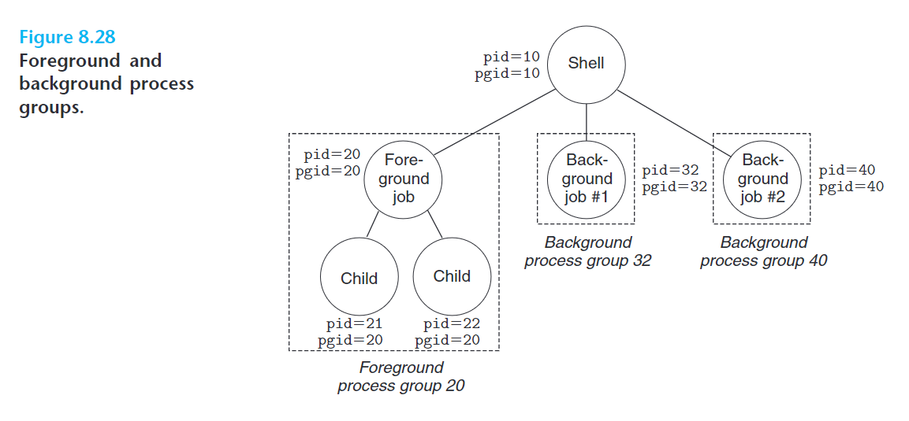
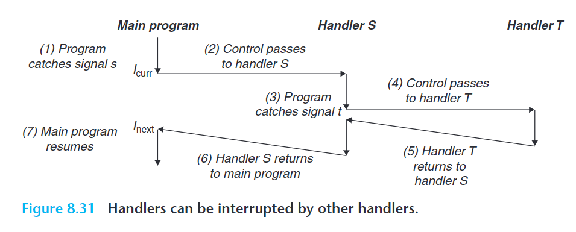
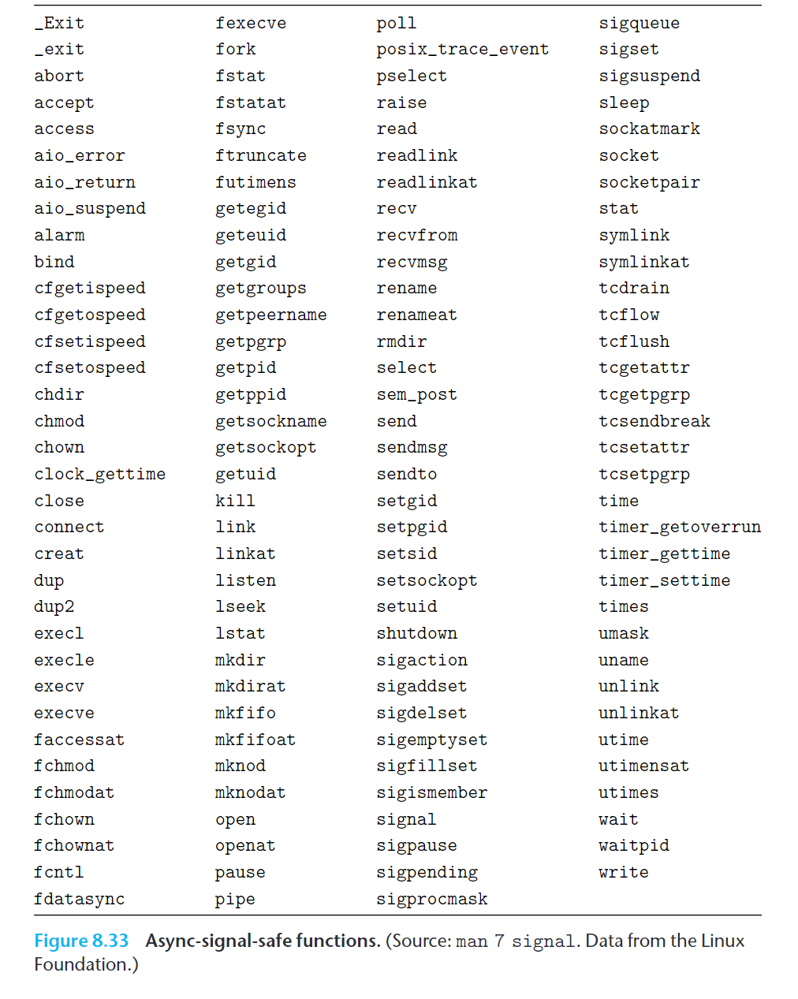

- [链接](#链接)
  - [编译器驱动程序](#编译器驱动程序)
  - [静态链接](#静态链接)
  - [目标文件](#目标文件)
  - [可重定位目标文件](#可重定位目标文件)
  - [符号和符号表](#符号和符号表)
    - [连接属性](#连接属性)
    - [符号表](#符号表)
  - [符号解析](#符号解析)
    - [链接器如何解析多重定义的全局符号](#链接器如何解析多重定义的全局符号)
    - [与静态库链接](#与静态库链接)
    - [链接器如何使用静态库来解析引用](#链接器如何使用静态库来解析引用)
  - [重定位](#重定位)
    - [重定位条目](#重定位条目)
    - [重定位符号引用](#重定位符号引用)
      - [重定位 PC 相对引用](#重定位-pc-相对引用)
      - [重定位绝对引用](#重定位绝对引用)
  - [可执行目标文件](#可执行目标文件)
  - [加载可执行目标文件](#加载可执行目标文件)
  - [动态链接共享库](#动态链接共享库)
  - [从应用程序中加载和链接共享库](#从应用程序中加载和链接共享库)
  - [位置无关代码](#位置无关代码)
    - [PIC 数据引用](#pic-数据引用)
    - [PIC 函数调用](#pic-函数调用)
  - [库打桩机制](#库打桩机制)
    - [编译时打桩](#编译时打桩)
    - [链接时打桩](#链接时打桩)
    - [运行时打桩](#运行时打桩)
  - [处理目标文件的工具](#处理目标文件的工具)
- [异常控制流](#异常控制流)
  - [异常](#异常)
    - [异常处理](#异常处理)
    - [异常的类别](#异常的类别)
      - [中断](#中断)
      - [陷阱](#陷阱)
      - [故障](#故障)
      - [终止](#终止)
    - [Linux/x86-64 系统中的异常](#linuxx86-64-系统中的异常)
      - [Linux/x86-64 故障和终止](#linuxx86-64-故障和终止)
      - [Linux/x86-64 系统调用](#linuxx86-64-系统调用)
  - [进程](#进程)
    - [逻辑控制流](#逻辑控制流)
    - [并发流](#并发流)
    - [私有地址空间](#私有地址空间)
    - [用户模式和内核模式](#用户模式和内核模式)
    - [上下文切换](#上下文切换)
  - [系统调用错误处理](#系统调用错误处理)
  - [进程控制](#进程控制)
    - [获取进程 ID](#获取进程-id)
    - [创建和终止进程](#创建和终止进程)
    - [回收子进程](#回收子进程)
      - [判定等待集合的成员](#判定等待集合的成员)
      - [修改默认行为](#修改默认行为)
      - [检查已回收子进程的退出状态](#检查已回收子进程的退出状态)
      - [错误条件](#错误条件)
      - [`wait` 函数](#wait-函数)
      - [示例](#示例)
    - [让进程休眠](#让进程休眠)
    - [加载并运行程序](#加载并运行程序)
    - [利用 `fork` 和 `execve` 运行程序](#利用-fork-和-execve-运行程序)
  - [信号](#信号)
    - [信号术语](#信号术语)
    - [发送信号](#发送信号)
      - [进程组](#进程组)
      - [用 `/bin/kill` 程序发送信号](#用-binkill-程序发送信号)
      - [用键盘发送信号](#用键盘发送信号)
      - [用 `kill` 函数发送信号](#用-kill-函数发送信号)
      - [用 `alarm` 函数发送信号](#用-alarm-函数发送信号)
    - [接收信号](#接收信号)
    - [信号的阻塞和解除阻塞](#信号的阻塞和解除阻塞)
    - [编写信号处理程序](#编写信号处理程序)
      - [安全的信号处理](#安全的信号处理)
      - [正确的信号处理](#正确的信号处理)
      - [可移植的信号处理](#可移植的信号处理)
    - [同步流以避免讨厌的并发错误](#同步流以避免讨厌的并发错误)
    - [显式地等待信号](#显式地等待信号)
  - [非本地跳转](#非本地跳转)
  - [操作进程的工具](#操作进程的工具)
- [虚拟内存](#虚拟内存)

# 链接

链接可以执行于编译时（compile time）、加载时（load time）或运行时（run time）。

## 编译器驱动程序

- 预处理器 `cpp` 将 `main.c` 源代码翻译成一个 ASCII 码的中间文件 `main.i`
- C 编译器 `cc1` 将 `main.i` 编译为 ASCII 汇编文件 `main.s`
- 汇编器 `as` 将 `main.s` 翻译成**可重定位目标文件**（relocatable object file） `main.o`
- 链接器 `ld` 将 `main.o` 和其他必要的系统目标文件合并成一个**可执行目标文件**（executable object file） `main`。

当运行 `main` 时，`shell` 调用操作系统中的**加载器**（loader）函数，将 `main` 的代码和数据复制到内存，并将控制转移到程序的开头。

## 静态链接

Linux LD 就是静态链接器（static linker），它以**一组可重定位目标文件**和命令行参数作为输入，生成一个**完全链接的**、**可以加载和运行的可执行目标文件**作为输出。

链接器的主要任务是

- **符号解析**（symbol resolution）：将每个**符号引用**（symbol reference）与一个**符号定义**（symbol definition）关联起来
- **重定位**（relocation）：将每个符号定义与一个内存位置关联起来，然后修改所有对这些符号的引用，令它们指向这个内存位置

## 目标文件

目标文件有三种：

- **可重定位目标文件**（relocatable object file）：包含二进制代码和数据，可以与其他可重定位目标文件合并起来，创建一个可执行目标文件
- **可执行目标文件**（executable object file）：包含二进制代码和数据，可以直接复制到内存并执行
- **共享目标文件**（shared object file）：特殊的可重定位目标文件，可以在加载或运行时被动态地加载进内存和链接

编译器和汇编器可以生成**可重定位目标文件**和**共享目标文件**。

一个**目标模块**（object module）就是一个抽象的字节序列，一个**目标文件**（object file）就是存储目标模块的实际文件。

目标文件格式：

- 第一个 Unix 系统使用 `a.out` 格式
- Windows 使用可移植可执行（Portable Executable, **PE**）格式
- MacOS-X 使用 **Mach-O** 格式
- 现代 x86-64 Linux 和 Unix 使用**可执行可链接格式**（Executable and Linkable Format, **ELF**）。

## 可重定位目标文件


**ELF 头**（ELF header）的内容：

- 16 字节序列描述系统的**字大小**（word size）和**字节顺序**（byte ordering）
- ELF 头的大小
- 目标文件类型（可重定位、可执行、共享）
- 机器类型（x86-64）
- **节头部表**（section header table）的文件偏移
- 节头部表中的条目数和条目大小。

节头部表中的每个条目（entry）大小固定，描述不同节的位置和大小。

以下是典型的 ELF 文件的节，它们夹在 ELF 头和节头部表之间：

- `.text`：程序代码
- `.rodata`：**只读数据**，如字符串常量、`switch` 跳转表
- `.data`：**已定义的符号**（已被非零初始化的全局和静态变量）
- `.bss`：**（试探性定义的静态符号）、被零初始化的符号**（未被显式初始化的静态变量或被零初始化的全局和静态变量）。它不占用实际空间。
- `.symtab`：**符号表**，包含程序中定义和引用的符号的信息。
- `.rel.text`：**`.text` 节的重定位表**。一般而言，调用外部函数或引用全局变量的指令需要修改，而调用本地函数的指令不需要。可执行目标文件中不需要重定位信息，因此通常省略，除非显式指定。
- `.rel.data`：**被模块引用或定义的所有全局变量的重定位表**。任何已初始化的全局变量，若其初始值是一个全局变量地址或外部定义函数的地址，那么就需要被修改
- `.debug`：**调试符号表**。条目包括程序中定义的**局部变量**和 `typedef`、程序中定义和引用的全局变量以及原始 C 源代码。只有在使用 `-g` 编译选项时才会出现。
- `.line`：原始 C 代码中的**行号**和 `.text` 节机器指令的映射。只有在使用 `-g` 编译选项时才会出现。
- `.strtab`：**字符串表**。内容包括 `.symtab` 和 `.debug` 节中的符号名字，以及节头部表中的节名。是以 `null` 结尾的字符串序列。

区分 `.data` 和 `.bss` 的意义是节省磁盘空间，运行时在内存中分配这些变量，并初始化为零

不使用 `-g` 编译选项也能得到符号表，除非用 STRIP 命令去掉它。和编译器中的符号表不同，`.symtab` 不包含局部变量的条目

> `.bss` 得名于 IBM 704 汇编中“块存储开始（Block Storage Start）”指令。助记：Better Save Space

## 符号和符号表

### 连接属性

声明是向代码中引入名字的语法。这些名字可以声明在**命名空间作用域**（**全局作用域**）、**类作用域**和**复合语句（块）作用域**中。

```c++
int a;          // 命名空间作用域
struct A {
    int b();    // 类作用域
};
int main() {    // 命名空间作用域
    int c;      // 复合语句作用域
}
```

每个名字具有一个称为**连接**的属性，连接有三种：**外部连接**（external linkage）、**内部连接**（internal linkage）和**无连接**（no linkage）。

所有复合语句作用域的声明都是无连接的。

- 无连接的名字由于作用域限制，自然不会影响链接过程
- 内部连接的名字是每个翻译单元独有的，与其他翻译单元中的同名符号互不干扰
- 外部连接的名字是所有翻译单元共享的

称带有内部连接或外部连接的函数名和变量名为**符号**（symbol）。

1. 类型（类、枚举类型、别名）总是外部连接的
2. 默认情形下，符号是外部连接的
3. 用 `static` 修饰一个符号，可以让它成为内部连接的；用 `extern` 修饰一个符号，可以让它成为外部连接的

### 符号表

```c++
int f(void) {
    static int x = 0;
    return x;
}

int g(void) {
    static int x = 1;
    return x;
}

// 同名的静态局部变量会被编译器（向汇编器）输出成两个不同名字的符号
```

符号表 `.symtab` 由**汇编器**根据 `.s` 文件中的名字构造。

符号表**不但包括符号，还包括静态局部变量**，除此之外还可以包含**各个节**的条目，以及**对应原始源文件的路径名**的条目。

`.symtab` 节的 ELF 符号表是一个条目数组，条目格式如下：

```c
typedef struct {
    int name;            // String table offset, pointing to symbol name
    char type: 4,        // OBJECT/FUNC/FILE/SECTION/..., 4 bits
         binding: 4;     // Local/Global, 4 bits
    char reserved;       // Unused
    short section;       // Section header index
    long value;          // Symbol address.
    long size;           // Object size in bytes
} Elf64_Symbol;
```

`value` 是符号地址，对于可重定位模块，是**距离定义目标的节的起始位置的偏移**；对于可执行目标文件，是**绝对运行时地址**。

每个符号被分配到目标文件的某个节，由 `section` 字段指示。`section` 字段是一个到节头部表的索引。

在**可重定位目标文件**有三个**伪节**（pseudosection），它们在节头部表中没有条目：

- ABS 代表**不该被重定位的符号**
- UNDEF 代表**本模块中被引用，但未定义的符号**
- COMMON 代表还未被分配位置的未初始化的数据目标，即**被试探性定义的全局符号**。对于此目标，`value` 字段给出对齐要求，而 `size` 给出最小大小

**可执行目标文件中没有以上伪节**。

如果指定了 `-fcommon` 编译选项，gcc 会将被试探性定义的全局符号分配到 COMMON 节，以让链接器选择定义。**未初始化的静态变量**和**零初始化的全局或静态变量**照常被分配到 `.bss` 节。

可以用 GNU `readelf` 程序查看目标文件内容。

```c
// t.c
#include <stdio.h>

int glob_var_0 = 0;          // .bss
int glob_var_1 = 1;          // .data

int glob_var_tentative;      // .bss if -fno-common, .COMMON if -fcommon

static int static_var_0 = 0;        // .bss
static int static_var_1 = 1;        // .data
static int static_var_tentative;    // .bss, no matter -fno-common or -fcommon

int func_called(void);    // in symbol table

int func_not_called(void);    // not in symbol table

int main(void) {
    int local_var = 0;         // not in symbol table

    static int static_local_var_0 = 0;       // .bss
    static int static_local_var_1 = 1;       // .data
    static int static_local_var_tentative;   // .bss, no matter -fno-common or -fcommon
    func_called();
}
```

```bash
gcc -fcommon -c -o t t.c; readelf -s t

Symbol table '.symtab' contains 15 entries:
   Num:    Value          Size Type    Bind   Vis      Ndx Name
     0: 0000000000000000     0 NOTYPE  LOCAL  DEFAULT  UND
     1: 0000000000000000     0 FILE    LOCAL  DEFAULT  ABS t.c
     2: 0000000000000000     0 SECTION LOCAL  DEFAULT    1 .text
     3: 0000000000000004     4 OBJECT  LOCAL  DEFAULT    4 static_var_0
     4: 0000000000000004     4 OBJECT  LOCAL  DEFAULT    3 static_var_1
     5: 0000000000000008     4 OBJECT  LOCAL  DEFAULT    4 static_var_tentative
     6: 0000000000000000     0 SECTION LOCAL  DEFAULT    5 .rodata
     7: 000000000000000c     4 OBJECT  LOCAL  DEFAULT    4 static_local_var[...]
     8: 0000000000000008     4 OBJECT  LOCAL  DEFAULT    3 static_local_var_1.1
     9: 0000000000000010     4 OBJECT  LOCAL  DEFAULT    4 static_local_var_0.0
    10: 0000000000000000     4 OBJECT  GLOBAL DEFAULT    4 glob_var_0
    11: 0000000000000000     4 OBJECT  GLOBAL DEFAULT    3 glob_var_1
    12: 0000000000000004     4 OBJECT  GLOBAL DEFAULT  COM glob_var_tentative
    13: 0000000000000000    48 FUNC    GLOBAL DEFAULT    1 main
    14: 0000000000000000     0 NOTYPE  GLOBAL DEFAULT  UND puts

# 1: .text
# 2: .rela.text
# 3: .data
# 4: .bss
# 5: .rodata
# 11: .symtab
# 12: .strtab
```

注意：

- **只声明过但未调用的函数**不会出现在符号表中
- 名字若在符号表中，则它一定也**在 `.strtab` 字符串表中**
- 符号表中，静态局部变量会被加上后缀 `.0`、`.1`、`.2` 等，以作区分

readelf 打印出的 `LOCAL` 表示此名字是**内部连接**或**无连接**（对应静态局部变量）的，`GLOBAL` 表示此名字是**外部连接**的。

## 符号解析

**链接器将每个符号引用与它参数中的可重定位目标文件的符号表中的一个确定的符号定义关联起来**的过程，就是符号解析。

对于引用和定义在同一模块中的局部符号，符号解析是简单的。编译器只允许每个模块中每个局部符号有一个定义。对于局部静态变量，编译器需要保证它们本地链接器符号唯一。

当编译器遇到一个**未在当前模块定义的全局符号**时，会假设它是在其他某个模块中定义的，**生成一个链接器符号表条目**，并将它交给链接器处理。若链接器在它的任何输入模块中都找不到该符号的定义，就输出一条错误信息并终止。

### 链接器如何解析多重定义的全局符号

单一定义原则（One Definition Rule, ODR）：

- 一个翻译单元中，允许出现一个变量、函数或类型的多次声明，但至多只允许出现一次定义
- 一个翻译单元中，如果 *ODR-使用*了一个符号，那么它至少要出现一次定义
- 整个程序中，非内联的符号最多只允许出现一次定义

忘记写 `main` 函数不会报编译错误，而是链接错误：`main` 函数被 ODR-使用，但找不到定义。

```c++
// a.cpp
inline void f() {
    // ...
}

// b.cpp
inline void f() {
    // ...
}

// 此例中，f 是内联的，因此可以在两个翻译单元中重复定义
// 这两个定义必须完全一致，否则是未定义行为
```

如下的不带 `static` 或 `extern` 的全局变量声明在 C++ 中是变量 `a` 的定义，且 `a` 是外部连接的。

但在 C 中，这样的声明称为**试探性定义**（tentative definition）。

```c
int a;
```

当试探性定义与一个同名的“正常定义”**同时出现**时，试探性定义成为声明。否则，这些试探性定义中的某一个成为定义，其余成为声明。

> 在标准中，“同时出现”的范围是同一个翻译单元。在某些实现（如 Linux 的 ELF 格式）中，这个范围可以是多个翻译单元。在此情况下，称“正常定义”的符号为**强符号**，试探性定义的符号为**弱符号**。

汇编器将符号强弱的信息隐含地编码在可重定位目标文件的符号表。

- 在链接时，强符号只能出现一次（对应单一定义原则）
- 多个弱符号可伴随一个强符号同时链接（弱符号——试探性定义——退化为声明）
- 没有强符号时，在多个弱符号中任选一个成为定义。

以下是一个有关符号解析造成的错误的例子：

```c
// foo.c
#include <stdio.h>
void f(void);

int y = 15212;
int x = 15213;

int main() {
    f();
    printf("x = 0x%x y = 0x%x\n", x, y);
}

// bar.c
double x;

void f() {
    x = -0.0;
}
```

在 x86-64/Linux 机器上，`f()` 将会用 `0.0` 覆盖 `foo.c` 中的 `x` 和 `y` 变量，并触发链接器发出一条 Warning: alignment 4 of symbol 'x' in somefile.o is smaller than 8 in otherfile.o。

可以用 `-fno-common` 调用 gcc，将试探性定义的全局变量放在 `.bss` 节，从而禁止链接器对不同翻译单元的试探性定义的合并，使得链接器在遇到此类情况时报重定义错误（这已经成为默认选项）。

`-Werror` 可以把所有警告变为错误。

### 与静态库链接

编译系统提供一种机制, 将多个翻译单元打包成一个单独的文件, 称为**静态库**（static library）。当静态库作为链接器的输入时，链接器**只从静态库复制被引用了的目标模块**。

> ISO C99 定义了许多标准函数。
> 如果编译器将这些函数直接集成在编译器里，那么编译器的复杂性就会大大提升，且标准函数的更新会和编译器版本绑定。
> 如果将所有标准函数放在一个单独的可重定位目标模块（例如 `libc.o`），那么每个可执行文件都需要包含一份所有标准函数的副本，会浪费许多磁盘和内存空间，并且每个函数的更新都会导致库的重新编译。
> 如果为每个标准函数创建一个独立的可重定位目标文件（例如 `printf.o`），那么使用时就太麻烦了。
> 因此，静态库的概念被提出了。

使用静态库时，一个使用 C 标准库和数学库的程序可以这样编译链接：

```bash
gcc main.c /usr/lib/libm.a /usr/lib/libc.a
# 实际上 libc.a 会被 C compiler driver 自动传送 因此不必显式指定
```

Linux 中，静态库以**存档**（archive）格式存放在磁盘中，以 `.a` 标识。它是一组连接起来的可重定位目标文件的集合，有一个 header 来描述每个成员目标文件的大小和位置。

以下是一个创建并使用静态库的例子：

```bash
gcc -c foo.c bar.c              # compile, assemble, but don't link
ar rcs libfoobar.a foo.o bar.o  # 打包成静态库

gcc -c main.c    # 设 main.c 只引用了 foo.c 中的符号
gcc -static -o my-prog main.o ./libfoobar.a
# 或等价地：
gcc -static -o my-prog main.o -L. -lfoobar
```

链接器运行时，它判定 `main.o` 只引用了来自 `foo.o` 的符号，因此它从 `libfoobar.a` 中只复制 `foo.o` 到 `my-prog` 中（此外还可能包括 `libc.a` 中的 `printf.o`，以及其他 C 运行时系统中的其他模块）。

### 链接器如何使用静态库来解析引用

符号解析阶段，链接器扫描其输入参数（可重定位目标文件和存档文件）是按照**它们作为编译器驱动程序参数的顺序**的。

链接器维护三个集合，它们初始时均为空：

- **可重定位目标文件的集合** $E$
- **未解析的符号集合** $U$（即已被引用但尚未定义的符号集合）
- **已经定义的符号集合** $D$

对于每个输入文件 `f`，链接器可以判断它是目标文件还是存档文件：

- 如果 `f` 是**目标文件**，链接器将它添加到 $E$，并更新 $U$ 和 $D$。
- 如果 `f` 是**存档文件**，链接器尝试在 `f` 定义的符号中匹配 $U$ 中的每个未解析符号 $u$。如果匹配成功，将 `f` 中对应的模块 `m` 添加到 $E$，并更新 $U$ 和 $D$。

如果扫描完成后 $U$ 非空，那么链接器输出一个错误并终止，否则它会合并和重定位 $E$ 中的文件，构建输出的可执行文件。

```bash
# 这就导致了链接器的输入顺序很重要
# 例如以下命令将使链接器报错
gcc -static -L. -lfoobar -o my-prog main.o
```

我们一般**将静态库放在末尾**。并且如果库之间有依赖关系，我们还要对它们排序。如果 `libx.a` 和 `liby.a` 互相引用对方的符号，我们还需要让其中一个库重复出现（或将他们合并成一个存档文件）。

## 重定位

链接器完成符号解析后，就将每个符号引用和恰好一个符号定义（即输入目标模块中的一个符号表条目）关联起来。现在，链接器知道了它的输入目标模块中代码节和数据节的确切大小，可以开始重定位了。

重定位分为两步：

- **重定位节和符号定义**：
  - **将所有相同类型的节合并**（例如每个模块的 `.data` 被合并为输出可执行目标文件的 `.data`）
  - 将**运行时内存地址**赋给合并后的节、赋给输入模块定义的每个节以及赋给输入模块定义的每个符号。此后，程序中的从每条指令和全局变量都拥有了唯一的运行时内存地址。
- **重定位节中的符号引用**：修改代码节和数据节中的符号引用，使得它们指向正确的运行时内存地址。这一步依赖于可重定位目标模块中的**重定位条目**（relocation entry）。

### 重定位条目

汇编器不知道数据、代码和外部符号最终会被存放在什么位置。遇到最终位置未知的目标引用时，**汇编器生成一个重定位条目**，告诉链接器如何修改这个引用。

代码的重定位条目在 `.rel.text` 节中，已初始化数据的重定位条目在 `.rel.data` 节中。

```c
// ELF relocation entry
typedef struct {
    long offset;          // Offset from start of section to fixup
    long type: 32,        // Relocation type
         symbol: 32;      // Symbol table index
    long addend;          // Constant
} Elf64_Rela;
// 一些类型的重定位要使用 addend 对被修改引用的值做偏移调整
```

ELF 定义了 32 种重定位类型，我们关心两种：

- `R_X86_64_PC32`：重定位一个使用 32 位 PC 相对地址的引用。
- `R_X86_64_32`：重定位一个使用 32 位绝对地址的引用。

这两种引用类型支持 x86-64 小型代码模型（small code model），该模型假设可执行目标文件中的代码和数据的地址都可以用 **32 位有符号偏移量**表示（总体大小小于 2 GB）。

更大的程序可以使用 `-mcmodel=medium` 或 `-mcmodel=large` 编译选项。

### 重定位符号引用

以下代码描述了链接器的重定位算法。

我们把每个节看作一个字节数组，每个重定位条目是一个类型为 `Elf64_Rela` 的结构体，链接器已经为每个节和每个符号选择了运行时地址（用 `ADDR` 函数表示）

```c++
for (sec : sections) {
    for (r : relocation_entries) {
        refptr = sec + r.offset;    // ptr to reference to be relocated

        if (r.type == R_X86_64_PC32) {
            refaddr = ADDR(sec) + r.offset;  // ref's runtime address
            *refptr = (unsigned) (ADDR(r.symbol) + r.addend - refaddr);
        }

        else if (r.type == R_X86_64_32) {
            *refptr = (unsigned) (ADDR(r.symbol) + r.addend);
        }

        // For PC-relative references, addend equals to the length of the address (in this case, 4), b/c PC = refaddr + length

        // For absolute references, addend is zero
    }
}
```

以如下代码为例，`main` 函数分别用 PC 相对引用和绝对引用的方式引用了全局符号 `sum` 和 `array`。

```c
// sum.c
int sum(int* a, int n) {
    // ...
    return 1;
}

// main.c
int sum(int* a, int n);    // defined in sum.o
int arr[2] = {1, 2};
int main() {
    int val = sum(array, 2);
    return val;
}

// objdump -dx main.o
// 0000000000000000 <main>:
0x0:    48 83 ec 08        sub    $0x8, %rsp
0x4:    be 02 00 00 00     mov    $0x2, %esi
0x9:    bf 00 00 00 00     mov    $0x0, %edi        // arr
                        a: R_X86_64_32  array
0xe:    e8 00 00 00 00     callq  13 <main+0x13>    // sum
                        f: R_X86_64_PC32  sum-0x4
0x13:   48 83 c4 08        add    $0x8, %rsp
0x17:   c3                 retq
```

#### 重定位 PC 相对引用

`main` 函数调用外部函数 `sum`，相应的重定位条目如下：

```c
// relocation entry of sum
re = {
    re.offset = 0xf,
    re.symbol = sum,
    re.type = R_X86_64_PC32,
    re.addend = -4
};
```

链接器将会在 `<main+0xf>` 中填入 32 位 PC 相对地址：

```c
// 假设 ADDR(.text) == 0x4004d0, ADDR(sum) == 0x4004e8
refaddr = ADDR(sec) + re.offset
        = ADDR(.text) + 0xf
        = 0x4004df;

*refptr = (unsigned) (ADDR(re.symbol) + re.addend - refaddr)
        = (unsigned) (ADDR(sum) + (-4) - 0x4004df)
        = 0x4004e8 - 0x4004df - 4
        = 0x5;

// So 0x5 is filled in <main+0xf>, and the corresponding instruction becomes:
0x4004de:    e8 05 00 00 00     callq  4004e8 <sum>
```

#### 重定位绝对引用

```c
re = {
    re.offset = 0xa,
    re.symbol = arr,
    re.type = R_X86_64_32,
    re.addend = 0
};
```

链接器在 `<main+0xa>` 填入 32 位绝对地址：

```c
// 假设 ADDR(arr) == 0x601018
*refptr = (unsigned) (ADDR(re.symbol) + re.addend)
        = 0x601018;

// The corresponding instruction becomes:
0x4004d9:    bf 18 10 60 00     mov    $0x601018, %edi
```

最后，以下是最终可执行目标文件的 `.data` 节：

```c
0000000000601018 <arr>:
    0x601018:    01 00 00 00 02 00 00 00
```

## 可执行目标文件


ELF 头中的 `e_entry` 字段指示了程序的**入口点**（entry point），即程序首条指令的地址。

`.init` 节定义了一个小函数 `_init`，程序的初始化代码会调用它。

可执行文件已经**完全链接**（已被重定位），它不需要 `rel` 节。

ELF 被设计地很容易加载到内存。可执行文件的连续的**片**（chunk）被映射到连续的内存段。**程序头部表**（program header table）描述了这种映射关系。


根据可执行文件的内容，两个内存段的内容会被初始化。

**代码段**（code segment）有读 / 执行访问权限，开始于内存地址 `0x400000` 处，总共在内存中占 `0x69c` 字节，并且它被初始化为可执行目标文件的头 `0x69c` 个字节（这包括 ELF 头、程序头部表，以及 `.init`、`.text` 和 `.rodata` 节）

**数据段**（data segment）有读 / 写访问权限，开始于内存地址 `0x600df8` 处，总共在内存中占 `0x230` 字节，并且它被初始化为可执行目标文件中偏移 `0xdf8` 处起的 `0x228` 个字节（位于 `.data` 节），其余 `8` 个字节对应于在运行时被初始化为 `0` 的 `.bss` 数据。

对于任何段 `s`，链接器所选择的起始地址 `vaddr` 必须满足

$$\operatorname{vaddr}\equiv\operatorname{off}\pmod{\operatorname{align}},$$

其中 `off` 是**段的首字节在目标文件中的偏移量**，`align` 是程序头部中指定的对齐（此处为 $2^{21}=0x200000$）。这种对齐加快了段传送到内存的效率。

## 加载可执行目标文件

在 Linux shell 中运行可执行目标文件时，shell 调用某个驻留在存储器中称为**加载器**（loader）的操作系统代码来运行它。

加载器将可执行目标文件中的代码和数据从磁盘复制到内存（称为**加载**），然后跳转到程序的首条指令或入口点。

任何 Linux 程序都可以通过调用 `execve` 函数来调用加载器。


在 Linux x86-64 系统中，代码段总是从内存地址 `0x400000` 开始，后面跟着数据段、运行时堆。堆后的区域为共享模块保留，用户栈总是从最大的合法用户地址 $2^{48}-1$ 开始，向内存地址减小的方向增长。栈以后的区域（从地址 $2^{48}$ 起）为**内核**中的代码和数据保留。

我们将堆、数据和代码段化成了相邻的，并且栈顶在最大合法用户地址处。实际上由于 `.data` 段的对齐要求，代码段和数据段有间隙。同时，在分配栈、共享库和堆的运行时地址时，链接器还会使用**地址空间布局随机化**（ASLR）。

加载器运行时会创建像这样的内存映像，然后经历以下步骤：

- 在程序头部表的引导下，加载器**将可执行文件的片复制到代码段和数据段**
- 跳转到程序入口点，即 `_start` 函数的地址（它在系统目标文件 `ctrl.o` 中定义）
- `_start` 调用系统启动函数 `_libc_start_main`（在 `libc.so` 中定义）
- `_libc_start_main` 初始化执行环境，调用用户层的 `main` 函数，处理 `main` 的返回值，并在需要的时候将控制返回给内核。

> 更准确地，Linux 的每个程序运行在一个进程上下文中，有自己的虚拟地址空间。
> shell 运行一个程序时，父 shell 进程生成一个子进程，它是父进程的一个复制。
> 子进程通过 `execve` 系统调用启动加载器，加载器删除子进程现有的虚拟内存段，创建一组新的代码、数据、堆和栈段。新的栈和堆被初始化为零。通过将虚拟地址空间中的页映射到可执行文件的页大小的片（chunk），新的代码和数据段被初始化为可执行文件的内容。
> 最后，加载器跳转到 `_start` 地址。
> 除了一些头部信息，在加载过程中没有任何从磁盘到内存的数据复制，直到 CPU 引用一个被映射的虚拟页时才会进行复制。此时，操作系统利用其页面调度机制自动将页面从磁盘传送到内存。

## 动态链接共享库

静态库仍然有一些问题：

- 静态库需要用户时时更新, 重新链接
- 标准 I/O 函数如 `printf` 和 `scanf` 的代码被几乎所有程序使用，它们在运行时会被复制到每个运行进程的文本段里，造成极大的浪费

**共享库**（shared library）: 又称**共享目标**（shared object），是一种特殊的目标模块。它**在运行或加载时可以被加载到任意的内存地址**，并可以和在内存中的程序链接起来，这个过程称为**动态链接**（dynamic linking），由动态链接器（dynamic linker）完成。

共享库在 Linux 中通常以后缀名 `.so` 标识，Windows 中以 `.dll` 标识。

- 在**文件系统中**，一个共享库只有一个 `.so` 文件，所有引用共享库的可执行目标文件**共享这个 `.so` 文件的代码和数据**，而不像静态库一样将其内容复制并嵌入其可执行文件中
- 在**内存中**，共享库的`.text` 节的副本可以被不同的引用它的进程共享

创建共享库：

```bash
# -fpic: 生成位置无关代码; -shared: 生成共享目标
gcc -shared -fpic -o libfoobar.so foo.c bar.c
gcc -o my-prog main.c ./libfoobar.so
# my-prog 会在运行时动态链接 libfoobar.so
```

`my-prog` 运行时可以和 `libfoobar.so` 链接。

创建可执行文件 `my-prog` 时静态执行了一些链接，程序加载时，动态完成链接的过程。此时，**没有任何 `libfoobar.so` 的代码和数据节被真的复制到 `my-prog` 中**，链接器只复制了一些重定位和符号表信息，它们使得运行时可以解析对 `libfoobar.so` 的引用。

加载器照常加载 `my-prog`，它会注意到 `my-prog` **包含一个 `.interp` 节**，其中包含动态链接器的路径名。**动态链接器本身就是一个共享目标**（在 Linux 上，`ld-linux.so`）。加载器不会像通常一样将控制传递给应用，而是**加载和运行动态链接器**，然后动态链接器执行以下重定位完成链接任务：

- 重定位 `libc.so` 的文本和数据到某个内存段
- 重定位 `libfoobar.so` 的文本和数据到另一个内存段
- 重定位 `my-prog` 中所有对由 `libc.so` 和 `libfoobar.so` 定义的符号的引用

最后，动态链接器将控制传递给应用程序，此时起共享库的位置就固定了，并且在应用程序执行过程中都不会改变。

这是在应用程序**被加载后、被执行前**，动态链接器加载并链接共享库的情景。

## 从应用程序中加载和链接共享库

应用程序还可能在**运行时**要求动态链接器加载和链接共享库，而而无需在调用编译驱动程序时将那些库链接到应用内。

这种动态链接的一些应用：

- **分发软件**：Windows 应用的开发者常常利用共享库分发软件更新。他们生成共享库的新版本，用户下载并用它替换当前版本，下次他们运行应用程序时，应用就能自动链接并加载新的共享库
- **构建高性能 Web 服务器**：早期 Web 服务器通过使用 `fork` 和 `execve` 创建子进程，并在该子进程的上下文中运行 CGI 程序来生成动态内容。现代高性能 Web 服务器使用动态链接更高效地生成动态内容。其思路是将每个生成动态内容的函数打包在共享库，当一个来自 Web 服务器的请求到达时，服务器动态地加载和链接适当的函数，然后直接调用它，而不是使用 `fork` 和 `execve` 创建子进程并在其上下文中运行函数。函数会一直缓存在服务器的地址空间中，后续请求的开销就降低到一个简单的函数调用开销，并且运行时无需停止服务器即可更新已存在的函数或添加新函数

```c
#include <dlfcn.h>

// Linux 为动态链接器提供了 `dlopen` 接口
// 允许应用程序在运行时加载和链接共享库
void* dlopen(const char* filename, int flag);

// 若成功，返回指向句柄的指针，否则返回 NULL
```

`flag` 选项要么包括 $\text{RTLD\_NOW}$，指示链接器立即解析对外部符号的引用，要么包括 $\text{RTLD\_LAZY}$，指示链接器推迟符号解析直到执行来自库中的代码。这两个值都可以与 $\text{RTLD\_GLOBAL}$ 取或，它指示此库中定义的符号可以在后续的动态链接中被解析。

```c
int* dlsym(void* handle, char* symbol);
// handle 是指向已打开的共享库的句柄，symbol 是符号名
// 若 symbol 存在，则返回其地址，否则返回 NULL

int dlclose(void* handle);
// 若没有其他共享库仍在使用该共享库，dlclose 就卸载此共享库

const char* dlerror(void);
// 返回字符串，描述调用 dlopen, dlsym 或 dlclose 时发生的最近的错误，若没有错误则返回 NULL
```

以下示例展示了如何利用这些接口动态链接 `libfoobar.so` 共享库，并调用它的 `foo_func` 例程

```c
#include <dlfcn.h>
#include <stdio.h>
#include <stdlib.h>

int x[2] = {1, 2};

int main() {
    void* handle;
    void (*foo_func)(int*, int);
    char *error;

    handle = dlopen("./libvector.so", RTLD_LAZY);
    if (!handle) {
        fprintf(stderr, "%s\n", dlerror());
        exit(1);
    }

    foo_func = dlsym(handle, "foo_func");
    if ((error = dlerror()) != NULL) {
        fprintf(stderr, "%s\n", error);
        exit(1);
    }

    foo_func(x, 2);

    if (dlclose(handle) < 0) {
        fprintf(stderr, "%s\n", dlerror());
        exit(1);
    }

    return 0;
}
```

以上程序用如下命令编译：

```bash
gcc -rdynamic -o my-prog dll.c -ldl
```

`-rdynamic` 选项使得**可执行文件里的全局符号对于动态链接器可见**。以下是一个例子：

```c
// bar.c, compiled into libbar.so
extern void foo(void);
void bar() {
    foo();
}
// shared library libbar.so references a symbol defined in main.o

// main.c
#include <dlfcn.h>
#include <stdio.h>
#include <stdlib.h>

void foo(void) {
    printf("Hello, world!\n");
}

int main(void) {
    void* dlh = dlopen("./libbar.so", RTLD_NOW);
    if (!dlh) {
        fprintf(stderr, "%s\n", dlerror());
        exit(1);
    }

    void (*bar)(void) = dlsym(dlh, "bar");

    if (!bar) {
        fprintf(stderr, "%s\n", dlerror());
        exit(1);
    }

    bar();
}
```

```bash
gcc -c -Wall -o -main.o main.c
gcc -c -Wall -fpic -o -bar.o bar.c
gcc -shared -o libbar.so bar.o
gcc -o prog main.o -L. -lbar -ldl    # 不带 -rdynamic

./prog
./libbar.so: undefined symbol: foo
# 可见 main.o 中的符号对于动态链接器来说不可见

# 为了成功运行 第四行需要添加 -rdynamic 选项
gcc -rdynamic -o prog main.o -L. -lbar -ldl
./prog
Hello, world!

# Symbol are only exported by default from shared libraries. -rdynamic tells linker to do the same for executables (like main.o).
```

> Java 定义了一个标准调用规则，称为 Java 本地接口（Java Native Interface, JNI），它允许 Java 程序调用“本地的”C/C++ 函数。其基本思想是将本地 C/C++ 函数编译到一个共享库，并利用 `dlopen`（或类似的接口）动态链接和加载这个共享库，实现函数调用。

## 位置无关代码

如何实现让多个运行中进程共享内存中相同的库代码？

一种**不可行**的方法：**为每个共享库分配一个事先预备的专用地址空间片**，要求加载器总是在这个地址上加载共享库。这种方法对地址空间的使用较低效（即使进程不使用这个库，空间还是会被分配），并且它难以管理：必须保证没有片会重叠，并且当库被修改后，还必须重新确认它的片是否还适合其大小，如果不适合，就必须重新分配一个新的片。随着库数量的增多，系统的地址空间四分五裂，造成许多未使用而又使用不了的小洞。更糟的是，对每个系统，库在内存中的分配都是不同的，使得管理难上加难。

**位置无关代码**（Position-Independent Code, **PIC**）：**可以加载而无需重定位**的代码。

通过对 gcc 使用 `-fpic` 选项，可以生成 PIC 代码，使得**代码可以被加载到内存的任何位置而无需链接器修改**，于是无限多个进程可以轻松共享一个共享模块的代码段的单一副本。

共享库的编译必须总是使用 `-fpic` 选项。

在 x86-64 系统中，对同一个目标模块中符号的引用可以用 PC 相对寻址来编译，构造目标文件时由静态链接器重定位，就像我们之前讨论的一样。但是，对于定义在外部的符号，就需要特殊的技巧引用：

### PIC 数据引用

我们指出：无论一个目标模块（包括共享目标模块）在内存的何处被加载，其**数据段与代码段的距离总是保持不变**。

生成对全局变量的 PIC 引用时，编译器**在数据段开始的地方**创建一个**全局偏移量表**（Global Offset Table, **GOT**）。

在 GOT 中，每个被当前目标模块引用的（外部）符号都有一个 **8 字节条目**。编译器还为 GOT 中每个条目生成一个重定位记录。

加载时，**动态链接器重定位 GOT 中的每个条目**，使得它包含目标正确的绝对地址。

每个引用全局目标的模块都有自己的 GOT。


不过，因为 `addcnt` 是在 `libvector.so` 模块内部定义的，编译器实际可以产生对 `addcnt` 的直接 PC 相对引用，并增加一个重定位，让静态链接器在构造此共享模块时解析它，不需要为它生成 GOT 条目。

此处编译器采用了最通用的方案，为所有引用使用 GOT。

### PIC 函数调用

假设程序调用一个定义在共享库中的函数，那么编译器在此共享模块加载前无法预测这个函数的运行时地址。

如果为该函数引用生成一条重定位记录，让动态链接器在程序加载的时候解析它，即需要链接器修改调用模块的代码段，这样就不是 PIC 的了。

GNU 编译系统使用**延迟绑定**（lazy binding）技术，将过程地址的绑定推迟到第一次调用该过程时。**第一次调用过程的运行时开销很大**，但此后的每次调用都只需要花费一条指令和一个间接的内存引用。

**过程链接表**（Procedure Linkage Table, PLT）：PLT 是一个数组，其中每个条目是 16 字节代码。

每个被可执行程序调用的库函数都有它自己的 PLT 条目，每个条目负责调用一个具体的函数。

- `PLT[0]` 是一个特殊条目，它跳转到**动态链接器**。
- `PLT[1]` 调用**系统启动函数 `__libc_start_main`**，它初始化执行环境，调用 `main` 并处理其返回值。
- 从 `PLT[2]` 开始的条目调用用户代码调用的函数。

GOT 和 PLT 联合使用时：

- **`GOT[0]` 和 `GOT[1]` 包含动态链接器在解析函数地址时会使用的信息**。
- `GOT[2]` 是**动态链接器在 `ld-linux.so` 模块中的入口点**
- 其余的 `GOT` 条目对应于一个被调用的函数，其地址需要在运行时被解析。

每个 GOT 条目都有一个对应的 PLT 条目，例如 `GOT[4]` 对应于 `PLT[2]`。

初始时，每个 GOT 条目都**指向对应 PLT 条目的第二条指令**。

一个目标模块如果调用了定义在共享库的任何函数，它就会有自己的 GOT 和 PLT。GOT 在数据段，而 PLT 在代码段。


首次执行 `callq addvec` 时：

1. `callq` 实际的参数是 `PLT[2]` 的地址，即 `addvec` 的 PLT 条目
2. `PLT[2]` 中，程序跳转到 `*GOT[4]`，初始时这相当于跳转到 `PLT[2]` 的第二条指令
3. 将 `addvec` 的 ID `0x1` 压栈，然后跳转到动态链接器对应的条目 `PLT[0]`
4. `PLT[0]` 将动态链接器的参数 `GOT[1]` 压栈，然后间接跳转到动态链接器的入口点 `GOT[2]`。动态链接器使用刚刚压栈的两个参数确定 `addvec` 的运行时地址，用它重写 `GOT[4]`，再把控制传递给 `addvec`。

后续调用 `addvec` 时就可以直接经由 `PLT[2]` 跳转到 `addvec`，而不需要经过动态链接器。

## 库打桩机制

**库打桩**（library interpositioning）：允许截获对共享库函数的调用，取而代之执行自己的代码。

### 编译时打桩

```c
// int.c
#include <stdio.h>
#include <malloc.h>  // 这里的 malloc.h 是本地的 malloc.h 文件, 而不是 system include 目录下的 malloc.h

int main() {
    int* p = malloc(32);
    free(p);
}
```

```c
// 本地 malloc.h 文件
// 指示预处理器用对包装函数的调用替换掉对目标函数的调用
#define malloc(size) mymalloc(size)
#define free(ptr) myfree(ptr)

void* mymalloc(size_t size);
void myfree(void* ptr);
```

```c
// mymalloc.c
#ifdef COMPILETIME
#include <stdio.h>
#include <malloc.h>  // 这里的 malloc.h 是 system include 目录下的 malloc.h

// 包装函数
void* mymalloc(size_t size) {
    void* ptr = malloc(size);
    printf("malloc(%d) = %p\n", (int)size, ptr);
    return ptr;
}

void myfree(void* ptr) {
    free(ptr);
    printf("free(%p)\n", ptr);
}
#endif
```

```bash
gcc -DCOMPILETIME -c mymalloc.c
gcc -I. -o intc int.c mymalloc.o
# -I. 告诉预处理器在搜索通常的 system include 目录之前先在 . 目录查找头文件
# 注意 mymalloc.c 中的包装函数是使用 malloc.h 头文件编译的

./intc
# 可以得到追踪信息
```

### 链接时打桩

```c
// mymalloc.c
#ifdef LINKTIME
#include <stdio.h>

void* __real_malloc(size_t size);
void __real_free(void* ptr);

void* __wrap_malloc(size_t size) {
    void* ptr = __real_malloc(size);
    printf("malloc(%d) = %p\n", (int)size, ptr);
    return ptr;
}

void __wrap_free(void* ptr) {
    __real_free(ptr);
    printf("free(%p)\n", ptr);
}
#endif
```

Linux 静态链接器支持用 `--wrap f` 标志进行链接时打桩。

此标志将对符号 `f` 的引用解析成 `__wrap_f`，并将对符号 `__real_f` 的引用解析为 `f`

```bash
gcc -DLINKTIME -c mymalloc.c
gcc -c int.c

gcc -Wl,--wrap,malloc -Wl,--wrap,free -o intl int.o mymalloc.o
# -Wl,option 将 option 参数传递给链接器 (每个逗号被替换成空格)
# 这里就把 --wrap malloc 以及 --wrap free 作为参数传递给链接器
```

### 运行时打桩

编译时打桩需要能够访问程序源代码，链接时打桩需要能够访问程序的可重定位对象文件，但运行时打桩只需要能够访问可执行目标文件。这基于动态链接器的 $\text{LD\_PRELOAD}$ 环境变量。

如果 $\text{LD\_PRELOAD}$ 被设置为一个**共享库路径名的列表**（以空格或分号分隔），那么在当加载或执行程序的时候需要解析未定义引用时，动态链接器（`ld-linux.so`）会先搜索 $\text{LD\_PRELOAD}$ 中的库，然后再搜索其他任何库。

```c
// mymalloc.c
#ifdef RUNTIME
#define _GNU_SOURCE
#include <stdio.h>
#include <stdlib.h>
#include <dlfcn.h>

void* malloc(size_t size) {
    void* (*mallocp)(size_t size);
    char* error;

    mallocp = dlsym(RTLD_NEXT, "malloc");
    if ((error = dlerror()) != NULL) {
        fputs(error, stderr);
        exit(1);
    }

    char* ptr = mallocp(size);

    printf("malloc(%d) = %p\n", (int)size, ptr);
    return ptr;
}

void free(void* ptr) {
    void (*freep)(void*) = NULL;
    char* error;

    if (!ptr) return;

    freep = dlsym(RTLD_NEXT, "free");
    if ((error = dlerror()) != NULL) {
        fputs(error, stderr);
        exit(1);
    }

    freep(ptr);
    printf("free(%p)\n", ptr);
}
#endif
```

注意这里我们的 wrapper function 的名字也是 `malloc`，所以我们需要使用 `dlfcn.h` 的函数显式地动态链接 `malloc`。

```bash
# create shared library
gcc -DRUNTIME -shared -fpic -o mymalloc.so mymalloc.c -ldl
# compile main program
gcc -o intr int.c
# run
LD_PRELOAD="./mymalloc.so"; ./intr
```

## 处理目标文件的工具

GNU binutils 包：

- `ar`：创建静态库，插入、删除、列出和提取成员
- `strings`：列出目标文件中所有可打印字符串
- `strip`：从目标文件中删除符号表信息
- `nm`：列出目标文件中的符号表
- `size`：列出目标文件中的节及其大小
- `readelf`：显示目标文件的完整结构，包括 ELF 头编码的所有信息，包含 `size` 和 `nm` 的功能
- `objdump`：所有二进制工具之母，显示一个目标文件中所有的信息。最大作用是反汇编 `.text`

以及 `ldd`：列出可执行文件的动态依赖

# 异常控制流

程序计数器假设一个指令地址序列 $a_0,a_1,\cdots,a_{n-1}$。每次从 $a_k$ 到 $a_{k+1}$ 的过渡称为**控制转移**（control transfer），这样的控制转移序列是处理器的**控制流**（control flow）。如果每个指令在内存中都是相邻的，那么控制流就是平滑的，否则称控制流发生了“突变”，这通常由跳转、调用、返回等指令引起。

系统需要对系统状态的变化做出反应，在现代系统中体现为控制流的突变，这种突变称为**异常控制流**（Exceptional Control Flow, ECF）。

## 异常

**异常**（exception）：是**控制流的突变**，它响应处理器状态的某些变化。

异常是异常控制流的一种形式，一部分由硬件实现，一部分由操作系统实现。


称处理器**状态**的变化为**事件**（event）。事件可能和当前指令 $I_{\text{curr}}$ 的执行有关，如虚拟内存缺页、整数除零、算术溢出，也可能无关，如系统定时器产生信号或一个 I/O 请求完成。

处理器检测到事件发生后，通过称为**异常表**（Exception table）的跳转表进行一个间接过程调用，到一个称为**异常处理程序**（exception handler）的操作系统子程序。此后，异常处理程序可能：

- 将控制返回给 $I_{\text{curr}}$
- 将控制返回给 $I_{\text{nexr}}$ ($I_{\text{curr}}$ 的下一条指令)
- 终止被中断的程序

### 异常处理

每种可能的异常类型都有一个唯一的**非负整数**的**异常号**（exception number）。一些由处理器设计者分配，例如除以零、缺页、内存访问违例、断点以及算术溢出；另一些由内核设计者分配，如系统调用和来自外部 I/O 设备的信号。

系统启动时（重启或加电），操作系统分配并初始化异常表，**将每个表目（以异常号索引）映射到其对应异常处理程序的地址**。

异常表起始地址在一个称为**异常表基址寄存器**（exception table base register）的特殊 CPU 寄存器中。触发异常时，按 `(异常表基址寄存器, 异常号, 8)` 的方式寻址异常处理程序。

异常和过程调用的不同：

- **返回地址**或者是当前指令，或者是当前指令的下一条指令，或者终止
- **额外的处理器状态也被压栈**，如包含当前条件码的 EFLAGS 寄存器等。返回时，这些状态会被恢复
- 若控制从用户程序转移到内核，那么所有状态会被压到**内核栈**，而非用户栈
- 异常处理程序运行在**内核模式**，它们对所有系统资源都有完全的访问权限

异常处理结束时，它可以执行一条“从中断返回”指令，返回被中断的程序（也可以不）。该指令**将状态弹回**到处理器的控制和数据寄存器，**将模式恢复**到**用户模式**（如果是用户程序产生了异常），然后将控制返回。

### 异常的类别

|       类别        |        原因         | 异步 / 同步 |      返回行为      |
| :---------------: | :-----------------: | :---------: | :----------------: |
| 中断（interrupt） | 来自 I/O 设备的信号 |    异步     |  返回到下一条指令  |
|   陷阱（trap）    |     有意的异常      |    同步     |  返回到下一条指令  |
|   故障（fault）   |  潜在可恢复的错误   |    同步     | 可能返回到当前指令 |
|   终止（abort）   |   不可恢复的错误    |    同步     |       不返回       |

#### 中断

异步：指事件的发生不依赖于当前指令的执行。

I/O 设备，如磁盘驱动器、网络适配器、磁盘控制器或定时器芯片，可以向处理器芯片上的一个引脚发信号，并将异常号放在系统总线上来触发中断。异常号标识了引起中断的设备。

在当前指令完成后，处理器注意到中断引脚电压升高，因此从系统总线读取异常号，调用对应的**中断处理程序**（interrupt handler），处理程序返回到当前指令的下一条指令。


#### 陷阱

同步：异常是执行当前指令的结果，这类指令称为**故障指令**（faulting instruction）。

陷阱是有意的异常，其最重要的用途是在用户程序和内核之间提供一个像过程一样的接口，称为**系统调用**（system call）。

系统调用是用户进程向内核进程请求服务（例如读某个文件 `read`、创建新进程 `fork`、加载新的程序 `execve`、终止当前进程 `exit`）的主要方法。

处理器提供了 `syscall n` 指令，为用户程序提供了对内核服务的受控的访问，它导致一个到异常处理程序的陷阱，陷阱处理程序会解析参数，并调用适当的内核程序。

借助异常实现系统调用，是为了从用户模式切换到内核模式。

#### 故障

故障由错误情况引起。

如果故障处理程序可以修正这个错误情况，它就将控制返回到引起故障的指令，重新执行它。

否则它返回到内核的 `abort` 例程，终止引起故障的应用程序。


#### 终止

终止是不可恢复的致命错误，例如 DRAM 或 SRAM 位被损坏时发生的奇偶错误。

### Linux/x86-64 系统中的异常

| 异常号 |        描述        |  异常类别  |
| :----: | :----------------: | :--------: |
|   0    |      除法错误      |    故障    |
|   13   |    一般保护故障    |    故障    |
|   14   |        缺页        |    故障    |
|   18   |      机器检查      |    终止    |
| 32~255 | 操作系统定义的异常 | 中断或陷阱 |

0~31 号异常由 Intel 架构师定义，在任何 x86-64 系统上都是相同的。

#### Linux/x86-64 故障和终止

**除法错误**（divide error）：除以零，或除法指令的结果对目标操作数来说太大了。Unix 不会试图从中恢复，它会直接终止程序。Linux shell 通常报告为“浮点异常（**Floating exception**）”

**一般保护故障**（general protection fault）：程序引用未定义的虚拟内存区域、试图写只读的代码段等等。Linux 不会尝试恢复它。Linux shell 通常报告为“段错误（**Segmentation fault**）”

**缺页**（page fault）：指令引用了对应的物理页面尚不在内存中的虚拟地址。缺页处理程序会将页面从磁盘复制到内存，然后**重新执行**引起缺页异常的指令。

**机器检查**（machine check）：在导致故障的指令执行时检测到致命硬件错误。机器检查处理程序从不返回控制给应用程序。

#### Linux/x86-64 系统调用

每个系统调用有唯一的整数号，对应一个到内核中跳转表的偏移量（和异常表不同）

C 程序可以用 `syscall` 函数直接调用任何系统调用，但这不必要，因为标准库提供了各种系统调用的包装函数。系统调用及其包装函数称为**系统级函数**。

所有到 Linux 系统调用的参数都是通过**通用寄存器**，而非栈，传递的。

按惯例，系统调用号放在 `%rax` 中，参数依次放在 `%rdi`、`%rsi`、`%rdx`、`%r10`、`%r8` 和 `%r9` 中。系统调用的返回值放在 `%rax` 中。从系统调用返回时，寄存器 `%rcx`、`%r11` 会被破坏。

-4095 到 -1 之间的返回值表明发生了错误，对应于负的 `errno`。

Linux x86-64 中常用的系统调用：

| 编号 |   名字   |         描述         |
| :--: | :------: | :------------------: |
|  0   |  `read`  |        读文件        |
|  1   | `write`  |        写文件        |
|  2   |  `open`  |       打开文件       |
|  3   | `close`  |       关闭文件       |
|  4   |  `stat`  |     获取文件信息     |
|  9   |  `mmap`  |  将内存页映射到文件  |
|  12  |  `brk`   |       重置堆顶       |
|  32  |  `dup2`  |    复制文件描述符    |
|  33  | `pause`  | 挂起进程直到信号到达 |
|  37  | `alarm`  |  调度告警信号的传送  |
|  39  | `getpid` |     获取进程 ID      |
|  57  |  `fork`  |      创建新进程      |
|  59  | `execve` |       执行程序       |
|  60  | `_exit`  |       终止进程       |
|  61  | `wait4`  |     等待进程终止     |
|  62  |  `kill`  |    发送信号到进程    |

以下例子调用 `write`：

```c
int main() {
    // 1 表示 stdout，"hello, world\n" 是要写的内容，13 是要写的字节数
    write(1, "hello, world\n", 13);
    _exit(0);
}

// asm
.section .data
string:
    .ascii "hello, world\n"
string_end:
    .equ len, string_end - string

.section .text
.globl main
main:
    movq    $1, %rax
    movq    $1, %rdi
    movq    $string, %rsi
    movq    $len, %rdx
    syscall

    movq    $60, %rax
    movq    $0, %rdi
    syscall
```

> 有时，异常只指同步异常，不包括异步的中断。

## 进程

**进程**（process）：一个正在执行的程序的实例。

每个程序都运行在某个进程的**上下文**（context）中，上下文是内核重新启动一个被抢占的进程所需的状态，包括

- 内存中的程序代码和数据
- 用户栈
- 通用目的寄存器、浮点寄存器、程序计数器、状态寄存器
- 内核栈
- 各种内核数据结构（如描述地址空间的页表、包含有关当前进程信息的进程表、包含进程已打开文件的信息的文件表）

每次在 `shell` 中运行可执行目标文件都会让 `shell` 创建一个新进程。应用程序也可以创建进程。

进程提供两个主要的抽象：

- 一个**独立的逻辑控制流**，它提供了一个假象，好像程序独占地使用处理器
- 一个**私有的地址空间**，它提供了一个假象，好像程序独占地使用内存系统

### 逻辑控制流


如上，处理器的物理控制流被分成了三个独立的逻辑控制流，它们交错执行，轮流使用处理器。每个进程执行流的一部分，然后被**抢占**（preempted）（暂时挂起）。

### 并发流

**并发流**（concurrent flow）：一个逻辑流的整个执行**在时间上**和另一个流重叠。上图中，进程 A 和 B，A 和 C 的执行是并发的，但 B 和 C 不是。

一个进程执行其控制流的每一时间段称为一个**时间片**（time slice），进程 A 的流由两个时间片组成。

并发（concurrency）就是指多个流并发地执行的现象。多任务（multitasking）又称时间分片（time slicing），指多个进程轮流运行的概念。

**并行流**（paralell flow）是并发流的真子集。如果两个流**并发地运行在不同的处理器核**或**不同的计算机**上，那么它们就是并行流。并发流的思想与处理器的核数或计算机数无关，但并行流有关。

### 私有地址空间

进程为每个程序提供一个私有地址空间，一般来说，这个空间中的内存字节不能被其他进程读写，因此是**私有**的。

每个这样的空间都有相同的通用结构。代码段总是从 `0x400000` 起，地址空间顶部保留给内核。


### 用户模式和内核模式

处理器通常用某个控制寄存器的一个**模式位**（mode bit）来区分用户模式和内核模式。

**设置了模式位，进程就运行在内核模式下**，处理器可以执行任何指令，访问系统中任何内存位置。

**不设置模式位，进程就运行在用户模式下**，处理器不能执行**特权指令**（privileged instruction），例如停止处理器、改变模式位、发起 I/O 操作。用户模式下的进程也不能直接引用地址空间内核区内的代码和数据（只能通过系统调用接口），否则导致致命的保护故障。

从用户模式变为内核模式只能通过中断、故障或陷入系统调用这样的异常。

Linux 提供了 `/proc` 文件系统，将许多内核数据结构的内容输出为一个用户程序可读的文本文件的层次结构，从而允许用户模式进程访问。例如 `/proc/cpuinfo` 包含 CPU 类型。2.6 版本的 Linux 内核引用 `/sys` 文件系统，输出关于系统总线和设备的额外底层信息。

### 上下文切换

内核可以决定**调度某个（先前被抢占过的）进程**时，使这个进程抢占当前的进程，这由内核中的**调度器**（scheduler）处理。

内核使用**上下文切换**（context switch）机制实现此过程中控制的交接，这包括：

- 保存当前进程的上下文
- 恢复目标进程的上下文
- 将控制传递给这个新恢复的进程

内核代表用户执行**系统调用**时，可能发生上下文切换。若系统调用因为等待某个事件而阻塞（例如等待磁盘读写），内核可以让当前进程休眠，切换到另一个进程。`sleep` 系统调用可以显式请求让调用进程休眠。不过即使系统调用没有阻塞，内核也可以选择执行上下文切换。

**中断**也可能引起上下文切换。所有系统都有某种产生周期性定时器中断的机制，通常为每 1 ms 或每 10 ms，每次发生定时器中断时，内核判定当前进程已运行了足够长的时间，就会执行上下文切换。


上图中，进程 A 执行 `read` 系统调用陷入内核，内核陷阱处理程序请求来自磁盘控制器的 DMA 传输，然后内核执行从进程 A 到进程 B 的上下文切换。

注意：

- 在切换之前，内核**代表进程 A 在用户模式下**执行指令
- 在切换的第一部分，内核**代表进程 A 在内核模式下**执行指令，然后某一时刻，它开始**代表进程 B 在内核模式下**执行指令
- 切换结束后，内核**代表进程 B 在用户模式下**执行指令。

进程 B 在用户模式运行，直到磁盘发出中断信号表示数据已经传送到内存，内核判定进程 B 已经运行了足够长的时间，执行到进程 A 的上下文切换。

## 系统调用错误处理

Unix 系统级函数遇到错误时，通常会返回 -1，并设置全局整数变量 `errno`。

```c
// 程序员总是需要检查错误 这很麻烦 可读性也很低：
// 如果发生错误
if (pid = fork() < 0) {
    // strerror 函数返回一个描述 errno 错误的字符串
    fprintf(stderr, "fork error: %s\n", strerror(errno));
    exit(0);
}

// 我们将判断错误的语句提取出来：
void unix_error(char* msg) {
    fprintf(stderr, "%s: %s\n", msg, strerror(errno));
    exit(0);
}

// 然后定义一个 wrapper function：
pid_t Fork(void) {
    pid_t pid;
    if ((pid = fork()) < 0)
        unix_error("Fork error");
    return pid;
}

// 现在就可以更简洁地调用 fork 了：
pid = Fork();
```

## 进程控制

### 获取进程 ID

每个进程有唯一的正数进程 ID（PID），注意 **PID 非零**。

```c
#include <sys/types.h>
#include <unistd.h>

pid_t getpid(void);     // 返回调用进程的 PID
pid_t getppid(void);    // 返回调用进程父进程的 PID

// pid_t 在 Linux 上被定义为 int
```

### 创建和终止进程

从程序员角度，进程有三种状态：

- **运行**：在 CPU 上执行，或等待被执行且最终会被内核调度
- **停止**：进程的执行被**挂起**（suspended），且不会被调度。发生在进程收到 $\text{SIGSTOP}$、$\text{SIGTSTP}$、$\text{SIGTTIN}$ 或 $\text{SIGTTOU}$ 信号时，并且进程会保持停止直到收到 $\text{SIGCONT}$ 信号。
- **终止**：进程永远地停止了。这通常是因为：
  - 进程收到默认行为是终止进程的信号
  - 从主程序返回
  - 调用 `exit` 函数

用 `exit` 函数来**终止**进程（另一种方法是从主程序返回）：

```c
#include <stdlib.h>

void exit(int status);    // 终止进程，退出状态为 status
```

父进程通过 `fork` **创建**新的运行的子进程。

子进程得到与父进程**用户级虚拟地址空间**相同的副本（但是是**独立**的），包括相同的代码、数据段、本地变量值、堆、共享库和用户栈。子进程也拥有与父进程任何打开的**文件描述符**相同的副本，可以读写父进程任何打开的文件。

`fork` **只被调用一次，但会返回两次**：一次在调用进程（父进程）**返回子进程的 PID**，一次在新创建的子进程中**返回 0**。可以从返回值分辨父进程和子进程。

```c
#include <sys/types.h>
#include <unistd.h>

pid_t fork(void);
pid_t Fork(void);    // wrapper function

int main() {
    pid_t pid;
    int x = 1;

    pid = Fork();

    if (pid == 0) {  // child process
        printf("child: x = %d\n", ++x);
        exit(0);
    }

    printf("parent: x = %d\n", --x);
    exit(0);
}

// output may **differ** on different systems
// parent: x=0
// child: x=2
```

父进程和子进程是**并发运行**的独立进程，内核可以**以任意方式**交替执行它们逻辑控制流中的指令。在我们的例子中，父进程的 `printf` 先被执行，然后是子进程的，但在其它系统可能相反。

两个进程拥有**相同且独立的地址空间**。创建子进程后，父进程对状态的改变不会反映在子进程，子进程的改变也不会影响父进程。

父进程和子进程**共享文件**，父进程的 `stdout` 文件是打开的，且指向屏幕，所以子进程也继承了它，同样指向屏幕。


上图的嵌套 `fork` 中，四条 `printf` 可以以任意顺序执行。

### 回收子进程

进程终止后，内核不会立即将其清除。进程会保持在一种已终止的状态，内核继续保存它的退出状态，直到被其父进程**回收**（reaped）。

父进程回收已终止的子进程时，内核将子进程的退出状态传递给父进程，然后清除已终止的子进程。

终止但未被回收的进程称为**僵死进程**（zombie）。

如果父进程终止了，内核会安排 `init` 进程成为它的孤儿进程的养父，并代替它回收它的僵死子进程。`init` 进程 PID 为 1，在系统启动时由内核创建，不会终止，是所有进程的祖先。

长时间运行的程序总是应该回收其僵死子进程，以节约系统的内存资源。

```c
#include <sys/types.h>
#include <sys/wait.h>

pid_t waitpid(pid_t pid, int* statusp, int options);
```

当 `options = 0` 时，`waitpid` 挂起调用进程，直到其**等待集合**（wait set）中的一个子进程终止。若等待集合中的一个进程在刚调用的时刻就已经终止了，`waitpid` 就会立即返回。这两种情况下，返回值是**终止的子进程的 PID**。此时已终止的子进程已经被回收，被内核清除。

#### 判定等待集合的成员

等待集合的成员由参数 `pid` 确定：

- 若 `pid > 0`，等待集合为 `pid` 所指定的子进程
- 若 `pid = -1`，等待集合就是父进程的**所有子进程**
- 其他等待集合不做讨论

#### 修改默认行为

`options` 选项：

- $\text{WNOHANG}$：若等待集合中的**任何子进程都还未终止**，则立即返回 `0`。可以用于在等待子进程终止的过程中做一些其他工作。
- $\text{WUNTRACED}$：挂起调用进程，直到等待集合的某个进程**终止或被停止**（而不只是终止），返回这个终止或停止的子进程的 PID
- $\text{WCONTINUED}$：挂起调用进程，直到等待集合中一个正在运行的进程终止，**或一个被停止的进程收到 $\text{SIGCONT}$ 信号重新开始执行**

可以用 `|` 把这些以上选项组合起来。

#### 检查已回收子进程的退出状态

如果 `statusp` 非空，`waitpid` 会在其中放上**导致返回的子进程的状态信息**。

`status` 是 `statusp` 指向的值，其值在 `wait.h` 被解释为：

- $\text{WIFEXITED(status)}$：若子进程通过调用 `exit` 或一个 `return` **正常终止**，则返回真
- $\text{WEXITSTATUS(status)}$：返回一个**正常终止**的子进程的**退出状态**，只有在 $\text{WIFEXITED()}$ 返回真时才会被定义
- $\text{WIFSIGNALED(status)}$：若子进程**由于一个未被捕获的信号终止**，则返回真
  - $\text{WTERMISIG(status)}$：返回**导致子进程终止的信号编号**，只有在 $\text{WIFSIGNALED()}$ 返回真时才会被定义
- $\text{WIFSTOPPED(status)}$：若引起返回的子进程当前是**停止**的，则返回真
  - $\text{WSTOPSIG(status)}$：返回**导致子进程停止的信号编号**，只有在 $\text{WIFSTOPPED()}$ 返回真时才会被定义
- $\text{WCONTINUED(status)}$：若引起返回的子进程**收到 $\text{SIGCONT}$ 信号重新启动**，则返回真

#### 错误条件

若调用进程**无子进程**，`waitpid` 返回 -1，并设置 `errno` 为 $\text{ECHILD}$。

若 `waitpid` 函数**被一个信号中断**，那么它返回 -1，并设置 `errno` 为 $\text{EINTR}$。

> 以上的常量由系统头文件定义，例如 $\text{WNOHANG}$ 在 `wait.h`，$\text{ECHILD}$ 在 `errno.h`

#### `wait` 函数

`wait` 函数是 `waitpid` 的简化版本：

```c
#include <sys/types.h>
#include <sys/wait.h>

pid_t wait(int* statusp);

wait(&status);    // 等价于 waitpid(-1, &status, 0);
```

#### 示例

```c
#include "csapp.h"
#define N 2

int main() {
    int status, i;
    pid_t pid;

    // create N children
    for (i = 0; i < N; i++) {
        if ((pid = Fork()) == 0) {
            exit(100 + i);
        }
    }

    // reap N children in no particular order
    while ((pid = waitpid(-1, &status, 0)) > 0) {
        if (WIFEXITED(status))
            printf("child %d terminated normally with exit status=%d\n", pid, WEXITSTATUS(status));
        else
            printf("child %d terminated abnormally\n", pid);
    }

    // "no more children" is the only normal termination
    if (errno != ECHILD)
        unix_error("waitpid error");

    exit(0);
}
```

### 让进程休眠

```c
#include <unistd.h>

unsigned int sleep(unsigned int secs);
int pause(void);
```

`sleep` 使调用进程**休眠至少 `secs` 秒**，然后返回 0。

如果 `sleep` 函数被一个信号**中断**而过早返回，则返回剩余的秒数。

`pause` 让调用进程休眠，直到该进程收到一个信号。

### 加载并运行程序

```c
#include <unistd.h>

int execve(const char* filename, const char* argv[], const char* envp[]);
// exec-v-e
// exec for execute, v for vector, e for environment variable
```

`execve` 以参数列表 `argv` 和环境变量列表 `envp` 加载并运行可执行目标文件 `filename`。

**只有当出现错误时**（如 `filename` 不存在），`execve` 才会返回到调用程序。即，`execve` **调用一次，从不返回**。


按照惯例，`argv[0]` 是可执行目标文件的名字（路径），其余的元素是它的命令行参数。**`argv[argc]` 是 `NULL`**。

`envp` 的每个元素的形式为 `name=value`，它同样以 `NULL` 结尾。

`execve` 启动加载器，

- 加载器删除子进程现有的虚拟内存段，创建一组新的代码、数据、堆和栈段
- 新的栈和堆被初始化为零
- 通过将虚拟地址空间中的页映射到可执行文件的页大小的片（chunk），新的代码和数据段被初始化为可执行文件的内容
- 最后，加载器跳转到 `_start`，`_start` 调用 `_libc_start_main`，最终调用 `main(int argc, char* argv[], char* envp[])`

当 `main` 开始执行时，用户栈的结构如下：


```c
#include <stdlib.h>

// getenv 在环境变量数组 envp 里搜索字符串 "name=value"
// 若找到，则返回指向 value 的指针（未找到则返回空指针）
char* getenv(const char* name);

// 如果 name 不存在，则将其添加到数组
// 如果 name 存在，且 overwrite 为真，则将其值改为 newvalue
// 否则不作操作
// 返回 0 表示成功，-1 表示失败
int setenv(const char* name, const char* newvalue, int overwrite);

// 从环境变量数组中删除 name
void unsetenv(const char* name);
```

> 程序是一堆代码和数据，可以作为目标文件存在于磁盘上，或作为段存在于地址空间中。
> 进程是**执行中程序的具体实例**。程序总是运行在某个进程的上下文中。
> `fork` **在新的进程中运行原来程序的拷贝**。
> `execve` **在当前进程的上下文中加载运行一个新的程序**，它会覆盖当前进程的地址空间，但并未创建一个新的进程，因此新的程序仍有相同的 PID，且继承了调用 `execve` 时已打开的文件描述符

### 利用 `fork` 和 `execve` 运行程序

```c
#include "csapp.h"
#define MAXARGS 128

// If argv[0] is a builtin cmd, run it and return true
// otherwise return false
int builtin_command(char** argv) {
    if (!strcmp(argv[0], "quit"))
        exit(0);
    if (!strcmp(argv[0], "&"))
        return 1;
    return 0;
}

// Called by eval()
// Parse the cmd line and build argv (by modifying buf)
// Return 1 if buf ends with & or buf is blank, 0 otherwise
int parseline(char* buf, char** argv) {
    char* delim;
    int argc;
    int bg;

    buf[strlen(buf) - 1] = ' ';    // replace the trailing '\n'
    while (*buf && (*buf == ' '))  // ignore leading spaces
        buf++;

    // build argv
    argc = 0;
    while ((delim = strchr(buf, ' '))) {  // delim is a ptr to the first occurrence of ' ' in buf (or NULL if not found)
        argv[argc++] = buf;
        *delim = '\0';
        buf = delim + 1;
        while (*buf && (*buf == ' '))  // ignore spaces
            buf++;
    }
    argv[argc] = NULL;

    if (argc == 0)    // ignore blank line
        return 1;

    if ((bg = (*argv[argc - 1] == '&')))
        argv[--argc] = NULL;    // remove & in argv

    return bg;
}

// Evaluate cmd line
void eval(char* cmdline) {
    char* argv[MAXARGS];    // argument list for execve()
    char buf[MAXLINE];      // holds modified cmd line
    int bg;
    pid_t pid;

    strcpy(buf, cmdline);
    bg = parseline(buf, argv);

    if (argv[0] == NULL)
        return;

    if (builtin_command(argv)) return;

    // call execve in child process
    if ((pid = Fork()) == 0) {
        if (execve(argv[0], argv, environ) < 0) {
            printf("%s: Command not found.\n", argv[0]);
            exit(0);
        }
    }

    // parent waits for foreground job to terminate
    if (!bg) {
        int status;
        if (waitpid(pid, &status, 0) < 0)
            unix_error("waitfg: waitpid error");
    } else
        printf("%d %s", pid, cmdline);
}

int main() {
    char cmdline[MAXLINE];    // command line

    while (1) {
        // read
        printf("> ");
        Fgets(cmdline, MAXLINE, stdin);
        if (feof(stdin))
            exit(0);

        // evaluate
        eval(cmdline);
    }
}
```

这个 shell 不回收它的后台子进程，是有缺陷的。

## 信号

**Linux 信号**是一种更高层的软件形式的异常，允许进程和内核中断其他进程。

信号通知进程**系统中发生了一个事件**，每种信号类型都对应某种系统事件。

底层的硬件异常由内核的异常处理程序处理，正常来说，对用户进程是不可见的。信号可以通知用户进程系统中发生了这些异常，例如，如果一个进程试图除以零，那么内核就会发送给它一个 $\text{SIGFPE}$ 信号。

信号也可以通知用户进程系统中的软件事件，例如键入 `Ctrl+C`，内核就会发送一个 $\text{SIGINT}$ 信号给这个前台进程组中的每个进程。一个进程可以向另一个进程发送 $\text{SIGKILL}$ 来强制终止它。当一个子进程终止时，内核会发送 $\text{SIGCHLD}$ 给父进程。

| 序号 |        名称        |              默认行为               |            相应事件             |
| :--: | :----------------: | :---------------------------------: | :-----------------------------: |
|  1   |  $\text{SIGHUP}$   |                终止                 |           终端线挂断            |
|  2   |  $\text{SIGINT}$   |                终止                 |   来自键盘的中断（`Ctrl+C`）    |
|  3   |  $\text{SIGQUIT}$  |                终止                 |   来自键盘的退出（`Ctrl+\`）    |
|  4   |  $\text{SIGILL}$   |                终止                 |            非法指令             |
|  5   |  $\text{SIGTRAP}$  |           终止并转储内存            |            跟踪陷阱             |
|  6   |  $\text{SIGABRT}$  |           终止并转储内存            |   来自 `abort` 函数的终止信号   |
|  7   |  $\text{SIGBUS}$   |                终止                 |            总线错误             |
|  8   |  $\text{SIGFPE}$   |           终止并转储内存            |            浮点异常             |
|  9   |  $\text{SIGKILL}$  |                终止                 |            杀死程序             |
|  10  |  $\text{SIGUSR1}$  |                终止                 |         用户定义信号 1          |
|  11  |  $\text{SIGSEGV}$  |           终止并转储内存            |          无效内存引用           |
|  12  |  $\text{SIGUSR2}$  |                终止                 |         用户定义信号 2          |
|  13  |  $\text{SIGPIPE}$  |                终止                 |    向一个没有读用户的管道写     |
|  14  |  $\text{SIGALRM}$  |                终止                 |  来自 `alarm` 函数的定时器信号  |
|  15  |  $\text{SIGTERM}$  |                终止                 |          软件终止信号           |
|  16  | $\text{SIGSTKFLT}$ |                终止                 |         协处理器栈错误          |
|  17  |  $\text{SIGCHLD}$  |                忽略                 |        子进程终止或停止         |
|  18  |  $\text{SIGCONT}$  |                忽略                 |     继续执行一个停止的进程      |
|  19  |  $\text{SIGSTOP}$  | 停止（直到下一个 $\text{SIGCONT}$） |     不是来自终端的停止信号      |
|  20  |  $\text{SIGTSTP}$  | 停止（直到下一个 $\text{SIGCONT}$） |       来自终端的停止信号        |
|  21  |  $\text{SIGTTIN}$  | 停止（直到下一个 $\text{SIGCONT}$） |      后台进程试图从终端读       |
|  22  |  $\text{SIGTTOU}$  | 停止（直到下一个 $\text{SIGCONT}$） |      后台进程试图向终端写       |
|  23  |  $\text{SIGURG}$   |                忽略                 |       套接字上的紧急情况        |
|  24  |  $\text{SIGXCPU}$  |                终止                 |        超过 CPU 时间限制        |
|  25  |  $\text{SIGXFSZ}$  |                终止                 |        超过文件大小限制         |
|  26  | $\text{SIGVTALRM}$ |                终止                 |         虚拟定时器期满          |
|  27  |  $\text{SIGPROF}$  |                终止                 |         剖析定时器期满          |
|  28  | $\text{SIGWINCH}$  |                忽略                 |          窗口大小改变           |
|  29  |   $\text{SIGIO}$   |                终止                 | 文件描述符已准备好进行 I/O 操作 |
|  30  |  $\text{SIGPWR}$   |                终止                 |            电源故障             |

$\text{SIGKILL}$ 和 $\text{SIGSTOP}$ 信号**既不能被捕获也不能被忽略**。

> 多年前，主存是用**磁芯存储器**（core memory）实现的。转储内存（dumping core）是一个历史术语，指将代码和数据内存段的映像写到磁盘上

### 信号术语

向目的进程发信号需要两个步骤：

- **发送信号**：内核**更新目的进程上下文中的某个状态**。进程**可以给自己发送信号**。发送信号通常有两种原因：

  - 内核检测到一个系统事件，例如除以零或子进程终止
  - 一个进程调用 `kill` 函数，显式地向另一个进程发送信号

- **接收信号**：目的进程被内核强迫**执行某个动作**作为对信号的反应。进程可以：
  - **忽略**信号
  - **终止**
  - **捕获**信号，执行**信号处理程序**（signal handler）

信号处理程序是一个用户层函数，其控制转移过程如图：


发出但未被接收的信号是**待处理信号**（pending signal）。

任何时刻，**一种类型至多只会有一个待处理信号**。当进程已有一个类型为 `k` 的待处理信号后，任何接下来发送到此进程的 `k` 类型信号都会被丢弃。

进程可以选择性地**阻塞**接收某种信号。当某种信号被阻塞后，它可以被发送，但不会被接收，即成为一个待处理信号，直到它被进程解除阻塞。

一个待处理信号至多只能被接收一次。

内核为每个进程在 `pending` 位向量中维护一个待处理信号的集合，在 `blocked` 位向量中维护被阻塞的信号集合。当 `k` 类型信号被传送，`pending` 的第 `k` 位就会被设置；当 `k` 类型信号被接收，`pending` 的第 `k` 位就会被清除。

### 发送信号

#### 进程组

每个进程属于一个**唯一**的进程组（process group）。进程组由一个**进程组 ID** 标识，它是一个**正整数**。

默认地，子进程和其父进程属于同一个进程组。

```c
#include <unistd.h>

pid_t getpgrp(void);    // 返回当前进程的进程组 ID

int setpgid(pid_t pid, pid_t pgid);    // 将进程 pid 的进程组 ID 设置为 pgid，如果 pid = 0，就使用当前进程的 PID。如果 pgid 所指示的进程组尚不存在，就创建一个新的进程组
```

#### 用 `/bin/kill` 程序发送信号

```bash
/bin/kill -9 15213    # 发送信号 9（SIGKILL）给进程 15213

/bin/kill -9 -15213   # 负的 PID 导致信号被发送给进程组 15213 的所有进程
```

#### 用键盘发送信号

**作业**（job）表示**为了对一条命令求值而创建的进程**。

任何时刻至多只有一个前台作业（foreground job）。

```bash
ls | sort  # 这会创建一个由两个进程组成的前台作业
```

shell 为每个作业创建一个独立的进程组，进程组 ID 通常取自作业中父进程中的一个（如图）



键入 `Ctrl+C` 会使内核向前台进程组中的每个进程发送一个 $\text{SIGINT}$ 信号，默认地，这导致前台作业终止。

键入 `Ctrl+Z` 会使内核向前台进程组中的每个进程发送一个 $\text{SIGTSTP}$ 信号，默认地，这导致前台作业停止（挂起）。

#### 用 `kill` 函数发送信号

```c
#include <sys/types.h>
#include <signal.h>

// 向进程 pid 发送信号 sig
// 如果 pid = 0，信号就会发送给调用进程所属的进程组中的每个进程
// 如果 pid < 0，信号就会发送给进程组 -pid 中的每个进程
int kill(pid_t pid, int sig);
```

#### 用 `alarm` 函数发送信号

```c
#include <unistd.h>

// arranges for the kernel to send a SIGALRM to the calling process in secs seconds
// if secs = 0, then no new alarm is scheduled
// Returns:
// remaining seconds of previous alarm, or 0 if no previous alarm
unsigned int alarm(unsigned int secs);
// The call to alarm cancels any pending alarms.
```

### 接收信号

当内核将进程 `p` 由内核模式切换到用户模式时，它会检查 `p` 的未被阻塞的待处理信号集合：

- 如果该集合为空，内核将控制传递到 `p` 的逻辑控制流中的下一条指令 $I_{\text{next}}$
- 否则内核选择集合中的某个信号 `k`（通常是最小的 `k`），并强制 `p` 接收 `k`。此后，控制传递回 $I_{\text{next}}$

每种信号都有一个默认行为，它是以下的一种：

- 进程终止
- 进程终止并转储内存
- 进程停止（挂起），直到被 $\text{SIGCONT}$ 重启
- 进程忽略此信号

进程可以使用 `signal` 函数修改某种信号的默认行为（$\text{SIGSTOP}$ 和 $\text{SIGKILL}$ 除外）

```c
#include <signal.h>

typedef void (*sighandler_t)(int);

sighandler_t signal(int signum, sighandler_t handler);
// 如果 handler = SIG_IGN，忽略 signum 类型的信号
// 如果 handler = SIG_DFL，将 signum 类型的信号行为恢复为默认
// 否则将 signum 类型的信号行为设置为调用 handler 指向的函数，即设置信号处理程序（installing the handler）

// 若成功，返回指向前次处理程序的指针
// 若出错，返回 SIG_ERR，不设置 errno
```

调用信号处理程序称为**捕获信号**，执行信号处理程序称为**处理信号**。

当进程捕获了一个 `k` 类型的信号时，会将 `k` 作为一个整型参数调用该信号的处理程序。为信号处理程序添加这个参数，是为了使同一个处理函数可以处理不同类型的信号。

当处理程序返回时，控制通常被传递回进程**被中断处的指令**（某些系统中，被中断的系统调用会立即返回一个错误）。

```c
void sigint_handler(int sig) {
    Sio_puts("Caught SIGINT!\n");    // safe I/O
    _exit(0);    // safe exit
}

int main() {
    // install the SIGINT handler
    if (signal(SIGINT, sigint_handler) == SIG_ERR)
        unix_error("signal error");

    pause();    // wait for Ctrl+C
}
```

信号处理程序也可以被其他信号处理程序中断。



### 信号的阻塞和解除阻塞

- **隐式阻塞机制**：内核默认阻塞任何**当前处理程序正在处理的信号的类型**的待处理信号。图 8-31 中，如果在处理程序 S 运行时发送给该进程另一个 `s` 信号，那么当 S 返回后，`s` 会变成待处理信号
- **显式阻塞机制**：程序可以使用 `sigprocmask` 函数及其辅助函数来阻塞和解除阻塞信号

```c
#include <signal.h>

// 根据 how 改变阻塞信号的集合（blocked 位向量）
int sigprocmask(int how, const sigset_t* set, sigset_t* oldset);
```

如果 `how` 是：

- $\text{SIG_BLOCK}$：将 `set` 中的信号添加到 `blocked` 中，即 `blocked = blocked | set`
- $\text{SIG_UNBLOCK}$：将 `set` 中的信号从 `blocked` 中删除，即 `blocked = blocked & ~set`
- $\text{SIG_SETMASK}$：将 `blocked` 设置为 `set`，即 `blocked = set`

如果 `oldset` 非空，那么 `oldset` 就会保存 `blocked` 的旧值

```c
#include <signal.h>

// 初始化 set 为空
int sigemptyset(sigset_t* set);
// 初始化 set 为包含所有信号的集合
int sigfillset(sigset_t* set);
// 将信号 signum 添加到 set 中
int sigaddset(sigset_t* set, int signum);
// 将信号 signum 从 set 中删除
int sigdelset(sigset_t* set, int signum);
// 测试信号 signum 是否在 set 中
int sigismember(const sigset_t* set, int signum);
```

以下是用 `sigprocmask` 临时阻塞接收 `SIGINT` 信号的示例：

```c
sigset_t mask, prev_mask;

Sigemptyset(&mask);
Sigaddset(&mask, SIGINT);

// Block SIGINT and save current signal mask
Sigprocmask(SIG_BLOCK, &mask, &prev_mask);

// ... Code region that will not be interrupted by SIGINT ...

// Restore previous signal mask which unblocks SIGINT
Sigprocmask(SIG_SETMASK, &prev_mask, NULL);
```

### 编写信号处理程序

信号处理程序和主程序**并发**运行，共享全局变量。

#### 安全的信号处理

**处理程序要尽量简单**：例如处理程序可以只简单地设置一个全局标志，然后立即返回，让主程序完成所有与接收信号有关的处理

**只在处理程序中调用异步信号安全的函数**：异步信号安全的函数要么是**可重入**的（只访问局部变量），要么不能被信号处理程序中断。注意，`printf`、`sprintf`、`malloc`、`exit` 都不在此列。



`write` 函数是唯一安全的在信号处理程序中产生输出的函数。

```c
// CSAPP 开发了 SIO 包以供在信号处理程序中使用

ssize_t sio_puts(char s[]) {
    return write(STDOUT_FILENO, s, sio_strlen(s));
}

ssize_t sio_putl(long v) {
    char s[128];

    sio_ltoa(v, s, 10);    // Based on K&R itoa()
    return sio_puts(s);
}

void sio_error(char s[]) {
    sio_puts(s);
    _exit(1);
}
```

**保存和恢复 `errno`**：许多 Linux 异步信号安全的函数会在出错返回时设置 `errno`。在处理程序中调用此类函数可能干扰主程序依赖 `errno` 的部分。在进入处理程序时，我们**将 `errno` 保存在一个局部变量，并在处理程序返回时恢复它**。如果处理程序不返回（调用 `_exit` 终止进程），则无需这么做

**阻塞所有的信号，保护对共享全局数据结构的访问**：如果处理程序和主程序或其他处理程序共享某个全局数据结构，那么在读写该数据结构时，处理程序和主程序应**暂时阻塞所有信号**。从主程序访问数据结构 `d` 通常需要一系列指令，如果此指令序列被访问 `d` 的其他处理程序中断，那么就会得到不可预知的结果。

**用 `volatile` 声明全局变量**：如果处理程序和 `main` 函数共享全局变量 `g`，处理程序会更新 `g`，`main` 周期性地读取 `g`。对于编译器而言，`main` 中的 `g` 看起来是一个不变量，它可能会将 `g` 缓存在寄存器中，导致 `main` 无法看到 `g` 的更新。**用 `volatile` 声明 `g`**，可以强迫编译器每次都从内存中读取 `g` 的值。当然，对于 `g` 的访问也应该阻塞所有信号。

**用 `sig_atomic_t` 声明标志**：常见设计中，处理程序写全局标志来记录收到了信号，主程序周期性地读这个标志，响应信号，然后清除此标志。对这种标志，C 提供整型类型 `sig_atomic_t`，保证对它的读写是**原子的**。

即将标志声明成

```c
volatile sig_atomic_t flag;
// 可以安全地单个地读写 flag，而不用暂时阻塞信号
// 但对于 flag++ 或 flag += 10 这种可能需要多条指令的操作，仍然需要阻塞信号
```

#### 正确的信号处理

未处理的信号**不排队**。`pending` 中每种类型的信号只对应一位。

如果目的进程正在执行 `k` 类型信号的处理程序，且此时两个 `k` 类型信号被传送，那么第二个信号就会被简单地丢弃。

如果存在一个待处理的信号，就表明之前已有至少一个同类型信号到达。

以下示例展现了一个错误的信号处理程序。父进程创建三个子进程，当有子进程停止或终止时，内核向父进程发送 $\text{SIGCHLD}$ 信号，父进程捕获这个信号，执行 `handler1` 处理它并回收子进程。

```c
// Buggy code

// SIGCHILD handler
void handler1(int sig) {
    int olderrno = errno;

    if ((waitpid(-1, NULL, 0)) < 0)
        sio_error("waitpid error");
    Sio_puts("Handler reaped child\n");
    Sleep(1);    // do some cleanup work, modeled by Sleep
    errno = olderrno;
}

int main() {
    int i, n;
    char buf[MAXBUF];

    if (signal(SIGCHLD, handler1) == SIG_ERR)
        unix_error("signal error");

    // Parent creates children
    for (i = 0; i < 3; i++) {
        if (Fork() == 0) {
            printf("Hello from child %d\n", (int)getpid());
            exit(0);
        }
    }

    // Parent waits for terminal input and then processes it
    if ((n = read(STDIN_FILENO, buf, sizeof(buf))) < 0)
        unix_error("read");

    printf("Parent processing input\n");
    while (1)
        ;
    exit(0);
}
```

运行后，我们发现尽管发送了三个 $\text{SIGCHLD}$ 信号，但只有两个信号被接收。如果用 `Ctrl+Z` 挂起父进程，并执行 `ps t`，我们会看到有一个子进程未被回收，成为了僵死进程。

这是因为 `handler1` 忽略了信号不会排队的问题。

- 父进程接收并捕获了第一个信号，在 `handler1` 执行时，第二个信号被传送，并被添加到了待处理信号集合中，然而，因为 $\text{SIGCHLD}$ 被 `handler1` 阻塞，它不会被接收。
- 此后（`handler1` 仍未返回），第三个信号到达，因为已有一个待处理的 $\text{SIGCHLD}$，这个信号会被直接丢弃。
- `handler1` 返回时，内核注意到有一个待处理的 $\text{SIGCHLD}$，迫使父进程接收这个信号。父进程捕获它，并再次调用 `handler1`。此后就再也没有待处理的 $\text{SIGCHLD}$ 了，第三个信号永久地丢失了。

存在待处理的信号，只是说明**自进程最后一次收到某个信号以来，至少已经有一个同类型信号被发送了**。

```c
void handler2(int sig) {
    int olderrno = errno;

    // replaced if with while, so handler reaps as many zombies as possible
    while (waitpid(-1, NULL, 0) > 0) {
        Sio_puts("Handler reaped child\n");
    }
    if (errno != ECHILD)
        Sio_error("waitpid error");
    Sleep(1);
    errno = olderrno;
}
```

#### 可移植的信号处理

不同的 Unix 系统中信号处理的语义可能不同。

- **`signal` 函数的语义各有不同**：有些老旧的 Unix 在信号 `k` 被处理程序捕获之后将对信号 `k` 的反应恢复到默认（卸载处理程序），于是每次运行之后，处理程序必须调用 `signal` 函数，显式地重新安装它自己。
- **系统调用可以被中断**：`read`、`write`、`accept` 这样的系统调用潜在地会阻塞进程一段较长的时间，称为**慢速系统调用**。在某些老旧 Unix 中，当处理程序捕获到信号时，被中断的慢速系统调用在信号处理程序返回时不再继续，而是立即返回给用户一个错误条件，并设置 `errno` 为 $\text{EINTR}$。程序员必须手动重启被中断的系统调用的代码

```c
#include <signal.h>

// 由 POSIX 定义，用于明确指令信号处理语义
int sigaction(int signum, struct sigaction* act, struct sigaction* oldact);
```

我们定义一个 wrapper function `Signal`，它的信号处理语义是：

- 只有信号处理程序当前正在处理的信号类型会被阻塞
- 信号不会排队等待
- 只要可能，被中断的系统调用会自动重启
- 一旦设置了信号处理程序，它就不会被自动卸载

```c
handler_t* Signal(int signum, handler_t* handler) {
    struct sigaction action, old_action;

    action.sa_handler = handler;    // set handler
    sigemptyset(&action.sa_mask);   // empty signal mask
    action.sa_flags = SA_RESTART;   // restart interrupted system calls if possible

    if (sigaction(signum, &action, &old_action) < 0)
        unix_error("Signal error");
    return (old_action.sa_handler);
}
```

练习 8.8：

```c
volatile long counter = 2;

void handler1(int sig) {
    sigset_t mask, prev_mask;

    Sigfillset(&mask);
    Sigprocmask(SIG_BLOCK, &mask, &prev_mask);  // block all signals
    Sio_putl(--counter);
    Sigprocmask(SIG_SETMASK, &prev_mask, NULL);  // restore signal mask

    _exit(0);
}

int main() {
    pid_t pid;
    sigset_t mask, prev_mask;

    printf("%ld ", counter);
    fflush(stdout);

    signal(SIGUSR1, handler1);  // install handler1
    if ((pid = Fork()) == 0) {
        while (1) {};
    }

    Kill(pid, SIGUSR1);  // send signal to child
    Waitpid(-1, NULL, 0);

    Sigfillset(&mask);
    Sigprocmask(SIG_BLOCK, &mask, &prev_mask);  // block all signals
    printf("%ld", ++counter);
    Sigprocmask(SIG_SETMASK, &prev_mask, NULL);  // restore signal mask

    exit(0);
}

// output: 213
```

虽然 `counter` 被声明成了 `volatile` 的，但是**父进程和子进程并不共享同一个 `counter`**，子进程的地址空间是父进程的拷贝，因此它们的两个 `counter` 也彼此独立。

### 同步流以避免讨厌的并发错误

并发流可能交错的数量和指令数量呈指数关系，极其复杂。我们需要以某种方式同步并发流，得到最大的可行的交错的集合，每个可行交错都能得到正确结果。

```c
// A shell program with a subtle sync error
void handler(int sig) {
    int olderrno = errno;
    sigset_t mask_all, prev_all;
    pid_t pid;

    Sigfillset(&mask_all);
    while ((pid = waitpid(-1, NULL, 0)) > 0) {    // reap a zombie child
        Sigprocmask(SIG_BLOCK, &mask_all, &prev_all);
        deletejob(pid);    // delete the child from the job list
        Sigprocmask(SIG_SETMASK, &prev_all, NULL);
    }
    if (errno != ECHILD)
        Sio_error("waitpid error");
    errno = olderrno;
}

int main(int argc, char** argv) {
    int pid;
    sigset_t mask_all, prev_all;

    Sigfillset(&mask_all);
    Signal(SIGCHLD, handler);
    initjobs();    // initialize the job list

    while (1) {
        if ((pid = Fork()) == 0) {    // child process
            Execve("/bin/date", argv, NULL);
        }
        Sigprocmask(SIG_BLOCK, &mask_all, &prev_all);    // parent process
        addjob(pid);    // add the child to the job list
        Sigprocmask(SIG_SETMASK, &prev_all, NULL);
    }
    exit(0);
}
```

当父进程创建一个新子进程后，它将这个子进程添加到作业列表（通过调用 `addjob(pid)`）。当父进程在 $\text{SIGCHLD}$ 处理程序中回收一个僵死子进程时，它就从作业列表中删除这个子进程（通过调用 `deletejob(pid)`）。

这个程序有一个**同步错误**，当事件按以下顺序发生时，就会出错：

- 父进程执行 `fork`，内核调度新创建的子进程运行
- 在父进程能够再次有运行之前，子进程终止，成为僵死进程，内核传递一个 $\text{SIGCHLD}$ 给父进程
- 父进程变成可运行状态，在它执行之前，内核注意到未处理的 $\text{SIGCHLD}$，迫使父进程接收这个信号
- 信号处理程序捕获 $\text{SIGCHLD}$，并回收子进程，调用 `deletejob(pid)`，**此时父进程尚未调用 `addjob(pid)`**，因此 `deletejob` 什么也不会做
- 信号处理程序返回，父进程继续执行，调用 `addjob(pid)`，将已被回收的不存在的子进程添加到作业列表中

这是一个称为**竞争**（race）的经典同步错误的示例。`main` 函数中的 **`addjob` 和信号处理程序中的 `deletejob`之间存在竞争**，如果 `addjob` 赢得竞争，结果就是正确的，否则就是错误的。此类错误极其难以调试。

**在创建子进程之前阻塞 $\text{SIGCHLD}$，并在准备好回收子进程时解除它的阻塞**，即在调用 `fork` 之前阻塞 $\text{SIGCHLD}$ 信号，然后在调用 `addjob` 之后解除它的阻塞，可以保证**子进程回收会在 `addjob` 之后发生**。

**子进程会继承其父进程的被阻塞信号集合**，所以我们需要在调用 `execve` 之前解除对 $\text{SIGCHLD}$ 的阻塞。

```c
void handler(int sig);

int main(int argc, char** argv) {
    int pid;
    sigset_t mask_all, mask_one, prev_one;

    Sigfillset(&mask_all);
    Sigemptyset(&mask_one);
    Sigaddset(&mask_one, SIGCHLD);
    Signal(SIGCHLD, handler);
    initjobs();    // initialize the job list

    while (1) {
        Sigprocmask(SIG_BLOCK, &mask_one, &prev_one);    // block SIGCHLD
        if ((pid = Fork()) == 0) {    // child process
            Sigprocmask(SIG_SETMASK, &prev_one, NULL);    // unblock SIGCHLD in child process
            Execve("/bin/date", argv, NULL);
        }
        Sigprocmask(SIG_BLOCK, &mask_all, NULL);    // parent process
        addjob(pid);    // add the child to the job list
        Sigprocmask(SIG_SETMASK, &prev_one, NULL);    // unblock SIGCHLD
    }
    exit(0);
}
```

### 显式地等待信号

当 Linux shell 创建一个前台作业时，在接收下一条用户命令之前，它必须等待作业终止，并被 $\text{SIGCHLD}$ 处理程序回收。

```c
#include "csapp.h"

volatile sig_atomic_t pid;

void sigchld_handler(int s) {
    int olderrno = errno;
    pid = waitpid(-1, NULL, 0);
    errno = olderrno;
}

void sigint_handler(int s) {}

int main(int argc, char** argv) {
    sigset_t mask, prev;

    Signal(SIGCHLD, sigchld_handler);
    Signal(SIGINT, sigint_handler);
    Sigemptyset(&mask);
    Sigaddset(&mask, SIGCHLD);

    while (1) {
        Sigprocmask(SIG_BLOCK, &mask, &prev);    // block SIGCHLD
        if ((Fork()) == 0) {
            Execve("/bin/date", argv, NULL);
        }

        pid = 0;
        Sigprocmask(SIG_SETMASK, &prev, NULL);    // unblock SIGCHLD

        // wait for SIGCHLD to be received (wasteful)
        while (!pid)
            ;

        // do some wark after SIGCHLD is received
        printf(".");
    }
    exit(0);
}
```

创建子进程后，父进程将 `pid` 置零，直到收到 $\text{SIGCHLD}$ 信号，`sigchld_handler` 将 `pid` 设置为子进程的 PID。这是正确的，但浪费了 CPU 资源。

一种解决办法是将循环体改为 `pause`，以避免对 CPU 资源的浪费：

```c
while (!pid)
    pause();

// 注意循环仍然是必要的，即不能直接改为：
pause();
// 因为如果父进程收到 SIGINT，pause 就会被中断
```

然而这段代码有严重的竞争条件，如果**在 `while` 之后、`pause` 之前收到 $\text{SIGCHLD}$，那么 `pause` 会使进程永远休眠**。

另一种方案用 `sleep` 替换 `pause`。它的问题是**太慢了**。如果在 `while` 之后、`pause` 之前收到信号，程序需要等较长时间才能再次检查 `pid`。换用 `nanosleep` 也不能解决问题：太短的休眠间隔太浪费，太大的休眠间隔又太慢。

合适的解决方法是使用 `sigsuspend`：

```c
#include <signal.h>

// 暂时用 mask 替换当前的阻塞集合，然后挂起调用进程，直到收到一个信号
// 如果信号行为是终止，那么该进程不从 sigsuspend 返回，直接终止
// 如果信号行为是调用处理程序，那么 sigsuspend 从处理程序返回，恢复调用 sigsuspend 时原有的阻塞集合
int sigsuspend(const sigset_t* mask);

// 调用 sigsuspend 就如同**原子地**执行：
sigprocmask(SIG_SETMASK, &mask, &prev);
pause();
sigprocmask(SIG_SETMASK, &prev, NULL);
```

原子属性保证在等价代码中，对 `sigprocmask` 和 `pause` 的调用是连续的，不会被中断，从而消除了潜在的竞争。

```c

int main(int argc, char** argv) {
    sigset_t mask, prev;

    Signal(SIGCHLD, sigchld_handler);
    Signal(SIGINT, sigint_handler);
    Sigemptyset(&mask);
    Sigaddset(&mask, SIGCHLD);

    while (1) {
        Sigprocmask(SIG_BLOCK, &mask, &prev);    // block SIGCHLD
        if ((Fork()) == 0) {
            exit(0);
        }

        // wait for SIGCHLD to be received (wasteful)
        pid = 0;
        while (!pid)
            // temporarily unblocks SIGCHLD, and then sleeps until the parent catches a signal
            // before returning, it restores the original blocked set, which blocks SIGCHLD again.
            sigsuspend(&prev);

        // optionally unblock SIGCHLD
        // this might be useful in a real shell with bg jobs that need to be reaped
        Sigprocmask(SIG_SETMASK, &prev, NULL);

        // do some wark after SIGCHLD is received
        printf(".");
    }
    exit(0);
}
```

## 非本地跳转

C 提供了一种用户级异常控制流形式，称为**非本地跳转**（nonlocal jump），它将控制直接从一个函数转移到另一个当前正在执行的函数，而不需要经过正常的调用-返回序列。

```c
#include <setjmp.h>

// 在 env 中保存当前的调用环境以供 longjmp 使用，然后返回 0
int setjmp(jmp_buf env);

// 从 env 中恢复调用环境，并返回到最近一次初始化 env 的 setjmp，然后 setjmp 以非零返回值 retval 返回
void longjmp(jmp_buf env, int val);

// setjmp 和 longjmp 的可以被信号处理程序使用的版本
int sigsetjmp(sigjmp_buf env, int savesigs);
void siglongjmp(sigjmp_buf env, int val);
```

**调用环境**包括程序计数器、栈指针和通用目的寄存器。

`setjmp` 的返回值不能赋值给变量，但它可以用在 `switch` 或条件语句的测试中：

```c
rc = setjmp(env);      // error!
if (setjmp(env)) {
    // ...
} // ok
```

`setjmp` 函数**只被调用一次，但返回多次**，而 `longjmp` 函数**被调用一次，但从不返回**。

非本地跳转允许从深层嵌套的函数调用中立即返回：

```c
// 使用非本地跳转跳出深层嵌套的函数调用
#include "csapp.h"

jmp_buf buf;

int error1 = 0;
int error2 = 1;

void foo(void), bar(void);

int main() {
    switch (setjmp(buf)) {
        case 0:
            foo();
            break;
        case 1:
            printf("Detected an error1 condition in foo\n");
            break;
        case 2:
            printf("Detected an error2 condition in foo\n");
            break;
        default:
            printf("Unknown error condition in foo\n");
    }
    exit(0);
}

// Deeply nested function foo
void foo(void) {
    if (error1)
        longjmp(buf, 1);
    bar();
}

void bar(void) {
    if (error2)
        longjmp(buf, 2);
}
```

非本地跳转可以**使信号处理程序分支到一个特殊的代码位置**，而不是返回到被信号中断了的指令处。

```c
#include "csapp.h"

sigjmp_buf buf;

void handler(int sig) {
    siglongjmp(buf, 1);
}

int main() {
    if (!sigsetjmp(buf, 1)) {
        Signal(SIGINT, handler);
        Sio_puts("starting\n");
    } else {
        Sio_puts("restarting\n");
    }

    while (1) {
        Sleep(1);
        Sio_puts("processing...\n");
    }
    exit(0);    // control never reaches here
}
```

当键入 `Ctrl+C` 时，`handler` 利用非本地跳转实现软重启。

程序第一次启动时，对 `sigsetjmp` 的调用将会保存**调用环境**和**信号的上下文**（包括 `pending` 和 `blocked`）。

为了避免竞争，必须**在调用 `sigsetjmp` 之后再安装信号处理程序**，否则就可能在调用 `sigsetjmp` 前调用 `siglongjmp`。

`sigsetjmp` 和 `siglongjmp` **不是异步信号安全函数**，因为 `siglongjmp` 可以跳到任意代码。我们必须小心，**在 `siglongjmp` 可达的代码中不要调用异步信号不安全的函数**。

> C++ 和 Java 的异常机制是更高层次的。可以把 `try` 中的 `catch` 子句看作 `setjmp`，把 `throw` 看作 `longjmp`。

## 操作进程的工具

- `strace`：打印一个正在运行的程序和它的子进程调用的每个系统调用的轨迹。用 `-static` 编译程序，可以得到一个更干净、不带有大量与共享库相关的输出的轨迹
- `ps`：列出当前系统中的进程（包括僵死进程）
- `top`：打印当前进程资源使用的信息
- `pmap`：显示进程的内存映射
- `/proc`：一个虚拟文件系统，以 ASCII 文本格式输出大量内核数据结构的内容

# 虚拟内存

