- [链接](#链接)
  - [编译器驱动程序](#编译器驱动程序)
  - [静态链接](#静态链接)
  - [目标文件](#目标文件)
  - [可重定位目标文件](#可重定位目标文件)
  - [符号和符号表](#符号和符号表)
    - [连接属性](#连接属性)
    - [符号表](#符号表)
  - [符号解析](#符号解析)
    - [链接器如何解析多重定义的全局符号](#链接器如何解析多重定义的全局符号)
    - [与静态库链接](#与静态库链接)
    - [链接器如何使用静态库来解析引用](#链接器如何使用静态库来解析引用)
  - [重定位](#重定位)
    - [重定位条目](#重定位条目)
    - [重定位符号引用](#重定位符号引用)
      - [重定位 PC 相对引用](#重定位-pc-相对引用)
      - [重定位绝对引用](#重定位绝对引用)
  - [可执行目标文件](#可执行目标文件)
  - [加载可执行目标文件](#加载可执行目标文件)
  - [动态链接共享库](#动态链接共享库)
  - [从应用程序中加载和链接共享库](#从应用程序中加载和链接共享库)
  - [位置无关代码](#位置无关代码)
    - [PIC 数据引用](#pic-数据引用)
    - [PIC 函数调用](#pic-函数调用)
  - [库打桩机制](#库打桩机制)
    - [编译时打桩](#编译时打桩)
    - [链接时打桩](#链接时打桩)
    - [运行时打桩](#运行时打桩)
  - [处理目标文件的工具](#处理目标文件的工具)
- [异常控制流](#异常控制流)
  - [异常](#异常)
    - [异常处理](#异常处理)
    - [异常的类别](#异常的类别)
      - [中断](#中断)
      - [陷阱](#陷阱)
      - [故障](#故障)
      - [终止](#终止)
    - [Linux/x86-64 系统中的异常](#linuxx86-64-系统中的异常)
      - [Linux/x86-64 故障和终止](#linuxx86-64-故障和终止)
      - [Linux/x86-64 系统调用](#linuxx86-64-系统调用)
  - [进程](#进程)
    - [逻辑控制流](#逻辑控制流)
    - [并发流](#并发流)
    - [私有地址空间](#私有地址空间)
    - [用户模式和内核模式](#用户模式和内核模式)
    - [上下文切换](#上下文切换)
  - [系统调用错误处理](#系统调用错误处理)
  - [进程控制](#进程控制)
    - [获取进程 ID](#获取进程-id)
    - [创建和终止进程](#创建和终止进程)
    - [回收子进程](#回收子进程)
      - [判定等待集合的成员](#判定等待集合的成员)
      - [修改默认行为](#修改默认行为)
      - [检查已回收子进程的退出状态](#检查已回收子进程的退出状态)
      - [错误条件](#错误条件)
      - [`wait` 函数](#wait-函数)
      - [示例](#示例)
    - [让进程休眠](#让进程休眠)
    - [加载并运行程序](#加载并运行程序)
    - [利用 `fork` 和 `execve` 运行程序](#利用-fork-和-execve-运行程序)
  - [信号](#信号)
    - [信号术语](#信号术语)
    - [发送信号](#发送信号)
      - [进程组](#进程组)
      - [用 `/bin/kill` 程序发送信号](#用-binkill-程序发送信号)
      - [用键盘发送信号](#用键盘发送信号)
      - [用 `kill` 函数发送信号](#用-kill-函数发送信号)
      - [用 `alarm` 函数发送信号](#用-alarm-函数发送信号)
    - [接收信号](#接收信号)
    - [信号的阻塞和解除阻塞](#信号的阻塞和解除阻塞)
    - [编写信号处理程序](#编写信号处理程序)
      - [安全的信号处理](#安全的信号处理)
      - [正确的信号处理](#正确的信号处理)
      - [可移植的信号处理](#可移植的信号处理)
    - [同步流以避免讨厌的并发错误](#同步流以避免讨厌的并发错误)
    - [显式地等待信号](#显式地等待信号)
  - [非本地跳转](#非本地跳转)
  - [操作进程的工具](#操作进程的工具)
- [虚拟内存](#虚拟内存)
  - [物理和虚拟寻址](#物理和虚拟寻址)
  - [地址空间](#地址空间)
  - [虚拟内存作为缓存的工具](#虚拟内存作为缓存的工具)
    - [DRAM 缓存的组织结构](#dram-缓存的组织结构)
    - [页表](#页表)
    - [页命中](#页命中)
    - [缺页](#缺页)
    - [分配页面](#分配页面)
    - [又是局部性救了我们](#又是局部性救了我们)
  - [虚拟内存作为内存管理的工具](#虚拟内存作为内存管理的工具)
  - [虚拟内存作为内存保护的工具](#虚拟内存作为内存保护的工具)
  - [地址翻译](#地址翻译)
    - [结合高速缓存和虚拟内存](#结合高速缓存和虚拟内存)
    - [利用 TLB 加速地址翻译](#利用-tlb-加速地址翻译)
    - [多级页表](#多级页表)
    - [综合：端到端的地址翻译](#综合端到端的地址翻译)
  - [案例研究：Intel Core i7/Linux 内存系统](#案例研究intel-core-i7linux-内存系统)
    - [Core i7 地址翻译](#core-i7-地址翻译)
    - [Linux 虚拟内存系统](#linux-虚拟内存系统)
      - [Linux 虚拟内存区域](#linux-虚拟内存区域)
      - [Linux 缺页异常处理](#linux-缺页异常处理)
  - [内存映射](#内存映射)
    - [再看共享对象](#再看共享对象)
    - [再看 `fork` 函数](#再看-fork-函数)
    - [再看 `execve` 函数](#再看-execve-函数)
    - [使用 `mmap` 的用户级内存映射](#使用-mmap-的用户级内存映射)
  - [动态内存分配](#动态内存分配)
    - [`malloc` 和 `free` 函数](#malloc-和-free-函数)
    - [分配器的要求和目标](#分配器的要求和目标)
    - [碎片化](#碎片化)
    - [实现问题](#实现问题)
    - [隐式空闲链表](#隐式空闲链表)
    - [放置已分配的块](#放置已分配的块)
    - [分割空闲块](#分割空闲块)
    - [获取额外的堆内存](#获取额外的堆内存)
    - [合并空闲块](#合并空闲块)
    - [带边界标记的合并](#带边界标记的合并)
    - [综合：实现一个简单的分配器](#综合实现一个简单的分配器)
      - [通用分配器设计](#通用分配器设计)
      - [操作空闲链表的基本常数和宏](#操作空闲链表的基本常数和宏)
      - [创建初始空闲链表](#创建初始空闲链表)
      - [释放和合并块](#释放和合并块)
      - [分配块](#分配块)
    - [显式空闲链表](#显式空闲链表)
    - [分离的空闲链表](#分离的空闲链表)
      - [简单分离存储](#简单分离存储)
      - [分离适配](#分离适配)
      - [伙伴系统](#伙伴系统)
  - [垃圾收集](#垃圾收集)
    - [垃圾收集器的基本知识](#垃圾收集器的基本知识)
    - [Mark\&Sweep 垃圾收集器](#marksweep-垃圾收集器)
    - [C 程序的保守 Mark\&Sweep](#c-程序的保守-marksweep)
  - [C 程序中常见的与内存有关的错误](#c-程序中常见的与内存有关的错误)
    - [解引用坏指针](#解引用坏指针)
    - [读未初始化的内存](#读未初始化的内存)
    - [允许栈缓冲区溢出](#允许栈缓冲区溢出)
    - [在类型大小上犯错](#在类型大小上犯错)
    - [造成错位错误](#造成错位错误)
    - [错误地解引用指针](#错误地解引用指针)
    - [错误地增减指针](#错误地增减指针)
    - [悬垂指针](#悬垂指针)
    - [引用已经被释放的内存](#引用已经被释放的内存)
    - [内存泄漏](#内存泄漏)
- [系统级 I/O](#系统级-io)
  - [Unix I/O](#unix-io)
  - [文件](#文件)
  - [打开和关闭文件](#打开和关闭文件)
  - [读和写文件](#读和写文件)
  - [用 RIO 包健壮地读写](#用-rio-包健壮地读写)
    - [RIO 的无缓冲的输入输出函数](#rio-的无缓冲的输入输出函数)
    - [RIO 的带缓冲的输入函数](#rio-的带缓冲的输入函数)
  - [读取文件元数据](#读取文件元数据)
  - [读取目录内容](#读取目录内容)
  - [共享文件](#共享文件)
  - [I/O 重定向](#io-重定向)
  - [标准 I/O](#标准-io)
  - [我该使用哪些 I/O 函数？](#我该使用哪些-io-函数)
- [网络编程](#网络编程)
  - [客户端-服务器编程模型](#客户端-服务器编程模型)
  - [网络](#网络)
  - [全球 IP 因特网](#全球-ip-因特网)
    - [IP 地址](#ip-地址)
    - [Internet 域名](#internet-域名)
    - [Internet 连接](#internet-连接)
  - [套接字接口](#套接字接口)
    - [套接字地址结构体](#套接字地址结构体)
    - [`socket` 函数](#socket-函数)
    - [`bind` 函数](#bind-函数)
    - [`connect` 函数](#connect-函数)
    - [`listen` 函数](#listen-函数)
    - [`accept` 函数](#accept-函数)
    - [`close` 函数](#close-函数)
    - [主机和服务的转换](#主机和服务的转换)
      - [`getaddrinfo` 函数](#getaddrinfo-函数)
      - [`getnameinfo` 函数](#getnameinfo-函数)
    - [套接字接口的辅助函数](#套接字接口的辅助函数)
      - [`open_clientfd` 函数](#open_clientfd-函数)
      - [`open_listenfd` 函数](#open_listenfd-函数)
    - [echo 客户端和服务器的示例](#echo-客户端和服务器的示例)
  - [Web 服务器](#web-服务器)
    - [Web 基础](#web-基础)
    - [Web 内容](#web-内容)
    - [HTTP 事务](#http-事务)
      - [HTTP 请求](#http-请求)
      - [HTTP 响应](#http-响应)
    - [服务动态内容](#服务动态内容)
      - [客户端将程序参数传递给服务器](#客户端将程序参数传递给服务器)
      - [服务器将参数传递给子进程](#服务器将参数传递给子进程)
      - [服务器如何将其他信息传递给子进程](#服务器如何将其他信息传递给子进程)
      - [子进程将其输出发送到哪里](#子进程将其输出发送到哪里)
  - [综合：TINY Web 服务器](#综合tiny-web-服务器)
- [并发编程](#并发编程)
  - [基于进程的并发编程](#基于进程的并发编程)
    - [进程的优劣](#进程的优劣)
  - [基于 I/O 多路复用的并发编程](#基于-io-多路复用的并发编程)
  - [基于 I/O 多路复用的并发事件驱动服务器](#基于-io-多路复用的并发事件驱动服务器)
    - [I/O 多路复用技术的优劣](#io-多路复用技术的优劣)
  - [基于线程的并发编程](#基于线程的并发编程)
    - [线程执行模型](#线程执行模型)
    - [Posix 线程](#posix-线程)
    - [创建线程](#创建线程)
    - [终止线程](#终止线程)
    - [回收已终止线程的资源](#回收已终止线程的资源)
    - [分离线程](#分离线程)
    - [初始化线程](#初始化线程)
    - [基于线程的并发服务器](#基于线程的并发服务器)
  - [多线程程序中的共享变量](#多线程程序中的共享变量)
    - [线程内存模型](#线程内存模型)
  - [用信号量同步线程](#用信号量同步线程)
    - [进度图](#进度图)
    - [信号量](#信号量)
    - [使用信号量实现互斥](#使用信号量实现互斥)
    - [利用信号量来调度共享资源](#利用信号量来调度共享资源)
      - [生产者-消费者问题](#生产者-消费者问题)
      - [读者-写者问题](#读者-写者问题)
    - [综合：基于预线程化的并发服务器](#综合基于预线程化的并发服务器)
  - [使用线程提高并行性](#使用线程提高并行性)
    - [刻画并行程序的性能](#刻画并行程序的性能)
  - [其他并发问题](#其他并发问题)
    - [线程安全](#线程安全)
    - [可重入性](#可重入性)
    - [在线程化的程序中使用已存在的库函数](#在线程化的程序中使用已存在的库函数)
    - [竞争](#竞争)
    - [死锁](#死锁)

# 链接

链接可以执行于编译时（compile time）、加载时（load time）或运行时（run time）。

## 编译器驱动程序

- 预处理器 `cpp` 将 `main.c` 源代码翻译成一个 ASCII 码的中间文件 `main.i`
- C 编译器 `cc1` 将 `main.i` 编译为 ASCII 汇编文件 `main.s`
- 汇编器 `as` 将 `main.s` 翻译成**可重定位目标文件**（relocatable object file） `main.o`
- 链接器 `ld` 将 `main.o` 和其他必要的系统目标文件合并成一个**可执行目标文件**（executable object file） `main`。

当运行 `main` 时，`shell` 调用操作系统中的**加载器**（loader）函数，将 `main` 的代码和数据复制到内存，并将控制转移到程序的开头。

## 静态链接

Linux LD 就是静态链接器（static linker），它以**一组可重定位目标文件**和命令行参数作为输入，生成一个**完全链接的**、**可以加载和运行的可执行目标文件**作为输出。

链接器的主要任务是

- **符号解析**（symbol resolution）：将每个**符号引用**（symbol reference）与一个**符号定义**（symbol definition）关联起来
- **重定位**（relocation）：将每个符号定义与一个内存位置关联起来，然后修改所有对这些符号的引用，令它们指向这个内存位置

## 目标文件

目标文件有三种：

- **可重定位目标文件**（relocatable object file）：包含二进制代码和数据，可以与其他可重定位目标文件合并起来，创建一个可执行目标文件
- **可执行目标文件**（executable object file）：包含二进制代码和数据，可以直接复制到内存并执行
- **共享目标文件**（shared object file）：特殊的可重定位目标文件，可以在加载或运行时被动态地加载进内存和链接

编译器和汇编器可以生成**可重定位目标文件**和**共享目标文件**。

一个**目标模块**（object module）就是一个抽象的字节序列，一个**目标文件**（object file）就是存储目标模块的实际文件。

目标文件格式：

- 第一个 Unix 系统使用 `a.out` 格式
- Windows 使用可移植可执行（Portable Executable, **PE**）格式
- MacOS-X 使用 **Mach-O** 格式
- 现代 x86-64 Linux 和 Unix 使用**可执行可链接格式**（Executable and Linkable Format, **ELF**）。

## 可重定位目标文件


**ELF 头**（ELF header）的内容：

- 16 字节序列描述系统的**字大小**（word size）和**字节顺序**（byte ordering）
- ELF 头的大小
- 目标文件类型（可重定位、可执行、共享）
- 机器类型（x86-64）
- **节头部表**（section header table）的文件偏移
- 节头部表中的条目数和条目大小。

节头部表中的每个条目（entry）大小固定，描述不同节的位置和大小。

以下是典型的 ELF 文件的节，它们夹在 ELF 头和节头部表之间：

- `.text`：程序代码
- `.rodata`：**只读数据**，如字符串常量、`switch` 跳转表
- `.data`：**已定义的符号**（已被非零初始化的全局和静态变量）
- `.bss`：**（试探性定义的静态符号）、被零初始化的符号**（未被显式初始化的静态变量或被零初始化的全局和静态变量）。它不占用实际空间。
- `.symtab`：**符号表**，包含程序中定义和引用的符号的信息。
- `.rel.text`：**`.text` 节的重定位表**。一般而言，调用外部函数或引用全局变量的指令需要修改，而调用本地函数的指令不需要。可执行目标文件中不需要重定位信息，因此通常省略，除非显式指定。
- `.rel.data`：**被模块引用或定义的所有全局变量的重定位表**。任何已初始化的全局变量，若其初始值是一个全局变量地址或外部定义函数的地址，那么就需要被修改
- `.debug`：**调试符号表**。条目包括程序中定义的**局部变量**和 `typedef`、程序中定义和引用的全局变量以及原始 C 源代码。只有在使用 `-g` 编译选项时才会出现。
- `.line`：原始 C 代码中的**行号**和 `.text` 节机器指令的映射。只有在使用 `-g` 编译选项时才会出现。
- `.strtab`：**字符串表**。内容包括 `.symtab` 和 `.debug` 节中的符号名字，以及节头部表中的节名。是以 `null` 结尾的字符串序列。

区分 `.data` 和 `.bss` 的意义是节省磁盘空间，运行时在内存中分配这些变量，并初始化为零

不使用 `-g` 编译选项也能得到符号表，除非用 STRIP 命令去掉它。和编译器中的符号表不同，`.symtab` 不包含局部变量的条目

> `.bss` 得名于 IBM 704 汇编中“块存储开始（Block Storage Start）”指令。助记：Better Save Space

## 符号和符号表

### 连接属性

声明是向代码中引入名字的语法。这些名字可以声明在**命名空间作用域**（**全局作用域**）、**类作用域**和**复合语句（块）作用域**中。

```c++
int a;          // 命名空间作用域
struct A {
    int b();    // 类作用域
};
int main() {    // 命名空间作用域
    int c;      // 复合语句作用域
}
```

每个名字具有一个称为**连接**的属性，连接有三种：**外部连接**（external linkage）、**内部连接**（internal linkage）和**无连接**（no linkage）。

所有复合语句作用域的声明都是无连接的。

- 无连接的名字由于作用域限制，自然不会影响链接过程
- 内部连接的名字是每个翻译单元独有的，与其他翻译单元中的同名符号互不干扰
- 外部连接的名字是所有翻译单元共享的

称带有内部连接或外部连接的函数名和变量名为**符号**（symbol）。

1. 类型（类、枚举类型、别名）总是外部连接的
2. 默认情形下，符号是外部连接的
3. 用 `static` 修饰一个符号，可以让它成为内部连接的；用 `extern` 修饰一个符号，可以让它成为外部连接的

### 符号表

```c++
int f(void) {
    static int x = 0;
    return x;
}

int g(void) {
    static int x = 1;
    return x;
}

// 同名的静态局部变量会被编译器（向汇编器）输出成两个不同名字的符号
```

符号表 `.symtab` 由**汇编器**根据 `.s` 文件中的名字构造。

符号表**不但包括符号，还包括静态局部变量**，除此之外还可以包含**各个节**的条目，以及**对应原始源文件的路径名**的条目。

`.symtab` 节的 ELF 符号表是一个条目数组，条目格式如下：

```c
typedef struct {
    int name;            // String table offset, pointing to symbol name
    char type: 4,        // OBJECT/FUNC/FILE/SECTION/..., 4 bits
         binding: 4;     // Local/Global, 4 bits
    char reserved;       // Unused
    short section;       // Section header index
    long value;          // Symbol address.
    long size;           // Object size in bytes
} Elf64_Symbol;
```

`value` 是符号地址，对于可重定位模块，是**距离定义目标的节的起始位置的偏移**；对于可执行目标文件，是**绝对运行时地址**。

每个符号被分配到目标文件的某个节，由 `section` 字段指示。`section` 字段是一个到节头部表的索引。

在**可重定位目标文件**有三个**伪节**（pseudosection），它们在节头部表中没有条目：

- ABS 代表**不该被重定位的符号**（文件名）
- UNDEF 代表**本模块中被引用，但未定义的符号**
- COMMON 代表还未被分配位置的未初始化的数据目标，即**被试探性定义的全局符号**。对于此目标，`value` 字段给出对齐要求，而 `size` 给出最小大小

**可执行目标文件中也可能有以上伪节**。

如果指定了 `-fcommon` 编译选项，gcc 会将被试探性定义的全局符号分配到 COMMON 节，以让链接器选择定义。**未初始化的静态变量**和**零初始化的全局或静态变量**照常被分配到 `.bss` 节。在可执行目标文件中，COMMON 中的数据进入 `.bss` 节。

可以用 GNU `readelf` 程序查看目标文件内容。

```c
// t.c
#include <stdio.h>

int glob_var_0 = 0;          // .bss
int glob_var_1 = 1;          // .data

int glob_var_tentative;      // .bss if -fno-common, .COMMON if -fcommon

static int static_var_0 = 0;        // .bss
static int static_var_1 = 1;        // .data
static int static_var_tentative;    // .bss, no matter -fno-common or -fcommon

int func_called(void);    // in symbol table

int func_not_called(void);    // not in symbol table

int main(void) {
    int local_var = 0;         // not in symbol table

    static int static_local_var_0 = 0;       // .bss
    static int static_local_var_1 = 1;       // .data
    static int static_local_var_tentative;   // .bss, no matter -fno-common or -fcommon
    func_called();
}
```

```bash
gcc -fcommon -c -o t t.c; readelf -s t

Symbol table '.symtab' contains 15 entries:
   Num:    Value          Size Type    Bind   Vis      Ndx Name
     0: 0000000000000000     0 NOTYPE  LOCAL  DEFAULT  UND
     1: 0000000000000000     0 FILE    LOCAL  DEFAULT  ABS t.c
     2: 0000000000000000     0 SECTION LOCAL  DEFAULT    1 .text
     3: 0000000000000004     4 OBJECT  LOCAL  DEFAULT    4 static_var_0
     4: 0000000000000004     4 OBJECT  LOCAL  DEFAULT    3 static_var_1
     5: 0000000000000008     4 OBJECT  LOCAL  DEFAULT    4 static_var_tentative
     6: 0000000000000000     0 SECTION LOCAL  DEFAULT    5 .rodata
     7: 000000000000000c     4 OBJECT  LOCAL  DEFAULT    4 static_local_var[...]
     8: 0000000000000008     4 OBJECT  LOCAL  DEFAULT    3 static_local_var_1.1
     9: 0000000000000010     4 OBJECT  LOCAL  DEFAULT    4 static_local_var_0.0
    10: 0000000000000000     4 OBJECT  GLOBAL DEFAULT    4 glob_var_0
    11: 0000000000000000     4 OBJECT  GLOBAL DEFAULT    3 glob_var_1
    12: 0000000000000004     4 OBJECT  GLOBAL DEFAULT  COM glob_var_tentative
    13: 0000000000000000    48 FUNC    GLOBAL DEFAULT    1 main
    14: 0000000000000000     0 NOTYPE  GLOBAL DEFAULT  UND puts

# 1: .text
# 2: .rela.text
# 3: .data
# 4: .bss
# 5: .rodata
# 11: .symtab
# 12: .strtab
```

注意：

- **只声明过但未调用的函数**不会出现在符号表中
- 名字若在符号表中，则它一定也**在 `.strtab` 字符串表中**
- 符号表中，静态局部变量会被加上后缀 `.0`、`.1`、`.2` 等，以作区分

readelf 打印出的 `LOCAL` 表示此名字是**内部连接**或**无连接**（对应静态局部变量）的，`GLOBAL` 表示此名字是**外部连接**的。

## 符号解析

**链接器将每个符号引用与它参数中的可重定位目标文件的符号表中的一个确定的符号定义关联起来**的过程，就是符号解析。

对于引用和定义在同一模块中的局部符号，符号解析是简单的。编译器只允许每个模块中每个局部符号有一个定义。对于局部静态变量，编译器需要保证它们本地链接器符号唯一。

当编译器遇到一个**未在当前模块定义的全局符号**时，会假设它是在其他某个模块中定义的，**生成一个链接器符号表条目**，并将它交给链接器处理。若链接器在它的任何输入模块中都找不到该符号的定义，就输出一条错误信息并终止。

### 链接器如何解析多重定义的全局符号

单一定义原则（One Definition Rule, ODR）：

- 一个翻译单元中，允许出现一个变量、函数或类型的多次声明，但至多只允许出现一次定义
- 一个翻译单元中，如果 *ODR-使用*了一个符号，那么它至少要出现一次定义
- 整个程序中，非内联的符号最多只允许出现一次定义

忘记写 `main` 函数不会报编译错误，而是链接错误：`main` 函数被 ODR-使用，但找不到定义。

```c++
// a.cpp
inline void f() {
    // ...
}

// b.cpp
inline void f() {
    // ...
}

// 此例中，f 是内联的，因此可以在两个翻译单元中重复定义
// 这两个定义必须完全一致，否则是未定义行为
```

如下的不带 `static` 或 `extern` 的全局变量声明在 C++ 中是变量 `a` 的定义，且 `a` 是外部连接的。

但在 C 中，这样的声明称为**试探性定义**（tentative definition）。

```c
int a;
```

当试探性定义与一个同名的“正常定义”**同时出现**时，试探性定义成为声明。否则，这些试探性定义中的某一个成为定义，其余成为声明。

> 在标准中，“同时出现”的范围是同一个翻译单元。在某些实现（如 Linux 的 ELF 格式）中，这个范围可以是多个翻译单元。在此情况下，称“正常定义”的符号为**强符号**，试探性定义的符号为**弱符号**。

汇编器将符号强弱的信息隐含地编码在可重定位目标文件的符号表。

- 在链接时，强符号只能出现一次（对应单一定义原则）
- 多个弱符号可伴随一个强符号同时链接（弱符号——试探性定义——退化为声明）
- 没有强符号时，在多个弱符号中任选一个成为定义。

以下是一个有关符号解析造成的错误的例子：

```c
// foo.c
#include <stdio.h>
void f(void);

int y = 15212;
int x = 15213;

int main() {
    f();
    printf("x = 0x%x y = 0x%x\n", x, y);
}

// bar.c
double x;

void f() {
    x = -0.0;
}
```

在 x86-64/Linux 机器上，`f()` 将会用 `0.0` 覆盖 `foo.c` 中的 `x` 和 `y` 变量，并触发链接器发出一条 Warning: alignment 4 of symbol 'x' in somefile.o is smaller than 8 in otherfile.o。

可以用 `-fno-common` 调用 gcc，将试探性定义的全局变量放在 `.bss` 节，从而禁止链接器对不同翻译单元的试探性定义的合并，使得链接器在遇到此类情况时报重定义错误（这已经成为默认选项）。

`-Werror` 可以把所有警告变为错误。

### 与静态库链接

编译系统提供一种机制, 将多个翻译单元打包成一个单独的文件, 称为**静态库**（static library）。当静态库作为链接器的输入时，链接器**只从静态库复制被引用了的目标模块**。

> ISO C99 定义了许多标准函数。
> 如果编译器将这些函数直接集成在编译器里，那么编译器的复杂性就会大大提升，且标准函数的更新会和编译器版本绑定。
> 如果将所有标准函数放在一个单独的可重定位目标模块（例如 `libc.o`），那么每个可执行文件都需要包含一份所有标准函数的副本，会浪费许多磁盘和内存空间，并且每个函数的更新都会导致库的重新编译。
> 如果为每个标准函数创建一个独立的可重定位目标文件（例如 `printf.o`），那么使用时就太麻烦了。
> 因此，静态库的概念被提出了。

使用静态库时，一个使用 C 标准库和数学库的程序可以这样编译链接：

```bash
gcc main.c /usr/lib/libm.a /usr/lib/libc.a
# 实际上 libc.a 会被 C compiler driver 自动传送 因此不必显式指定
```

Linux 中，静态库以**存档**（archive）格式存放在磁盘中，以 `.a` 标识。它是一组连接起来的可重定位目标文件的集合，有一个 header 来描述每个成员目标文件的大小和位置。

以下是一个创建并使用静态库的例子：

```bash
gcc -c foo.c bar.c              # compile, assemble, but don't link
ar rcs libfoobar.a foo.o bar.o  # 打包成静态库

gcc -c main.c    # 设 main.c 只引用了 foo.c 中的符号
gcc -static -o my-prog main.o ./libfoobar.a
# 或等价地：
gcc -static -o my-prog main.o -L. -lfoobar
```

链接器运行时，它判定 `main.o` 只引用了来自 `foo.o` 的符号，因此它从 `libfoobar.a` 中只复制 `foo.o` 到 `my-prog` 中（此外还可能包括 `libc.a` 中的 `printf.o`，以及其他 C 运行时系统中的其他模块）。

### 链接器如何使用静态库来解析引用

符号解析阶段，链接器扫描其输入参数（可重定位目标文件和存档文件）是按照**它们作为编译器驱动程序参数的顺序**的。

链接器维护三个集合，它们初始时均为空：

- **可重定位目标文件的集合** $E$
- **未解析的符号集合** $U$（即已被引用但尚未定义的符号集合）
- **已经定义的符号集合** $D$

对于每个输入文件 `f`，链接器可以判断它是目标文件还是存档文件：

- 如果 `f` 是**目标文件**，链接器将它添加到 $E$，并更新 $U$ 和 $D$。
- 如果 `f` 是**存档文件**，链接器尝试在 `f` 定义的符号中匹配 $U$ 中的每个未解析符号 $u$。如果匹配成功，将 `f` 中对应的模块 `m` 添加到 $E$，并更新 $U$ 和 $D$。

如果扫描完成后 $U$ 非空，那么链接器输出一个错误并终止，否则它会合并和重定位 $E$ 中的文件，构建输出的可执行文件。

```bash
# 这就导致了链接器的输入顺序很重要
# 例如以下命令将使链接器报错
gcc -static -L. -lfoobar -o my-prog main.o
```

我们一般**将静态库放在末尾**。并且如果库之间有依赖关系，我们还要对它们排序。如果 `libx.a` 和 `liby.a` 互相引用对方的符号，我们还需要让其中一个库重复出现（或将他们合并成一个存档文件）。

## 重定位

链接器完成符号解析后，就将每个符号引用和恰好一个符号定义（即输入目标模块中的一个符号表条目）关联起来。现在，链接器知道了它的输入目标模块中代码节和数据节的确切大小，可以开始重定位了。

重定位分为两步：

- **重定位节和符号定义**：
  - **将所有相同类型的节合并**（例如每个模块的 `.data` 被合并为输出可执行目标文件的 `.data`）
  - 将**运行时内存地址**赋给合并后的节、赋给输入模块定义的每个节以及赋给输入模块定义的每个符号。此后，程序中的从每条指令和全局变量都拥有了唯一的运行时内存地址。
- **重定位节中的符号引用**：修改代码节和数据节中的符号引用，使得它们指向正确的运行时内存地址。这一步依赖于可重定位目标模块中的**重定位条目**（relocation entry）。

### 重定位条目

汇编器不知道数据、代码和外部符号最终会被存放在什么位置。遇到最终位置未知的目标引用时，**汇编器生成一个重定位条目**，告诉链接器如何修改这个引用。

代码的重定位条目在 `.rel.text` 节中，已初始化数据的重定位条目在 `.rel.data` 节中。

```c
// ELF relocation entry
typedef struct {
    long offset;          // Offset from start of section to fixup
    long type: 32,        // Relocation type
         symbol: 32;      // Symbol table index
    long addend;          // Constant
} Elf64_Rela;
// 一些类型的重定位要使用 addend 对被修改引用的值做偏移调整
```

ELF 定义了 32 种重定位类型，我们关心两种：

- `R_X86_64_PC32`：重定位一个使用 32 位 PC 相对地址的引用。
- `R_X86_64_32`：重定位一个使用 32 位绝对地址的引用。

这两种引用类型支持 x86-64 小型代码模型（small code model），该模型假设可执行目标文件中的代码和数据的地址都可以用 **32 位有符号偏移量**表示（总体大小小于 2 GB）。

更大的程序可以使用 `-mcmodel=medium` 或 `-mcmodel=large` 编译选项。

### 重定位符号引用

以下代码描述了链接器的重定位算法。

我们把每个节看作一个字节数组，每个重定位条目是一个类型为 `Elf64_Rela` 的结构体，链接器已经为每个节和每个符号选择了运行时地址（用 `ADDR` 函数表示）

```c++
for (sec : sections) {
    for (r : relocation_entries) {
        refptr = sec + r.offset;    // ptr to reference to be relocated

        if (r.type == R_X86_64_PC32) {
            refaddr = ADDR(sec) + r.offset;  // ref's runtime address
            *refptr = (unsigned) (ADDR(r.symbol) + r.addend - refaddr);
        }

        else if (r.type == R_X86_64_32) {
            *refptr = (unsigned) (ADDR(r.symbol) + r.addend);
        }

        // For PC-relative references, addend equals to the length of the address (in this case, 4), b/c PC = refaddr + length

        // For absolute references, addend is zero
    }
}
```

以如下代码为例，`main` 函数分别用 PC 相对引用和绝对引用的方式引用了全局符号 `sum` 和 `array`。

```c
// sum.c
int sum(int* a, int n) {
    // ...
    return 1;
}

// main.c
int sum(int* a, int n);    // defined in sum.o
int arr[2] = {1, 2};
int main() {
    int val = sum(array, 2);
    return val;
}

// objdump -dx main.o
// 0000000000000000 <main>:
0x0:    48 83 ec 08        sub    $0x8, %rsp
0x4:    be 02 00 00 00     mov    $0x2, %esi
0x9:    bf 00 00 00 00     mov    $0x0, %edi        // arr
                        a: R_X86_64_32  array
0xe:    e8 00 00 00 00     callq  13 <main+0x13>    // sum
                        f: R_X86_64_PC32  sum-0x4
0x13:   48 83 c4 08        add    $0x8, %rsp
0x17:   c3                 retq
```

#### 重定位 PC 相对引用

`main` 函数调用外部函数 `sum`，相应的重定位条目如下：

```c
// relocation entry of sum
re = {
    re.offset = 0xf,
    re.symbol = sum,
    re.type = R_X86_64_PC32,
    re.addend = -4
};
```

链接器将会在 `<main+0xf>` 中填入 32 位 PC 相对地址：

```c
// 假设 ADDR(.text) == 0x4004d0, ADDR(sum) == 0x4004e8
refaddr = ADDR(sec) + re.offset
        = ADDR(.text) + 0xf
        = 0x4004df;

*refptr = (unsigned) (ADDR(re.symbol) + re.addend - refaddr)
        = (unsigned) (ADDR(sum) + (-4) - 0x4004df)
        = 0x4004e8 - 0x4004df - 4
        = 0x5;

// So 0x5 is filled in <main+0xf>, and the corresponding instruction becomes:
0x4004de:    e8 05 00 00 00     callq  4004e8 <sum>
```

#### 重定位绝对引用

```c
re = {
    re.offset = 0xa,
    re.symbol = arr,
    re.type = R_X86_64_32,
    re.addend = 0
};
```

链接器在 `<main+0xa>` 填入 32 位绝对地址：

```c
// 假设 ADDR(arr) == 0x601018
*refptr = (unsigned) (ADDR(re.symbol) + re.addend)
        = 0x601018;

// The corresponding instruction becomes:
0x4004d9:    bf 18 10 60 00     mov    $0x601018, %edi
```

最后，以下是最终可执行目标文件的 `.data` 节：

```c
0000000000601018 <arr>:
    0x601018:    01 00 00 00 02 00 00 00
```

## 可执行目标文件


ELF 头中的 `e_entry` 字段指示了程序的**入口点**（entry point），即程序首条指令的地址。

`.init` 节定义了一个小函数 `_init`，程序的初始化代码会调用它。

可执行文件已经**完全链接**（已被重定位），它不需要 `rel` 节。

ELF 被设计地很容易加载到内存。可执行文件的连续的**片**（chunk）被映射到连续的内存段。**程序头部表**（program header table）描述了这种映射关系。


根据可执行文件的内容，两个内存段的内容会被初始化。

**代码段**（code segment）有读 / 执行访问权限，开始于内存地址 `0x400000` 处，总共在内存中占 `0x69c` 字节，并且它被初始化为可执行目标文件的头 `0x69c` 个字节（这包括 ELF 头、程序头部表，以及 `.init`、`.text` 和 `.rodata` 节）

**数据段**（data segment）有读 / 写访问权限，开始于内存地址 `0x600df8` 处，总共在内存中占 `0x230` 字节，并且它被初始化为可执行目标文件中偏移 `0xdf8` 处起的 `0x228` 个字节（位于 `.data` 节），其余 `8` 个字节对应于在运行时被初始化为 `0` 的 `.bss` 数据。

对于任何段 `s`，链接器所选择的起始地址 `vaddr` 必须满足

$$\text{vaddr}\equiv\text{off}\pmod{\text{align}},$$

其中 `off` 是**段的首字节在目标文件中的偏移量**，`align` 是程序头部中指定的对齐（此处为 $2^{21}=0x200000$）。这种对齐加快了段传送到内存的效率。

## 加载可执行目标文件

在 Linux shell 中运行可执行目标文件时，shell 调用某个驻留在存储器中称为**加载器**（loader）的操作系统代码来运行它。

加载器将可执行目标文件中的代码和数据从磁盘复制到内存（称为**加载**），然后跳转到程序的首条指令或入口点。

任何 Linux 程序都可以通过调用 `execve` 函数来调用加载器。


在 Linux x86-64 系统中，代码段总是从内存地址 `0x400000` 开始，后面跟着数据段、运行时堆。堆后的区域为共享模块保留，用户栈总是从最大的合法用户地址 $2^{48}-1$ 开始，向内存地址减小的方向增长。栈以后的区域（从地址 $2^{48}$ 起）为**内核**中的代码和数据保留。

我们将堆、数据和代码段化成了相邻的，并且栈顶在最大合法用户地址处。实际上由于 `.data` 段的对齐要求，代码段和数据段有间隙。同时，在分配栈、共享库和堆的运行时地址时，链接器还会使用**地址空间布局随机化**（ASLR）。

加载器运行时会创建像这样的内存映像，然后经历以下步骤：

- 在程序头部表的引导下，加载器**将可执行文件的片复制到代码段和数据段**
- 跳转到程序入口点，即 `_start` 函数的地址（它在系统目标文件 `ctrl.o` 中定义）
- `_start` 调用系统启动函数 `_libc_start_main`（在 `libc.so` 中定义）
- `_libc_start_main` 初始化执行环境，调用用户层的 `main` 函数，处理 `main` 的返回值，并在需要的时候将控制返回给内核。

> 更准确地，Linux 的每个程序运行在一个进程上下文中，有自己的虚拟地址空间。
> shell 运行一个程序时，父 shell 进程生成一个子进程，它是父进程的一个复制。
> 子进程通过 `execve` 系统调用启动加载器，加载器删除子进程现有的虚拟内存段，创建一组新的代码、数据、堆和栈段。新的栈和堆被初始化为零。通过将虚拟地址空间中的页映射到可执行文件的页大小的片（chunk），新的代码和数据段被初始化为可执行文件的内容。
> 最后，加载器跳转到 `_start` 地址。
> 除了一些头部信息，在加载过程中没有任何从磁盘到内存的数据复制，直到 CPU 引用一个被映射的虚拟页时才会进行复制。此时，操作系统利用其页面调度机制自动将页面从磁盘传送到内存。

## 动态链接共享库

静态库仍然有一些问题：

- 静态库需要用户时时更新, 重新链接
- 标准 I/O 函数如 `printf` 和 `scanf` 的代码被几乎所有程序使用，它们在运行时会被复制到每个运行进程的文本段里，造成极大的浪费

**共享库**（shared library）: 又称**共享目标**（shared object），是一种特殊的目标模块。它**在运行或加载时可以被加载到任意的内存地址**，并可以和在内存中的程序链接起来，这个过程称为**动态链接**（dynamic linking），由动态链接器（dynamic linker）完成。

共享库在 Linux 中通常以后缀名 `.so` 标识，Windows 中以 `.dll` 标识。

- 在**文件系统中**，一个共享库只有一个 `.so` 文件，所有引用共享库的可执行目标文件**共享这个 `.so` 文件的代码和数据**，而不像静态库一样将其内容复制并嵌入其可执行文件中
- 在**内存中**，共享库的`.text` 节的副本可以被不同的引用它的进程共享

创建共享库：

```bash
# -fpic: 生成位置无关代码; -shared: 生成共享目标
gcc -shared -fpic -o libfoobar.so foo.c bar.c
gcc -o my-prog main.c ./libfoobar.so
# my-prog 会在运行时动态链接 libfoobar.so
```

`my-prog` 运行时可以和 `libfoobar.so` 链接。

创建可执行文件 `my-prog` 时静态执行了一些链接，程序加载时，动态完成链接的过程。此时，**没有任何 `libfoobar.so` 的代码和数据节被真的复制到 `my-prog` 中**，链接器只复制了一些重定位和符号表信息，它们使得运行时可以解析对 `libfoobar.so` 的引用。

加载器照常加载 `my-prog`，它会注意到 `my-prog` **包含一个 `.interp` 节**，其中包含动态链接器的路径名。**动态链接器本身就是一个共享目标**（在 Linux 上，`ld-linux.so`）。加载器不会像通常一样将控制传递给应用，而是**加载和运行动态链接器**，然后动态链接器执行以下重定位完成链接任务：

- 重定位 `libc.so` 的文本和数据到某个内存段
- 重定位 `libfoobar.so` 的文本和数据到另一个内存段
- 重定位 `my-prog` 中所有对由 `libc.so` 和 `libfoobar.so` 定义的符号的引用

最后，动态链接器将控制传递给应用程序，此时起共享库的位置就固定了，并且在应用程序执行过程中都不会改变。

这是在应用程序**被加载后、被执行前**，动态链接器加载并链接共享库的情景。

## 从应用程序中加载和链接共享库

应用程序还可能在**运行时**要求动态链接器加载和链接共享库，而而无需在调用编译驱动程序时将那些库链接到应用内。

这种动态链接的一些应用：

- **分发软件**：Windows 应用的开发者常常利用共享库分发软件更新。他们生成共享库的新版本，用户下载并用它替换当前版本，下次他们运行应用程序时，应用就能自动链接并加载新的共享库
- **构建高性能 Web 服务器**：早期 Web 服务器通过使用 `fork` 和 `execve` 创建子进程，并在该子进程的上下文中运行 CGI 程序来生成动态内容。现代高性能 Web 服务器使用动态链接更高效地生成动态内容。其思路是将每个生成动态内容的函数打包在共享库，当一个来自 Web 服务器的请求到达时，服务器动态地加载和链接适当的函数，然后直接调用它，而不是使用 `fork` 和 `execve` 创建子进程并在其上下文中运行函数。函数会一直缓存在服务器的地址空间中，后续请求的开销就降低到一个简单的函数调用开销，并且运行时无需停止服务器即可更新已存在的函数或添加新函数

```c
#include <dlfcn.h>

// Linux 为动态链接器提供了 `dlopen` 接口
// 允许应用程序在运行时加载和链接共享库
void* dlopen(const char* filename, int flag);

// 若成功，返回指向句柄的指针，否则返回 NULL
```

`flag` 选项要么包括 $\text{RTLD\_NOW}$，指示链接器立即解析对外部符号的引用，要么包括 $\text{RTLD\_LAZY}$，指示链接器推迟符号解析直到执行来自库中的代码。这两个值都可以与 $\text{RTLD\_GLOBAL}$ 取或，它指示此库中定义的符号可以在后续的动态链接中被解析。

```c
int* dlsym(void* handle, char* symbol);
// handle 是指向已打开的共享库的句柄，symbol 是符号名
// 若 symbol 存在，则返回其地址，否则返回 NULL

int dlclose(void* handle);
// 若没有其他共享库仍在使用该共享库，dlclose 就卸载此共享库

const char* dlerror(void);
// 返回字符串，描述调用 dlopen, dlsym 或 dlclose 时发生的最近的错误，若没有错误则返回 NULL
```

以下示例展示了如何利用这些接口动态链接 `libfoobar.so` 共享库，并调用它的 `foo_func` 例程

```c
#include <dlfcn.h>
#include <stdio.h>
#include <stdlib.h>

int x[2] = {1, 2};

int main() {
    void* handle;
    void (*foo_func)(int*, int);
    char *error;

    handle = dlopen("./libvector.so", RTLD_LAZY);
    if (!handle) {
        fprintf(stderr, "%s\n", dlerror());
        exit(1);
    }

    foo_func = dlsym(handle, "foo_func");
    if ((error = dlerror()) != NULL) {
        fprintf(stderr, "%s\n", error);
        exit(1);
    }

    foo_func(x, 2);

    if (dlclose(handle) < 0) {
        fprintf(stderr, "%s\n", dlerror());
        exit(1);
    }

    return 0;
}
```

以上程序用如下命令编译：

```bash
gcc -rdynamic -o my-prog dll.c -ldl
```

`-rdynamic` 选项使得**可执行文件里的全局符号对于动态链接器可见**。以下是一个例子：

```c
// bar.c, compiled into libbar.so
extern void foo(void);
void bar() {
    foo();
}
// shared library libbar.so references a symbol defined in main.o

// main.c
#include <dlfcn.h>
#include <stdio.h>
#include <stdlib.h>

void foo(void) {
    printf("Hello, world!\n");
}

int main(void) {
    void* dlh = dlopen("./libbar.so", RTLD_NOW);
    if (!dlh) {
        fprintf(stderr, "%s\n", dlerror());
        exit(1);
    }

    void (*bar)(void) = dlsym(dlh, "bar");

    if (!bar) {
        fprintf(stderr, "%s\n", dlerror());
        exit(1);
    }

    bar();
}
```

```bash
gcc -c -Wall -o -main.o main.c
gcc -c -Wall -fpic -o -bar.o bar.c
gcc -shared -o libbar.so bar.o
gcc -o prog main.o -L. -lbar -ldl    # 不带 -rdynamic

./prog
./libbar.so: undefined symbol: foo
# 可见 main.o 中的符号对于动态链接器来说不可见

# 为了成功运行 第四行需要添加 -rdynamic 选项
gcc -rdynamic -o prog main.o -L. -lbar -ldl
./prog
Hello, world!

# Symbol are only exported by default from shared libraries. -rdynamic tells linker to do the same for executables (like main.o).
```

> Java 定义了一个标准调用规则，称为 Java 本地接口（Java Native Interface, JNI），它允许 Java 程序调用“本地的”C/C++ 函数。其基本思想是将本地 C/C++ 函数编译到一个共享库，并利用 `dlopen`（或类似的接口）动态链接和加载这个共享库，实现函数调用。

## 位置无关代码

如何实现让多个运行中进程共享内存中相同的库代码？

一种**不可行**的方法：**为每个共享库分配一个事先预备的专用地址空间片**，要求加载器总是在这个地址上加载共享库。这种方法对地址空间的使用较低效（即使进程不使用这个库，空间还是会被分配），并且它难以管理：必须保证没有片会重叠，并且当库被修改后，还必须重新确认它的片是否还适合其大小，如果不适合，就必须重新分配一个新的片。随着库数量的增多，系统的地址空间四分五裂，造成许多未使用而又使用不了的小洞。更糟的是，对每个系统，库在内存中的分配都是不同的，使得管理难上加难。

**位置无关代码**（Position-Independent Code, **PIC**）：**可以加载而无需重定位**的代码。

通过对 gcc 使用 `-fpic` 选项，可以生成 PIC 代码，使得**代码可以被加载到内存的任何位置而无需链接器修改**，于是无限多个进程可以轻松共享一个共享模块的代码段的单一副本。

共享库的编译必须总是使用 `-fpic` 选项。

在 x86-64 系统中，对同一个目标模块中符号的引用可以用 PC 相对寻址来编译，构造目标文件时由静态链接器重定位，就像我们之前讨论的一样。但是，对于定义在外部的符号，就需要特殊的技巧引用：

### PIC 数据引用

我们指出：无论一个目标模块（包括共享目标模块）在内存的何处被加载，其**数据段与代码段的距离总是保持不变**。

生成对全局变量的 PIC 引用时，编译器**在数据段开始的地方**创建一个**全局偏移量表**（Global Offset Table, **GOT**）。

在 GOT 中，每个被当前目标模块引用的（外部）符号都有一个 **8 字节条目**。编译器还为 GOT 中每个条目生成一个重定位记录。

加载时，**动态链接器重定位 GOT 中的每个条目**，使得它包含目标正确的绝对地址。

每个引用全局目标的模块都有自己的 GOT。


不过，因为 `addcnt` 是在 `libvector.so` 模块内部定义的，编译器实际可以产生对 `addcnt` 的直接 PC 相对引用，并增加一个重定位，让静态链接器在构造此共享模块时解析它，不需要为它生成 GOT 条目。

此处编译器采用了最通用的方案，为所有引用使用 GOT。

### PIC 函数调用

假设程序调用一个定义在共享库中的函数，那么编译器在此共享模块加载前无法预测这个函数的运行时地址。

如果为该函数引用生成一条重定位记录，让动态链接器在程序加载的时候解析它，即需要链接器修改调用模块的代码段，这样就不是 PIC 的了。

GNU 编译系统使用**延迟绑定**（lazy binding）技术，将过程地址的绑定推迟到第一次调用该过程时。**第一次调用过程的运行时开销很大**，但此后的每次调用都只需要花费一条指令和一个间接的内存引用。

**过程链接表**（Procedure Linkage Table, PLT）：PLT 是一个数组，其中每个条目是 16 字节代码。

每个被可执行程序调用的库函数都有它自己的 PLT 条目，每个条目负责调用一个具体的函数。

- `PLT[0]` 是一个特殊条目，它跳转到**动态链接器**。
- `PLT[1]` 调用**系统启动函数 `__libc_start_main`**，它初始化执行环境，调用 `main` 并处理其返回值。
- 从 `PLT[2]` 开始的条目调用用户代码调用的函数。

GOT 和 PLT 联合使用时：

- **`GOT[0]` 和 `GOT[1]` 包含动态链接器在解析函数地址时会使用的信息**。
- `GOT[2]` 是**动态链接器在 `ld-linux.so` 模块中的入口点**
- 其余的 `GOT` 条目对应于一个被调用的函数，其地址需要在运行时被解析。

每个 GOT 条目都有一个对应的 PLT 条目，例如 `GOT[4]` 对应于 `PLT[2]`。

初始时，每个 GOT 条目都**指向对应 PLT 条目的第二条指令**。

一个目标模块如果调用了定义在共享库的任何函数，它就会有自己的 GOT 和 PLT。GOT 在数据段，而 PLT 在代码段。


首次执行 `callq addvec` 时：

1. `callq` 实际的参数是 `PLT[2]` 的地址，即 `addvec` 的 PLT 条目
2. `PLT[2]` 中，程序跳转到 `*GOT[4]`，初始时这相当于跳转到 `PLT[2]` 的第二条指令
3. 将 `addvec` 的 ID `0x1` 压栈，然后跳转到动态链接器对应的条目 `PLT[0]`
4. `PLT[0]` 将动态链接器的参数 `GOT[1]` 压栈，然后间接跳转到动态链接器的入口点 `GOT[2]`。动态链接器使用刚刚压栈的两个参数确定 `addvec` 的运行时地址，用它重写 `GOT[4]`，再把控制传递给 `addvec`。

后续调用 `addvec` 时就可以直接经由 `PLT[2]` 跳转到 `addvec`，而不需要经过动态链接器。

## 库打桩机制

**库打桩**（library interpositioning）：允许截获对共享库函数的调用，取而代之执行自己的代码。

### 编译时打桩

```c
// int.c
#include <stdio.h>
#include <malloc.h>  // 这里的 malloc.h 是本地的 malloc.h 文件, 而不是 system include 目录下的 malloc.h

int main() {
    int* p = malloc(32);
    free(p);
}
```

```c
// 本地 malloc.h 文件
// 指示预处理器用对包装函数的调用替换掉对目标函数的调用
#define malloc(size) mymalloc(size)
#define free(ptr) myfree(ptr)

void* mymalloc(size_t size);
void myfree(void* ptr);
```

```c
// mymalloc.c
#ifdef COMPILETIME
#include <stdio.h>
#include <malloc.h>  // 这里的 malloc.h 是 system include 目录下的 malloc.h

// 包装函数
void* mymalloc(size_t size) {
    void* ptr = malloc(size);
    printf("malloc(%d) = %p\n", (int)size, ptr);
    return ptr;
}

void myfree(void* ptr) {
    free(ptr);
    printf("free(%p)\n", ptr);
}
#endif
```

```bash
gcc -DCOMPILETIME -c mymalloc.c
gcc -I. -o intc int.c mymalloc.o
# -I. 告诉预处理器在搜索通常的 system include 目录之前先在 . 目录查找头文件
# 注意 mymalloc.c 中的包装函数是使用 malloc.h 头文件编译的

./intc
# 可以得到追踪信息
```

### 链接时打桩

```c
// mymalloc.c
#ifdef LINKTIME
#include <stdio.h>

void* __real_malloc(size_t size);
void __real_free(void* ptr);

void* __wrap_malloc(size_t size) {
    void* ptr = __real_malloc(size);
    printf("malloc(%d) = %p\n", (int)size, ptr);
    return ptr;
}

void __wrap_free(void* ptr) {
    __real_free(ptr);
    printf("free(%p)\n", ptr);
}
#endif
```

Linux 静态链接器支持用 `--wrap f` 标志进行链接时打桩。

此标志将对符号 `f` 的引用解析成 `__wrap_f`，并将对符号 `__real_f` 的引用解析为 `f`

```bash
gcc -DLINKTIME -c mymalloc.c
gcc -c int.c

gcc -Wl,--wrap,malloc -Wl,--wrap,free -o intl int.o mymalloc.o
# -Wl,option 将 option 参数传递给链接器 (每个逗号被替换成空格)
# 这里就把 --wrap malloc 以及 --wrap free 作为参数传递给链接器
```

### 运行时打桩

编译时打桩需要能够访问程序源代码，链接时打桩需要能够访问程序的可重定位对象文件，但运行时打桩只需要能够访问可执行目标文件。这基于动态链接器的 $\text{LD\_PRELOAD}$ 环境变量。

如果 $\text{LD\_PRELOAD}$ 被设置为一个**共享库路径名的列表**（以空格或分号分隔），那么在当加载或执行程序的时候需要解析未定义引用时，动态链接器（`ld-linux.so`）会先搜索 $\text{LD\_PRELOAD}$ 中的库，然后再搜索其他任何库。

```c
// mymalloc.c
#ifdef RUNTIME
#define _GNU_SOURCE
#include <stdio.h>
#include <stdlib.h>
#include <dlfcn.h>

void* malloc(size_t size) {
    void* (*mallocp)(size_t size);
    char* error;

    mallocp = dlsym(RTLD_NEXT, "malloc");
    if ((error = dlerror()) != NULL) {
        fputs(error, stderr);
        exit(1);
    }

    char* ptr = mallocp(size);

    printf("malloc(%d) = %p\n", (int)size, ptr);
    return ptr;
}

void free(void* ptr) {
    void (*freep)(void*) = NULL;
    char* error;

    if (!ptr) return;

    freep = dlsym(RTLD_NEXT, "free");
    if ((error = dlerror()) != NULL) {
        fputs(error, stderr);
        exit(1);
    }

    freep(ptr);
    printf("free(%p)\n", ptr);
}
#endif
```

注意这里我们的 wrapper function 的名字也是 `malloc`，所以我们需要使用 `dlfcn.h` 的函数显式地动态链接 `malloc`。

```bash
# create shared library
gcc -DRUNTIME -shared -fpic -o mymalloc.so mymalloc.c -ldl
# compile main program
gcc -o intr int.c
# run
LD_PRELOAD="./mymalloc.so"; ./intr
```

## 处理目标文件的工具

GNU binutils 包：

- `ar`：创建静态库，插入、删除、列出和提取成员
- `strings`：列出目标文件中所有可打印字符串
- `strip`：从目标文件中删除符号表信息
- `nm`：列出目标文件中的符号表
- `size`：列出目标文件中的节及其大小
- `readelf`：显示目标文件的完整结构，包括 ELF 头编码的所有信息，包含 `size` 和 `nm` 的功能
- `objdump`：所有二进制工具之母，显示一个目标文件中所有的信息。最大作用是反汇编 `.text`

以及 `ldd`：列出可执行文件的动态依赖

# 异常控制流

程序计数器假设一个指令地址序列 $a_0,a_1,\cdots,a_{n-1}$。每次从 $a_k$ 到 $a_{k+1}$ 的过渡称为**控制转移**（control transfer），这样的控制转移序列是处理器的**控制流**（control flow）。如果每个指令在内存中都是相邻的，那么控制流就是平滑的，否则称控制流发生了“突变”，这通常由跳转、调用、返回等指令引起。

系统需要对系统状态的变化做出反应，在现代系统中体现为控制流的突变，这种突变称为**异常控制流**（Exceptional Control Flow, **ECF**）。

## 异常

**异常**（exception）：是**控制流的突变**，它响应处理器状态的某些变化。

异常是异常控制流的一种形式，一部分由硬件实现，一部分由操作系统实现。


称处理器**状态**的变化为**事件**（event）。

事件可能和当前指令 $I_{\text{curr}}$ 的执行有关，如虚拟内存缺页、整数除零、算术溢出，也可能无关，如系统定时器产生信号或一个 I/O 请求完成。

处理器检测到事件发生后，通过称为**异常表**（Exception table）的跳转表进行一个间接过程调用，到一个称为**异常处理程序**（exception handler）的操作系统子程序。此后，异常处理程序可能：

- 将控制返回给 $I_{\text{curr}}$
- 将控制返回给 $I_{\text{nexr}}$ ($I_{\text{curr}}$ 的下一条指令)
- 终止被中断的程序

### 异常处理

每种可能的异常类型都有一个唯一的**非负整数**的**异常号**（exception number）。一些由处理器设计者分配，例如除以零、缺页、内存访问违例、断点以及算术溢出；另一些由内核设计者分配，如系统调用和来自外部 I/O 设备的信号。

系统启动时（重启或加电），操作系统分配并初始化**异常表**。

异常表表项的索引是**异常号**，表项是**指向异常处理程序的指针**。

异常表起始地址在一个称为**异常表基址寄存器**（exception table base register）的特殊 CPU 寄存器中。触发异常时，按 `(异常表基址寄存器, 异常号, 8)` 的方式寻址异常处理程序。

异常和过程调用的不同：

- **返回地址**或者是当前指令，或者是当前指令的下一条指令，或者终止
- **额外的处理器状态也被压栈**，如包含当前条件码的 EFLAGS 寄存器等。返回时，这些状态会被恢复
- 若控制从用户程序转移到内核，那么所有状态会被压到**内核栈**，而非用户栈
- 异常处理程序运行在**内核模式**，它们对所有系统资源都有完全的访问权限

异常处理程序结束时，它可以执行一条“从中断返回”指令，返回被中断的程序（也可以不）。该指令**将状态弹回**到处理器的控制和数据寄存器，**将模式恢复**到**用户模式**（如果是用户程序产生了异常），然后将控制返回。

### 异常的类别

|       类别        |        原因         | 异步 / 同步 |      返回行为      |
| :---------------: | :-----------------: | :---------: | :----------------: |
| 中断（interrupt） | 来自 I/O 设备的信号 |    异步     |  返回到下一条指令  |
|   陷阱（trap）    |     有意的异常      |    同步     |  返回到下一条指令  |
|   故障（fault）   |  潜在可恢复的错误   |    同步     | 可能返回到当前指令 |
|   终止（abort）   |   不可恢复的错误    |    同步     |       不返回       |

#### 中断

**异步**：指**事件的发生不依赖于当前指令的执行**。

I/O 设备，如磁盘驱动器、网络适配器、磁盘控制器或定时器芯片，可以向处理器芯片上的一个引脚发信号，并将异常号放在系统总线上来触发中断。异常号标识了引起中断的设备。

在当前指令完成后，处理器注意到中断引脚电压升高，因此从系统总线读取异常号，调用对应的**中断处理程序**（interrupt handler），处理程序返回到当前指令的下一条指令。

#### 陷阱

**同步**：异常是执行当前指令的结果，这类指令称为**故障指令**（faulting instruction）。

陷阱是有意的异常，其最重要的用途是在用户程序和内核之间提供一个像过程一样的接口，称为**系统调用**（system call）。

系统调用是用户进程向内核进程请求服务的主要方法。

处理器提供了 `syscall n` 指令，它导致一个到异常处理程序的陷阱，这个异常处理程序解析参数，并调用适当的内核程序。

借助异常实现系统调用，是为了从用户模式切换到内核模式。


#### 故障

故障由错误情况引起。

如果故障处理程序可以修正这个错误情况，它就将控制返回到引起故障的指令，重新执行它。

否则它返回到内核的 `abort` 例程，终止引起故障的应用程序。

#### 终止

终止是不可恢复的致命错误，例如 DRAM 或 SRAM 位被损坏时发生的奇偶错误。

终止处理程序从不将控制返回给应用程序，它直接返回到 `abort` 例程，终止应用程序。


### Linux/x86-64 系统中的异常

| 异常号 |        描述        |  异常类别  |
| :----: | :----------------: | :--------: |
|   0    |      除法错误      |    故障    |
|   13   |    一般保护故障    |    故障    |
|   14   |        缺页        |    故障    |
|   18   |      机器检查      |    终止    |
| 32~255 | 操作系统定义的异常 | 中断或陷阱 |

0~31 号异常由 Intel 架构师定义，在任何 x86-64 系统上都是相同的。

#### Linux/x86-64 故障和终止

**除法错误**（divide error）：除以零，或除法指令的结果对目标操作数来说太大了。Unix 不会试图从中恢复，它会直接终止程序。Linux shell 通常报告为“浮点异常（**Floating exception**）”

**一般保护故障**（general protection fault）：程序引用未定义的虚拟内存区域、试图写只读的代码段等等。Linux 不会尝试恢复它。Linux shell 通常报告为“段错误（**Segmentation fault**）”

**缺页**（page fault）：指令引用了对应的物理页面尚不在内存中的虚拟地址。缺页处理程序会将页面从磁盘复制到内存，然后**重新执行**引起缺页异常的指令。

**机器检查**（machine check）：在导致故障的指令执行时检测到致命硬件错误。机器检查处理程序从不返回控制给应用程序。

#### Linux/x86-64 系统调用

每个系统调用有唯一的整数号，对应一个**到内核中跳转表的偏移量**（和异常表不同）

C 程序可以用 `syscall` 函数直接调用任何系统调用，但这不必要，因为标准库提供了各种系统调用的包装函数。系统调用及其包装函数称为**系统级函数**。

所有到 Linux 系统调用的参数都是通过**通用寄存器**，而非栈，传递的。

按惯例，**系统调用号放在 `%rax` 中**，参数依次放在 `%rdi`、`%rsi`、`%rdx`、`%r10`、`%r8` 和 `%r9` 中。系统调用的返回值放在 `%rax` 中。从系统调用返回时，**寄存器 `%rcx`、`%r11` 会被破坏**。

-4095 到 -1 之间的返回值表明发生了错误，对应于负的 `errno`。

Linux x86-64 中常用的系统调用：

| 编号 |   名字   |         描述         |
| :--: | :------: | :------------------: |
|  0   |  `read`  |        读文件        |
|  1   | `write`  |        写文件        |
|  2   |  `open`  |       打开文件       |
|  3   | `close`  |       关闭文件       |
|  4   |  `stat`  |     获取文件信息     |
|  9   |  `mmap`  |  将内存页映射到文件  |
|  12  |  `brk`   |       重置堆顶       |
|  32  |  `dup2`  |    复制文件描述符    |
|  33  | `pause`  | 挂起进程直到信号到达 |
|  37  | `alarm`  |  调度告警信号的传送  |
|  39  | `getpid` |     获取进程 ID      |
|  57  |  `fork`  |      创建新进程      |
|  59  | `execve` |       执行程序       |
|  60  | `_exit`  |       终止进程       |
|  61  | `wait4`  |     等待进程终止     |
|  62  |  `kill`  |    发送信号到进程    |

以下例子调用 `write`：

```c
int main() {
    // 1 表示 stdout，"hello, world\n" 是要写的内容，13 是要写的字节数
    write(1, "hello, world\n", 13);
    _exit(0);
}

// asm
.section .data
string:
    .ascii "hello, world\n"
string_end:
    .equ len, string_end - string

.section .text
.globl main
main:
    movq    $1, %rax
    movq    $1, %rdi
    movq    $string, %rsi
    movq    $len, %rdx
    syscall

    movq    $60, %rax
    movq    $0, %rdi
    syscall
```

> 有时，异常只指同步异常，不包括异步的中断。

## 进程

**进程**（process）：一个正在执行的程序的实例。

每个程序都运行在某个进程的**上下文**（context）中，上下文由一个程序正确运行所需的状态组成，包括

- **内存中的程序代码和数据**
- **用户栈**
- **内核栈**
- **寄存器**（通用目的寄存器、浮点寄存器、程序计数器、状态寄存器）
- 各种**内核数据结构**（如描述地址空间的**页表**、包含有关当前进程信息的**进程表**、包含进程已打开文件的信息的**文件表**）

每次在 shell 中运行可执行目标文件，shell 都会创建一个新进程，在新进程中运行文件。应用程序也可以创建进程。

进程提供两个主要的抽象：

- 一个**独立的逻辑控制流**，它提供了一个假象，好像程序独占地使用处理器
- 一个**私有的地址空间**，它提供了一个假象，好像程序独占地使用内存系统

### 逻辑控制流


与程序指令相对应的 PC 值的序列就是这个程序的**逻辑控制流**，简称逻辑流。

如上，处理器的物理控制流被分成了三个独立的逻辑控制流，它们交错执行，轮流使用处理器。每个进程执行流的一部分，然后被**抢占**（preempted）（暂时挂起）。

### 并发流

**并发流**（concurrent flow）：一个逻辑流的整个执行**在时间上**和另一个流重叠。上图中，进程 A 和 B，A 和 C 的执行是并发的，但 B 和 C 不是。

一个进程执行其控制流的每一时间段称为一个**时间片**（time slice），进程 A 的流由两个时间片组成。

并发（concurrency）就是指多个流并发地执行的现象。多任务（multitasking）又称时间分片（time slicing），指多个进程轮流运行的概念。

**并行流**（paralell flow）是并发流的真子集。如果两个流**并发地运行在不同的处理器核**或**不同的计算机**上，那么它们就是并行流。并发流的思想与处理器的核数或计算机数无关，但并行流有关。

### 私有地址空间

进程为每个程序提供一个私有地址空间，一般来说，这个空间中的内存字节不能被其他进程读写，因此是**私有**的。

每个这样的空间都有相同的通用结构。代码段总是从 `0x400000` 起，地址空间顶部保留给内核。


### 用户模式和内核模式

处理器通常用某个控制寄存器的一个**模式位**（mode bit）来区分用户模式和内核模式。

**设置了模式位，进程就运行在内核模式下**，处理器可以执行任何指令，访问系统中任何内存位置。

**不设置模式位，进程就运行在用户模式下**，处理器不能执行**特权指令**（privileged instruction），例如停止处理器、改变模式位、发起 I/O 操作。用户模式下的进程也不能直接引用地址空间内核区内的代码和数据（只能通过系统调用接口），否则导致致命的保护故障。

从用户模式变为内核模式只能通过中断、故障或陷入系统调用这样的异常。

Linux 提供了 `/proc` 文件系统，将许多内核数据结构的内容输出为一个用户程序可读的文本文件的层次结构，从而允许用户模式进程访问。例如 `/proc/cpuinfo` 包含 CPU 类型。2.6 版本的 Linux 内核引用 `/sys` 文件系统，输出关于系统总线和设备的额外底层信息。

### 上下文切换

内核可以决定**调度某个（先前被抢占过的）进程**，使这个进程抢占当前的进程，这种决策由内核中的**调度器**（scheduler）完成。

内核使用**上下文切换**（context switch）机制实现此过程中控制的交接，这包括：

- 保存当前进程的上下文
- 恢复目标进程的上下文
- 将控制传递给这个新恢复的进程

内核代表用户执行**系统调用**时，可能发生上下文切换。若系统调用因为等待某个事件而阻塞（例如等待磁盘读写），内核可以让当前进程休眠，切换到另一个进程。`sleep` 系统调用可以显式请求让调用进程休眠。不过即使系统调用没有阻塞，内核也可以选择执行上下文切换。

**中断**也可能引起上下文切换。所有系统都有某种产生周期性定时器中断的机制，通常为每 1 ms 或每 10 ms。每次发生定时器中断时，内核判定当前进程已运行了足够长的时间，就会执行上下文切换。


上图中，进程 A 执行 `read` 系统调用陷入内核，内核陷阱处理程序请求来自磁盘控制器的 DMA 传输，然后内核执行从进程 A 到进程 B 的上下文切换。

注意：

- 在切换之前，内核**代表进程 A 在用户模式下**执行指令
- 在切换的第一部分，内核**代表进程 A 在内核模式下**执行指令，然后某一时刻，它开始**代表进程 B 在内核模式下**执行指令
- 切换结束后，内核**代表进程 B 在用户模式下**执行指令。

进程 B 在用户模式运行，直到磁盘发出中断信号表示数据已经传送到内存，内核判定进程 B 已经运行了足够长的时间，执行到进程 A 的上下文切换。

## 系统调用错误处理

Unix 系统级函数遇到错误时，通常会返回 -1，并设置全局整数变量 `errno`。

```c
// 程序员总是需要检查错误 这很麻烦 可读性也很低：
// 如果发生错误
if (pid = fork() < 0) {
    // strerror 函数返回一个描述 errno 错误的字符串
    fprintf(stderr, "fork error: %s\n", strerror(errno));
    exit(0);
}

// 我们将判断错误的语句提取出来：
void unix_error(char* msg) {
    fprintf(stderr, "%s: %s\n", msg, strerror(errno));
    exit(0);
}

// 然后定义一个 wrapper function：
pid_t Fork(void) {
    pid_t pid;
    if ((pid = fork()) < 0)
        unix_error("Fork error");
    return pid;
}

// 现在就可以更简洁地调用 fork 了：
pid = Fork();
```

## 进程控制

### 获取进程 ID

每个进程有唯一的正数进程 ID（PID），注意 **PID 非零**。

```c
#include <sys/types.h>
#include <unistd.h>

// 返回：调用进程的 PID
pid_t getpid(void);

// 返回：调用进程父进程的 PID
pid_t getppid(void);

// pid_t 在 Linux 上被定义为 int
```

### 创建和终止进程

从程序员角度，进程有三种状态：

- **运行**：在 CPU 上执行，或等待被执行且最终会被内核调度
- **停止**：进程的执行被**挂起**（suspended），且不会被调度。发生在进程收到 $\text{SIGSTOP}$、$\text{SIGTSTP}$、$\text{SIGTTIN}$ 或 $\text{SIGTTOU}$ 信号时，并且进程会保持停止直到收到 $\text{SIGCONT}$ 信号。
- **终止**：进程永远地停止了。这通常是因为：
  - 进程收到默认行为是终止进程的信号
  - 从主程序返回
  - 调用 `exit` 函数

用 `exit` 函数来**终止**进程（另一种方法是从主程序返回）：

```c
#include <stdlib.h>

// 终止进程，退出状态为 status
// 返回：不返回
void exit(int status);
```

父进程通过 `fork` **创建**新的运行的子进程。

子进程得到父进程**用户级虚拟地址空间的副本**，包括相同的代码、数据段、本地变量值、堆、共享库和用户栈。

子进程也拥有父进程**文件描述符表的副本**，可以读写父进程任何打开的文件。

子进程得到的副本**与父进程独立**。

`fork` **只被调用一次，但会返回两次**：一次在调用进程（父进程）**返回子进程的 PID**，一次在新创建的子进程中**返回 0**。可以从返回值分辨父进程和子进程。

```c
#include <sys/types.h>
#include <unistd.h>

// 返回：子进程返回 0，父进程返回子进程的 PID，出错则返回 -1
pid_t fork(void);

pid_t Fork(void);    // wrapper function

int main() {
    pid_t pid;
    int x = 1;

    pid = Fork();

    if (pid == 0) {  // child process
        printf("child: x = %d\n", ++x);
        exit(0);
    }

    printf("parent: x = %d\n", --x);
    exit(0);
}

// output may **differ** on different systems
// parent: x=0
// child: x=2
```

父进程和子进程是**并发运行**的独立进程，内核可以**以任意方式**交替执行它们逻辑控制流中的指令。在我们的例子中，父进程的 `printf` 先被执行，然后是子进程的，但在其它系统可能相反。

两个进程拥有**相同且独立的地址空间**。创建子进程后，父进程对状态的改变不会反映在子进程，子进程的改变也不会影响父进程。

父进程和子进程**共享文件**，父进程的 `stdout` 文件是打开的，且指向屏幕，所以子进程也继承了它，同样指向屏幕。


上图的嵌套 `fork` 中，四条 `printf` 可以以任意顺序执行。

### 回收子进程

进程终止后，内核不会立即将其清除。进程会保持在一种已终止的状态，**内核继续保存它的退出状态**，直到被其父进程**回收**（reaped）。

父进程回收已终止的子进程时，内核将子进程的退出状态传递给父进程，然后清除已终止的子进程，释放相关的内存空间。

终止但未被回收的进程称为**僵死进程**（zombie）。

如果父进程终止了，内核会安排 `init` 进程成为它的孤儿进程的养父，并代替它回收它的僵死子进程。`init` 进程 PID 为 1，在系统启动时由内核创建，不会终止，是所有进程的祖先。

长时间运行的程序总是应该回收其僵死子进程，以节约系统的内存资源。

进程可以调用 `waitpid` 函数等待其子进程终止或停止。

```c
#include <sys/types.h>
#include <sys/wait.h>

// 返回：若成功，返回子进程的 PID；若 WNOHANG，返回 0；若出错，返回 -1
pid_t waitpid(pid_t pid, int* statusp, int options);
```

当 `options = 0` 时，`waitpid` **挂起调用进程**，直到其**等待集合**（wait set）中的一个子进程终止，**返回终止的子进程的 PID**（如果调用时已经有子进程终止了，则立即返回）。

此时已终止的子进程已经被回收。

#### 判定等待集合的成员

等待集合的成员由参数 `pid` 确定：

- 若 `pid > 0`，等待集合为 `pid` 所指定的子进程
- 若 `pid = -1`，等待集合就是父进程的**所有子进程**
- 其他等待集合不做讨论

#### 修改默认行为

`options` 选项：

- $\text{WNOHANG}$：若等待集合中的**任何子进程都还未终止**，则立即返回 `0`。可以用于在等待子进程终止的过程中做一些其他工作。
- $\text{WUNTRACED}$：挂起调用进程，直到等待集合的某个进程**终止或被停止**（而不只是终止），返回这个终止或停止的子进程的 PID
- $\text{WCONTINUED}$：挂起调用进程，直到等待集合中一个正在运行的进程终止，**或一个被停止的进程收到 $\text{SIGCONT}$ 信号重新开始执行**

可以用 `|` 把这些以上选项组合起来：

$\text{WNOHANG} \mid \text{WUNTRACED}$：**立即返回**，如果等待集合中的子进程均未停止或终止，则返回零；否则返回终止或停止的子进程的 PID

#### 检查已回收子进程的退出状态

如果 `statusp` 非空，`waitpid` 会在其中放上**导致返回的子进程的状态信息**。

`status` 是 `statusp` 指向的值，其值在 `wait.h` 被解释为：

- $\text{WIFEXITED(status)}$：若子进程通过调用 `exit` 或一个 `return` **正常终止**，则返回真
  - $\text{WEXITSTATUS(status)}$：返回一个**正常终止**的子进程的**退出状态**，只有在 $\text{WIFEXITED()}$ 返回真时才会被定义
- $\text{WIFSIGNALED(status)}$：若子进程**由于一个未被捕获的信号终止**，则返回真
  - $\text{WTERMISIG(status)}$：返回**导致子进程终止的信号编号**，只有在 $\text{WIFSIGNALED()}$ 返回真时才会被定义
- $\text{WIFSTOPPED(status)}$：若引起返回的子进程当前是**停止**的，则返回真
  - $\text{WSTOPSIG(status)}$：返回**导致子进程停止的信号编号**，只有在 $\text{WIFSTOPPED()}$ 返回真时才会被定义
- $\text{WCONTINUED(status)}$：若引起返回的子进程**收到 $\text{SIGCONT}$ 信号重新启动**，则返回真

#### 错误条件

若调用进程**无子进程**，`waitpid` 返回 -1，并设置 `errno` 为 $\text{ECHILD}$。

若 `waitpid` 函数**被一个信号中断**，那么它返回 -1，并设置 `errno` 为 $\text{EINTR}$。

> 以上的常量由系统头文件定义，例如 $\text{WNOHANG}$ 在 `wait.h`，$\text{ECHILD}$ 在 `errno.h`

#### `wait` 函数

`wait` 函数是 `waitpid` 的简化版本：

```c
#include <sys/types.h>
#include <sys/wait.h>


// 返回：若成功，返回终止子进程的 PID；若出错，返回 -1
pid_t wait(int* statusp);

wait(&status);    // 等价于 waitpid(-1, &status, 0);
```

#### 示例

```c
#include "csapp.h"
#define N 2

int main() {
    int status, i;
    pid_t pid;

    // create N children
    for (i = 0; i < N; i++) {
        if ((pid = Fork()) == 0) {
            exit(100 + i);
        }
    }

    // reap N children in no particular order
    while ((pid = waitpid(-1, &status, 0)) > 0) {
        if (WIFEXITED(status))
            printf("child %d terminated normally with exit status=%d\n", pid, WEXITSTATUS(status));
        else
            printf("child %d terminated abnormally\n", pid);
    }

    // "no more children" is the only normal termination
    if (errno != ECHILD)
        unix_error("waitpid error");

    exit(0);
}
```

### 让进程休眠

```c
#include <unistd.h>

// 返回：还要休眠的秒数
unsigned int sleep(unsigned int secs);

// 返回：永远返回 -1
int pause(void);
```

`sleep` 使调用进程**休眠至少 `secs` 秒**，然后返回 0。

如果 `sleep` 函数被一个信号**中断**而过早返回，则返回剩余的秒数。

`pause` 让调用进程休眠，直到该进程收到一个信号。

### 加载并运行程序

`execve` 以参数列表 `argv` 和环境变量列表 `envp` 加载并运行可执行目标文件 `filename`

```c
#include <unistd.h>

// 返回：若成功，不返回；若出错，返回 -1
int execve(const char* filename, const char* argv[], const char* envp[]);
```

**只有当出现错误时**（如 `filename` 不存在），`execve` 才会返回到调用程序。即，`execve` **调用一次，从不返回**。


按照惯例，`argv[0]` 是可执行目标文件的名字（路径），其余的元素是它的命令行参数。**`argv[argc]` 是 `NULL`**。

`envp` 的每个元素的形式为 `name=value`，它同样以 `NULL` 结尾。

`execve` 启动加载器，

- 加载器删除子进程现有的虚拟内存段，创建一组新的代码段、数据段、堆段和栈段
- 新的栈段和堆段被初始化为零
- 新的代码和数据段被初始化为可执行文件的内容，这通过将虚拟地址空间中的页映射到可执行文件的页大小的片（chunk）完成
- 最后，加载器跳转到 `_start`，`_start` 调用 `_libc_start_main`，最终调用 `main(int argc, char* argv[], char* envp[])`

当 `main` 开始执行时，用户栈的结构如下：


```c
#include <stdlib.h>

// 返回：若找到，返回指向 value 的指针；未找到则返回空指针
char* getenv(const char* name);

// 返回：若成功，返回 0；若出错，返回 -1
int setenv(const char* name, const char* newvalue, int overwrite);

// 返回：无
void unsetenv(const char* name);
```

`getenv` 在环境变量数组 `envp` 里搜索字符串 `"name=value"`。

`setenv` 修改环境变量数组：

- 若 `name` 不存在，将其添加到 `envp` 数组
- 若 `name` 存在，且 `overwrite` 为真，则将其值覆写为 `newvalue`
- 否则不作操作

`unsetenv` 从 `envp` 数组中删除 `name`。

> 程序是一堆代码和数据，可以作为目标文件存在于磁盘上，或作为段存在于地址空间中。
> 进程是**执行中程序的具体实例**。程序总是运行在某个进程的上下文中。
> `fork` **在新的进程中运行原来程序的拷贝**。
> `execve` **在当前进程的上下文中加载运行一个新的程序**，它会覆盖当前进程的地址空间，但并未创建一个新的进程，因此新的程序仍有相同的 PID，且继承了调用 `execve` 时已打开的文件描述符

### 利用 `fork` 和 `execve` 运行程序

```c
#include "csapp.h"
#define MAXARGS 128

// If argv[0] is a builtin cmd, run it and return true
// otherwise return false
int builtin_command(char** argv) {
    if (!strcmp(argv[0], "quit"))
        exit(0);
    if (!strcmp(argv[0], "&"))
        return 1;
    return 0;
}

// Called by eval()
// Parse the cmd line and build argv (by modifying buf)
// Return 1 if buf ends with & or buf is blank, 0 otherwise
int parseline(char* buf, char** argv) {
    char* delim;
    int argc;
    int bg;

    buf[strlen(buf) - 1] = ' ';    // replace the trailing '\n'
    while (*buf && (*buf == ' '))  // ignore leading spaces
        buf++;

    // build argv
    argc = 0;
    while ((delim = strchr(buf, ' '))) {  // delim is a ptr to the first occurrence of ' ' in buf (or NULL if not found)
        argv[argc++] = buf;
        *delim = '\0';
        buf = delim + 1;
        while (*buf && (*buf == ' '))  // ignore spaces
            buf++;
    }
    argv[argc] = NULL;

    if (argc == 0)    // ignore blank line
        return 1;

    if ((bg = (*argv[argc - 1] == '&')))
        argv[--argc] = NULL;    // remove & in argv

    return bg;
}

// Evaluate cmd line
void eval(char* cmdline) {
    char* argv[MAXARGS];    // argument list for execve()
    char buf[MAXLINE];      // holds modified cmd line
    int bg;
    pid_t pid;

    strcpy(buf, cmdline);
    bg = parseline(buf, argv);

    if (argv[0] == NULL)
        return;

    if (builtin_command(argv)) return;

    // call execve in child process
    if ((pid = Fork()) == 0) {
        if (execve(argv[0], argv, environ) < 0) {
            printf("%s: Command not found.\n", argv[0]);
            exit(0);
        }
    }

    // parent waits for foreground job to terminate
    if (!bg) {
        int status;
        if (waitpid(pid, &status, 0) < 0)
            unix_error("waitfg: waitpid error");
    } else
        printf("%d %s", pid, cmdline);
}

int main() {
    char cmdline[MAXLINE];    // command line

    while (1) {
        // read
        printf("> ");
        Fgets(cmdline, MAXLINE, stdin);
        if (feof(stdin))
            exit(0);

        // evaluate
        eval(cmdline);
    }
}
```

这个 shell 不回收它的后台子进程，是有缺陷的。

## 信号

**Linux 信号**是一种更高层的软件形式的异常，允许进程和内核中断其他进程。

信号通知进程**系统中发生了一个事件**，每种信号类型都对应某种系统事件。

**底层的硬件异常由内核的异常处理程序处理**，一般对用户进程不可见。信号可以**通知用户进程**系统中发生了这些异常，例如，如果一个进程试图除以零，那么内核就会发送给它一个 $\text{SIGFPE}$ 信号。

信号也可以通知用户进程系统中的软件事件，例如键入 `Ctrl+C`，内核就会发送一个 $\text{SIGINT}$ 信号给这个前台进程组中的每个进程。一个进程可以向另一个进程发送 $\text{SIGKILL}$ 来强制终止它。当一个子进程终止时，内核会发送 $\text{SIGCHLD}$ 给父进程。

| 序号 |        名称        |              默认行为               |            相应事件             |
| :--: | :----------------: | :---------------------------------: | :-----------------------------: |
|  1   |  $\text{SIGHUP}$   |                终止                 |           终端线挂断            |
|  2   |  $\text{SIGINT}$   |                终止                 |   来自键盘的中断（`Ctrl+C`）    |
|  3   |  $\text{SIGQUIT}$  |                终止                 |   来自键盘的退出（`Ctrl+\`）    |
|  4   |  $\text{SIGILL}$   |                终止                 |            非法指令             |
|  5   |  $\text{SIGTRAP}$  |           终止并转储内存            |            跟踪陷阱             |
|  6   |  $\text{SIGABRT}$  |           终止并转储内存            |   来自 `abort` 函数的终止信号   |
|  7   |  $\text{SIGBUS}$   |                终止                 |            总线错误             |
|  8   |  $\text{SIGFPE}$   |           终止并转储内存            |            浮点异常             |
|  9   |  $\text{SIGKILL}$  |                终止                 |            杀死程序             |
|  10  |  $\text{SIGUSR1}$  |                终止                 |         用户定义信号 1          |
|  11  |  $\text{SIGSEGV}$  |           终止并转储内存            |          无效内存引用           |
|  12  |  $\text{SIGUSR2}$  |                终止                 |         用户定义信号 2          |
|  13  |  $\text{SIGPIPE}$  |                终止                 |    向一个没有读用户的管道写     |
|  14  |  $\text{SIGALRM}$  |                终止                 |  来自 `alarm` 函数的定时器信号  |
|  15  |  $\text{SIGTERM}$  |                终止                 |          软件终止信号           |
|  16  | $\text{SIGSTKFLT}$ |                终止                 |         协处理器栈错误          |
|  17  |  $\text{SIGCHLD}$  |                忽略                 |        子进程终止或停止         |
|  18  |  $\text{SIGCONT}$  |                忽略                 |     继续执行一个停止的进程      |
|  19  |  $\text{SIGSTOP}$  | 停止（直到下一个 $\text{SIGCONT}$） |     不是来自终端的停止信号      |
|  20  |  $\text{SIGTSTP}$  | 停止（直到下一个 $\text{SIGCONT}$） |       来自终端的停止信号        |
|  21  |  $\text{SIGTTIN}$  | 停止（直到下一个 $\text{SIGCONT}$） |      后台进程试图从终端读       |
|  22  |  $\text{SIGTTOU}$  | 停止（直到下一个 $\text{SIGCONT}$） |      后台进程试图向终端写       |
|  23  |  $\text{SIGURG}$   |                忽略                 |       套接字上的紧急情况        |
|  24  |  $\text{SIGXCPU}$  |                终止                 |        超过 CPU 时间限制        |
|  25  |  $\text{SIGXFSZ}$  |                终止                 |        超过文件大小限制         |
|  26  | $\text{SIGVTALRM}$ |                终止                 |         虚拟定时器期满          |
|  27  |  $\text{SIGPROF}$  |                终止                 |         剖析定时器期满          |
|  28  | $\text{SIGWINCH}$  |                忽略                 |          窗口大小改变           |
|  29  |   $\text{SIGIO}$   |                终止                 | 文件描述符已准备好进行 I/O 操作 |
|  30  |  $\text{SIGPWR}$   |                终止                 |            电源故障             |

$\text{SIGKILL}$ 和 $\text{SIGSTOP}$ 信号**既不能被捕获也不能被忽略**。

> 多年前，主存是用**磁芯存储器**（core memory）实现的。转储内存（dumping core）是一个历史术语，指将代码和数据内存段的映像写到磁盘上

### 信号术语

向目的进程发信号需要两个步骤：

- **发送信号**：内核**更新目的进程上下文中的某个状态**。进程**可以给自己发送信号**。发送信号通常有两种原因：

  - 内核检测到一个**系统事件**，例如除以零或子进程终止
  - 一个**进程调用 `kill` 函数**，显式地向另一个进程发送信号

- **接收信号**：目的进程被内核强迫**执行某个动作**作为对信号的反应。进程可以：
  - **忽略**信号
  - **终止**
  - **捕获**信号，执行**信号处理程序**（signal handler）

信号处理程序是一个用户层函数，其控制转移过程如图：


发出但未被接收的信号是**待处理信号**（pending signal）。

任何时刻，**一种信号类型至多只会有一个待处理信号**。当进程已有一个类型为 `k` 的待处理信号后，任何接下来发送到此进程的 `k` 类型信号都会被丢弃。

进程可以**阻塞**接收某类型的信号。当某类型的信号被阻塞后，它可以被发送，但不会被接收，即发送后会成为一个待处理信号，直到它被进程解除阻塞。

一个待处理信号至多只能被接收一次。

内核为每个进程在 **`pending` 位向量**中维护一个待处理信号的集合，在 **`blocked` 位向量**（又称**信号掩码**，signal mask）中维护被阻塞的信号集合。当 `k` 类型信号被传送，`pending` 的第 `k` 位就会被设置；当 `k` 类型信号被接收，`pending` 的第 `k` 位就会被清除。

### 发送信号

#### 进程组

每个进程属于一个**唯一**的进程组（process group）。进程组由一个**进程组 ID** 标识，它是一个**正整数**。

默认地，子进程和其父进程属于同一个进程组。

```c
#include <unistd.h>

// 返回：当前进程的进程组 ID
pid_t getpgrp(void);

// 返回：如果成功，返回 0，否则返回 -1
int setpgid(pid_t pid, pid_t pgid);
```

`setpgid` 函数设置进程组 ID：

- 如果 `pid > 0`，就将进程 `pid` 的进程组 ID 设置为 `pgid`
- 如果 `pid = 0`，就将**当前进程**的进程组 ID 设置为 `pgid`
- 如果 `pgid = 0`，就使用 `pid` 所指定的进程的 PID 作为进程组 ID
- 如果 `pgid` 所指示的进程组尚不存在，就创建一个新的进程组

例如：

```c
setpgid(0, 0);
// 如果当前进程 pid 是 15213，那么这会创建一个新的进程组，其进程组 ID 也是 15213，并将当前进程加入到这个新进程组中
```

#### 用 `/bin/kill` 程序发送信号

```bash
/bin/kill -9 15213    # 发送信号 9（SIGKILL）给进程 15213

/bin/kill -9 -15213   # 负的 PID 导致信号被发送给进程组 15213 的所有进程
```

#### 用键盘发送信号

**作业**（job）表示**为了对一条命令求值而创建的进程**。

任何时刻至多只有一个前台作业（foreground job）。

```bash
ls | sort  # 这会创建一个由两个进程组成的前台作业
```

shell 为每个作业创建一个独立的进程组，进程组 ID 通常取自作业中父进程中的一个（如图）


键入 `Ctrl+C` 会使内核向前台进程组中的每个进程发送一个 $\text{SIGINT}$ 信号，默认地，这导致前台作业终止。

键入 `Ctrl+Z` 会使内核向前台进程组中的每个进程发送一个 $\text{SIGTSTP}$ 信号，默认地，这导致前台作业停止（挂起）。

#### 用 `kill` 函数发送信号

```c
#include <sys/types.h>
#include <signal.h>

// 返回：若成功，返回 0；若出错，返回 -1
int kill(pid_t pid, int sig);
```

`kill` 向进程 `pid` 发送信号 `sig`：

- 如果 `pid > 0`，将信号 `sig` 发送给进程 `pid`
- 如果 `pid = 0`，信号就会发送给**调用进程所属的进程组中的每个进程**
- 如果 `pid < 0`，信号就会发送给进程组 `-pid` 中的每个进程

#### 用 `alarm` 函数发送信号

```c
#include <unistd.h>

// 返回：前一次的待处理的闹钟剩余的秒数（如果此次 alarm 调用没有发生的话），若没有待处理闹钟，返回 0
unsigned int alarm(unsigned int secs);
```

`alarm` 设置闹钟（alarm），安排内核在 `secs` 秒后向调用进程发送一个 $\text{SIGALRM}$ 信号。

如果 `secs = 0`，则不会安排新的闹钟。

对 `alarm` 的调用会**取消任何待处理的闹钟**。

### 接收信号

当内核将进程 `p` 由内核模式切换到用户模式时，它会检查 `p` 的未被阻塞的待处理信号集合：

- 如果该集合为空，内核将控制传递到 `p` 的逻辑控制流中的下一条指令 $I_{\text{next}}$
- 否则内核选择集合中的某个信号 `k`（通常是最小的 `k`），并强制 `p` 接收 `k`。此后，控制传递回 $I_{\text{next}}$

每种信号都有一个默认行为，它是以下的一种：

- 进程终止
- 进程终止并转储内存
- 进程停止（挂起），直到被 $\text{SIGCONT}$ 重启
- 进程忽略此信号

进程可以使用 `signal` 函数修改某种信号的默认行为（$\text{SIGSTOP}$ 和 $\text{SIGKILL}$ 除外）

```c
#include <signal.h>

typedef void (*sighandler_t)(int);

// 返回：若成功，返回指向前次处理程序的指针；若出错，返回 SIG_ERR，不设置 errno
sighandler_t signal(int signum, sighandler_t handler);
```

`signal` 函数为 `signum` 类型信号安装（install）信号处理程序 `handler`：

- 如果 `handler = SIG_IGN`，则忽略 `signum` 类型的信号
- 如果 `handler = SIG_DFL`，则将 `signum` 类型的信号行为恢复为默认
- 否则将 `signum` 类型的信号行为设置为调用 `handler` 指向的函数（安装信号处理程序 `handler`）

调用信号处理程序称为**捕获信号**，执行信号处理程序称为**处理信号**。

当进程捕获了一个 `k` 类型的信号时，会将 `k` 作为一个整型参数调用该信号的处理程序。为信号处理程序添加这个参数，是为了使同一个处理函数可以处理不同类型的信号。

当处理程序返回时，控制通常被传递回进程**被中断处的指令**（某些系统中，被中断的系统调用会立即返回一个错误）。

```c
void sigint_handler(int sig) {
    Sio_puts("Caught SIGINT!\n");    // safe I/O
    _exit(0);    // safe exit
}

int main() {
    // install the SIGINT handler
    if (signal(SIGINT, sigint_handler) == SIG_ERR)
        unix_error("signal error");

    pause();    // wait for Ctrl+C
}
```

信号处理程序也可以被其他信号处理程序中断。


### 信号的阻塞和解除阻塞

- **隐式阻塞机制**：内核默认阻塞任何**当前处理程序正在处理的信号的类型**的待处理信号。图 8-31 中，如果在处理程序 S 运行时发送给该进程另一个 `s` 信号，那么当 S 返回后，`s` 会变成待处理信号
- **显式阻塞机制**：程序可以使用 `sigprocmask` 函数及其辅助函数来阻塞和解除阻塞信号

```c
#include <signal.h>

// 返回：若成功，返回 0；若出错，返回 -1
int sigprocmask(int how, const sigset_t* set, sigset_t* oldset);
```

`sigprocmask` 根据 `how` 改变 `blocked` 位向量。

如果 `how` 是：

- $\text{SIG\_BLOCK}$：将 `set` 中的信号添加到 `blocked` 中，即 `blocked = blocked | set`
- $\text{SIG\_UNBLOCK}$：将 `set` 中的信号从 `blocked` 中删除，即 `blocked = blocked & ~set`
- $\text{SIG\_SETMASK}$：将 `blocked` 设置为 `set`，即 `blocked = set`

如果 `oldset` 非空，那么 `oldset` 就会保存 `blocked` 的旧值

```c
#include <signal.h>

// 以下四个函数的返回：若成功，返回 0；若出错，返回 -1

// 初始化 set 为空
int sigemptyset(sigset_t* set);

// 初始化 set 为包含所有信号的集合
int sigfillset(sigset_t* set);

// 将信号 signum 添加到 set 中
int sigaddset(sigset_t* set, int signum);

// 将信号 signum 从 set 中删除
int sigdelset(sigset_t* set, int signum);


// 测试信号 signum 是否在 set 中
// 返回：若在，返回 1；若不在，返回 0；若出错，返回 -1
int sigismember(const sigset_t* set, int signum);
```

以下是用 `sigprocmask` 临时阻塞接收 `SIGINT` 信号的示例：

```c
sigset_t mask, prev_mask;

Sigemptyset(&mask);
Sigaddset(&mask, SIGINT);

// Block SIGINT and save current signal mask
Sigprocmask(SIG_BLOCK, &mask, &prev_mask);

// ... Code region that will not be interrupted by SIGINT ...

// Restore previous signal mask which unblocks SIGINT
Sigprocmask(SIG_SETMASK, &prev_mask, NULL);
```

### 编写信号处理程序

信号处理程序和主程序**并发**运行，共享全局变量。

#### 安全的信号处理

**处理程序要尽量简单**：例如处理程序可以只简单地设置一个全局标志，然后立即返回，让主程序完成所有与接收信号有关的处理

**只在处理程序中调用异步信号安全的函数**：异步信号安全的函数要么是**可重入**的（只访问局部变量），要么不能被信号处理程序中断。注意，`printf`、`sprintf`、`malloc`、`exit` 都不在此列。


`write` 函数是唯一安全的在信号处理程序中产生输出的函数。

```c
// CSAPP 开发了 SIO 包以供在信号处理程序中使用

// 返回：若成功，返回传送的字节数；若出错，返回 -1
ssize_t sio_puts(char s[]) {
    return write(STDOUT_FILENO, s, sio_strlen(s));
}

// 返回：若成功，返回传送的字节数；若出错，返回 -1
ssize_t sio_putl(long v) {
    char s[128];

    sio_ltoa(v, s, 10);    // Based on K&R itoa()
    return sio_puts(s);
}

// 返回：无
void sio_error(char s[]) {
    sio_puts(s);
    _exit(1);
}
```

**保存和恢复 `errno`**：许多 Linux 异步信号安全的函数会在出错返回时设置 `errno`。在处理程序中调用此类函数可能干扰主程序依赖 `errno` 的部分。在进入处理程序时，我们**将 `errno` 保存在一个局部变量，并在处理程序返回时恢复它**。如果处理程序不返回（调用 `_exit` 终止进程），则无需这么做

**阻塞所有的信号，保护对共享全局数据结构的访问**：如果处理程序和主程序或其他处理程序共享某个全局数据结构，那么在读写该数据结构时，处理程序和主程序应**暂时阻塞所有信号**。从主程序访问数据结构 `d` 通常需要一系列指令，如果此指令序列被访问 `d` 的其他处理程序中断，那么就会得到不可预知的结果。

**用 `volatile` 声明全局变量**：如果处理程序和 `main` 函数共享全局变量 `g`，处理程序会更新 `g`，`main` 周期性地读取 `g`。对于编译器而言，`main` 中的 `g` 看起来是一个不变量，它可能会将 `g` 缓存在寄存器中，导致 `main` 无法看到 `g` 的更新。**用 `volatile` 声明 `g`**，可以强迫编译器每次都从内存中读取 `g` 的值。当然，对于 `g` 的访问也应该阻塞所有信号。

**用 `sig_atomic_t` 声明标志**：常见设计中，处理程序写全局标志来记录收到了信号，主程序周期性地读这个标志，响应信号，然后清除此标志。对这种标志，C 提供整型类型 `sig_atomic_t`，保证对它的读写是**原子的**。

即将标志声明成

```c
volatile sig_atomic_t flag;
// 可以安全地单个地读写 flag，而不用暂时阻塞信号
// 但对于 flag++ 或 flag += 10 这种可能需要多条指令的操作，仍然需要阻塞信号
```

#### 正确的信号处理

未处理的信号**不排队**。`pending` 中每种类型的信号只对应一位。

如果目的进程正在执行 `k` 类型信号的处理程序，且此时两个 `k` 类型信号被传送，那么第二个信号就会被简单地丢弃。

如果存在一个待处理的信号，就表明之前已有至少一个同类型信号到达。

以下示例展现了一个错误的信号处理程序。父进程创建三个子进程，当有子进程停止或终止时，内核向父进程发送 $\text{SIGCHLD}$ 信号，父进程捕获这个信号，执行 `handler1` 处理它并回收子进程。

```c
// Buggy code

// SIGCHILD handler
void handler1(int sig) {
    int olderrno = errno;

    if ((waitpid(-1, NULL, 0)) < 0)
        sio_error("waitpid error");
    Sio_puts("Handler reaped child\n");
    Sleep(1);    // do some cleanup work, modeled by Sleep
    errno = olderrno;
}

int main() {
    int i, n;
    char buf[MAXBUF];

    if (signal(SIGCHLD, handler1) == SIG_ERR)
        unix_error("signal error");

    // Parent creates children
    for (i = 0; i < 3; i++) {
        if (Fork() == 0) {
            printf("Hello from child %d\n", (int)getpid());
            exit(0);
        }
    }

    // Parent waits for terminal input and then processes it
    if ((n = read(STDIN_FILENO, buf, sizeof(buf))) < 0)
        unix_error("read");

    printf("Parent processing input\n");
    while (1)
        ;
    exit(0);
}
```

运行后，我们发现尽管发送了三个 $\text{SIGCHLD}$ 信号，但只有两个信号被接收。如果用 `Ctrl+Z` 挂起父进程，并执行 `ps t`，我们会看到有一个子进程未被回收，成为了僵死进程。

这是因为 `handler1` 忽略了信号不会排队的问题。

- 父进程接收并捕获了第一个信号，在 `handler1` 执行时，第二个信号被传送，并被添加到了待处理信号集合中，然而，因为 $\text{SIGCHLD}$ 被 `handler1` 阻塞，它不会被接收。
- 此后（`handler1` 仍未返回），第三个信号到达，因为已有一个待处理的 $\text{SIGCHLD}$，这个信号会被直接丢弃。
- `handler1` 返回时，内核注意到有一个待处理的 $\text{SIGCHLD}$，迫使父进程接收这个信号。父进程捕获它，并再次调用 `handler1`。此后就再也没有待处理的 $\text{SIGCHLD}$ 了，第三个信号永久地丢失了。

存在待处理的信号，只是说明**自进程最后一次收到某个信号以来，至少已经有一个同类型信号被发送了**。

```c
void handler2(int sig) {
    int olderrno = errno;

    // replaced if with while, so handler reaps as many zombies as possible
    while (waitpid(-1, NULL, 0) > 0) {
        Sio_puts("Handler reaped child\n");
    }
    if (errno != ECHILD)
        Sio_error("waitpid error");
    Sleep(1);
    errno = olderrno;
}
```

#### 可移植的信号处理

不同的 Unix 系统中信号处理的语义可能不同。

- **`signal` 函数的语义各有不同**：有些老旧的 Unix 在信号 `k` 被处理程序捕获之后将对信号 `k` 的反应恢复到默认（卸载处理程序），于是每次运行之后，处理程序必须调用 `signal` 函数，显式地重新安装它自己。
- **系统调用可以被中断**：`read`、`write`、`accept` 这样的系统调用潜在地会阻塞进程一段较长的时间，称为**慢速系统调用**。在某些老旧 Unix 中，当处理程序捕获到信号时，被中断的慢速系统调用在信号处理程序返回时不再继续，而是立即返回给用户一个错误条件，并设置 `errno` 为 $\text{EINTR}$。程序员必须手动重启被中断的系统调用的代码

```c
#include <signal.h>

// 由 POSIX 定义，用于明确指令信号处理语义
// 返回：若成功，返回 0；若出错，返回 -1
int sigaction(int signum, struct sigaction* act, struct sigaction* oldact);
```

我们定义一个 wrapper function `Signal`，它的信号处理语义是：

- 只有信号处理程序当前正在处理的信号类型会被阻塞
- 信号不会排队等待
- 只要可能，被中断的系统调用会自动重启
- 一旦设置了信号处理程序，它就不会被自动卸载

```c
handler_t* Signal(int signum, handler_t* handler) {
    struct sigaction action, old_action;

    action.sa_handler = handler;    // set handler
    sigemptyset(&action.sa_mask);   // empty signal mask
    action.sa_flags = SA_RESTART;   // restart interrupted system calls if possible

    if (sigaction(signum, &action, &old_action) < 0)
        unix_error("Signal error");
    return (old_action.sa_handler);
}
```

练习 8.8：

```c
volatile long counter = 2;

void handler1(int sig) {
    sigset_t mask, prev_mask;

    Sigfillset(&mask);
    Sigprocmask(SIG_BLOCK, &mask, &prev_mask);  // block all signals
    Sio_putl(--counter);
    Sigprocmask(SIG_SETMASK, &prev_mask, NULL);  // restore signal mask

    _exit(0);
}

int main() {
    pid_t pid;
    sigset_t mask, prev_mask;

    printf("%ld ", counter);
    fflush(stdout);

    signal(SIGUSR1, handler1);  // install handler1
    if ((pid = Fork()) == 0) {
        while (1) {};
    }

    Kill(pid, SIGUSR1);  // send signal to child
    Waitpid(-1, NULL, 0);

    Sigfillset(&mask);
    Sigprocmask(SIG_BLOCK, &mask, &prev_mask);  // block all signals
    printf("%ld", ++counter);
    Sigprocmask(SIG_SETMASK, &prev_mask, NULL);  // restore signal mask

    exit(0);
}

// output: 213
```

虽然 `counter` 被声明成了 `volatile` 的，但是**父进程和子进程并不共享同一个 `counter`**，子进程的地址空间是父进程的拷贝，因此它们的两个 `counter` 也彼此独立。

### 同步流以避免讨厌的并发错误

并发流可能交错的数量和指令数量呈指数关系，极其复杂。我们需要以某种方式同步并发流，得到最大的可行的交错的集合，每个可行交错都能得到正确结果。

```c
// A shell program with a subtle sync error
void handler(int sig) {
    int olderrno = errno;
    sigset_t mask_all, prev_all;
    pid_t pid;

    Sigfillset(&mask_all);
    while ((pid = waitpid(-1, NULL, 0)) > 0) {    // reap a zombie child
        Sigprocmask(SIG_BLOCK, &mask_all, &prev_all);
        deletejob(pid);    // delete the child from the job list
        Sigprocmask(SIG_SETMASK, &prev_all, NULL);
    }
    if (errno != ECHILD)
        Sio_error("waitpid error");
    errno = olderrno;
}

int main(int argc, char** argv) {
    int pid;
    sigset_t mask_all, prev_all;

    Sigfillset(&mask_all);
    Signal(SIGCHLD, handler);
    initjobs();    // initialize the job list

    while (1) {
        if ((pid = Fork()) == 0) {    // child process
            Execve("/bin/date", argv, NULL);
        }
        Sigprocmask(SIG_BLOCK, &mask_all, &prev_all);    // parent process
        addjob(pid);    // add the child to the job list
        Sigprocmask(SIG_SETMASK, &prev_all, NULL);
    }
    exit(0);
}
```

当父进程创建一个新子进程后，它将这个子进程添加到作业列表（通过调用 `addjob(pid)`）。当父进程在 $\text{SIGCHLD}$ 处理程序中回收一个僵死子进程时，它就从作业列表中删除这个子进程（通过调用 `deletejob(pid)`）。

这个程序有一个**同步错误**，当事件按以下顺序发生时，就会出错：

- 父进程执行 `fork`，内核调度新创建的子进程运行
- 在父进程能够再次有运行之前，子进程终止，成为僵死进程，内核传递一个 $\text{SIGCHLD}$ 给父进程
- 父进程变成可运行状态，在它执行之前，内核注意到未处理的 $\text{SIGCHLD}$，迫使父进程接收这个信号
- 信号处理程序捕获 $\text{SIGCHLD}$，并回收子进程，调用 `deletejob(pid)`，**此时父进程尚未调用 `addjob(pid)`**，因此 `deletejob` 什么也不会做
- 信号处理程序返回，父进程继续执行，调用 `addjob(pid)`，将已被回收的不存在的子进程添加到作业列表中

这是一个称为**竞争**（race）的经典同步错误的示例。`main` 函数中的 **`addjob` 和信号处理程序中的 `deletejob`之间存在竞争**，如果 `addjob` 赢得竞争，结果就是正确的，否则就是错误的。此类错误极其难以调试。

**在创建子进程之前阻塞 $\text{SIGCHLD}$，并在准备好回收子进程时解除它的阻塞**，即在调用 `fork` 之前阻塞 $\text{SIGCHLD}$ 信号，然后在调用 `addjob` 之后解除它的阻塞，可以保证**子进程回收会在 `addjob` 之后发生**。

**子进程会继承其父进程的被阻塞信号集合**，所以我们需要在调用 `execve` 之前解除对 $\text{SIGCHLD}$ 的阻塞。

```c
void handler(int sig);

int main(int argc, char** argv) {
    int pid;
    sigset_t mask_all, mask_one, prev_one;

    Sigfillset(&mask_all);
    Sigemptyset(&mask_one);
    Sigaddset(&mask_one, SIGCHLD);
    Signal(SIGCHLD, handler);
    initjobs();    // initialize the job list

    while (1) {
        Sigprocmask(SIG_BLOCK, &mask_one, &prev_one);    // block SIGCHLD
        if ((pid = Fork()) == 0) {    // child process
            Sigprocmask(SIG_SETMASK, &prev_one, NULL);    // unblock SIGCHLD in child process
            Execve("/bin/date", argv, NULL);
        }
        Sigprocmask(SIG_BLOCK, &mask_all, NULL);    // parent process
        addjob(pid);    // add the child to the job list
        Sigprocmask(SIG_SETMASK, &prev_one, NULL);    // unblock SIGCHLD
    }
    exit(0);
}
```

### 显式地等待信号

当 Linux shell 创建一个前台作业时，在接收下一条用户命令之前，它必须等待作业终止，并被 $\text{SIGCHLD}$ 处理程序回收。

```c
#include "csapp.h"

volatile sig_atomic_t pid;

void sigchld_handler(int s) {
    int olderrno = errno;
    pid = waitpid(-1, NULL, 0);
    errno = olderrno;
}

void sigint_handler(int s) {}

int main(int argc, char** argv) {
    sigset_t mask, prev;

    Signal(SIGCHLD, sigchld_handler);
    Signal(SIGINT, sigint_handler);
    Sigemptyset(&mask);
    Sigaddset(&mask, SIGCHLD);

    while (1) {
        Sigprocmask(SIG_BLOCK, &mask, &prev);    // block SIGCHLD
        if ((Fork()) == 0) {
            Execve("/bin/date", argv, NULL);
        }

        pid = 0;
        Sigprocmask(SIG_SETMASK, &prev, NULL);    // unblock SIGCHLD

        // wait for SIGCHLD to be received (wasteful)
        while (!pid)
            ;

        // do some wark after SIGCHLD is received
        printf(".");
    }
    exit(0);
}
```

创建子进程后，父进程将 `pid` 置零，直到收到 $\text{SIGCHLD}$ 信号，`sigchld_handler` 将 `pid` 设置为子进程的 PID。这是正确的，但浪费了 CPU 资源。

一种解决办法是将循环体改为 `pause`，以避免对 CPU 资源的浪费：

```c
while (!pid)
    pause();

// 注意循环仍然是必要的，即不能直接改为：
pause();
// 因为如果父进程收到 SIGINT，pause 就会被中断
```

然而这段代码有严重的竞争条件，如果**在 `while` 之后、`pause` 之前收到 $\text{SIGCHLD}$，那么 `pause` 会使进程永远休眠**。

另一种方案用 `sleep` 替换 `pause`。它的问题是**太慢了**。如果在 `while` 之后、`sleep` 之前收到信号，程序需要等较长时间才能再次检查 `pid`。换用 `nanosleep` 也不能解决问题：太短的休眠间隔太浪费，太大的休眠间隔又太慢。

合适的解决方法是使用 `sigsuspend`：

```c
#include <signal.h>

// 返回：-1
int sigsuspend(const sigset_t* mask);
```

`sigsuspend` **暂时用 `mask` 替换当前的阻塞集合，然后挂起调用进程，直到收到一个信号**：

- 如果信号行为是**终止**，那么该进程不从 `sigsuspend` 返回，**直接终止**
- 如果信号行为是**调用处理程序**，那么 `sigsuspend` **从处理程序返回**，恢复调用 `sigsuspend` 时原有的 `blocked` 位向量

```c
// 调用 sigsuspend 就如同**原子地**执行：
sigprocmask(SIG_SETMASK, &mask, &prev);
pause();
sigprocmask(SIG_SETMASK, &prev, NULL);
```

原子属性保证在等价代码中，对 `sigprocmask` 和 `pause` 的调用是连续的，不会被中断，从而消除了潜在的竞争。

```c
int main(int argc, char** argv) {
    sigset_t mask, prev;

    Signal(SIGCHLD, sigchld_handler);
    Signal(SIGINT, sigint_handler);
    Sigemptyset(&mask);
    Sigaddset(&mask, SIGCHLD);

    while (1) {
        Sigprocmask(SIG_BLOCK, &mask, &prev);    // block SIGCHLD
        if ((Fork()) == 0) {
            exit(0);
        }

        // wait for SIGCHLD to be received (wasteful)
        pid = 0;
        while (!pid)
            // temporarily unblocks SIGCHLD, and then sleeps until the parent catches a signal
            // before returning, it restores the original blocked set, which blocks SIGCHLD again.
            sigsuspend(&prev);

        // optionally unblock SIGCHLD
        // this might be useful in a real shell with bg jobs that need to be reaped
        Sigprocmask(SIG_SETMASK, &prev, NULL);

        // do some wark after SIGCHLD is received
        printf(".");
    }
    exit(0);
}
```

## 非本地跳转

C 提供了一种用户级异常控制流形式，称为**非本地跳转**（nonlocal jump），它将控制直接从一个函数转移到另一个当前正在执行的函数，而不需要经过正常的调用-返回序列。

```c
#include <setjmp.h>

// 返回：若直接调用，返回 0；若从 longjmp 返回，返回非 0
int setjmp(jmp_buf env);

// 返回：返回到 setjmp
void longjmp(jmp_buf env, int val);

// setjmp 和 longjmp 的可以被信号处理程序使用的版本
int sigsetjmp(sigjmp_buf env, int savesigs);
void siglongjmp(sigjmp_buf env, int val);
```

`setjmp` 在 `env` 中保存当前的调用环境，以供 `longjmp` 使用，然后返回零。

`longjmp` 从 `env` 中恢复调用环境，并返回到最近一次初始化 `env` 的 `setjmp`，这个 `setjmp` 将会返回非零值。

**调用环境**包括程序计数器、栈指针和通用目的寄存器。

`setjmp` 的返回值**不能赋值给变量**，但它可以用在 `switch` 或条件语句的测试中：

```c
rc = setjmp(env);      // error!
if (setjmp(env)) {
    // ...
} // ok
```

`setjmp` 函数**只被调用一次，但返回多次**，而 `longjmp` 函数**被调用一次，但从不返回**。

非本地跳转允许从深层嵌套的函数调用中立即返回：

```c
// 使用非本地跳转跳出深层嵌套的函数调用
#include "csapp.h"

jmp_buf buf;

int error1 = 0;
int error2 = 1;

void foo(void), bar(void);

int main() {
    switch (setjmp(buf)) {
        case 0:
            foo();
            break;
        case 1:
            printf("Detected an error1 condition in foo\n");
            break;
        case 2:
            printf("Detected an error2 condition in foo\n");
            break;
        default:
            printf("Unknown error condition in foo\n");
    }
    exit(0);
}

// Deeply nested function foo
void foo(void) {
    if (error1)
        longjmp(buf, 1);
    bar();
}

void bar(void) {
    if (error2)
        longjmp(buf, 2);
}
```

非本地跳转可以**使信号处理程序分支到一个特殊的代码位置**，而不是返回到被信号中断了的指令处。

```c
#include "csapp.h"

sigjmp_buf buf;

void handler(int sig) {
    siglongjmp(buf, 1);
}

int main() {
    if (!sigsetjmp(buf, 1)) {
        Signal(SIGINT, handler);
        Sio_puts("starting\n");
    } else {
        Sio_puts("restarting\n");
    }

    while (1) {
        Sleep(1);
        Sio_puts("processing...\n");
    }
    exit(0);    // control never reaches here
}
```

当键入 `Ctrl+C` 时，`handler` 利用非本地跳转实现软重启。

程序第一次启动时，对 `sigsetjmp` 的调用将会保存**调用环境**和**信号的上下文**（包括 `pending` 和 `blocked`）。

为了避免竞争，必须**在调用 `sigsetjmp` 之后再安装信号处理程序**，否则就可能在调用 `sigsetjmp` 前调用 `siglongjmp`。

`sigsetjmp` 和 `siglongjmp` **不是异步信号安全函数**，因为 `siglongjmp` 可以跳到任意代码。我们必须小心，**在 `siglongjmp` 可达的代码中不要调用异步信号不安全的函数**。

> C++ 和 Java 的异常机制是更高层次的。可以把 `try` 中的 `catch` 子句看作 `setjmp`，把 `throw` 看作 `longjmp`。

## 操作进程的工具

- `strace`：打印一个正在运行的程序和它的子进程调用的每个系统调用的轨迹。用 `-static` 编译程序，可以得到一个更干净、不带有大量与共享库相关的输出的轨迹
- `ps`：列出当前系统中的进程（包括僵死进程）
- `top`：打印当前进程资源使用的信息
- `pmap`：显示进程的内存映射
- `/proc`：一个虚拟文件系统，以 ASCII 文本格式输出大量内核数据结构的内容

# 虚拟内存

## 物理和虚拟寻址

主存被组织成一个由 $M$ 个连续的字节大小的单元的数组，每个字节都拥有一个唯一的**物理地址**（Physical Address, **PA**）。

CPU 直接使用物理地址寻址的方式就是**物理寻址**（physical addressing）。在物理寻址模型中，CPU 加载数据时生成一个有效的物理地址，将它通过**内存总线**传递给主存，主存取出对应数据，并将其返回给 CPU 寄存器。

早期 PC、数字信号处理器、嵌入式微处理器和 Cray 超级计算机使用物理寻址。

现代处理器使用**虚拟寻址**（virtual addressing）。在虚拟寻址模型中，CPU 生成一个**虚拟地址**（Virtual Address, VA），将它经过**地址翻译**（address translation）转换成一个有效的物理地址，然后将其通过内存总线传递给主存。

地址翻译需要硬件和操作系统紧密配合，CPU 芯片上的**内存管理单元**（Memory Management Unit, **MMU**）负责执行地址翻译，它利用存放在主存中的页表动态翻译虚拟地址，页表的内容由操作系统管理。

## 地址空间

**地址空间**（address space）是一个**非负整数**地址的有序集合。

如果地址空间中的整数是连续的，那么它是一个**线性地址空间**（linear address space）。我们总假设地址空间是线性的。

在带虚拟内存的系统中，CPU 从一个有 $N=2^n$ 个地址的地址空间中生成虚拟地址，其中的地址从 $0$ 到 $M-1$ 编号。这个地址空间被称为**虚拟地址空间**（Virtual Address Space, **VAS**）。

$n$ 称为**虚拟地址空间的位数**（virtual address space size），它决定了虚拟地址空间的大小。

物理地址从 $0$ 到 $M-1$ 编号，构成了一个**物理地址空间**（Physical Address Space, **PAS**）。我们假设物理地址空间的大小是 $2$ 的位数次幂，即 $2^n$ 字节。

## 虚拟内存作为缓存的工具

概念上，虚拟内存被组织为一个存放在磁盘上大小为 $N$ 的字节数组，它被缓存在主存中。

VM 系统将虚拟内存分割成**虚拟页**（Virtual Page, VP），每个虚拟页都包含 $P=2^p$ 个字节。

类似地，物理内存被分割成**物理页**（Physical Page, PP），每个物理页也包含 $P$ 个字节，物理页也称为**页帧**（page frame）。

页是数据在磁盘和主存之间传送的基本单元。

一个虚拟页有三种状态：

- **未分配**（unallocated）：VM 系统还未**分配**（创建）的页。它不与任何数据关联，不占用磁盘空间。
- **缓存**（cached）：**已缓存在物理内存中**的已分配页。
- **未缓存**（uncached）：**未缓存在物理内存中**的已分配页。

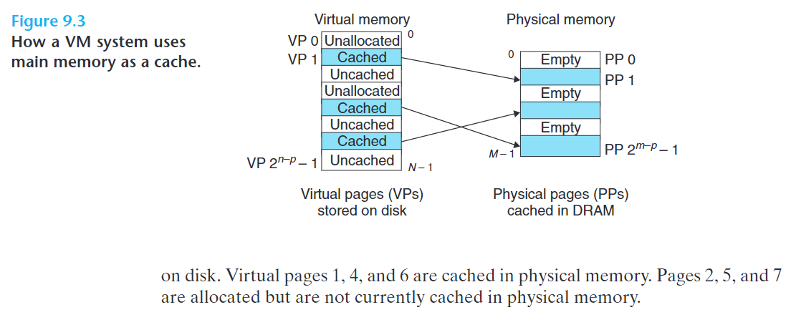

### DRAM 缓存的组织结构

我们用 SRAM 缓存指 CPU 的 L1、L2 和 L3 缓存，用 DRAM 缓存指主存。

DRAM 比 SRAM 慢约 $10$ 倍，磁盘比 DRAM 慢约 $100000$ 多倍，而且从磁盘的一个扇区读取第一个字节的时间开销比起读这个扇区中连续的字节又要慢约 $100000$ 倍，因此，DRAM 缓存的组织结构完全是由巨大的不命中处罚驱动的。

**虚拟页往往很大**，通常为 $4 \text{KB}\sim 2 \text{MB}$。

DRAM 是**全相联**的，即任何虚拟页都可以放置在任何物理页中。

操作系统对 DRAM 缓存使用**更复杂精密的替换算法**。

DRAM 缓存总是**写回**，而不是直写。

### 页表

VM 系统需要判定一个虚拟页是否已缓存、已缓存的虚拟页对应的物理页、未缓存的虚拟页对应的磁盘位置等，这些功能由操作系统、MMU 中的地址翻译硬件和**常驻在物理内存**中的**页表**（page table）提供。

页表是**页表条目**（Page Table Entry, **PTE**）的数组。

虚拟地址空间的每个页在页表的**固定**偏移处都有一个 PTE。PTE 由一个**有效位**（valid bit）和一个 $n$ 位的**地址字段**组成。

**有效位**指示对应的虚拟页**是否已缓存**。

- 若有效位被设置，地址字段就指示**对应的物理页的地址**
- 否则，
  - 如果地址字段是**空**的，则说明虚拟页**未分配**
  - 如果地址字段是**非空**的，则虚拟页**已分配**，地址字段是**虚拟页在磁盘上的位置**。

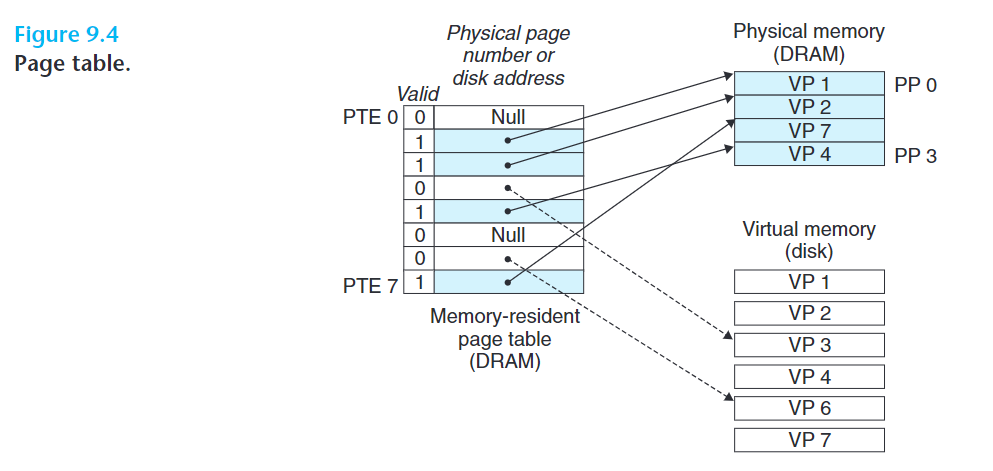

### 页命中

CPU 试图读取 VP 2 中的字时，地址翻译硬件将虚拟页号 VPN 作为索引定位 PTE 2。

PTE 2 的有效位被设置，故 VP 2 已被缓存在 DRAM 中，这是一次**页命中**。地址翻译硬件使用 PTE 2 的地址字段（即物理页号 PPN）构造出这个字的物理地址。

### 缺页

DRAM 缓存不命中称为**缺页**（page fault）。

CPU 试图读取 VP 3 中的字时，由于 VP 3 未缓存，会触发一个**缺页异常**。这调用内核的**缺页异常处理程序**，它选择**牺牲**一个页，此例中就是 VP 4。如果 VP 4 已经被修改了，那么内核会将它复制回磁盘（**写回**）。内核会修改 VP 4 的页表条目，将其有效位清零。

然后，内核从磁盘复制 VP 3 到内存中的 PP 3（即 VP 4 的原缓存位置），更新 PTE 3 并返回。缺页处理程序返回时，会**重新执行引起缺页的指令**，这一次会页命中。


虚拟内存在 20 世纪 60 年代早期发明，早于 SRAM 缓存（后者由于 CPU-内存之间差距的加大诞生），因此其术语和 SRAM 缓存的术语不同。

虚拟内存的说法中，**块**称作**页**，页在磁盘和内存之间传送的活动叫做**交换**（swapping）或**页面调度**（paging）。页从磁盘**换入**（swapped in / paged in）DRAM，从 DRAM **换出**（swapped out / paged out）磁盘。

一直到不命中发生时才换入页面的策略称为**按需页面调度**（demand paging），所有现代系统都采用这种策略。

### 分配页面

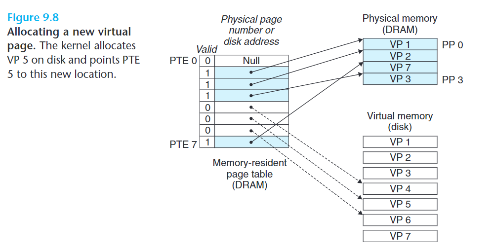

此例中，操作系统分配 VP 5：在磁盘上创建空间，并更新 PTE 5，将其地址字段填充为 VP 5 在磁盘上的位置。

### 又是局部性救了我们

局部性保证了程序在任意时刻都趋向于在一个较小的**活动页面**（active page）集合上工作，即程序的**工作集**（working set）或**常驻集合**（resident set），这使得虚拟内存系统的性能很好。

如果工作集大小超出了物理内存的大小，那么程序将会**抖动**（thrashing），严重降低性能。

可以用 Linux 的 `getrusage` 函数检测缺页的数量。

## 虚拟内存作为内存管理的工具

虚拟地址空间通常比物理地址空间大，但在一些早期系统（DEC PDP-11/70），也可能比物理地址空间小。虚拟内存对这种系统也有用处。

操作系统为每个进程提供了独立的页表，每个进程都有自己**独立**的虚拟地址空间。

**多个虚拟页可以映射到同一个物理页**，这称为**共享**（sharing）。

通过使用 VM 系统：

**链接**被简化：每个进程拥有独立的地址空间，因此它们不用在意代码和数据实际存放在物理内存的何处，可以使用**相同格式的内存映像**。这使得链接过程被简化，允许链接器生成完全链接的可执行文件。

**加载**被简化：加载时，Linux 加载器为代码和数据段**分配虚拟页**，并将它们标记成**未缓存**的，将页表条目的地址字段设置成**磁盘上目标文件的位置**。加载器不会把数据从磁盘复制到内存，VM 系统会自动完成这一过程。

**内存映射**（memory mapping）：将一组连续的虚拟页映射到某个文件中的某个位置

**共享**被简化：每个进程拥有私有的代码、数据、堆、栈，它们不和其他进程共享，会被操作系统映射到**不交**的物理页中。而对于内核代码、C 标准库代码等需要被各个进程共享的代码，操作系统通过**将不同进程中的某些虚拟页映射到相同的物理页**，从而使得多个进程可以共享这部分代码的一个副本。

**内存分配**被简化：当一个运行在用户进程的程序要求额外的堆空间时（如调用 `malloc`），操作系统分配一些连续的虚拟页，并将它们映射到相同数目的物理页，这些**物理页可以散落在物理内存的任意位置**（不必连续）。

## 虚拟内存作为内存保护的工具

对内存系统的访问必须被控制：用户进程不能修改它的只读代码段，不能读或写内核代码和数据结构，不能读或写其他进程的私有空间，不能写与其他进程共享的虚拟页（除非得到所有共享者显式的允许）

我们在 PTE 上添加一些额外的**许可位**，用于控制对虚拟页的访问：

- SUP 位：进程是否必须运行在**内核模式**下才能访问这个虚拟页
- READ 位：进程是否可以读取这个虚拟页
- WRITE 位：进程是否可以写这个虚拟页

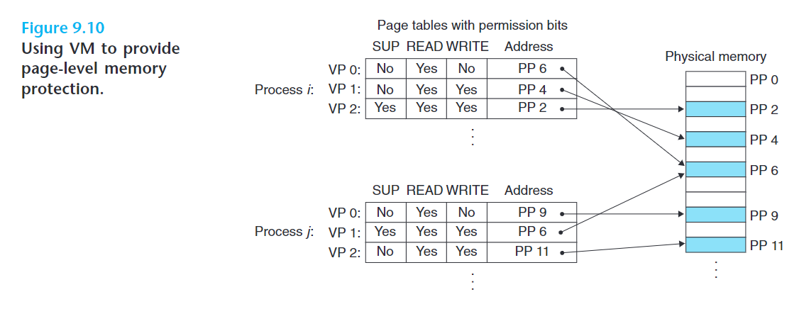

如果指令违反了这些许可位规定的许可条件，CPU 就会触发一个**一般保护故障**，将控制转移到内核的**一般保护异常处理程序**，它会终止进程。Linux 将这种异常报告为**段错误**（segmentation fault）

## 地址翻译

地址翻译是一个从虚拟地址空间（VAS）到物理地址空间（PAS）的映射：

$$
\begin{gather*}
    \text{MAP}: \text{VAS}\rightarrow\text{PAS}\cup\varnothing, \\
    \text{MAP}(A) = \begin{cases}
        A', & \text{if data at virtual addr. $A$ are present at physical addr. $A'$} \\
        \varnothing, & \text{if data at virtual addr. $A$ are not present in physical memory}
    \end{cases}
\end{gather*}
$$

CPU 中的一个控制寄存器，**页表基址寄存器**（Page Table Base Register, **PTBR**），指向当前页表的起始位置。

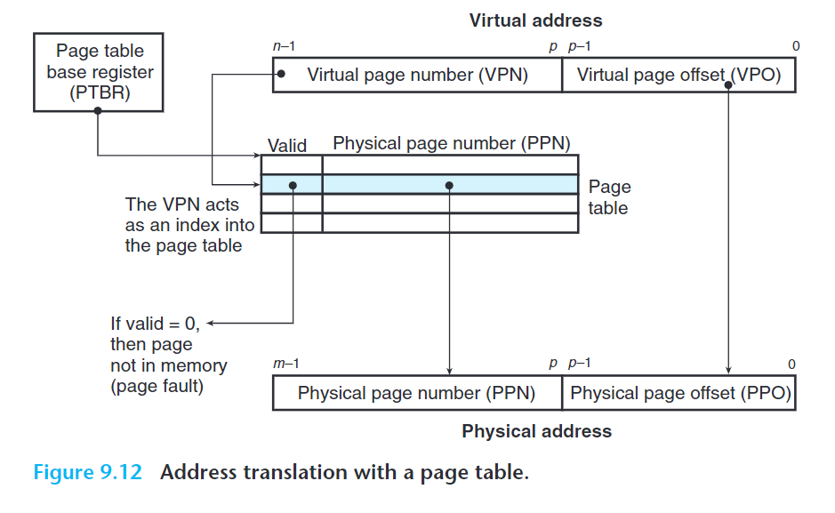

地址翻译时，**处理器先生成一个虚拟地址**，并将其传送给 MMU。

$n$ 位的虚拟地址被划分为两个部分：

- $p$ 位的**虚拟页偏移量**（Virtual Page Offset, **VPO**）：用于在虚拟页内定位字
- $n-p$ 位的**虚拟页号**（Virtual Page Number, **VPN**）：作为索引，在页表中定位 PTE

**MMU 通过 VPN 定位目标 PTE 的地址**，然后向高速缓存或主存请求此 PTE。得到 PTE 后，MMU 检查有效位：

如果有效位为 $1$，这是一次**页命中**。MMU 就会从 PTE 中取出**物理页号**（Physical Page Number, **PPN**）。由于**物理页偏移量**（Physical Page Offset, **PPO**）等于 VPO，因此将 PPN 和 VPO 组合起来就得到了物理地址。

MMU 将物理地址传送给高速缓存或主存，高速缓存或主存向处理器返回对应的字，就完成了整个过程。

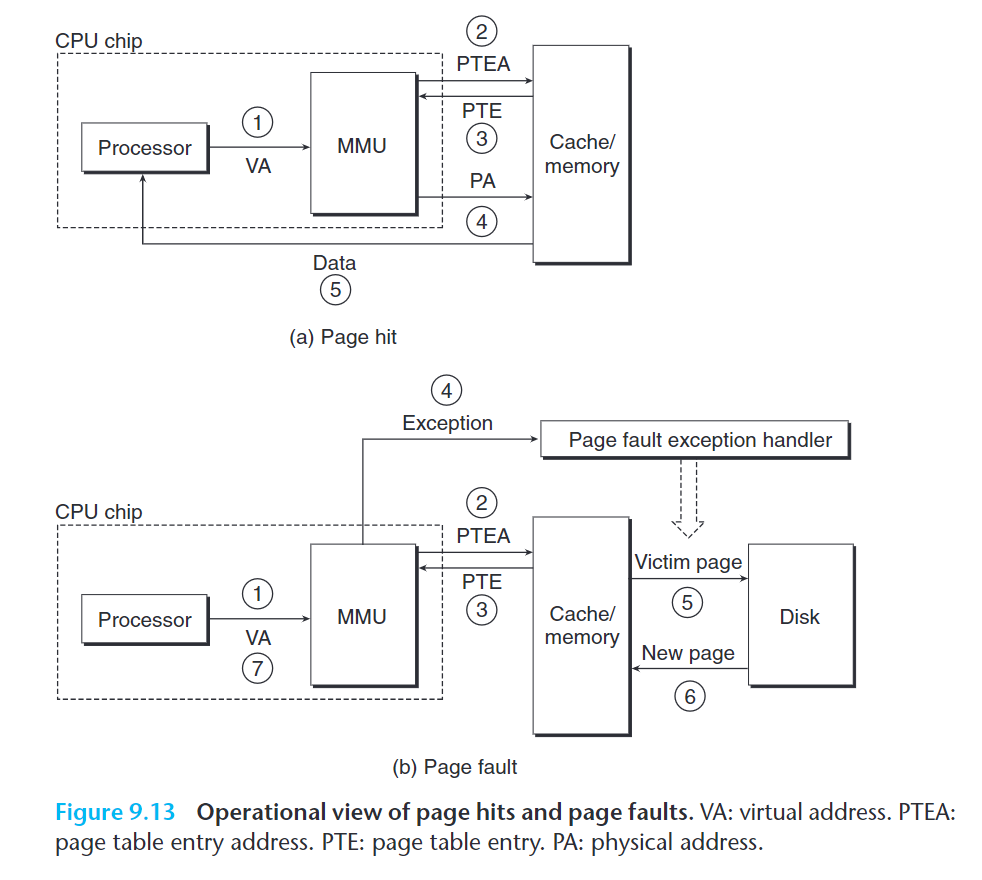

如果有效位为 $0$，MMU 触发一个**缺页异常**，CPU 将控制传递给内核的缺页异常处理程序。

缺页处理程序确定出牺牲页（如果牺牲页已被修改，就将它**写回**磁盘），然后调入新的页，并更新内存中相应的 PTE。最后，缺页处理程序返回到引起缺页的指令，并重新执行它，这一次会页命中。

**页命中完全由硬件处理**，**而缺页则由硬件和内核协作处理**。

### 结合高速缓存和虚拟内存

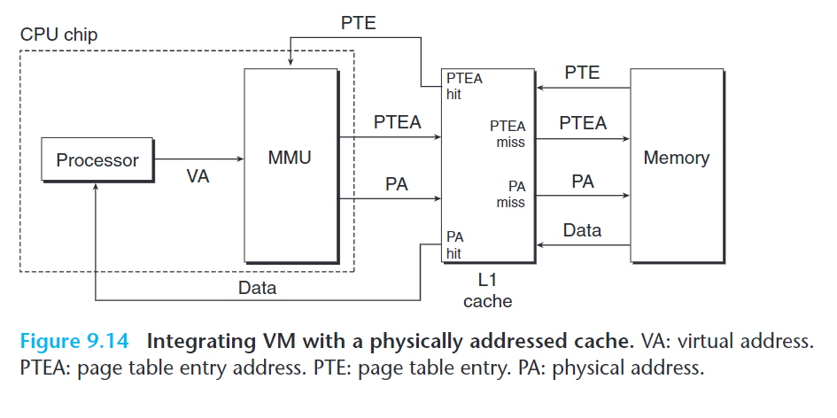

大部分（同时使用 VM 和 SRAM 高速缓存的）系统使用**物理寻址**来索引 SRAM 高速缓存，这使得多个进程同时在高速缓存中缓存块更容易，也使得共享来自相同虚拟页的块更容易。而且，这使得高速缓存不用烦恼内存保护的问题，这会在地址翻译的过程中处理。

注意，页表条目也可以被缓存在高速缓存中。

### 利用 TLB 加速地址翻译

每次 CPU 产生一个虚拟地址，MMU 就需要查阅一个 PTE，这是一个**内存操作**，如果缓存不命中的话会很慢。

MMU 中可能包括一个存储 PTE 的小缓存，称为**翻译后备缓冲区**（Translation Lookaside Buffer, **TLB**）。TLB 的**相联度一般较高**，因此出现抖动的可能性较小。

TLB 是**虚拟寻址**的，VPN 被分成 **TLB 标记位**和 **TLB 索引位**两部分。


### 多级页表

如果我们有一个 $32$ 位的地址空间，页大小为 $4 \text{KB}$，那么页表就需要 $2^{32}/2^{12}=2^{20}$ 个 PTE，每个 PTE 需要 $4$ 个字节，总共就需要 $4 \text{MB}$ 的内存空间，这太大了。

我们使用多级页表来压缩空间。以一个二级页表为例：

一级页表包含 $2^{10}$ 个 PTE，每个 PTE 指向一个二级页表。二级页表包含 $2^{10}$ 个 PTE，每个 PTE 对应一个虚拟页。使用 $4$ 字节的 PTE 时，一级页表和每个二级页表的大小都是 $4 \text{KB}$，恰好与一个页的大小相同。

一级页表的每个 PTE 对应虚拟地址空间中一个 $4 \text{MB}$ 的**片**（chunk）。如果片 $i$ 中**所有**的页都是**未分配**的，那么一级 PTE $i$ 为空。

多级页表从两个方面节约了内存：

- 如果一级页表的某个 PTE 为空，那么**相应的二级页表就不会存在**。由于对典型的程序来说，虚拟地址空间的大部分都是未分配的，因此这是一种巨大的节约
- 只有一级页表和最经常使用的二级页表需要被缓存在主存中


对于 $k$ 级页表，虚拟地址被划分成 $k$ 个 VPN 和 $1$ 个 VPO。VPN $i$ 是到第 $i$ 级页表的索引，而第 $i$ 级页表的每个 PTE 都指向第 $i+1$ 级页表的基址（第 $k$ 级页表除外）。和单级页表一样，PPO 和 VPO 是相同的。

### 综合：端到端的地址翻译

假设：

- 内存按字节寻址
- 内存访问针对单字节的字
- 虚拟地址 $n=14$ 位长
- 物理地址 $m=12$ 位长
- 页大小为 $P=64$ 字节
- TLB 四路组相联，总共有 $16$ 个条目
- L1 d-cache 物理寻址、直接映射，行大小是 $4$ 字节，总共有 $16$ 组

因为页大小为 $64$ 字节，所以 VPO 有 $6$ 位，VPN 有 $8$ 位。

- **TLB** 将 VPN 的高 $6$ 位作为标记位（TLBT），将 VPN 的低 $2$ 位作为索引位（TLBI）
- **页表**是单级的，有 $2^8=256$ 个 PTE。
- **高速缓存**将物理地址的低 $2$ 位作为块偏移（CO），中间 $4$ 位作为组索引（CI），高 $6$ 位作为标记位（CT）

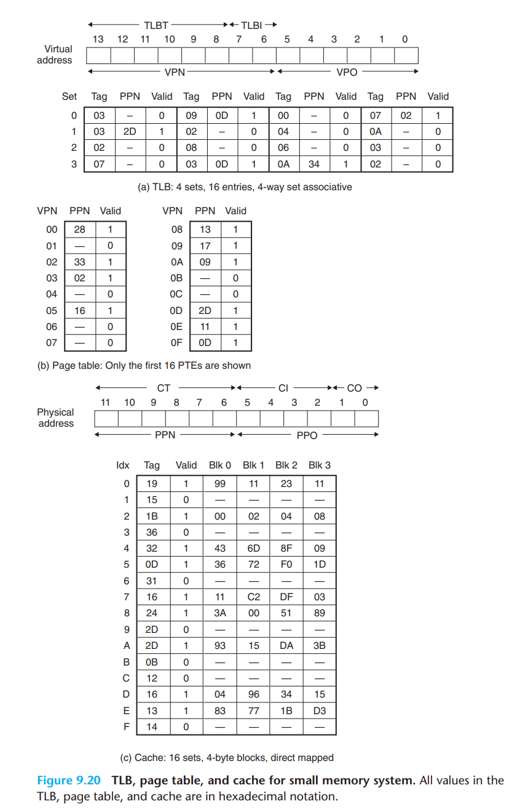

## 案例研究：Intel Core i7/Linux 内存系统

Intel Core i7 Haswell **处理器封装**（processor package）包括四个核心、一个所有核心共享的 L3 高速缓存、一个 DDR3 内存控制器。每个核心包含两级高速缓存和两级 TLB，以及一组基于 QuickPath 技术的点到点链路（允许核心与其他核心以及外部 I/O 桥直接通信）。

TLB 虚拟寻址、四路组相联。L1、L2、L3 高速缓存物理寻址，L1 和 L2 $8$ 路组相联，L3 $16$ 路组相联，块大小是 $64$ 字节。页大小可以在启动时配置成 $4 \text{KB}$ 或 $4 \text{MB}$，Linux 一般使用 $4 \text{KB}$。

Haswell 架构允许完全的 $64$ 位虚拟和物理地址空间，但 Core i7 实现只支持 $48$ 位（$256 \text{TB}$）虚拟地址空间和 $52$ 位（$4 \text{PB}$）物理地址空间。Core i7 还有一个兼容模式，支持 $32$ 位（$4 \text{GB}$）虚拟和物理地址空间。

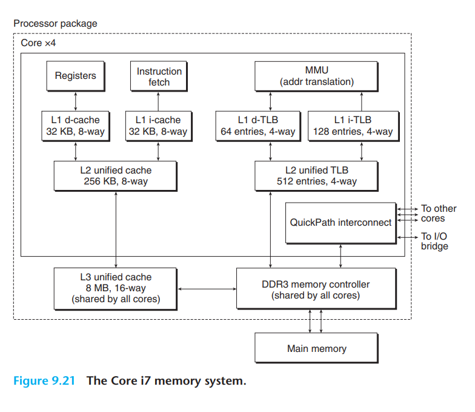

### Core i7 地址翻译

Core i7 Haswell 采用**四级页表**。每个进程有自己私有的页表层次结构。

当一个 Linux 进程运行时，与**已分配页相关的页表**驻留在内存中。

CR3 控制寄存器指向第一级页表 L1 的基址。CR3 的值是每个进程的上下文的一部分。


前三级页表中的 PTE 格式：


|   字段    |                                 描述                                 |
| :-------: | :------------------------------------------------------------------: |
|     P     |                     子页表是否已缓存到物理内存中                     |
|    R/W    |                    对所有可访问页，只读或读写权限                    |
|    U/S    |            对所有可访问页，用户或超级用户（内核）模式权限            |
|    WT     |                      子页表采用直写还是写回策略                      |
|    CD     |                         子页表是否可以被缓存                         |
|     A     |              引用位，由 MMU 在读或写时设置，由软件清除               |
|    PS     | 页大小，可以为 $4 \text{KB}$ 或 $4 \text{MB}$（只对第一层 PTE 定义） |
| Base addr |                     子页表的物理基址的高 $40$ 位                     |
|    XD     |                    对所有可访问页，是否允许取指令                    |

Linux 中，$P$ 总是为 $1$，此时地址字段包含一个 $40$ 位 PPN，它指向下一级页表的基址。这要求物理页表必须 **$4 \text{KB}$ 对齐**。

第四级页表 PTE 的格式：

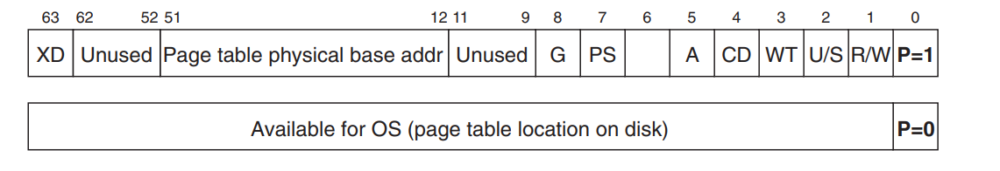

|   字段    |                            描述                            |
| :-------: | :--------------------------------------------------------: |
|     P     |                子页表是否已缓存到物理内存中                |
|    R/W    |                  对于子页，只读或读写权限                  |
|    U/S    |          对于子页，用户或超级用户（内核）模式权限          |
|    WT     |                  子页采用直写还是写回策略                  |
|    CD     |                     子页是否可以被缓存                     |
|     A     | 引用位（reference bit）。由 MMU 在读和写时设置，由软件清除 |
|     D     |   修改位（dirty bit）。由 MMU 在读和写时设置，由软件清除   |
|     G     |  全局位。如果设置，那么任务切换时，它不会从 TLB 中被驱逐   |
| Base addr |                 子页的物理基址的高 $40$ 位                 |
|    XD     |                  对于子页，是否允许取指令                  |

XD 位是 $64$ 位系统引入的，这使得内核降低了缓冲区溢出攻击的风险。

每次访问一个页时，MMU 都会设置 A 位，它是内核页替换算法的一部分

每次写一个页时，MMU 都会设置 D 位，内核根据它决定是否需要将牺牲页写回磁盘

内核可以调用一条内核模式指令来清除引用位和修改位。

Core i7 MMU 将 $36$ 位的 VPN 划分成四个 $9$ 位的片，作为到页表中 PTE 的索引：


> 地址翻译包括两个步骤：
>
> - MMU 将虚拟地址翻译成物理地址
> - 将物理地址传送给 L1 高速缓存
>
> 这两个步骤可以部分重叠：
>
> 页大小为 $4 \text{KB}$ 时，虚拟地址有 $12$ 位的 VPO，并且它和其对应的 PPO 相同。八路组相联、物理寻址的 L1 高速缓存有 $64$ 个组，块大小为 $64$ 字节，因此物理地址的低 $6$ 位是块偏移，中间 $6$ 位是组索引，高 $40$ 位是标记位。
> 因此，当 CPU 发送 VPN 给 MMU 时，它会同时发送 VPO 给 L1 高速缓存，从而可以让 **L1 高速缓存的组选择**和 **MMU 的页表查找**同时进行。

### Linux 虚拟内存系统

Linux 为每个进程维护一个独立的虚拟地址空间：

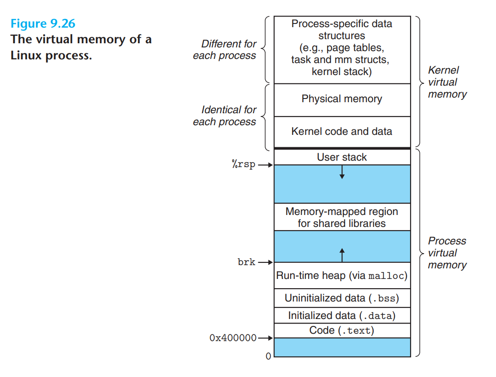

内核虚拟内存包括**内核中的代码和数据结构**。

内核虚拟内存的某些区域被映射到了**所有进程共享的物理页面**。Linux 也将一组连续的虚拟页（大小等于系统中 DRAM 的总量）映射到一组连续的物理页，为内核提供了一个便利的访问物理内存任何位置的方法（例如访问页表或某些被映射到物理内存的 I/O 设备）。

内核虚拟内存的其他区域包含了**每个进程都不相同的数据**，例如页表、内核在进程上下文中使用的栈，以及记录虚拟地址空间当前组织的数据结构。

#### Linux 虚拟内存区域

Linux 将虚拟内存划分成一些**区域**（area，又叫**段**，segment）。一个区域就是一个已分配的、连续的虚拟内存**片**，代码段、数据段、堆、共享库段、用户栈等都是区域。**所有页都有一个所属的区域**。

区域的概念允许虚拟内存有间隙，使得内核不用记录尚不存在的虚拟页，它们也不会占用任何内存或磁盘资源。

内核为每个进程维护一个 `task_struct`，其中的元素包含内核运行此进程需要的信息，包括 PID、指向用户栈的指针、可执行目标文件名、程序计数器等

`task_struct` 中的 `mm` 元素指向一个 `mm_struct`，它描述虚拟内存的当前状态。其中

- `pgd` 保存第一级页表（页全局目录）的基址。内核运行进程时，会**将 `pgd` 存放在 CR3 控制寄存器中**
- `mmap` 指向一个 `vm_area_struct` 链表，每个 `vm_area_struct` 描述一个区域

`vm_area_struct` 包括：

- `vm_start`：区域的起始地址
- `vm_end`：区域的结束地址
- `vm_prot`：区域内所有页的读写权限
- `vm_flags`：区域内的页是否可和其他进程共享，以及一些其他信息
- `vm_next`：指向下一个 `vm_area_struct` 的指针

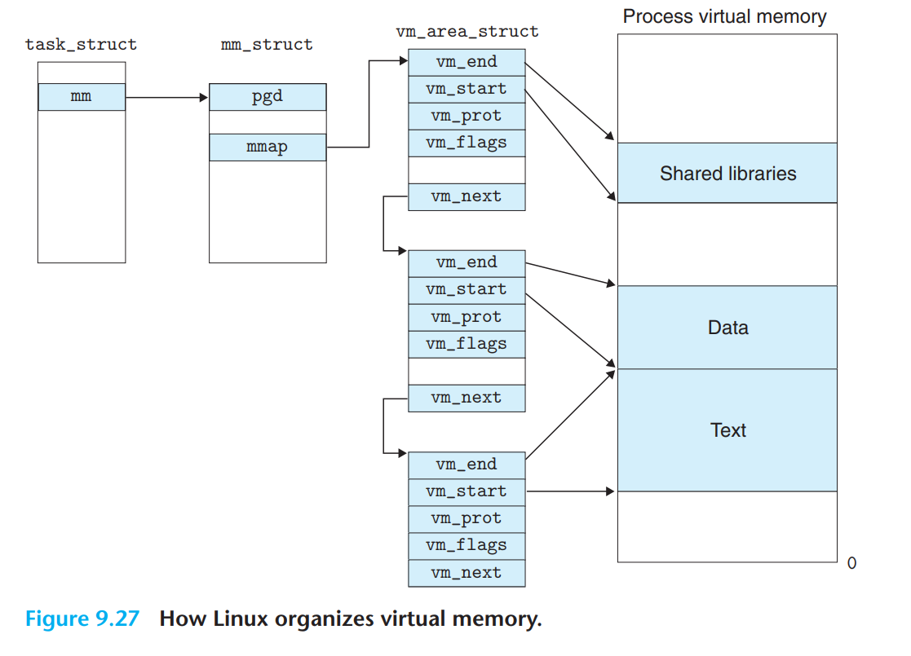

#### Linux 缺页异常处理

如果 MMU 在翻译虚拟地址 $A$ 时触发了缺页，那么控制会转移到内核的缺页处理程序。处理程序执行以下步骤：

- 检查 $A$ **是否合法**：处理程序查找 `vm_area_struct` 链表，检查 $A$ 是否包含在某对 `[vm_start, vm_end)` 中。如果 $A$ 不合法，处理程序触发一个**段错误**，终止进程

由于进程可以通过 `mmap` 创建任意数量的新虚拟内存区域，所以 Linux 实现中在链表里构建了一棵树，用树来做查找。

- 检查对 $A$ 的**内存访问是否合法**：即检查进程是否有权限进行此访问（写只读页、用户模式进程读写内核虚拟内存等）。如果不合法，处理程序触发一个**保护异常**，终止进程
- 此时处理程序知道此次缺页是对合法地址的合法访问，它选择一个牺牲页（如果牺牲页被修改过，将它写回磁盘），换入新页并更新页表。然后处理程序返回到引起缺页的指令，并重新执行它，这一次会页命中

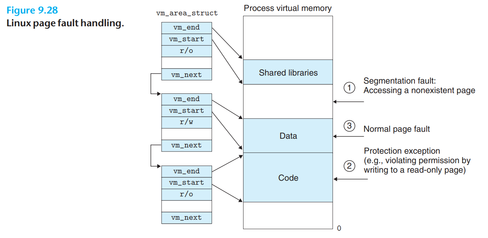

## 内存映射

Linux 通过将一个虚拟内存区域与一个磁盘上的**对象**（object）关联起来，从而初始化这个虚拟内存区域。这个过程称为**内存映射**（memory mapping）。对象可以是：

- Linux 文件系统中的**普通文件**：例如一个可执行目标文件。文件的节（section）被分为页大小的片，每一片包含一个虚拟页的初始内容。由于按需进行页面调度的机制，这些页只有在被 CPU 第一次引用时才被实际读入物理内存。区域如果比文件节更大，那么余下的部分被**零初始化**
- **匿名文件**：匿名文件由内核创建，包含的全是二进制零。CPU 第一次引用被映射到匿名文件的区域时，内核会在物理内存中牺牲一个页（若修改过，写回它），用二进制零覆写它并更新页表，并令这个页**驻留内存**。被映射到匿名文件区域的页也叫**请求二进制零的页**（demand-zero page）

一旦一个虚拟页被初始化，它就在一个由内核维护的**交换文件**（swap file）之间换来换去。交换文件也叫**交换空间**（swap space）或**交换区域**（swap area）。任何时刻，交换空间都限制着当前进程能够分配的虚拟页的总数。

### 再看共享对象

如果虚拟内存系统可以集成到传统的文件系统中，那么就可以简单而高效地将程序和数据加载到内存里。

一个被映射到虚拟内存区域的对象要么是**共享对象**，要么是**私有对象**。

一个进程对它虚拟地址空间内某个**共享对象**的更改**会反映到磁盘上的原始对象**上，且**对其他共享了此对象的进程也可见**。而对于**私有对象**，进程对它的更改**不会反映到磁盘上的原始对象**上，且**对其他进程也不可见**。

映射到共享对象的虚拟内存区域称为**共享区域**，类似地，也有**私有区域**。


如上图，即使共享对象被映射到了多个共享区域，物理内存中也只需要存放它的**一个副本**（注意**物理页不一定连续**）

私有对象采用**写时复制**（copy on write）技术。私有对象开始生命周期的方式和共享对象基本一样，但**私有区域的 PTE 被标记为只读**，并且区域结构体 `vm_area_struct` 被标记为**私有的写时复制**。

如果有进程试图写自己私有区域的某个页，那么这个写就会**触发一个保护故障**。故障处理程序会在物理内存中创建此程序的一个新副本，更新页表条目，然后恢复这个副本的可写权限。处理程序返回时，故障指令重新执行，这一次会成功写入。

写时复制充分节约了物理内存资源。


### 再看 `fork` 函数

当前进程调用 `fork` 时，内核为新进程创建各种数据结构，并分配给它一个唯一的 PID。

为了为新进程创建虚拟内存，它创建了当前进程的 `mm_struct`、`vm_area_struct` 和页表的副本。它**将两个进程的每个页面都标记为只读**，并**将两个进程的每个 `vm_area_struct` 标记为写时复制**。

`fork` 返回时，两个进程就拥有了独立且私有的虚拟地址空间。

### 再看 `execve` 函数

假设当前进程调用了

```c
execve("a.out", NULL, NULL);
```

则：

- 内核**删除已存在的用户区域**：删除当前虚拟地址空间用户部分中已存在的 `vm_area_struct`
- **映射私有区域**：为新程序的代码（code）区域、数据区域、bss 区域和栈区域创建新的 `vm_area_struct`，它们是**私有、写时复制的**。
  - 代码区域和数据区域被映射为 `a.out` 的 `.text` 段和 `.data` 段。
  - bss 区域是请求二进制零的，映射到匿名文件（匿名文件的大小也被包含在 `a.out` 中）
  - 栈区域和堆区域也请求二进制零，初始长度为零。
- **映射共享区域**：如果 `a.out` 与共享对象（目标）链接，例如 `libc.so`，那么这些对象会动态链接到程序，然后再映射到用户虚拟地址空间中的共享区域内。
- **设置程序计数器（PC）**：将 PC 设置为代码区域的入口点

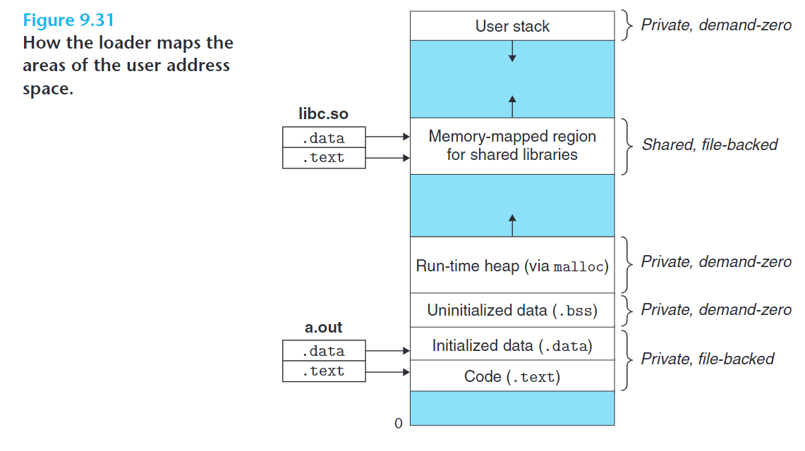

### 使用 `mmap` 的用户级内存映射

```c
#include <unistd.h>
#include <sys/mman.h>

// 创建新的虚拟内存区域，并将 fd 所指定对象 offset 偏移处起 length 字节长度的连续的片映射到此区域
// 返回：若成功，返回指向映射区域的指针；若出错，返回 MAP_FAILED（-1）
void* mmap(void* start, size_t length, int prot, int flags, int fd, off_t offset);
```


`start` 参数向内核建议新虚拟内存区域的起始地址，内核可以忽略这个建议。

`prot` 描述新区域的访问权限位，即相应 `vm_area_struct` 的 `vm_prot` 字段：

- $\text{PROT\_EXEC}$：区域内的页可执行
- $\text{PROT\_READ}$：区域内的页可读
- $\text{PROT\_WRITE}$：区域内的页可写
- $\text{PROT\_NONE}$：区域内的页不可访问

`flags` 描述被映射对象的类型：

- $\text{MAP\_ANON}$：匿名对象（相应的虚拟页请求二进制零）
- $\text{MAP\_PRIVATE}$：私有对象，写时复制
- $\text{MAP\_SHARED}$：共享对象

```c
#include <unistd.h>
#include <sys/mman.h>

// 删除 start 起 length 字节长度的区域
int munmap(void* start, size_t length);
```

访问被 `munmap` 删除的区域会导致段错误。

## 动态内存分配

动态内存分配器维护进程的**堆**（heap）。我们假设堆是一个**请求二进制零**的区域，紧接着 bss 区域之后，向上（地址增加）生长。

动态内存分配器将堆视为一组不同大小**块**（block）的集合。每个块都是一个**连续的虚拟内存片**（chunk）。

一个块要么是**已分配的**，要么是**空闲的**。已分配的块供应用程序使用，它保持已分配状态，直到被**释放**。空闲块保持空闲，直到被应用程序显式地**分配**。

分配器有两种风格：

- **显式分配器**（explicit allocator）：要求应用显式地释放已分配的块。例如 C 的 `malloc` 和 `free` 函数、C++ 的 `new` 和 `delete` 运算符
- **隐式分配器**（implicit allocator）：又叫**垃圾收集器**（garbage collector），由分配器检测已分配块何时不再被使用，自动释放它们。

### `malloc` 和 `free` 函数

```c
#include <stdlib.h>

// 返回：若成功，返回指向大小至少为 size 字节的已分配块的指针；若出错，返回 NULL
void* malloc(size_t size);
```

返回指针，指向大小至少为 `size` 字节的块。这个块为可能包含在其中的任何数据对象对齐：

- 在 32 位模式中，块的地址是 8 的倍数
- 在 64 位模式中，块的地址是 16 的倍数。

> Intel 将 4 字节对象称为双字，在这里，我们假设字是 4 字节的

如果 `malloc` 出错（例如要求的内存块大于可用的虚拟内存），它就会返回 `NULL`，并设置 `errno`。

`malloc` 不会执行初始化，`calloc` 是一个基于 `malloc` 的瘦包装函数，会将分配的内存**零初始化**。

可以用 `realloc` 改变已分配块的大小：

动态内存分配器可以使用 `mmap` 和 `munmap` 显式地分配和释放堆内存。还可以使用 `sbrk` 函数

```c
#include <unistd.h>

// incr 可以为正数、负数或零
// 返回：若成功，返回 brk 的旧值；若出错，返回 -1
void* sbrk(intptr_t incr);
```

`sbrk` 通过改变 `brk` 指针来扩展和收缩堆。如果成功，它返回 `brk` 指针的旧值，否则返回 `−1`，并设置 `errno` 为 $\text{ENOMEM}$。

`free` 释放已分配的内存块。

```c
#include <stdlib.h>

void free(void* ptr);
```

`ptr` 必须指向一个从 `malloc`、`calloc` 或 `realloc` 获得的已分配块的基址，否则行为未定义。


我们假设分配器返回的块是 8 字节双字边界对齐的。注意在 9-34b 中，`malloc` 会分配一个 6 字的块。

### 分配器的要求和目标

- **处理任意请求序列**：分配器必须能够处理任意的 `malloc` 和 `free` 请求序列，只要它们是合法的
- **立即响应请求**：即不允许分配器为了性能重新排列或缓冲请求
- **只使用堆**：为了可扩展性。任何非标量数据结构都必须被保存在堆上
- **对齐块**：块必须对齐，以便它们可以保存任何类型的对象
- **不修改已分配的块**：只能操作或改变空闲的块，压缩已分配块等操作是不允许的

在以上限制下，分配器需要实现**吞吐率最大化**和**内存使用率最大化**。

- **吞吐率**：单位时间内完成的请求（分配或释放）数量

合理性能：分配请求的最糟糕情况时间复杂度是 $O(n)$（和空闲块的数量成线性关系），释放请求的时间复杂度是 $O(1)$。

- **内存使用率**：可以用**峰值利用率**（peek utilization）衡量。

例如，给定 $n$ 个分配或释放请求的序列

$$R_0, R_1, \cdots, R_{n-1}$$

一个分配 $p$ 字节块的请求对应的**有效载荷**（payload）是 $p$ 字节。

请求 $R_k$ 完成后的**聚集有效载荷**（aggregate payload）$P_k$ 定义为当前已分配块的有效载荷之和。

记 $H_k$ 为堆的当前大小，它是单调非减的。那么前 $k+1$ 个请求的峰值利用率为

$$U_k=\frac{\max_{i\leq k} P_i}{H_k}.$$

分配器的目标是在整个序列中使峰值利用率最大化。

> 也可以取 $H_k$ 为前 $k+1$ 个请求过程中最大的堆大小，从而放宽堆大小单调非减的假设

### 碎片化

碎片化（fragmentation）会造成堆利用率降低。碎片化分为**内部碎片化**（internal fragmentation）和**外部碎片化**（external fragmentation）。

内部碎片化：已分配块比它的有效载荷大。例如，分配器可能对已分配块强加一个最小的大小，或者为了对齐块而增加了块大小。

内部碎片化只取决于请求的模式和分配器的实现。

外部碎片化：空闲内存合计起来足够满足一个分配请求，但每个单独的空闲块都不够大。

外部碎片化难以量化且无法预测，分配器采用启发式策略，试图维护少量的大空闲块，而不是大量的小空闲块。

### 实现问题

最简单的分配器：

```c
void* malloc(size_t size) {
    return sbrk(size);
}

void free(void* ptr) {
    return;
}
```

由于 `malloc` 和 `free` 极其简单，吞吐率会极好。但分配器从不重复利用任何块，内存利用率会极差。

实际的分配器必须考虑以下问题：

- **空闲块的组织**
- **放置**：选择哪个空闲块来满足当前的分配请求
- **分割**：将新分配的块放置到空闲块后，如何处理空闲块剩余的部分
- **合并**：如何处理刚刚被释放的块

### 隐式空闲链表

大多数分配器将块的元数据嵌入块本身：

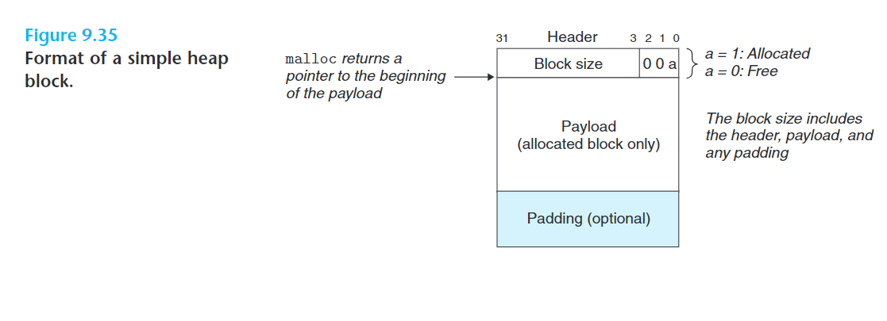

一个块由一个单字大小的**头部**、有效载荷，以及一些可能的额外**填充**组成。

头部编码了块（包含头部和填充）的**总大小**以及块的**状态**（已分配或空闲）

如果我们要求块**双字对齐**，那么块大小就总是 8 的倍数，其二进制表示的最低 3 位总是 0。因此，我们只需要 29 个高位来编码块大小。剩余的 3 位用于编码块的状态。

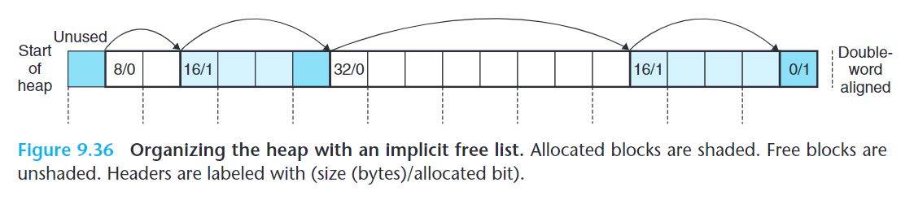

堆被组织成连续的已分配块和空闲块的序列。这种结构称为**隐式空闲链表**（implicit free list），因为空闲块通过头部的大小字段隐式地连接在一起。

我们需要一个特殊标记的结束块，此例中即一个设置了分配位而大小为零的终止头部（terminating header）

隐式空闲链表很简单，但任何操作的开销，例如放置分配的块，都需要搜索空闲链表，其**时间复杂度和块的总数成线性关系**。而且，对齐要求导致**块大小至少是双字**，这会导致**内部碎片化**。

### 放置已分配的块

处理一个 $k$ 字节块的分配请求时，分配器搜索空闲链表，查找合适的空闲块放置新分配的块。搜索的方式取决于分配器的**放置策略**。

**首次适配**（first fit）从头开始搜索空闲链表，选择首个合适的空闲块。

首次分配趋向于将大的空闲块保留在链表尾部，但容易在链表前部留下小空闲块的碎片，从而增加了对较大快的搜索时间。

**下一次适配**（next fit）从**上次搜索结束的地方**开始搜索，选择首个合适的空闲块。

下一次适配由 Donald Knuth 提出，作为首次适配的改进。它基于一个简单的想法：上一次发现的空闲块很可能也能被下一次使用。下一次适配的性能明显地更快，但是内存利用率要低得多。

**最佳适配**（best fit）搜索**整个**空闲链表，选择**最小**的满足要求的空闲块。

最佳适配的内存利用率好，但性能很差，因为它必须搜索整个空闲链表。

### 分割空闲块

分配器找到匹配的空闲块后，需要决定应分配空闲块中多少空间。

如果用整个空闲块，那么会造成**内部碎片化**。如果放置策略能产生好的匹配，额外的内部碎片是可以接受的。

如果匹配不太好，分配器通常会将空闲块分割成两部分，一部分作为分配块，另一部分变成新的空闲块。

### 获取额外的堆内存

如果分配器不能为请求找到合适的空闲块，那么它可以通过合并物理上相邻的空闲块来创建一些更大的空闲块。如果这样还不行，分配器就用 `sbrk` 向内核请求额外的堆内存，将其转化为一个新的空闲块，插入空闲链表。

### 合并空闲块

当分配器释放已分配块时，可能有其他空闲块与之相邻。这种相邻的空闲块可能引起**假碎片化**（fault fragmentation）。

分配器需要合并（coalescing）相邻的空闲块。

**立即合并**（immediate coalescing）：每次释放块时执行合并

**推迟合并**（deferred coalescing）：无法满足某个分配请求时，扫描整个堆，合并所有相邻的空闲块

立即合并可能产生一种抖动：块反复的合并和分割。

快速的分配器通常会选择某种形式的推迟合并。

### 带边界标记的合并

由于我们的目前隐式链表是单向的，所以合并前驱空闲块时会有困难。

Knuth 提出了**边界标记**（boundary tag）的方法：在每个块的尾部添加一个**脚部**（footer）作为头部的一个副本。


释放当前块时，根据前驱块和后继块的状态可以有四种情况：

1. 前驱块已分配，后继块已分配
2. 前驱块已分配，后继块空闲
3. 前驱块空闲，后继块已分配
4. 前驱块空闲，后继块空闲

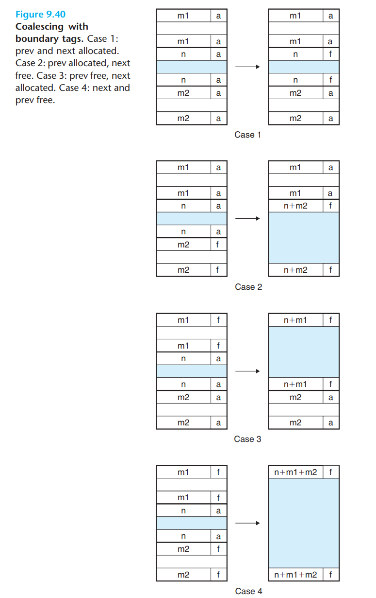

每种情况下，合并的时间复杂度都是常数级的。

边界标记简单而优雅，但对于频繁请求小块的应用，为每个块同时维护两个字大小的头部和脚部有些浪费。

注意到，**只有当前驱块空闲时**，我们才会用到它的脚部。如果**将前驱块的已分配 / 空闲位存放在当前块中多余的空位**，那么已分配的块就不需要脚部了（不过空闲块仍然需要脚部）。

### 综合：实现一个简单的分配器

最大的块大小是 $2^{32}=4 \text{GB}$，代码是 64 位 clean 的，即可以不加修改地运行在 32 位（`gcc -m32`）和 64 位（`gcc -m64`）的进程上。

#### 通用分配器设计

`memlib.c` 包提供了一个内存系统模型：

```c
/* memlib.c */

/* Private global variables */
static char* mem_heap;    /* Points to first byte of heap */
static char* mem_brk;    /* Points to last byte of heap plus 1 */
static char* mem_max_addr;  /* Max legal heap addr plus 1 */

/*
 * mem_init - Initialize the memory system model
 */
void mem_init(void) {
    mem_heap = (char*)Malloc(MAX_HEAP);
    mem_brk = (char*)mem_heap;
    mem_max_addr = (char*)(mem_heap + MAX_HEAP);
}

/*
 * mem_sbrk - Simple model of the sbrk function. Extends the heap
 *    by incr bytes and returns the start address of the new area. In
 *    this model, the heap cannot be shrunk.
 */
void* mem_sbrk(intptr_t incr) {
    char* old_brk = mem_brk;

    if ((incr < 0) || ((mem_brk + incr) > mem_max_addr)) {
        errno = ENOMEM;
        fprintf(stderr, "ERROR: mem_sbrk failed. Ran out of memory...\n");
        return (void*)-1;
    }
    mem_brk += incr;
    return (void*)old_brk;
}
```

分配器包含在 `mm.c` 中，它提供三个接口：

```c
extern int mm_init(void);
extern void* mm_malloc(size_t size);
extern void mm_free(void* ptr);
```

`mm_init` 函数初始化分配器，若成功返回 0，否则返回 -1。`mm_malloc` 和 `mm_free` 的语义和 `malloc` 和 `free` 相同。

最小的块大小是 16 字节，空闲链表组织为一个隐式空闲链表。


第一个字是一个双字边界对齐的填充字。后面是一个**序言块**（prologue block），它是一个已分配块，大小为 8 字节，只包含一个头部和一个脚部。它在初始化时被创建，永不释放。

序言块后是由 `malloc` 或者 `free` 调用创建的普通块。

堆总是以一个**结尾块**（epilogue block）结束，它是一个已分配块，大小为零，只包含一个头部。

序言块和结尾块是一种消除合并边界条件的技巧。分配器使用一个 `static` 的全局变量 `heap_listp`，指向序言块。（也可以让它指向下一个块）

#### 操作空闲链表的基本常数和宏

```c
/* Basic constants and macros */
#define WSIZE    4    /* Word and header/footer size (bytes) */
#define DSIZE    8    /* Double word size (bytes) */
#define CHUNKSIZE (1<<12)  /* Extend heap by this amount (bytes) */

#define MAX(x, y) ((x) > (y)? (x) : (y))

/* Pack a size and allocated bit into a word */
#define PACK(size, alloc) ((size) | (alloc))

/* Read and write a word at address p */
#define GET(p)    (*(unsigned int*)(p))
#define PUT(p, val) (*(unsigned int*)(p) = (val))

/* Read the size and allocated fields from address p */
#define GET_SIZE(p)  (GET(p) & ~0x7)
#define GET_ALLOC(p) (GET(p) & 0x1)

/* Given block ptr bp, compute address of its header and footer */
#define HDRP(bp) ((char*)(bp) - WSIZE)
#define FTRP(bp) ((char*)(bp) + GET_SIZE(HDRP(bp)) - DSIZE)

/* Given block ptr bp, compute address of next and previous blocks */
#define NEXT_BLKP(bp) ((char*)(bp) + GET_SIZE(((char*)(bp) - WSIZE)))
#define PREV_BLKP(bp) ((char*)(bp) - GET_SIZE(((char*)(bp) - DSIZE)))
```

注意块指针指向块有效载荷的基址，而不是块的基址。

#### 创建初始空闲链表

```c
static void* extend_heap(size_t words);

int mm_init(void) {
    /* Create the initial empty heap */
    if ((heap_listp = mem_sbrk(4 * WSIZE)) == (void*)-1)
        return -1;
    PUT(heap_listp, 0);    /* Alignment padding */
    PUT(heap_listp + (1 * WSIZE), PACK(DSIZE, 1));    /* Prologue header */
    PUT(heap_listp + (2 * WSIZE), PACK(DSIZE, 1));    /* Prologue footer */
    PUT(heap_listp + (3 * WSIZE), PACK(0, 1));    /* Epilogue header */
    heap_listp += (2 * WSIZE);

    /* Extend the empty heap with a free block of CHUNKSIZE bytes */
    if (extend_heap(CHUNKSIZE / WSIZE) == NULL)
        return -1;
    return 0;
}

static void* extend_heap(size_t words) {
    char* bp;
    size_t size;

    /* Allocate an even number of words to maintain alignment */
    size = (words % 2) ? (words + 1) * WSIZE : words * WSIZE;
    if ((long)(bp = mem_sbrk(size)) == -1)
        return NULL;

    /* Initialize free block header/footer and the epilogue header */
    PUT(HDRP(bp), PACK(size, 0));    /* Free block header */
    PUT(FTRP(bp), PACK(size, 0));    /* Free block footer */
    PUT(HDRP(NEXT_BLKP(bp)), PACK(0, 1));    /* New epilogue header */

    /* Coalesce if the previous block was free */
    return coalesce(bp);
}
```

`extend_heap` 会在两种情况下调用：

- 堆初始化
- `mm_malloc` 无法找到合适的匹配块

#### 释放和合并块

```c
void mm_free(void* bp) {
    size_t size = GET_SIZE(HDRP(bp));

    PUT(HDRP(bp), PACK(size, 0));
    PUT(FTRP(bp), PACK(size, 0));
    coalesce(bp);
}

static void* coalesce(void* bp) {
    size_t prev_alloc = GET_ALLOC(FTRP(PREV_BLKP(bp)));
    size_t next_alloc = GET_ALLOC(HDRP(NEXT_BLKP(bp)));
    size_t size = GET_SIZE(HDRP(bp));

    if (prev_alloc && next_alloc) {    /* Case 1 */
        return bp;
    } else if (prev_alloc && !next_alloc) {    /* Case 2 */
        size += GET_SIZE(HDRP(NEXT_BLKP(bp)));
        PUT(HDRP(bp), PACK(size, 0));
        PUT(FTRP(bp), PACK(size, 0));
    } else if (!prev_alloc && next_alloc) {    /* Case 3 */
        size += GET_SIZE(HDRP(PREV_BLKP(bp)));
        PUT(FTRP(bp), PACK(size, 0));
        PUT(HDRP(PREV_BLKP(bp)), PACK(size, 0));
        bp = PREV_BLKP(bp);
    } else {    /* Case 4 */
        size += GET_SIZE(HDRP(PREV_BLKP(bp))) + GET_SIZE(FTRP(NEXT_BLKP(bp)));
        PUT(HDRP(PREV_BLKP(bp)), PACK(size, 0));
        PUT(FTRP(NEXT_BLKP(bp)), PACK(size, 0));
        bp = PREV_BLKP(bp);
    }
    return bp;
}
```

#### 分配块

最小块大小是 16 字节：8 字节用于对齐，8 字节用于头部和脚部。

```c
void* mm_malloc(size_t size) {
    size_t asize;    /* Adjusted block size */
    size_t extendsize;    /* Amount to extend heap if no fit */
    char* bp;

    /* Ignore spurious requests */
    if (size == 0)
        return NULL;

    /* Adjust block size to include overhead and alignment reqs. */
    if (size <= DSIZE)
        asize = 2 * DSIZE;
    else
        asize = DSIZE * ((size + (DSIZE) + (DSIZE - 1)) / DSIZE);

    /* Search the free list for a fit */
    if ((bp = find_fit(asize)) != NULL) {
        place(bp, asize);
        return bp;
    }

    /* No fit found. Get more memory and place the block */
    extendsize = MAX(asize, CHUNKSIZE);
    if ((bp = extend_heap(extendsize / WSIZE)) == NULL)
        return NULL;
    place(bp, asize);
    return bp;
}

static void* find_fit(size_t asize) {
    /* First-fit search */
    void* bp;

    for (bp = heap_listp; GET_SIZE(HDRP(bp)) > 0; bp = NEXT_BLKP(bp)) {
        if (!GET_ALLOC(HDRP(bp)) && (asize <= GET_SIZE(HDRP(bp))))
            return bp;
    }
    return NULL;    /* No fit */
}

static void place(void* bp, size_t asize) {
    size_t csize = GET_SIZE(HDRP(bp));

    if ((csize - asize) >= (2 * DSIZE)) {
        PUT(HDRP(bp), PACK(asize, 1));
        PUT(FTRP(bp), PACK(asize, 1));
        bp = NEXT_BLKP(bp);
        PUT(HDRP(bp), PACK(csize - asize, 0));
        PUT(FTRP(bp), PACK(csize - asize, 0));
    } else {
        PUT(HDRP(bp), PACK(csize, 1));
        PUT(FTRP(bp), PACK(csize, 1));
    }
}
```

### 显式空闲链表

我们不需要空闲块有效载荷中的数据，因此可以利用它存储一些额外的信息

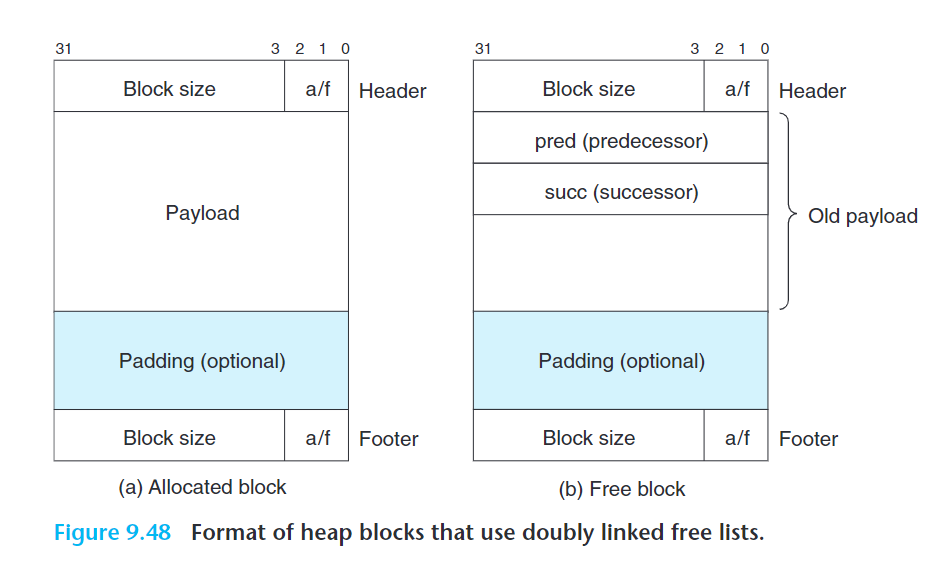

在每个空闲块中包含一个 `pred` 指针和一个 `succ` 指针，指向**前驱空闲块**和**后继空闲块**，构造一个**显式的双向空闲链表**

这使得 first fit 的分配时间从块总数的线性时间降低到了空闲块的线性时间。

取决于空闲链表中块的**排序策略**，释放块的时间可能是线性的，也可能是常数的：

**后进先出**（LIFO）：新释放的块放置在链表的开始处。搜索时，分配器先检查到的是最近使用过的块，释放块可以在常数时间内完成。如果使用了边界标记，那么合并也可以在常数时间内完成。

**地址顺序**（address-ordered）：空闲块按地址顺序排列。释放块需要线性时间，但内存利用率更高，接近 best fit。

显式链表要求了更大的最小块大小，提高了内部碎片化的程度。

### 分离的空闲链表

**分离存储**（segregated storage）：维护多个空闲链表，每个链表中的块有大致相等的大小。

一般将所有可能的块大小分成一些等价类，称为**大小类**（size class）。以下是一个例子，其中小的块单独成类，大的块按 $2$ 的幂分类：

$$\{1\}, \{2\}, \{3\}, \cdots, \{1023\}, \{1024\}, \{1025\sim2048\}, \{2049\sim4096\}, \{4097\sim\infty\}$$

每个大小类都有一个对应的空闲链表。

#### 简单分离存储

每个大小类的空闲链表的块大小相等，都等于大小类中最大元素的大小。若大小类为 $\{17\sim32\}$，则相应链表的块大小都是 32 字节。

对于分配请求，我们检查相应的空闲链表：

- 若链表非空：分配其第一个块的**全部**
- 若链表为空：向内核请求一个固定大小的额外的片，将其分成大小相等的块，组成新的空闲链表

对于释放请求，分配器简单地将这个块插入到相应空闲链表的头部。

简单分离存储**不分割、不合并**。

优点：

- 分配和释放的时间很短
- **块不需要头部**：因为每个片都只有大小相同的块，所以已分配块的大小可以直接从地址推断。因为不用合并，所以块也不需要已分配 / 空闲的标记。
- **块也不需要尾部**，因为不用合并
- 唯一需要的字段是空闲块携带的 `succ` 指针，因此最小块大小就是一个字

缺点：不分割会造成**内部碎片化**，不合并又会造成**外部碎片化**

#### 分离适配

分配器维护一个空闲链表的数组。每个空闲链表和一个大小类关联，包含潜在的大小不同的块，其大小是大小类的成员。

对于分配请求，我们对适当的大小类对应的空闲链表 first fit 搜索：

- 若找到，就（可选地）分割它，将剩余部分插入到适当的空闲链表中
- 若找不到，搜索下一个大小类对应的空闲链表
- 若查找完所有的空闲链表仍找不到，向内核请求额外的片，从其中分配出一个块，将剩余部分放置在适当大小类对应的空闲链表中

对于释放请求，我们执行合并，并将结果放置在适当的空闲链表中

GNU `malloc` 采用的就是分离适配方法。对分离空闲链表的简单的 first fit 搜索的内存利用率近似于对整个堆的 best fit 搜索。

#### 伙伴系统

伙伴系统（buddy system）是分离适配的特例，其中每个大小类都是 $2$ 的幂。

假设一个堆的大小是 $2^m$ 个字，我们为每个块大小 $2^k$ 维护一个分离空闲链表，其中 $0\leq k\leq m$。

初始时只有一个大小为 $2^m$ 个字的空闲块。

对于一个分配 $2^k$ 大小的块的请求，我们找到第一个可用的块，其大小为 $2^j$：

- 若 $j=k$，那么分配完成
- 否则 $j>k$，我们递归地二分它，直到 $j=k$，每次二分后剩下的半块（称为**伙伴**）放置在相应的空闲链表中

对于一个释放 $2^k$ 大小的块的请求，我们继续合并空闲的伙伴，直到遇到一个已分配的伙伴。

对于伙伴系统，如果给定地址和块大小，那么其伙伴的地址很容易计算。例如，若一个大小为 $32$ 字节的块的地址为

$$xxx\cdots x00000,$$

那么它的伙伴的地址就是

$$xxx\cdots x10000.$$

伙伴系统可以快速搜索并快速合并。然而它要求块大小全都是 $2$ 的幂，可能导致显著的内部碎片化。它不适合通用目的的工作负载，但对某些特定的应用场景效率很高。

## 垃圾收集

**垃圾收集器**（garbage collector）是一种动态内存分配器，它定期识别并回收不再使用的已分配块（垃圾）。

### 垃圾收集器的基本知识

垃圾收集器将内存视为一张**有向可达图**（reachability graph）。

图的结点被分成一组根结点和一组堆结点，**每个堆结点对应一个已分配块**。有向边 $p\rightarrow q$ 意味着块 $p$ 中的某个位置指向块 $q$ 中的某个位置。

根结点对应于**不在堆中，但指向堆中的块的指针**。这些指针可以是位于寄存器、栈中的局部变量，或虚拟内存数据区域中的全局变量。


如果可以从根结点到达 $p$，那么 $p$ 就是可达的。不可达结点就是垃圾。

ML 和 Java 的垃圾收集器对指针的创建的使用有严格的控制，能够精确地维护可达图，可以回收所有垃圾。但 C/C++ 的收集器通常无法精确地维护可达图，它们被称为**保守的垃圾收集器**（conservative garbage collector）。它们**将每个可达块都正确地识别为可达**，**但可能会将一些不可达块也识别为可达的**。

保守的垃圾收集器可以作为 `malloc` 和 `free` 之间的一个**中间模块**。

当 `malloc` 处理分配请求时，如果它找不到合适的空闲块，那么它就调用垃圾收集器，回收一些垃圾，然后再次搜索空闲块。如果仍然失败，那么它就向内核请求额外的堆内存。

### Mark&Sweep 垃圾收集器

Mark&Sweep 垃圾收集器由**标记**阶段和**清除**阶段组成。

标记阶段标记出根结点的所有可达且已分配的后继。清除阶段释放所有未被标记的已分配块。

通常用块头部中空闲低位中的一位来标记块。

```c
typedef void* ptr;

// If p points to some word in an allocated block, returns the base address of that block. Otherwise, returns NULL
ptr isPtr(ptr p);

// Returns 1 if block b is marked
int blockMarked(ptr b);

// Returns 1 if block b is allocated
int blockAllocated(ptr b);

// Marks block b
void markBlock(ptr b);

// Returns the length in words (excluding the header) of block b
int length(ptr b);

// Unmarks block b
void unmarkBlock(ptr b);

// Returns the address of the next block of block b
ptr nextBlock(ptr b);

// If p points to a allocated & unmarked block, marks it and recursively marks all blocks that the block points to
void mark(ptr p) {
    if ((b = isPtr(p)) == NULL)
        return;
    if (blockMarked(b))
        return;
    markBlock(b);
    len = length(b);
    for (i = 0; i < len; i++)
        mark(b[i]);
}

void sweep(ptr b, ptr end) {
    while (b < end) {
        if (blockMarked(b))
            unmarkBlock(b);
        else if (blockAllocated(b))
            free(b);
        b = nextBlock(b);
    }
}
```

标记阶段对**每个根结点**调用 `mark`。如果 `p` 没有指向已分配且未标记的块，立即返回；否则，标记块 `b`，并递归地检查块 `b` 中的每个字。

最后，任何未标记的已分配块都被认为是垃圾。

清除阶段调用 `sweep`，清除堆中所有的垃圾块。

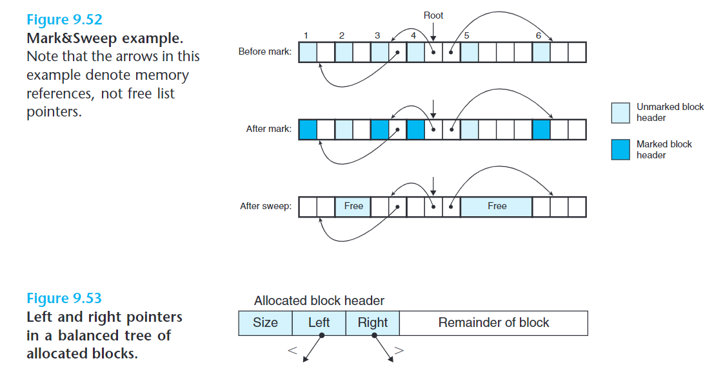

上图中，$1\sim 6$ 初始都为已分配块。第 $2$、$5$ 个块是不可达的，因此在清除阶段被回收到空闲链表。

### C 程序的保守 Mark&Sweep

- C 不会用类型信息标记内存位置，因此 `isPtr` 难以明确地判断其参数 `p` 是不是指针。即使 `p` 是指针，也无法判断它指向的是不是**已分配块的有效载荷**

我们将已分配块的集合维护成一颗**平衡二叉树**，其中左子树的块都被存放在小地址处，右子树的块都被存放在大地址处。

这要求块头部中附加 `left` 字段和 `right` 字段，通过在平衡二叉树中二分查找 `p` 确定它是否指向已分配块的有效载荷。

像 `int` 和 `float` 的变量可以伪装成指针，这对收集器而言是无法区分的。因此 C/C++ 垃圾收集器只能是保守的。

## C 程序中常见的与内存有关的错误

### 解引用坏指针

进程的虚拟地址空间中有很多较大的**洞**，它们没有映射到任何有意义的数据。解引用这些地址会导致**段错误**（segmentation fault）。

另一方面，试图写虚拟内存中的只读区域会导致**保护异常**。

```c
// scanf bug 是常见的解引用坏指针错误
scanf("%d", &x);      // ok
scanf("%d", x);       // 可能 segfault，可能 protection fault，最糟糕的情况会静默地 corrupt 内存
```

### 读未初始化的内存

`malloc` 分配的堆内存是未初始化的。

### 允许栈缓冲区溢出

不要使用 `gets` 函数，换用 `fgets`。

### 在类型大小上犯错

```c
int** A = (int**) Malloc(n * sizeof(int));    // 应该是 n * sizeof(int*)
```

这导致 `malloc` 分配的内存大小不够，我们可能写到超出数组 `A` 结尾的地方。如果写操作因此**覆写了这个已分配块的脚部**，那么在**释放**这个块时（这通常已经在很远的地方了），分配器就会出错。

这是典型的“action at distance”的示例，很难调试。

### 造成错位错误

错位（off-by-one）错误是另一种写越界的错误：

```c
int** A = (int**) Malloc(n * sizeof(int*));
for (int i = 0; i <= n; i++)    // 应该是 i < n
    A[i] = (int*) Malloc(m * sizeof(int));
```

### 错误地解引用指针

```c
*size--;      // 应该是 (*size)--
```

一元运算符 `--` 和 `*` 的优先级相同，它们**从右向左**结合，造成了错误。

### 错误地增减指针

```c
int* p = /* some address */;
while (*p && *p != target)
    p += sizeof(int);    // 应该是 p++
```

### 悬垂指针

```c
int* dangling(void) {
    int x;
    return &x;
}
```

函数返回一个悬垂指针，它指向栈上一个已经消亡了的局部变量，写它的解引用可能污染栈上的其他数据。

### 引用已经被释放的内存

```c
int* x;
free(x);
// ...
*x = 1;
```

如果 `x` 存储的地址后来又成为了已分配块的一部分，那么写操作就会污染这个块。

### 内存泄漏

```c
void leak(int n) {
    int* p = (int*) Malloc(n * sizeof(int));
}
```

`leak` 返回后，`p` 所分配的内存就再也无法访问到了。如果 `leak` 被经常调用，堆中就会充满这样的垃圾。对于长时间运行的程序影响很大。

# 系统级 I/O

I/O 是在主存和外部设备（磁盘驱动、终端、网络）之间复制数据的过程。

## Unix I/O

一个 Linux **文件**是一个 $m$ 字节的序列。

Linux 中，一切 I/O 设备都被视为文件，而所有的 I/O 操作都被视为对文件的读和写。这种优雅的映射使得 Linux 内核可以提供一个简单且底层的应用程序接口，称为 Unix I/O。

**打开文件**：应用程序通过要求内核打开相应的文件来宣告它想要访问某个 I/O 设备。内核返回一个用于标识对应文件的**文件描述符**（file descriptor），它是**非负整数**。内核维护有关此已打开文件的所有信息，应用程序只需要保存文件描述符。

Linux shell 创建的每个进程，在开始时都有三个已打开的文件：

- 标准输入（standard input）：文件描述符为 0
- 标准输出（standard output）：文件描述符为 1
- 标准错误（standard error）：文件描述符为 2

```c
#include <unistd.h>

// 以下常量可以代替显式的描述符值
STDIN_FILENO    // standard input
STDOUT_FILENO    // standard output
STDERR_FILENO    // standard error
```

**改变当前的文件位置**：对于每个已打开文件，内核维护一个**文件位置** $k$，初始值为 0，表示**从文件开头起的字节偏移量**。应用程序可以通过 `seek` 操作显式地设置文件的当前位置

**读写文件**：

- 读就是从当前文件位置 $k$ 起复制 $n>0$ 个字节到主存，然后将 $k$ 增加到 $k+n$。若文件大小为 $m$ 字节，则当 $k\geq m$ 时读操作会**触发 EOF 条件**（文件末尾并没有明确的 EOF 字符）
- 类似地，写就是从主存复制 $n>0$ 个字节到当前文件位置 $k$，然后更新 $k$

**关闭文件**：应用程序通过要求内核关闭文件来指明它已经完成了对此文件的访问。内核释放文件打开时创建的数据结构，将描述符恢复到可用的描述符池。无论进程因何终止，内核都会关闭所有打开的文件，并释放它们的内存

## 文件

Linux 文件有一个**类型**（type），包括：

- **普通文件**（regular file）：包含任意数据，在 `ls` 里用 `-` 指示。应用程序经常需要区分**文本文件**（只含有 ASCII 或 Unicode 字符的普通文件）和**二进制文件**（所有非文本文件）。对内核来说，文本文件和二进制文件没有区别
- **目录**（directory）：包含一组**链接**（link）的文件，每个链接都将一个文件名映射到一个文件（可以也是目录），在 `ls` 里用 `d` 指示。每个目录至少含有两个条目：`.` 是到目录自身的链接，`..` 是到父目录的链接
- **套接字**（socket）：用于进程间的跨网络通信
- 其他文件类型：命名通道（named pipe）、符号链接（symbolic link）、字符和块设备（character and block device）

Linux 内核将所有文件组织成一个**目录层次结构**（directory hierarchy）

每个进程都有一个**当前工作目录**（current working directory），这是它**上下文的一部分**。

**路径名**是一个字符串，包含一系列 `/` 分隔的文件名，分为**绝对路径名**（`/home/xm/helloc.c`）和**相对路径名**（`./hello.c`）

## 打开和关闭文件

```c
#include <sys/types.h>
#include <sys/stat.h>
#include <fcntl.h>

// 打开路径名 filename 的文件
// 返回：若成功，返回文件描述符；若出错，返回 -1
int open(char* filename, int flags, mode_t mode);
```

由 `open` 返回的文件描述符总是**当前进程中最小的未用描述符**，也就是说，如果已经打开了两个文件，其描述符是 `3` 和 `4`，那么下一次调用 `open` 就会返回 `5`。

`flags` 指示进程如何访问文件：

- $\text{O\_RDONLY}$：只读
- $\text{O\_WRONLY}$：只写
- $\text{O\_RDWR}$：可读可写

可以用或运算将以上标志与下列标志组合：

- $\text{O\_CREAT}$：如果文件不存在，则创建它的一个**截断的**文件（即创建一个大小为 `0` 的空文件）
- $\text{O\_TRUNC}$：如果文件存在，就**截断**它。**这会导致文件内容丢失**！
- $\text{O\_APPEND}$：每次写时都追加到文件的末尾（设置当前文件位置为文件末尾）

注意：没有 $\text{O\_RDONLY}\mid\text{O\_WRONLY}$ 这种东西，使用 $\text{O\_RDWR}$。

**截断**（truncate）：是置空（empty）的同义词，清除文件内容，但不删除文件。文件大小会被置为零。

`mode` 参数**只有在创建文件时**才有意义，它指定新文件的**访问权限**（access permission）：

- $\text{S\_IRUSR}$：Owner 可读
- $\text{S\_IWUSR}$：Owner 可写
- $\text{S\_IXUSR}$：Owner 可执行
- $\text{S\_IRGRP}$：Owner's group 可读
- $\text{S\_IWGRP}$：Owner's group 可写
- $\text{S\_IXGRP}$：Owner's group 可执行
- $\text{S\_IROTH}$：Others 可读
- $\text{S\_IWOTH}$：Others 可写
- $\text{S\_IXOTH}$：Others 可执行

其中 $S$ 代表 STAT，$I$ 代表 INODE。

每个进程都有一个 `umask`，它是通过调用 `umask` 函数来设置的，它是**进程上下文的一部分**。

```c
#define DEF_MODE S_IRUSR | S_IWUSR | S_IRGRP | S_IWGRP | S_IROTH | S_IWOTH
#define DEF_UMASK S_IWGRP | S_IWOTH

umask(DEF_UMASK);    // set process's umask
fd = open(filename, O_CREAT | O_TRUNC | O_WRONLY, DEF_MODE);    // permissions will be set to mode & ~umask
// fd's permissions: rw-r--r--
```

新文件的权限位是 `mode & ~umask`，`umask` 中置位的权限位会被屏蔽，总是被置零。

`close` 函数关闭文件。**关闭已经关闭的文件会出错**。

```c
#include <unistd.h>

// 关闭文件
// 返回：若成功，返回 0；若出错，返回 -1
int close(int fd);
```

## 读和写文件

```c
#include <unistd.h>

// 从 fd 的当前文件位置复制至多 n 字节到 buf
// 返回：实际读到的字节数。若 EOF 则返回 0，若出错则返回 -1
ssize_t read(int fd, void* buf, size_t n);

// 从 buf 复制至多 n 字节到 fd 的当前文件位置
// 返回：实际写入的字节数。若出错则返回 -1
ssize_t write(int fd, const void* buf, size_t n);
```

`lseek` 函数可以让应用程序显式地修改当前文件位置。

> `size_t` 在 x86-64 中被定义为 `unsigned long`，而 `ssize_t` 被定义为 `long`。

有时，`read` 和 `write` 传送的字节比应用程序要求的少，此时的返回值称为**不足值**（short count），原因有：

- **读时遇到 EOF**：文件从当前文件位置起只剩 20 字节，我们却要求读 50 字节，那么此次调用 `read` 就会返回 20，下次调用 `read` 就会返回 0（EOF）。
- **从终端读文本行**：如果打开的文件和终端相关联（如键盘和显示器），那么每个 `read` 函数将**一次传送一个文本行**，返回的不足值是文本行的大小
- **读写网络套接字**（socket）：如果打开的文件对应于网络套接字，那么内部缓冲约束和较长的网络延迟会引起 `read` 和 `write` 返回不足值。

除 EOF 以外，读写磁盘文件时不会遇到不足值。

## 用 RIO 包健壮地读写

RIO (Robust I/O) 包可以自动处理不足值，在像网络程序这样容易出现不足值的应用中非常有用。

RIO 提供了：

- **无缓冲的输入输出函数**：直接在内存和文件之间传送数据。对于将二进制数据在网络和内存之间传送非常有用
- **带缓冲的输入函数**：高效地从文件中读取文本行和二进制数据。它们是**线程安全**的，在同一个描述符上可以被交错调用：可以在同一个描述符中读一些文本行，然后读一些二进制数据，然后再读一些文本行。

### RIO 的无缓冲的输入输出函数

如果 `rio_readn` 和 `rio_writen` 被一个信号**中断**，那么它们会显式地重启 `read` 和 `write` 函数。这是为了代码的可移植性。

```c
#include "csapp.h"

// 从 fd 的当前文件位置直接复制至多 n 个字节到 buf
ssize_t rio_readn(int fd, void* usrbuf, size_t n) {
    size_t nleft = n;
    ssize_t nread;
    char* bufp = usrbuf;

    while (nleft > 0) {
        if ((nread = read(fd, bufp, nleft)) < 0) {
            if (errno == EINTR)  // interrupted by sig handler return
                nread = 0;       // call read() again
            else
                return -1;       // errno set by read()
        } else if (nread == 0)   // EOF
            break;
        nleft -= nread;
        bufp += nread;
    }
    return (n - nleft);  // return >= 0
}

// 从 buf 直接复制 n 个字节到 fd 的当前文件位置
ssize_t rio_writen(int fd, void* usrbuf, size_t n) {
    size_t nleft = n;
    ssize_t nwritten;
    char* bufp = usrbuf;

    while (nleft > 0) {
        if ((nwritten = write(fd, bufp, nleft)) <= 0) {
            if (errno == EINTR)  // interrupted by sig handler return
                nwritten = 0;    // and call write() again
            else
                return -1;       // errno set by write()
        }
        nleft -= nwritten;
        bufp += nwritten;
    }
    return n;
}
```

`rio_readn` **只会在 EOF 情形下返回不足值**，`rio_writen` **从不返回不足值**。

对同一个描述符，可以任意地交错调用 `rio_readn` 和 `rio_writen`。

### RIO 的带缓冲的输入函数

带缓冲区的 I/O 函数可以提高性能。

`rio_t` 结构体存放一个内部缓冲区。使用时先调用 `rio_readinitb` 注册一个 `rio_t` 结构体，然后调用 `rio_readlineb` 或 `rio_readnb` 读取数据。

`rio_read` 是 helper function，它从内部缓冲区向用户缓冲区复制数据。内部缓冲区一旦为空，就会自动从 `rio_t` 指示的文件描述符中重新装填满。

`rio_read` 和 `rio_t` 为 `rio_readlineb` 和 `rio_readnb` 提供了一层抽象，后两个函数可以将 `rio_read` 看成是系统调用 `read` 的一个等价替代。

```c
#include "csapp.h"

#define RIO_BUFSIZE 8192

// Internal buffer data structure
typedef struct {
    int rio_fd;                // descriptor for this internal buf
    int rio_cnt;               // unread bytes in internal buf
    char* rio_bufptr;          // next unread byte in internal buf
    char rio_buf[RIO_BUFSIZE]; // internal buffer
} rio_t;

// Helper function
// Initializes internal buffer
void rio_readinitb(rio_t* rp, int fd) {
    rp->rio_fd = fd;
    rp->rio_cnt = 0;
    rp->rio_bufptr = rp->rio_buf;
}

// Helper function
// Read up to n bytes from internal buf to usrbuf
// Automatically refills when buf is empty
static ssize_t rio_read(rio_t* rp, char* usrbuf, size_t n) {
    int cnt;

    while (rp->rio_cnt <= 0) {  // refill if buf is empty
        rp->rio_cnt = read(rp->rio_fd, rp->rio_buf, sizeof rp->rio_buf);

        if (rp->rio_cnt < 0) {    
            if (errno != EINTR)  // interrupted by sig handler return
                return -1;
        }
        else if (rp->rio_cnt == 0)  // EOF
            return 0;
        else
            rp->rio_bufptr = rp->rio_buf;  // reset buffer ptr to the beginning of the buffer
    }

    // copy min(n, rp->rio_cnt) bytes from internal buf to user buf
    cnt = rp->rio_cnt < n ? rp->rio_cnt : n;
    memcpy(usrbuf, rp->rio_bufptr, cnt);
    rp->rio_bufptr += cnt;
    rp->rio_cnt -= cnt;
    return cnt;
}

// Read a whole line (of at most maxlen bytes) from internal buffer to usrbuf
ssize_t rio_readlineb(rio_t* rp, void* usrbuf, size_t maxlen) {
    int n;     // num of lines read
    int rc;    // char read by rio_read
    char c;
    char* bufp = usrbuf;

    for (n = 1; n < maxlen; n++) {
        if ((rc = rio_read(rp, &c, 1)) == 1) {    // read 1 byte
            *bufp++ = c;
            if (c == '\n') {
                n++;
                break;
            }
        } else if (rc == 0) {
            if (n == 1)
                return 0;  // EOF, no data read
            else
                break;     // EOF, some data was read
        } else
            return -1;     // error
    }
    *bufp = 0;    // Append a NULL byte to the end of usrbuf
    return n - 1;
}

// Read up to n bytes from internal buffer to usrbuf
ssize_t rio_readnb(rio_t* rp, void* usrbuf, size_t n) {
    size_t nleft = n;
    ssize_t nread;
    char* bufp = usrbuf;

    while (nleft > 0) {
        if ((nread = rio_read(rp, bufp, nleft)) < 0) {
            return -1;           // errno set by read()
        } else if (nread == 0)   // EOF
            break;
        nleft -= nread;
        bufp += nread;
    }
    return (n - nleft);  // return >= 0
}
```

对同一描述符，**对以上两个带缓冲的输入函数的调用可以任意交错进行**，但是对带缓冲的输入函数的调用**不应和无缓冲的 `rio_readn` 函数交错调用**

## 读取文件元数据

应用程序可以调用 `stat` 和 `fstat` 函数，获得文件的**元数据**（metadata）

```c
#include <unistd.h>
#include <sys/stat.h>

// metadata returned by stat and fstat
struct stat {
    dev_t st_dev;         // device number
    ino_t st_ino;         // inode number
    mode_t st_mode;       // protection and file types
    nlink_t st_nlink;     // number of hard links
    uid_t st_uid;         // user ID of owner
    gid_t st_gid;         // group ID of owner
    dev_t st_rdev;        // device type (if inode device)
    off_t st_size;        // total size, in bytes
    unsigned long st_blksize; // blocksize for filesystem I/O
    unsigned long st_blocks;   // number of blocks allocated
    time_t st_atime;      // time of last access
    time_t st_mtime;      // time of last modification
    time_t st_ctime;      // time of last status change
};

// 这两个函数分别以路径名和文件描述符为输入，将文件元数据填充在 buf 参数中
// 返回：若成功则返回 0，若出错则返回 -1
int stat(const char* filename, struct stat* buf);
int fstat(int fd, struct stat* buf);
```

`st_size`：文件的字节数大小
`st_mode`：文件访问权限和文件类型

```c
#include <sys/stat.h>

mode_t m = buf.st_mode;

// 确定 st_mode 指示的文件类型的宏谓词
S_ISREG(m)    // is this a regular file?
S_ISDIR(m)    // is this a directory file?
S_ISSOCK(m)    // is this a network socket?
```

一个展示文件元数据的示例程序：

```c
#include "csapp.h"

// Usage: ./showstat <filename>

int main(int argc, char** argv) {
    struct stat stat;
    char* type, *readok;

    Stat(argv[1], &stat);
    if (S_ISREG(stat.st_mode))    // determine file type
        type = "regular";
    else if (S_ISDIR(stat.st_mode))
        type = "directory";
    else
        type = "other";
    if ((stat.st_mode & S_IRUSR)) // check read access
        readok = "yes";
    else
        readok = "no";
    printf("type: %s, read: %s\n", type, readok);
    exit(0);
}
```

## 读取目录内容

**流**是对一个有序列表的抽象，**目录流**（directory stream）就是一个目录中文件的列表。

```c
#include <sys/types.h>
#include <dirent.h>

// 打开目录
// 返回：若成功则返回指向目录流的指针，若出错则返回 NULL
DIR* opendir(const char* name);

// 目录的项
struct dirent {
    ino_t d_ino;       // inode number
    char d_name[256];  // null-terminated filename
    // ...
};

// 读取目录中的下一项
// 返回：指向目录中下一项的指针，若已到达目录尾或出错则返回 NULL
// 如果出错，还会设置 errno
struct dirent* readdir(DIR* dirp);

// 关闭目录流并释放资源
// 返回：若成功则返回 0，若出错则返回 -1
int closedir(DIR* dirp);
```

区分 `readdir` 调用出错和流结束情况的**唯一**方法是检查 `errno` 是否被修改。

一个打印目录中所有文件的程序示例：

```c
#include "csapp.h"

int main(int argc, char** argv) {
    DIR* streamp;
    struct dirent* dep;

    streamp = Opendir(argv[1]);

    errno = 0;
    while ((dep = readdir(streamp)) != NULL) {
        printf("Found file: %s\n", dep->d_name);
    }
    if (errno != 0)
        unix_error("readdir error");

    Closedir(streamp);
    exit(0);
}
```

## 共享文件

内核用三个数据结构标识打开的文件：

- **描述符表**（descriptor table）：每个进程有一张独立的描述符表，表项的**索引是打开的文件描述符**，表项是**指向文件表**的指针
- **文件表**（file table）：包含已打开的文件，所有进程共享文件表。表项包括**当前文件位置**、**引用计数**和一个**指向 v-node 表项的指针**。引用计数是指向此文件表表项的描述符表表项的个数。内核只会在其引用计数归零时删除文件表表项
- **v-node 表**（v-node table）：所有进程共享 v-node 表。v-node 表项包括 `stat` 结构中的大多数信息，包括 `st_mode` 和 `st_size` 等。

如果用同一个 `filename` 调用 `open` 两次，那么两个描述符表表项所指向的两个文件表表项会指向同一个 v-node 表表项。

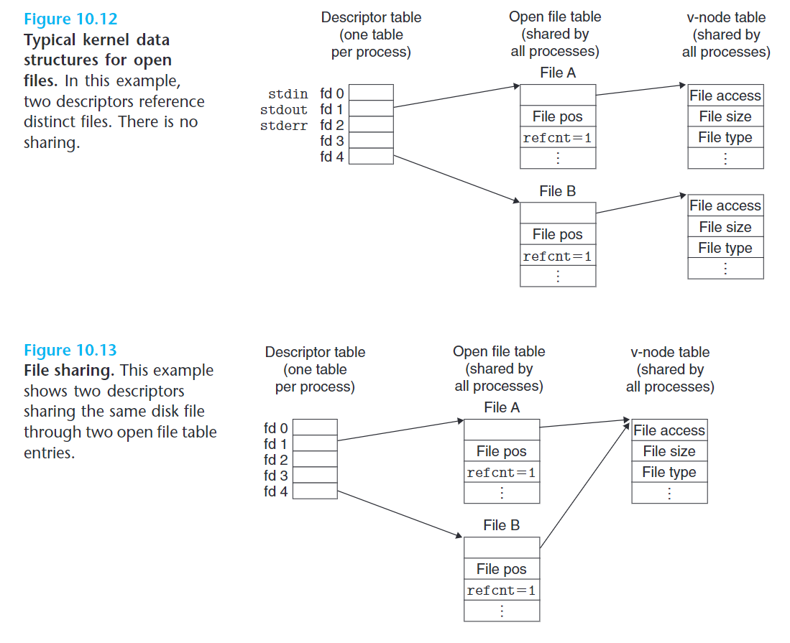

如果父进程调用 `fork` 创建子进程，那么子进程会继承父进程的描述符表，如下图。必须等到父子进程均关闭文件后，内核才能删除相应的文件表表项。


## I/O 重定向

```c
#include <unistd.h>

// 用描述表表项 oldfd 覆写描述符表表项 newfd
// 如果 newfd 已经打开，dup2 会在覆写前将其关闭
// 返回：若成功则返回 newfd，若出错则返回 -1 并设置 errno
int dup2(int oldfd, int newfd);
```

如果调用 `dup2(4, 1)` 之前的状态如图 10-12，那么调用之后的状态如图 10-15，此时文件 A 已经被关闭，它的文件表表项和 v-node 表表项也被删除，文件 B 的引用计数增加到 2。从此，任何写到标准输出的数据都会被重定向到文件 B。


## 标准 I/O

**标准 I/O 库**是 C 定义的一组高级输入输出函数。

它将一个已打开的文件视为一个**流**，即一个指向 `FILE` 对象的指针。每个 ANSI C 程序开始时都有三个已打开的流：

```c
#include <stdio.h>

extern FILE* stdin;    // standard input
extern FILE* stdout;   // standard output
extern FILE* stderr;   // standard error
```

流是**对文件描述符和流缓冲区的抽象**。流缓冲区和 RIO 读缓冲区类似，都是为了减少高开销的 Linux I/O 系统调用的次数，使局部性好的访问尽可能多从缓冲区得到服务。

## 我该使用哪些 I/O 函数？

- 尽量使用标准 I/O。对磁盘和终端设备 I/O 来说，这是最优解（不过标准 I/O 库没有与 `stat` 对应的函数）。
- 不要用 `scanf` 或 `rio_readlineb` 读二进制文件。二进制文件中可能包含许多 `0xa` 字节，这会被误认为是换行符。
- 对于网络套接字，使用 RIO 包。

标准 I/O 流是**全双工**（full duplex）的，即程序可以在同一个流上执行输入和输出。但对流的限制和对套接字的限制有时会冲突。

- **输出函数之后的输入函数**：如果中间没有插入 `fflush`、`fseek`、`fsetpos` 或 `rewind`，那么输入函数不能跟随在一个输出函数之后。`fflush` 清空与流相关的缓冲区，而后三者使用 Unix I/O `lseek` 函数来重置当前文件位置。
- **输入函数之后的输出函数**：如果中间没有插入 `fseek`、`fsetpos` 或 `rewind`，那么输出函数不能跟随在一个输入函数之后。**除非输入函数遭遇了 EOF**。

这两个限制给网络应用带来了麻烦。

第一个限制可以通过每次输入前调用 `fflush` 解决，然而由于对套接字调用 `lseek` 函数是非法的，解决第二个限制的唯一办法是**对同一个打开的套接字描述符打开两个流**，一个读，一个写。

```c
FILE* fpin;
FILE* fpout;

fpin = fdopen(sockfd, "r");
fpout = fdopen(sockfd, "w");

// 这又要求应用程序必须对两个流都调用 fclose，从而释放两个流的内存资源
fclose(fpin);
fclose(fpout);
// 由于 sockfd 已经被关闭，所以第二次 fclose 会失败
// 对顺序的程序，这不是问题。
// 但是在线程化的程序中关闭一个已关闭的描述符会导致灾难
// 因此：不要在网络套接字上使用标准 I/O 函数，换用 RIO 函数完成 I/O 操作
// 如果需要格式化输出，使用 sprintf 格式化一个字符串，再用 rio_writen 将它发送到套接口。
// 如果需要格式化输入，使用 rio_readlineb 读取一个完整的文本行，再用 sscanf 解析它
```

# 网络编程

## 客户端-服务器编程模型

每个网络应用都基于**客户端-服务器模型**（client-server model）。

一个应用由一个**服务器**进程和一个或多个**客户端**进程组成。服务器管理并操作某种资源，为客户端提供服务。

客户端-服务器模型中的基本操作是**事务**（transaction）：

- 客户端需要服务时，向服务器发送一个**请求**（request），发起一个事务
- 服务器收到请求，解释它，并操作它的资源
- 服务器返回客户端一个**响应**（response），并等待下一个请求
- 客户端收到响应，处理它

客户端和服务器是**进程**，而不是**主机**（host）。

## 网络

客户端和服务器通常运行在不同的主机上，通过计算机网络的软硬件资源通信。

对主机而言，网络只是一种 I/O 设备。插在 I/O 总线扩展槽上的**网络适配器**（network adapter）提供了到网络的物理接口。数据在网络和主存之间通过 I/O 和内存总线传送（通常为 DMA 传送）。

物理上，网络是一个按照地理远近组成的层次系统。最底层是 **LAN**（Local Area Network，**局域网**），范围为一栋建筑或一个校园。最流行的局域网技术是**以太网**（Ethernet），它适应力极强，从 $3\text{ Mb/s}$ 演变到 $10\text{ Gb/s}$。

一个**以太网段**（Ethernet segment）包括一些电缆（通常是双绞线）和一个**集线器**（hub）。

以太网段的范围通常较小，约为一个房间或一个楼层。每根电缆的**最大位带宽**相同，为 $100 \text{ Mb/s}$ 或 $1\text{ Gb/s}$，一端连接到集线器的一个**端口**（port），另一端连接到主机的适配器。

集线器不加分辨地将从一个端口上收到的所有位复制到其他所有端口上，因此，每台主机都能看到每个位。

每个以太网适配器都有一个全球唯一的 $48$ 位地址，存储在这个适配器的非易失性存储器上。一台主机可以发送一段位（称为**帧**，frame）到同网段的其他任何主机。

每个帧包括一个固定长度的**头部**（header），标识帧的源、目的和长度。其后就是存储数据的**有效载荷**（payload）。每个主机适配器都能看到这个帧，但只有目的主机实际读取它。

使用一些电缆和**网桥**（bridge），可以将多个以太网段连接成较大的局域网，称为**桥接以太网**（bridged Ethernet），它的范围可以是一个建筑或一个校园。

桥接以太网中，有些电缆连接网桥与网桥，另外一些电缆连接网桥和集线器。下图中，前者的带宽为 $1\text{ Gb/s}$，后者的带宽为 $100\text{ Mb/s}$。

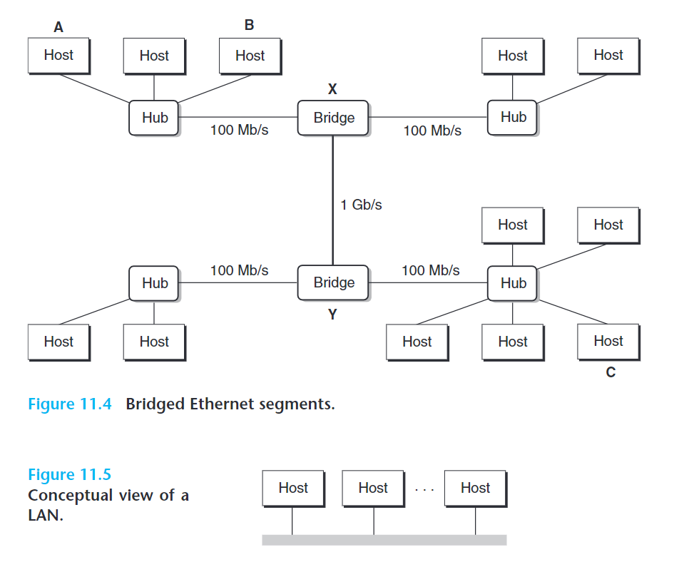

网桥比集线器更充分地利用了电缆带宽。它们可以学习哪个主机通过哪个端口可达，只在有必要时，有选择地将帧从一个端口复制到其他端口。

例如，如果主机 A 发送一个帧到同网段的主机 B，那么当这个帧到达网桥 X 的输入端口时，X 就会丢弃它。如果 A 发送一个帧到另一个网段的主机 C，那么 X 只会将此帧复制到和网桥 Y 相连的端口上，Y 只会将此帧复制到和 C 所在的网段连接的端口。

我们将集线器和网桥以及电缆抽象为一根水平线，如图 11-5。

多个不兼容的局域网可以通过**路由器**（router）连接起来，组成一个 **internet**（互联网络）。路由器是一种特殊的计算机，每台路由器对于它连接到的每个网络都有一个适配器（端口）。路由器也能连接**高速点到点电话连接**（high-speed point-to-point phone connections），它是 **WAN**（Wide-Area-Network, **广域网**）的一个例子。

路由器可以由各种局域网和广域网构建 internet。如图 11-6，三台路由器连接了一对局域网和一对广域网。


互联网络可以由采用完全不同且互不兼容技术的各种局域网和广域网组成，每台主机和其他主机都是**物理相连**的。

每台主机和路由器上运行着的**协议软件**（protocol software）消除了不同网络之间的差异，使得不兼容的网络中的主机之间也可以相互通信。协议软件实现一种协议，它有两种基本能力：

- **命名机制**（naming scheme）：不同局域网技术有不同且不兼容的方式为主机分配地址。internet 协议定义了一种一致的主机地址格式，为每台主机分配至少一个 **internet address**（互联网络地址）
- **传送机制**（delivery mechanism）：不同的联网技术中，帧的编码格式不同且不兼容。internet 协议定义了一种将数据位捆扎成不连续的片（称为**包**，packet）的方式。一个包由**包头**和**有效载荷**组成，包头包括包的大小、源主机地址、目的主机地址。


当主机 A 的客户端进程向主机 B 的服务器进程发送一串数据字节时：

1. 主机 A 上的客户端进程进行一个系统调用，从客户端的虚拟地址空间复制数据到内核缓冲区
2. 主机 A 上的协议软件通过在数据前附加 internet 包头和 LAN1 帧头，创建一个 LAN1 的帧
3. LAN1 适配器复制此帧到网络上
4. 到达路由器后，路由器的 LAN1 适配器从电缆上读取它，将它传送到协议软件
5. 路由器从 internet 包头中提取出目的主机地址，作为路由表的索引，确定向哪里转发这个包（本例中为 LAN2）。路由器剥落 LAN1 帧头，附加寻址到主机 B 的 LAN2 帧头，创建一个 LAN2 帧，传送到 LAN2 适配器
6. 路由器的 LAN2 适配器复制此帧到网络上
7. 此帧到达主机 B 时，它的适配器从电缆上读到此帧，将它传送到协议软件
8. 主机 B 的协议软件剥落包头和 LAN2 帧头。当服务器进程进行一个读取这些数据的系统调用时，协议软件将数据复制到主机 B 的虚拟地址空间

## 全球 IP 因特网

全球 IP 因特网（the global IP Internet）是最著名、最成功的 internet 实现。

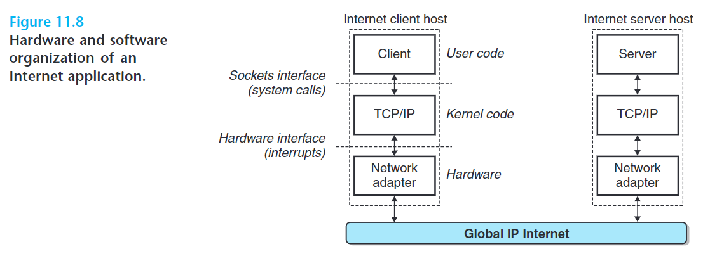

每台 Internet 主机都运行着实现 **TCP/IP 协议**（Transmission Control Protocol/Internet Protocol, 传输控制协议/互联网络协议）的软件。

Internet 的客户端和服务器混合使用**套接字接口函数**和 Unix I/O 函数通信。套接字接口函数通常被实现成系统调用，它们陷入内核，调用各种内核模式的 TCP/IP 函数。

TCP/IP 实际上是一个协议族，每个都提供一些不同的功能。

IP 协议提供基本的命名方法和传送机制。IP 协议中的包也叫**数据报**（datagram）。如果数据报在网络中丢失或重复，它并不会试图恢复，因此 IP 协议某种意义上并不可靠。**UDP**（Unreliable Datagram Protocol，**不可靠数据报协议**）是 IP 协议的扩展，它使得包可以在进程之间（而不是主机之间）传送。TCP 是构建在 IP 之上的复杂协议，提供了进程之间可靠的**全双工连接**（full duplex connections）。

我们不讨论 UDP，将 TCP/IP 整体看作一个协议。

从程序员角度，可以将 Internet 看作一个世界范围的主机集合，它：

- 被映射为一组 $32$ 位的 IP 地址
- 这组 IP 地址被映射为称为 **Internet 域名**（domain name）的标识符
- Internet 主机上的进程可以通过**连接**（connection）和 Internet 上其他任何主机上的进程通信

> 最初的 Internet 协议使用 $32$ 位地址，称为 Internet Protocol Version 4, IPv4。Internet 工程任务组织（Internet Engineering Task Force, IETF）提出了一个新版本的 IP，称为 IPv6，使用 $128$ 位地址。
> 现在（2023 年 12 月），Google 用户中 IPv6 的使用率约为 42%。

### IP 地址

IP 地址是一个 $32$ 位无符号整数，用于**标识主机**。它被存放在一个结构体中：

```c
struct in_addr {
    uint32_t s_addr;  // 32-bit IPv4 address (big-endian)
};
```

这是一个失败的设计，为 IP 地址定义一个标量类型更有意义。

TCP/IP 为任意整数数据定义了统一的**网络字节顺序**（network byte order），即采用大端法存储。Unix 提供了转换字节顺序的函数：

```c
#include <arpa/inet.h>

uint32_t htonl(uint32_t hostint32);  // host to network long
uint16_t htons(uint16_t hostint16);  // host to network short

uint32_t ntohl(uint32_t netint32);   // network to host long
uint16_t ntohs(uint16_t netint16);   // network to host short

// there's no 64-bit versions of these functions
```

IP 地址通常通过**点分十进制表示法**（dotted-decimal notation）表示，每个字节由它的十进制值表示，字节之间用点分隔。例如，`128.2.194.242` 就表示地址 `0x8002c2f2`。

```bash
hostname -i    # print IP address
```

可以用以下函数实现 IP 地址和点分十进制串的转换。函数名中，`n` 表示 network，代表 IP 地址；`p` 表示 presentation，代表点分十进制串。$\text{AF\_INET}$ 表示 IPv4 地址，$\text{AF\_INET6}$ 表示 IPv6 地址。

```c
#include <arpa/inet.h>

// 返回：若成功则返回 1，若 src 非法则返回 0，若出错则返回 -1
int inet_pton(AF_INET, const char* src, void* dst);

// size 规定了向 dst 复制的字节数的上限，得到的字符串以 NULL 结尾
// 返回：若成功则返回指向 dst 的指针，若出错则返回 NULL
const char* inet_ntop(AF_INET, const void* src, char* dst, socklen_t size);
```

### Internet 域名

Internet 客户端和服务器互相通信时使用的是 IP 地址，它不方便记忆。Internet 定义了**域名**（domain name），它是一串句点分隔的标识符（标识符可以包含字母、数字和连字符），例如 `pku.edu.cn`

域名集合形成了一个树形的层次结构。从树的叶结点到根结点的路径形成了域名，子树形成了**子域名**（subdomain）。


**一级域名**由非营利组织 ICANN（Internet Corporation for Assigned Names and Numbers）定义，包括 `com`、`edu`、`gov`、`net`、`org`。

二级域名，例如 `cmu.edu`，是由 ICANN 的各个授权代理按先到先服务的方式分配的。一旦一个组织得到了一个二级域名，它就可以在这个子域名下创建任何新域名了，例如 `cs.cmu.edu`

Internet 定义了从域名集合到 IP 地址集合的映射，直到 1988 年，这个映射都是通过一个叫做 `HOSTS.TXT` 的文件手工维护的。1988 年起，这个映射通过分布在世界范围内的 DNS（Domain Name System）维护。

DNS 数据库由上百万的**主机条目结构**（host entry structure）组成，每条定义一组域名和一组 IP 地址之间的映射。

```bash
# nslookup 打印某个域名对应的 IP 地址
nslookup cs.mit.edu
```

每台 Internet 主机都有本地定义的域名 `localhost`，它被映射为**回送地址**（loopback address）`127.0.0.1`

可以用 `hostname` 确定本地主机的实际域名

```bash
hostname
```

一个合法的域名可以映射到一个或多个 IP 地址，也可以不映射到任何 IP 地址（比如 `edu`）。多个域名也可以映射到同一个 IP 地址。

### Internet 连接

Internet 客户端和服务器通过在**连接**（connection）上发送和接收字节流来通信。连接是

- **点对点**的：进程对进程
- **全双工**的：数据可以同时双向流动的
- **可靠**的：源进程发送的字节流最终会被目的进程接收到，且接收到的字节流的顺序保证与发送的顺序相同（除非电缆被切断了）

一个**套接字**（socket）是连接的一个端点。每个套接字都有相应的**套接字地址**，由一个 Internet 地址和一个 $16$ 位整数**端口**组成，表示为 `address:port`。

客户端进程发起一个连接请求时，内核自动分配客户端套接字地址中的端口，称为**临时端口**（ephemeral port）。**临时端口的范围是 $1024\sim 5000$**。

服务器套接字地址中的端口通常是某个永久与该服务绑定的**知名端口**（well-known port），每个具有知名端口的服务都有一个对应的**知名服务名**（well-known service name）。例如，Web 服务器通常使用端口 `80`，知名服务名是 `http`，电子邮件服务器通常使用端口 `25`，知名服务名是 `smtp`。

`/etc/services` 文件列出了机器提供的知名名字和知名端口的映射。

一个连接由它两端的套接字地址唯一确定，这对套接字地址称作**套接字对**（socket pair），表示为 `(cliaddr:cliport, servaddr:servport)`

## 套接字接口

**套接字接口**（socket interface）是一组函数，它们可以和 Unix I/O 函数结合起来开发网络应用。


### 套接字地址结构体

对于 Linux 内核来说，套接字就是通信的端点。

对于 Linux 程序来说，套接字就是一个打开的文件。

Internet 的套接字地址存放在 $16$ 字节大的结构体 `sockaddr_in` 中。

```c
// IP socket address structure
struct sockaddr_in {
    uint16_t sin_family;  // Protocol family (always AF_INET)
    uint16_t sin_port;    // Port number in network byte order
    struct in_addr sin_addr;  // IP address in network byte order
    unsigned char sin_zero[8]; // Pad to sizeof(struct sockaddr)
};

// Generic socket address structure (for connect, bind, and accept)
struct sockaddr {
    uint16_t sa_family;  // Protocol family
    char sa_data[14];    // Address data
};
```

`_in` 后缀是 internet 的缩写。

`sa_family` 是 $2$ 字节的地址家族。

对于 Internet 应用，`sin_family` 为 $\text{AF\_INET}$，`sin_port` 为端口号，`sin_addr` 为 IP 地址。

`connect`、`bind` 和 `accept` 函数要求一个指向与协议相关的 `sockaddr` 结构体的指针。这需要泛型，然而当时的 C 中连 `void*` 类型都没有。

因此，套接字函数被定义为接受一个 `sockaddr*` 类型的参数，然后要求应用程序将协议特定的结构体指针强制转换为该类型。它是所有协议特定的套接字地址结构体的**虚父类**。

为了简便：

```c
typedef struct sockaddr SA;
```

### `socket` 函数

客户端和服务器使用 `socket` 函数创建一个**套接字描述符**（socket descriptor）

```c
#include <sys/types.h>
#include <sys/socket.h>

// 返回：若成功则为非负描述符，若出错则为 -1
int socket(int domain, int type, int protocol);
```

`domain` 参数指明网络层地址家族，对于 IPv4 地址，它是 $\text{AF\_INET}$。

`type` 参数指明传输层协议：

- $\text{SOCK\_STREAM}$：TCP 字节流
- $\text{SOCK\_DGRAM}$：UDP 数据报

例如，如果想要使套接字成为连接的一个端点：

```c
clientfd = Socket(AF_INET, SOCK_STREAM, 0);
```

更好的方法是使用 `getaddrinfo`，使得代码拥有更好的可移植性。

`socket` 返回的 `clientfd` 只是**部分打开**的，还不能用于读写。

### `bind` 函数

服务器调用 `bind` 函数来告诉内核将 `addr` 中的服务器套接字地址和套接字描述符 `sockfd` 绑定。

```c
#include <sys/socket.h>

// 返回：若成功则为 0，若出错则为 -1，并设置 errno
int bind(int sockfd, const struct sockaddr* addr, socklen_t addrlen);
```

`addrlen` 还是 `sizeof sockaddr_in`。

客户程序不需要调用 `bind`，内核会自动为其在 $1024\sim 5000$ 之间分配一个端口号。

### `connect` 函数

客户端调用 `connect` 函数向服务器发送连接请求。

```c
#include <sys/socket.h>

// 返回：若成功则为 0，若出错则为 -1
int connect(int clientfd, const struct sockaddr* addr, socklen_t addrlen);
```

`addrlen` 是 `sizeof sockaddr_in `。

`connect` 函数会阻塞，直到连接成功建立或发生错误。若成功，`clientfd` 就可以开始读写了，并且得到的连接由套接字对

```c
(x:y, addr.sin_addr:addr.sin_port)
```

刻画，其中 `x` 是客户端的 IP 地址，`y` 是临时端口，它唯一确定了客户端进程。

和 `socket` 一样，最好用 `getaddrinfo` 为 `connect` 提供参数。

### `listen` 函数

默认地，内核认为 `socket` 函数创建的描述符对应于**主动套接字**（active socket），属于这个连接的客户端一方。

服务器调用 `listen` 函数，让内核将 `sockfd` 由主动套接字转换为**监听套接字**（listening socket），该套接字可以接受来自客户端的连接请求。

`backlog` 参数设定了**监听队列长度**，通常为 $1024$。超过此长度后，内核开始拒绝连接请求。

```c
#include <sys/socket.h>

// 返回：若成功则为 0，若出错则为 -1
int listen(int sockfd, int backlog);
```

### `accept` 函数

服务器调用 `accept` 函数等待来自客户端的连接请求到达**监听描述符**（listening descriptor），然后在 `addr` 中填写客户端的套接字地址，返回一个**已连接描述符**（connected descriptor）。

已连接描述符可以用来利用 Unix I/O 函数和客户端通信，它是临时的，需要在通信完毕后调用 `close` 关闭。

```c
#include <sys/socket.h>

// 返回：若成功则为非负描述符，若出错则为 -1
int accept(int listenfd, struct sockaddr* addr, socklen_t* addrlen);
```

监听描述符是客户端连接请求的一个端点，通常**只被创建一次**，存在于**服务器的整个生命周期**。

已连接描述符是客户端和服务器之间已经建立起来的连接的一个端点。**服务器每次接受连接请求时都会被创建**，只存在于**服务器为一个客户端服务的过程中**。

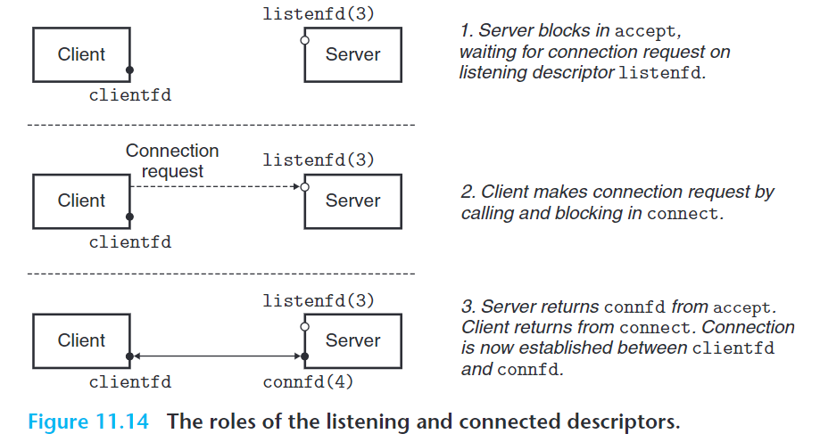

客户端和服务器建立连接的过程：

1. 服务器调用 `accept`，等待连接请求到达监听描述符 `listenfd`（假设为 $3$）
2. 客户端调用 `connect`，向服务器发送一个连接请求
3. `accept` 函数打开了一个新的**已连接描述符** `connfd`（假设为 $4$），在 `clientfd` 和 `connfd` 之间建立连接，并返回 `connfd` 给应用程序。客户端也从 `connect` 返回。
4. 此后，客户端和服务器就可以分别读写 `clientfd` 和 `connfd` 来回传送数据了

> 区别监听描述符和已连接描述符是很有必要的，它可以是我们建立并发服务器，同时处理许多客户端连接。

### `close` 函数

客户端和服务器调用 `close` 函数关闭一个套接字描述符。

```c
#include <unistd.h>

// 返回：若成功则为 0，若出错则为 -1
int close(int fd);
```

如果 `fd` 是 TCP 套接字描述符，调用 `close` 会引起**本地进程向远程进程发送关闭连接的消息**，连接关闭后，相关的资源被释放。

### 主机和服务的转换

#### `getaddrinfo` 函数

`getaddrinfo` 将主机名、主机地址、服务名和端口号的字符串表示转化成 `sockaddr` 结构体。它是已弃用的 `gethostbyname` 和 `getservbyname` 的替代。

`getaddrinfo` 是**可重入**的，适用于各种协议。

```c
#include <sys/types.h>
#include <sys/socket.h>
#include <netdb.h>

// 返回：若成功则为 0，若出错则为非 0 的错误代码
int getaddrinfo(const char* host, const char* service,
                const struct addrinfo* hints, struct addrinfo** result);

// 返回：无
void freeaddrinfo(struct addrinfo* result);

// 返回：错误消息
const char* gai_strerror(int errcode);
```

`result` 是一个指向 `struct addrinfo*` 类型的指针，或者说，一个指向 `addrinfo` 链表的指针。

`getaddrinfo` 会在函数体内**为 `*result` 赋值**，如果将可能为 `NULL` 的 `result` 传给 `getaddrinfo`，那么就会触发 segfault。

```c
// correct usage
struct addrinfo *results;
getaddrinfo("localhost", "http", NULL, &results);
```

`addrinfo` 结构体定义如下：

```c
struct addrinfo {
    int ai_flags;           // Hints argument flags
    int ai_family;          // First arg to socket function
    int ai_socktype;        // Second arg to socket function
    int ai_protocol;        // Third arg to socket function
    char* ai_canonname;     // Canonical hostname
    size_t ai_addrlen;      // Size of ai_addr struct
    struct sockaddr* ai_addr;   // Ptr to socket address structure
    struct addrinfo* ai_next;   // Next in linked list
};
```


`result` 指向的链表中，每个 `addrinfo` 结构体的 `ai_addr` 字段指向一个 `sockaddr` 结构体。

为了避免内存泄漏，必须调用 `freeaddrinfo` 释放 `getaddrinfo` 分配的内存。

如果 `getaddrinfo` 返回非零的错误代码，可以调用 `gai_strerror` 打印对应的错误消息。

`host` 参数可以是域名，也可以是点分十进制的 IP 地址。`service` 参数可以是服务名（如 `http`），也可以是十进制端口号。如果不想将主机名转换成地址，可以将 `host` 设为 `NULL`；如果不想将服务名转换成端口号，也可以将 `service` 设为 `NULL`，但不能同时将两者都设为 `NULL`。

`hints` 参数是可选的，它提供对返回的链表更好的控制。传递的 `hints` 参数指向的结构体只能设置以下字段，其余字段必须被置零：

- `ai_family`：设置为 $AF\_INET$ 将限制为 IPv4 地址，设置为 $AF\_INET6$ 将限制为 IPv6 地址
- `ai_socktype`：`getaddrinfo` 默认最多返回三个 `addrinfo` 结构体，它们的 `ai_socktype` 字段不同：一个是连接，一个是数据报，一个是原始套接字。设置为 $SOCK\_STREAM$ 将限制为对每个地址最多一个 `addrinfo` 结构体，对应连接。
- `ai_flags`：一个位掩码，包括以下标志，它们可以用或运算组合：
  - $AI\_ADDRCONFIG$：对于连接来说推荐。只返回适用于主机的地址，主机是 IPv4，就只返回 IPv4 地址；主机是 IPv6，就只返回 IPv6 地址。
  - $AI\_CANONNAME$：`ai_canonname` 字段默认为 `NULL`，设置此标志将使得 `getaddrinfo` 将链表中首个 `addrinfo` 结构体的 `ai_canonname` 置为主机的规范名（canonical name）。
  - $AI\_NUMERICSERV$：`service` 参数默认为服务名或端口号，此标志强制 `service` 参数为端口号。
  - $AI\_PASSIVE$：`getaddrinfo` 返回的默认为套接字地址，客户端可以在调用 `connect` 时将其用作主动套接字。设置此标志令 `getaddrinfo` 返回可以被服务器用作监听套接字的**通配符地址**（wildcard address），告诉内核这个服务器会接受发送到该主机所有 IP 地址的请求。此时，`host` 参数应为 `NULL`
- `ai_protocol`

`getaddrinfo` 的一个重要好处在于 `addrinfo` 结构体的字段是**不透明**的，程序员可以直接将它们传递给套接字接口中的函数，使得代码可移植性更好。

客户端建立连接时，先调用 `getaddrinfo`，然后遍历返回的链表，依次对每个套接字地址尝试调用 `socket` 和 `connect`，直到成功建立连接。

服务器开始监听连接请求时，也先调用 `getaddrinfo`，遍历这个链表，依次对每个套接字地址尝试调用 `socket` 和 `bind`，直到描述符被绑定到合法的套接字地址。

#### `getnameinfo` 函数

`getnameinfo` 将 `sockaddr` 结构体转换成主机名和服务名。它是已弃用的 `gethostbyaddr` 和 `getservbyport` 的替代。

`getnameinfo` 是**可重入**的，适用于各种协议。

```c
#include <sys/types.h>
#include <netdb.h>

// 返回：若成功则为 0，若出错则为非 0 的错误代码
int getnameinfo(const struct sockaddr* sa, socklen_t salen,
                char* host, size_t hostlen,
                char* service, size_t servlen,
                int flags);
```

`getnameinfo` 函数将 `sa` 指向的 `sockaddr` 结构体转换成主机名和服务名，存放在 `host` 和 `service` 中。

如果 `getnameinfo` 返回非零的错误代码，可以调用 `gai_strerror` 打印对应的错误消息。

如果不想要主机名，可以将 `host` 置为 `NULL`，将 `hostlen` 置为 `0`；如果不想要服务名，可以将 `service` 置为 `NULL`，将 `servlen` 置为 `0`，但不能同时将两者都置为 `NULL`。

`flags` 是一个位掩码，包括以下标志，它们可以用或运算组合：

- $NI\_NUMERICHOST$：`getnameinfo` 默认返回 `host` 的域名，设置此标志将使得 `getnameinfo` 返回 `host` 的点分十进制 IP 地址
- $NI\_NUMERICSERV$：`getnameinfo` 默认检查 `/etc/services`，优先返回 `service` 的服务名，设置此标志将使得 `getnameinfo` 跳过查找，直接返回 `service` 的端口号

以下示例程序使用 `getaddrinfo` 和 `gethostinfo` 展示域名和它关联的 IP 地址的映射，类似于 `nslookup`：

```c
#include "csapp.h"

int main(int argc, char** argv) {
    struct addrinfo* p;
    struct addrinfo* listp;
    struct addrinfo hints;

    char buf[MAXLINE];
    int rc, flags;

    if (argc != 2) {
        fprintf(stderr, "usage: %s <domain name>\n", argv[0]);
        exit(0);
    }

    /* Get a list of addrinfo records */
    memset(&hints, 0, sizeof(struct addrinfo));
    hints.ai_family = AF_INET;  /* IPv4 only */
    hints.ai_socktype = SOCK_STREAM;  /* Connections only */
    if ((rc = getaddrinfo(argv[1], NULL, &hints, &listp)) != 0) {
        fprintf(stderr, "getaddrinfo error: %s\n", gai_strerror(rc));
        exit(1);
    }

    /* Walk the list and display each IP address */
    flags = NI_NUMERICHOST;  /* Display address string instead of domain name */
    for (p = listp; p; p = p->ai_next) {
        Getnameinfo(p->ai_addr, p->ai_addrlen, buf, MAXLINE, NULL, 0, flags);
        printf("%s\n", buf);
    }

    /* Clean up */
    Freeaddrinfo(listp);

    exit(0);
}
```

### 套接字接口的辅助函数

#### `open_clientfd` 函数

客户端调用 `open_clientfd` 与运行在 `hostname` 主机上、通过端口号 `port` 监听连接请求的服务器进程建立连接。它返回一个打开的套接字描述符，可以用 Unix I/O 函数进行读写。

以上的代码与 IP 版本无关，是干净可移植的。

```c
#include "csapp.h"

// 返回：若成功则为套接字描述符，若出错则为 -1
int open_clientfd(char* hostname, char* port) {
    int clientfd;
    struct addrinfo hints
    struct addrinfo* listp;
    struct addrinfo* p;

    /* Get a list of potential server addresses */
    memset(&hints, 0, sizeof(struct addrinfo));
    hints.ai_socktype = SOCK_STREAM;  /* Open a connection */
    hints.ai_flags = AI_NUMERICSERV;  /* ... using a numeric port arg. */
    hints.ai_flags |= AI_ADDRCONFIG;  /* Recommended for connections */
    Getaddrinfo(hostname, port, &hints, &listp);

    /* Walk the list for one that we can successfully connect to */
    for (p = listp; p; p = p->ai_next) {
        /* Create a socket descriptor */
        if ((clientfd = socket(p->ai_family, p->ai_socktype, p->ai_protocol)) < 0)
            continue;  /* Socket failed, try the next */

        /* Connect to the server */
        if (connect(clientfd, p->ai_addr, p->ai_addrlen) != -1)
            break;  /* Success */

        Close(clientfd);  /* Connect failed, try another */
    }

    /* Clean up */
    Freeaddrinfo(listp);
    if (!p)  /* All connects failed */
        return -1;
    else  /* The last connect succeeded */
        return clientfd;
}
```

#### `open_listenfd` 函数

服务器调用 `open_listenfd` 打开一个与 `port` 端口关联的监听描述符，它监听来自任意 IP 地址的客户端的连接请求。

```c
#include "csapp.h"

// 返回：若成功则为监听描述符，若出错则为 -1
int open_listenfd(char* port) {
    struct addrinfo hints;
    struct addrinfo* listp;
    struct addrinfo* p;
    int listenfd, optval = 1;

    /* Get a list of potential server addresses */
    memset(&hints, 0, sizeof(struct addrinfo));
    hints.ai_socktype = SOCK_STREAM;  /* Accept connections */
    hints.ai_flags = AI_PASSIVE | AI_ADDRCONFIG;  /* ... on any IP address */
    hints.ai_flags |= AI_NUMERICSERV;  /* ... using port number */
    Getaddrinfo(NULL, port, &hints, &listp);

    /* Walk the list for one that we can bind to */
    for (p = listp; p; p = p->ai_next) {
        /* Create a socket descriptor */
        if ((listenfd = socket(p->ai_family, p->ai_socktype, p->ai_protocol)) < 0)
            continue;  /* Socket failed, try the next */

        /* Eliminates "Address already in use" error from bind */
        Setsockopt(listenfd, SOL_SOCKET, SO_REUSEADDR, (const void*)&optval, sizeof(int));

        /* Bind the descriptor to the address */
        if (bind(listenfd, p->ai_addr, p->ai_addrlen) == 0)
            break;  /* Success */

        Close(listenfd);  /* Bind failed, try the next */
    }

    /* Clean up */
    Freeaddrinfo(listp);
    if (!p)  /* No address worked */
        return -1;

    /* Make it a listening socket ready to accept connection requests */
    if (listen(listenfd, LISTENQ) < 0) {
        Close(listenfd);
        return -1;
    }
    return listenfd;
}
```

我们使用了 `setsockopt` 函数配置服务器，使得服务器可以被立即终止、重启，并且可以立即开始接受连接请求。一个重启的服务器默认将在约 $30$ 秒内开始拒绝客户端的连接请求，这不利于调试。

我们使用了 $\text{AI\_PASSIVE}$ 标志，并将 `host` 置为了 `NULL`，这使得 `getaddrinfo` 返回一个通配符地址，告诉内核这个服务器会接受发送到该主机所有 IP 地址的请求。

### echo 客户端和服务器的示例

echo 客户端先和服务器建立连接，然后进入循环，反复从标准输入读取文本行，发送给服务器，再从服务器接收回送的文本行，打印到标准输出。

当 `fgets` 在标准输入中遇到 EOF，或用户键入 `Ctrl+D` 时，循环终止，客户端关闭套接字描述符，这会发送一个 EOF 通知给服务器。

对于此程序，实际上不需要显式地调用 `Close` 来关闭套接字描述符，因为程序终止时，客户端的内核会自动将其关闭。

```c
#include "csapp.h"

int main(int argc, char** argv) {
    int clientfd;
    char* host;
    char* port;
    char buf[MAXLINE];
    rio_t rio;

    if (argc != 3) {
        fprintf(stderr, "usage: %s <host> <port>\n", argv[0]);
        exit(0);
    }
    host = argv[1];
    port = argv[2];

    clientfd = Open_clientfd(host, port);
    Rio_readinitb(&rio, clientfd);

    while (Fgets(buf, MAXLINE, stdin) != NULL) {
        Rio_writen(clientfd, buf, strlen(buf));
        Rio_readlineb(&rio, buf, MAXLINE);
        Fputs(buf, stdout);
    }
    Close(clientfd);  
    exit(0);
}
```

echo 服务器先打开一个监听描述符，然后进入循环，等待一个来自客户端的连接请求，输出连接到的客户端的域名和 IP 地址，并调用 `echo` 函数为它们提供服务。

我们将 `clientaddr` 声明成了 `struct sockaddr_storage`（而不是 `struct sockaddr_in`），这是一个足够大的结构体，可以容纳任何套接字地址，使得代码协议无关。

此服务器一次只能处理一个客户端，即它一次一个地在客户端之间迭代，称为**迭代服务器**（iterative server）

```c
#include "csapp.h"

void echo(int connfd) {
    size_t n;
    char buf[MAXLINE];
    rio_t rio;

    Rio_readinitb(&rio, connfd);
    while ((n = Rio_readlineb(&rio, buf, MAXLINE)) != 0) {
        printf("server received %d bytes\n", n);
        Rio_writen(connfd, buf, n);
    }
}

int main(int argc, char** argv) {
    int listenfd;
    int connfd;
    socklen_t clientlen;
    struct sockaddr_storage clientaddr;    // Enough space for any address
    char client_hostname[MAXLINE];
    char client_port[MAXLINE];

    if (argc != 2) {
        fprintf(stderr, "usage: %s <port>\n", argv[0]);
        exit(0);
    }

    listenfd = Open_listenfd(argv[1]);

    while (1) {
        clientlen = sizeof(struct sockaddr_storage);
        connfd = Accept(listenfd, (SA*)&clientaddr, &clientlen);
        Getnameinfo((SA*)&clientaddr, clientlen, client_hostname, MAXLINE, client_port, MAXLINE, 0);
        printf("Connected to (%s, %s)\n", client_hostname, client_port);
        echo(connfd);
        Close(connfd);
    }
    exit(0);
}
```

> 并不存在 EOF 字符。EOF 是内核检测的一种条件。应用程序在调用 `read` 得到零返回值时、读磁盘文件超出文件长度时、Internet 连接时进程关闭套接字描述符时，都会发生 EOF 条件。

## Web 服务器

### Web 基础

Web 客户端和服务器之间使用 **HTTP**（HyperText Transfer Protocol）协议通信。

Web 客户端（浏览器）打开一个到服务器的 Internet 连接，请求某些**内容**。服务器响应此请求，关闭连接。浏览器读取这些内容，将它们显示在屏幕上。

Web 内容可以用 **HTML**（HyperText Markup Language）编写，它是一种用于描述文档的标记语言。HTML 可以包含超链接，指向存放在任何 Internet 主机上的内容。

> 万维网（World Wide Web）由 Tim Berners-Lee 在 1989 年发明，是一种基于超文本的分布式信息系统。

### Web 内容

**内容**是一个与 MIME（Multipurpose Internet Mail Extensions）类型相关联的字节序列。

常用的 MIME 类型：

- `text/html`：HTML 页面
- `text/plain`：纯文本
- `application/postscript`：PostScript 文档
- `image/jpeg`：JPEG 图像
- `image/gif`：GIF 图像
- `image/png`：PNG 图像

Web 服务器以两种不同的方式向客户端提供内容：

- 取一个磁盘文件（称为**静态内容**，static content），将其内容返回给客户端（称为**服务静态内容**，serving static content）。
- 运行一个可执行文件，将其输出（称为动态内容，dynamic content）返回给客户端（称为**服务动态内容**，serving dynamic content）。

由 Web 服务器返回的内容都与它管理的某个文件关联，每个这样的文件都被一个唯一的 **URL**（Universal Resource Locator）标识。例如，以下 URL 标识 Internet 主机 `www.google.com` 上的 `/index.html` 文件，它受到监听端口为 $80$ 的 Web 服务器的管理。**端口号是可选的**，默认为知名的 HTTP 端口号 $80$。

```md
http://www.google.com:80/index.html
```

可执行文件的 URL 可以在文件名之后包含程序参数。`?` 分隔文件名和参数，`&` 分隔两个参数。例如，以下 URL 标识了可执行文件 `/cgi-bin/adder`，它会被以参数 `15000` 和 `213` 调用。

```md
http://bluefish.ics.cs.cmu.edu:8000/cgi-bin/adder?15000&213
```

事务过程中，客户端使用 URL 的前缀部分（如 `http://www.google.com:80`）来决定与什么服务器的什么端口建立连接。服务器通过 URL 的后缀部分（如 `/index.html`）来寻找它文件系统中的文件。

**没有标准的规则来确定一个 URL 指向的是静态内容还是动态内容**。经典的方法是指定一组目录，所有可执行文件必须存放在这些目录中

URL 后缀中开头的 `/` 不表示 Linux 根目录。它表示被请求内容类型的主目录。例如，可以将所有静态内容存放在 `/usr/httpd/html`，将所有动态内容存放在 `/usr/httpd/cgi-bin`。

最小的 URL 后缀是 `/`，所有服务器将其扩展成某个默认的主页，例如 `/index.html`。当用户只输入了一个域名时，浏览器在 URL 后添加 `/`，然后发送请求，服务器又将 `/` 扩展到它默认的文件名

### HTTP 事务

HTTP 基于在 Internet 连接上传送的文本行，可以使用 Linux `telnet` 程序和 Internet 上的任何 Web 服务器交互。

```bash
telnet www.aol.com 80
Trying 205.188.146.23...
Connected to aol.com.
Escape character is '^]'.
GET / HTTP/1.0      
Host: www.aol.com

HTTP/1.0 200 OK
MIME-Version: 1.0
Date: Mon, 8 Jan 2010 4:59:42 GMT
Server: Apache-Coyote/1.1
Content-Type: text/html
Content-Length: 42092

<html>
...
</html>
Connection closed by foreign host.
```

HTTP 标准要求每个文本行以 `\r\n` 结尾。每次输入一个文本行后，`telnet` 会读取该行，并在后面追加 `\r\n`，然后发送给服务器。

#### HTTP 请求

一个 HTTP **请求**（request）包括：

- **请求行**（request line）：形如 `method URI version`
- 零个或多个**请求报头**（request header）：形如 `header-name: header-data`
- 空文本行，表示报头终止

HTTP 支持多种**方法**（method），包括 $\text{GET}, \text{POST}, \text{OPTIONS}, \text{HEAD}, \text{PUT}, \text{DELETE}, \text{TRACE}$。其中 $\text{GET}$ 方法指导服务器生成并返回 URI（Uniform Resource Identifier）标识的内容。URI 是相应 URL 的后缀（对于浏览器如此，代理服务器请求内容时需要使用完整的 URL）。

请求行中的 `version` 字段表明 HTTP 版本，最新版本为 HTTP/1.1。HTTP/1.1 定义了一些附加报头，支持缓冲、安全等高级特性，还允许客户端和服务器在同一条**持久连接**（persistent connection）上执行多个事务。两个版本互相兼容，HTTP/1.0 的客户端会简单忽略 HTTP/1.1 报头。

上例中的请求行向服务器请求 `/`，即 `/index.html`。

请求报头为服务器提供额外信息。`Host` 报头只在 HTTP/1.1 中是需要的。

**代理缓存**（proxy cache）使用 `Host` 报头，它有时作为浏览器和管理被请求文件的**原始服务器**（origin server）的中介。客户端和原始服务器之间可以由多个代理，即**代理链**（proxy chain）。`Host` 报头中的数据指示了原始服务器的域名，代理可以利用它判断是否可以在本地缓存中拥有一个被请求内容的副本。

#### HTTP 响应

一个 HTTP **响应**（response）包括：

- **响应行**（response line）：形如 `version status-code status-message`
- 零个或多个**响应报头**（response header）：形如 `header-name: header-data`
- 空文本行，表示报头终止
- **响应主体**（response body）：响应的内容

对于响应行，`version` 字段描述响应的 HTTP 版本。**状态码**（status-code）是一个 $3$ 位正整数，指明对请求的处理结果。**状态消息**（status message）给出状态码的描述。

| 状态码 | 状态消息 | 描述 |
| :---: | :---: | :--- |
| 200 | OK | 请求成功 |
| 301 | Moved Permanently | 内容已移动到 location 头中指明的主机 |
| 400 | Bad Request | 错误请求 |
| 403 | Forbidden | 服务器无权访问所请求的文件 |
| 404 | Not Found | 服务器无法找到所请求的文件 |
| 501 | Not Implemented | 服务器不支持所请求的方法 |
| 505 | HTTP Version Not Supported | 服务器不支持请求的 HTTP 版本 |

### 服务动态内容

**CGI**（Common Gateway Interface，通用网关接口）定义了服务器提供动态内容的标准方法。

#### 客户端将程序参数传递给服务器

$\text{GET}$ 请求的参数在 URI 中传递。参数中不允许空格，空格用 `%20` 表示。其他特殊字符也有特殊的编码。

> HTTP $\text{POST}$ 请求的参数在请求主体中传递，而不是 URI

#### 服务器将参数传递给子进程

服务器接收到如下的请求后：

```bash
GET /cgi-bin/adder?15000&213 HTTP/1.1
```

它调用 `fork` 创建子进程，将子进程中的 CGI 环境变量 $\text{QUERY\_STRING}$ 设置为 `15000&213`， 并调用 `execve` 加载程序。`adder` 可以在运行时用 Linux `getenv` 函数引用 $\text{QUERY\_STRING}$。

`adder` 这类程序遵守 CGI 标准，常被称为 **CGI 程序**。很多 CGI 程序由 Perl 脚本编写，也常被称为 CGI 脚本。

#### 服务器如何将其他信息传递给子进程

CGI 定义了大量的环境变量。

| 环境变量 | 描述 |
| :---: | :--- |
| $\text{QUERY\_STRING}$ | 程序参数 |
| $\text{SERVER\_PORT}$ | 父进程监听的端口号 |
| $\text{REQUEST\_METHOD}$ | 请求方法 |
| $\text{REMOTE\_HOST}$ | 客户端域名 | 
| $\text{REMOTE\_ADDR}$ | 客户端点分十进制 IP 地址 |
| $\text{CONTENT\_TYPE}$ | 只对 $\text{POST}$ 有意义：请求体的 MIME 类型 |
| $\text{CONTENT\_LENGTH}$ | 只对 $\text{POST}$ 有意义：请求体的字节长度 |

#### 子进程将其输出发送到哪里

CGI 程序将它的动态内容发送到标准输出。但在 CGI 程序被子进程加载并运行之前，标准输出会被**重定向到客户端的已连接描述符**。因此，CGI 程序的输出会被发送到客户端。

父进程不知道子进程内容的类型和大小，子进程需要负责生成 `Content-type` 和 `Content-length` 响应报头，以及终止报头的空行。

以下为一个 CGI 程序示例：

```c
#include "csapp.h"

int main(void) {
    char* buf;
    char* p;
    char arg1[MAXLINE], arg2[MAXLINE], content[MAXLINE];
    int n1 = 0, n2 = 0;

    /* Extract the two arguments */
    if ((buf = getenv("QUERY_STRING")) != NULL) {
        p = strchr(buf, '&');
        *p = '\0';
        strcpy(arg1, buf);
        strcpy(arg2, p+1);
        n1 = atoi(arg1);
        n2 = atoi(arg2);
    }

    /* Make the response body */
    sprintf(content, "QUERY_STRING=%s", buf);
    sprintf(content, "Welcome to add.com: ");
    sprintf(content, "%sTHE Internet addition portal.\r\n<p>", content);
    sprintf(content, "%sThe answer is: %d + %d = %d\r\n<p>", content, n1, n2, n1+n2);
    sprintf(content, "%sThanks for visiting!\r\n", content);

    /* Generate the HTTP response */
    printf("Connection: close\r\n");
    printf("Content-length: %d\r\n", (int)strlen(content));
    printf("Content-type: text/html\r\n\r\n");
    printf("%s", content);
    fflush(stdout);

    exit(0);
}
```

> 对于 $\text{POST}$ 请求，子进程也需要重定向标准输入到已连接描述符。之后，CGI 程序从标准输入读取请求体。

## 综合：TINY Web 服务器

```c
/*
 * tiny.c - A simple, iterative HTTP/1.0 Web server that uses the
 *     GET method to serve static and dynamic content.
 */
#include "csapp.h"

void doit(int fd);
void read_requesthdrs(rio_t* rp);
int parse_uri(char* uri, char* filename, char* cgiargs);
void serve_static(int fd, char* filename, int filesize);
void get_filetype(char* filename, char* filetype);
void serve_dynamic(int fd, char* filename, char* cgiargs);
void clienterror(int fd, char* cause, char* errnum, char* shortmsg,
                 char* longmsg);

void doit(int fd) {
    int is_static;
    struct stat sbuf;
    char buf[MAXLINE], method[MAXLINE], uri[MAXLINE], version[MAXLINE];
    char filename[MAXLINE], cgiargs[MAXLINE];
    rio_t rio;

    /* Read request line and headers */
    Rio_readinitb(&rio, fd);
    Rio_readlineb(&rio, buf, MAXLINE);    // read request line
    printf("Request headers:\n");
    printf("%s", buf);
    sscanf(buf, "%s %s %s", method, uri, version);

    if (strcasecmp(method, "GET")) {
        clienterror(fd, method, "501", "Not Implemented",
                    "Tiny does not implement this method");
        return;
    }
    read_requesthdrs(&rio);

    /* Parse URI from GET request */
    is_static = parse_uri(uri, filename, cgiargs);
    if (stat(filename, &sbuf) < 0) {
        clienterror(fd, filename, "404", "Not found",
                    "Tiny couldn't find this file");
        return;
    }

    if (is_static) { /* Serve static content */
        if (!(S_ISREG(sbuf.st_mode)) || !(S_IRUSR & sbuf.st_mode)) {
            clienterror(fd, filename, "403", "Forbidden",
                        "Tiny couldn't read the file");
            return;
        }
        serve_static(fd, filename, sbuf.st_size);
    } else { /* Serve dynamic content */
        if (!(S_ISREG(sbuf.st_mode)) || !(S_IXUSR & sbuf.st_mode)) {
            clienterror(fd, filename, "403", "Forbidden",
                        "Tiny couldn't run the CGI program");
            return;
        }
        serve_dynamic(fd, filename, cgiargs);
    }
}

void read_requesthdrs(rio_t* rp) {
    char buf[MAXLINE];

    Rio_readlineb(rp, buf, MAXLINE);
    while (strcmp(buf, "\r\n")) {    // if not empty line
        Rio_readlineb(rp, buf, MAXLINE);
        printf("%s", buf);
    }
}

int parse_uri(char* uri, char* filename, char* cgiargs) {
    char* ptr;

    if (!strstr(uri, "cgi-bin")) { /* Static content */
        // cgiargs = ""
        // filename = ".{uri}"
        // if uri ends with '/', then filename = ".{uri}home.html"
        strcpy(cgiargs, "");
        strcpy(filename, ".");
        strcat(filename, uri);
        if (uri[strlen(uri) - 1] == '/') strcat(filename, "home.html");
        return 1;
    } else { /* Dynamic content */
        // uri = "{_filename}?{cgiargs}"
        // filename = ".{_filename}"
        ptr = index(uri, '?');
        if (ptr) {
            strcpy(cgiargs, ptr + 1);
            *ptr = '\0';
        } else
            strcpy(cgiargs, "");
        strcpy(filename, ".");
        strcat(filename, uri);
        return 0;
    }
}

void serve_static(int fd, char* filename, int filesize) {
    int srcfd;
    char* srcp, filetype[MAXLINE], buf[MAXBUF];

    /* Send response headers to client */
    get_filetype(filename, filetype);
    sprintf(buf, "HTTP/1.0 200 OK\r\n");
    sprintf(buf, "%sServer: Tiny Web Server\r\n", buf);
    sprintf(buf, "%sConnection: close\r\n", buf);
    sprintf(buf, "%sContent-length: %d\r\n", buf, filesize);
    sprintf(buf, "%sContent-type: %s\r\n\r\n", buf, filetype);
    Rio_writen(fd, buf, strlen(buf));
    printf("Response headers:\n");
    printf("%s", buf);

    /* Send response body to client */
    srcfd = Open(filename, O_RDONLY, 0);
    srcp = Mmap(0, filesize, PROT_READ, MAP_PRIVATE, srcfd, 0);
    Close(srcfd);    // Don't forget!
    Rio_writen(fd, srcp, filesize);
    Munmap(srcp, filesize);
}

void get_filetype(char* filename, char* filetype) {
    if (strstr(filename, ".html"))
        strcpy(filetype, "text/html");
    else if (strstr(filename, ".gif"))
        strcpy(filetype, "image/gif");
    else if (strstr(filename, ".png"))
        strcpy(filetype, "image/png");
    else if (strstr(filename, ".jpg"))
        strcpy(filetype, "image/jpeg");
    else
        strcpy(filetype, "text/plain");
}

void serve_dynamic(int fd, char* filename, char* cgiargs) {
    char buf[MAXLINE], *emptylist[] = {NULL};

    /* Return first part of HTTP response */
    sprintf(buf, "HTTP/1.0 200 OK\r\n");
    Rio_writen(fd, buf, strlen(buf));
    sprintf(buf, "Server: Tiny Web Server\r\n");
    Rio_writen(fd, buf, strlen(buf));

    if (Fork() == 0) { /* Child */
        /* Real server would set all CGI vars here */
        setenv("QUERY_STRING", cgiargs, 1);
        Dup2(fd, STDOUT_FILENO); /* Redirect stdout to client */
        Execve(filename, emptylist, environ); /* Run CGI program */
    }
    Wait(NULL); /* Parent waits for and reaps child */
}

void clienterror(int fd, char* cause, char* errnum, char* shortmsg,
                 char* longmsg) {
    char buf[MAXLINE], body[MAXBUF];

    /* Build the HTTP response body */
    sprintf(body, "<html><title>Tiny Error</title>");
    sprintf(body,
            "%s<body bgcolor="
            "ffffff"
            ">\r\n",
            body);
    sprintf(body, "%s%s: %s\r\n", body, errnum, shortmsg);
    sprintf(body, "%s<p>%s: %s\r\n", body, longmsg, cause);
    sprintf(body, "%s<hr><em>The Tiny Web server</em>\r\n", body);

    /* Print the HTTP response */
    sprintf(buf, "HTTP/1.0 %s %s\r\n", errnum, shortmsg);
    Rio_writen(fd, buf, strlen(buf));
    sprintf(buf, "Content-type: text/html\r\n");
    Rio_writen(fd, buf, strlen(buf));
    sprintf(buf, "Content-length: %d\r\n\r\n", (int)strlen(body));
    Rio_writen(fd, buf, strlen(buf));
    Rio_writen(fd, body, strlen(body));
}

int main(int argc, char** argv) {
    int listenfd, connfd;
    char hostname[MAXLINE], port[MAXLINE];
    socklen_t clientlen;
    struct sockaddr_storage clientaddr;

    /* Check command line args */
    if (argc != 2) {
        fprintf(stderr, "usage: %s <port>\n", argv[0]);
        exit(1);
    }

    listenfd = Open_listenfd(argv[1]);
    while (1) {
        clientlen = sizeof clientaddr;
        connfd = Accept(listenfd, (SA*)&clientaddr, &clientlen);
        Getnameinfo((SA*)&clientaddr, clientlen, hostname, MAXLINE, port,
                    MAXLINE, 0);
        printf("Accepted connection from (%s, %s)\n", hostname, port);
        doit(connfd);
        Close(connfd);
    }
}
```

TINY 只支持 $\text{GET}$ 方法。

我们为所有输出都使用健壮的 `rio_writen` 函数。

通过后缀判断文件类型并不靠谱。

我们没有考虑 CGI 程序遇到错误的可能性。

> 如果服务器写一个已经被客户端关闭了的连接，那么第一次写会正常返回，但第二次写就会导致 $\text{SIGPIPE}$ 信号。
> $\text{SIGPIPE}$ 信号的默认行为是终止进程。如果捕获或忽略它，那么第二次写会返回 $-1$，并将 `errno` 设置为 $\text{EPIPE}$。`strerror` 和 `perror` 将 $\text{EPIPE}$ 解释为 `Broken pipe`。
> 健壮的服务器必须捕获这些 $\text{SIGPIPE}$ 信号，并检查 `write` 调用是否产生错误。

# 并发编程

**并发**（concurrency）：逻辑控制流在时间上重叠。

操作系统为使用应用级并发的程序提供了三种实现并发的机制：

- **进程**。控制流需要使用**进程间通信**（InterProcess communication, IPC）机制来交换信息。
- **I/O 多路复用**（I/O multiplexing）。应用程序在一个进程的上下文中显式地调度其逻辑流。逻辑流被模型化为状态机。
- **线程**（thread）。线程是运行在单一进程上下文的逻辑流，由内核调度。

我们使用迭代 echo 服务器为例，介绍这三种并发机制。

## 基于进程的并发编程

服务器每次通过 `accept` 接受某个客户端的连接请求后，派生一个子进程为该客户端服务。**子进程关闭它的监听描述符**，**父进程关闭它的已连接描述符**。

```c
#include "csapp.h"

void echo(int connfd);

void sigchld_handler(int sig) {
    while (waitpid(-1, 0, WNOHANG) > 0)
        ;
    return;
}

int main(int argc, char** argv) {
    int listenfd;
    int connfd;
    socklen_t clientlen;
    struct sockaddr_storage clientaddr;

    if (argc != 2) {
        fprintf(stderr, "usage: %s <port>\n", argv[0]);
        exit(0);
    }

    Signal(SIGCHLD, sigchld_handler);
    listenfd = Open_listenfd(argv[1]);
    while (1) {
        clientlen = sizeof(struct sockaddr_storage);
        connfd = Accept(listenfd, (SA*)&clientaddr, &clientlen);
        if (Fork() == 0) {  /* Child */
            Close(listenfd);  /* Child closes its listening socket */
            echo(connfd);  /* Child services client */
            Close(connfd);  /* Child closes connection with client */
            exit(0);  /* Child exits */
        }
        Close(connfd);  /* Parent closes connected socket (important!) */
    }
}
```

### 进程的优劣

父子进程**共享文件表**，但拥有独立的地址空间。一个进程不会不小心覆盖另一个进程的虚拟内存，这是一个明显的优点。

但独立的地址空间使得进程之间共享状态信息变得困难，我们不得不使用开销较大的 IPC 机制。

> Unix IPC 通常指所有允许进程和同一台主机的其他进程通信的技术，包括管道、FIFO、System V shared memory、System V semaphores。

## 基于 I/O 多路复用的并发编程

如果需要服务器在服务客户端的同时，也能对用户从标准输入键入的命令做出响应，就需要使用 I/O 多路复用技术。

```c
#include <sys/select.h>

// 返回：若成功则为描述符数目，若出错则为 -1
int select(int n, fd_set* fdset, NULL, NULL, NULL);
```

参数 `fdset` 指定了**描述符集合**。逻辑地，描述符集合被看作一个大小为 `n` 的位向量，每一位 $b_k$ 指示描述符 $k$ 是否在集合中。

`n` 指明描述符集合的最大基数，此处即 `fd_set` 的基数。

`select` 函数阻塞，直到**读集合**（read set） `fdset` 中的某个描述符准备好开始读时（即当从该描述符读取一个字节的请求不会阻塞时）。

`select` 将 `fdset` 修改为**准备好集合**（ready set），它包括已准备好的描述符。`select` 函数的返回值是准备好的描述符的数目。我们需要在每次调用 `select` 时都更新读集合。

我们定义由监听描述符和标准输入组成的读集合，然后调用 `select`。如果监听描述符准备好了，我们就调用 `accept` 接受连接请求。如果标准输入准备好了，我们就调用 `command` 处理命令。

```c
#include "csapp.h"

void echo(int connfd);
void command(void);

int main(int argc, char** argv) {
    int listenfd;
    int connfd;
    socklen_t clientlen;
    struct sockaddr_storage clientaddr;
    fd_set read_set, ready_set;

    if (argc != 2) {
        fprintf(stderr, "usage: %s <port>\n", argv[0]);
        exit(0);
    }

    listenfd = Open_listenfd(argv[1]);

    FD_ZERO(&read_set);  /* Clear read set */
    FD_SET(STDIN_FILENO, &read_set);  /* Add stdin to read set */
    FD_SET(listenfd, &read_set);  /* Add listenfd to read set */

    while (1) {
        ready_set = read_set;
        Select(listenfd + 1, &ready_set, NULL, NULL, NULL);
        if (FD_ISSET(STDIN_FILENO, &ready_set))
            command();
        if (FD_ISSET(listenfd, &ready_set)) {
            clientlen = sizeof(struct sockaddr_storage);
            connfd = Accept(listenfd, (SA*)&clientaddr, &clientlen);
            echo(connfd);
            Close(connfd);
        }
    }
}

void command(void) {
    char buf[MAXLINE];
    if (!Fgets(buf, MAXLINE, stdin))
        exit(0);  /* EOF */
    printf("%s", buf);  /* Process the input command */
}
```

以上服务器的一个缺点是，它一旦连接到某客户端，就会一直为该客户端服务，直到客户端关闭连接。此过程中，它不会响应从标准输入键入的命令。

可以使用更细粒度的多路复用，服务器每次循环至多只回送一个文本行。

> 程序阻塞在 `select` 时，如果在标准输入键入 `Ctrl+D`（表示 EOF），也会导致 `select` 返回，此时准备好集合包含标准输入。

## 基于 I/O 多路复用的并发事件驱动服务器

在**事件驱动**（event-driven）程序中，事件导致流向前推进。逻辑流被模型化为状态机（state machine），包括一组状态（state）、输入事件（input event）和转移（transition）。

对于每个新客户端 $k$，并发服务器创建状态机 $s_k$，将它和已连接描述符 $d_k$ 绑定。状态机 $s_k$ 的初始状态是“等待 $d_k$ 准备好读”，它的输入事件是“$d_k$ 已准备好读”，转移是“从 $d_k$ 读取一个文本行”。

以下示例中，`select` 函数检测输入事件，`add_client` 函数创建新的逻辑流（状态机），`check_clients` 回送文本行，执行状态转移，并负责删除状态机。

```c
#include "csapp.h"

/* A pool of connected descriptors */
typedef struct {    
    int maxfd;  /* Largest descriptor in read_set */
    fd_set read_set;  /* Set of all active descriptors */
    fd_set ready_set;  /* Subset of descriptors ready for reading */
    int nready;  /* Number of ready descriptors from select */
    int maxi;  /* Highwater index into client array */
    int clientfd[FD_SETSIZE];  /* Set of active descriptors */
    rio_t clientrio[FD_SETSIZE];  /* Set of active read buffers */
} pool;

int byte_cnt = 0;  /* Counts total bytes received by server */

void init_pool(int listenfd, pool* p) {
    /* Initially, there are no connected descriptors */
    int i;
    p->maxi = -1;
    for (i = 0; i < FD_SETSIZE; i++)
        p->clientfd[i] = -1;

    /* Initially, listenfd is only member of select read set */
    p->maxfd = listenfd;
    FD_ZERO(&p->read_set);
    FD_SET(listenfd, &p->read_set);
}

void add_client(int connfd, pool* p) {
    int i;
    p->nready--;
    for (i = 0; i < FD_SETSIZE; i++)  /* Find an available slot */
        if (p->clientfd[i] < 0) {
            /* Add connected descriptor to the pool */
            p->clientfd[i] = connfd;
            Rio_readinitb(&p->clientrio[i], connfd);

            /* Add the descriptor to descriptor set */
            FD_SET(connfd, &p->read_set);

            /* Update max descriptor and pool highwater mark */
            if (connfd > p->maxfd) p->maxfd = connfd;
            if (i > p->maxi) p->maxi = i;
            break;
        }
    if (i == FD_SETSIZE)  /* Couldn't find an empty slot */
        app_error("add_client error: Too many clients");
}

void check_clients(pool* p) {
    int i, connfd, n;
    char buf[MAXLINE];
    rio_t rio;

    for (i = 0; (i <= p->maxi) && (p->nready > 0); i++) {
        connfd = p->clientfd[i];
        rio = p->clientrio[i];

        /* If the descriptor is ready, echo a text line from it */
        if ((connfd > 0) && (FD_ISSET(connfd, &p->ready_set))) {
            p->nready--;
            if ((n = Rio_readlineb(&rio, buf, MAXLINE)) != 0) {
                byte_cnt += n;
                printf("Server received %d (%d total) bytes on fd %d\n",
                       n, byte_cnt, connfd);
                Rio_writen(connfd, buf, n);
            } else {  /* EOF detected, remove descriptor from pool */
                Close(connfd);
                FD_CLR(connfd, &p->read_set);
                p->clientfd[i] = -1;
            }
        }
    }
}

int main(int argc, char** argv) {
    int listenfd, connfd;
    socklen_t clientlen;
    struct sockaddr_storage clientaddr;
    static pool pool;

    if (argc != 2) {
        fprintf(stderr, "usage: %s <port>\n", argv[0]);
        exit(0);
    }

    listenfd = Open_listenfd(argv[1]);
    init_pool(listenfd, &pool);

    while (1) {
        /* Wait for listening/connected descriptor(s) to become ready */
        pool.ready_set = pool.read_set;
        pool.nready = Select(pool.maxfd + 1, &pool.ready_set, NULL, NULL, NULL);

        /* If listening descriptor ready, add new client to pool */
        if (FD_ISSET(listenfd, &pool.ready_set)) {
            clientlen = sizeof(struct sockaddr_storage);
            connfd = Accept(listenfd, (SA*)&clientaddr, &clientlen);
            add_client(connfd, &pool);
        }

        /* Echo a text line from each ready connected descriptor */
        check_clients(&pool);
    }
}
```

> 现代高性能服务器（Node.js、nginx 和 Tornado）都基于 I/O 多路复用的事件驱动的编程方式。这相比于进程和线程具有更好的性能。

### I/O 多路复用技术的优劣

基于 I/O 多路复用的事件驱动设计更加**灵活**，例如，可以为某些客户端提供特定的服务，为其他客户端提供其他的服务。这在基于进程的并发编程中是很困难的。

另一方面，基于 I/O 多路复用的事件驱动服务器运行在单一进程上下文中，每个逻辑流处于同样的地址空间，流之间共享数据很容易。可以用 gdb 等工具调试服务器。

但事件驱动设计的编码较为复杂，随着并发粒度的减小，复杂性还会上升。在故意只发送部分文本行然后就停止的恶意客户端攻击面前，服务器很脆弱。

事件驱动设计也不能充分地利用多核处理器的性能。

## 基于线程的并发编程

**线程**（thread）就是运行在进程上下文中的逻辑流，由内核自动调度。

每个线程有自己的**线程上下文**（thread context），包括线程 ID（Thread ID，**TID**）、栈、栈指针、程序计数器、通用目的寄存器和条件码。

所有运行在同一个进程内的线程共享此进程的虚拟地址空间。

### 线程执行模型

每个进程开始其生命周期时都只有一个线程，称为**主线程**（main thread）。主线程可以创建一个**对等线程**（peer thread），此后，两个线程并发地运行。它们之间的调度由内核控制。

线程的上下文比进程小得多，因此线程上下文切换更快。

线程之间也不是按照严格的父子层次组织的，和某个线程相关的线程被组织成一个对等**池**（pool），独立于其他线程创建的线程。主线程和其他线程的区别仅在于它总是进程中首个运行的线程。

一个线程可以杀死它的任何对等线程，或等待它的任何对等线程终止。

每个对等线程可以读写相同的共享数据。

### Posix 线程

Posix 线程（Pthreads）是在 C 中处理线程的一个标准接口。Pthreads 定义了大约 $60$ 个函数，包括创建、杀死、回收线程，与对等线程安全地共享数据，通知对等线程系统状态变化等。

主线程通过 `Pthread_create` 创建一个对等线程，并为它指定例程。

主线程调用 `Pthread_join` 等待对等线程终止。

最后，主线程调用 `exit`，终止了当前进程中的所有线程（此例中，只有主线程）。

线程的代码和本地数据被封装在一个**线程例程**（thread routine）中，它的类型应当是 `void*(void*)`。


```c
#include "csapp.h"

void* thread(void* vargp);

int main(int argc, char** argv) {
    pthread_t tid;
    Pthread_create(&tid, NULL, thread, NULL);
    Pthread_join(tid, NULL);
    exit(0);
}

void* thread(void* vargp) {
    printf("Hello, world!\n");
    return NULL;
}
```

### 创建线程

`pthread_create` 创建一个新线程，在新线程的上下文中以 `arg` 参数运行线程例程 `f`。

```c
#include <pthread.h>

typedef void* (func)(void*);

// 返回：若成功则为 0，若出错则非零
int pthread_create(pthread_t* tid, pthread_attr_t* attr,
                   func* f, void* argp);
```

`attr` 参数可以指定新线程的默认属性。我们不作讨论，总置为 `NULL`。

`tid` 参数存放新线程的 TID。

新线程可以调用 `pthread_self` 获得它的 TID。

```c
#include <pthread.h>

// 返回：调用线程的 TID
pthread_t pthread_self(void);
```

### 终止线程

当顶层的线程例程返回时，线程会**隐式地终止**

通过调用 `pthread_exit`，线程可以**显式地终止**。如果主线程调用 `pthread_exit`，它会等待所有对等线程终止，然后再终止主线程和整个进程。

可选参数 `thread_return` 指定了线程例程的返回值。

```c
#include <pthread.h>

// 无返回值
void pthread_exit(void* thread_return);
```

某个对等线程调用 Linux `exit` 函数时，进程以及进程中的所有线程都会终止。

线程可以以它对等线程的 TID 作为参数调用 `pthread_cancel` 函数，终止这个对等线程。

### 回收已终止线程的资源

线程调用 `pthread_join` 等待其他线程终止

```c
#include <pthread.h>

// 返回：若成功则为 0，若出错则非零
int pthread_join(pthread_t tid, void** thread_return);
```

`pthread_join` 会阻塞，直到线程 `tid` 终止。线程例程的返回值被存放在 `*thread_return` 中。此后，线程 `tid` 的资源被回收。

`pthread_join` 只能等待某个指定线程终止，这是一个设计缺陷。

### 分离线程

线程要么是**可结合的**（joinable），要么是**分离的**（detached）。

可结合的线程可以被其他线程回收和杀死，在被回收之前，它的内存资源（例如栈）不会释放。分离的线程不能被其他线程回收或杀死，它的内存资源在终止后由系统自动释放。

线程默认是可结合的，可以通过调用 `pthread_detach` 将可结合线程设置为分离的。

```c
#include <pthread.h>

// 返回：若成功则为 0，若出错则非零
int pthread_detach(pthread_t tid);
```

高性能 Web 服务器可能在每次收到 Web 浏览器的连接请求时都创建一个新的对等线程，服务器不会愿意显式地等待每个对等线程终止，因此每个对等线程都应该分离它自身。

### 初始化线程

线程例程的初始化由 `pthread_once` 函数完成，它保证参数函数 `init_routine` 只被调用一次。

```c
#include <pthread.h>

pthread_once_t once_control = PTHREAD_ONCE_INIT;

// 返回：总是 0
int pthread_once(pthread_once_t* once_control, void (*init_routine)(void));
```

`once_control` 变量是一个全局或静态变量，总是被初始化为 $\text{PTHREAD\_ONCE\_INIT}$。

第一次用 `once_control` 调用 `pthread_once` 时，它调用 `init_routine`。之后用 `once_control` 对 `pthread_once` 的调用将不再调用 `init_routine`。

这可以用于动态初始化多个线程共享的全局变量。

### 基于线程的并发服务器

```c
#include "csapp.h"

void echo(int connfd);
void* thread(void* vargp);

int main(int argc, char** argv) {
    int listenfd;
    int* connfdp;
    socklen_t clientlen;
    struct sockaddr_storage clientaddr;
    pthread_t tid;

    if (argc != 2) {
        fprintf(stderr, "usage: %s <port>\n", argv[0]);
        exit(0);
    }

    listenfd = Open_listenfd(argv[1]);
    while (1) {
        clientlen = sizeof(struct sockaddr_storage);
        connfdp = Malloc(sizeof(int));
        *connfdp = Accept(listenfd, (SA*)&clientaddr, &clientlen);
        Pthread_create(&tid, NULL, thread, connfdp);
    }
}

void* thread(void* vargp) {
    int connfd = *((int*)vargp);
    Pthread_detach(pthread_self());
    Free(vargp);
    echo(connfd);
    Close(connfd);
    return NULL;
}
```

如果以以下方式将 `connfd` 传递给对等线程：

```c
int main(int argc, char** argv) {
    // ...
    while (1) {
        // ...
        connfd = Accept(listenfd, (SA*)&clientaddr, &clientlen);
        Pthread_create(&tid, NULL, thread, &connfd);
    }
}

void* thread(void* vargp) {
    int connfd = *((int*)vargp);
    // ...
}
```

就会**引入竞争**！

对等线程的**例程中的赋值语句**和**主线程下一次循环的 `Accept` 调用**之间存在竞争。如果赋值语句先于下一次 `Accept`，那么程序行为是正确的。否则，赋值语句将会把已经被下一次 `Accept` 调用更新了的已连接描述符赋值给 `connfd`，导致对等线程得到错误的描述符。

因此，上例中我们在每次循环中，都为局部变量 `connfd` 分配一块新内存。

另一方面，服务器必须小心地避免内存泄漏。例程需要将自己分离，并释放参数 `vargp` 指向的内存。

## 多线程程序中的共享变量

变量是**共享的**（shared），如果它可以被一个以上的线程访问。静态存储期的变量可以被共享，自动存储期的变量（栈上局部变量）也可以被共享。

我们使用以下示例介绍多线程程序中的共享变量。

```c
#include "csapp.h"

#define N 2

void* thread(void* vargp);

char** ptr;  /* Global variable */

int main(int argc, char** argv) {
    int i;
    pthread_t tid;
    char* msgs[N] = {
        "Hello from foo",
        "Hello from bar"
    };

    ptr = msgs;
    for (i = 0; i < N; i++)
        Pthread_create(&tid, NULL, thread, (void*)i);
    Pthread_exit(NULL);
}

void* thread(void* vargp) {
    int myid = (int)vargp;
    static int cnt = 0;
    printf("[%d]: %s (cnt=%d)\n", myid, ptr[myid], ++cnt);
    return NULL;
}
```

### 线程内存模型

一组并发线程运行在一个进程的上下文中，每个线程有独立的线程上下文，包括 **TID、栈、栈指针、程序计数器、通用目的寄存器、条件码**。

每个线程和其他线程共享此进程上下文的剩余部分，包括整个用户虚拟地址空间：只读的代码、可读写的数据、堆以及所有的共享库的代码和数据区域。线程也共享相同的打开文件的集合。

任何线程都可以访问共享虚拟内存的任意位置。

**线程的栈之间是不设防的**，如果一个线程以某种方式得到了另一个线程的栈的内存地址，那么它就可以读写这个栈的任意位置。例如示例程序中对等线程可以直接通过 `ptr` 读主线程栈中的内容。

## 用信号量同步线程

以下程序展示了**同步错误**（synchronization error）

```c
// This code is buggy
#include "csapp.h"

void* thread(void* vargp);

volatile long cnt = 0;  /* Counter */

int main(int argc, char** argv) {
    long niters;
    pthread_t tid1, tid2;

    if (argc != 2) {
        fprintf(stderr, "usage: %s <niters>\n", argv[0]);
        exit(0);
    }
    niters = atoi(argv[1]);

    Pthread_create(&tid1, NULL, thread, &niters);
    Pthread_create(&tid2, NULL, thread, &niters);
    Pthread_join(tid1, NULL);
    Pthread_join(tid2, NULL);

    if (cnt != (2 * niters))
        printf("BOOM! cnt=%ld\n", cnt);
    else
        printf("OK cnt=%ld\n", cnt);
    exit(0);
}

void* thread(void* vargp) {
    long i;
    long niters = *((long*)vargp);

    for (i = 0; i < niters; i++)
        cnt++;

    return NULL;
}
```

实际运行时，`cnt` 的值却不是 $2 \times \text{niters}$，这是因为 `cnt++` 不是原子操作。

我们将线程 $i$ 的循环代码分解成五部分：$H_i, L_i, U_i, S_i, T_i$。


```c
for (i = 0; i < niters; i++)
    cnt++;

// x86-64 asm
movq    (%rdi), %rcx       // H_i: Head (load niters)
testq   %rcx, %rcx
jle      .L2
movl    $0, %eax
.L3:
movq    cnt(%rip), %rdx    // L_i: Load cnt
addq    %eax               // U_i: Update cnt
movq    %eax, cnt(%rip)    // S_i: Store cnt
addq    $1, %rax           // T_i: Tail
cmpq    %rcx, %rax
jne     .L3
```

**一般而言，无法预测操作系统执行线程指令的顺序是否正确**。例如，下图 $(a)$ 指示的顺序会产生正确的结果，而 $(b)$ 指示的顺序中，由于 $L_2$ 在 $S_1$ 之前被执行，两个线程最终存储的值都是 $1$。


### 进度图

**进度图**（progress graph）将 $n$ 个并发线程的执行模型化为一条 $n$ 维笛卡尔空间中的轨迹线。

进度图的每条坐标轴 $k$ 对应于线程 $k$ 的进度，每个点 $(I_1, \cdots, I_n)$ 代表状态：线程 $k$ 已经完成了指令 $I_k$。

**转换**（transition）是从一个点到另一个相邻点的有向边，它只能是向右或者向上的。

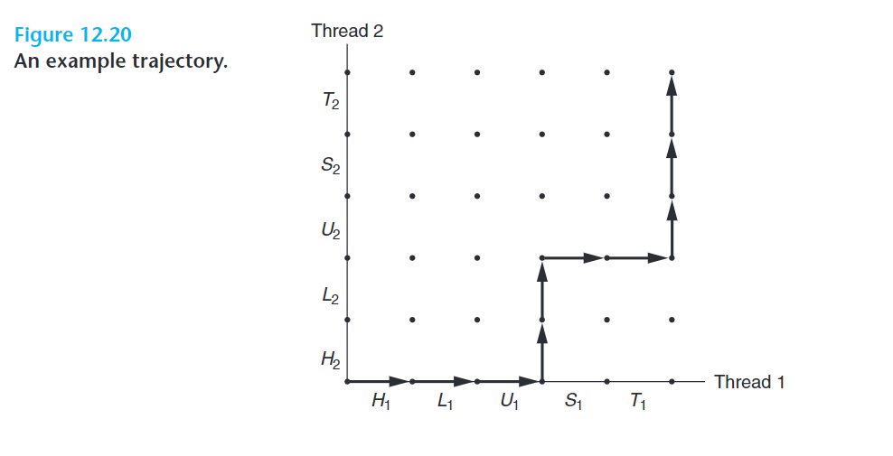

对于线程 $i$，指令 $(L_i, U_i, S_i)$ 构成了一个关于 `cnt` 的**临界区**（critival section），它不应该和其他进程的临界区交替执行。我们需要确保每个线程在执行其临界区中的指令时，拥有对共享变量**互斥的访问**（mutually exclusive access）。这种现象称为**互斥**（mutual exclusion）。

进度图中，两个临界区的交集形成的状态空间区域称为**不安全区**（unsafe region）。

绕开不安全去或沿不安全区边界线的轨迹线是**安全的**，穿过不安全区的轨迹线是**不安全的**。


### 信号量

**信号量**（semaphore）是一种非负整数类型的全局变量，只能由两种特殊的操作来处理：

- $P(s)$：
  - 如果 $s$ 非零，则将 $s$ 减 $1$，返回
  - 如果 $s$ 为零，则挂起此线程，直到 $s$ 变为非零后一个 $V$ 操作重启此线程，重启后，$P$ 将 $s$ 减 $1$，返回
- $V(s)$：
  - 将 $s$ 加 $1$。如果有线程因为 $s$ 为零而被 $P$ 操作挂起，则重启**其中的一个**

$P$ 的测试和减法操作整体是原子的，$S$ 的加法操作（加载、加法、存储）也是原子的。

有多个线程等待同一个信号量时，$V$ 操作**选择重启的线程是任意的**。

$P$ 和 $V$ 保证了正确初始化的**信号量永远不会是负值**，称为**信号量不变式**（semaphore invariant）。

> $P$ 来自于荷兰语的 Proberen，意为测试
> $V$ 来自于荷兰语的 Verhogen，意为增加

Posix 标准定义了操作信号量的函数：

```c
#include <semephore.h>

// 返回：若成功则为 0，若出错则为 -1
int sem_init(sem_t* sem, 0, unsigned int value);
int sem_wait(sem_t* s);    // P(s)
int sem_post(sem_t* s);    // V(s)
```

`sem_init` 将信号量 `sem` 初始化为 `value`。中间的参数我们总置零。

`sem_wait` 和 `sem_post` 分别对应 $P$ 和 $V$ 操作，我们定义它们的 wrapper function：

```c
#include "csapp.h"

// 返回：无返回值
void P(sem_t* sem);
void V(sem_t* sem);
```

### 使用信号量实现互斥

将每个共享变量（每组共享变量）与一个初始为 $1$ 的信号量 $s$ 关联起来，然后用 $P$ 和 $V$ 操作将相应的临界区包围起来

这种信号量称为**二元信号量**（binary semaphore），因为它的值只能是 $0$ 或 $1$。以提供互斥为目的的二元信号量也称为**互斥锁**（mutex）。

在互斥锁上执行 $P$ 操作称为对互斥锁**加锁**，执行 $V$ 操作称为对互斥锁**解锁**。称对互斥锁加了锁但还没有解锁的线程**占用**这个互斥锁。一个被用作一组可用资源的计数器的信号量称为**计数信号量**。信号量 $s<0$ 的不可行状态定义了一个**禁止区**，它覆盖了不安全区。 


在 $L$ 操作前，执行 $P$ 操作；在 $S$ 操作后，执行 $S$ 操作。某个线程读写共享资源时，信号量为 $0$。多个线程同时读写共享资源的状态对应的信号量为负值，因此不可能进入。

示例：

```c
volatile long cnt = 0;
sem_t mutex;

int main(int argc, char** argv) {
    Sem_init(&mutex, 0, 1);
}

void* thread(void* vargp) {
    long i, niters = *((long*)vargp);

    for (i = 0; i < niters; i++) {
        P(&mutex);
        cnt++;
        V(&mutex);
    }

    return NULL;
}
```

> 进度图有局限性。多处理器系统中，一组 CPU / 高速缓存对共享同一个主存，这是进度图不能描述的

### 利用信号量来调度共享资源

#### 生产者-消费者问题

生产者和消费者共享一个有 $n$ 个**槽**的**有限缓冲区**。生产者线程不断生成新的**项目**（item），并将它们插入缓冲区。消费者线程不断从缓冲区取出并使用项目。

插入和取出项目都涉及更新共享变量，因此必须保证互斥。

如果缓冲区已满，生产者必须等待空槽出现；如果缓冲区为空，消费者必须等待新项目被插入。

我们开发一个简单 $\text{SBUF}$ 包，用于构造生产者-消费者程序。

```c
#include "csapp.h"
#include "sbuf.h"

typedef struct {
    int* buf;       /* Buffer array */
    int n;          /* Maximum number of slots */
    int front;      /* buf[(front + 1) % n] is first item */
    int rear;       /* buf[rear % n] is last item */
    sem_t mutex;    /* Protects accesses to buf */
    sem_t slots;    /* Counts available slots */
    sem_t items;    /* Counts available items */
} sbuf_t;

/* Create an empty, bounded, shared FIFO buffer with n slots */
void sbuf_init(sbuf_t* sp, int n) {
    sp->buf = Calloc(n, sizeof(int));
    sp->n = n;                  /* Buffer holds max of n items */
    sp->front = sp->rear = 0;   /* Empty buffer iff front == rear */
    Sem_init(&sp->mutex, 0, 1); /* Binary semaphore for locking */
    Sem_init(&sp->slots, 0, n); /* Initially, buf has n empty slots */
    Sem_init(&sp->items, 0, 0); /* Initially, buf has 0 items */
}

/* Clean up buffer sp */
void sbuf_deinit(sbuf_t* sp) {
    Free(sp->buf);
}

/* Insert item onto the rear of shared buffer sp */
void sbuf_insert(sbuf_t* sp, int item) {
    P(&sp->slots);              /* Wait for available slot */
    P(&sp->mutex);              /* Lock the buffer */
    sp->buf[(++sp->rear) % (sp->n)] = item; /* Insert the item */
    V(&sp->mutex);              /* Unlock the buffer */
    V(&sp->items);              /* Announce available item */
}

/* Remove and return the first item from buffer sp */
int sbuf_remove(sbuf_t* sp) {
    int item;
    P(&sp->items);              /* Wait for available item */
    P(&sp->mutex);              /* Lock the buffer */
    item = sp->buf[(++sp->front) % (sp->n)]; /* Remove the item */
    V(&sp->mutex);              /* Unlock the buffer */
    V(&sp->slots);              /* Announce available slot */
    return item;
}
```

#### 读者-写者问题

一组线程访问一个共享对象，有的线程只读对象（称为**读者**），有的线程修改对象（称为**写者**）。写者必须拥有对对象独占的访问，而读者可以和无限多个其他读者共享对象。

第一类读者-写者问题：**读者优先**，除非已经将适用对象的权限赋予了一个写者。读者不会因为有一个写者在等待而等待。

以下是对第一类读者-写者问题的解答。

`mutex` 保护对 `readcnt` 的访问，它统计当前在临界区中的读者数量。第一个进入临界区的读者对 `w` 加锁，阻止写者进入临界区。最后一个离开临界区的读者对 `w` 解锁，允许写者进入临界区。除了第一个读者和最后一个读者，其他读者不会对 `w` 加锁或解锁。因此，只要有读者在临界区中，写者就不能进入临界区。

写者通过 `w` 保护对共享变量的访问，保证同时只有一个写者在临界区中。

```c
/* Solution to the first readers-writers problem */

/* Global variables */
int readcnt;        /* Initially = 0 */
sem_t mutex, w;     /* Both initially = 1 */

void reader(void) {
    while (1) {
        P(&mutex);
        readcnt++;
        if (readcnt == 1)    /* First in */
            P(&w);
        V(&mutex);

        /* Critical section */
        /* Reading happens */

        P(&mutex);
        readcnt--;
        if (readcnt == 0)
            V(&w);
        V(&mutex);
    }
}

void writer(void) {
    while (1) {
        P(&w);

        /* Critical section */
        /* Writing happens */

        V(&w);
    }
}
```

第二类读者-写者问题：**写者优先**，一旦有写者准备好写，它就会优先使写者完成写操作。在写者后到达的读者必须等待，即便这个写者也在等待。

对这两种读者-写者问题的正确解答可能造成**饥饿**（starvation），即某个线程被无限期地阻塞。例如，第一类读者-写者问题中，如果有读者不断地到达，写者就可能饥饿。

> 信号量是简单、经典的同步线程的方法，但不是唯一的。
> Java 线程通过 Java Monitor 机制同步，它提供了对信号量互斥和调度能力更高级别的抽象。不过，它可以用信号量实现。

### 综合：基于预线程化的并发服务器

之前的示例中，我们为每个新客户端创建一个新线程，这代价较大。

基于**预线程化**（prethreading）技术的服务器通过生产者-消费者模型降低这一开销。服务器由一个主线程和一组工作者线程组成，主线程不断地接受客户端的连接请求，并将得到的已连接描述符放在一个有限缓冲区内。工作者线程反复从这个共享的缓冲区内取出已连接描述符，为客户端提供服务。

```c
#include "csapp.h"
#include "sbuf.h"

#define NTHREADS 4
#define SBUFSIZE 16

void echo_cnt(int connfd);
void* thread(void* vargp);

sbuf_t sbuf;    /* Shared buffer of connected descriptors */

int main(int argc, char** argv) {
    int i; 
    int listenfd, connfd;
    socklen_t clientlen;
    struct sockaddr_storage clientaddr;
    pthread_t tid;

    if (argc != 2) {
        fprintf(stderr, "usage: %s <port>\n", argv[0]);
        exit(0);
    }

    listenfd = Open_listenfd(argv[1]);

    sbuf_init(&sbuf, SBUFSIZE);
    for (i = 0; i < NTHREADS; i++)
        Pthread_create(&tid, NULL, thread, NULL);

    while (1) {
        clientlen = sizeof(struct sockaddr_storage);
        connfd = Accept(listenfd, (SA*)&clientaddr, &clientlen);
        sbuf_insert(&sbuf, connfd);
    }
}

void* thread(void* vargp) {
    Pthread_detach(pthread_self());
    while (1) {
        int connfd = sbuf_remove(&sbuf);
        echo_cnt(connfd);
        Close(connfd);
    }
}
```

在开发 $\text{SBUF}$ 和 $\text{RIO}$ 包时，我们要求主程序显式调用初始化函数以完成初始化。而这里对于 `byte_cnt` 和 `mutex` 的初始化，我们则利用了 `pthread_once` 函数。

这样做的好处是使得程序包使用更加方便，代价是增加了很多对 `pthread_once` 的无效调用。

```c
#include "csapp.h"

static int byte_cnt;   /* Byte counter */
static sem_t mutex;    /* and the mutex that protects it */

static void init_echo_cnt(void) {
    Sem_init(&mutex, 0, 1);
    byte_cnt = 0;
}

void echo_cnt(int connfd) {
    int n;
    char buf[MAXLINE];
    rio_t rio;
    static pthread_once_t once = PTHREAD_ONCE_INIT;

    Pthread_once(&once, init_echo_cnt);
    Rio_readinitb(&rio, connfd);
    while ((n = Rio_readlineb(&rio, buf, MAXLINE)) != 0) {
        P(&mutex);
        byte_cnt += n;
        printf("server received %d (%d total) bytes on fd %d\n",
               n, byte_cnt, connfd);
        V(&mutex);
        Rio_writen(connfd, buf, n);
    }
}
```

> I/O 多路复用不是编写事件驱动程序的唯一方法。这个基于预线程化的服务器实际上也是一个事件驱动服务器。

## 使用线程提高并行性

**并行**（parallel）程序是在同一时刻有多条逻辑流在运行的程序，它是并发程序的真子集，可以更好地利用多核处理器的性能。

作为示例，我们讨论如何并行地计算前 $n$ 个自然数的和。

我们将序列划分成 $t$ 个不相交的段，分配给 $t$ 个线程计算（假设 $n$ 是 $t$ 的倍数）。我们将新创建线程的 TID 作为参数传递给线程例程，线程例程通过其 TID 确定自己负责的段。最后，主程序验证计算结果的正确性。

```c
#include "csapp.h"

#define MAXTHREADS 32

void* sum_mutex(void* vargp);

long gsum = 0;          /* Global sum */
long nelems_per_thread; /* Number of elements to sum */
sem_t mutex;            /* Mutex to protect global sum */

int main(int argc, char** argv) {
    long i, nelems, log_nelems, nthreads, myid[MAXTHREADS];
    pthread_t tid[MAXTHREADS];

    /* Get input arguments */
    if (argc != 3) {
        fprintf(stderr, "usage: %s <nthreads> <log_nelems>\n", argv[0]);
        exit(0);
    }
    nthreads = atoi(argv[1]);
    log_nelems = atoi(argv[2]);
    nelems = (1L << log_nelems);
    nelems_per_thread = nelems / nthreads;
    sem_init(&mutex, 0, 1);

    /* Create peer threads and wait for them to finish */
    for (i = 0; i < nthreads; i++) {
        myid[i] = i;
        Pthread_create(&tid[i], NULL, sum_mutex, &myid[i]);
    }
    for (i = 0; i < nthreads; i++)
        Pthread_join(tid[i], NULL);

    if (gsum != (nelems * (nelems - 1)) / 2)
        printf("Error: result=%ld\n", result);

    exit(0);
}

// psum-mutex
void* sum_mutex(void* vargp) {
    long myid = *((long*)vargp);
    long start = myid * nelems_per_thread;
    long end = start + nelems_per_thread;
    long i;

    for (i = start; i < end; i++) {
        P(&mutex);
        gsum += i;
        V(&mutex);
    }

    return NULL;
}
```

在四核系统上对 $n=2^{31}$ 的序列求和，发现结果非常古怪：**多线程版本运行得比单线程还慢**，而且线程数越多，性能越差。

这是因为**同步操作（$P$ 和 $V$）的开销太大，超过了内存更新的开销**。并行编程中，要尽量避免同步操作，若无法避免，则用尽可能多的有效计算弥补同步操作的开销。

作为改进，我们令每个对等线程在一个私有的变量中计算它们的部分和，主线程将这些部分和相加得到最终结果。

```c
// psum-array
void* sum_array(void* vargp) {
    long myid = *((long*)vargp);
    long start = myid * nelems_per_thread;
    long end = start + nelems_per_thread;
    long i;

    for (i = start; i < end; i++)
        psum[myid] += i;

    return NULL;
}
```

重新测试后，我们发现它比 `psum-mutex` 快了好几个数量级。

用局部变量消除对 `psum` 的不必要的内存引用，性能还会进一步提高。

```c
// psum-local
void* sum_local(void* vargp) {
    long myid = *((long*)vargp);
    long start = myid * nelems_per_thread;
    long end = start + nelems_per_thread;
    long i, sum = 0;

    for (i = start; i < end; i++)
        sum += i;
    psum[myid] = sum;

    return NULL;
}
```


### 刻画并行程序的性能


`psum-local` 的性能在线程数为 $4$ 时到达最低，这是因为我们的系统是四核的。在线程数少于 $4$ 时，线程数翻倍，运行时间近似地减半；在线程数多于 $4$ 时，随着线程数增加，运行时间略微增加。

并行程序的**加速比**（speedup）定义为

$$S_p = \frac{T_1}{T_p},$$

其中 $p$ 是处理器核心数，$T_k$ 是程序在 $k$ 个核心上运行的时间。它有时被称为**强扩展**（strong scaling）。当 $T_1$ 是程序顺序执行版本的运行时间时，$S_p$ 称为**绝对加速比**（absolute speedup）。当 $T_1$ 是程序的并行版本在单核上的运行时间时，$S_p$ 称为**相对加速比**（relative speedup）。

绝对加速比比相对加速比更能反映并行的真实好处，因为当并行程序在单核上运行时，也会受到同步开销的影响。但绝对加速比更难测量，因为它要求程序有一个顺序执行版本。

**效率**（efficiency）被定义为

$$E_p = \frac{S_p}{p} = \frac{T_1}{pT_p}.$$

它通常被表示为 $(0,100]$ 之间的百分数，衡量并行化造成的开销。高效率的程序的运行时间集中在有用的工作上，不在同步和通信上浪费过多时间。

加速比还有另外一面，称为**弱扩展**（weak scaling）。它在增加处理器核心数的同时增大问题规模，使得每个核心负责的工作量保持不变。这种语境中，加速比和效率被表达为单位时间完成的工作总量。

弱扩展常常是比强扩展更真实的测量值，它更接近于现实任务。

## 其他并发问题

我们用线程为例讨论一些并发问题，但这些问题并不仅限于线程，它们在任何并发流操作共享资源时都会出现。

### 线程安全

**线程安全**（thread-safe）的函数在被多个并发线程反复地调用时能正确地工作。

**不保护共享变量的函数**是线程不安全的。

**保持跨越多个调用的状态的函数**是线程不安全的。例如以下的 `rand` 函数，它的当前调用的结果依赖于上一次调用的中间结果。

```c
unsigned next_seed = 1;

/* rand - return pseudo-random integer on [0, 2^15 - 1] */
int rand(void) {
    next_seed = next_seed * 1103515245 + 12543;
    return (unsigned int)(next_seed >> 16) % 32768;
}

/* srand - set the initial seed for rand() */
void srand(unsigned int seed) {
    next_seed = seed;
}
```

当调用 `srand` 为 `rand` 指定一个种子后，单线程地反复调用 `rand` 可以得到一个可重复的随机数序列。但如果以多线程调用 `rand`，这种假设就不再成立。

唯一的解决方案是重写 `rand`，使它不再依赖于静态数据，而是依靠调用者在参数中传递状态信息。这不得不修改调用者的代码，非常麻烦。

**返回指向静态变量指针的函数**是线程不安全的。`ctime` 和 `gethostbyname` 将计算结果放在一个静态变量里，然后返回指向这个静态变量的指针。

我们可以重写此函数，使得调用者传递存放结果变量的地址，这消除了共享数据，但要求更改调用者代码。

另一种选择是采用**加锁-复制**（lock-and-copy）技术。在每次调用前对互斥锁加锁，将结果复制到一个私有的内存位置，然后对互斥锁解锁。我们可以定义一个 wrapper function 包装此过程。

然而加锁复制有很多缺点，如引入额外的**同步开销**，对于复杂的结构还必须**深复制**。

```c
// ctime 的一个线程安全版本
char* ctime_ts(const time_t* timep, char* privatep) {
    char* sharedp;

    P(&mutex);
    sharedp = ctime(timep);
    strcpy(buf, sharedp);
    V(&mutex);
    return privatep;
}
```

**调用线程不安全函数的函数可能是**线程不安全的。如果被调用的函数是第一类或第三类线程不安全函数，并且调用函数用互斥锁保护了调用，那么调用函数是线程安全的。

### 可重入性

**可重入**（reentrant）函数是线程安全的函数的一个真子集，它们在被多个线程调用时，**不会访问任何共享数据**。

可重入函数通常比不可重入的线程安全函数更高效，因为它们不需要同步操作。

以下是 `rand` 函数的可重入版本，我们用调用者传递的指针参数取代了静态的 `next` 变量。

```c
int rand_r(unsigned int* nextp) {
    *nextp = *nextp * 1103515245 + 12543;
    return (unsigned int)(*nextp >> 16) % 32768;
}
```

如果**所有函数参数都按值传递**，且引用的所有变量都是当前块作用域的自动局部变量，函数就是**显式可重入**（explicitly reentrant）的。

如果函数的参数有按指针传递的，那么它是一个**隐式可重入**（implicitly reentrant）的函数。如果调用者小心地传递指向非共享数据的指针，它是可重入的。`rand_r` 就是隐式可重入的。

### 在线程化的程序中使用已存在的库函数

多数 Linux 函数，包括标准库中的 `malloc`、`free`、`printf`、`scanf` 等，都是线程安全的。

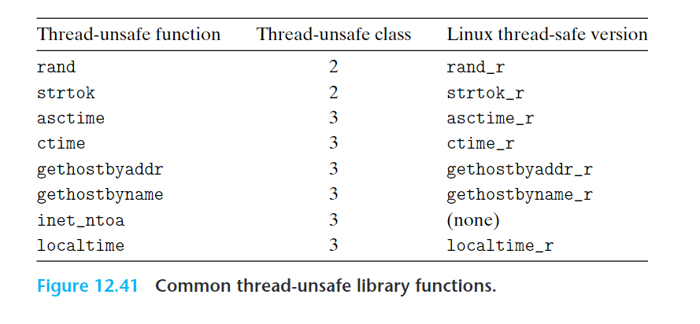

`strtok` 已弃用。

`asctime`、`ctime`、`localtime` 是在不同时间和数据格式间转换时经常使用的函数。

`gethostbyname`、`gethostbyaddr` 和 `inet_ntoa` 是已弃用的网络编程函数，已经被可重入的 `getaddrinfo`、`getnameinfo` 和 `inet_ntop` 取代。

除了 `rand` 和 `strtok` 以外，这些线程不安全函数都是第三类的，它们返回一个指向静态变量的指针。

Linux 提供了大多数线程不安全函数的可重入版本，它们一般以 `_r` 结尾。

### 竞争

如果程序的正确性依赖于**某线程必须在另一个线程到达 $y$ 位置之前到达 $x$ 位置**，那么就会发生竞争。

```c
// This code is buggy
#include "csapp.h"

#define N 4

void* thread(void* vargp);

int main(void) {
    pthread_t tid[N];
    int i;

    for (i = 0; i < N; i++)
        Pthread_create(&tid[i], NULL, thread, &i);
    for (i = 0; i < N; i++)
        Pthread_join(tid[i], NULL);

    exit(0);
}

void* thread(void* vargp) {
    int myid = *((int*)vargp);
    printf("Hello from thread %d\n", myid);
    return NULL;
}
```

以上程序中，主线程中 **`i` 自增运算和线程例程中第一句赋值语句**之间存在竞争。

为了避免竞争，我们需要为每个传入的参数动态分配一个私有的内存位置。

注意，**必须在线程例程中释放这个内存位置**，否则会造成内存泄漏。

```c
// ...
int main(void) {
    pthread_t tid[N];
    int i;
    int* ptr;

    for (i = 0; i < N; i++) {
        ptr = Malloc(sizeof(int));
        *ptr = i;
        Pthread_create(&tid[i], NULL, thread, ptr);
    }
    for (i = 0; i < N; i++)
        Pthread_join(tid[i], NULL);

    exit(0);
}

void* thread(void* vargp) {
    int myid = *((int*)vargp);
    Free(vargp);
    printf("Hello from thread %d\n", myid);
    return NULL;
}
```

### 死锁

**死锁**（deadlock）指一组线程被永久地阻塞了。下图展示了一对用两个信号量实现互斥的线程的进度图。

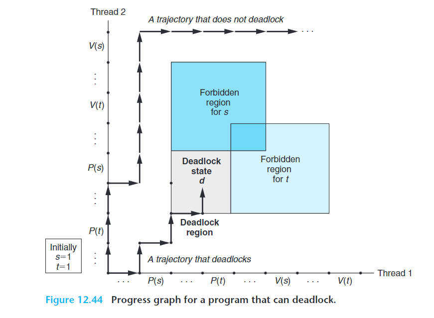

**程序员使用 $P$ 和 $V$ 操作顺序不当**，以至于**两个信号量的禁止区域重叠**。两个禁止区完全包围住了死锁区域的右方和上方，使得进入死锁区域的轨迹线永远无法离开死锁区域。

死锁是很困难的问题，它们不可预测，极难复现。

使用二元信号量实现互斥时，只要遵循互斥锁加锁顺序规则，就不会发生死锁。

**互斥锁加锁顺序规则**：给定所有互斥操作的一个全序，如果每个线程都以同一种顺序加锁，并以相反的顺序解锁，那么就不会发生死锁。

例如，在上述程序中，我们在每个线程中先对 `s` 加锁，再对 `t` 加锁，就解决了死锁问题。

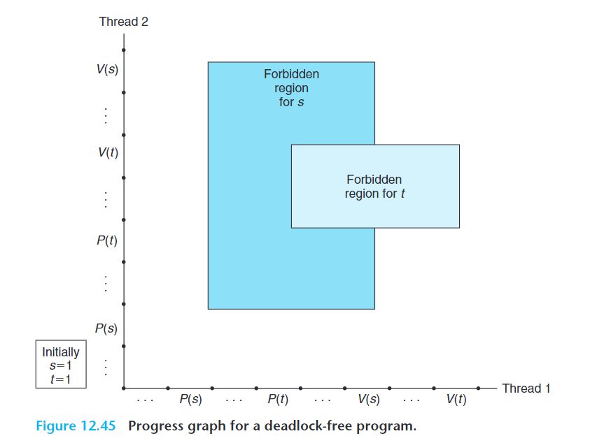

