[TOC]

# 信息的表示和处理

$$(a\mid b)\mid c=a\mid (b\mid c)$$

$$(a\ \&\ b)\ \&\ c=a\ \&\ (b\ \&\ c)$$

$\&$ 和 $\mid $ 有结合律

$$a\ \&\ (b\mid c) = a\ \&\ b\mid a\ \&\ c$$

$$a\mid (b\ \&\ c) = a\mid b\ \&\ a\mid c$$

$\&$ 和 $\mid $ 对彼此都有分配律

$$a\mid (a \ \&\ b)=a$$

$$a\ \& \ (a \mid b)=a$$

吸收律

$$\~{}\  (a\ \& \ b)=\~{}\  a\mid \~{}\  b$$

$$\~{}\  (a \mid b)=\~{}\  a\ \& \  \~{}\  b$$

德摩根律

$$a\ \^{}\ a=0$$

$$b\ \^{}\ 0=b$$

$$a\ \^{}\ b=b\ \^{}\ a$$

$$a\ \^{}\ (b\ \^{}\ c)=(a\ \^{}\ b)\ \^{}\ c$$


$$(a\ \^{} \ b)\ \^{} \ a=b$$  

异或有交换律和结合律

```c++
// 利用异或的性质
void swap(int* x, int* y) {
    *y = *x ^ *y;
    *x = *x ^ *y;
    *y = *x ^ *y;
}
```

位运算的性质：

- 与 $1$ 异或：取补
- 与 $0$ 异或：保留

- 与 $1$ 与：保留
- 与 $0$ 与：复位

- 与 $1$ 或：置位
- 与 $0$ 或：保留

C 中的**移位**运算：
- 左移：丢弃最高 k 位，低位补 0
- 逻辑右移（无符号数）：丢弃最低 k 位，高位补 0
- 算术右移（一般有符号数）：丢弃最低 k 位，高位补最高有效位

> 反码（Ones' Complement）：除了最高有效位的权是 $-(2^{\omega-1}-1)$ 而不是 $-2^{\omega-1}$，和补码相同。
>
> 原码（Sign-Magnitude）：最高有效位是符号位，用来确定剩下的位的权。
>
> 这两种编码都存在正负 0 的问题。

有符号数和无符号数的转换：数值可能改变，但位模式不变。

```c++
unsigned x = 0x1;
int y = -1;
x < y;    // 比较时 y 被转换成无符号数
```

**扩展位表示**：
- 无符号：高位补 0
- 补码：高位补最高有效位（$[1011]$ 和 $[111011]$ 都是 $-5$ 的补码表示）

```c++
// 既有扩展 又有有无符号的转换
short sx = -12345;
unsigned uy = sx;
printf("uy = %u:\t", uy);
show_bytes((BytePtr)&uy, sizeof(unsigned));
// 输出：uy = 4294954951:    ff ff cf c7
// C 标准规定：先扩展，再转换符号
```

**截断**：直接丢弃高位
- 无符号数：模运算
- 补码：先模运算，然后再转补码

**无符号整数加法**：加，然后截断，即模数加法。溢出当且仅当 $s=(x+y) \mod 2^\omega<x$。如果溢出，则实际结果比真实值小 $2^\omega$。

**无符号数的求反**：$x=0$ 时，$-x=0$，$x>0$ 时，$-x=2^\omega-x$.

补码加法：加，然后截断。负溢出：$x<0,\ y<0,\ z=x+y+2^\omega >0$；正溢出：$x>0,\ y>0,\ z=x+y-2^\omega <0$

补码加形成一个 Abel 群。

```c++
int buggy_tadd_ok(int x, int y) {
    int s = x + y;
    return (s - x == y) && (s - y == x);    // 永远返回 true
    // 正确做法：分别判断有无正溢出和负溢出
}
```

补码的求反：$x=\operatorname{TMin}_\omega$ 时，$-x=\operatorname{TMin}_\omega$，$x>\operatorname{TMin}_\omega$ 时，$-x=-x$.

计算补码非的技巧：
- $-x=$~$x+1$：每位求补再加 1
- 找到最低的置 1 位，对其左侧所有为求补


无符号乘法：乘，然后截断。

补码乘法：乘，然后截断。

补码乘法和无符号乘法同样具有位级等价性：完整的乘积的位级表示可能不同，但**截断后的乘积的位级表示是相同的**。

```c++
// 检验补码乘法是否溢出
int tmult_ok(int x, int y) {
    int p = x * y;
    return !x || p/x == y;
}

int tmult_ok2(int x, int y) {
    int64_t pll = static_cast<int64_t>(x * y);  // 这里也要转换！
    return pll == static_cast<int>(pll);
}
```

计算 $x * 14$：$14$ 的二进制表示为 $[1110]$，因此编译器可以将常数乘法优化为 `(x << 3) + (x << 2) + (x << 1)` 或 `(x << 4) - (x << 1)`（也可能不优化，直接用乘法指令计算）。

整数除法总是向 0 舍入。

对于无符号数和补码，**向下舍入的** $x/2^k$ 总是等价于 $x>>k$。右移导致向下舍入，是因为低位消失了。

通过**偏置（biasing）**，可以令负数除法向上舍入：$\lceil x/2^k \rceil=$ `(x + (1 << k) - 1) >> k`. 也就是说，二进制加上一个 $k$ 位全 $1$ 数再右移 $k$ 位，等价于做负整数除法。这是因为 $\lceil x/y \rceil=\lfloor(x+y-1)/y\rfloor$. 再换句话说，加上偏置就等价于“如果低 $k$ 位不是全 $0$，那么结果向上进 $1$”


对于使用算术右移的补码机器，`(x < 0 ? x + (1 << k) - 1 : x) >> k` 将会计算 $x/2^k$

```c++
// 不使用除法/模运算/乘法/条件语句的除以16
int div16(int x) {
    // 诀窍：如果 x < 0，那么 x << 31 全 1
    // 否则 x << 31 全 0
    int bias = (x << 31) & 0xf;  // 掩码
    return (x + bias) >> 4;
}
```

无法用除以 $2$ 的幂的除法的组合表示除以任意常数的除法。

**当 $x=\operatorname{TMin}_{32}$ 时，$-x=x$**.

由于无符号数和补码在加法和乘法（**截断后**）具有**相同的位级表示**，所以对任何 `int x` 和 `int y`，`x+y == ux+uy` 和 `x*y == ux*uy` 恒成立（`unsigned ux = x; unsigned uy = y`）。

补码取反和非：`-y = ~y + 1`


## 浮点

IEEE 浮点表示

$V=(-1)^s \times M \times 2^E$
- 符号（sign）：$s$
- 尾数（significand）：$M$ 是一个二进制小数，范围是 $1 \sim 2-\varepsilon$（规格化）或 $0 \sim 1-\varepsilon$（非规格化）
- 阶码（exponent）：$E$ 对浮点数加权

浮点数的格式：
- `float`：$1$ 位的 `s`，$8$ 位的 `exp`，$23$ 位的 `frac`
- `double`：$1$ 位的 `s`，$11$ 位的 `exp`，$52$ 位的 `frac`

浮点数的值：

1. 规格化的值：如果 `exp` 既不是全 $0$，也不是全 $1$，那么阶码的值 $E=e-Bias$，其中 $Bias=2^{k-1}-1$. 小数字段 `frac` 被解释为二进制小数 $f$ 的值，$0 \leq f < 1$，尾数定义为 $M=f+1$.
2. 非规格化的值：当阶码域 `exp` 全 $0$ 时。此时阶码值 $E=1-Bias$，尾数 $M=f$.
3. 特殊值：当阶码全为 $1$ 时。若小数域全 $0$，则得到无穷，否则得到 NaN.

$12345$ 具有二进制表示 $11000000111001$，小数点左移 $13$ 位得 $1.1000000111001_2 \times 2^{13}$，丢弃开头的 $1$ ，并在末尾添加 $10$ 个 $0$，得小数字段 $[10000001110010000000000]$。阶码为 $13+127=140=[10001100]$，加上符号位的 $0$，就得到浮点表示 $[0\ 10001100\ 10000001110010000000000]$.

浮点数的舍入：向偶数舍入。“正中间”的值（也就是形如 $Y100\ldots$ 的值，$Y$ 为要舍入到的位）向偶数舍入，不是“正中间”的值向最接近的数舍入。例如将一下数字舍入到最接近的二分之一：
- $10.010_2 : 10.0$
- $10.011_2 : 10.1$
- $10.110_2 : 11.0$
- $11.001_2 : 11.0$

浮点加法和乘法：可交换，但**不可结合**，乘法对加法**没有分配律**。

浮点加法**有单调性**：若 $a \geq b$ 且 $a, b, x \neq NaN$，则 $x+a\geq x+b$. 乘法同理.

## Datalab

```c++
int isTmax(int x) {
    // Tmax = 0x7fffffff
    int k = x + x + 2;    // 利用溢出
    int s1 = !k;
    int s2 = !!(x + 1);
    return s1 & s2;    // x = 0x7fffffff 时，-O0 返回1 -O1 返回1
}
```

若 `y = 0x7fffffff`，则 `~y == y + 1`。又因为补码有：`~y = -y - 1`，联立可知只需要排除 `-1` 即可。通过溢出凑 `0` 的判断方法和编译器行为有关，使用**异或判等**：`x^x == 0`。

```c
int isTmax(int x) {
    return !(~x ^ (x + 1)) & !!(x + 1);
}
```

```c
int howManyBits(int x) {
    // 其实就是返回 最高有效位+1 因此负数和正数是一样的
    // 用二分法找
    int t = x ^ (x >> 31);    // 负数取反 正数不变
    int z = ~!t + 1;    // z = t == 0 ? 0xffffffff : 0x0
    int b16, b8, b4, b2, b1;
    b16 = (!(!(t >> 16))) << 4;    // 高16位非空 ? 16 : 0
    t = t >> b16;
    b8 = !(!(t >> 8)) << 3;
    t = t >> b8;
    b4 = !(!(t >> 4)) << 2;
    t = t >> b4;
    b2 = !(!(t >> 2)) << 1;
    t = t >> b2;
    b1 = !(!(t >> 1));
    // t = 0 需要特判 
    return ((b1 + b2 + b4 + b8 + b16 + 2) & ~z) | (1 & z);
}
```

# 程序的机器级表示

## 数据格式

| C 声明 | Intel 数据类型 | 汇编代码后缀 | 大小（字节）|
| :----: | :----: | :----: | :----: |
| `char` | 字节 | `b` | 1 |
| `short` | 字 | `w` | 2 |
| `int` | 双字 | `l` | 4 |
| `long` | 四字 | `q` | 8 |
| `char *`（指针） | 四字 | `q` | 8 |
| `float` | 单精度 | `s` | 4 |
| `double` | 双精度 | `l` | 8 |

## 访问信息

### 寄存器

x86-64 的 CPU 包含一组 16 个存储 64 位值的**通用目的寄存器**。

| 四字（64位） | 双字（32位） | 字（16位） | 字节（8位）| 用途 |
| :----: | :----: | :----: | :----: | :----: |
| `%rax` | `%eax` | `%ax` | `%al` | 返回值 |
| `%rbx` | `%ebx` | `%bx` | `%bl` | 被调用者保存 |
| `%rcx` | `%ecx` | `%cx` | `%cl` | 第 4 个参数 |
| `%rdx` | `%edx` | `%dx` | `%dl` | 第 3 个参数 |
| `%rsi` | `%esi` | `%si` | `%sil` | 第 2 个参数 |
| `%rdi` | `%edi` | `%di` | `%dil` | 第 1 个参数 |
| `%rbp` | `%ebp` | `%bp` | `%bpl` | 被调用者保存 |
| `%rsp` | `%esp` | `%sp` | `%spl` | 栈指针 |
| `%r8` | `%r8d` | `%r8w` | `%r8b` | 第 5 个参数 |
| `%r9` | `%r9d` | `%r9w` | `%r9b` | 第 6 个参数 |
| `%r10` | `%r10d` | `%r10w` | `%r10b` | 调用者保存 |
| `%r11` | `%r11d` | `%r11w` | `%r11b` | 调用者保存 |
| `%r12` | `%r12d` | `%r12w` | `%r12b` | 被调用者保存 |
| `%r13` | `%r13d` | `%r13w` | `%r13b` | 被调用者保存 |
| `%r14` | `%r14d` | `%r14w` | `%r14b` | 被调用者保存 |
| `%r15` | `%r15d` | `%r15w` | `%r15b` | 被调用者保存 |

当指令**以 64 位寄存器为目标时**：生成 1 字节和 2 字节数字的指令会保持高位的字节不变；生成 4 字节数字的指令会把高位 4 个字节置 0.

### 操作数格式

| 类型 | 格式 | 操作数值 | 名称 |
| :----: | :----: | :----: | :----: |
| 立即数 | $$ \$\operatorname{Imm}$$ | $\operatorname{Imm}$ | 立即数寻址 |
| 寄存器 | $r_a$ | $R[r_a]$ | 寄存器寻址 |
| 存储器 | $\operatorname{Imm}(r_b,r_i,s)$ | $M[\operatorname{Imm}+R[r_b]+R[r_i]\times s]$ | 比例变址寻址 |

比例因子 $s$ 必须是 $1, 2, 4, 8$ 中的一个。

在 64 位机器上，地址总是 64 位的，因此像 `(%eax)` 这样的操作数很有可能是错误的。

### 数据传送指令

MOV 类指令把数据从源位置复制到目的位置。MOV 类指令包括：
- `movb`：字节
- `movw`：字
- `movl`：双字
- `movq`：四字

常规的 `movq` 指令只能以**表示 32 位补码的立即数作为源操作数**，把这个值**符号扩展**得到 64 位的值，放到目的位置。
`movabsq` 指令能以**任意 64 位立即数值作为源操作数**，且**只能以寄存器作为目的位置**。

x86-64 限制传送指令的**两个操作数不能都指向内存位置**（只能为 内存 -> 寄存器 -> 内存 的形式）。

```x86asm
movl $0x4050,%eax       ; Imm -> Reg
movw %bp,%sp            ; Reg -> Reg
movb (%rdi,%rcx),%al    ; Mem -> Reg
movb $-17,(%rsp)        ; Imm -> Mem
movq %rax,-12(%rbp)     ; Reg -> Mem
```

MOVZ 类和 MOVS 类将较小的源值复制到较大的目的位置。MOVZ 类指令执行**零扩展**，MOVS 类指令执行**符号扩展**。这些指令的目的位置**必须是寄存器**。

- `movzbq`：字节 -> 四字（零扩展）
- `movzbl`：字节 -> 双字（零扩展）
- `movzwl`：字 -> 双字（零扩展）
- `movzbq`：字节 -> 四字（零扩展）
- `movzwq`：字 -> 四字（零扩展）

- `movsbw`：字节 -> 字（符号扩展）
- `movsbl`：字节 -> 双字（符号扩展）
- `movswl`：字 -> 双字（符号扩展）
- `movsbq`：字节 -> 四字（符号扩展）
- `movswq`：字 -> 四字（符号扩展）
- `movslq`：双字 -> 四字（符号扩展）

为什么没有 `movzlq`？因为不同于 `movb` 和 `movw`，`movl` 会把高位的字节置 0，因此不需要双字到四字的零扩展。

`movzbq` 经常被 `movzbl` 替代，因为 `movzbl` 的编码更短。`movzwl` 和 `movzwq` 也是如此。

- `cltq`：`%eax` -> `%rax`（符号扩展）

`cltq` 无操作数，完全等价于 `movslq %eax,%rax`。

示例：

```c
src_t* sp;
dest_t* dp;

*dp = (dest_t) *sp;
```

假设 `sp` 和 `dp` 分别存储在寄存器 `%rdi` 和 `%rsi` 中，对于 `src_t` 和 `dest_t` 的各种情况，给出数据传送的两条指令。第一条从内存中读数，做适当转换，把结果写到寄存器 `%rax` 的适当部分；第二条把 `%rax` 的适当部分写到内存。

| `src_t` | `dest_t` | 第一条指令 | 第二条指令 | 注释 |
| :----: | :----: | :----: | :----: | :----: |
| `long` | `long` | `movq (%rdi),%rax` | `movq %rax,(%rsi)` |
| `char` | `int` | `movsbl (%rdi),%eax` | `movl %eax,(%rsi)` | 符号扩展 |
| `char` | `unsigned` | `movsbl (%rdi),%eax` | `movl %eax,(%rsi)` | 符号扩展 |
| `char` | `short` | `movsbw (%rdi),%ax` | `movw %ax,(%rsi)` | 符号扩展 |
| `unsigned char` | `long` | `movzbq (%rdi),%rax` | `movq %rax,(%rsi)` | 零扩展 |
| `int` | `char` | `movl (%rdi),%eax` | `movb %al,(%rsi)` | 截断 |

扩展时采用符号扩展还是零扩展，**取决于 `src_t` 是否为有符号表示**。这是因为 C 语言在类型转换时**先扩展，再转换符号**，即若 `ch` 类型为 `char`，则`(unsigned) ch` 等价于 `(unsigned) (int) ch`。


### 压入和弹出栈数据

- `pushq Src`：栈指针 `%rsp` 减 8，然后把 `Src` 的值复制到新 `%rsp` 指向的内存位置，等价于 `subq $8,%rsp`  `movq Src,(%rsp)`
- `popq Dest`：把 `%rsp` 指向的内存位置的值复制到 `Dest`，然后 `%rsp` 加 8，等价于 `movq (%rsp),Dest`  `addq $8,%rsp`

栈指针 `%rsp` 保存着**栈顶元素的地址**，x86-64 中，栈向低地址方向增长，故**压栈时栈指针减小**。可以用标准的内存寻址方法访问栈内任意位置，比如 `movq 8(%rsp),%rdx` 会把栈顶起第二个元素的值复制到 `%rdx`。


## 算术和逻辑操作


`leaq` （load effective address）指令是 `movq` 的变形。`leaq S,D` 将把 `S` 的有效地址（而不是它的内容）复制到 `D`。它可以灵活地用于算术操作，如 `leaq 7(%rdx, %rdx, 4),%rax` 设置 `%rax` 的值为 `5 * %rdx + 7`。**`leaq` 的目的操作数必须是寄存器**。

```c
long scale(long x, long y, long z) {
    long t = x + 4 * y + 12 * z;
    return t;
}
```

```x86asm
leaq    (%rdi,%rsi,4), %rax    ; t = x + 4 * y
leaq    (%rdx,%rdx,2), %rdx    ; z = z + 2 * z
leaq    (%rax,%rdx,4), %rax    ; t = t + 4 * z
ret
```

- `INC Dest`：加 1
- `DEC Dest`：减 1
- `NEG Dest`：取负
- `NOT Dest`：取补

`Dest` 可以是寄存器或内存位置

- `ADD Src,Dest`：加
- `SUB Src,Dest`：减
- `IMUL Src,Dest`：乘
- `XOR Src,Dest`：异或
- `OR Src,Dest`：或
- `AND Src,Dest`：与

以上二元操作中，第一个操作数可以是立即数、寄存器或内存位置，第二个操作数可以是寄存器或内存位置。第二个操作数既是源又是目的位置，例如 `subq %rax,%rdx` 就相当于 `%rdx -= %rax`。

- `SAL k,Dest`：左移
- `SHL k,Dest`：左移（等同于 `SAL`）
- `SAR k,Dest`：算术右移（补码）
- `SHR k,Dest`：逻辑右移（无符号数）

移位量 `k` 可以是**立即数**或者**单字节寄存器 `%cl`**。x86-64 中，移位量是**由 `%cl` 寄存器的低位给出**的。即，若 `%cl` 的值位 `0xFF`，则 `salb %cl,%rax` 会将 `%rax` 的值左移 7 位，`salw` 会移 15 位，`sall` 会移 31 位，而 `salq` 会移 63 位。


以上指令中，除了右移指令要求区分补码和无符号数以外，其他指令都不区分补码和无符号数。**这是补码的优点：兼容无符号数**。


x86-64 有限地支持 128 位数操作，它们被称为**八字（oct word）**

`imulq Src` `mulq Src` 分别是补码八字乘法和无符号数八字乘法指令。它们都要求**一个乘数必须在 `%rax` 中**，而**另一个乘数作为操作数给出**。乘积存放在 `%rdx`（高 64 位）和 `%rax`（低 64 位）两个寄存器中。

> 指令的双操作数形式是 `imulq Src，Dest`。注意到**乘积被截断为 64 位后，无符号乘法和补码乘法的结果是一样的**，因此 64 位乘法指令只有一条。

`clto` 指令把 `%rax` 的值符号扩展，结果存放在 `%rdx`（高 64 位）和 `%rax`（低 64 位）两个寄存器中

`idivq Src` **将 `%rdx`（高 64 位）和 `%rax`（低 64 位）存放的 128 位数作为被除数**，`Src` 作为除数，执行**补码除法**，商存放在 `%rax` 中，余数存放在 `%rdx` 中。`divq Src` 执行**无符号数除法**，其余与 `idivq` 相同。

对大多数 64 位除法应用来说，除数也常常是 64 位数。64 位的被除数存放在 `%rax` 中，而 `rdx` 应当置为全 0 或 `%rax` 的符号位（由 `clto` 指令实现）。以下是 64 位除法的例子：

```c
void remdiv(long x, long y, long* qp, long* rp) {
    long q = x / y;
    long r = x % y;
    *qp = q;
    *rp = r;
}
```

```x86asm
; void remdiv(long x, long y, long* qp, long* rp)
; x in %rdi, y in %rsi, qp in %rdx, rp in %rcx
remdiv:
    movq    %rdx, %r8       ; r8 = qp, rdx clear for use
    movq    %rdi, %rax      ; rax = x
    cqto
    idivq   %rsi            ; rax = x/y, rdx = x%y
    movq    %rax, (%r8)    ; *qp = rax
    movq    %rdx, (%rcx)   ; *rp = rdx
    ret
```


## 控制

常用的条件码（condition code）：
- `CF`：进位标志。最近的操作使最高位产生了进位。可用于检查无符号数的溢出。
- `ZF`：零标志。最近的操作结果为 0.
- `SF`：符号标志。最近的操作结果为负数。
- `OF`：溢出标志。最近的操作导致补码溢出。

它们被保存在 CPU 的一组单个位的条件码寄存器里。

`leaq` 是用于地址计算的指令，它不会改变任何条件码。除此之外，所有的算术和逻辑指令（`INC` `DEC` `NEG` `NOT` `ADD` `SUB` `IMUL` `XOR` `OR` `AND` `SAL` `SHL` `SAR` `SHR`）都会更新条件码。

逻辑操作的**进位标志**和**溢出标志**会被置 0.

移位操作的**进位标志**会被设置为**最后一个被移出的位**，**溢出标志**会被设置为 0。

`INC` `DEC` 指令会设置**溢出标志**和**零标志**，但不会改变**进位标志**。

`CMP` 指令和 `TEST` 指令只设置条件码，不改变其他寄存器。

`CMP S1, S2` 等价于 `SUB S1, S2`，而 `TEST S1, S2` 等价于 `AND S1, S2`。区别在于它们不会改变 `S2` 的值。


### 访问条件码

`SET` 指令根据条件码的某种组合设置一个字节的值。

| 指令 | 同义名 | 条件码组合 | 设置条件 |
| :----: | :----: | :----: | :----: |
| `sete D` | `setz` | `ZF` | 相等 / 零 |
| `setne D` | `setnz` | `~ZF` | 不等 / 非零 |
| `sets D` |  | `SF` | 负 |
| `setns D` |  | `~SF` | 非负 |
| `setg D` | `setnle` | `~(SF^OF)&~ZF` | 大于（有符号 >） |
| `setge D` | `setnl` | `~(SF^OF)` | 大于等于（有符号 >=） |
| `setl D` | `setnge` | `SF^OF` | 小于（有符号 <） |
| `setle D` | `setng` | `(SF^OF)|ZF` | 小于等于（有符号 <=） |
| `seta D` | `setnbe` | `~CF&~ZF` | 超过（无符号 >） |
| `setae D` | `setnb` | `~CF` | 超过或相等（无符号 >=） |
| `setb D` | `setnae` | `CF` | 低于（无符号 <） |
| `setbe D` | `setna` | `CF|ZF` | 低于或相等（无符号 <=） |

`set D` 中的目标位置 `D` 必须是**单字节寄存器**。

```x86asm
int comp(data_t a, data_t b)
a in %rdi, b in %rsi

comp:
    cmpq    %rsi, %rdi    ; %rdi - %rsi
    setl    %al
    movzbl  %al, %eax     ; 和 movzbq %al, %rax 相同
    ret
```


### 跳转指令


| 指令 | 同义名 | 跳转条件 | 描述 |
| :----: | :----: | :----: | :----: |
| `jmp Label` |  | 1 | 直接跳转 |
| `jmp *Operand` |  | 1 | 间接跳转 |
| `je Label` | `jz` | `ZF` | 相等 / 零 |
| `jne Label` | `jnz` | `~ZF` | 不等 / 非零 |
| `js Label` |  | `SF` | 负 |
| `jns Label` |  | `~SF` | 非负 |
| `jg Label` | `jnle` | `~(SF^OF)&~ZF` | 大于（有符号 >） |
| `jge Label` | `jnl` | `~(SF^OF)` | 大于等于（有符号 >=） |
| `jl Label` | `jnge` | `SF^OF` | 小于（有符号 <） |
| `jle Label` | `jng` | `(SF^OF)|ZF` | 小于等于（有符号 <=） |
| `ja Label` | `jnbe` | `~CF&~ZF` | 超过（无符号 >） |
| `jae Label` | `jnb` | `~CF` | 超过或相等（无符号 >=） |
| `jb Label` | `jnae` | `CF` | 低于（无符号 <） |
| `jbe Label` | `jna` | `CF|ZF` | 低于或相等（无符号 <=） |

- 直接跳转：`jmp .L1` 跳转目标是作为指令的一部分编码的
- 间接跳转：`jmp *%rax` `jmp *(%rax)` 跳转目标从寄存器或内存中读出

无条件跳转可以是直接跳转，也可以是间接跳转。条件跳转只能是直接跳转。

跳转指令有几种不同的编码，最常用的是 PC 相对（PC-relative）的，其次是给出“绝对”地址。PC 相对的机器代码会将**目标指令的地址**与**紧跟在跳转指令之后的指令的地址**之间的差作为目标的编码，这些地址偏移量可以编码为 1, 2 或 4 字节。“绝对”地址的编码直接用 4 个字节指定目标。

当执行 PC 相对寻址时，程序计数器的值时跳转指令的后一条指令的地址，这与 CPU 的早期实现有关。当时的 CPU 将更新 PC 的值作为执行指令的第一步。通过使用 PC 相对寻址，指令的编码可以很简洁，且目标代码可以在链接过程中不做改变。

```c
// C 中的 if-else
if (test-expr) 
    then-statement
else 
    else-statement

// 通常的汇编实现
    t = test-expr
    if (!t)
        goto false;
    then-statement
    goto done;
false:
    else-statement
done:

// 另一种汇编实现
    t = test-expr
    if (t)
        goto true;
    else-statement
    goto done;
true:
    then-statement
done:

// 通常的汇编实现对于无 else 的 if 语句更简练：
    t = test-expr
    if (!t)
        goto done;
    then-statement
done:
```

### 条件传送


数据的条件转移计算一个条件操作的两种结果，然后根据条件是否满足从中选取一个。这种操作无法完全替代跳转指令，但更符合现代处理器的性能特性。它可以用一条条件传送指令实现。

```c
long absdiff(long x, long y) {
    long res;
    if (x < y) 
        res = y - x;
    else
        res = x - y;
    return res;
}

// 使用条件赋值的实现
long cmovdiff(long x, long y) {
    long rval = y - x;
    long eval = x - y;
    long ntest = x >= y;
    if (ntest) rval = eval;
    return rval;
}
```

```x86asm
long absdiff(long x, long y)
x in %rdi, y in %rsi
absdiff:
    movq   %rsi, %rax    ; %rax = y
    subq   %rdi, %rax    ; %rax = y - x
    movq   %rdi, %rdx
    subq   %rsi, %rdx    ; %rdx = x - y
    cmpq   %rsi, %rdi
    cmovge %rdx, %rax    ; if (x >= y) rval = eval
    ret
```

| 指令 | 同义名 | 传送条件 | 描述 |
| :----: | :----: | :----: | :----: |
| `cmove S, R` | `cmovz` | `ZF` | 相等 / 零 |
| `cmovne S, R` | `cmovnz` | `~ZF` | 不等 / 非零 |
| `cmovs S, R` |  | `SF` | 负 |
| `cmovns S, R` |  | `~SF` | 非负 |
| `cmovg S, R` | `cmovnle` | `~(SF^OF)&~ZF` | 大于（有符号 >） |
| `cmovge S, R` | `cmovnl` | `~(SF^OF)` | 大于等于（有符号 >=） |
| `cmovl S, R` | `cmovnge` | `SF^OF` | 小于（有符号 <） |
| `cmovle S, R` | `cmovng` | `(SF^OF)|ZF` | 小于等于（有符号 <=） |
| `cmova S, R` | `cmovnbe` | `~CF&~ZF` | 超过（无符号 >） |
| `cmovae S, R` | `cmovnb` | `~CF` | 超过或相等（无符号 >=） |
| `cmovb S, R` | `cmovnae` | `CF` | 低于（无符号 <） |
| `cmovbe S, R` | `cmovna` | `CF|ZF` | 低于或相等（无符号 <=） |

以上条件传送指令的源操作数可以是**寄存器或内存地址**，目的操作数必须是寄存器。**源和目的的值必须是 16、32 或 64 位长**。无条件指令的操作数长度显式编码在指令名中（如 `movw`）；对于条件传送指令，汇编器可以从目标寄存器推断操作数长度，因此不需要在指令名中显式指定。

和条件传送（JMP）不同，处理器无需预测测试的结果就可以执行条件传送。

```c
// 示例
    v = test-expr ? then-expr : else-expr;

// jmp
    if (!test-expr)
        goto false;
    v = then-expr
    goto done;
false:
    v = else-expr
done:
// then-expr 和 else-expr 中只有一个会被求值

// cmov
    v = then-expr;
    ve = else-expr;
    if (!test-expr)
        v = ve;
// then-expr 和 else-expr 都会被求值
```

如果 `then-expr` 和 `else-expr` 中的任意一个可能**产生错误或副作用**，那么就不能用条件传送指令实现。比如，`return (ptr ? *ptr : 0);` 就必须用分支代码编译，否则会出现间接引用空指针的错误。其次，如果 `then-expr` 和 `else-expr` 计算很复杂，那么用条件传送指令实现可能会降低性能。


### 循环

#### `do-while`

```c
do
    body-statement
    while (test-expr);

// 会被编译成

loop:
    body-statement
    if (test-expr)
        goto loop;

// 示例：

// c
long fact_do(long n) {
    long res = 1;
    do {
        res *= n;
        n -= 1;
    } while (n > 1);
    return res;
}

// x86acm-like c
long fact_do_goto(long n) {
    long res = 1;
loop:
    res *= n;
    n -= 1;
    if (n > 1)
        goto loop;
    return res;
}

// x86asm
n in %rdi
fact_do:
    movl    $1, %eax    ; same as movq
.L2:
    imulq   %rdi, %rax
    subq    $1, %rdi
    cmpq    $1, %rdi
    jg      .L2
    rep; ret
```

#### `while`

```c
while (test-expr)
    body-statement

// 会被编译成

// 1. jump to middle
    goto test;
loop:
    body-statement
test:
    if (test-expr)
        goto loop;

// 示例

long fact_while(long n) {
    long res = 1;
    while (n > 1) {
        res *= n;
        n -= 1;
    }
    return res;
}

// x86asm-like c
long fact_while_jm_goto(long n) {
    long res = 1;
    goto test;
loop:
    res *= n;
    n -= 1;
test:
    if (n > 1)
        goto loop;
    return res;
}

// x86asm
n in %rdi
fact_while:
    movl    $1, %eax
    jmp     .L5
.L6:
    imulq   %rdi, %rax
    subq    $1, %rdi
.L5:
    cmpq    $1, %rdi
    jg      .L6
    rep; ret


// 2. guarded-do
    if (!test-expr)
        goto done;
loop:
    body-statement
    if (test-expr)
        goto loop;
done:
// loop: 和 done: 之间的语句相当于 do-while 循环

// 以上示例会变成：

// x86asm-like c
long fact_while_gd_goto(long n) {
    long res = 1;
    if (n <= 1)
        goto done;
loop:
    res *= n;
    n -= 1;
    if (n != 1)    // 条件被优化成 !=
        goto loop;
done:
    return res;
}

// x86asm
n in %rdi
fact_while:
    cmpq    $1, %rdi
    jle     .L7
    movl    $1, %eax
.L6:
    imulq   %rdi, %rax
    subq    $1, %rdi
    cmpq    $1, %rdi
    jne     .L6
    rep; ret
.L7:
    movl    $1, %eax
    ret
```

gcc 采取 jump to middle 策略还是 guarded-do 策略取决于优化等级。

#### `for`

```c
for (init-expr; test-expr; update-expr)
    body-statement
// 相当于
init-expr;
while (test-expr) {
    body-statement
    update-expr;
}
```

gcc 为 `for` 循环生成的代码是 `while` 循环的两种翻译之一，这取决于优化等级。因此 `for` 循环对应的 x86asm-like c 代码为：

```c
// jump to middle
    init-expr;
    goto test;
loop:
    body-statement
    update-expr;
test:
    if (test-expr)
        goto loop;

// guarded-do
    init-expr;
    if (!test-expr)
        goto done;
loop:
    body-statement
    update-expr;
    if (test-expr)
        goto loop;
done:
```

示例：阶乘函数

```c
long fact_for(long n) {
    long res = 1;
    for (long i = 2; i <= n; i++)
        res *= i;
    return res;
}

// x86asm-like c
long fact_for_while(long n) {
    long res = 1;
    long i = 2;
    while (i <= n) {
        res *= i;
        i++;
    }
    return res;

// jump to middle
long fact_for_jm_goto(long n) {
    long res = 1;
    long i = 2;
    goto test;
loop:
    res *= i;
    i++;
test:
    if (i <= n)
        goto loop;
    return res;
}

// x86-64 jump to middle
n in %rdi
fact_for:
    movl    $1, %eax
    movl    $2, %edx
    jmp     .L8
.L9:
    imulq   %rdx, %rax
    addq    $1, %rdx
.L8:
    cmpq    %rdi, %rdx
    jle     .L9
    rep; ret

// guarded-do
long fact_for_gd_goto(long n) {
    long res = 1;
    long i = 2;
    if (i > n)
        goto done;
loop:
    res *= i;
    i++;
    if (i <= n)
        goto loop;
done:
    return res;
}

// x86-64 guarded-do
n in %rdi
fact_for:
    movl    $1, %eax    ; res = 1
    movl    $2, %edx    ; i = 2
    cmpq    %rdi, %rdx
    jg      .L11        ; if (i > n) goto done
.L10:
    imulq   %rdx, %rax  ; res *= i
    addq    $1, %rdx    ; i++
    cmpq    %rdi, %rdx
    jle     .L10        ; if (i <= n) goto loop
.L11:
    rep; ret            ; return res
```

### `switch`

跳转表（jump table）是一个数组，表项 `i` 是*开关索引值为 `i` 时对应的*代码段的地址。和使用一大堆 `if-else` 语句相比，跳转表的优点是执行 `switch` 语句的用时与开关情况数量无关。

```c
// c 中的一个 switch 语句
void switch_eg(long x, long n, long* dest) {
    long val = x;
    switch (n) {
        case 100:
            val *= 13;
            break;
        case 102:
            val += 100; /* Fall through */
        case 103:
            val += 11;
            break;
        case 104:
        case 106:
            val *= val;
            break;
        default:
            val = 0;
    }
    *dest = val;
}

// x86asm-like c
void switch_eg_impl(long x, long n, long* dest) {
    static void* jt[7] = {
        &&loc_A, &&loc_def, &&loc_B, &&loc_C,
        &&loc_D, &&loc_def, &&loc_D
    };    // gcc 跳转表

    unsigned long index = n - 100;
    long val;

    if (index > 6)
        goto loc_def;
    // multiway branch
    goto *jt[index];

    loac_A:
        val = x * 13;
        goto done;
    loc_B:
        x += 10;
        /* Fall through */
    loc_C:
        val = x + 11;
        goto done;
    loc_D:
        val = x * x;
        goto done;
    loc_def:
        val = 0;
    done:
        *dest = val;
}

// x86-64
x in %rdi, n in %rsi, dest in %rdx
switch_eg:
    subq    $100, %rsi
    cmpq    $6, %rsi
    ja      .L8
    jmp     *.L4(,%rsi,8)  ; 8 表示每个表项占 8 字节
.L3:
    leaq    (%rdi,%rdi,2), %rax
    leaq    (%rdi,%rax,4), %rdi
    jmp     .L2
.L5:
    addq    $10, %rdi
.L6:
    addq    $11, %rdi
    jmp     .L2
.L7:
    imulq   %rdi, %rdi
    jmp     .L2
.L8:
    movl    $0, %edi
.L2:
    movq    %rdi, (%rdx)
    ret

; 跳转表
    .section    .rodata    ; read-only data
    .align 8       ; 8 字节对齐地址
.L4:
    .quad   .L3    ; case 100: loc_A
    .quad   .L8    ; case 101: loc_def
    .quad   .L5    ; case 102: loc_B 
    .quad   .L6    ; case 103: loc_C
    .quad   .L7    ; case 104: loc_D
    .quad   .L8    ; case 105: loc_def
    .quad   .L7    ; case 106: loc_D
```

## 过程

过程 P 调用过程 Q，Q 执行后返回到 P。这些动作包括以下机制：
- 传递控制：进入 Q 时，PC 被更新为 Q 代码的起始地址。返回时，PC 被更新为调用 Q 指令的下一条指令的地址。
- 传递数据：参数和返回值的传递。
- 分配和释放内存：Q 局部变量的分配和释放。

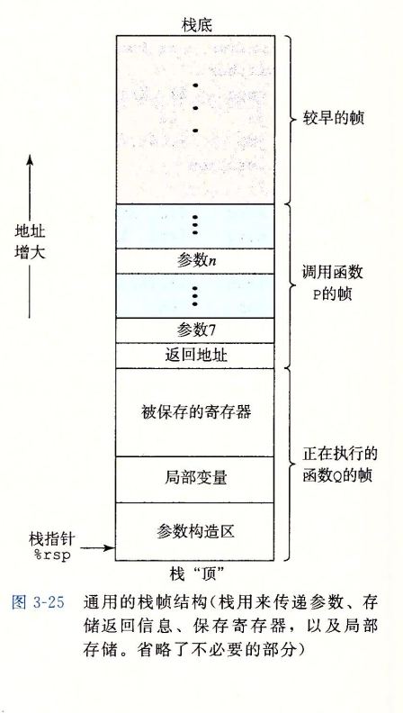

通过减小和增加栈指针的值，我们可以在栈上分配和释放内存。

当 x86-64 过程所需的存储空间超出寄存器能够存放的大小时，就会在栈上分配空间。这一部分就是过程的**栈帧（stack frame）**。

P 调用 Q 时，P 的返回地址被压入栈中，指明 Q 返回时应该继续执行 P 的哪条指令。Q 的代码会扩展当前栈，保存寄存器的值、分配局部变量的空间、为它调用的过程设置参数。多数过程的栈帧是**定长**的，在过程的开始被分配完毕。通过寄存器，P 可以传递最多 6 个整数值，但若 Q 需要更多的参数，P 可以在调用 Q 之前在自己的栈帧里存储好这些参数。

为提高时空效率，x86-64 过程只分配需要的栈帧。例如，参数若少于或等于 6 个，那么就会用寄存器传递所有的参数。有的函数的所有变量都可以保存在寄存器，且不会调用任何其他函数，完全不需要栈帧。

### 转移控制

| 指令 | 描述 |
| --- | --- |
| `call Label` | 直接过程调用 |
| `call *Operand` | 间接过程调用 |
| `ret` | 返回 |
（它们和 `callq` `retq` 完全等价）

`call Q` 会把返回地址（`call Q` 的下一条指令的地址）压入栈中，并把 PC 设置为 Q 的起始地址。
`ret` 会从栈中弹出返回地址，并把 PC 设置为该地址。


### 数据传送


如果函数有大于 6 个整数参数，那么**超出部分**就需要通过栈传递。第 7 个参数位于栈顶。**通过栈传递参数时，所有数据大小向 8 的倍数对齐**。参数到位后，即可执行 `call` 指令转移控制。

### 栈上的局部存储

局部数据必须存放在内存中的时候：
- 寄存器不够用
- 对局部变量使用了 `&` 取地址
- 局部变量是数组或结构

取地址：

```c
long swap_add(long* xp, long* yp) {
    long x = *xp;
    long y = *yp;
    *xp = y;
    *yp = x;
    return x + y;
}

long caller() {
    long arg1 = 534;
    long arg2 = 1057;
    long sum = swap_add(&arg1, &arg2);
    long diff = arg1 - arg2;
    return sum * diff;    
}

// x86-64
long caller()
caller:
    subq    $16, %rsp       ; 分配 16 字节栈帧
    movq    $534, (%rsp)    ; arg1
    movq    $1057, 8(%rsp)  ; arg2
    leaq    8(%rsp), %rsi   ; &arg2
    movq    %rsp, %rdi      ; &arg1
    call    swap_add
    movq    (%rsp), %rdx    ; arg1
    subq    8(%rsp), %rdx   ; diff = arg1 - arg2
    imulq   %rdx, %rax      ; sum *= diff
    addq    $16, %rsp       ; 释放栈帧
    ret
```

寄存器不够用（8 个参数）：

```c
long call_proc() {
    long x1 = 1; 
    int x2 = 2;
    short x3 = 3;
    char x4 = 4;
    proc(x1, &x1, x2, &x2, x3, &x3, x4, &x4);
    return (x1 + x2) * (x3 - x4);
}

// x86-64
long call_proc()
call_proc:
    ; 准备参数
    subq    $32, %rsp
    movq    $1, 24(%rsp)    ; store 1 in &x1
    movl    $2, 20(%rsp)    ; store 2 in &x2
    movw    $3, 18(%rsp)    ; store 3 in &x3
    movb    $4, 17(%rsp)    ; store 4 in &x4

    leaq    17(%rsp), %rax  ; create &x4
    movq    %rax, 8(%rsp)   ; store &x4 as arg8
    movl    $4, (%rsp)      ; store 4 as arg7
    leaq    18(%rsp), %r9   ; pass &x3 as arg6
    movl    $3, %r8d        ; pass 3 as arg5
    leaq    20(%rsp), %rcx  ; pass &x2 as arg4
    movl    $2, %edx        ; pass 2 as arg3
    leaq    24(%rsp), %rsi  ; pass &x1 as arg2
    movl    $1, %edi        ; pass 1 as arg1

    call    proc

    ; 恢复内存
    movslq  20(%rsp), %rdx  ; long(x2)
    addq    24(%rsp), %rdx  ; x1 + x2
    movswl  18(%rsp), %eax  ; int(x3)
    movsbl  17(%rsp), %ecx  ; int(x4)
    subl    %ecx, %eax      ; x3 - x4
    cltq                    ; long(x3 - x4)
    imulq   %rdx, %rax      ; (x1 + x2) * (x3 - x4)
    addq    $32, %rsp       ; 释放栈帧
    ret
```


### 寄存器中的局部存储空间

给定时刻只有一个过程是活动的，我们需要确保当调用者调用被调用者时，被调用者不会覆盖调用者稍后会使用的寄存器值。

根据惯例，寄存器 `%rbx`、`%rbp`、`%r12`、`%r13`、`%r14`、`%r15` 是**被调用者保存寄存器**。P 调用 Q 时，Q 必须保存这些寄存器的值，保证它们的值在返回后与调用前一样，即 Q 要么不改变这些寄存器的值，要么把他们的原始值压入栈中，然后在返回前恢复。依据此惯例，P 就可以安全地把值存在被调用者保存寄存器中。

所有其他寄存器，除了栈指针 `%rsp`，都是**调用者保存寄存器**。调用后，这些寄存器的值可能会被修改。

```c
long P(long x, long y) {
    long u = Q(y);
    long v = Q(x);
    return u + v;
}

// x86-64
x in rdi, y in rsi
P:
    pushq    %rbp
    pushq    %rbx
    subq     $8, %rsp
    movq     %rdi, %rbp    ; save x
    movq     %rsi, %rdi    ; y as arg1
    call     Q
    movq     %rax, %rbx    ; save return value
    movq     %rbp, %rdi    ; x as arg1
    call     Q
    addq     %rbx, %rax    ; return value = u + v
    addq     $8, %rsp
    popq     %rbx
    popq     %rbp
    ret
```

### 递归过程

```c
long rfact(long n) {
    long res;
    if (n <= 1)
        res = 1;
    else
        res = n * rfact(n - 1);
    return res;
}

// x86-64
n in %rdi
rfact:
    pushq   %rbx
    movq    %rdi, %rbx
    movl    $1, %eax
    cmpq    $1, %rdi
    jle     .L35
    leaq    -1(%rdi), %rdi
    call    rfact
    imulq   %rbx, %rax
.L35:
    popq    %rbx
    ret
```

## 数组分配和访问

x86-64 的内存引用指令可以简化数组访问。例如：

```c
int E[5];     // E in %rdx
int i = 2;    // i in %rcx
E[i];         // (%rdx, %rcx, 4)
```

C 允许指针运算。`ptr + 1` 相当于 `&(ptr[1])`， `ptr0 - ptr1` 结果的类型为 `long`。

```c
int a[5][3];         // a in %rdi
int i = 2, j = 1;    // i in %rsi, j in %rdx
a[i][j];             // a + 4 * (3 * i + j)

// leaq    (%rsi, %rsi, 2), %rax    ; 3 * i
// leaq    (%rdi, %rax, 4), %rax    ; a + 4 * (3 * i)
// movl    (%rax, %rdx, 4), %eax    ; a + 12 * i + 4 * j
```

编译器对定长数组常常有优化。

```c
#define N = 16;
typedef int fix_mat[N][N];

int fix_prod_ele (fix_mat A, fix_mat B, long i, long k) {
    long j;
    int res = 0;
    for (j = 0; j < N; j++) {
        res += A[i][j] * B[j][k];
    }
    return res;
}

int fix_prod_ele_opt(fix_mat A, fix_mat B, long i, long k) {
    int* Aptr = &A[i][0];
    int* Bptr = &B[0][k];
    int* Bend = &B[N][k];
    int res = 0;
    do {
        res += *Aptr * *Bptr;
        Aptr++;
        Bptr += N;
    } while (Bptr != Bend);
    return res;
}  // 去掉了整数索引 j，把数组引用全部变成了指针间接引用

// x86-64
A in %rdi, B in %rsi, i in %rdx, k in %rcx
fix_prod_ele:
    salq    $6, %rdx                  ; i * 64
    addq    %rdx, %rdi                ; Aptr = A + i * 64 = &A[i][0]
    leaq    (%rsi, %rcx, 4), %rcx     ; Bptr = B + k * 4 = &B[0][k]
    leaq    1024(%rcx), %rsi          ; Bend = B + k * 4 + 1024 = &B[N][k]
    movl    $0, %eax                  ; res = 0
.L7:
    movl    (%rdi), %edx              ; *Aptr
    imull   (%rcx), %edx              ; *Aptr * *Bptr
    addl    %edx, %eax                ; res += *Aptr * *Bptr
    addq    $4, %rdi                  ; Aptr++
    addq    $64, %rcx                 ; Bptr += N
    cmpq    %rsi, %rcx                
    jne     .L7                       ; Bptr != Bend
    rep; ret
```

C99 引入了变长数组。

```c
int var_ele(long n, int A[n][n], long i, long j) {
    return A[i][j];
}

// x86-64
n in %rdi, A in %rsi, i in %rdx, j in %rcx
var_ele:
    imulq   %rdx, %rdi                ; i * n
    leaq    (%rsi, %rdi, 4), %rax     ; A + 4 * (i * n)
    movl    (%rax, %rcx, 4), %eax     ; A[i][j]
    ret
``` 

由于必须使用乘法指令将 `i` 伸缩 `n` 倍，因此变长数组的性能可能一般。

不过，在循环中引用变长数组时，编译器往往可以根据访问模式的规律来优化索引的计算（即可以把数组引用优化成指针间接引用，从而**避免直接数组引用导致的乘法**）。


## 结构体和联合

编译器维护关于结构体的信息，结构体的所有组成部分存放在一段连续的内存里。

联合体用不同的字段引用相同的内存块。联合体所有字段的偏移量都是 0，它们重叠地放在同一块内存中。联合体的总大小等于它最大字段的大小。

某种二叉树每个叶子节点都存放一个 `double[2]`；每个内部节点存放两个指向孩子节点的指针，但不存放数据。即数据字段和指针字段的使用是**互斥**的。那么就可以用联合体定义：

```c
typedef enum { N_LEAF, N_INTERNAL } nodetype_t;

struct node_s {
    nodetype_t type;    // tag
    union {
        struct {
            union node_s* left;
            union node_s* right;
        } internal;
        double data[2];
    } info;
};
```

联合体还可以用来**访问不同数据类型的位模式**。

```c
unsigned long double2bits(double d) {
    union {
        double d;
        unsigned long bits;
    } u;
    u.d = d;
    return u.bits;
}

// 如果使用 union 实现数据的拼接，那么就需要注意大端法和小端法的问题
```

**数据对齐**：一些计算机系统对基本数据类型的合法地址做出了限制，要求某种类型对象的地址必须是某个 `K` 的倍数。

无论数据是否对齐，x86-64 硬件都能正确工作。

对齐原则：**`K` 字节的基本对象的地址必须是 `K` 的倍数**。

汇编中，`.align 8` 可以保证其后面的数据的起始地址是 8 的倍数。

```c
struct S1 {
    int i;
    char c;
    int j;
};
// 编译器会在 i 和 c 之间填充 3 个字节，从而保证 j 满足 4 字节对齐
// 整个结构体的大小就会变成 12 字节
struct S1* p;    // p 的值必须 4 字节对齐 从而保证 p->i p->c p->j 是对齐的
```

```c
struct S2 {
    int i;
    int j;
    char c;
}; 
// 编译器会在 c 之后填充 3 个字节，以保证 S2 的数组的元素是数据对齐的
```

- `struct P1 { int i; char c; int j; char d; };`：4 + 4 + 4 + 4 = 16 字节，结构体自身 4 字节对齐
- `struct P2 { short w[3]; char c[3]; };`：6 + 3 + 1 = 110 字节，结构体自身 2 字节对齐
- `struct P3 { short w[5]; char* c[3]; };`：10 + 6 + 24 = 40 字节，结构体自身 8 字节对齐

```c
struct {
    char* a;
    short b;
    double c;
    char d;
    float e;
    char f;
    long g;
    int h;
} rec; // 8 + 2+6 + 8 + 1+3 + 4 + 1+7 + 8 + 4+4 = 56 字节

// 重排字段顺序为 a c g e h b d f，则总大小变成 8 + 8 + 8 + 4 + 4 + 2 + 1 + 1+4 = 40 字节
// （字段按大小递减放置 结尾补 4 字节）
```

## 将控制与数据结合起来

C 对数组引用不进行任何边界检查，且局部变量和状态信息（例如保存的寄存器值和返回地址）都存放在栈中。对越界的数组元素的写操作会破坏存储在栈中的状态信息，从而导致程序出错。

**缓冲区溢出（buffer overflow）**是一种常见的状态破坏。

```c
// 标准库 gets 的实现
char* gets(char* s) {
    int c;
    char* dest = s;
    while ((c = getchar()) != '\n' && c != EOF) {
        *dest++ = c;
    }
    if (c == EOF && dest == s) {
        return NULL;
    }
    *dest++ = '\0';
    return s;
} // 不会检查输入的长度是否会越界访问 s

void echo() {
    char buf[8];
    gets(buf);
    puts(buf);
} 

// x86-64
echo:
    subq    $24, %rsp    // 在栈上分配 24 字节
    movq    %rsp, %rdi   // buf 存放在栈中
    call    gets         // 越界超过 24 字节 就会覆盖返回地址 甚至破坏 caller 的栈帧
    movq    %rsp, %rdi
    call    puts
    addq    $24, %rsp
    ret
```

`gets` `strcpy` `strcat` `sprintf` 等库函数都可能导致缓冲区溢出漏洞。

### 栈随机化

**栈随机化**：攻击者需要在字符串中插入攻击代码和执行攻击代码的指针。而产生这个指针需要知道这个字符串放置的栈地址。栈随机化使得**栈的位置在程序每次运行时都有变化**。实现方法是**程序开始时，在栈上分配一段 0 ~ n 字节内随机大小的空间**。

Linux 中，栈随机化是标准行为，它是更大的技术**地址空间布局随机化（Address-Space Layout Randomization）**的一部分。采用 ASLR，每次运行时程序的不同部分（程序代码、库代码、栈、全局变量、堆数据）都会被加载到内存的不同区域。

栈随机化以及其他 ASLR 技术保证了同样的程序运行在不同机器上，地址映射会大相径庭，从而预防了一些攻击。

然而攻击者可以反复用不同的地址攻击。比如在实际攻击代码之前插入很长一段 `nop` 指令（只递增程序计数器的指令），只要攻击者能够猜中这段序列的某个地址，攻击代码就能被执行。即，**空操作雪橇（nop sled）**。如果建立 $256$ 字节的 nop sled，就能通过最多 $2^15 = 32768$ 次枚举破解 $n=2^23$ 的随机化；不过，对 64 位的情况，难度就有点大了。栈随机化和其他 ASLR 技术增加攻击的难度，大大降低了病毒和蠕虫的传播速度。


### 栈破坏检测

gcc 提供了**栈保护者（stack protector）**机制来检测缓冲区越界。它在栈帧中任何局部缓冲区和栈状态之间存储一个**金丝雀值（canary value） / 哨兵值（guard value）**。金丝雀值在程序每次运行时随机产生，在恢复寄存器状态和从函数返回之前，程序检查金丝雀值是否被修改，如果是，则程序异常中止。

gcc 会试着确定函数是否容易被栈溢出攻击（有无局部 `char` 缓冲区），自动插入这种一处检测，除非启用 `-fno-stack-protector` 选项。

```c
void echo() {
    char buf[8];
    gets(buf);
    puts(buf);
} 

// x86-64 with stack protector
echo:
    subq    $24, %rsp
    movq    %fs:40, %rax    // retrieve canary
    movq    %rax, 8(%rsp)   // store canary on stack
    xorl    %eax, %eax      // zero out %eax
    movq    %rsp, %rdi
    call    gets
    movq    %rsp, %rdi
    call    puts
    movq    8(%rsp), %rax   // retrieve canary
    xorq    %fs:40, %rax    // check canary
    je      .L9             // if = goto ok
    call    __stack_chk_fail
.L9:
    addq    $24, %rsp
    ret
```

`%fs:40` 指明金丝雀值是用**段寻址（segmented addressing）**从内存中读入的。金丝雀值被存放在一个特殊的**只读**段中，不会被攻击者覆盖。在**恢复寄存器状态和函数返回之前**，程序会检查金丝雀值是否被修改，如果是，则调用一个错误处理例程。


### 限制可执行代码区域

典型程序中，只有保存编译器产生的代码的内存才需要是可执行的，其他部分可以被限制为只允许读和写。以前的 x86 体系结构将读和执行访问控制合并成一个 1 位的标志，即可读的页也是可执行的。栈必须可读且可写，因而是可执行的。虽然有能够限制一些页可读但不可执行的机制，但性能较差。

最近的处理器引入了 **NX（No-Execute）**位，将读和执行访问模式分开，栈可以被标记被可读、可写但不可执行的，性能上也没有损失。


### 变长栈帧

当函数调用 `alloca` 或声明局部变长数组时，我们会需要实现变长栈帧。

```c
long vframe(long n, long idx, long* q) {
    long i;
    long* p[n];
    p[0] = &i;
    for (i = 1; i < n; i++) {
        p[i] = q;
    }
    return *p[idx];
}

// x86-64
n in rdi, idx in rsi, q in rdx
vframe:
    pushq   %rbp
    movq    %rsp, %rbp            // set frame ptr
    subq    $16, %rsp
    leaq    22(, %rdi, 8), %rax
    andq    $-16, %rax            // round to nearest lower 16
    subq    %rax, %rsp            // allocate for p
    leaq    7(%rsp), %rax
    shrq    $3, %rax              
    leaq    0(, %rax, 8), %r8     // round to nearest higher 8
    movq    %r8, %rcx

// Code for initializing p
i in rax and on stack, n in rdi, p in rcx, q in rdx
.L3:
    movq    %rdx, (%rcx, %rax, 8)          // p[i] = q
    addq    $1, %rax
    movq    %rax, -8(%rbp)                  // store on stack
.L2:
    movq    -8(%rbp), %rax                  // load i
    cmpq    %rdi, %rax
    jl      .L3

// Code for function exit
    leave
    ret
```

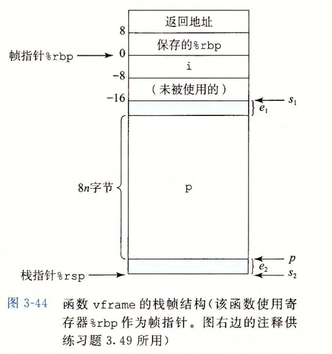

`s1` 是第一次执行 `subq` 后 `%rsp` 指向的位置，`s2` 是第二次执行 `subq` 后 `%rsp` 指向的位置。`e1` 和 `e2` 是空置的。

寄存器 `%rbq` 作为**帧指针（frame pointer）**或**基指针（base pointer）**管理变长栈帧。由于 `%rbq` 是**被调用者保存寄存器**，代码必须先将 `%rbq` 的值保存在栈中，然后执行 `mov %rsp, %rbp`。之后不再改变 `%rbp` 的值。用固定长度的局部变量（例如 `i`）相对于 `%rbq` 的偏移量来访问它们。

`leave` 指令将帧指针恢复到原始值，释放整个栈帧。它相当于 `movq %rbp, %rsp; popq %rbp`。

注意第一部分代码的数据对齐。`s2 - s1` 被**向下舍入到最近的 16 的倍数**，而 **`p` 的起始地址被向上舍入到最近的 8 的倍数**。


## 浮点

处理器的浮点体系结构包括：
- 浮点的存储和访问（寄存器）。
- 浮点操作指令
- 向函数传递浮点参数，从函数返回浮点数
- 函数调用时保存寄存器的规则

Pentium / MMX 时代，Intel 和 AMD 引入了媒体（media）指令，支持图形图像处理。这些指令本意是允许对多个不同的数据并行执行同一个操作，称为**单指令多数据（SIMD）**。MMX 发展成 SSE（Streaming SIMD Extension），又发展为最新的 AVX（Advanced Vector Extension）。

MMX 中，寄存器被称为“MM”寄存器，SSE 中被称为“XMM”寄存器，AVX 中被称为“YMM”寄存器。它们分别是 64 位、128 位和 256 位的。

2000 年 Pentium 4 引入了 SSE2，媒体指令开始包括对标量浮点数操作的指令。这些指令使用 XMM 或 YMM 寄存器的低 32 位或 64 位的单个值。x86-64 浮点数是基于 SSE 或 AVX 的。我们基于 AVX2 讨论浮点数（gcc 给定编译选项 `-mavx2`）。

AVX 浮点体系结构允许数据存储在 16 个 YMM 寄存器中，每个 YMM 寄存器都是 **256 位**的。当对标量数据操作时，这些寄存器只保存浮点数，只使用低 32 位或低 64 位，汇编代码用寄存器的 SSE XMM 寄存器名字引用它们，它们是对应 YMM 寄存器的**低 128 位**。

| 媒体寄存器（YMM） | 媒体寄存器（XMM） | 用途 |
| :---: | :---: | :---: |
| %ymm0 | %xmm0 | 1st FP arg. 返回值 |
| %ymm1 | %xmm1 | 2nd FP 参数 |
| %ymm2 | %xmm2 | 3rd FP 参数 |
| %ymm3 | %xmm3 | 4th FP 参数 |
| %ymm4 | %xmm4 | 5th FP 参数 |
| %ymm5 | %xmm5 | 6th FP 参数 |
| %ymm6 | %xmm6 | 7th FP 参数 |
| %ymm7 | %xmm7 | 8th FP 参数 |
| %ymm8 | %xmm8 | 调用者保存 |
| %ymm9 | %xmm9 | 调用者保存 |
| %ymm10 | %xmm10 | 调用者保存 |
| %ymm11 | %xmm11 | 调用者保存 |
| %ymm12 | %xmm12 | 调用者保存 |
| %ymm13 | %xmm13 | 调用者保存 |
| %ymm14 | %xmm14 | 调用者保存 |
| %ymm15 | %xmm15 | 调用者保存 |

### 浮点传送和转换

| 指令 | 源 | 目的 | 描述 |
| :---: | :---: | :---: | :---: |
| `vmovss` | $M_{32}$ | $X$ | 单精度数 |
| `vmovss` | $X$ | $M_{32}$ | 单精度数 |
| `vmovsd` | $M_{64}$ | $X$ | 双精度数 |
| `vmovsd` | $X$ | $M_{64}$ | 双精度数 |
| `vmovaps` | $X$ | $Y$ | 对齐的封装好的单精度数 |
| `vmovapd` | $X$ | $X$ | 对齐的封装好的双精度数 |

上表给出了 **XMM 寄存器和内存之间**以及 **XMM 寄存器之间不做任何转换地**传送浮点的指令。引用内存的指令是**标量**指令，它们只对单个（而不是一组封装好的数据）进行操作。无论数据对其与否，指令都能正常执行，但建议 32 位数据 4 字节对齐，64 位数据 8 字节对齐。

`vmovaps` 和 `vmovapd` 指令中的 `a` 意为 aligned，`d` 意为 packed。读写内存时，如果地址不满足 **16 字节对齐**，则它们会引发异常。在寄存器之间传送数据不会出现错误对齐。

| 指令 | 源 | 目的 | 描述 |
| :---: | :---: | :---: | :---: |
| `vcvttss2si` | $X/M_{32}$ | $R_{32}$ | 单精度数 -> 整数（截断） |
| `vcvttsd2si` | $X/M_{64}$ | $R_{32}$ | 双精度数 -> 整数（截断） |
| `vcvttss2siq` | $X/M_{32}$ | $R_{64}$ | 单精度数 -> 四字整数（截断） |
| `vcvttsd2siq` | $X/M_{64}$ | $R_{64}$ | 双精度数 -> 四字整数（截断） |

上表的指令**把 XMM 寄存器或内存中读出的浮点数转换成整数，并把结果写入通用寄存器**。

| 指令 | 源 1 | 源 2 | 目的 | 描述 |
| :---: | :---: | :---: | :---: | :---: |
| `vcvtsi2ss` | $M_{32}/R_{32}$ | $X$ | $X$ | 整数 -> 单精度数 | 
| `vcvtsi2sd` | $M_{32}/R_{32}$ | $X$ | $X$ | 整数 -> 双精度数 |
| `vcvtsi2ssq` | $M_{64}/R_{64}$ | $X$ | $X$ | 四字整数 -> 单精度数 |
| `vcvtsi2sdq` | $M_{64}/R_{64}$ | $X$ | $X$ | 四字整数 -> 双精度数 |

上表的指令第一个操作数从**内存或通用寄存器**读取，第二个操作数从**XMM 寄存器**读取，结果写入 **XMM 寄存器**。第二个操作数只会影响结果的高位字节。常见的使用场景中，第二个操作数和目的操作数是同一个寄存器。

| 指令 | 源 1 | 源 2 | 目的 | 描述 |
| :---: | :---: | :---: | :---: | :---: |
| `vcvtss2sd` | $M_{32}/R_{32}$ | $X$ | $X$ | 单精度数 -> 双精度数 | 
| `vcvtsd2ss` | $M_{32}/R_{32}$ | $X$ | $X$ | 双精度数 -> 单精度数 |

假如 `%xmm0` 的低位 4 字节保存着一个单精度值，那么 `vcvtss2sd %xmm0, %xmm0, %xmm0` 就能把它转换为双精度值。然而 gcc 会生成：

```x86asm
vunpcklps %xmm0, %xmm0, %xmm0    ; unpack and interleave low packed single
vcvtps2pd %xmm0, %xmm0
```

`vunpcklps` 指令可以**交叉放置**两个源 XMM 寄存器的值，结果存储在目标寄存器中。如果第一个源寄存器的内容为字 $[s_3, s_2, s_1, s_0]$，第二个源寄存器的内容为字 $[t_3, t_2, t_1, t_0]$，那么 `vunpcklps` 的结果为 $[s_1, t_1, s_0, t_0]$。`vcvtps2pd` 指令把源 XMM 寄存器中的**两个低位单精度值扩展成目的 XMM 寄存器中的两个双精度值**。对 $[s_1, t_1, s_0, t_0]$ 应用此指令会得到 $[\operatorname{ds}_0, \operatorname{dt}_0]$。gcc 生成的代码更麻烦也更莫名其妙。

对于单精度到双精度的转换，相比于 `vcvtsd2ss`，gcc 会生成类似的代码：

```x86asm
vmovddup    %xmm0, %xmm0
vcvtpd2psx  %xmm0, %xmm0
```

假如 `%xmm0` 保存着两个双精度值 $[x_1, x_0]$，那么 `vmovddup` 会将其设置为 $[x_0, x_0]$，`vcvtpd2psx` 将它们转换成单精度，再**存放在寄存器的低位一半中，并将高位一半清零**。这同样是麻烦而莫名其妙的代码。

| 指令 1 | 指令 2 | 描述 |
| :---: | :---: | :---: |
| `vunpcklps %xmm0, %xmm0, %xmm0` | `vcvtps2pd %xmm0, %xmm0` | 单精度数 -> 双精度数 |
| `vmovddup %xmm0, %xmm0` | `vcvtpd2psx %xmm0, %xmm0` | 双精度数 -> 单精度数 |

```c
double fcvt(int i, float* fp, double* dp, long* lp)
{
    float f = *fp;
    double d = *dp;
    long l = *lp;
    *lp = (long)d;
    *fp = (float)i;
    *dp = (double)l;
    return (double)f;
}

// x86-64
i in edi, fp in rsi, dp in rdx, lp in rcx
fcvt:
    vmovss      (%rsi), %xmm0    // f = *fp
    movq        (%rcx), %rax     // l = *lp
    vcvttsd2siq (%rdx), %r8      // d = (long)*dp
    movq        %r8, (%rcx)      // *lp = d
    vcvtsi2ss   %edi, %xmm1, %xmm1  // (float)i
    vmovss      %xmm1, (%rsi)    // *fp = (float)i
    vcvtsi2sdq  %rax, %xmm1, %xmm1  // (double)l 
    vmovsd      %xmm1, (%rdx)    // *dp = (double)l
    vunpcklps   %xmm0, %xmm0, %xmm0
    vcvtps2pd   %xmm0, %xmm0     // (double)f
    ret
```


### 过程中的浮点代码

**XMM 寄存器**用来向函数传递浮点参数和从函数返回浮点值。
- `%xmm0` ~ `xmm7` 最多可以传递 8 个浮点参数，多余的参数用栈传递。
- `%xmm0` 用来返回浮点值。
- **所有的 XMM 寄存器都是调用者保存的**，被调用者可以随意覆盖它们。

浮点参数的寄存器分配按 `%xmm0` -> `%xmm7` 的顺序；其他参数按 `%rdi` `%rsi` `%rdx` `%rcx` `%r8` `%r9` 的顺序分配。


### 浮点运算操作

| 单精度指令 | 双精度指令 | 描述 |
| :---: | :---: | :---: |
| `vaddss` | `vaddsd` | 加 |
| `vsubss` | `vsubsd` | 减 |
| `vmulss` | `vmulsd` | 乘 |
| `vdivss` | `vdivsd` | 除 |
| `vmaxss` | `vmaxsd` | 最大值 |
| `vminss` | `vminsd` | 最小值 |
| `sqrtss` | `sqrtsd` | 算术平方根 |

这是一组执行算术运算的 AVX2 浮点指令，它们**有一个或两个源操作数和一个目标操作数**。**第一个源操作数可以是 XMM 寄存器或内存位置，第二个源操作数和目的操作数必须是 XMM 寄存器**。注意，`vdivss S1 S2 D` 计算的结果为 **`S2/S1`**。


AVX 浮点操作**不能以立即数值作为操作数**，编译器必须为所有的常量值分配和初始化存储空间。

```c
double cel2fahr(double temp) {
    return 1.8 * temp + 32.0;
}

// x86-64
temp in %xmm0
cel2fahr:
    vmulsd    .LC2(%rip), %xmm0, %xmm0
    vaddsd    .LC3(%rip), %xmm0, %xmm0
    ret
.LC2:
    .long    3435973837     // low 4 bytes of 1.8
    .long    1073532108     // high 4 bytes of 1.8
.LC3:
    .long    0               // low 4 bytes of 32.0
    .long    1077936128      // high 4 bytes of 32.0
```

这里的 `.long` 声明的是 `32` 位常量，而不是 `64` 位常量。

| 单精度位级操作 | 双精度位级操作 | 描述 |
| :---: | :---: | :---: |
| `vxorps S1 S2 D` | `vorpd S1 S2 D` | 异或 |
| `vandps S1 S2 D` | `andpd S1 S2 D` | 与 |

这些操作作用于封装好的数据，更新整个目的 XMM 寄存器。


| 浮点比较指令 | 基于 | 描述 |
| :---: | :---: | :---: |
| `ucomiss S1, S2` | S2 - S1 | 比较单精度值 |
| `ucomisd S1, S2` | S2 - S1 | 比较双精度值 |

**S1 可以是 XMM 寄存器或内存位置，S2 必须是 XMM 寄存器**。

浮点比较指令会设置三个条件码：
- `ZF`：零标志位
- `CF`：进位标志位
- `PF`：奇偶标志位

奇偶标志位：对于整数操作，如果**最近的一次算术 / 逻辑运算产生的值的最低位字节是偶校验的**（即此字节中有偶数个 1），那么 `PF` 就被设置为 `1`。对于浮点操作，如果**两个操作数中存在 NaN**，那么 `PF` 被设置为 `1`。根据惯例，C 中如果有参数为 NaN，那么比较操作的结果为 `false`。例如，`x` 为 NaN 时，`x == x` 得到 `0`。

条件码的设置条件

| 顺序 S2 : S1 | CF | ZF | PF |
| :---: | :---: | :---: | :---: |
| 无序 | 1 | 1 | 1 |
| S2 < S1 | 1 | 0 | 0 |
| S2 = S1 | 0 | 1 | 0 |
| S2 > S1 | 0 | 0 | 0 |

**无序**：如果两个操作数中至少有一个是 NaN，那么结果就是无序的。

`jp`（jump on parity）：当 `PF` 为 `1` 时跳转。

```c
typedef enum { NEG, ZERO, POS, OTHER } range_t;

range_t find_range(float x) {
    int res;
    if (x < 0)
        res = NEG;
    else if (x == 0)
        res = ZERO;
    else if (x > 0)
        res = POS;
    else
        res = OTHER;
    return res;
}

// x86-64
x in %xmm0
find_range:
    vxorps    %xmm1, %xmm1, %xmm1
    vucomiss  %xmm0, %xmm1
    ja        .L5
    vucomiss  %xmm1, %xmm0
    jp        .L8
    movl      $1, %eax
    je        .L3
.L8:
    vucomiss  .LC0(%rip), %xmm0  // comp x : 0
    setbe     %al                // res = NaN ? 1 : 0
    movzbl    %al, %eax
    addl      $2, %eax           // res += 2
    ret
.L5:
    movl      $0, %eax
.L3:
    rep; ret
```

gcc 生成的汇编代码效率一般：比较了 `x` 和 `0.0` 三次，尽管一次比较即可得到结果；生成了两次浮点常数：一次用了 `vxorps`，另一次从内存中读出这个值。


# 处理器体系结构

一个处理器支持的指令和指令的字节集编码称为它的**指令集体系结构（Instruction-Set Architecture, ISA）**。

## Y86-64 ISA

### Y86-64 指令及其编码

程序员可见的状态：
- 15 个**程序寄存器**：`%rax`、`%rcx`、`%rdx`、`%rbx`、`%rsp`、`%rbp`、`%rsi`、`%rdi`、`%r8`、`%r9`、`%r10`、`%r11`、`%r12`、`%r13`、`%r14`，除 `%rsp` 以外，寄存器欸用固定的含义或值。
- 3 个一位的**条件码**：零 `ZF`、符号 `SF`、溢出 `OF`
- 程序计数器 PC
- **内存**：Y86-64 用虚拟地址引用内存位置，硬件和操作系统联合起来将虚拟地址翻译成实际的物理地址
- **状态码 `Stat`**：表明程序执行的总体状态（正常？异常？）

- `movq` 被分为 `irmovq`、`rrmovq`、`mrmovq`、`rmmovq`，内存引用只支持基址 + 偏移量形式，不支持第二变址寄存器和任何寄存器值的伸缩，不允许内存之间直接传送，不允许将立即数传送到内存
- 4 个整数操作指令：`addq`、`subq`、`andq`、`xorq`，只能对寄存器数据操作，会设置条件码
- 7 个跳转指令：`jmp`、`jle`、`jl`、`je`、`jne`、`jge`、`jg`
- 6 个条件传送指令：`cmovle`、`cmovl`、`cmove`、`cmovne`、`cmovge`、`cmovg`
- `call`、`ret`、`pushq`、`popq`
- `halt` 停止指令的执行，相当于 x86-64 中的 `hlt`，处理器停止工作，状态码被设置为 `HLT`

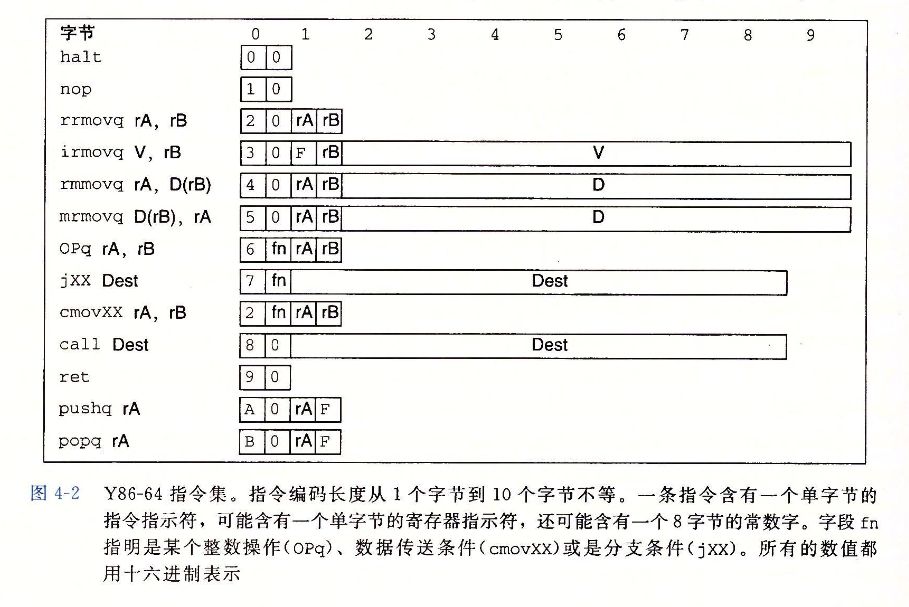

指令的第一个字节表明指令类型，其中高 4 位是*代码（code）*部分，低 4 位是*功能（function）*部分。

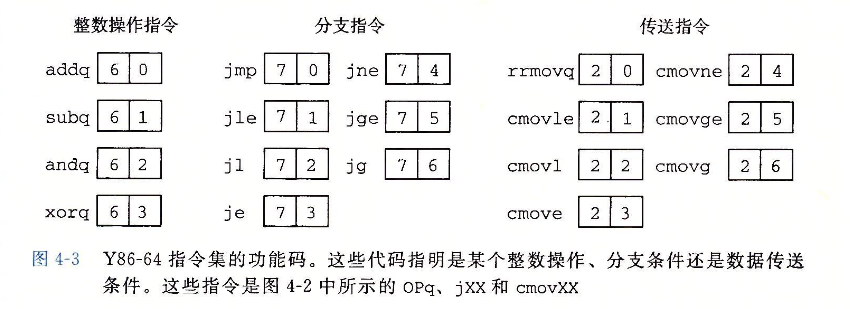

| 寄存器标识符 | 寄存器名 | 描述 |
| :---: | :---: | :---: |
| 0 | `%rax` | 返回值 |
| 1 | `%rcx` | 第 4 个参数 |
| 2 | `%rdx` | 第 3 个参数 |
| 3 | `%rbx` | 被调用者保存 |
| 4 | `%rsp` | 栈指针 |
| 5 | `%rbp` | 被调用者保存 |
| 6 | `%rsi` | 第 2 个参数 |
| 7 | `%rdi` | 第 1 个参数 |
| 8 | `%r8` | 第 5 个参数 |
| 9 | `%r9` | 第 6 个参数 |
| A | `%r10` | 调用者保存 |
| B | `%r11` | 调用者保存 |
| C | `%r12` | 被调用者保存 |
| D | `%r13` | 被调用者保存 |
| E | `%r14` | 被调用者保存 |
| F | 无寄存器 | \ |

**分支指令和调用指令的目的是绝对地址，不采用 PC 相对寻址方式；整数用小端法编码**。

例如，指令 `rmmovq %rsp. 0x123456789abcd(%rdx)` 的字节编码是 `40 42 cd ab 89 67 45 23 01 00`

### Y86-64 状态

状态码 `Stat` 的可能值

| 值 | 名字 | 含义 |
| :---: | :---: | :---: |
| 1 | AOK | 正常操作 |
| 2 | HLT | 执行 `HLT` 指令 |
| 3 | ADR | 非法内存地址 |
| 4 | INS | 非法指令 |


### Y86-64 程序

```c
long sum(long* start, long cnt) {
    long sum = 0;
    while (cnt) {
        sum += *start;
        start++;
        cnt--;
    }
    return sum;
}

// x86-64
start in rdi, cnt in rsi
sum:
    movl $0, %eax
    jmp .L2    // goto test
.L3:           // loop:
    addq (%rdi), %rax
    addq $8, %rdi
    subq $1, %rsi
.L2:          // test:
    testq %rsi, %rsi
    jne .L3
    rep; ret

// y86-64
sum:
    irmovq $8, %r8
    irmovq $1, %r9
    xorq %rax, %rax
    andq %rsi, %rsi
    jmp test
loop:
    mrmovq (%rdi), %r10
    addq %r10, %rax
    addq %r8, %rdi
    subq %r9, %rsi
test:
    jne loop
    ret
```

用 Y86-64 编写的完整程序的示例：

```py
# Exec begins at address 0
        .pos 0                 # 从 0x0 处开始产生代码
        irmovq  stack, %rsp    # 初始化栈指针
        call    main
        halt

# arr of 4 elements
        .align 8
array:
        .quad   0x000d000d000d
        .quad   0x00c000c000c0
        .quad   0x0b000b000b00
        .quad   0xa000a000a000

main:
        irmovq  array, %rdi
        irmovq  $4, %rsi
        call    sum         # sum(array, 4)
        ret

# long sum(long* start, long cnt)
sum:
        irmovq $8, %r8
        irmovq $1, %r9
        xorq %rax, %rax
        andq %rsi, %rsi
        jmp test
loop:
        mrmovq (%rdi), %r10
        addq %r10, %rax
        addq %r8, %rdi
        subq %r9, %rsi
test:
        jne loop
        ret

# stack starts here and grows to lower addresses
        .pos 0x200
stack:
```

以 `.` 开头的是汇编器伪指令（assembler directives），它们告诉汇编器调整地址，以便在那里产生代码或插入数据。`.pos` 告诉汇编器应从地址 `0x0` 处产生代码，这个地址是所有 Y86-64 程序的起点。


> `pushq %rsp` 和 `popq %rsp` 存在歧义。x86-64 中，`pushq %rsp` 会**将 `%rsp` 的原始值压入栈**，而不是减去 `8` 之后的值；`popq %rsp` 会**将 `%rsp` 置为从栈中弹出的值**，而不是栈指针被增加后的值。即，这两个指令压入和弹出的都是**旧值**，这是由于处理器**从不回读**的特性。


## 逻辑设计和硬件控制语言 HCL

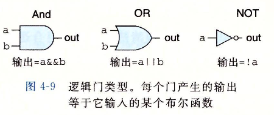

### 组合电路和 HCL 布尔表达式

将很多逻辑门组合成网，就能构建**计算块（computational block）**，称为**组合电路（combinational circuits）**。构建这样的网需要：
- 每个逻辑门的输入必须是以下之一：
  - 一个系统输入（主输入）
  - 某个存储器单元的输出
  - 某个逻辑门的输出
- 两个或多个逻辑门的输出不能连在一起，否则可能会使线上的信号矛盾，引起不合法的电压 / 电路故障
- 网必须是**无环**的，即不能形成回路，否则会导致网络计算的函数产生歧义

异或：`bool xor = (a && !b) || (!a && b)`

检查位相等的组合电路：`bool eq = (a && b) || (!a && !b)`

**多路复用器**（multiplexor, MUX）根据输入控制信号 `s` 的值，从一组输入信号中选出一个输出。

`bool out = (!s && b) || (s && a)`

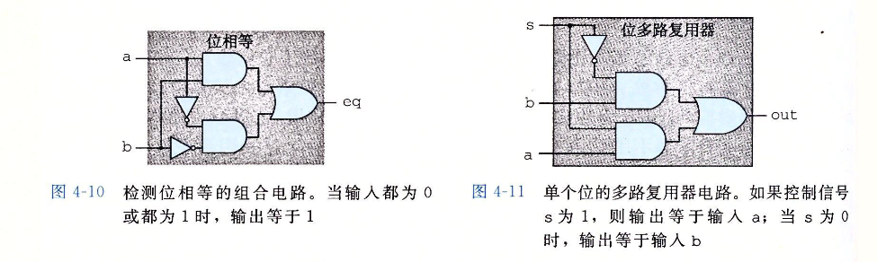


### 字级组合电路和 HCL 整数表达式

把许多个位级组合电路组合起来，可以实现字级组合电路

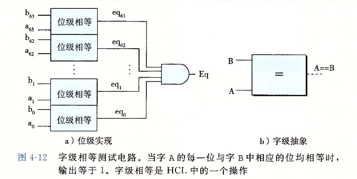

`bool Eq = (A == B)`

在字级抽象中，用中等粗度的线表示字级信号，用虚线表示布尔信号结果。

为了简单，HCL 中，所有字级的信号都声明为 `int`，不指定字的大小。

字级的多路复用器没有简单地复制 64 次位级多路复用器，它**只产生一次 `!s`**。

```c
// 多路复用函数用情况表达式描述
[
    select_1 : expr_1;
    select_2 : expr_2;
    ...
    select_n : expr_n;
]
```

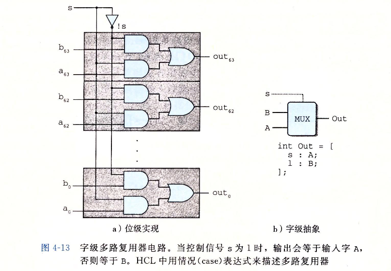

上图的 HCL 描述为：

```c
// 逻辑上，这些选择表达式被顺序求值，第一个求值为 1 的表达式会被输出
// 不得不要求不同的选择表达式互斥
word Out = [
    s : A;
    1 : B;    // 相当于 default，这里即 !s && 1
]
```

选择表达式可以是任意布尔表达式，于是情况表达式能描述带复杂选择标准的、多种输入信号的块。

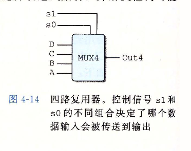

```c
word Out4 = [
    !s1 && !s0 : A;    // 00
    !s1        : B;    // 01 即 !(!s1 && !s0) && !s1
    !s0        : C;    // 10
    1          : D;    // 11
]
```

寻找 A、B、C 中的最小值：

```c
word Min3 = [
    A <= B && A <= C : A;
    B <= A && B <= C : B;    
    1                : C;

    // 也可以这样写
    A <= B : [
        A <= C : A;
        1      : C;
    ];
    1 : [
        B <= C : B;
        1 : C;
    ]

    // 也可以这样写
    A <= B && A <= C : A;
    B <= C           : B;  // 不需要 B <= A 因为 A 已经不可能是结果了 只需要比较 B 和 C    
    1                : C;
]
```

**算术 / 逻辑单元（ALU）**是一种重要的组合电路，它接受**两个数据输入 `A` 和 `B`** 以及**一个控制输入**，下图中 ALU 的四个操作对应 Y86-64 的四种整数操作

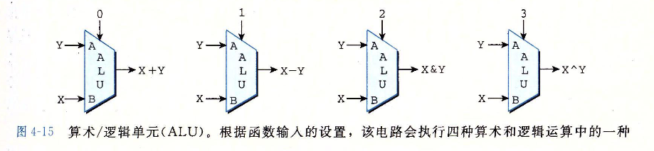


### 集合关系

```c
// s1 s0 为控制信号 是两位信号 code 的高位和低位
bool s1 = code in { 2, 3 };    // code == 2 || code == 3 
bool s0 = code in { 1, 3 };    // code == 1 || code == 3
```

### 存储器和时钟

组合电路不存储信息。为了产生**时序电路（sequential circuit，有状态且基于此状态计算的系统）**，需要引入按位存储信息的设备。

存储设备由同一个时钟控制，时钟是一个周期性信号，决定了新值被加载到设备的时机。考虑两类存储器：
- 时钟寄存器（简称寄存器）：存储**单个位 / 字**，时钟信号控制寄存器加载输入值
- 随机访问存储器（简称内存）：存储**多个字**，用地址选择读写哪个字。包括**处理器的虚拟内存系统**和**寄存器文件**

- 硬件寄存器：直接把输入和输出线连接到电路其他部分的存储设备
- 程序寄存器：CPU 中为数不多可寻址的字，地址为寄存器 ID

硬件寄存器的工作原理：大多数时候，寄存器保持在稳定状态，其输出等于当前状态。即使一个新的寄存器输入产生，只要时钟是低电位的，寄存器的输出就保持不变。当时钟变为高电位时，寄存器将输入加载进来，变为自己新的状态，并输出。这个状态一直保持，直到下一个**时钟上升沿**。

寄存器是电路不同部分中的组合逻辑之间的屏障。每当每个时钟到达上升沿，值才会从寄存器的输入传送到输出。

Y86-64 处理器用时钟寄存器保存程序计数器（PC）、条件代码（CC）和程序状态（Stat）。

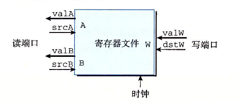

寄存器文件有**两个读端口（A 和 B）**和**一个写端口（W）**。这样的*多端口*随机访问存储器允许同时进行多个读和写操作。上图的寄存器文件中，电路可以读两个程序寄存器的值，同时更新第三个寄存器的状态。`srcA`、`srcB` 和 `dstW` 是端口的地址输入，表明被读 / 写的寄存器的标识符。`valA`、`valB` 输出从寄存器中读出的值，`valW` 输入要写入寄存器的值。

寄存器文件有内部存储，**不是**组合电路。不过我们的实现中，从寄存器文件读数据就仿佛它是一个以地址为输入、数据为输出的组合逻辑块。

向寄存器文件写入字由时钟信号控制。每次时钟上升时，`valW` 的值被写入`dstW` 所指示的寄存器（当 `dstW` 为 `0xF` 时，不写入任何寄存器）。

#### 同时读和写同一个寄存器

同时读和写同一个寄存器会发生什么？我们会看到一个从旧值到新值的变化。（？）


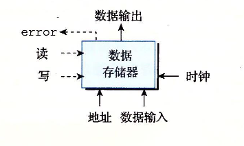

处理器有一个**随机访问存储器**存储程序数据。从内存中读的操作方式类似于组合逻辑：输入地址、写控制信号置 `0`，则地址上的数据就会被输出。`error` 信号被置为 `0`，除非地址非法（这个信号由组合逻辑产生，因为这个边界检查纯粹是地址输入的函数，不涉及任何状态的保存）。写内存由时钟控制：输入地址和要写入的数据、写控制信号置 `1`，然后当我们控制时钟时，数据就会被写入内存。

我们的处理器还包括另外一个只读存储器，用于读指令。在大多数实际系统中，这两个存储器被合并为一个具有双端口的存储器：一个读指令，另一个读或写数据。

## Y86-64 的顺序实现

我们描述一个称为 SEQ 的处理器。每个时钟周期上，SEQ 执行处理一条完整指令所需的所有步骤，但这需要一个很长的时钟周期时间，因此时钟周期频率会低到不可接受。

### 将处理组织成阶段

- **取指（fetch）**：从内存中读取指令字节，地址为程序计数器（PC）的值。从指令中抽取出：指令指示符字节的两个四位部分，称为 `icode`（指令代码） 和 `ifun`（指令功能）；一个寄存器指示符字节，指明一或两个寄存器操作数指示符 `rA` 和 `rB`；四字节常数字 `valC`。它按顺序方式计算下一条指令的地址 `valP`（`valP` 等于 `PC` 的值加当前指令的长度）。
- **译码（decode）**：从寄存器文件读入最多两个操作数，得到 `valA` 和 / 或 `valB`。
- **执行（execute）**：算术 / 逻辑单元（ALU）要么执行指令的操作、计算内存引用的有效地址，要么增减栈指针。得到的值记为 `valE`。此阶段也可能设置条件码。对条件传送指令来说，此阶段会检验条件码和传送条件，如果条件成立，则更新目标寄存器。对跳转指令来说，此阶段决定是否应该选择分支。
- **访存（memory）**：访存阶段将数据写入内存，或从内存读出数据。读出的值记为 `valM`。
- **写回（write back）**：写最多两个结果到寄存器文件。
- **更新 PC（PC update）**：将 PC 置为下一条指令的地址。

处理器无限循环。发生异常后停止：执行 `halt` 指令或非法指令，或读写非法地址。

`OPq`、`rrmovq`、`irmovq` 在顺序实现的计算（它们都不会设置条件码）：

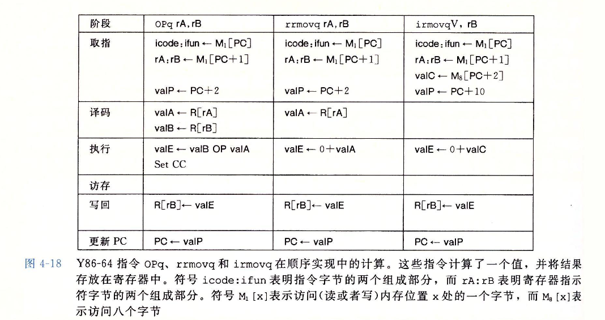

作为例子，以下是 `subq %rdx, %rbx` 指令的处理过程。

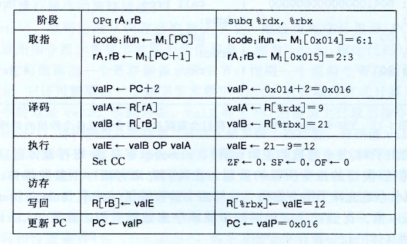

`rmmovq` 和 `mrmovq` 用 ALU 来加 `valC` 和 `valB`（偏移量和基址寄存器），得到有效内存地址。

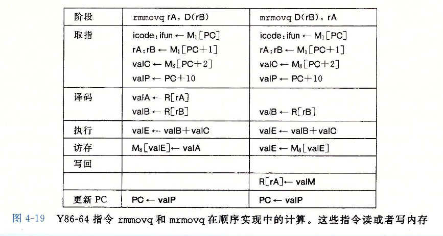

`pushq` 在译码阶段将 `valB` 赋值为 `%rsp`；在执行阶段，用 ALU 将栈指针减 8，得到 `valE`；在访存阶段将 `valA` 写入 `valE` 指示的内存地址；在写回阶段将 `valE` 赋给 `%rsp`。**栈指针的更新（减 8）效果上是在内存操作完成后进行的，因此 `pushq %rsp` 会将 `%rsp` 的原始值压入栈**，而不是减 8 后的值。

`popq` 在译码阶段**读两次栈指针**，这是为了让后面的流程和其他指令更相似，增强整体设计的一致性。**栈指针的更新效果上后于内存操作**，`popq %rsp` 会**将 `%rsp` 置为从栈中弹出的值**，而不是栈指针被增加后的值。

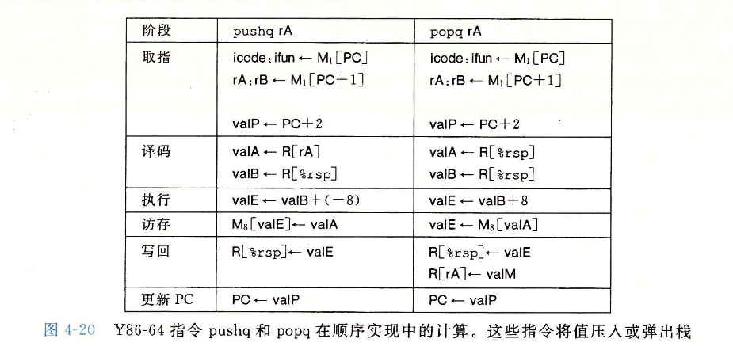


三类控制转移指令的处理类似。`valC` 是要跳转到的地址，`valP` 是下一条指令的地址。`jxx` 在执行阶段检查条件码和跳转条件，产生一个一位信号 `Cnd`，在更新 PC 阶段根据 `Cnd` 的值决定是否跳转。`call` 在执行阶段更新栈指针，在访存阶段将 `valP` 压入栈，在写回阶段写入栈指针的新值。`ret` 在执行阶段更新栈指针，访存阶段弹出返回地址，写回阶段写入栈指针的新值，更新 PC。

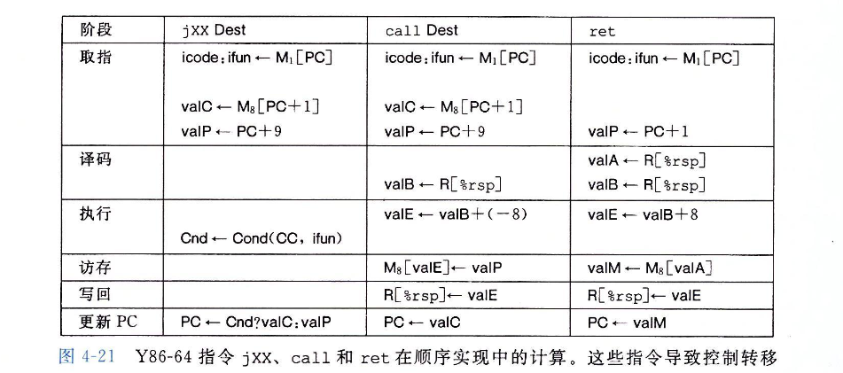

类似地，`cmovXX`：

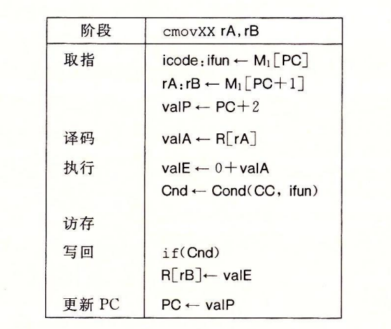


### SEQ 硬件结构

同各个阶段相关的硬件单元（hardware units）负责执行每个阶段的处理。所有硬件单元的处理都在**一个时钟周期**完成。

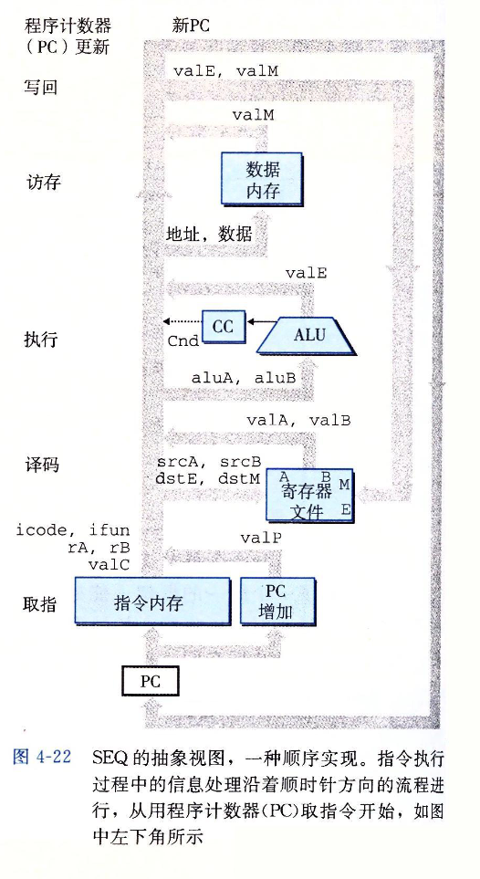

- **取指**：将程序计数器寄存器作为地址，指令内存读取指令字节，PC 增加器（PC incrementer）计算 `valP`。
- **译码**：从寄存器文件的读端口 `A` 和 `B` 同时读取 `valA` 和 `valB`。
- **执行**：计算 `valE`，更新条件码寄存器 CC。有条件时，根据条件码和传送条件计算 `Cnd`。
- **访存**：从数据内存读取 `valM`，或将 `valA` 写入数据内存。
- **写回**：寄存器文件有两个写端口。端口 `E` 用来写入 `valE`，端口 `M` 用来写入 `valM`。
- **更新 PC**：下一条指令的地址选择自 `valP`、`valC` 或 `valM`，并将其写入程序计数器寄存器。

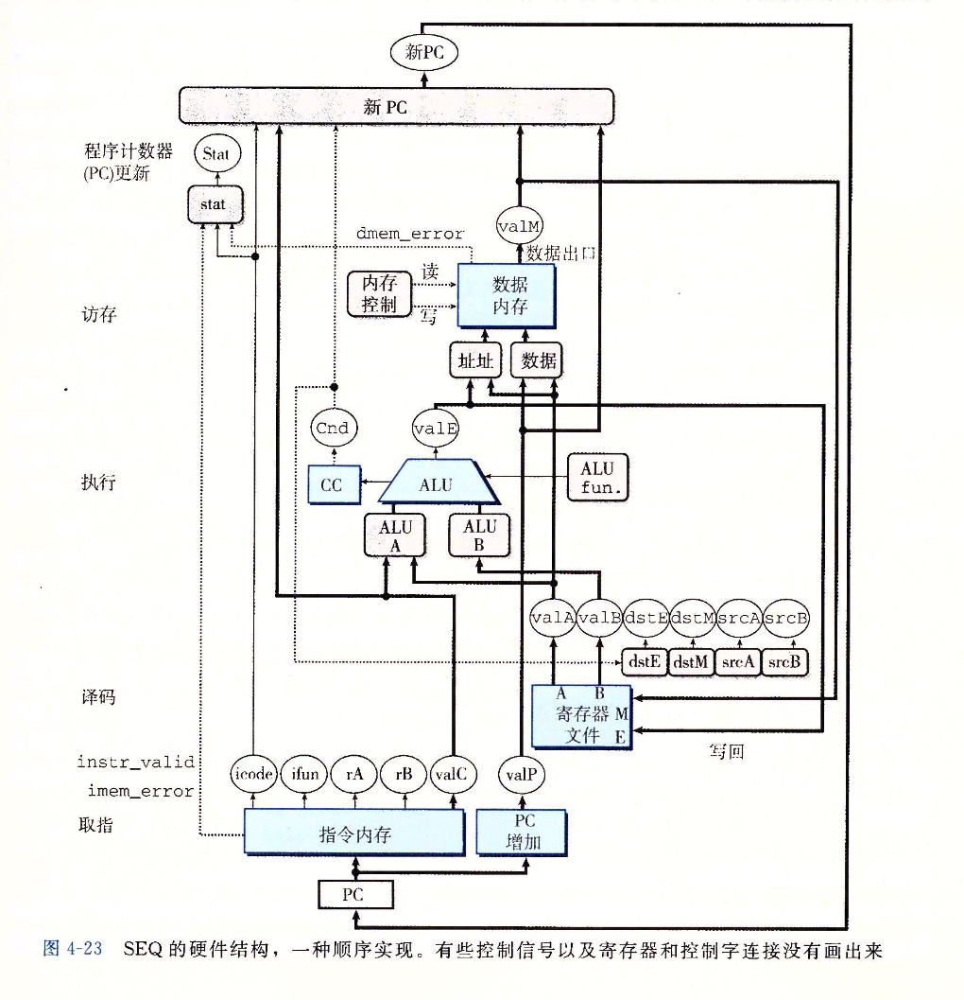

- 白色方框表示*时钟寄存器*。程序计数器 PC 是 SEQ 中唯一的时钟寄存器
- 浅蓝色方块表示*硬件单元*。包括内存、ALU、寄存器文件、PC 增加器、条件码寄存器等。我们只把它们当作黑盒。
- 灰色圆角矩形表示*控制逻辑块*。这些块用来从一组信号源中进行选择，或计算一些布尔函数。
- 白色圆形表示*线路的名字的说明*。它们只是线路的标识。
- 宽度为*字长*的数据连接用*中等粗度的线*表示。它们实际上是一簇 64 根线。
- 宽度为*字节或更窄*的数据连接用*细线*表示。它们实际上是一簇 4 根或 8 根线。
- *单个位*的数据连接用*虚线*表示。

四个寄存器 ID 信号：`srcA`，`valA` 的源；`srcB`，`valB` 的源；`dstE`，`valE` 的目的；`dstM`，`valM` 的目的。

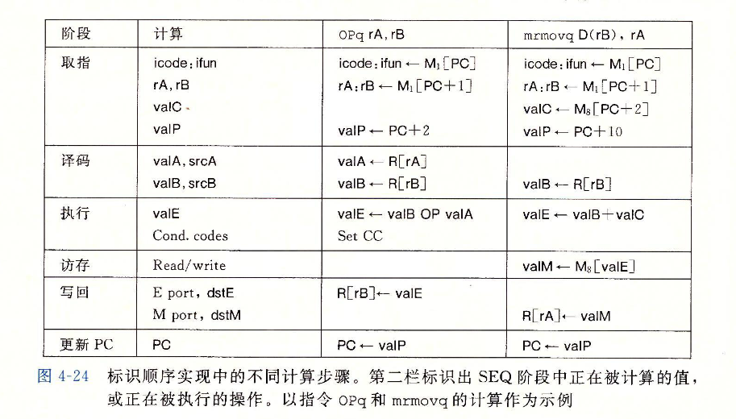


### SEQ 的时序

SEQ 的实现包括组合逻辑和两种存储器设备：时钟寄存器（程序计数器和条件码寄存器）以及随机访问存储器（寄存器文件、指令内存和数据内存）。组合逻辑不需要时序或控制，因为只要输入变化，其值就通过逻辑门网络传播。我们认为*读随机访问存储器的操作和组合逻辑一样，只要输入的地址变化，输出的字就自动变化，并通过逻辑门网络传播*。对于较小的电路，这是合理的；对于较大的电路，可以用特殊的时钟电路模拟这个效果。指令内存只用来读指令，我们可以将这个单元看作组合逻辑。

**程序计数器、条件码寄存器、数据内存和寄存器文件**这四个硬件单元的时序需要被明确控制。它们被一个*时钟信号*控制。每个时钟周期，程序计数器都会装载新的指令地址。条件码寄存器只在执行整数运算指令时被装载。数据内存只在执行 `rmmovq`、`pushq` 或 `call` 时被写入。寄存器文件的两个写端口允许每个时钟周期更新两个程序寄存器。

我们将每条指令拆分成了 6 个按顺序执行的阶段，但在硬件结构中，这些阶段实际上是“同时”进行的。通过寄存器和内存的时钟控制，硬件获得了如同顺序执行的效果。

能够“化同时为顺序”，是因为我们遵循了**从不回读**的原则。**处理器从来不需要为了完成一条指令的执行而去读由该指令更新了的状态**。例如，如果我们对 `pushq` 的实现变为*先将 `%rsp` 减 8，再将更新后的 `%rsp` 值作为写操作的地址*，那么我们为了执行内存操作，就需要先从寄存器文件读出更新后的 `%rsp`，从而违背了此原则。实际上，我们的实现是*先产生出更新后的 `%rsp` 值作为信号 `valE`，然后将 `valE` 既作为写回栈指针的数据，又作为内存写的地址*。因此，在时钟上升开始下一个周期时，处理器就可以同时执行寄存器写和内存写了。

又例如，有的指令（整数运算）设置条件码，有的指令（条件跳转）读取条件码，但没有指令既设置条件码，又读取条件码。在任何指令试图读之前，它们都会更新。

寄存器文件、指令内存和数据内存的读取被看成是组合逻辑。每个时钟周期开始时，状态单元（程序计数器、条件码寄存器、寄存器文件和数据内存）的值是根据上一条指令设置的。信号通过组合逻辑传播，生成新的状态单元的值。在下一个周期开始时，这些值会被加载到状态单元中。

简言之，SEQ 的硬件实现可以描述为：用时钟控制状态单元的更新，值通过组合逻辑传播。

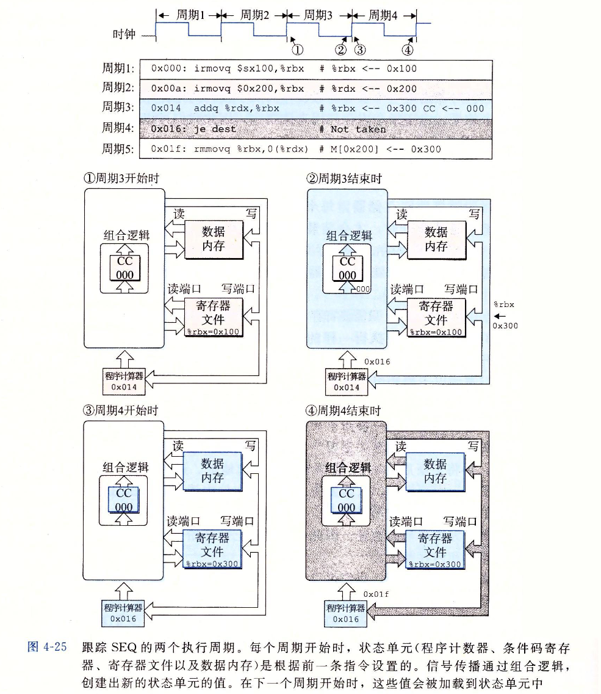


### SEQ 阶段的实现

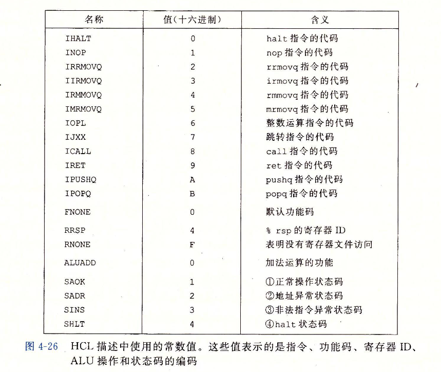

#### 取指阶段

指令内存以 PC 的值作为地址的起始字节，一次从内存中读出 10 个字节。第一个字节被解释成指令字节，输入 Split 单元，被分成两个 4 位的数输入两个控制逻辑块 icode 和 ifun。这两个控制逻辑块计算指令和功能码：或者将输入值照样输出，或者当指令地址不合法时（由信号 `imem_error` 指明）使这些值对应于 `nop` 指令（icode 置 1，ifun 置 0）。

根据 icode 的值，三个一位的信号被计算出来：`instr-valid` 检查指令合法性，`need_regids` 检查指令是否包括一个寄存器指示符字节，`need_valC` 检查指令是否包括一个常数字。（当指令地址越界时会产生的）`instr_valid` 和 `imem_error` 在访存阶段被用于产生状态码。

```c
bool need_regids =
        icode in {IRRMOVQ, IOPQ, IPUSHQ, IPOPQ, IIRMOVQ, IRMMOVQ, IMRMOVQ};
```

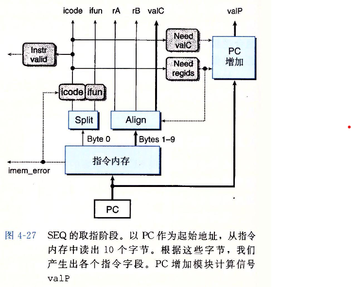

剩下 9 个字节是寄存器指示符字节和常数字的组合编码。硬件单元 Align 将他们放入寄存器字段和常数字中。若 `need_redids` 为 1，则第一个字节被分开放入 `rA` 和 `rB`；否则，`rA` 和 `rB` 被置为 `0xF(RNONE)`。Align 同时根据 `need_regids` 产生常数字 `valC`：若 `need_valC` 为 1，则 `valC` 为字节 2 ~ 9；否则，`valC` 为字节 1 ~ 8。

PC 增加器根据 PC、`need_regids` 和 `need_valC` 的值产生信号 `valP`：$\operatorname{valP}=\operatorname{PC}+1+\operatorname{need\_regids}+8\operatorname{need\_valC}$

#### 译码和写回阶段

寄存器文件有两个读端口和两个写端口。每个端口有一个地址连接和一个数据连接。例如读端口 A 的地址连接是 `srcA`，数据连接是 `valA`；而写端口 E 的地址连接是 `dstE`，数据连接是 `valE`。地址连接是一个寄存器 ID，而数据连接是一组 64 根线路。

根据 `icode` 以及 `rA` 和 `rB`，可能还有 `Cnd` 条件信号，`dstE`、`dstM`、`srcA` 以及 `srcB` 四个块产生出四个不同的寄存器 ID

```c
word srcA = [
    icode in { IRRMOVQ, IRMMOVQ, IOPQ, IPUSHQ } : rA;
    icode in { IPOPQ, IRET } : RRSP;
    1 : RNONE;
];
```

暂时忽略条件移动指令，可以写出 `dstE` 的 HCL 描述：

```c
// Conditional move not implemented correctly
word dstE = [
    icode in { IRRMOVQ } : rB;
    icode in { IIRMOVQ, IOPQ } : rB;
    icode in { IPUSHQ, IPOPQ, ICALL, IRET } : RRSP;
    1 : RNONE;
];
```

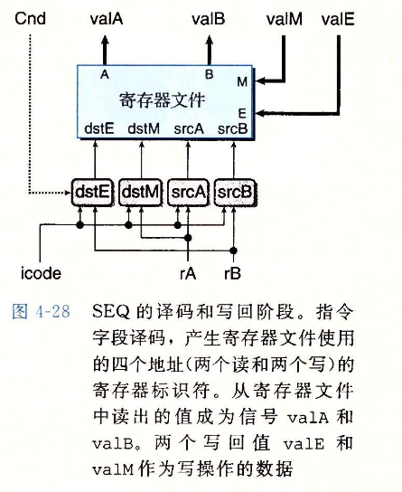

对于指令 `popq %rsp`，写端口 E 和 M 会同时对 `%rsp` 写入。为了让 `popq %rsp` 弹出的是 `%rsp` 的旧值，我们需要令 M 端口的优先级高于 E 端口。这样，当 E 和 M 端口同时写入时，**只有 M 端口的写入会发生**。


#### 执行阶段

ALU 根据 `alufun` 信号，对 `aluA` 和 `aluB` 执行 ADD、SUBTRACT、AND 或 EXCLUSIVE-OR 运算。

```c
word aluA = [
    icode in { IRRMOVQ, IOPQ } : valA;
    icode in { IIRMOVQ, IRMMOVQ, IMRMOVQ } : valC;
    icode in { ICALL, IPUSHQ } : -8;
    icode in { IRET, IPOPQ } : 8;
    // Other instructions don't need ALU
];
```

```c
word alufun = [
    icode == IOPQ : ifun;
    1 : ALUADD;
];
```


每次运行时，ALU 都会产生三个与条件码相关的信号：零、符号和溢出。我们希望只在执行 `OPq` 时才设置条件码，因此用控制信号 `set_cc` 来控制条件码是否被设置：`bool set_cc = icode in { IOPQ };`

“cond”会根据条件码和 `ifun` 产生一位信号 `Cnd`，决定是否进行条件分支或条件数据传送。`Cnd` 在设置条件传送时的 `dstE` 和条件传送的下一个 PC 逻辑中被用到。

```c
// Conditional move now implemented correctly
word dstE = [
    icode in { IRRMOVQ } && Cnd : rB;
    icode in { IIRMOVQ, IOPQ } : rB;
    icode in { IPUSHQ, IPOPQ, ICALL, IRET } : RRSP;
    1 : RNONE;
];
```

#### 访存阶段

控制块 Mem.addr 和 Mem.data 产生内存地址和待写入数据的值，Mem.read 和 Mem.write 产生读写操作的控制信号。进行读操作时，`valM` 是读出的值。

```c
word mem_addr = [
    icode in { IRMMOVQ, IPUSHQ, ICALL, IMRMOVQ } : valE;
    icode in { IPOPQ, IRET } : valA;
    // Other instructions don't need address
];
```
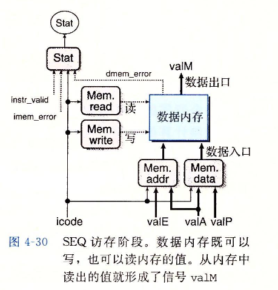

在访存阶段的最后，处理器根据取指阶段产生的 `icode`、`imem_error`、`instr_valid` 和数据内存产生的 `dmem_error`，计算状态码 `Stat`。

#### 更新 PC 阶段

根据 `icode` 和 `Cnd` 产生 PC 的新值。

```c
word new_pc = [
    icode == ICALL : valC;
    icode == IJXX && Cnd : valC;
    icode == IRET : valM;
    1 : valP;
];
```

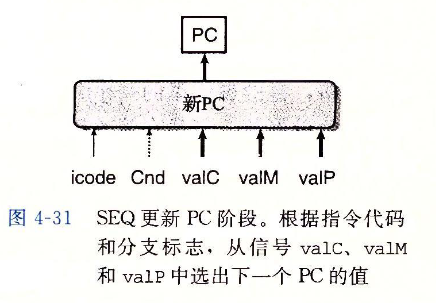


## 流水线的通用原理

### 计算流水线

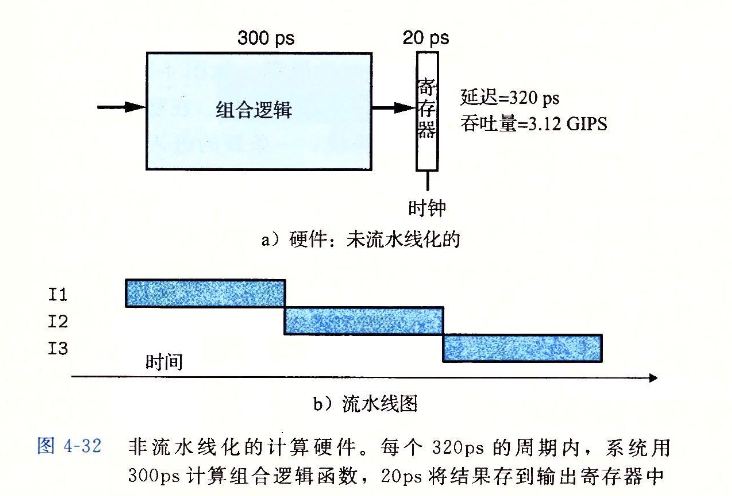

流水线图（pipeline diagram）表明，非流水线化的硬件一个指令接着一个指令执行，每条指令代表的矩形在垂直方向不重叠。

$$ \operatorname{吞吐量}=\frac{1 \operatorname{条指令}}{(20+300)\operatorname{ps}}\cdot\frac{1000\operatorname{ps}}{1\operatorname{ns}}\approx 3.12\operatorname{GIPS}$$

每秒十亿条指令（GIPS）是吞吐量的单位。从头到尾执行一条指令的用时称为**延迟（latency）**。

$$\operatorname{延迟}=\frac{1}{\operatorname{吞吐量}}=320 \operatorname{ps}$$


流水线化的计算硬件将计算分为三个阶段（A、B 和 C），在各个阶段之间放上**流水线寄存器（pipeline register）**。每条指令需要三个完整的时钟周期执行。稳定状态下，每个时钟周期，一条指令离开系统，一条新指令进入系统。我们将时钟周期设置为 $120\operatorname{ps}$，则吞吐量为 $8.33\operatorname{GIPS}$，延迟为 $360\operatorname{ps}$。延迟增加是由于增加的流水线寄存器的时间开销。


减缓时钟不会影响流水线的行为，但加快时钟可能导致值来不及通过组合逻辑。

### 流水线的局限性

#### 不一致的划分

如果不同计算阶段的**延迟不相等**，则时钟周期不得不被设置为最长的延迟，以保证所有阶段都能完成。这样，流水线的吞吐量就会降低。

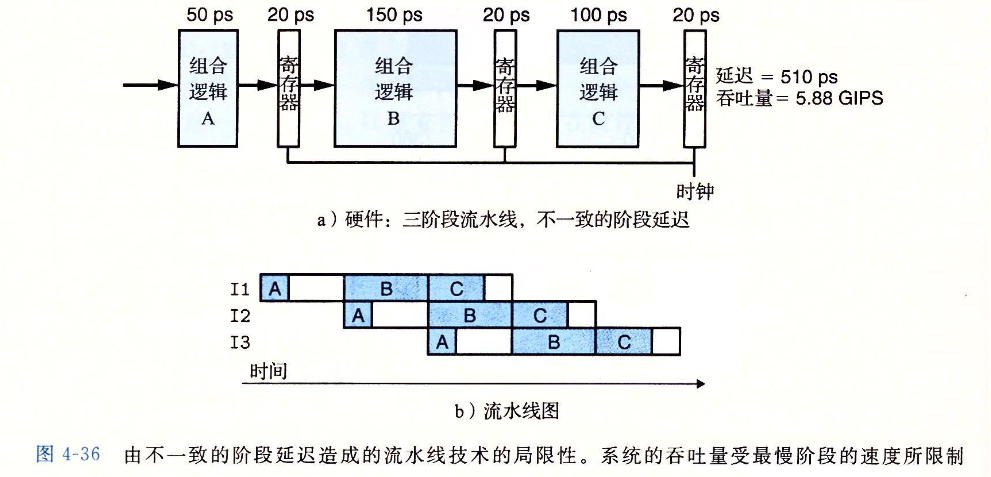

将系统计算设计划分成等延迟的阶段很难。ALU 和内存是不能被划分为多个延迟更小的单元的。

#### 流水线过深，收益反而下降

流水线寄存器也会带来延迟。随着流水线深度的增加，虽然时钟频率能够提高，但这一延迟也会越来越显著。

为了提高时钟频率，现代处理器采用了很深的（15 或更多的阶段）流水线。处理器架构师将指令的执行划分成很多非常简单的步骤，减小每个阶段的延迟。芯片设计者小心地设计时钟传播网络，以保证时钟在整个芯片上同时改变。

### 带反馈的流水线系统

相邻的机器指令之间可能存在**数据相关（data dependency）**。例如，`addq %rax, %rbx` 和 `subq %rbx, %rcx`，第二条指令的源操作数是第一条指令的目的操作数。

```c
loop:
    subq %rdx, %rbx
    jne targ
    irmovq $10， %rdx
    jmp loop
targ:
    halt
```

第三行的 `jne targ` 产生了一个**控制相关（control dependency）**，条件测试的结果决定下一条指令是 `irmovq` 还是 `halt`。

SEQ 设计中，这些相关是用**反馈路径**解决的。每条指令的结果都反馈给下一条指令：将更新的寄存器值向下传送到寄存器文件，将新的 PC 值向下传送到 PC 寄存器。

将流水线引入含有反馈路径的系统中会带来危险。例如，如果以下图的方式直接将 `I1` 的结果反馈给 `I4`，那么我们就会改变系统的行为。因此，下图的方式是明显不可接受的。

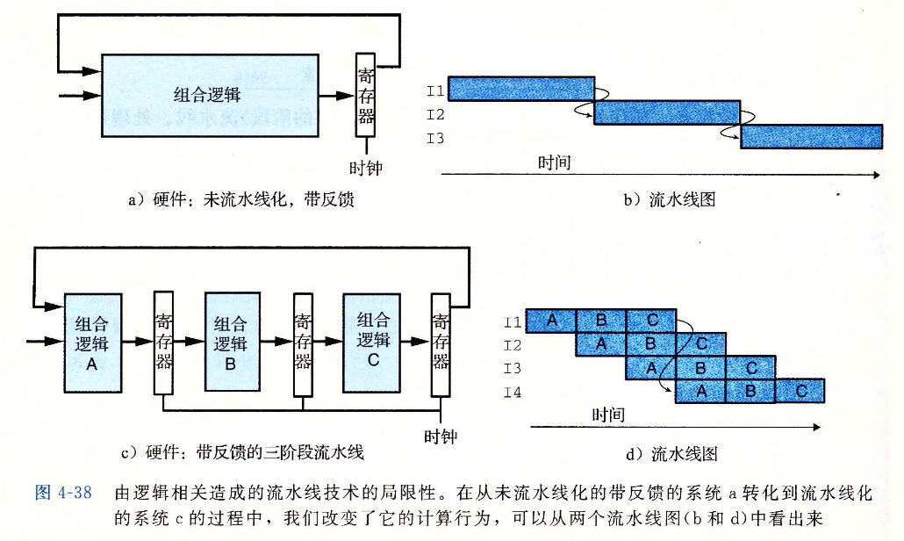


## Y86-64 的流水线实现

### SEQ+：重新安排计算阶段

调整 SEQ 中五个阶段的顺序，使得更新 PC 阶段在一个时钟周期开始时执行。在 SEQ+ 中，我们创建状态寄存器来保存在一条指令执行过程中计算出来的信号，在新的时钟周期开始时，这些信号通过同样的逻辑来计算当前指令的 PC。我们将这些寄存器标号为 pIcode、pCnd 等等，来指明在任一给定周期，它们保存的是**前一个周期中产生的控制信号**。

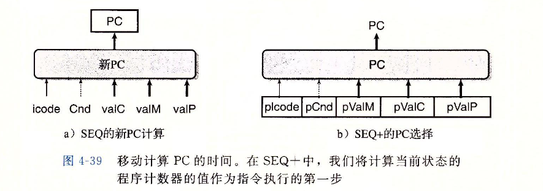

SEQ+ 没有硬件寄存器来存放程序计数器，而是根据从上一条指令保存的状态信息**动态**地计算 PC。我们可以用一种与 ISA 隐含着的概念模型不同的方式实现处理器，只要保证处理器的执行效果是正确的。

这种改进称为**电路重定时（circuit retiming）**。重定时改变系统的状态表示，但不改变其逻辑行为。它可以平衡一个流水线系统各个阶段的延迟。

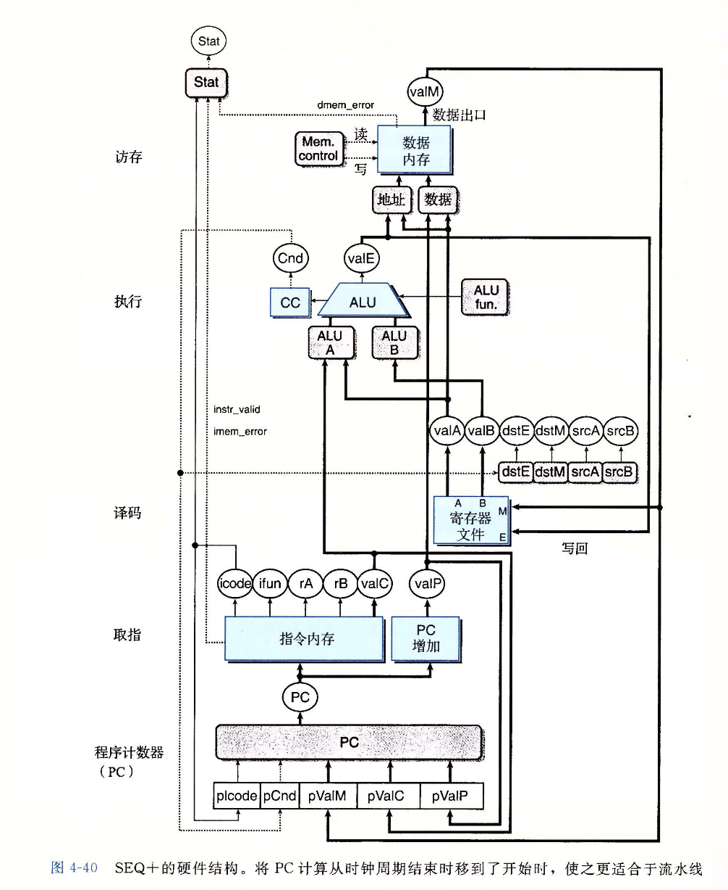

### 插入流水线寄存器

我们要在 SEQ+ 的各个阶段之前插入流水线寄存器，并对信号重新排列，得到 PIPE- 处理器。

流水线寄存器用实心方框表示，每个寄存器包括不同字段，用白色方框表示。同之前硬件结构图示的圆角方框不同，这些白色方框表示实际的硬件组成。

流水线寄存器按如下方式标号：
- F：保存程序计数器的**预测**值。
- D：位于取指和译码阶段之间。保存关于最新取出的指令的信息，即将由译码阶段处理。
- E：位于译码和执行阶段之间。保存关于最新译码的指令以及从寄存器文件读出的值的信息，即将由执行阶段进行处理。
- M：位于执行和访存阶段之间。保存最新执行的指令的结果，即将由访存阶段进行处理。还保存用于处理条件转移的分支条件和分支目标的信息。
- W：位于访存阶段和反馈路径之间。反馈路径将计算出来的值提供给寄存器文件写，而当完成 `ret` 指令时，它还要向 PC 选择逻辑提供返回地址。


### 对信号重新排列和标号

顺序实现 SEQ 和 SEQ+ 在一个时刻只处理一条指令，因此 `valC`、`srcA` 和 `valE` 这样的信号有唯一的值。而在流水线化的设计中，与各个指令相关联的这些值有多个版本。

对于*流水线寄存器中的字段*，我们加上大写的流水线寄存器名字作为前缀区分，例如 4 个状态码被命名为 `D_stat`、`E_stat`、`M_stat` 和 `W_stat`；对于*在一个阶段内刚刚计算出来的信号*，我们加上小写的阶段名的首字母作为前缀区分，例如取值和访存阶段标号 Stat 的控制逻辑块的输出被命名为 `f_stat` 和 `m_stat`。整个处理器的状态 `Stat` 是根据 `W_stat` 的值，经过写回阶段的块计算而得的。

SEQ+ 和 PIPE- 的译码阶段都产生信号 `dstE` 和 `dstM`，它们指明值 `valE` 和 `valM` 的目的寄存器。SEQ+ 中，我们将这些信号直接连到寄存器文件写端口的地址输入，但在 PIPE- 中，我们在流水线中**一直携带这些信号穿过执行和访存阶段**，直到写回阶段才送到寄存器文件。作为一条通用原则，*我们要保存处于一个流水线阶段中的指令的所有信息*。

PIPE- 译码阶段中的 Select A 块从*来自流水线寄存器 D 的 `valP`* 和*从寄存器文件 A 端口读出的值*中选择一个，作为流水线寄存器 E 的 `valA`。包括这个块是为了**减少要携带给流水线寄存器 E 和 M 的状态数量**。只有 `call` 指令在访存阶段需要 `valP` 的值，只有跳转指令在执行阶段（当不需要跳转时）需要 `valP` 的值，而这些指令又都不需要从寄存器文件读出的值。因此我们把这两个信号合并为 `valA`，从而减少了流水线寄存器的状态数量。这消除了 SEQ+ 中标号 Data 的块。

### 预测下一个 PC

我们必须在取出当前指令之后，马上确定下一条指令的位置。然而，如果取出的是**条件分支指令**，我们就不得不等到指令通过执行阶段后才能知道是否需要跳转。类似地，如果取出的是 **`ret`** 指令，我们不得不等到访存阶段才能确定返回地址。

除了这两个例外，对于其他的指令，我们可以在取值阶段确定其下一条指令的地址。对于 `call` 和 `jmp`下一条指令的地址就是常数字 `valC`；对其余指令，下一条指令的地址则是 `valP`。因此，通过预测 PC 的下一个值，大多数情况下我们能打倒**每个时钟周期发射一条新指令**的目的。

猜测分支方向并根据猜测开始取指的技术称为**分支预测**。我们的设计只使用了简单的策略，即总是预测**选择了条件分支**，因而预测 PC 的新值为 `valC`。

> 我们的设计使用**总是选择（always taken）**的预测策略，它的成功率约为 $60%$. 更复杂一些的是**反向选择、正向不选择（backward taken, forward not-taken, BTFNT）**的策略：当分支地址比下一条地址低时就预测选择分支，而分支地址比较高时就预测不选择分支。这种策略的成功率为 $65%$。这种改进基于一个事实：循环由**后向分支**结束，且循环会执行多次；**前向分支**用于条件操作，其可能性较小。
> 分支预测错误会极大地降低程序性能。可能的时候尽量用条件数据传送替代条件数据转移。

设计中，我们暂时不对 `ret` 指令的返回地址做任何预测。当遇到 `ret` 时，我们只简单地暂停处理新指令，直到 `ret` 通过写回阶段。

> 对大多数程序来说，预测返回地址很容易，因为大多数函数调用会返回到调用指令的下一条指令。高性能处理器在取指单元中放入一个硬件栈，保存过程调用指令产生的返回地址。同分支预测一样，在预测错误时必须提供一个恢复机制。这种预测通常很可靠。这个硬件栈对程序员不可见。

PIPE- 的取指阶段预测 PC 的下一个值，并为取指选择实际的 PC。标号 Predict PC 的块会从 PC 增加器计算出的 `valP` 和取出的指令中得到的 `valC` 中选择，其结果存放在流水线寄存器 F 的 `predPC` 字段中。标号 Select PC 的块从 *`pred PC`、`M_valA`（对不选择分支的指令来说为 `valP` 的值） 和 `W_valM`（`ret` 指令的返回地址）*


### 流水线冒险

相邻指令的相关分为：
- **数据相关**：下一条指令会用到当前指令的计算结果
- **控制相关**：当前指令确定下一条指令的位置

这些相关可能导致流水线产生计算错误，称为**冒险（hazard）**。冒险也可以分为**数据冒险（data hazard）**和**控制冒险（control hazard）**。

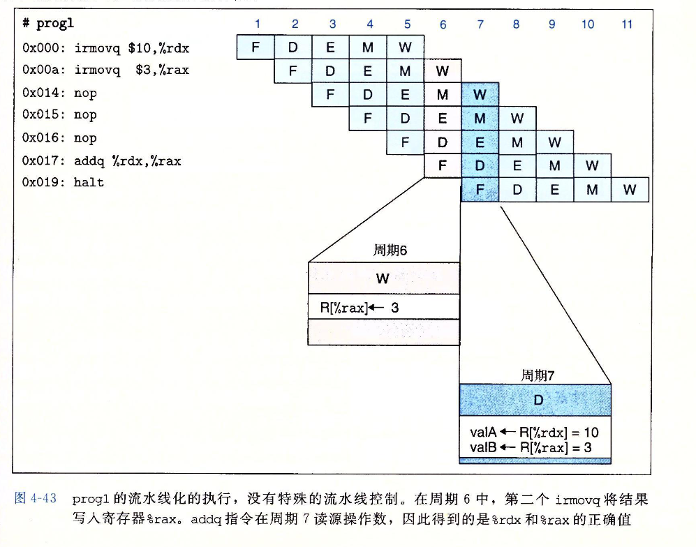

上图中，`irmovq` 与 `addq` 之间的数据相关没有造成数据冒险。但如果减少中间 `nop` 指令的数量，就会因为 `irmovq` 指令的结果**来不及在写回阶段写入寄存器文件**，而导致 `addq` 指令读到错误的值，从而产生数据冒险。

> 列举数据冒险的类型
> 对 Y86-64 而言，程序状态包括*程序寄存器、程序计数器、内存、条件码寄存器和状态寄存器*。
> - **程序寄存器**：由于之前指令的**写入阶段**尚未完成，导致当前指令读取到错误的值。
> - **程序计数器**：即控制冒险。当取指阶段的逻辑正确预测了程序计数器的新值时，就不会产生冒险。
> - **内存**：由于之前指令的**访存阶段**尚未完成，导致当前指令读取到错误的值。另外，在访存阶段中写数据的指令和**在取指阶段读指令**之间也可能有冲突。指令内存和数据内存处于同一个地址空间。这种情况发生在包含**自我修改代码**的程序中。我们假设程序不会自我修改。
> - **条件码寄存器**：**整数操作指令**在**执行阶段**写条件码寄存器。**条件传送指令**会在**执行阶段**、**条件转移指令**会在**访存阶段**读条件码寄存器。因此**不会发生冒险**。
> - **状态寄存器**：我们的设计中，流水线的每条指令都与一个状态码相关联。因此当异常发生时，处理器可以有条理地停止。
> 因此，我们只需要处理**寄存器数据冒险、控制冒险以及异常**。

#### 用暂停避免数据冒险

暂停（stalling）会使处理器暂停流水线中一条或多条指令的执行，直到冒险条件不再满足。让一条指令停顿在**译码阶段**，直到产生该指令源操作数的指令通过**写回阶段**，同时令**程序计数器保持不变**，就能避免数据冒险。

每次把一条指令阻塞在译码阶段时，就在**执行阶段**插入一个**气泡（bubble）**。气泡就像自动产生的 `nop`，它不改变程序状态。

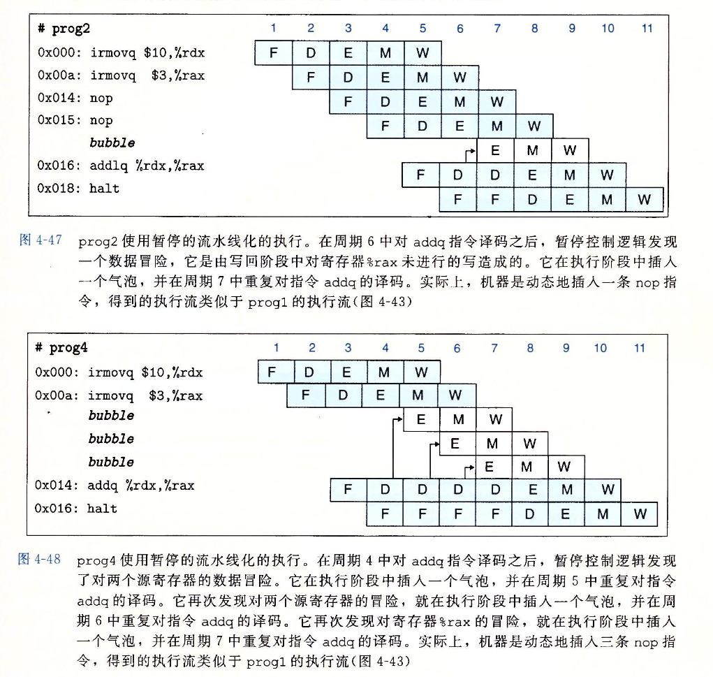

暂停机制易于实现，但性能很低。会触发暂停机制的汇编代码不胜枚举，流水线动辄暂停长达三个周期，严重降低了整体的吞吐量。


#### 用转发避免数据冒险

