[TOC]


# 信息的表示和处理

$\land $ 和 $\lor $ 有结合律：

$$(a\lor b)\lor c=a\lor (b\lor c)$$

$$(a\land b)\land c=a\land (b\land c)$$

$\land $ 和 $\lor $ 对彼此都有分配律：

$$a\land (b\lor c) = (a\land b)\lor (a\land c)$$

$$a\lor (b\land c) = (a\lor b)\land (a\lor c)$$

吸收律：

$$a\lor (a \land b)=(a\lor a)\land (a\lor b)=a$$

$$a\land  (a \lor b)=(a\land a)\lor (a\land b)=a$$

德摩根律：

$$\lnot  (a\land  b)=\lnot  a\lor \lnot  b$$

$$\lnot  (a \lor b)=\lnot  a\land   \lnot  b$$


异或有交换律和结合律：

$$a\oplus b=b\oplus a$$

$$a\oplus(b\oplus c)=(a\oplus b)\oplus c$$

所以

$$(a\oplus b)\oplus a=b\oplus(a\oplus a)=b\oplus 0=b$$  


```c++
// 利用异或的性质
// x == y 时会将 *x 和 *y 清零
void swap(int* x, int* y) {
    *y = *x ^ *y;
    *x = *x ^ *y;
    *y = *x ^ *y;
}
```

位运算的性质：

- 与 $1$ 异或：取补
- 与 $0$ 异或：保留

- 与 $1$ 与：保留
- 与 $0$ 与：置零

- 与 $1$ 或：置位
- 与 $0$ 或：保留

C 中的**移位**运算：
- 左移：丢弃最高 $k$ 位，低位补 $0$
- 逻辑右移（无符号数）：丢弃最低 $k$ 位，高位补 $0$
- 算术右移（一般有符号数）：丢弃最低 $k$ 位，高位补最高有效位

> 反码（Ones' Complement）：最高有效位的权是 $-(2^{\omega-1}-1)$ 而不是 $-2^{\omega-1}$。此时，$-x=\not x$
>
> 原码（Sign-Magnitude）：最高有效位是符号位。
>
> 这两种编码都存在正负 $0$ 的问题。

## 转换、扩展、截断

有符号数和无符号数的转换：数值可能改变，但**位模式不变**。

C 中，有符号数和无符号数运算时，会将有符号数转换为无符号数。

**扩展位表示**：
- 无符号数：**零扩展**（高位补 $0$）
- 补码：**符号扩展**（高位补最高有效位）

（$[1011]$ 和 $[111011]$ 都是 $-5$ 的补码表示）

```c
// 既有扩展 又有符号的转换
short sx = -12345;
// 从短补码转换到长无符号
unsigned uy = sx;
printf("uy = %u:\t", uy);
show_bytes((BytePtr)&uy, sizeof(unsigned));
// 输出：uy = 4294954951:    ff ff cf c7（大端）
// C 标准规定：先扩展，再转换符号
```

**截断**：直接丢弃高位
- 无符号数：模运算
- 补码：先模运算，然后再转补码

```c
// buggy
float sum_elements(float a[], unsigned len) {
    int i;
    float res = 0.0;
    for (i = 0; i <= len - 1; i++) 
        res += a[i];
    return res;
}
// hack: len = 0，造成死循环（内存错误）
// 改正：len 声明为 int，或循环条件改为 i < len
```

## 加法、求反

**无符号整数加法**：加，然后截断，即模数加法。溢出当且仅当 $s=(x+y) \mod 2^\omega<x$。如果溢出，则实际结果比真实值小 $2^\omega$。

```c
int uadd_ok(unsigned x, unsigned y) {
    return x + y >= x;
}
```

**无符号数的求反**：

$$-x=\begin{cases}
2^\omega-x, & x>0 \\
0, & x=0\end{cases}$$

补码加法：加，然后截断。负溢出：$x<0,y<0,z=x+y+2^\omega >0$；正溢出：$x>0,y>0,z=x+y-2^\omega <0$

补码加形成一个 Abel 群。

```c++
int buggy_tadd_ok(int x, int y) {
    int s = x + y;
    return (s - x == y) && (s - y == x);    // 永远返回 true
    // 正确做法：分别判断有无正溢出和负溢出
}

int buggy_tsub_ok(int x, int y) {
    return t_add_ok(x, -y); 
    // y == TMin 时，y == -y，函数出错
}
```

补码的求反：
$$-x=\begin{cases}
\operatorname{TMin}_\omega, & x=\operatorname{TMin}_\omega \\
-x, & x>\operatorname{TMin}_\omega
\end{cases}$$

计算补码非的技巧：
- $-x=\lnot x+1$：每位取反再加 $1$
- 找到最低的置 $1$ 位，对其左侧所有位求补


## 乘法

无符号乘法：乘，然后截断。

补码乘法：乘，然后截断。

补码乘法和无符号乘法同样具有位级等价性：完整的乘积的位级表示可能不同，但**截断后的乘积的位级表示是相同的**。

完整的位级表示不同，是因为溢出的位有**零扩展**和**符号扩展**两种方式。

```c++
// 检验补码乘法是否溢出
int tmult_ok(int x, int y) {
    int p = x * y;
    return !x || p/x == y;
}

int tmult_ok2(int x, int y) {
    int64_t pll = static_cast<int64_t>(x * y);  // 这里也要转换！
    return pll == static_cast<int>(pll);
}
```

```c
void* copy_elements(void* ele_src[], int ele_cnt, size_t ele_size) {
    // malloc 的参数是可能溢出的算术表达式
    // 一种可能的溢出情况是 malloc 分配了太少的空间
    // 导致下面的 for 循环破坏了缓冲区之外的内存
    void* res = malloc(ele_cnt * ele_size);
    if (!res) return NULL;
    void* next = res;
    for (int i = 0; i < ele_cnt; i++) {
        memcpy(next, ele_src[i], ele_size);
        next += ele_size;
    }
    return res;
}

    // 如果改成这样呢？
    uint64_t asize = ele_cnt * (uint64_t)ele_size;
    void* res = malloc(asize);
    // 完全没用
    // malloc 的参数类型是 size_t 还是一样溢出

    // malloc 压根不可能分配得出一个超过 size_t 范围的内存空间 
    // 直接拒绝分配即可
    uint64_t required_size = ele_cnt * (uint64_t)ele_size;
    size_t request_size = (size_t)required_size;
    if (request_size != required_size) return NULL;
    void* res = malloc(asize);
```

计算 $x * 14$：$14$ 的二进制表示为 $[1110]$，因此编译器可以将常数乘法优化为 `(x << 3) + (x << 2) + (x << 1)` 或 `(x << 4) - (x << 1)`（也可能不优化，直接用乘法指令计算）。


```c
int x, y;
unsigned ux = x, uy = y;

x + y == ux + uy;    // always true
x * y == ux * uy;    // always true
// 补码与其对应的无符号具有相同的位级表示
// 因此执行加法和截断乘法的结果是相同的
```

## 除法

整数除法总是向 $0$ 舍入，。

对于无符号数和补码，**向下舍入的** $x/2^k$ 总是等价于 $x>>k$（无符号数**逻辑右移**，补码**算术右移**）。右移导致向下舍入，是因为低位消失了。

通过**偏置（biasing）**，可以令负数除法向上舍入：$$\lceil x/2^k \rceil=(x + 2^k -1) >> k.$$ 

这是因为 $$\lceil x/y \rceil=\lfloor(x+y-1)/y\rfloor.$$ 

加上偏置就等价于“如果低 $k$ 位不是全 $0$，那么将结果向上进 $1$”


对于使用算术右移的补码机器，`(x < 0 ? x + (1 << k) - 1 : x) >> k` 将会计算 $x/2^k$

```c++
// 不使用除法/模运算/乘法/条件语句的除以16
int div16(int x) {
    // 诀窍：如果 x < 0，那么 x << 31 全 1
    // 否则 x << 31 全 0
    int bias = (x << 31) & 0xf;  // 掩码
    return (x + bias) >> 4;
}
```

无法用除以 $2$ 的幂的除法的组合表示除以任意常数的除法。


## 浮点

IEEE 浮点表示

$V=(-1)^s \times M \times 2^E$
- 符号（sign）：$s$
- 尾数（significand）：$M$ 是一个二进制小数，范围是 $1 \sim 2-\varepsilon$（规格化）或 $0 \sim 1-\varepsilon$（非规格化）
- 阶码（exponent）：$E$ 对浮点数加权

浮点数的格式：
- `float`：$1$ 位的 `s`，$8$ 位的 `exp`，$23$ 位的 `frac`
- `double`：$1$ 位的 `s`，$11$ 位的 `exp`，$52$ 位的 `frac`

浮点数的值：

- 规格化的值：**当 `exp` 既不是全 $0$，也不是全 $1$ 时**。阶码值 $E=e-\operatorname{Bias}$。小数字段 `frac` 为二进制小数 $f=0.f_{n-1}\cdots f_1f_0$ 的值，尾数 $M=f+1$（隐含的以 1 开头表示，白得一个额外的精度位）

    - $\operatorname{Bias}=2^{k-1}-1$（单精度 $k=8, \operatorname{Bias}=127$，双精度 $k=11, \operatorname{Bias}=1023$）。

    - $E$ 的范围 $-126\sim 127$ 或 $-1022\sim 1023$。

- 非规格化的值：**当阶码域 `exp` 全 $0$ 时**。阶码值 $E=1-\operatorname{Bias}$，尾数 $M=f$，不包含隐含的 1. 
- 特殊值：**当阶码全为 $1$ 时**。若小数域全 $0$，则得到 $+\infin$ 或 $-\infin$，否则得到 NaN.

为什么要有非规格化的值？规格化的值无法表示 $0.0$，以及 $0$ 附近的极小值。引入非规格化的值可以平滑地表示 $+0.0$、$-0.0$ 以及非常接近于 $0$ 的数（gradual underflow）。

为什么要去掉尾数中的隐含 $1$？为了表示 $0.0$ 以及 $0.0$ 附近的数。

为什么要特别令阶码 $E=1-\operatorname{Bias}$，而不是直接取 $E=-\operatorname{Bias}$？为了过渡更平滑。


浮点数的范围：
|      描述      |     `exp`     |    `frac`     |                      单精度值                       |                       双精度值                        |
| :------------: | :-----------: | :-----------: | :-------------------------------------------------: | :---------------------------------------------------: |
|       0        | $00\cdots 00$ | $00\cdots 00$ |                        $0.0$                        |                         $0.0$                         |
| 最小非规格化数 | $00\cdots 00$ | $00\cdots 01$ |     $2^{-23}\times 2^{-126}=1.4\times 10^{-45}$     |     $2^{-52}\times 2^{-1022}=4.9\times 10^{-324}$     |
| 最大非规格化数 | $00\cdots 00$ | $11\cdots 11$ | $(1-\varepsilon)\times 2^{-126}=1.2\times 10^{-38}$ | $(1-\varepsilon)\times 2^{-1022}=2.2\times 10^{-308}$ |
|  最小规格化数  | $00\cdots 01$ | $00\cdots 00$ |       $1.0\times 2^{-126}=1.2\times 10^{-38}$       |       $1.0\times 2^{-1022}=2.2\times 10^{-308}$       |
|       1        | $01\cdots 11$ | $00\cdots 00$ |                        $1.0$                        |                         $1.0$                         |
|  最大规格化数  | $11\cdots 10$ | $11\cdots 11$ |  $(2-\varepsilon)\times 2^{127}=3.4\times 10^{38}$  |  $(2-\varepsilon)\times 2^{1023}=1.8\times 10^{308}$  |


$12345$ 具有二进制表示 $11000000111001$，小数点左移 $13$ 位得 $1.1000000111001_2 \times 2^{13}$，丢弃开头的 $1$ ，并在末尾添加 $10$ 个 $0$，得小数字段 $[10000001110010000000000]$。阶码为 $13+127=140=[10001100]$，加上符号位的 $0$，就得到浮点表示 $[0\ 10001100\ 10000001110010000000000]$.

浮点数的舍入：向偶数舍入。“正中间”的值（也就是形如 $Y100\ldots$ 的值，$Y$ 为要舍入到的位）向偶数（$Y=0$ 时去尾，$Y=1$ 时进位）舍入，不是“正中间”的值向最接近的数舍入。例如将一下数字舍入到最接近的二分之一：
- $10.010_2 : 10.0$
- $10.011_2 : 10.1$
- $10.110_2 : 11.0$
- $11.001_2 : 11.0$

浮点加法和乘法：可交换，但**不可结合**，乘法对加法**没有分配律**。

浮点加法**有单调性**：若 $a \geq b$ 且 $a, b, x \neq NaN$，则 $x+a\geq x+b$. 乘法同理.

在 C 语言中：
- `int` -> `float`：不会溢出，可能被舍入（向 0 舍入）
- `int` 或 `float` -> `double`：保留精确的数值
- `double` -> `float`：可能溢出成 $+\infin$ 或 $-\infin$，也可能被舍入
- `float` 或 `double` -> `int`：向 0 舍入，可能会溢出（此时的值标准未指定，Intel 指定了**整数不确定**值 $\operatorname{TMin}_\omega$）

## Datalab

```c++
int isTmax(int x) {
    // Tmax = 0x7fffffff
    int k = x + x + 2;    // 利用溢出是 UB
    int s1 = !k;
    int s2 = !!(x + 1);
    return s1 & s2;    // x = 0x7fffffff 时，-O0 返回1 -O1 返回0
}
```

若 `y = 0x7fffffff`，则 `~y == y + 1`。又因为补码有：`~y = -y - 1`，联立可知只需要排除 `-1` 即可。通过溢出凑 `0` 的判断方法和编译器行为有关，使用**异或判等**：`x^x == 0`。

```c
int isTmax(int x) {
    return !(~x ^ (x + 1)) & !!(x + 1);
}
```

```c
int howManyBits(int x) {
    // 其实就是返回 最高有效位+1 因此负数和正数是一样的
    // 用二分法找
    int t = x ^ (x >> 31);    // 负数取反 正数不变
    int z = ~!t + 1;    // z = t == 0 ? 0xffffffff : 0x0
    int b16, b8, b4, b2, b1;
    b16 = (!(!(t >> 16))) << 4;    // 高16位非空 ? 16 : 0
    t = t >> b16;
    b8 = !(!(t >> 8)) << 3;
    t = t >> b8;
    b4 = !(!(t >> 4)) << 2;
    t = t >> b4;
    b2 = !(!(t >> 2)) << 1;
    t = t >> b2;
    b1 = !(!(t >> 1));
    // t = 0 需要特判 
    return ((b1 + b2 + b4 + b8 + b16 + 2) & ~z) | (1 & z);
}
```

```c
// 计算 x 的前导 0
// w 的作用在于处理 x == 0 的边界情况
int nlz(unsigned x) {
    double w = 0.5;    // [0.5, 1)
    double y = (double) x + w;
    long long z;
    memcpy(&z, &y, sizeof(y));
    return ____ - (z >> __);
}
```
先讨论 `x` 非零的情况：
利用整数转换为浮点数时的规则，设前导 `0` 有 `k` 个，则 $32 - k - 1 = E = e - Bias$，而 `e == (z >> 52)`，因此 `k == 1054 - (z >> 52)`.

再讨论 `x` 为零的情况，此时需要保证 `w` 的阶码位为 `0111 1111 110`，因此 $[0.5,1)$ 的双精度浮点数都满足要求。


# 程序的机器级表示


> 我们采用 ATT 格式汇编代码，它是 gcc、objdump 等工具的默认格式。微软和 Intel 使用 Intel 格式汇编，其主要区别在于
> - 省略了指示大小的后缀：`mov` `push` `pop`
> - 省略了寄存器前的 `%`
> - 内存引用：`QWORD PTR [rbx]`
> - 操作数顺序相反


## 数据格式

|      C 声明      | Intel 数据类型 | 汇编代码后缀 | 大小（字节） |
| :--------------: | :------------: | :----------: | :----------: |
|      `char`      |      字节      |     `b`      |      1       |
|     `short`      |       字       |     `w`      |      2       |
|      `int`       |      双字      |     `l`      |      4       |
|      `long`      |      四字      |     `q`      |      8       |
| `char *`（指针） |      四字      |     `q`      |      8       |
|     `float`      |     单精度     |     `s`      |      4       |
|     `double`     |     双精度     |     `l`      |      8       |

## 访问信息

### 寄存器

x86-64 的 CPU 包含一组 16 个存储 64 位值的**通用目的寄存器**。

| 四字（64位） | 双字（32位） | 字（16位） | 字节（8位） |     用途     |
| :----------: | :----------: | :--------: | :---------: | :----------: |
|    `%rax`    |    `%eax`    |   `%ax`    |    `%al`    |    返回值    |
|    `%rbx`    |    `%ebx`    |   `%bx`    |    `%bl`    | 被调用者保存 |
|    `%rcx`    |    `%ecx`    |   `%cx`    |    `%cl`    | 第 4 个参数  |
|    `%rdx`    |    `%edx`    |   `%dx`    |    `%dl`    | 第 3 个参数  |
|    `%rsi`    |    `%esi`    |   `%si`    |   `%sil`    | 第 2 个参数  |
|    `%rdi`    |    `%edi`    |   `%di`    |   `%dil`    | 第 1 个参数  |
|    `%rbp`    |    `%ebp`    |   `%bp`    |   `%bpl`    | 被调用者保存 |
|    `%rsp`    |    `%esp`    |   `%sp`    |   `%spl`    |    栈指针    |
|    `%r8`     |    `%r8d`    |   `%r8w`   |   `%r8b`    | 第 5 个参数  |
|    `%r9`     |    `%r9d`    |   `%r9w`   |   `%r9b`    | 第 6 个参数  |
|    `%r10`    |   `%r10d`    |  `%r10w`   |   `%r10b`   |  调用者保存  |
|    `%r11`    |   `%r11d`    |  `%r11w`   |   `%r11b`   |  调用者保存  |
|    `%r12`    |   `%r12d`    |  `%r12w`   |   `%r12b`   | 被调用者保存 |
|    `%r13`    |   `%r13d`    |  `%r13w`   |   `%r13b`   | 被调用者保存 |
|    `%r14`    |   `%r14d`    |  `%r14w`   |   `%r14b`   | 被调用者保存 |
|    `%r15`    |   `%r15d`    |  `%r15w`   |   `%r15b`   | 被调用者保存 |

任何为寄存器生成 32 位值的指令都会把目的寄存器的高 32 位清零。

### 操作数格式

|  类型  |              格式               |                    操作数值                    |     名称     |
| :----: | :-----------------------------: | :--------------------------------------------: | :----------: |
| 立即数 |    $$ \$\operatorname{Imm}$$    |              $\operatorname{Imm}$              |  立即数寻址  |
| 寄存器 |              $r_a$              |                    $R[r_a]$                    |  寄存器寻址  |
| 存储器 | $\operatorname{Imm}(r_b,r_i,s)$ | $M[\operatorname{Imm} +R[r_b]+R[r_i]\times s]$ | 比例变址寻址 |

比例因子 $s$ 必须是 $1, 2, 4, 8$ 中的一个，因此 `(, %rax, 3)` 不合法。

在 64 位机器上，地址总是 64 位的，因此像 `(%eax)` 这样的操作数很有可能是错误的。我们认为它不合法

### 数据传送指令

MOV 类指令把数据从源位置复制到目的位置。MOV 类指令包括：
- `movb`：字节
- `movw`：字
- `movl`：双字，会将目的寄存器的高 32 位清零
- `movq`：四字，

常规的 `movq` 指令只能以**表示 32 位补码的立即数作为源操作数**，把这个值**符号扩展**得到 64 位的值，放到目的位置。
`movabsq` 指令**只能以任意 64 位立即数值作为源操作数**，且**只能以寄存器作为目的位置**。

x86-64 限制传送指令的**两个操作数不能都指向内存位置**（只能为 内存 -> 寄存器 -> 内存 的形式）。

```x86asm
movl $0x4050,%eax       ; Imm -> Reg
movw %bp,%sp            ; Reg -> Reg
movb (%rdi,%rcx),%al    ; Mem -> Reg
movb $-17,(%rsp)        ; Imm -> Mem
movq %rax,-12(%rbp)     ; Reg -> Mem
```

MOVZ 类和 MOVS 类将较小的源值复制到较大的目的位置。MOVZ 类指令执行**零扩展**，MOVS 类指令执行**符号扩展**。这些指令的目的位置**必须是寄存器**。

- `movzbq`：字节 -> 四字（零扩展）
- `movzbl`：字节 -> 双字（零扩展），隐式地将目的寄存器的高 32 位清零
- `movzwl`：字 -> 双字（零扩展），隐式地将目的寄存器的高 32 位清零
- `movzbq`：字节 -> 四字（零扩展）
- `movzwq`：字 -> 四字（零扩展）
- 没有 `movzlq`

- `movsbw`：字节 -> 字（符号扩展）
- `movsbl`：字节 -> 双字（符号扩展），隐式地将目的寄存器的高 32 位清零
- `movswl`：字 -> 双字（符号扩展），隐式地将目的寄存器的高 32 位清零
- `movsbq`：字节 -> 四字（符号扩展）
- `movswq`：字 -> 四字（符号扩展）
- `movslq`：双字 -> 四字（符号扩展）
- `cltq`：`%eax` -> `%rax`（符号扩展）

为什么没有 `movzlq`？因为不同于 `movb` 和 `movw`，`movl` 会把高位的字节置 0，因此不需要双字到四字的零扩展。

`movzbq` 经常被 `movzbl` 替代，因为 `movzbl` 的编码更短。`movzwl` 和 `movzwq` 也是如此。

`cltq` 无操作数，完全等价于 `movslq %eax,%rax`，但编码更紧凑。

示例：

```c
src_t* sp;
dest_t* dp;

*dp = (dest_t) *sp;
```

假设 `sp` 和 `dp` 分别存储在寄存器 `%rdi` 和 `%rsi` 中，对于 `src_t` 和 `dest_t` 的各种情况，给出数据传送的两条指令。第一条从内存中读数，做适当转换，把结果写到寄存器 `%rax` 的适当部分；第二条把 `%rax` 的适当部分写到内存。

|     `src_t`     |  `dest_t`  |      第一条指令      |     第二条指令     |   注释   |
| :-------------: | :--------: | :------------------: | :----------------: | :------: |
|     `long`      |   `long`   |  `movq (%rdi),%rax`  | `movq %rax,(%rsi)` |
|     `char`      |   `int`    | `movsbl (%rdi),%eax` | `movl %eax,(%rsi)` | 符号扩展 |
|     `char`      | `unsigned` | `movsbl (%rdi),%eax` | `movl %eax,(%rsi)` | 符号扩展 |
|     `char`      |  `short`   | `movsbw (%rdi),%ax`  | `movw %ax,(%rsi)`  | 符号扩展 |
| `unsigned char` |   `long`   | `movzbq (%rdi),%rax` | `movq %rax,(%rsi)` |  零扩展  |
|      `int`      |   `char`   |  `movl (%rdi),%eax`  | `movb %al,(%rsi)`  |   截断   |

x86-64 的 `char` 是有符号的。扩展时采用符号扩展还是零扩展，**取决于 `src_t` 是否为有符号表示**。这是因为 C 语言在类型转换时**先扩展，再转换符号**，即若 `ch` 类型为 `char`，则`(unsigned) ch` 等价于 `(unsigned) (int) ch`。


### 压入和弹出栈数据

- `pushq Src`：等价于 `subq $8, %rsp`  `movq Src, (%rsp)`
- `popq Dest`：等价于 `movq (%rsp), Dest`  `addq $8, %rsp`

**`pushq` 先减栈指针，后压栈；`popq` 先弹栈，后加栈指针**。

栈指针 `%rsp` 保存着**栈顶元素的地址**。

`pushq %rsp` 将会把 `%rsp` 的旧值压栈，然后将它减 $8$。

`popq %rsp` 将会把栈顶元素弹出到 `%rsp`。


## 算术和逻辑操作

## `leaq`、一元操作、二元操作、移位操作

`leaq` （load effective address）指令是 `movq` 的变形。`leaq S, D` 将把 `S` 作为一个有效地址（而不是它的内容）复制到 `D`。

`leaq 7(%rdx, %rdx, 4), %rax` 设置 `%rax` 的值为 `5 * %rdx + 7`。

**`leaq` 的目的操作数必须是寄存器，`leaq` 没有其他大小的变种**。

- `INC Dest`：加 1
- `DEC Dest`：减 1
- `NEG Dest`：取负
- `NOT Dest`：取补

以上四个一元操作中，**`Dest` 可以是寄存器或内存位置**

- `ADD Src, Dest`：加
- `SUB Src, Dest`：减
- `IMUL Src, Dest`：乘
- `XOR Src, Dest`：异或
- `OR Src, Dest`：或
- `AND Src, Dest`：与

以上二元操作中，**第一个操作数可以是立即数、寄存器或内存位置，第二个操作数可以是寄存器或内存位置**。第二个操作数既是源又是目的位置，例如 `subq %rax, %rdx` 就相当于 `%rdx -= %rax`。

- `SAL k, Dest`：左移
- `SHL k, Dest`：左移（等同于 `SAL`）
- `SAR k, Dest`：算术右移（补码）
- `SHR k, Dest`：逻辑右移（无符号数）

移位操作中，**第一个操作数（移位量 `k`）可以是立即数或者单字节寄存器 `%cl`**。

x86-64 中，移位量是**由 `%cl` 寄存器的低位给出**的。即，若 `%cl` 的值为 `0xFF`，则 `salb %cl, %rax` 会将 `%rax` 的值左移 $7$ 位，`salw` 会移 $15$ 位，`sall` 会移 $31$ 位，而 `salq` 会移 $63$ 位。


以上指令中，除了右移指令要求区分补码和无符号数以外，其他指令都不区分补码和无符号数。**这是补码的优点：兼容无符号数**。

### 特殊的算术操作

x86-64 有限地支持 128 位数操作，它们被称为**八字（oct word）**

`imulq Src`：将 `Src` 和 `%rax` 做**补码乘法**，结果的**高 64 位存放在 `%rdx` 中，低 64 位存放在 `%rax` 中**。`Src` 可以是立即数、寄存器或内存位置。

`mulq Src`：将 `Src` 和 `%rax` 做**无符号数乘法**，结果的**高 64 位存放在 `%rdx` 中，低 64 位存放在 `%rax` 中**。`Src` 可以是立即数、寄存器或内存位置。

`cqto`：将 `%rax` 符号扩展到 128 位，扩展出的高 64 位存放在 `%rdx` 中。

`idivq Src`：`%rdx`（高 64 位）和 `%rax`（低 64 位）组成的 128 位数是被除数，`Src` 是除数，将它们**补码除法**的**商放在 `%rax` 中，余数放在 `%rdx` 中**。

`divq Src`：`%rdx`（高 64 位）和 `%rax`（低 64 位）组成的 128 位数是被除数，`Src` 是除数，将它们**无符号除法**的**商放在 `%rax` 中，余数放在 `%rdx` 中**。


> 上一节介绍了 `imulq` 的双操作数形式：`imulq Src，Dest`。注意到**乘积被截断为 64 位后，无符号乘法和补码乘法的结果是一样的**，因此 64 位乘法指令不区分无符号和补码。

在 Intel 文档里，`cqto` 叫做 `cqo`。


```c
void remdiv(long x, long y, long* qp, long* rp) {
    long q = x / y;
    long r = x % y;
    *qp = q;
    *rp = r;
}

// x86asm
; void remdiv(long x, long y, long* qp, long* rp)
; x in %rdi, y in %rsi, qp in %rdx, rp in %rcx
remdiv:
    movq    %rdx, %r8       // save rdx for idivq
    movq    %rdi, %rax      
    cqto
    idivq   %rsi            
    movq    %rax, (%r8)   
    movq    %rdx, (%rcx)
    ret
```


## 控制

常用的条件码（condition code）：
- `CF`：进位标志。最近的操作使**最高位产生了进位**。可用于检查**无符号数的溢出**。
- `ZF`：零标志。最近的操作结果为 0.
- `SF`：符号标志。最近的操作结果为负数。
- `OF`：溢出标志。最近的操作导致**补码溢出**。

它们被保存在 CPU 的一组单个位的条件码寄存器里。

`leaq` 不会改变任何条件码。

除此之外，所有的算术和逻辑指令（`INC` `DEC` `NEG` `NOT` `ADD` `SUB` `IMUL` `XOR` `OR` `AND` `SAL` `SHL` `SAR` `SHR`）都会更新条件码。

逻辑操作的**进位标志 CF**和**溢出标志 OF**会被置 0.

移位操作的**进位标志 CF**会被设置为**最后一个被移出的位**，**溢出标志 OF**会被设置为 0。**右移也会改变进位标志**

`INC` `DEC` 指令会设置**溢出标志 OF**和**零标志 ZF**，但不会改变**进位标志 CF**。

`CMP` 指令和 `TEST` 指令只设置条件码，不改变其他寄存器。

`CMP S1, S2` 等价于 `SUB S1, S2`，而 `TEST S1, S2` 等价于 `AND S1, S2`。区别在于它们不会改变 `S2` 的值。


### 访问条件码

`SET` 指令根据条件码的某种组合设置一个字节的值。

|   指令    |  同义名  |   条件码组合   |        设置条件         |
| :-------: | :------: | :------------: | :---------------------: |
| `sete D`  |  `setz`  |      `ZF`      |        相等 / 零        |
| `setne D` | `setnz`  |     `~ZF`      |       不等 / 非零       |
| `sets D`  |          |      `SF`      |           负            |
| `setns D` |          |     `~SF`      |          非负           |
| `setg D`  | `setnle` | `~(SF^OF)&~ZF` |    大于（有符号 >）     |
| `setge D` | `setnl`  |   `~(SF^OF)`   |  大于等于（有符号 >=）  |
| `setl D`  | `setnge` |    `SF^OF`     |    小于（有符号 <）     |
| `setle D` | `setng`  |    `(SF^OF)    |           ZF`           | 小于等于（有符号 <=） |
| `seta D`  | `setnbe` |   `~CF&~ZF`    |    超过（无符号 >）     |
| `setae D` | `setnb`  |     `~CF`      | 超过或相等（无符号 >=） |
| `setb D`  | `setnae` |      `CF`      |    低于（无符号 <）     |
| `setbe D` | `setna`  |    `CF\|ZF`    | 低于或相等（无符号 <=） |

有符号比较使用 `SF` 和 `OF` 条件码，无符号比较使用 `CF` 和 `ZF` 条件码。

**`set D` 中的目标位置 `D` 必须是单字节寄存器**。

```c
int comp(data_t a, data_t b)

// x86-64 asm
a in %rdi, b in %rsi
comp:
    cmpq    %rsi, %rdi    // cmpq b, a
    setl    %al           // if (a < b), %al = 1; else %al = 0
    movzbl  %al, %eax     // 和 movzbq %al, %rax 相同
    ret
```

### 跳转指令


|      指令      | 同义名 |    跳转条件    |          描述           |
| :------------: | :----: | :------------: | :---------------------: |
|  `jmp Label`   |        |       1        |        直接跳转         |
| `jmp *Operand` |        |       1        |        间接跳转         |
|   `je Label`   |  `jz`  |      `ZF`      |        相等 / 零        |
|  `jne Label`   | `jnz`  |     `~ZF`      |       不等 / 非零       |
|   `js Label`   |        |      `SF`      |           负            |
|  `jns Label`   |        |     `~SF`      |          非负           |
|   `jg Label`   | `jnle` | `~(SF^OF)&~ZF` |    大于（有符号 >）     |
|  `jge Label`   | `jnl`  |   `~(SF^OF)`   |  大于等于（有符号 >=）  |
|   `jl Label`   | `jnge` |    `SF^OF`     |    小于（有符号 <）     |
|  `jle Label`   | `jng`  | `(SF^OF)\|ZF`  |  小于等于（有符号 <=）  |
|   `ja Label`   | `jnbe` |   `~CF&~ZF`    |    超过（无符号 >）     |
|  `jae Label`   | `jnb`  |     `~CF`      | 超过或相等（无符号 >=） |
|   `jb Label`   | `jnae` |      `CF`      |    低于（无符号 <）     |
|  `jbe Label`   | `jna`  |    `CF\|ZF`    | 低于或相等（无符号 <=） |

- 直接跳转：`jmp .L1` 跳转目标是作为指令的一部分编码的
- 间接跳转：`jmp *%rax` `jmp *(%rax)` 跳转目标从寄存器或内存中读出

**无条件跳转可以是直接跳转，也可以是间接跳转**。

**条件跳转只能是直接跳转**。

跳转指令有几种不同的编码，最常用的是 PC 相对（PC-relative）的，其次是给出“绝对”地址。一般只会在很大（> 2 MB）的程序中使用绝对寻址。

PC 相对的机器代码会将**目标指令的地址**与**紧跟在跳转指令之后的指令的地址**之间的差作为目标的编码，这些地址偏移量可以编码为 1, 2 或 4 字节。

```c
// PC-relative 编码示例：
// 这是链接前的 .o 文件反汇编的结果
// 链接后 地址 8 会被填写为 4004d8 但 jmp 的编码不变

0:    48 89 f8    mov    %rdi, %rax
// 地址 0x8 被编码为 03，表示下一条指令的地址 0x5 + 0x3
3:    eb 03       jmp    8 <loop+0x8>
5:    48 d1 f8    sar    %rax
8:    48 85 c0    test   %rax, %rax
// 同理，0x5 = 0xd + 0xf8 = 13 - 8 = 0x5
b:    7f f8       jg     5 <loop+0x5>
d:    f3 c3       repz retq
```

“绝对”地址的编码直接用 4 个字节指定目标。

当执行 PC 相对寻址时，程序计数器的值是跳转指令的后一条指令的地址。这与 CPU 的早期实现有关。当时的 CPU 将更新 PC 的值作为执行指令的第一步。通过使用 PC 相对寻址，指令的编码可以很简洁，且目标代码可以在链接过程中不做改变。

> `repz` 是 `rep` 的同义名，而 `retq` 是 `ret` 的同义名。此处的 `rep` 是一种空操作，避免 AMD 处理器的一个缺陷：当通过 JMP 指令跳转到 `ret` 时，处理器不能正确预测 `ret` 的目的。 

### 用条件控制来实现条件分支

```c
// C 中的 if-else
if (test-expr) 
    then-statement
else 
    else-statement

// 通常的汇编实现
    t = test-expr
    if (!t)
        goto false;
    then-statement
    goto done;
false:
    else-statement
done:

// 为什么判断的是 !t，而不是 t？
// 如果判断 t：
    t = test-expr
    if (t)
        goto true;
    else-statement
    goto done;
true:
    then-statement
done:

// 对于无 else 的 if：
// 通常版本：
    t = test-expr
    if (!t)
        goto done;
    then-statement
done:

// 改后版本：
    t = test-expr
    if (t)
        goto true;
    goto done;
true:
    then-statement
done:

// 因此，判断 !t 的通常写法可以省一个 goto，性能更好
```

### 条件传送

数据的条件转移计算一个条件操作的两种结果，然后根据条件是否满足从中选取一个。这种操作**无法完全替代跳转指令**，但更符合现代处理器的性能特性。它可以用一条条件传送指令实现。

```c
long absdiff(long x, long y) {
    long res;
    if (x < y) 
        res = y - x;
    else
        res = x - y;
    return res;
}

// 条件传送的等价 C 代码：
long cmovdiff(long x, long y) {
    long rval = y - x;
    long eval = x - y;
    long ntest = x >= y;
    if (ntest) rval = eval;
    return rval;
}

// x86-64 asm
long absdiff(long x, long y)
x in %rdi, y in %rsi
absdiff:
    movq   %rsi, %rax    // %rax = y
    subq   %rdi, %rax    // %rax = y - x
    movq   %rdi, %rdx
    subq   %rsi, %rdx    // %rdx = x - y
    cmpq   %rsi, %rdi
    cmovge %rdx, %rax    // if (x >= y) rval = eval
    ret
```

|     指令      |  同义名   |    传送条件    |          描述           |
| :-----------: | :-------: | :------------: | :---------------------: |
| `cmove S, R`  |  `cmovz`  |      `ZF`      |        相等 / 零        |
| `cmovne S, R` | `cmovnz`  |     `~ZF`      |       不等 / 非零       |
| `cmovs S, R`  |           |      `SF`      |           负            |
| `cmovns S, R` |           |     `~SF`      |          非负           |
| `cmovg S, R`  | `cmovnle` | `~(SF^OF)&~ZF` |    大于（有符号 >）     |
| `cmovge S, R` | `cmovnl`  |   `~(SF^OF)`   |  大于等于（有符号 >=）  |
| `cmovl S, R`  | `cmovnge` |    `SF^OF`     |    小于（有符号 <）     |
| `cmovle S, R` | `cmovng`  |    `(SF^OF)    |           ZF`           | 小于等于（有符号 <=）   |
| `cmova S, R`  | `cmovnbe` |   `~CF&~ZF`    |    超过（无符号 >）     |
| `cmovae S, R` | `cmovnb`  |     `~CF`      | 超过或相等（无符号 >=） |
| `cmovb S, R`  | `cmovnae` |      `CF`      |    低于（无符号 <）     |
| `cmovbe S, R` | `cmovna`  |      `CF       |           ZF`           | 低于或相等（无符号 <=） |

条件传送指令的**源操作数可以是寄存器或内存地址**，**目的操作数必须是寄存器**

**源和目的的值必须是 16、32 或 64 位长，条件传送指令没有单字节版本**。

无条件指令的操作数长度显式编码在指令名中（如 `movw`）；对于条件传送指令，汇编器可以从目标寄存器推断操作数长度，因此不需要在指令名中显式指定。

和条件传送（JMP）不同，处理器无需预测测试的结果就可以执行条件传送。

```c
// 示例：cmov 和 jmp 的区别：

// 考虑以下 C 代码：
    v = test-expr ? then-expr : else-expr;

// 若编码为跳转指令，等价的 C 代码为：
    if (!test-expr)
        goto false;
    v = then-expr
    goto done;
false:
    v = else-expr
done:
// then-expr 和 else-expr 中只有一个会被求值

// 若编码为 cmov：
    v = then-expr;
    ve = else-expr;
    if (!test-expr)
        v = ve;
// then-expr 和 else-expr 都会被求值
```

如果求值**包含错误或副作用**，如 `return (ptr ? *ptr : 0);` 就必须用分支代码编译，否则会出现间接引用空指针的错误。

**如果 `then-expr` 或 `else-expr` 计算很复杂**，那么用条件传送指令实现可能反而降低性能。


### 循环

#### `do-while`

```c
do {
    body-statement
} while (test-expr);

// 会被编译成

loop:
    body-statement
    if (test-expr)
        goto loop;

```

#### `while`

```c
while (test-expr)
    body-statement

// 会被编译成

// 1. jump to middle
// 在 do-while 语句汇编代码的开头加上了 goto test
    goto test;
loop:
    body-statement
test:
    if (test-expr)
        goto loop;

// 2. guarded-do
// 在 do-while 语句汇编代码的开头加了一次 !test-expr 的判断
// 当初始条件被认为恒真时，guarded-do 开头的条件检查可以被优化掉，少一次 goto，性能更好
    if (!test-expr)
        goto done;
loop:
    body-statement
    if (test-expr)
        goto loop;
done:
```

优化等级较高时，gcc 会生成 guarded-do 的代码。

```c
// 示例
long fact_while(long n) {
    long res = 1;
    while (n > 1) {
        res *= n;
        n -= 1;
    }
    return res;
}

// x86asm-like c
long fact_while_jm_goto(long n) {
    long res = 1;
    goto test;
loop:
    res *= n;
    n -= 1;
test:
    if (n > 1)
        goto loop;
    return res;
}

// x86asm-like c
long fact_while_gd_goto(long n) {
    long res = 1;
    if (n <= 1)
        goto done;
loop:
    res *= n;
    n -= 1;
    if (n != 1)    // 条件被优化成 !=
        goto loop;
done:
    return res;
}
```


#### `for`

```c
for (init-expr; test-expr; update-expr)
    body-statement
// 一定程度上相当于
init-expr;
while (test-expr) {
    body-statement
    update-expr;
}
```

`for` 和以上 `while` 转写的区别：

```c
for (init-expr; test-expr; update-expr) {
    // ...
    continue;
    // ...
}

// 并不等价于
init-expr;
while (test-expr) {
    // ...
    continue;
    // ...
    update-expr;    // will be jumped over by continue! 
}
```

gcc 为 `for` 循环生成的代码是 `while` 循环的两种翻译之一，这取决于优化等级。因此 `for` 循环对应的 x86asm-like c 代码为：

```c
// jump to middle
    init-expr;
    goto test;
loop:
    body-statement
    update-expr;
test:
    if (test-expr)
        goto loop;

// guarded-do
    init-expr;
    if (!test-expr)
        goto done;
loop:
    body-statement
    update-expr;
    if (test-expr)
        goto loop;
done:
```

### `switch`

跳转表（jump table）是一个数组，表项 `i` 是*开关索引值为 `i` 时对应的*代码段的地址。和使用一大堆 `if-else` 语句相比，**跳转表的优点是执行 `switch` 语句的用时与开关情况数量无关**，即它是 $O(1)$ 的。

gcc 根据开关情况的数量和稀疏程度决定是否使用跳转表。开关情况较多、值的范围较密，gcc 就会使用跳转表。

```c
// c 中的一个 switch 语句
// 101 和 105 没有标号
// 有的情况有多个标号：104, 106
// 有的情况会 fall through：102
void switch_eg(long x, long n, long* dest) {
    long val = x;
    switch (n) {
        case 100:
            val *= 13;
            break;
        case 102:
            val += 100; /* Fall through */
        case 103:
            val += 11;
            break;
        case 104:
        case 106:
            val *= val;
            break;
        default:
            val = 0;
    }
    *dest = val;
}

// x86asm-like c
// Case 100: loc_A
// Case 101: loc_def
// Case 102: loc_B (Fall through)
// Case 103: loc_C
// Case 104: loc_D
// Case 105: loc_def
// Case 106: loc_D
void switch_eg_impl(long x, long n, long* dest) {
    static void* jt[7] = {
        &&loc_A, &&loc_def, &&loc_B, &&loc_C,
        &&loc_D, &&loc_def, &&loc_D
    };    // 跳转表，gcc 扩展语法

    unsigned long index = n - 100;
    long val;

    if (index > 6)
        goto loc_def;

    goto *jt[index];    // computed goto, gcc 扩展语法

loac_A:    /* Case 100 */
    val = x * 13;
    goto done;
loc_B:     /* Case 102 */
    x += 10;
    /* Fall through */
loc_C:     /* Case 103 */
    val = x + 11;
    goto done;
loc_D:     /* Cases 104, 106 */
    val = x * x;
    goto done;
loc_def:   /* Default case */
    val = 0;
done:
    *dest = val;
}

// x86-64
x in %rdi, n in %rsi, dest in %rdx
switch_eg:
    subq    $100, %rsi
    cmpq    $6, %rsi
    ja      .L8
    jmp     *.L4(,%rsi,8)  // 8 表示每个表项占 8 字节
.L3:
    leaq    (%rdi,%rdi,2), %rax
    leaq    (%rdi,%rax,4), %rdi
    jmp     .L2
.L5:
    addq    $10, %rdi
.L6:
    addq    $11, %rdi
    jmp     .L2
.L7:
    imulq   %rdi, %rdi
    jmp     .L2
.L8:
    movl    $0, %edi
.L2:
    movq    %rdi, (%rdx)
    ret

// 跳转表
    .section    .rodata    // read-only data
    .align 8       // 8 字节对齐地址
.L4:
    // 以下是 7 个四字 值为目标地址
    .quad   .L3    // case 100: loc_A
    .quad   .L8    // case 101: loc_def
    .quad   .L5    // case 102: loc_B 
    .quad   .L6    // case 103: loc_C
    .quad   .L7    // case 104: loc_D
    .quad   .L8    // case 105: loc_def
    .quad   .L7    // case 106: loc_D
```

## 过程

过程 P 调用过程 Q，Q 执行后返回到 P。这些动作包括以下机制：
- 传递控制：进入 Q 时，PC 被更新为 Q 代码的起始地址。返回时，PC 被更新为**返回地址**（调用 Q 指令的下一条指令的地址）。
- 传递数据：参数和返回值的传递。
- 分配和释放内存：Q 局部变量的分配和释放。


通过减小和增加栈指针的值，我们可以在栈上分配和释放内存。

当 x86-64 过程所需的存储空间超出寄存器能够存放的大小时，就会在栈上分配空间。这一部分就是过程的**栈帧（stack frame）**。

P 调用 Q 时，P 的返回地址被压入栈中；Q 的代码会扩展当前栈，保存寄存器的值、分配局部变量的空间、为它调用的过程设置参数。多数过程的栈帧是**定长**的，在过程的开始被分配完毕。

通过寄存器，P 可以传递最多 6 个整数值，但若 Q 需要更多的参数，P 可以在调用 Q 之前在自己的栈帧里存储好这些参数。

为提高时空效率，x86-64 过程只分配需要的栈帧。例如，参数若少于或等于 6 个，那么就会用寄存器传递所有的参数。有的函数的所有变量都可以保存在寄存器，且不会调用任何其他函数，完全不需要栈帧。

### 转移控制

| 指令            | 描述         |
| --------------- | ------------ |
| `call Label`    | 直接过程调用 |
| `call *Operand` | 间接过程调用 |
| `ret`           | 返回         |
（它们和 `callq` `retq` 完全等价）

`call Q` 会把返回地址（`call Q` 的下一条指令的地址）压入栈中，并把 PC 设置为 Q 的起始地址。
`ret` 会从栈中弹出返回地址，并把 PC 设置为该地址。


### 数据传送

参数按顺序依次存储在 `%rdi`、`%rsi`、`%rdx`、`%rcx`、`%r8` 和 `%r9` 中，它们都是调用者保存寄存器。

如果函数有大于 6 个整数参数，那么**超出部分需要存储在调用者的栈帧中**。第 7 个参数位于栈顶。

**通过栈传递参数时，所有数据大小向 8 的倍数对齐**（每个参数都占据 $8k$ 字节的空间）。


### 栈上的局部存储

局部数据必须存放在内存中的时候：
- 寄存器不够用
- 对局部变量使用了 `&` 取地址
- 局部变量是数组或结构

取地址：

```c
long swap_add(long* xp, long* yp) {
    long x = *xp;
    long y = *yp;
    *xp = y;
    *yp = x;
    return x + y;
}

long caller() {
    long arg1 = 534;
    long arg2 = 1057;
    long sum = swap_add(&arg1, &arg2);
    long diff = arg1 - arg2;
    return sum * diff;    
}

// x86-64
long caller()
caller:
    subq    $16, %rsp       ; 分配 16 字节栈帧
    movq    $534, (%rsp)    ; arg1
    movq    $1057, 8(%rsp)  ; arg2
    leaq    8(%rsp), %rsi   ; &arg2
    movq    %rsp, %rdi      ; &arg1
    call    swap_add
    movq    (%rsp), %rdx    ; arg1
    subq    8(%rsp), %rdx   ; diff = arg1 - arg2
    imulq   %rdx, %rax      ; sum *= diff
    addq    $16, %rsp       ; 释放栈帧
    ret
```

寄存器不够用（8 个参数）：

```c
long call_proc() {
    long x1 = 1; 
    int x2 = 2;
    short x3 = 3;
    char x4 = 4;
    proc(x1, &x1, x2, &x2, x3, &x3, x4, &x4);
    return (x1 + x2) * (x3 - x4);
}

// x86-64
long call_proc()
call_proc:
    // 准备参数
    subq    $32, %rsp
    movq    $1, 24(%rsp)    // store 1 in &x1
    movl    $2, 20(%rsp)    // store 2 in &x2
    movw    $3, 18(%rsp)    // store 3 in &x3
    movb    $4, 17(%rsp)    // store 4 in &x4

    leaq    17(%rsp), %rax  // create &x4
    movq    %rax, 8(%rsp)   // store &x4 as arg8
    movl    $4, (%rsp)      // store 4 as arg7
    leaq    18(%rsp), %r9   // pass &x3 as arg6
    movl    $3, %r8d        // pass 3 as arg5
    leaq    20(%rsp), %rcx  // pass &x2 as arg4
    movl    $2, %edx        // pass 2 as arg3
    leaq    24(%rsp), %rsi  // pass &x1 as arg2
    movl    $1, %edi        // pass 1 as arg1

    call    proc

    movslq  20(%rsp), %rdx  // long(x2)
    addq    24(%rsp), %rdx  // x1 + x2
    movswl  18(%rsp), %eax  // int(x3)
    movsbl  17(%rsp), %ecx  // int(x4)
    subl    %ecx, %eax      // x3 - x4
    cltq                    // long(x3 - x4)
    imulq   %rdx, %rax      // (x1 + x2) * (x3 - x4)
    addq    $32, %rsp       // 释放栈帧
    ret
```


### 寄存器中的局部存储空间

`%rbx`、`%rbp`、`%r12`、`%r13`、`%r14`、`%r15` 是**被调用者保存寄存器**。被调用者要么不改变这些寄存器的值，要么把他们的原始值压入栈中，然后在返回前恢复。

`%rax`、`%rdi`、`%rsi`、`%rdx`、`%rcx`、`%r8`、`%r9`、`%r10`、`%r11` 都是**调用者保存寄存器**。调用后，这些寄存器的值可能会被修改。

`%rsp` 既不是被调用者保存寄存器，也不是调用者保存寄存器

```c
long P(long x, long y) {
    long u = Q(y);
    long v = Q(x);
    return u + v;
}

// x86-64
x in rdi, y in rsi
P:
    pushq    %rbp
    pushq    %rbx
    subq     $8, %rsp
    movq     %rdi, %rbp    ; save x
    movq     %rsi, %rdi    ; y as arg1
    call     Q
    movq     %rax, %rbx    ; save return value
    movq     %rbp, %rdi    ; x as arg1
    call     Q
    addq     %rbx, %rax    ; return value = u + v
    addq     $8, %rsp
    popq     %rbx
    popq     %rbp
    ret
```

### 递归过程

## 数组分配和访问

x86-64 的内存引用指令可以简化数组访问。例如：

```c
int E[5];     // E in %rdx
int i = 2;    // i in %rcx
E[i];         // (%rdx, %rcx, 4)
```

`ptr + 1` 相当于 `&(ptr[1])`， `ptr0 - ptr1` 结果的类型为 `long`。

```c
int a[5][3];         // a in %rdi
int i = 2, j = 1;    // i in %rsi, j in %rdx
a[i][j];             // a + 4 * (3 * i + j)

// leaq    (%rsi, %rsi, 2), %rax     3 * i
// leaq    (%rdi, %rax, 4), %rax     a + 4 * (3 * i)
// movl    (%rax, %rdx, 4), %eax     a + 12 * i + 4 * j
```

编译器对定长多维数组常常有优化，体现在**将重复的二维数组地址计算转化为指针解引用**，即将 `B[j][k]` 优化为 `*Bptr`，将 `j++` 优化为 `Bptr += N`。

一维数组地址计算（`leaq (arr, index, 4), dest; addq $1, index`）不必优化为指针解引用（`movq (ptr), dest; addq $4, ptr`），这对性能影响不大。

```c
// -O1
#define N = 16;
typedef int fix_mat[N][N];

// A's ith row times B's jth column
int fix_prod_ele (fix_mat A, fix_mat B, long i, long k) {
    long j;
    int res = 0;
    for (j = 0; j < N; j++) {
        res += A[i][j] * B[j][k];
    }
    return res;
}

// 编译器会自动优化成：
int fix_prod_ele_opt(fix_mat A, fix_mat B, long i, long k) {
    int* Aptr = &A[i][0];
    int* Bptr = &B[0][k];
    int* Bend = &B[N][k];
    int res = 0;
    do {
        res += *Aptr * *Bptr;
        Aptr++;
        Bptr += N;
    } while (Bptr != Bend);
    return res;
}  // 去掉了整数索引 j，把数组引用全部变成了指针间接引用

// x86-64
A in %rdi, B in %rsi, i in %rdx, k in %rcx
fix_prod_ele:
    salq    $6, %rdx                  // i * 64 (16 * 4)
    addq    %rdx, %rdi                // Aptr = A + i * 64 = &A[i][0]
    leaq    (%rsi, %rcx, 4), %rcx     // Bptr = B + k * 4 = &B[0][k]
    leaq    1024(%rcx), %rsi          // Bend = B + k * 4 + 1024 = &B[N][k]
    movl    $0, %eax                  // res = 0
.L7:
    movl    (%rdi), %edx              // *Aptr
    imull   (%rcx), %edx              // *Aptr * *Bptr
    addl    %edx, %eax                // res += *Aptr * *Bptr
    addq    $4, %rdi                  // Aptr++
    addq    $64, %rcx                 // Bptr += N
    cmpq    %rsi, %rcx                
    jne     .L7                       // Bptr != Bend
    rep// ret
```

C99 引入了变长数组。

```c
int var_ele(long n, int A[n][n], long i, long j) {
    return A[i][j];
}

// x86-64
n in %rdi, A in %rsi, i in %rdx, j in %rcx
var_ele:
    imulq   %rdx, %rdi                ; i * n
    leaq    (%rsi, %rdi, 4), %rax     ; A + 4 * (i * n)
    movl    (%rax, %rcx, 4), %eax     ; A[i][j]
    ret
``` 

对于定长数组，`n` 是一个常数，可以通过 `salq` 和 `leaq` 等指令计算 `i * n`；而变长数组必须使用 `imultq` 计算，因此变长数组的性能可能一般。

不过，在循环中引用变长数组时，编译器往往可以识别出程序访问多维数组的步长，从而优化索引的计算（即可以把二维数组引用优化成指针间接引用，从而**避免直接数组引用导致的乘法**）。

```c
int var_prod_ele_opt(long n, int A[n][n], int B[n][n], long i, long k) {
    int* Arow = A[i];
    int* Bptr = &B[0][k];
    int res = 0;
    for (j = 0; j < n; j++) {
        res += Arow[j] * *Bptr;  // 将二维数组引用优化为指针解引用
        Bptr += n;
    }
}
```


## 结构体和联合

编译器维护关于结构体的类型信息，指示每个字段的字节偏移，结构体的所有组成部分存放在一段连续的内存里。

联合体用不同的字段引用相同的内存块，绕过了 C 的类型限制。联合体所有字段的偏移量都是 0，它们重叠地放在同一块内存中。**联合体的总大小等于它最大字段的大小**。

例如，某种二叉树每个叶子节点都存放一个 `double[2]`；每个内部节点存放两个指向子节点的指针，但不存放数据。即数据字段和指针字段的使用是**互斥**的。那么就可以用联合体定义：

```c
typedef enum { N_LEAF, N_INTERNAL } nodetype_t;

typedef struct node_t {
    nodetype_t type;  // tag
    union {
        struct {
            struct node_t* left;
            struct node_t* right;
        } internal;
        double data[2];
    } info;
} node_t;
// 4 + 4 + 8 * 2 = 24 Bytes
// 和给代码造成的麻烦比起来 并没有节省什么空间
```

联合体还可以用来**访问不同数据类型的位模式**。

```c
unsigned long double2bits(double d) {
    union {
        double d;
        unsigned long bits;
    } u;
    u.d = d;
    return u.bits;
}

// 如果使用 union 实现数据的拼接，那么就需要注意大端法和小端法的问题
```

### 数据对齐

**数据对齐**：一些计算机系统对基本数据类型的合法地址做出了限制，要求某种类型对象的地址必须是某个 `K` 的倍数。

例如，如果处理器总是一次性从内存读取 $8$ 个字节，那么为了能够一次性读出一个 `double`，就需要要求这个 `double` 的地址是 $8$ 的倍数。

无论数据是否对齐，x86-64 硬件都能正确工作。

对齐原则：**`K` 字节的基本对象的地址必须是 `K` 的倍数**。

汇编中，`.align 8` 可以保证其后面的数据的起始地址是 8 的倍数。


```c
struct S1 {
    int i;
    char c;
    int j;
};
// 编译器会在 i 和 c 之间填充 3 个字节，从而保证 j 满足 4 字节对齐
// 整个结构体的大小就会变成 12 字节

struct S1* p;    // p 的值就是它指向的结构体的地址，它必须 4 字节对齐，从而保证 p->i p->c p->j 是对齐的
```

**结构体必须按照它数据成员的对齐数的最小公倍数对齐**.

编译器还会在结构体的末尾填充空字节，以保证结构体数组的每个元素是对齐的。

```c
struct S2 {
    int i;
    int j;
    char c;
}; 
// 对于单个 S2 对象来说，只要 S2 的地址是 4 字节对齐的，那么其元素就都会是对齐的
// 然而如果 S2 对象组成数组，那么数组的其他 S2 对象可能不是对齐的
// 编译器会在 c 之后填充 3 个字节，以保证 S2 的数组的元素是数据对齐的

struct S3 {
    char c;
    char* ptr;
};    // 因此 S3 的大小是 16 字节
```

- `struct P1 { int i; char c; int j; char d; };`：4 + 4 + 4 + 4 = 16 字节，结构体自身 4 字节对齐
- `struct P2 { short w[3]; char c[3]; };`：6 + 3 + 1 = 10 字节，结构体自身 2 字节对齐
- `struct P3 { short w[5]; char* c[3]; };`：10 + 6 + 24 = 40 字节，结构体自身 8 字节对齐

```c
struct {
    char* a;
    short b;
    double c;
    char d;
    float e;
    char f;
    long g;
    int h;
} rec; // 8 + 2+6 + 8 + 1+3 + 4 + 1+7 + 8 + 4+4 = 56 字节


// 重排字段顺序为 a c g e h b d f，则总大小变成 8 + 8 + 8 + 4 + 4 + 2 + 1 + 1+4 = 40 字节
// （字段按**对齐数 (不一定是实际占用大小)**递减放置 结尾补 4 字节）
```

> 如果数据没有对齐，某些 Intel 和 AMD 处理器的 SSE 指令可能无法正确执行（这些指令要求操作数必须 16 字节对齐）。于是编译器和运行时系统需要保证，可能被 SSE 指令使用的数据必须是 16 字节对齐的，即：内存分配函数（`alloca` `malloc` `calloc` `realloc`）生成的块的起始地址必须是 16 的倍数；多数函数栈帧的边界必须是 16 字节的倍数（有例外）。较新的 AVX 指令是 SSE 的超集，且不需要强制对齐


## 将控制与数据结合起来

C 对数组引用不进行任何边界检查，且局部变量和状态信息（例如保存的寄存器值和返回地址）都存放在栈中。对越界的数组元素的写操作会破坏存储在栈中的状态信息，从而导致程序出错。

**缓冲区溢出（buffer overflow）**是一种常见的状态破坏。

```c
// 标准库 gets 的实现
char* gets(char* s) {
    int c;
    char* dest = s;
    while ((c = getchar()) != '\n' && c != EOF) {
        *dest++ = c;
    }
    if (c == EOF && dest == s) {
        return NULL;
    }
    *dest++ = '\0';
    return s;
} // 不会检查输入的长度是否会越界访问 s

void echo() {
    char buf[8];
    gets(buf);
    puts(buf);
} 

// x86-64
echo:
    subq    $24, %rsp    // 在栈上分配 24 字节
    movq    %rsp, %rdi   // buf 存放在栈中
    call    gets         // 越界超过 24 字节 就会覆盖返回地址 甚至破坏 caller 的栈帧
    movq    %rsp, %rdi
    call    puts
    addq    $24, %rsp
    ret
```

`gets` `strcpy` `strcat` `sprintf` 等库函数都可能导致缓冲区溢出漏洞。

### 栈随机化

**栈随机化**：攻击者需要在字符串中插入攻击代码和执行攻击代码的指针。而产生这个指针需要知道这个字符串放置的栈地址。栈随机化使得**栈的位置在程序每次运行时都有变化**。

栈随机化的实现方法：**程序开始时，在栈上分配一段 0 ~ n 字节内随机大小的空间**。这段空间不被使用，仅用于改变程序每次执行时后续的栈的地址。

Linux 中，栈随机化是标准行为，它是更大的技术**地址空间布局随机化（Address-Space Layout Randomization, ASLR）**的一部分。采用 ASLR，每次运行时程序的不同部分（程序代码、库代码、栈、全局变量、堆数据）都会被加载到内存的不同区域。

栈随机化以及其他 ASLR 技术保证了同样的程序运行在不同机器上，地址映射会大相径庭，从而预防了一些攻击。

然而攻击者可以反复用不同的地址攻击。比如在实际攻击代码之前插入很长一段 `nop` 指令（只递增程序计数器的指令），只要攻击者能够猜中这段序列的某个地址，攻击代码就能被执行。即，**空操作雪橇（nop sled）**。如果建立 $256$ 字节的 nop sled，就能通过最多 $2^15 = 32768$ 次枚举破解 $n=2^23$ 的随机化；不过，对 64 位的情况，难度就有点大了。栈随机化和其他 ASLR 技术增加攻击的难度，大大降低了病毒和蠕虫的传播速度。


### 栈破坏检测

gcc 提供了**栈保护者（stack protector）**机制来检测缓冲区越界。它在栈帧中任何局部缓冲区和栈状态之间存储一个**金丝雀值（canary value） / 哨兵值（guard value）**。金丝雀值在程序每次运行时随机产生，在恢复寄存器状态和从函数返回之前，程序检查金丝雀值是否被修改，如果是，则程序异常中止。

gcc 会试着确定函数是否容易被栈溢出攻击（有无局部 `char` 缓冲区），自动插入这种一处检测，除非启用 `-fno-stack-protector` 选项。

```c
void echo() {
    char buf[8];
    gets(buf);
    puts(buf);
} 

// x86-64 with stack protector
echo:
    subq    $24, %rsp
    movq    %fs:40, %rax    // retrieve canary
    movq    %rax, 8(%rsp)   // store canary on stack
    xorl    %eax, %eax      // zero out %eax
    movq    %rsp, %rdi
    call    gets
    movq    %rsp, %rdi
    call    puts
    movq    8(%rsp), %rax   // retrieve canary
    xorq    %fs:40, %rax    // check canary
    je      .L9             // if = goto ok
    call    __stack_chk_fail
.L9:
    addq    $24, %rsp
    ret
```

`%fs:40` 指明金丝雀值是用**段寻址（segmented addressing）**从内存中读入的。金丝雀值被存放在一个特殊的**只读**段中，不会被攻击者覆盖。在**恢复寄存器状态和函数返回之前**，程序会检查金丝雀值是否被修改，如果是，则调用一个错误处理例程。

gcc 只在函数有局部 `char` 类型缓冲区时插入金丝雀值检测。


### 限制可执行代码区域

典型程序中，只有保存编译器产生的代码的内存才需要是可执行的，其他部分可以被限制为只允许读和写。以前的 x86 体系结构将读和执行访问控制合并成一个 1 位的标志，即可读的页也是可执行的。栈必须可读且可写，因而是可执行的。虽然有能够限制一些页可读但不可执行的机制，但性能较差。

最近的 AMD 处理器引入了 **NX（No-Execute）**位，将读和执行访问模式分开，栈可以被标记被可读、可写但不可执行的，性能上也没有损失。


### 变长栈帧

当函数调用 `alloca` 或声明局部变长数组时，我们会需要实现变长栈帧。

变长栈帧的一大麻烦是对齐。

```c
long vframe(long n, long idx, long* q) {
    long i;
    long* p[n];
    p[0] = &i;
    for (i = 1; i < n; i++) {
        p[i] = q;
    }
    return *p[idx];
}

// x86-64
n in rdi, idx in rsi, q in rdx
vframe:
    pushq   %rbp
    movq    %rsp, %rbp            // set frame ptr

    subq    $16, %rsp
    leaq    22(, %rdi, 8), %rax
    andq    $-16, %rax            // round to nearest lower 16, -16 == 0b1111 1111 1111 0000
    subq    %rax, %rsp            // allocate for p

    leaq    7(%rsp), %rax
    shrq    $3, %rax              
    leaq    0(, %rax, 8), %r8     
    movq    %r8, %rcx            // round to nearest higher 8, rcx = p

// ...

// Code for initializing p
i in rax and on stack, n in rdi, p in rcx, q in rdx
.L3:
    movq    %rdx, (%rcx, %rax, 8)          // p[i] = q
    addq    $1, %rax
    movq    %rax, -8(%rbp)                  // store i on stack
.L2:
    movq    -8(%rbp), %rax                  // load i
    cmpq    %rdi, %rax
    jl      .L3

// Code for function exit
    leave
    ret
```


`s1` 是第一次执行 `subq` 后 `%rsp` 指向的位置，`s2` 是第二次执行 `subq` 后 `%rsp` 指向的位置。`e1` 和 `e2` 是空置的。

寄存器 `%rbq` 作为**帧指针（frame pointer）**或**基指针（base pointer）**管理变长栈帧。由于 `%rbq` 是**被调用者保存寄存器**，代码必须先将 `%rbq` 的值保存在栈中，然后执行 `mov %rsp, %rbp`。之后不再改变 `%rbp` 的值。用固定长度的局部变量（例如 `i`）相对于 `%rbq` 的偏移量来访问它们。

`leave` 指令将帧指针恢复到原始值，释放整个栈帧。执行它如同执行 `movq %rbp, %rsp; popq %rbp`。

注意第一部分代码的数据对齐。`s2 - s1` 被**向下舍入到最近的 16 的倍数**，而 **`p` 的起始地址被向上舍入到最近的 8 的倍数**。


## 浮点

处理器的浮点体系结构包括：
- 浮点的存储和访问（寄存器）。
- 浮点操作指令
- 向函数传递浮点参数，从函数返回浮点数
- 函数调用时保存寄存器的规则

Pentium / MMX 时代，Intel 和 AMD 引入了媒体（media）指令，支持图形图像处理。这些指令本意是允许对多个不同的数据并行执行同一个操作，称为**单指令多数据（SIMD）**。MMX 发展成 SSE（Streaming SIMD Extension），又发展为最新的 AVX（Advanced Vector Extension）。

MMX 中，寄存器被称为“MM”寄存器，SSE 中被称为“XMM”寄存器，AVX 中被称为“YMM”寄存器。它们分别是 64 位、128 位和 256 位的。

2000 年 Pentium 4 引入了 SSE2，媒体指令开始包括对标量浮点数操作的指令。这些指令使用 XMM 或 YMM 寄存器的低 32 位或 64 位的单个值。x86-64 浮点数是基于 SSE 或 AVX 的。我们基于 AVX2 讨论浮点数（gcc 给定编译选项 `-mavx2`）。

AVX 浮点体系结构允许数据存储在 16 个 YMM 寄存器中，每个 YMM 寄存器都是 **256 位**的。当对标量数据操作时，这些寄存器只保存浮点数，只使用低 32 位或低 64 位，汇编代码用寄存器的 SSE XMM 寄存器名字引用它们，它们是对应 YMM 寄存器的**低 128 位**。

| 媒体寄存器（YMM） | 媒体寄存器（XMM） |        用途        |
| :---------------: | :---------------: | :----------------: |
|       %ymm0       |       %xmm0       | 1st FP arg. 返回值 |
|       %ymm1       |       %xmm1       |    2nd FP 参数     |
|       %ymm2       |       %xmm2       |    3rd FP 参数     |
|       %ymm3       |       %xmm3       |    4th FP 参数     |
|       %ymm4       |       %xmm4       |    5th FP 参数     |
|       %ymm5       |       %xmm5       |    6th FP 参数     |
|       %ymm6       |       %xmm6       |    7th FP 参数     |
|       %ymm7       |       %xmm7       |    8th FP 参数     |
|       %ymm8       |       %xmm8       |     调用者保存     |
|       %ymm9       |       %xmm9       |     调用者保存     |
|      %ymm10       |      %xmm10       |     调用者保存     |
|      %ymm11       |      %xmm11       |     调用者保存     |
|      %ymm12       |      %xmm12       |     调用者保存     |
|      %ymm13       |      %xmm13       |     调用者保存     |
|      %ymm14       |      %xmm14       |     调用者保存     |
|      %ymm15       |      %xmm15       |     调用者保存     |

### 浮点传送和转换

|   指令    |    源    |   目的   |          描述          |
| :-------: | :------: | :------: | :--------------------: |
| `vmovss`  | $M_{32}$ |   $X$    |        单精度数        |
| `vmovss`  |   $X$    | $M_{32}$ |        单精度数        |
| `vmovsd`  | $M_{64}$ |   $X$    |        双精度数        |
| `vmovsd`  |   $X$    | $M_{64}$ |        双精度数        |
| `vmovaps` |   $X$    |   $Y$    | 对齐的封装好的单精度数 |
| `vmovapd` |   $X$    |   $X$    | 对齐的封装好的双精度数 |

上表给出了 **XMM 寄存器和内存之间**以及 **XMM 寄存器之间不做任何转换地**传送浮点的指令。引用内存的指令是**标量**指令，它们只对单个（而不是一组封装好的数据）进行操作。无论数据对其与否，指令都能正常执行，但建议 32 位数据 4 字节对齐，64 位数据 8 字节对齐。

`vmovaps` 和 `vmovapd` 指令中的 `a` 意为 aligned，`d` 意为 packed。读写内存时，如果地址不满足 **16 字节对齐**，则它们会引发异常。在寄存器之间传送数据不会出现错误对齐。

|     指令      |     源     |   目的   |             描述             |
| :-----------: | :--------: | :------: | :--------------------------: |
| `vcvttss2si`  | $X/M_{32}$ | $R_{32}$ |   单精度数 -> 整数（截断）   |
| `vcvttsd2si`  | $X/M_{64}$ | $R_{32}$ |   双精度数 -> 整数（截断）   |
| `vcvttss2siq` | $X/M_{32}$ | $R_{64}$ | 单精度数 -> 四字整数（截断） |
| `vcvttsd2siq` | $X/M_{64}$ | $R_{64}$ | 双精度数 -> 四字整数（截断） |

上表的指令**把 XMM 寄存器或内存中读出的浮点数转换成整数，并把结果写入通用寄存器**。

|     指令     |      源 1       | 源 2  | 目的  |         描述         |
| :----------: | :-------------: | :---: | :---: | :------------------: |
| `vcvtsi2ss`  | $M_{32}/R_{32}$ |  $X$  |  $X$  |   整数 -> 单精度数   |
| `vcvtsi2sd`  | $M_{32}/R_{32}$ |  $X$  |  $X$  |   整数 -> 双精度数   |
| `vcvtsi2ssq` | $M_{64}/R_{64}$ |  $X$  |  $X$  | 四字整数 -> 单精度数 |
| `vcvtsi2sdq` | $M_{64}/R_{64}$ |  $X$  |  $X$  | 四字整数 -> 双精度数 |

上表的指令第一个操作数从**内存或通用寄存器**读取，第二个操作数从**XMM 寄存器**读取，结果写入 **XMM 寄存器**。第二个操作数只会影响结果的高位字节。常见的使用场景中，第二个操作数和目的操作数是同一个寄存器。

|    指令     |      源 1       | 源 2  | 目的  |         描述         |
| :---------: | :-------------: | :---: | :---: | :------------------: |
| `vcvtss2sd` | $M_{32}/R_{32}$ |  $X$  |  $X$  | 单精度数 -> 双精度数 |
| `vcvtsd2ss` | $M_{32}/R_{32}$ |  $X$  |  $X$  | 双精度数 -> 单精度数 |

假如 `%xmm0` 的低位 4 字节保存着一个单精度值，那么 `vcvtss2sd %xmm0, %xmm0, %xmm0` 就能把它转换为双精度值。然而 gcc 会生成：

```x86asm
vunpcklps %xmm0, %xmm0, %xmm0    ; unpack and interleave low packed single
vcvtps2pd %xmm0, %xmm0
```

`vunpcklps` 指令可以**交叉放置**两个源 XMM 寄存器的值，结果存储在目标寄存器中。如果第一个源寄存器的内容为字 $[s_3, s_2, s_1, s_0]$，第二个源寄存器的内容为字 $[t_3, t_2, t_1, t_0]$，那么 `vunpcklps` 的结果为 $[s_1, t_1, s_0, t_0]$。`vcvtps2pd` 指令把源 XMM 寄存器中的**两个低位单精度值扩展成目的 XMM 寄存器中的两个双精度值**。对 $[s_1, t_1, s_0, t_0]$ 应用此指令会得到 $[\operatorname{ds}_0, \operatorname{dt}_0]$。gcc 生成的代码更麻烦也更莫名其妙。

对于单精度到双精度的转换，相比于 `vcvtsd2ss`，gcc 会生成类似的代码：

```x86asm
vmovddup    %xmm0, %xmm0
vcvtpd2psx  %xmm0, %xmm0
```

假如 `%xmm0` 保存着两个双精度值 $[x_1, x_0]$，那么 `vmovddup` 会将其设置为 $[x_0, x_0]$，`vcvtpd2psx` 将它们转换成单精度，再**存放在寄存器的低位一半中，并将高位一半清零**。这同样是麻烦而莫名其妙的代码。

|             指令 1              |          指令 2           |         描述         |
| :-----------------------------: | :-----------------------: | :------------------: |
| `vunpcklps %xmm0, %xmm0, %xmm0` | `vcvtps2pd %xmm0, %xmm0`  | 单精度数 -> 双精度数 |
|     `vmovddup %xmm0, %xmm0`     | `vcvtpd2psx %xmm0, %xmm0` | 双精度数 -> 单精度数 |

```c
double fcvt(int i, float* fp, double* dp, long* lp)
{
    float f = *fp;
    double d = *dp;
    long l = *lp;
    *lp = (long)d;
    *fp = (float)i;
    *dp = (double)l;
    return (double)f;
}

// x86-64
i in edi, fp in rsi, dp in rdx, lp in rcx
fcvt:
    vmovss      (%rsi), %xmm0    // f = *fp
    movq        (%rcx), %rax     // l = *lp
    vcvttsd2siq (%rdx), %r8      // d = (long)*dp
    movq        %r8, (%rcx)      // *lp = d
    vcvtsi2ss   %edi, %xmm1, %xmm1  // (float)i
    vmovss      %xmm1, (%rsi)    // *fp = (float)i
    vcvtsi2sdq  %rax, %xmm1, %xmm1  // (double)l 
    vmovsd      %xmm1, (%rdx)    // *dp = (double)l
    vunpcklps   %xmm0, %xmm0, %xmm0
    vcvtps2pd   %xmm0, %xmm0     // (double)f
    ret
```


### 过程中的浮点代码

**XMM 寄存器**用来向函数传递浮点参数和从函数返回浮点值。
- `%xmm0` ~ `xmm7` 最多可以传递 8 个浮点参数，多余的参数用栈传递。
- `%xmm0` 用来返回浮点值。
- **所有的 XMM 寄存器都是调用者保存的**，被调用者可以随意覆盖它们。

浮点参数的寄存器分配按 `%xmm0` -> `%xmm7` 的顺序；其他参数按 `%rdi` `%rsi` `%rdx` `%rcx` `%r8` `%r9` 的顺序分配。


### 浮点运算操作

| 单精度指令 | 双精度指令 |    描述    |
| :--------: | :--------: | :--------: |
|  `vaddss`  |  `vaddsd`  |     加     |
|  `vsubss`  |  `vsubsd`  |     减     |
|  `vmulss`  |  `vmulsd`  |     乘     |
|  `vdivss`  |  `vdivsd`  |     除     |
|  `vmaxss`  |  `vmaxsd`  |   最大值   |
|  `vminss`  |  `vminsd`  |   最小值   |
|  `sqrtss`  |  `sqrtsd`  | 算术平方根 |

这是一组执行算术运算的 AVX2 浮点指令，它们**有一个或两个源操作数和一个目标操作数**。**第一个源操作数可以是 XMM 寄存器或内存位置，第二个源操作数和目的操作数必须是 XMM 寄存器**。注意，`vdivss S1 S2 D` 计算的结果为 **`S2/S1`**。


AVX 浮点操作**不能以立即数值作为操作数**，编译器必须为所有的常量值分配和初始化存储空间。

```c
double cel2fahr(double temp) {
    return 1.8 * temp + 32.0;
}

// x86-64
temp in %xmm0
cel2fahr:
    vmulsd    .LC2(%rip), %xmm0, %xmm0
    vaddsd    .LC3(%rip), %xmm0, %xmm0
    ret
.LC2:
    .long    3435973837     // low 4 bytes of 1.8
    .long    1073532108     // high 4 bytes of 1.8
.LC3:
    .long    0               // low 4 bytes of 32.0
    .long    1077936128      // high 4 bytes of 32.0
```

这里的 `.long` 声明的是 `32` 位常量，而不是 `64` 位常量。

|  单精度位级操作  | 双精度位级操作  | 描述  |
| :--------------: | :-------------: | :---: |
| `vxorps S1 S2 D` | `vorpd S1 S2 D` | 异或  |
| `vandps S1 S2 D` | `andpd S1 S2 D` |  与   |

这些操作作用于封装好的数据，更新整个目的 XMM 寄存器。


|   浮点比较指令   |  基于   |     描述     |
| :--------------: | :-----: | :----------: |
| `ucomiss S1, S2` | S2 - S1 | 比较单精度值 |
| `ucomisd S1, S2` | S2 - S1 | 比较双精度值 |

**S1 可以是 XMM 寄存器或内存位置，S2 必须是 XMM 寄存器**。

浮点比较指令会设置三个条件码：
- `ZF`：零标志位
- `CF`：进位标志位
- `PF`：奇偶标志位

奇偶标志位：对于整数操作，如果**最近的一次算术 / 逻辑运算产生的值的最低位字节是偶校验的**（即此字节中有偶数个 1），那么 `PF` 就被设置为 `1`。对于浮点操作，如果**两个操作数中存在 NaN**，那么 `PF` 被设置为 `1`。根据惯例，C 中如果有参数为 NaN，那么比较操作的结果为 `false`。例如，`x` 为 NaN 时，`x == x` 得到 `0`。

条件码的设置条件

| 顺序 S2 : S1 |  CF   |  ZF   |  PF   |
| :----------: | :---: | :---: | :---: |
|     无序     |   1   |   1   |   1   |
|   S2 < S1    |   1   |   0   |   0   |
|   S2 = S1    |   0   |   1   |   0   |
|   S2 > S1    |   0   |   0   |   0   |

**无序**：如果两个操作数中至少有一个是 NaN，那么结果就是无序的。

`jp`（jump on parity）：当 `PF` 为 `1` 时跳转。

```c
typedef enum { NEG, ZERO, POS, OTHER } range_t;

range_t find_range(float x) {
    int res;
    if (x < 0)
        res = NEG;
    else if (x == 0)
        res = ZERO;
    else if (x > 0)
        res = POS;
    else
        res = OTHER;
    return res;
}

// x86-64
x in %xmm0
find_range:
    vxorps    %xmm1, %xmm1, %xmm1
    vucomiss  %xmm0, %xmm1
    ja        .L5
    vucomiss  %xmm1, %xmm0
    jp        .L8
    movl      $1, %eax
    je        .L3
.L8:
    vucomiss  .LC0(%rip), %xmm0  // comp x : 0
    setbe     %al                // res = NaN ? 1 : 0
    movzbl    %al, %eax
    addl      $2, %eax           // res += 2
    ret
.L5:
    movl      $0, %eax
.L3:
    rep; ret
```

gcc 生成的汇编代码效率一般：比较了 `x` 和 `0.0` 三次，尽管一次比较即可得到结果；生成了两次浮点常数：一次用了 `vxorps`，另一次从内存中读出这个值。


# 处理器体系结构

一个处理器支持的指令和指令的字节集编码称为它的**指令集体系结构（Instruction-Set Architecture, ISA）**。

## Y86-64 ISA

### RISC 和 CISC

CISC 最先出现，区别如下：

|                               CISC                               |                               Early RISC                               |
| :--------------------------------------------------------------: | :--------------------------------------------------------------------: |
|                            指令数量多                            |                               指令数量少                               |
| 有些指令延迟很长（在内存之间复制整块、将多个寄存器值复制到内存） |                           没有较长延迟的指令                           |
|                 编码可变长度（x86-64 1~15 字节）                 |                      编码固定长度（通常 4 字节）                       |
|                           寻址模式多样                           |                        通常只有基址和偏移量寻址                        |
|                可以对内存和寄存器进行算术逻辑运算                |          只能对寄存器进行算术逻辑运算（load/store 体系结构）           |
|                             有条件码                             |                                无条件码                                |
|                         栈密集的过程链接                         | 寄存器密集的过程链接（参数和返回地址用寄存器存放，通常有更多的寄存器） |


### Y86-64 指令及其编码

程序员可见的状态：
- 15 个**程序寄存器**：`%rax`、`%rcx`、`%rdx`、`%rbx`、`%rsp`、`%rbp`、`%rsi`、`%rdi`、`%r8`、`%r9`、`%r10`、`%r11`、`%r12`、`%r13`、`%r14`，除 `%rsp` 以外，寄存器没有固定的含义或值。
- 3 个一位的**条件码**：零 `ZF`、符号 `SF`、溢出 `OF`
- 程序计数器 PC
- **内存**：Y86-64 用虚拟地址引用内存位置，硬件和操作系统联合起来将虚拟地址翻译成实际的物理地址
- **状态码 `Stat`**：表明程序执行的总体状态（正常？异常？）

- `movq` 被分为 `irmovq`、`rrmovq`、`mrmovq`、`rmmovq`，内存引用**只支持基址 + 偏移量形式**，不支持第二变址寄存器和任何寄存器值的伸缩，不允许内存之间直接传送，**不允许将立即数传送到内存**
- 4 个整数操作指令：`addq`、`subq`、`andq`、`xorq`，**只能对寄存器数据操作**，会设置条件码
- 7 个跳转指令：`jmp`、`jle`、`jl`、`je`、`jne`、`jge`、`jg`
- 6 个条件传送指令：`cmovle`、`cmovl`、`cmove`、`cmovne`、`cmovge`、`cmovg`
- `call`、`ret`、`pushq`、`popq`
- `halt` 停止指令的执行，相当于 x86-64 中的 `hlt`，处理器停止工作，状态码被设置为 `HLT`

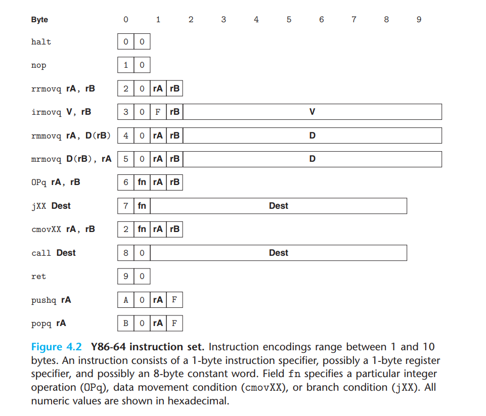

指令的第一个字节表明指令类型，其中高 4 位是*代码（code）*部分，低 4 位是*功能（function）*部分。


| 寄存器标识符 | 寄存器名 |     描述     |
| :----------: | :------: | :----------: |
|      0       |  `%rax`  |    返回值    |
|      1       |  `%rcx`  | 第 4 个参数  |
|      2       |  `%rdx`  | 第 3 个参数  |
|      3       |  `%rbx`  | 被调用者保存 |
|      4       |  `%rsp`  |    栈指针    |
|      5       |  `%rbp`  | 被调用者保存 |
|      6       |  `%rsi`  | 第 2 个参数  |
|      7       |  `%rdi`  | 第 1 个参数  |
|      8       |  `%r8`   | 第 5 个参数  |
|      9       |  `%r9`   | 第 6 个参数  |
|      A       |  `%r10`  |  调用者保存  |
|      B       |  `%r11`  |  调用者保存  |
|      C       |  `%r12`  | 被调用者保存 |
|      D       |  `%r13`  | 被调用者保存 |
|      E       |  `%r14`  | 被调用者保存 |
|      F       | 无寄存器 |      \       |

**分支指令和调用指令的目的是绝对地址，不采用 PC 相对寻址方式；整数用小端法编码**。

指令 `rmmovq %rsp. 0x123456789abcd(%rdx)` 的字节编码是 `40 42 cd ab 89 67 45 23 01 00`


### Y86-64 异常

状态码 `Stat` 的可能值

|  值   | 名字  |      含义       |
| :---: | :---: | :-------------: |
|   1   |  AOK  |    正常操作     |
|   2   |  HLT  | 执行 `HLT` 指令 |
|   3   |  ADR  |  非法内存地址   |
|   4   |  INS  |    非法指令     |


### Y86-64 程序


用 Y86-64 编写的完整程序的示例：

```py
# Exec begins at address 0
    .pos 0                 # 从 0x0 处开始产生代码
    irmovq  stack, %rsp    # 初始化栈指针
    call    main
    halt

# arr of 4 elements
    .align 8
array:
    .quad   0x000d000d000d
    .quad   0x00c000c000c0
    .quad   0x0b000b000b00
    .quad   0xa000a000a000

main:
    irmovq  array, %rdi
    irmovq  $4, %rsi
    call    sum         # sum(array, 4)
    ret

# long sum(long* start, long cnt)
sum:
    irmovq $8, %r8
    irmovq $1, %r9
    xorq %rax, %rax
    andq %rsi, %rsi
    jmp test
loop:
    mrmovq (%rdi), %r10
    addq %r10, %rax
    addq %r8, %rdi
    subq %r9, %rsi
test:
    jne loop
    ret

# stack starts here and grows to lower addresses
    .pos 0x200
stack:
```

以 `.` 开头的是汇编器伪指令（assembler directives），它们告诉汇编器调整地址，以便在那里产生代码或插入数据。`.pos` 告诉汇编器应从地址 `0x0` 处产生代码，这个地址是所有 Y86-64 程序的起点。


## 逻辑设计和硬件控制语言 HCL

大多数现代逻辑设计采用**硬件描述语言（Hardware Description Language, HDL）**表达。最常用的有是 Verilog 和 VHDL。

我们用 HCL（Hardware Control Language, 硬件控制语言）描述处理器设计的控制逻辑。


### 组合电路和 HCL 布尔表达式

将很多逻辑门组合成网，就能构建**计算块（computational block）**，称为**组合电路（combinational circuits）**。构建这样的网需要：
- 每个逻辑门的输入必须是以下之一：
  - 一个系统输入（主输入）
  - 某个存储器单元的输出
  - 某个逻辑门的输出
- 两个或多个逻辑门的输出不能连在一起，否则可能会使线上的信号矛盾，引起不合法的电压 / 电路故障
- 网必须是**无环**的，即不能形成回路，否则会导致网络计算的函数产生歧义

异或：`bool xor = (a && !b) || (!a && b)`

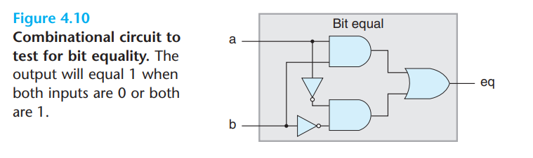

检查位相等的组合电路：`bool eq = (a && b) || (!a && !b)`

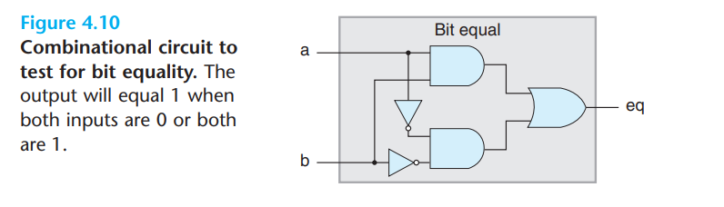

**多路复用器**（multiplexor, MUX）根据输入控制信号 `s` 的值，从一组输入信号中选出一个输出。

`bool out = (!s && b) || (s && a)`


### 字级组合电路和 HCL 整数表达式

把许多个位级组合电路组合起来，可以实现字级组合电路

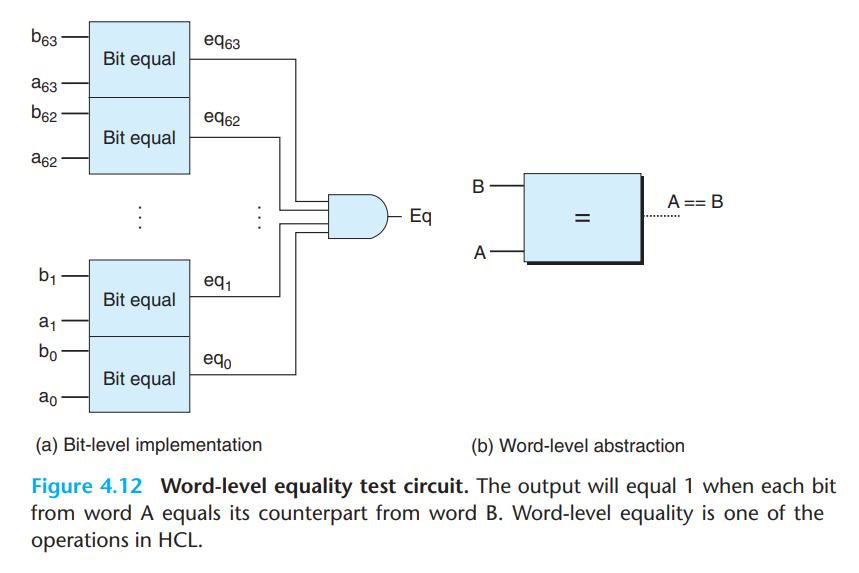

`bool Eq = (A == B)`

在字级抽象中，用中等粗度的线表示字级信号，用虚线表示布尔信号结果。

为了简单，HCL 中，所有字级的信号都声明为 `int`，不指定字的大小。

字级的多路复用器没有简单地复制 64 次位级多路复用器，它**只产生一次 `!s`**。

```c
// 多路复用函数用情况表达式描述
[
    select_1 : expr_1;
    select_2 : expr_2;
    ...
    select_n : expr_n;
]
```


```c
// 字级多路复用器
// 逻辑上，这些选择表达式被顺序求值，第一个求值为 1 的表达式会被输出
// 不得不要求不同的选择表达式互斥
word Out = [
    s : A;
    1 : B;    // 相当于 default，这里即 !s && 1
]
```

选择表达式可以是任意布尔表达式，于是情况表达式能描述带复杂选择标准的、多种输入信号的块。

```c
word Out4 = [
    !s1 && !s0 : A;    // 00
    !s1        : B;    // 01 即 !(!s1 && !s0) && !s1
    !s0        : C;    // 10
    1          : D;    // 11
]
```

```c
// 寻找 A B C 中的最小值
word Min3 = [
    A <= B && A <= C : A;
    B <= A && B <= C : B;    
    1                : C;

    // 也可以这样写
    A <= B : [
        A <= C : A;
        1      : C;
    ];
    1 : [
        B <= C : B;
        1 : C;
    ]

    // 也可以这样写
    A <= B && A <= C : A;
    B <= C           : B;  // 不需要 B <= A 因为 A 已经不可能是结果了 只需要比较 B 和 C    
    1                : C;
]
```

**算术 / 逻辑单元（ALU）**是一种重要的组合电路，它接受**两个数据输入 `A` 和 `B`** 以及**一个控制输入**（对应于功能码）


### 集合关系

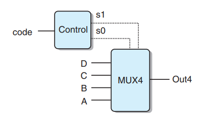

```c
// s1 s0 为控制信号 是两位信号 code 的高位和低位
bool s1 = code in { 2, 3 };    // code == 2 || code == 3 
bool s0 = code in { 1, 3 };    // code == 1 || code == 3
```

### 存储器和时钟

组合电路本质上不存储信息。为了产生**时序电路（sequential circuit，有状态且基于此状态计算的系统）**，需要引入按位存储信息的设备。

存储设备由同一个时钟控制，时钟是一个周期性信号，决定了新值被加载到设备的时机。考虑两类存储器：
- **时钟寄存器**（简称寄存器）：存储**单个位 / 字**，时钟信号控制寄存器加载输入值
- **随机访问存储器**（简称内存）：存储**多个字**，用地址选择读写哪个字。包括**处理器的虚拟内存系统**和**寄存器文件**

- 硬件寄存器：直接把输入和输出线连接到电路其他部分的存储设备
- 程序寄存器：CPU 中为数不多可寻址的字，地址为寄存器 ID

硬件寄存器的工作原理：大多数时候，寄存器保持在稳定状态，其输出等于当前状态。即使一个新的寄存器输入产生，只要时钟是低电位的，寄存器的输出就保持不变。当时钟变为高电位时，寄存器将输入加载进来，变为自己新的状态，并输出。这个状态一直保持，直到下一个**时钟上升沿**。

寄存器是电路不同部分中的组合逻辑之间的屏障。每当每个时钟到达上升沿，值才会从寄存器的输入传送到输出。

Y86-64 处理器用时钟寄存器保存程序计数器（PC）、条件代码（CC）和程序状态（Stat）。

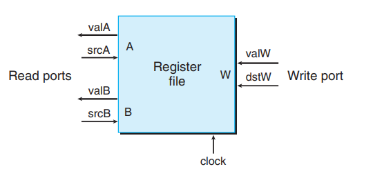

**寄存器文件**有**两个读端口（A 和 B）**和**一个写端口（W）**。上图的寄存器文件中，电路可以读两个程序寄存器的值，同时更新第三个寄存器的状态。`srcA`、`srcB` 和 `dstW` 是端口的地址输入，表明被读 / 写的寄存器的标识符。`valA`、`valB` 输出从寄存器中读出的值，`valW` 输入要写入寄存器的值。

寄存器文件有内部存储，**不是**组合电路。不过我们的实现中，从寄存器文件读数据就仿佛它是一个以地址为输入、数据为输出的组合逻辑块。

向寄存器文件写入字由时钟信号控制。每次时钟上升时，`valW` 的值被写入`dstW` 所指示的寄存器（当 `dstW` 为 `0xF` 时，不写入任何寄存器）。

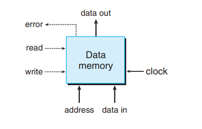

**随机访问存储器**存储程序数据。从内存中读的操作方式类似于组合逻辑：
- 输入地址、写控制信号置 `0`：输出地址上的数据
- 输入地址和要写入的数据、写控制信号置 `1`：将数据写入地址（由时钟控制）
- `error` 信号被置为 `0`，除非地址非法（这个信号由组合逻辑产生，因为这个边界检查纯粹是地址输入的函数，不涉及任何状态的保存）。

我们的处理器还包括另外一个只读存储器，用于读指令。在大多数实际系统中，这两个存储器被合并为一个具有双端口的存储器：一个读指令，另一个读或写数据。

## Y86-64 的顺序实现

每个时钟周期上，SEQ 执行处理一条完整指令所需的所有步骤，但这需要一个很长的时钟周期时间，因此时钟周期频率会低到不可接受。

### 将处理组织成阶段

- **取指（fetch）**：从程序计数器指向的内存地址中读取指令，获得 `icode`（指令代码） 和 `ifun`（指令功能）、寄存器操作数指示符 `rA` 和 `rB`、四字节常数字 `valC`。按顺序方式计算下一条指令的地址 `valP`（`valP` 等于 `PC` 的值加当前指令的长度）。
- **译码（decode）**：从寄存器文件读入操作数，得到 `valA` 和 / 或 `valB`。
- **执行（execute）**：算术 / 逻辑单元（ALU）要么执行指令的操作、计算内存引用的有效地址，要么增减栈指针，得到 `valE`。此阶段也可能**设置条件码**。对条件传送指令来说，此阶段会检验条件码和传送条件，如果条件成立，则更新目标寄存器。对跳转指令来说，此阶段决定是否应该选择分支。
- **访存（memory）**：访存阶段将数据写入内存，或从内存读出数据。读出的值记为 `valM`。
- **写回（write back）**：写最多两个结果到寄存器文件。
- **更新 PC（PC update）**：将 PC 置为下一条指令的地址。

处理器无限循环。发生异常后停止：执行 `halt` 指令或非法指令，或读写非法地址。

只有 `OPq` 指令会设置条件码。


**注意 `mrmovq` 指令的操作数顺序：先 `rB` 后 `rA`**。这是因为 `valA` 和 `valC` 不能同时进入执行阶段。

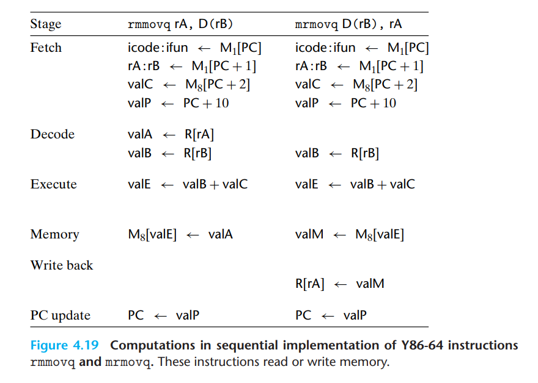

`pushq` 在译码阶段将 `valB` 赋值为 `%rsp`。**效果上，先压栈，后更新栈指针。`pushq %rsp` 压入栈的是 `%rsp` 的原始值（`M[valE]=valA`），而不是减 8 后的值**。

`popq` 在译码阶段将 `valA` 和 `valB` 都赋值为 `%rsp`。**效果上，先弹栈，后更新栈指针。`popq %rsp` 弹出栈的是 `%rsp` 的原始值指向的内容（`valM=M[valA]`），而不是加 8 后指向的内容**。**在写回阶段，`R[%rsp]=valE` 和 `R[rA]=valM` 都会写入 `%rsp`，由于 M 端口优先级更高，`%rsp` 会被置为 `valM`，即弹出的值。**


在 `rrmovq` 指令的基础上，条件传送指令在指令阶段增加 `Cnd=Cond(CC, ifun)`，并在写回阶段增加条件判断：`if (Cnd) R[rB]=valE`

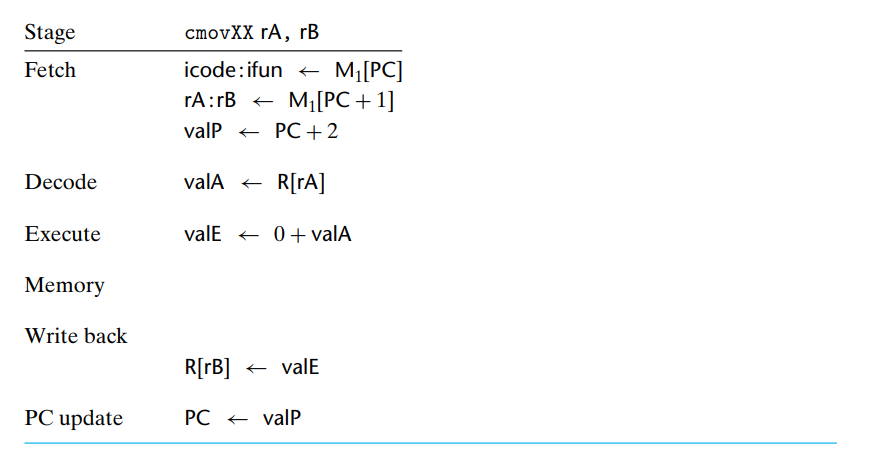


### SEQ 硬件结构

同各个阶段相关的硬件单元（hardware units）负责执行每个阶段的处理。所有硬件单元的处理都在**一个时钟周期**完成。

- **取指**：将程序计数器寄存器作为地址，指令内存读取指令字节，PC 增加器（PC incrementer）计算 `valP`。
- **译码**：从寄存器文件的读端口 `A` 和 `B` 同时读取 `valA` 和 `valB`。
- **执行**：计算 `valE`，更新条件码寄存器 CC。有条件时，根据条件码和传送条件计算 `Cnd`。
- **访存**：从数据内存读取 `valM`，或将 `valA` 写入数据内存。
- **写回**：寄存器文件有两个写端口。端口 `E` 用来写入 `valE`，端口 `M` 用来写入 `valM`。
- **更新 PC**：下一条指令的地址选择自 `valP`、`valC` 或 `valM`，并将其写入程序计数器寄存器。


- 白色方框表示*时钟寄存器*。程序计数器 PC 是 SEQ 中唯一的时钟寄存器
- 浅蓝色方块表示*硬件单元*。包括内存、ALU、寄存器文件、PC 增加器、条件码寄存器等。我们只把它们当作黑盒。
- 灰色圆角矩形表示*控制逻辑块*。这些块用来从一组信号源中进行选择，或计算一些布尔函数。
- 白色圆形表示*线路的名字的说明*。它们只是线路的标识。
- 宽度为*字长*的数据连接用*中等粗度的线*表示。它们实际上是一簇 64 根线。
- 宽度为*字节或更窄*的数据连接用*细线*表示。它们实际上是一簇 4 根或 8 根线。
- *单个位*的数据连接用*虚线*表示。

四个寄存器 ID 信号：`srcA`，`valA` 的源；`srcB`，`valB` 的源；`dstE`，`valE` 的目的；`dstM`，`valM` 的目的。


### SEQ 的时序

SEQ 的实现包括组合逻辑和两种存储器设备：时钟寄存器（程序计数器和条件码寄存器）以及随机访问存储器（寄存器文件、指令内存和数据内存）。组合逻辑不需要时序或控制，因为只要输入变化，其值就通过逻辑门网络传播。我们认为*读随机访问存储器的操作和组合逻辑一样，只要输入的地址变化，输出的字就自动变化，并通过逻辑门网络传播*。对于较小的电路，这是合理的；对于较大的电路，可以用特殊的时钟电路模拟这个效果。指令内存只用来读指令，我们可以将这个单元看作组合逻辑。

**程序计数器、条件码寄存器、数据内存和寄存器文件**这四个硬件单元的时序需要被明确控制。它们被一个*时钟信号*控制。每个时钟周期，程序计数器都会装载新的指令地址。条件码寄存器只在执行整数运算指令时被装载。数据内存只在执行 `rmmovq`、`pushq` 或 `call` 时被写入。寄存器文件的两个写端口允许每个时钟周期更新两个程序寄存器。

我们将每条指令拆分成了 6 个按顺序执行的阶段，但在硬件结构中，这些阶段实际上是“同时”进行的。通过寄存器和内存的时钟控制，硬件获得了如同顺序执行的效果。

能够“化同时为顺序”，是因为我们遵循了**从不回读**的原则。**处理器从来不需要为了完成一条指令的执行而去读由该指令更新了的状态**。例如，如果我们对 `pushq` 的实现变为*先将 `%rsp` 减 8，再将更新后的 `%rsp` 值作为写操作的地址*，那么我们为了执行内存操作，就需要先从寄存器文件读出更新后的 `%rsp`，从而违背了此原则。实际上，我们的实现是*先产生出更新后的 `%rsp` 值作为信号 `valE`，然后将 `valE` 既作为写回栈指针的数据，又作为内存写的地址*。因此，在时钟上升开始下一个周期时，处理器就可以同时执行寄存器写和内存写了。同理，`popq` 的实现将 `%rsp` 置为从栈中弹出的值，而不是栈指针被增加后的值。

又例如，有的指令（整数运算）设置条件码，有的指令（条件跳转）读取条件码，但没有指令既设置条件码，又读取条件码。在任何指令试图读之前，它们都会更新。

寄存器文件、指令内存和数据内存的读取被看成是组合逻辑。每个时钟周期开始时，状态单元（程序计数器、条件码寄存器、寄存器文件和数据内存）的值是根据上一条指令设置的。信号通过组合逻辑传播，生成新的状态单元的值。在下一个周期开始时，这些值会被加载到状态单元中。

简言之，SEQ 的硬件实现可以描述为：用时钟控制状态单元的更新，值通过组合逻辑传播。

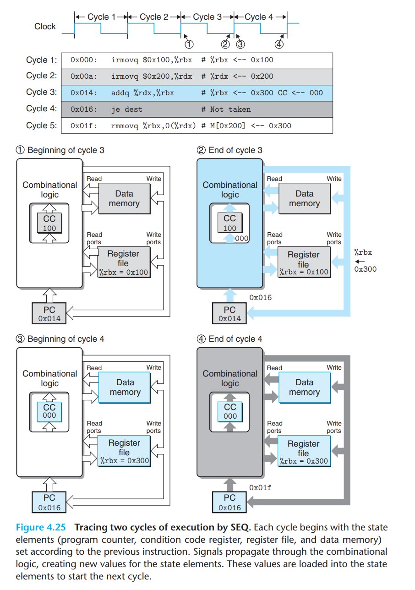


### SEQ 阶段的实现

|   名称    |  值   |      含义       |
| :-------: | :---: | :-------------: |
|  `IHALT`  |  0x0  |     `halt`      |
|  `INOP`   |  0x1  |      `nop`      |
| `IRRMOVQ` |  0x2  |    `rrmovq`     |
| `IIRMOVQ` |  0x3  |    `irmovq`     |
| `IRMMOVQ` |  0x4  |    `rmmovq`     |
| `IMRMOVQ` |  0x5  |    `mrmovq`     |
|  `IOPQ`   |  0x6  | 算术 / 逻辑指令 |
|  `IJXX`   |  0x7  |  条件跳转指令   |
|  `ICALL`  |  0X8  |     `call`      |
|  `IRET`   |  0x9  |      `ret`      |
| `IPUSHQ`  |  0xA  |     `pushq`     |
|  `IPOPQ`  |  0xB  |     `popq`      |
|  `FNONE`  |  0x0  |   默认功能码    |
|  `RRSP`   |  0x4  |     `%rsp`      |
|  `RNONE`  |  0xF  |    空寄存器     |
| `ALUADD`  |  0x0  |   加法功能码    |
|  `SAOK`   |  0x1  |    正常操作     |
|  `SADR`   |  0x2  |  非法内存地址   |
|  `SINS`   |  0x3  |    非法指令     |
|  `SHLT`   |  0x4  |  `halt` 状态码  |


#### 取指阶段

指令内存以 PC 的值作为地址的起始字节，**一次从内存中读出 10 个字节**。

当指令地址不合法时（由信号 `imem_error` 指明），`icode` 置 1，`ifun` 置 0，对应于 `nop`。

根据 icode 的值，三个一位的信号被计算出来：`instr-valid` 检查指令合法性，`need_regids` 检查指令是否包括一个寄存器指示符字节，`need_valC` 检查指令是否包括一个常数字。（当指令地址越界时会产生的）`instr_valid` 和 `imem_error` 在访存阶段被用于产生状态码。

```c
word icode = [
	imem_error: INOP;
	1: imem_icode;		// Default: get from instruction memory
];

// Determine instruction function
word ifun = [
	imem_error: FNONE;
	1: imem_ifun;		// Default: get from instruction memory
];

bool instr_valid = icode in 
	{ INOP, IHALT, IRRMOVQ, IIRMOVQ, IRMMOVQ, IMRMOVQ,
	       IOPQ, IJXX, ICALL, IRET, IPUSHQ, IPOPQ };

// Does fetched instruction require a regid byte?
bool need_regids =
	icode in { IRRMOVQ, IOPQ, IPUSHQ, IPOPQ, 
		     IIRMOVQ, IRMMOVQ, IMRMOVQ };

// Does fetched instruction require a constant word?
bool need_valC =
	icode in { IIRMOVQ, IRMMOVQ, IMRMOVQ, IJXX, ICALL };
```


剩下 9 个字节是寄存器指示符字节和常数字的组合编码。硬件单元 Align 将他们放入寄存器字段和常数字中。若 `need_regids` 为 1，则第一个字节被分开放入 `rA` 和 `rB`；否则，`rA` 和 `rB` 被置为 `0xF(RNONE)`。Align 同时根据 `need_valC` 产生常数字 `valC`：若 `need_regids` 为 1，则 `valC` 为字节 2 ~ 9（对应于 `irmovq`、`rmmovq`、`mrmovq`）；否则，`valC` 为字节 1 ~ 8（对应于 `jXX` 和 `call`）。

PC 增加器根据 PC、`need_regids` 和 `need_valC` 的值产生信号 `valP`：$\operatorname{valP}=\operatorname{PC}+1+\operatorname{need\_regids}+8\operatorname{need\_valC}$

#### 译码和写回阶段

根据 `icode` 以及 `rA` 和 `rB`，可能还有 `Cnd` 条件信号，`dstE`、`dstM`、`srcA` 以及 `srcB` 四个块产生出四个不同的寄存器 ID。

```c
// What register should be used as the A source?
word srcA = [
	icode in { IRRMOVQ, IRMMOVQ, IOPQ, IPUSHQ  } : rA;
	icode in { IPOPQ, IRET } : RRSP;
	1 : RNONE; // Don't need register
];

// What register should be used as the B source?
word srcB = [
	icode in { IOPQ, IRMMOVQ, IMRMOVQ  } : rB;
	icode in { IPUSHQ, IPOPQ, ICALL, IRET } : RRSP;
	1 : RNONE;  // Don't need register
];

// What register should be used as the E destination?
word dstE = [
	icode in { IRRMOVQ } && Cnd : rB;
	icode in { IIRMOVQ, IOPQ} : rB;
	icode in { IPUSHQ, IPOPQ, ICALL, IRET } : RRSP;
	1 : RNONE;  // Don't write any register
];

// What register should be used as the M destination?
word dstM = [
	icode in { IMRMOVQ, IPOPQ } : rA;
	1 : RNONE;  // Don't write any register
];
```


对于指令 `popq %rsp`，写端口 E 和 M 会同时对 `%rsp` 写入。为了让 `popq %rsp` 弹出的是 `%rsp` 的旧值，我们需要令 M 端口的优先级高于 E 端口。这样，当 E 和 M 端口同时写入时，**只有 M 端口的写入会发生**。


#### 执行阶段

ALU 根据 `alufun` 信号，对 `aluA` 和 `aluB` 执行 ADD、SUBTRACT、AND 或 EXCLUSIVE-OR 运算。

```c
// Select input A to ALU
word aluA = [
	icode in { IRRMOVQ, IOPQ } : valA;
	icode in { IIRMOVQ, IRMMOVQ, IMRMOVQ } : valC;
	icode in { ICALL, IPUSHQ } : -8;
	icode in { IRET, IPOPQ } : 8;
	// Other instructions don't need ALU
];

// Select input B to ALU
word aluB = [
	icode in { IRMMOVQ, IMRMOVQ, IOPQ, ICALL, 
		      IPUSHQ, IRET, IPOPQ } : valB;
	icode in { IRRMOVQ, IIRMOVQ } : 0;
	// Other instructions don't need ALU
];

// Set the ALU function
word alufun = [
	icode == IOPQ : ifun;
	1 : ALUADD;
];

// Should the condition codes be updated?
bool set_cc = icode in { IOPQ };
```

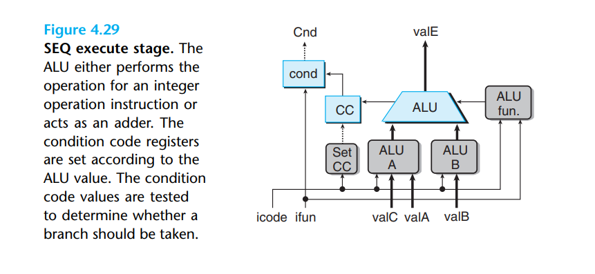

每次运行时，ALU 都会产生三个与条件码相关的信号：零、符号和溢出。我们希望只在执行 `OPq` 时才设置条件码，因此用控制信号 `set_cc` 来控制条件码是否被设置。

“cond”会根据条件码和 `ifun` 产生一位信号 `Cnd`，决定是否进行条件分支或条件数据传送。`Cnd` 在设置条件传送时的 `dstE` 和条件传送的下一个 PC 逻辑中被用到。


#### 访存阶段

控制块 Mem.addr 和 Mem.data 产生内存地址和待写入数据的值，Mem. read 和 Mem. write 产生读写操作的控制信号。进行读操作时，`valM` 是读出的值。

```c
// Set read control signal
bool mem_read = icode in { IMRMOVQ, IPOPQ, IRET };

// Set write control signal
bool mem_write = icode in { IRMMOVQ, IPUSHQ, ICALL };

// Select memory address
word mem_addr = [
	icode in { IRMMOVQ, IPUSHQ, ICALL, IMRMOVQ } : valE;
	icode in { IPOPQ, IRET } : valA;
	// Other instructions don't need address
];

// Select memory input data
word mem_data = [
	// Value from register
	icode in { IRMMOVQ, IPUSHQ } : valA;
	// Return PC
	icode == ICALL : valP;
	// Default: Don't write anything
];

// Determine instruction status
word Stat = [
	imem_error || dmem_error : SADR;
	!instr_valid: SINS;
	icode == IHALT : SHLT;
	1 : SAOK;
];
```


在访存阶段的最后，处理器根据取指阶段产生的 `icode`、`imem_error`、`instr_valid` 和数据内存产生的 `dmem_error`，计算状态码 `Stat`。

#### 更新 PC 阶段

根据 `icode` 和 `Cnd` 产生 PC 的新值。

```c
word new_pc = [
	// Call.  Use instruction constant
	icode == ICALL : valC;
	// Taken branch.  Use instruction constant
	icode == IJXX && Cnd : valC;
	// Completion of RET instruction.  Use value from stack
	icode == IRET : valM;
	// Default: Use incremented PC
	1 : valP;
];
```

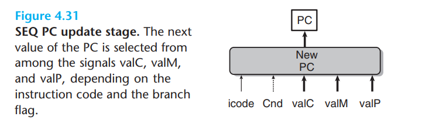


## 流水线的通用原理

### 计算流水线

$$\operatorname{Throughput}=\frac{1 \operatorname{instruction}}{(20+300)\operatorname{ps}}\cdot\frac{1000\operatorname{ps}}{1\operatorname{ns}}\approx 3.12\operatorname{GIPS}$$

每秒十亿条指令（Giga Instructions Per Second, GIPS）是吞吐量的单位。从头到尾执行一条指令的用时称为**延迟（latency）**。

$$\operatorname{Latency}=\frac{1}{\operatorname{Throughput}}=320 \operatorname{ps}$$

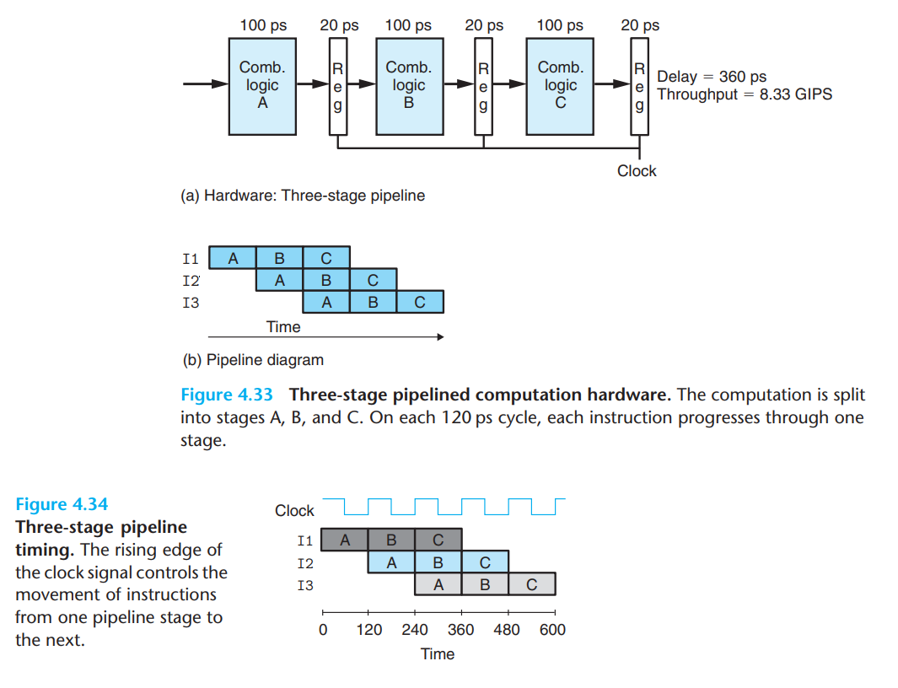

流水线化的计算硬件将计算分为三个阶段（A、B 和 C），在各个阶段之间放上**流水线寄存器（pipeline register）**。每条指令需要三个完整的时钟周期执行。稳定状态下，每个时钟周期，一条指令离开系统，一条新指令进入系统。我们将时钟周期设置为 $120\operatorname{ps}$，则吞吐量为 $8.33\operatorname{GIPS}$，延迟为 $360\operatorname{ps}$。延迟增加是由于增加的流水线寄存器的时间开销。

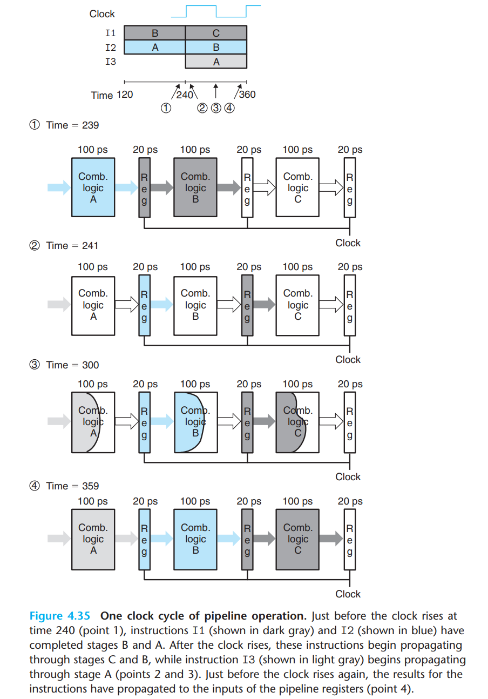

减缓时钟不会影响流水线的行为，但加快时钟可能导致值来不及通过组合逻辑。

### 流水线的局限性

#### 不一致的划分

如果不同计算阶段的**延迟不相等**，则时钟周期不得不被设置为最长的延迟，以保证所有阶段都能完成。这样，流水线的吞吐量就会降低。


将系统计算设计划分成等延迟的阶段很难。ALU 和内存是不能被划分为多个延迟更小的单元的。

#### 流水线过深，收益反而下降

流水线寄存器也会带来延迟。随着流水线深度的增加，虽然时钟频率能够提高，但这一延迟也会越来越显著。

为了提高时钟频率，现代处理器采用了很深的（15 或更多的阶段）流水线。处理器架构师将指令的执行划分成很多非常简单的步骤，减小每个阶段的延迟。芯片设计者小心地设计时钟传播网络，以保证时钟在整个芯片上同时改变。

### 带反馈的流水线系统

相邻的机器指令之间可能存在**数据相关（data dependency）**。例如，`addq %rax, %rbx` 和 `subq %rbx, %rcx`，第二条指令的源操作数是第一条指令的目的操作数。

```c
loop:
    subq %rdx, %rbx
    jne targ
    irmovq $10， %rdx
    jmp loop
targ:
    halt
```

第三行的 `jne targ` 产生了一个**控制相关（control dependency）**，条件测试的结果决定下一条指令是 `irmovq` 还是 `halt`。

SEQ 设计中，这些相关是用**反馈路径**解决的。每条指令的结果都反馈给下一条指令：将更新的寄存器值向下传送到寄存器文件，将新的 PC 值向下传送到 PC 寄存器。我们需要小心处理反馈。


## Y86-64 的流水线实现

### SEQ+：重新安排计算阶段

调整 SEQ 中五个阶段的顺序，使得**更新 PC 阶段在一个时钟周期开始时执行**。在 SEQ+ 中，我们创建状态寄存器来保存在一条指令执行过程中计算出来的信号，在新的时钟周期开始时，这些信号通过同样的逻辑来计算当前指令的 PC。我们将这些寄存器标号为 pIcode、pCnd 等等，来指明在任一给定周期，它们保存的是**前一个周期中产生的控制信号**。

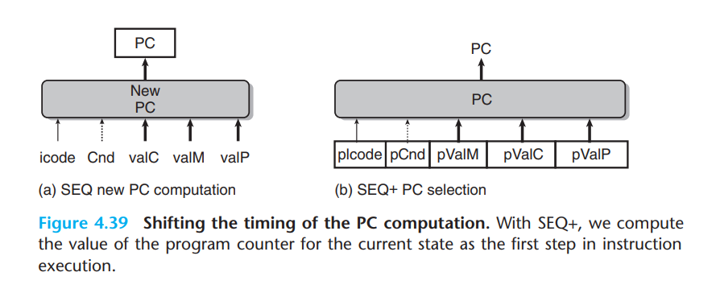

```c
word pc = [
	// Call.  Use instruction constant
	pIcode == ICALL : pValC;
	// Taken branch.  Use instruction constant
	pIcode == IJXX && pCnd : pValC;
	// Completion of RET instruction.  Use value from stack
	pIcode == IRET : pValM;
	// Default: Use incremented PC
	1 : pValP;
];
```

SEQ+ 没有硬件寄存器来存放程序计数器，而是根据从上一条指令保存的状态信息**动态**地计算 PC。这说明我们可以用一种与 ISA 隐含着的概念模型不同的方式实现处理器，只要保证处理器的执行效果是正确的。

这种改进称为**电路重定时（circuit retiming）**。重定时改变系统的状态表示，但不改变其逻辑行为。它可以平衡一个流水线系统各个阶段的延迟。


### 插入流水线寄存器

我们要在 SEQ+ 的各个阶段之前插入流水线寄存器，并对信号重新排列，得到 PIPE- 处理器。

流水线寄存器用实心方框表示，每个寄存器包括不同字段，用白色方框表示。同之前硬件结构图示的圆角方框不同，这些白色方框表示实际的硬件组成。

流水线寄存器按如下方式标号：
- F：保存程序计数器的**预测**值。
- D：位于取指和译码阶段之间。保存关于最新取出的指令的信息，即将由译码阶段处理。
- E：位于译码和执行阶段之间。保存关于最新译码的指令以及从寄存器文件读出的值的信息，即将由执行阶段进行处理。
- M：位于执行和访存阶段之间。保存最新执行的指令的结果，即将由访存阶段进行处理。还保存用于处理条件转移的分支条件和分支目标的信息。
- W：位于访存阶段和反馈路径之间。反馈路径将计算出来的值提供给寄存器文件写，而当完成 `ret` 指令时，它还要向 PC 选择逻辑提供返回地址。


### 对信号重新排列和标号

顺序实现 SEQ 和 SEQ+ 在一个时刻只处理一条指令，因此 `valC`、`srcA` 和 `valE` 这样的信号有唯一的值。而在流水线化的设计中，与各个指令相关联的这些值有多个版本。

对于*流水线寄存器中的字段*，我们加上大写的流水线寄存器名字作为前缀区分，例如 4 个状态码被命名为 `D_stat`、`E_stat`、`M_stat` 和 `W_stat`；对于*在一个阶段内刚刚计算出来的信号*，我们加上小写的阶段名的首字母作为前缀区分，例如取值和访存阶段标号 Stat 的控制逻辑块的输出被命名为 `f_stat` 和 `m_stat`。整个处理器的状态 `Stat` 是根据 `W_stat` 的值，经过写回阶段的块计算而得的。

SEQ+ 和 PIPE- 的译码阶段都产生信号 `dstE` 和 `dstM`，它们指明值 `valE` 和 `valM` 的目的寄存器。SEQ+ 中，我们将这些信号直接连到寄存器文件写端口的地址输入，但在 PIPE- 中，我们在流水线中**一直携带这些信号穿过执行和访存阶段**，直到写回阶段才送到寄存器文件。作为一条通用原则，*我们要保存处于一个流水线阶段中的指令的所有信息*。

PIPE- 译码阶段中的 Select A 块从*来自流水线寄存器 D 的 `valP`* 和*从寄存器文件 A 端口读出的值*中选择一个，作为流水线寄存器 E 的 `valA`。包括这个块是为了**减少要携带给流水线寄存器 E 和 M 的状态数量**。只有 `call` 指令在访存阶段需要 `valP` 的值，只有跳转指令在执行阶段（当不需要跳转时）需要 `valP` 的值，而这些指令又都不需要从寄存器文件读出的 `valA`。因此我们把这两个信号合并为 `valA`，从而减少了流水线寄存器的状态数量。这消除了 SEQ+ 中标号 Data 的块。

### 预测下一个 PC

我们必须在取出当前指令之后，马上确定下一条指令的位置。然而，如果取出的是**条件分支指令**，我们就不得不等到指令通过执行阶段后才能知道是否需要跳转。类似地，如果取出的是 **`ret`** 指令，我们不得不等到访存阶段才能确定返回地址。

除了这两个例外，对于其他的指令，我们可以在取值阶段确定其下一条指令的地址。对于 `call` 和 `jmp`下一条指令的地址就是常数字 `valC`；对其余指令，下一条指令的地址则是 `valP`。因此，通过预测 PC 的下一个值，大多数情况下我们能达到**每个时钟周期发射一条新指令**的目的。

猜测分支方向并根据猜测开始取指的技术称为**分支预测**。我们的设计只使用了简单的策略，即总是预测**选择了条件分支**，因而预测 PC 的新值为 `valC`。

> 我们的设计使用**总是选择（always taken）**的预测策略，它的成功率约为 $60%$. 更复杂一些的是**反向选择、正向不选择（backward taken, forward not-taken, BTFNT）**的策略：当分支地址比下一条地址低时就预测选择分支，而分支地址比较高时就预测不选择分支。这种策略的成功率为 $65%$。这种改进基于一个事实：循环由**后向分支**结束，且循环会执行多次；**前向分支**用于条件操作，其可能性较小。
> 分支预测错误会极大地降低程序性能。可能的时候尽量用条件数据传送替代条件数据转移。

设计中，我们暂时不对 `ret` 指令的返回地址做任何预测。当遇到 `ret` 时，我们只简单地暂停处理新指令，直到 `ret` 通过写回阶段。

> 对大多数程序来说，预测返回地址很容易，因为大多数函数调用会返回到调用指令的下一条指令。高性能处理器在取指单元中放入一个硬件栈，保存过程调用指令产生的返回地址。同分支预测一样，在预测错误时必须提供一个恢复机制。这种预测通常很可靠。这个硬件栈对程序员不可见。

PIPE- 的取指阶段预测 PC 的下一个值，并为取指选择实际的 PC。标号 Predict PC 的块会从 PC 增加器计算出的 `valP` 和取出的指令中得到的 `valC` 中选择，其结果存放在流水线寄存器 F 的 `predPC` 字段中。标号 Select PC 的块从 *`pred PC`、`M_valA`（对不选择分支的指令来说为 `valP` 的值） 和 `W_valM`（`ret` 指令的返回地址）*


### 流水线冒险

相邻指令的相关分为：
- **数据相关**：下一条指令会用到当前指令的计算结果
- **控制相关**：当前指令确定下一条指令的位置

这些相关可能导致流水线产生计算错误，称为**冒险（hazard）**。冒险也可以分为**数据冒险（data hazard）**和**控制冒险（control hazard）**。

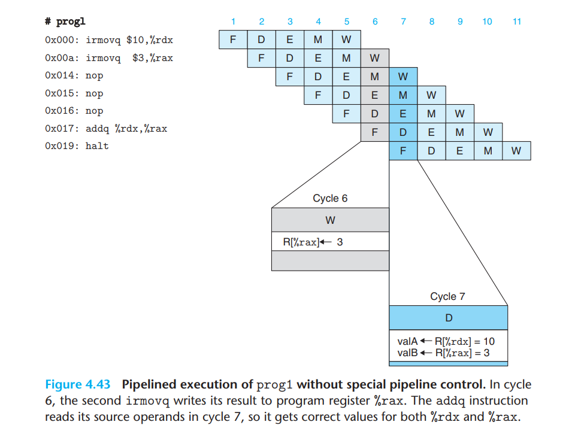

上图中，`irmovq` 与 `addq` 之间的数据相关没有造成数据冒险。但如果减少中间 `nop` 指令的数量，就会因为 `irmovq` 指令的结果**来不及在写回阶段写入寄存器文件**，而导致 `addq` 指令读到错误的值，从而产生数据冒险。

> 列举数据冒险的类型
> 对 Y86-64 而言，程序状态包括*程序寄存器、程序计数器、内存、条件码寄存器和状态寄存器*。
> - **程序寄存器**：由于之前指令的**写回阶段**尚未完成，导致当前指令读取到错误的值。
> - **程序计数器**：即控制冒险。当取指阶段的逻辑正确预测了程序计数器的新值时，就不会产生冒险。
> - **内存**：只有一种可能：**访存阶段数据的写入和取指阶段指令的读取**之间发生冲突。这种情况发生在包含**自我修改代码**的程序中。我们假设程序不会自我修改。
> - **条件码寄存器**：执行阶段条件码寄存器会被整数操作指令修改。**条件传送指令**会在**执行阶段**、**条件转移指令**会在**访存阶段**读条件码寄存器。因此**不会发生冒险**。
> - **状态寄存器**：我们的设计中，流水线的每条指令都与一个状态码相关联。因此当异常发生时，处理器可以有条理地停止。
> 因此，我们只需要处理**寄存器数据冒险、控制冒险以及异常**。

#### 用暂停避免数据冒险

暂停（stalling）会使处理器暂停流水线中一条或多条指令的执行，直到冒险条件不再满足。

如果当前指令译码后造成数据冒险，我们就在它的**执行阶段**插入一个**气泡（bubble）**，从而将该指令阻塞在译码阶段，直到它的源操作数完成写回。气泡就像自动产生的 `nop`，它不改变程序状态。

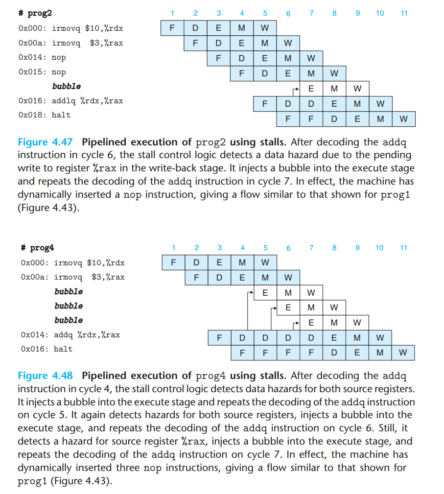

暂停机制易于实现，但性能很低。会触发暂停机制的汇编代码不胜枚举，流水线动辄暂停长达三个周期，严重降低了整体的吞吐量。


#### 用转发避免数据冒险

与其暂停直到写回阶段完成，不如直接**将要写的值传到流水线寄存器 E 作为源操作数**。

当 `irmovq V, rB` 和 `OPq rX, rB` 相邻时：

当**写回阶段**有对源操作数寄存器未进行的写时：译码阶段逻辑发现寄存器 `%rax` 是操作数 `valB` 的源寄存器，而在写端口 E 上还有一个对 `%rax` 未进行的写。我们只要将信号 `W_valE` 作为操作数 `valB` 的值，就能避免暂停。这就是**数据转发（data forwarding）**，又称**旁路（bypassing）**。


当**访存阶段**有对源操作数寄存器未进行的写时：译码阶段逻辑发现在写回阶段端口 E 上有对 `%rdx` 未进行的写，在访存阶段有对 `%rax` 未进行的写，它会用写回阶段的信号 `W_valE` 作为操作数 `valA`，用访存阶段的信号 `M_valE` 作为操作数 `valB`。


当**执行阶段**有对源操作数寄存器未进行的写时：译码阶段逻辑发现执行阶段中 ALU 正在计算的值稍后也会写入寄存器 `%rax`（此外在访存阶段也有对 `%rdx` 未进行的写）。它可以将访存阶段的信号 `M_valE` 作为操作数 `valA`，将 ALU 的输出信号 `e_valE` 作为操作数 `valB`。注意，使用 ALU 的输出信号不会造成时序问题：译码阶段只要在时钟周期结束之前产生好信号 `valA` 和 `valB` 即可。在下一个时钟周期开始时，ALU 的输出将已经变成合法的。


除了转发由 ALU 产生的、目标为寄存器文件的写端口 E 的值 `W_valE`、`M_valE`、`e_valE` 以外，还可以转发从内存中读出的、目标为寄存器文件写端口 M 的值 `m_valM`、`W-valM`。

综上，我们一共有五个转发源（`W_valE`、`M_valE`、`e_valE`、`m_valM`、`W-valM`）和两个转发目的（`valA`、`valB`）。


#### 加载 / 使用数据冒险

**加载 / 使用冒险（load/use hazard）**由 `mrmovq D(rB), rA` 或 `popq rA` 引起。它不能单纯用转发解决。

我们将暂停和转发结合起来，避免这种数据冒险。当流水线控制逻辑发现译码阶段的指令（`addq`）需要从内存读出来的结果，它就将译码阶段的指令暂停一个周期，即在执行阶段中插入一个气泡。

用暂停处理加载 / 使用冒险的方法称为**加载互锁（load interlock）**。加载互锁和转发技术结合起来就足以处理所有数据冒险了。

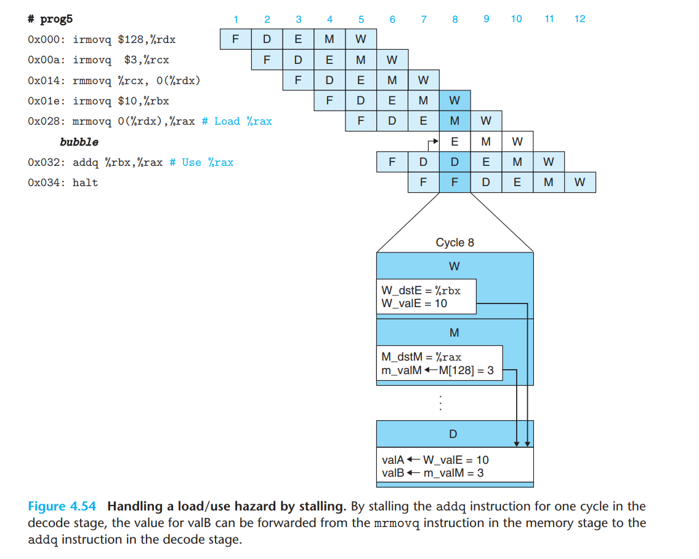

#### 避免控制冒险

在我们的 PIPE 设计中，控制冒险只会发生在 `ret` 和预测错误的条件跳转。

对于 `ret` 指令，考虑以下汇编代码：

```c
    irmovq    stack, %rsp
    call      proc
    irmovq    $10, %rdx
    halt
.pos 0x20
proc:
    ret
    rrmovq    %rdx, %rbx    // Not executed
.pos 0x30
stack:
```


当 `ret` 指令进入译码阶段后，流水线**暂停三个时钟周期**，直到 `ret` 进入写回阶段，PC 选择逻辑将程序计数器设为 `ret` 的返回地址 `valM`。


对于预测错误的分支，考虑以下汇编代码：

```c
    xorq    %rax, %rax
    jne     target
    irmovq  $1, %rax
    halt
target:
    irmovq  $2, %rdx
    irmovq  $3, %rbx
    halt
```

`jne` 指令进入**执行阶段**时，分支逻辑发现预测错误，此时已经取出了两条指令。幸运的是，这两条指令不会改变程序员可见的状态，因为它们都**未到达执行阶段，没有改变条件码**。

因此，我们只需要向 `jXX` 指令后已取出的两条指令（此时分别处于执行阶段和译码阶段）插入气泡，并取出跳转指令的正确结果指令，就能**取消**（或称**指令排除, instruction squashing**）那两条预测错误的指令。


### 异常处理

我们的指令集体系结构包括三种异常：
- `halt` 指令
- 非法指令
- 取指或数据读写访问非法内存地址

导致异常的指令称为**异常指令（excepting instruction）**。对于访问非法地址的异常，我们想象在非法地址处有一种“虚拟的异常指令”。遇到异常时，处理器应**停止并设置状态码**，看上去应该是**异常指令之前的所有指令正常完成，其后的指令都不应该对程序员可见状态产生影响**。更完整的设计还包括调用异常处理程序（exception handler），这是操作系统的一部分。流水线的异常处理需要考虑一些细节：

第一，在流水线化的系统中，可能**同时有多条指令会引起异常**。例如取指阶段的 `halt` 和访存阶段的非法地址访问。**由流水线中最深的指令引起的异常优先级最高**，我们只应该向操作系统报告最深的异常。

第二，分支预测错误会导致两条错误的指令进入流水线，如果其中包含会引发异常的指令，我们不应该报告这个异常。

第三，如果一条指令导致了异常，那么这条指令之后的指令有可能在异常指令完成之前改变了部分状态。例如：

```c
irmovq    $1, %rax
xorq      %rsp, %rsp  // set CC to 100
pushq     %rax        // illegal write
addq      %rax, %rax  // (should not be executed) would set CC to 000
```

`pushq` 指令会在**访存阶段**引起异常，但此时 `addq` 指令已经处于执行阶段，可能会改变条件码。

我们在每个流水线寄存器中包括了一个状态码 `Stat`，如果一条指令在处理过程中引起了异常，那么这个状态字段就会被设置，指示异常的种类。异常状态和该指令的其他信息继续沿流水线传播，直到**写回阶段**，在此，流水线控制逻辑发现异常，停止执行。当处于访存或写回阶段的指令导致异常时，流水线控制逻辑必须**禁止更新条件码寄存器或数据内存**。上例中，控制逻辑发现访存阶段的 `pushq` 导致了异常，因此应禁止 `addq` 指令更新条件码寄存器。

总的来说，当流水线中有一个或多个阶段出现异常时，信息只是简单地存放在流水线寄存器的状态字段中。直到**异常指令到达写回阶段**，异常除了会禁止流水线中后面的指令更新**条件码寄存器和内存**（即程序员可见状态）以外，不会对流水线的指令流有其他影响。当异常指令到达写回阶段时，程序执行停止，流水线寄存器 W 中的状态码会被记录为程序状态。如果此过程中还有别的异常指令，那么它们的异常状态信息也都会被取消。

### PIPE 各阶段的实现

#### PC 选择和取指阶段


PC 选择逻辑从三个程序计数器源选择：当**预测错误的分支进入访存阶段**时，会从流水线寄存器 M 的信号 `M_valA` 中读出该指令 `valP` 的值。当 **`ret` 指令进入写回阶段**时，会从流水线寄存器 W 的信号 `W_valM` 中读出返回地址。其他情况使用存放在流水线寄存器 F 的信号 `F_predPC` 读出 PC 的预测值。

```c
// What address should instruction be fetched at
word f_pc = [
    // Mispredicted branch of NewJE. 
    D_icode == INEWJE && !d_equal : D_valP;

	// Mispredicted branch.  Fetch at incremented PC
	M_icode == IJXX && !M_Cnd : M_valA;
	// Completion of RET instruction
	W_icode == IRET : W_valM;
	// Default: Use predicted value of PC
	1 : F_predPC;
];

// Determine icode of fetched instruction
word f_icode = [
	imem_error : INOP;
	1: imem_icode;
];

// Determine ifun
word f_ifun = [
	imem_error : FNONE;
	1: imem_ifun;
];

// Is instruction valid?
bool instr_valid = f_icode in 
	{ INOP, IHALT, IRRMOVQ, IIRMOVQ, IRMMOVQ, IMRMOVQ,
	  IOPQ, IJXX, ICALL, IRET, IPUSHQ, IPOPQ };

// Determine status code for fetched instruction
word f_stat = [
	imem_error: SADR;
	!instr_valid : SINS;
	f_icode == IHALT : SHLT;
	1 : SAOK;
];

// Does fetched instruction require a regid byte?
bool need_regids =
	f_icode in { IRRMOVQ, IOPQ, IPUSHQ, IPOPQ, 
		     IIRMOVQ, IRMMOVQ, IMRMOVQ };

// Does fetched instruction require a constant word?
bool need_valC =
	f_icode in { IIRMOVQ, IRMMOVQ, IMRMOVQ, IJXX, ICALL };

// Predict next value of PC
word f_predPC = [
	f_icode in { IJXX, ICALL } : f_valC;
	1 : f_valP;
];
```

和 SEQ 不同，我们将状态的计算分为两部分：取指阶段可以测试由于指令地址越界引起的内存错误、发现非法指令或 `halt` 指令，但必须在访存阶段才能发现非法数据地址。

#### 译码阶段

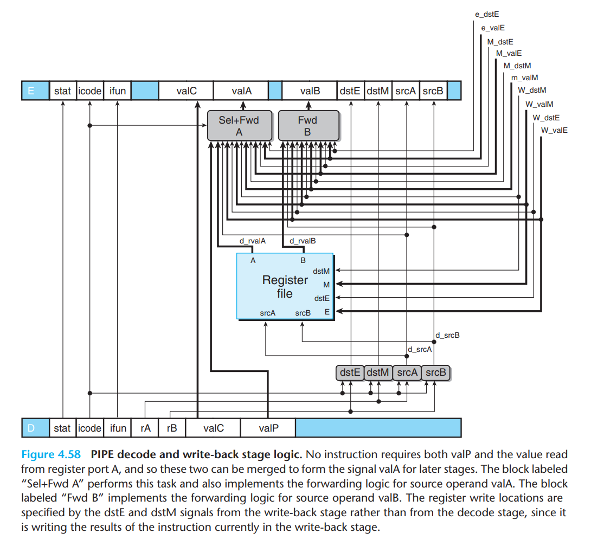

信号 `d_valA` 的转发源有：

|  数据字  | 寄存器 ID |           源描述            |
| :------: | :-------: | :-------------------------: |
| `e_valE` | `e_dstE`  |          ALU 输出           |
| `m_valM` | `M_dstM`  |          内存输出           |
| `M_valE` | `M_dstE`  | 访存阶段对端口 E 未进行的写 |
| `W_valM` | `W_dstM`  | 写回阶段对端口 M 未进行的写 |
| `W_valE` | `W_dstE`  | 写回阶段对端口 E 未进行的写 |

注意我们合并了信号 `valP` 和 `valA`。

```c
// What register should be used as the A source?
word d_srcA = [
	D_icode in { IRRMOVQ, IRMMOVQ, IOPQ, IPUSHQ  } : D_rA;
	D_icode in { IPOPQ, IRET } : RRSP;    // For popping from stack
	1 : RNONE; // Don't need register
];

// What register should be used as the B source?
word d_srcB = [
	D_icode in { IOPQ, IRMMOVQ, IMRMOVQ  } : D_rB;
	D_icode in { IPUSHQ, IPOPQ, ICALL, IRET } : RRSP;    // For computing new rsp
	1 : RNONE;  // Don't need register
];

// What register should be used as the E destination?
word d_dstE = [
	D_icode in { IRRMOVQ, IIRMOVQ, IOPQ} : D_rB;
	D_icode in { IPUSHQ, IPOPQ, ICALL, IRET } : RRSP;
	1 : RNONE;  // Don't write any register
];

// What register should be used as the M destination?
word d_dstM = [
	D_icode in { IMRMOVQ, IPOPQ } : D_rA;
	1 : RNONE;  // Don't write any register
];

// What should be the A value?
// Forward into decode stage for valA
word d_valA = [
	D_icode in { ICALL, IJXX } : D_valP; // Use incremented PC
	d_srcA == e_dstE : e_valE;    // Forward valE from execute
	d_srcA == M_dstM : m_valM;    // Forward valM from memory
	d_srcA == M_dstE : M_valE;    // Forward valE from memory
	d_srcA == W_dstM : W_valM;    // Forward valM from write back
	d_srcA == W_dstE : W_valE;    // Forward valE from write back
	1 : d_rvalA;  // Use value read from register file
];

word d_valB = [
	d_srcB == e_dstE : e_valE;    // Forward valE from execute
	d_srcB == M_dstM : m_valM;    // Forward valM from memory
	d_srcB == M_dstE : M_valE;    // Forward valE from memory
	d_srcB == W_dstM : W_valM;    // Forward valM from write back
	d_srcB == W_dstE : W_valE;    // Forward valE from write back
	1 : d_rvalB;  // Use value read from register file
];
```

上述 HCL 代码中的**五个转发源之间存在严格的优先级**。其他任何顺序都会使流水线出错。**执行阶段的转发源优先于访存阶段的转发源**，**访存阶段的转发源优先于写回阶段的转发源**。在访存或写回阶段，`dstM` 优先于 `dstE`，这和 SEQ 写回阶段 **M 端口优先于 E 端口**同理，保证 `popq %rsp` 指令被正确执行（也只有 `popq %rsp` 会关心访存或写回阶段这两个源的优先级）。


#### 执行阶段

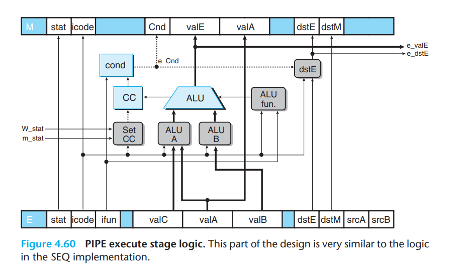

Set CC 的逻辑以信号 `m_stat` 和 `W_stat` 作为输入，决定是否更新条件码。它可以发现**一条导致异常的指令是否正在通过后面的流水线阶段**，决定是否允许更新条件码。

```c
// Select input A to ALU
word aluA = [
	E_icode in { IRRMOVQ, IOPQ } : E_valA;
	E_icode in { IIRMOVQ, IRMMOVQ, IMRMOVQ } : E_valC;
	E_icode in { ICALL, IPUSHQ } : -8;
	E_icode in { IRET, IPOPQ } : 8;
	// Other instructions don't need ALU
];

// Select input B to ALU
word aluB = [
	E_icode in { IRMMOVQ, IMRMOVQ, IOPQ, ICALL, 
		     IPUSHQ, IRET, IPOPQ } : E_valB;
	E_icode in { IRRMOVQ, IIRMOVQ } : 0;
	// Other instructions don't need ALU
];

// Set the ALU function
word alufun = [
	E_icode == IOPQ : E_ifun;
	1 : ALUADD;
];

// Should the condition codes be updated?
bool set_cc = E_icode == IOPQ &&
	// State changes only during normal operation
	!m_stat in { SADR, SINS, SHLT } && !W_stat in { SADR, SINS, SHLT };

// Generate valA in execute stage
word e_valA = E_valA;    // Pass valA through stage

// Set dstE to RNONE in event of not-taken conditional move
word e_dstE = [
	E_icode == IRRMOVQ && !e_Cnd : RNONE;
	1 : E_dstE;
];
```

#### 访存和写回阶段


PIPE 中没有 SEQ 中标号 Data 的块。这个块本来是用来在数据源 `valP` 和 `valA` 中选择的，它被译码阶段的 Sel+Fwd A 块替代了。

写回阶段的一小部分保持不变。当写回阶段有气泡时，我们希望状态码是 `AOK`。

```c
// Select memory address
word mem_addr = [
	M_icode in { IRMMOVQ, IPUSHQ, ICALL, IMRMOVQ } : M_valE;
	M_icode in { IPOPQ, IRET } : M_valA;
	// Other instructions don't need address
];

// Set read control signal
bool mem_read = M_icode in { IMRMOVQ, IPOPQ, IRET };

// Set write control signal
bool mem_write = M_icode in { IRMMOVQ, IPUSHQ, ICALL };

///* $begin pipe-m_stat-hcl */
// Update the status
word m_stat = [
	dmem_error : SADR;
	1 : M_stat;
];
///* $end pipe-m_stat-hcl */

// Set E port register ID
word w_dstE = W_dstE;

// Set E port value
word w_valE = W_valE;

// Set M port register ID
word w_dstM = W_dstM;

// Set M port value
word w_valM = W_valM;

// Update processor status
word Stat = [
	W_stat == SBUB : SAOK;
	1 : W_stat;
];
```

### 流水线控制逻辑

流水线控制逻辑处理下面 4 种控制情况：
- **加载 / 使用冒险**：一条从内存中读出值的指令和一条使用该值的指令之间，流水线需要**暂停一个周期**
- **处理 `ret`**：流水线**暂停三个周期**，等待 `ret` 到达写回阶段
- **预测错误的分支**：流水线**暂停两个周期**，取消被错误地放入流水线中的两条指令，同时将 PC 设置为正确的值
- **异常**：异常指令到达写回阶段时停止执行，禁止后面的指令更新程序员可见状态。

#### 特殊控制情况所期望的处理

只有 `mrmovq` 和 `popq` 会从内存中读数据，因此只有它们会引起加载 / 使用冒险。当**它们处于执行阶段，且需要其目的寄存器的指令处于译码阶段**时，我们应将第二条指令阻塞在译码阶段，并在下一个周期向执行阶段插入一个气泡。**将流水线寄存器 D 保持为固定状态**以实现阻塞，这还可以保证流水线寄存器 F 保持为固定状态，从而使下一条指令会被再取一次。


对于 `ret` 指令，流水线暂停三个时钟周期，直到 `ret` 经过访存阶段读出返回地址。我们没有办法在流水线取指阶段插入气泡，取指阶段错误地取出 `ret` 的下一条指令 `rrmovq`，但译码阶段被替换成了气泡，直到 3 个时钟周期后 `ret` 指令的访存阶段结束。

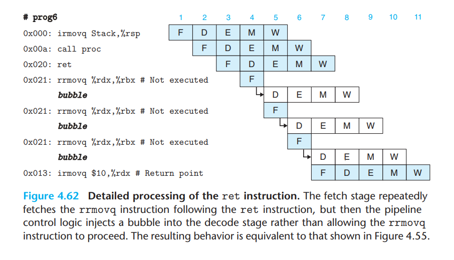

当**分支预测错误**时，控制逻辑会**在译码和执行阶段插入气泡**，取消两条错误的已取指令，同时将正确的指令读取到取指阶段。


**异常要么在取指阶段被发现，要么在访存阶段被发现**。**程序状态可能在执行、访存、写回阶段被更新**。当取指阶段的异常发生时，我们将异常信息作为指令状态的一部分通过流水线寄存器状态码记录下来，并继续取指、译码、执行，仿佛什么都没发生，**直到异常指令到达访存阶段**，我们才会采取措施：
- 禁止正处于执行阶段的指令设置条件码
- 向访存阶段插入气泡以禁止写入数据内存
- 当写回阶段有异常指令时，暂停写回阶段，从而暂停流水线。


#### 发现特殊控制条件

|      条件       |                               触发条件                               |
| :-------------: | :------------------------------------------------------------------: |
|   处理 `ret`    |               `IRET in [ D_icode, E_icode, M_icode ]`                |
| 加载 / 使用冒险 |   `E_icode in { IMRMOVQ, IPOPQ } && E_dstM in { d_srcA, d_srcB }`    |
| 预测错误的分支  |                     `E_icode == IJXX && !e_Cnd`                      |
|      异常       | `m_stat in { SADR, SINS, SHLT } \|\| W_stat in { SADR, SINS, SHLT }` |

#### 流水线控制机制

每个流水线寄存器有两个控制输入：**暂停（stall）**和**气泡（bubble）**。

- 正常状态下，这两个信号被置 `0`，流水线寄存器加载它的输入作为新的状态
- 暂停信号置 `1` 时，禁止更新状态，流水线寄存器保持它的当前状态，这使得指令被阻塞在某个流水线阶段
- 气泡信号置 `1` 时，流水线寄存器状态被设置成某个固定的**复位配置（reset configuration）**，得到一个等效 `nop` 的状态
- 不应该出现气泡和暂停信号都被置为 `1` 的情况
  
例如，向流水线寄存器 D 插入气泡，我们将 `icode` 字段置为 `INOP`；向流水线寄存器 E 中插入气泡，我们将 `icode` 字段置为 `INOP`，并将 `dstE`、`dstM`、`srcA` 和 `srcB` 字段置为 `RNONE`。


|      条件       |   F   |   D   |   E   |   M   |   W   |
| :-------------: | :---: | :---: | :---: | :---: | :---: |
|   处理 `ret`    | 暂停  | 气泡  | 正常  | 正常  | 正常  |
| 加载 / 使用冒险 | 暂停  | 暂停  | 气泡  | 正常  | 正常  |
| 预测错误的分支  | 正常  | 气泡  | 气泡  | 正常  | 正常  |

#### 控制条件的组合

我们考虑特殊控制条件的组合。可以发现，大多数特殊控制条件是互斥的，我们只需要考虑两种情况：

- 组合 A：`ret` 指令紧接着预测错误的 `jXX` 指令
- 组合 B：`ret` 指令紧接着用内存数据更新 `%rsp` 的指令 (`mrmovq D(rB), %rsp` 或 `popq %rsp`)

我们“合并”组合 A 条件的控制动作：

|       条件       |   F   |   D   |   E   |   M   |   W   |
| :--------------: | :---: | :---: | :---: | :---: | :---: |
|    处理 `ret`    | 暂停  | 气泡  | 正常  | 正常  | 正常  |
|  预测错误的分支  | 正常  | 气泡  | 气泡  | 正常  | 正常  |
| 预测失败 + `ret` | 暂停  | 气泡  | 气泡  | 正常  | 正常  |

在下一个周期，PC 选择逻辑会选择正确的指令（跳转指令的下一条指令），流水线寄存器 F 发生了什么是没有关系的，这种情况能被正确处理。

|                条件                |   F   |      D      |   E   |   M   |   W   |
| :--------------------------------: | :---: | :---------: | :---: | :---: | :---: |
|             处理 `ret`             | 暂停  |    气泡     | 正常  | 正常  | 正常  |
|          加载 / 使用冒险           | 暂停  |    暂停     | 气泡  | 正常  | 正常  |
|  加载 / 使用冒险 + `ret` 简单合并  | 暂停  | 气泡 + 暂停 | 气泡  | 正常  | 正常  |
| 加载 / 使用冒险 + `ret` 期望的情况 | 暂停  |    暂停     | 气泡  | 正常  | 正常  |

控制逻辑会试图暂停 `ret` 来避免加载 / 使用冒险，同时又会因为 `ret` 而向译码阶段插入一个气泡。显然，插入气泡并不是我们所期望的，我们希望它只是令译码阶段暂停。

|          条件           |   F   |   D   |   E   |   M   |               W               |
| :---------------------: | :---: | :---: | :---: | :---: | :---------------------------: |
|       处理 `ret`        | 暂停  | 气泡  | 正常  | 正常  |             正常              |
|     加载 / 使用冒险     | 暂停  | 暂停  | 气泡  | 正常  |             正常              |
|     预测错误的分支      | 正常  | 气泡  | 气泡  | 正常  |             正常              |
|     预测失败 + 跳转     | 暂停  | 气泡  | 气泡  | 正常  |             正常              |
| 加载 / 使用冒险 + `ret` | 暂停  | 暂停  | 气泡  | 正常  |             正常              |
|          异常           | 正常  | 正常  | 正常  | 气泡  | 如果 W 有异常, 暂停; 否则正常 |

#### 控制逻辑实现

控制逻辑产生流水线寄存器的暂停和气泡控制信号，并决定是否更新条件码寄存器。

```c
// Should I stall or inject a bubble into Pipeline Register F?
// At most one of these can be true.
bool F_bubble = 0;
bool F_stall =
	// Conditions for a load/use hazard
	E_icode in { IMRMOVQ, IPOPQ } &&
	 E_dstM in { d_srcA, d_srcB } ||
	// Stalling at fetch while ret passes through pipeline
	IRET in { D_icode, E_icode, M_icode };

// Should I stall or inject a bubble into Pipeline Register D?
// At most one of these can be true.
bool D_stall = 
	// Conditions for a load/use hazard
	E_icode in { IMRMOVQ, IPOPQ } &&
	 E_dstM in { d_srcA, d_srcB };

bool D_bubble =
	// Mispredicted branch
	(E_icode == IJXX && !e_Cnd) ||
	// Stalling at fetch while ret passes through pipeline
	// but not condition for a load/use hazard
	!(E_icode in { IMRMOVQ, IPOPQ } && E_dstM in { d_srcA, d_srcB }) &&
	  IRET in { D_icode, E_icode, M_icode };

// Should I stall or inject a bubble into Pipeline Register E?
// At most one of these can be true.
bool E_stall = 0;
bool E_bubble =
	// Mispredicted branch
	(E_icode == IJXX && !e_Cnd) ||
	// Conditions for a load/use hazard
	E_icode in { IMRMOVQ, IPOPQ } &&
	 E_dstM in { d_srcA, d_srcB};

// Should I stall or inject a bubble into Pipeline Register M?
// At most one of these can be true.
bool M_stall = 0;
// Start injecting bubbles as soon as exception passes through memory stage
bool M_bubble = m_stat in { SADR, SINS, SHLT } || W_stat in { SADR, SINS, SHLT };

// Should I stall or inject a bubble into Pipeline Register W?
bool W_stall = W_stat in { SADR, SINS, SHLT };
bool W_bubble = 0;
```


### 性能分析

一个加载 / 使用冒险产生一个气泡，分支预测错误两个，返回指令三个。我们用**CPI（Cycles Per Instruction，每指令周期数）**量化这些处罚对整体性能的影响。它是流水线平均吞吐量的倒数。若假设某段时间内，处理器一共处理了 $C_i$ 条指令和 $C_b$ 个气泡，那么：

$$\operatorname{CPI}=\frac{C_i+C_b}{C_i}=1.0+\frac{C_b}{C_i}$$

处罚项 $\frac{C_b}{C_i}$ 表明每执行一条指令平均插入的气泡数。我们可以将它分解成三项：

$$\operatorname{CPI}=1.0+\operatorname{lp}+\operatorname{mp}+\operatorname{rp}$$

### 未完成的工作

#### 多周期指令

整数乘法和除法、浮点运算等指令需要多个周期。在一个像 PIPE 这样性能中等的处理器中，浮点加法大约需要 3 到 4 个时钟周期，整数除法需要约 64 个时钟周期。

简单地，我们扩展执行阶段逻辑的功能，令这些指令在执行阶段逗留多个时钟周期，暂停取指和译码阶段。

更复杂地，我们**采用独立于主流水线的特殊硬件功能单元**。通常，整数乘除法与浮点操作都需要一个独立的功能单元。当这样的指令进入译码阶段时，它就会被**发射**到特殊单元，主流水线继续处理其他指令。通常，浮点单元本身也是流水线化的。

运用转发、暂停以及流水线控制等技术，我们仍能协调不同单元的操作，保证同步。

#### 与存储系统的接口

我们假设取指单元和数据内存都能在一个时钟周期内读或写内存中任意的位置，还忽略了自我修改代码。

利用**高速缓存（cache）存储器**、**翻译后备缓冲器（Translation Look-aside Buffer, TLB）**，大多数时候确实可能在一个时钟周期内读指令、读写数据。然而有时还会出现高速缓存**不命中（miss）**的情况。如果能从较高层的高速缓存或处理器主存中找到未命中的数据，流水线会简单地暂停 3 ~ 20 个时钟周期。高速缓存不命中以及随之而来的流水线同步问题都由硬件处理，以便使所需时间尽可能缩短。

有时，被引用的存储器位置实际上在磁盘存储器上。此时硬件会产生**缺页（page fault）**异常信号。这导致处理器调用操作系统的异常处理程序代码，这将发起一个从磁盘到主存的传送操作。完成后，操作系统返回到原先的程序，导致缺页的指令被重新执行。让硬件调用操作系统例程，然后操作系统例程又将控制返回给硬件，使得硬件和系统软件在处理缺页时协同工作。访问磁盘需要数百万个时钟周期，因此 OS 缺页中断处理程序的开销是可以忽略不计的。


# 优化程序性能

**妨碍优化的因素（optimization blocker）**：严重依赖于执行环境的程序行为

## 优化编译器的能力和局限性

```c
void twiddle1(long* xp, long* yp) {
    *xp += *yp;
    *xp += *yp;
}

void twiddle2(long* xp, long* yp) {
    *xp += 2 * *yp;
}
```

第一个过程效率更低，它需要 6 次访存，而第二个过程只需要 3 次。

然而因为可能存在**内存别名引用（memory aliasing）**，即 `xp == yp`，此时两个过程的行为将不一致，所以编译器无法将第一个过程优化为第二个。

```c
*q = 3000;
*p = 1000;
t1 = *q;  // t1 的值依赖于 p 和 q 是否相等
// 编译器无法确定两个指针是否指向同一位置
// 因此优化策略受到限制
```

**函数调用**也是妨碍优化的因素。编译器一般不会试图判断函数是否有**副作用**，它倾向于保持所有的函数调用不变。

```c
long f();

long func1() { return f() + f(); }

long func2() { return 2 * f(); }
```

编译器无法将 `func1` 优化为 `func2`，因为 `f` 可能有副作用。

> 可以用**内联函数替换**实现对函数调用的优化。但这会为 GDB 调试和代码剖析带来麻烦。

## 表示程序性能

引入**每元素的周期数（Cycles Per Element, CPE）**度量程序性能。

```c
void psum1(float a[], float p[], long n) {
    p[0] = a[0];
    for (long i = 1; i < n; i++) 
        p[i] = p[i-1] + a[i];
}

void psum2(float a[], float p[], long n) {
    p[0] = a[0];
    for (long i = 1; i < n - 1; i += 2) {
        float mid_val = p[i-1] + a[i];
        p[i] = mid_val;
        p[i+1] = mid_val + a[i+1];
    }
    // For even n, finish remaining element p[n-1]
    if (i < n)
        p[i] = p[i-1] + a[i];
}
```

许多过程含有在一组元素上迭代的循环，例如上图计算前缀和的两个函数。`psum1` 每次迭代计算结果向量的一个元素，`psum2` 利用**循环展开（loop unrolling）**，每次迭代计算两个元素。

以时钟周期为单位，两个函数的运行时间分别近似于 $368+9.0n$ 和 $368+6.0n$。系数 $9.0$ 和 $6.0$ 称为 **CPE 的有效值**，较小的 CPE 优于较大的 CPE。


## 程序示例

向量数据结构：

```c
typedef long data_t;  // Also int, float, double

typedef struct {
    long len;
    data_t* data;
} vec_rec, *vec_ptr;

/* Create vector of length len */
vec_ptr new_vec(long len) {
    vec_ptr res = (vec_ptr)malloc(sizeof(vec_rec));
    data_t* data = NULL;

    if (!res) return NULL;
    res->len = len;
    if (len > 0) {
        data = (data_t*)calloc(len, sizeof(data_t));
        if (!data) {
            free((void*)res);
            return NULL;
        }
    }
    res->data = data;
    return res;
}

/*
 * Retrieve vector element and store at dest.
 * Return 0 (out of bounds) or 1 (successful)
 */
int get_vec_element(vec_ptr v, long index, data_t* dest) {
    if (index < 0 || index >= v->len) return 0;
    *dest = v->data[index];
    return 1;
}

long vec_length(vec_ptr v) { return v->len; }
```

作为一个优化示例，考虑一个函数 `combine1`，它将一个向量中的所有元素合并为一个值：

```c
#define IDENT 0
#define OP +

void combine1(vec_ptr v, data_t *dest) {
    long i;
    *dest = IDENT;
    for (i = 0; i < vec_length(v); i++) {
        data_t val;
        get_vec_element(v, i, &val);
        *dest = *dest OP val;
    }
}
```

## 消除循环的低效率

将对 `vec_length` 的调用移出循环测试，可以避免对它的重复调用。这被称为**代码移动（code motion）**。

```c
void combine2(vec_ptr v, data_t *dest) {
    long i;
    long len = vec_length(v);  // Move vec_length out of loop
    *dest = IDENT;
    for (i = 0; i < len; i++) {
        data_t val;
        get_vec_element(v, i, &val);
        *dest = *dest OP val;
    }
}
```

编译器会尝试代码移动，然而它必须对函数调用非常小心，因此程序员需要显式地进行这一工作。

## 减少过程调用

`combine2` 中对函数 `get_vec_element` 的调用会检查索引越界，这是不必要的，因为显然所有的 `i` 都是合法索引。我们增加一个函数 `get_vec_start`，它返回向量的起始地址，用指针直接访问向量元素。这损害了程序的模块性，提高了耦合性，但理论上提高了性能。

```c
data_t* get_vec_start(vec_ptr v) { return v->data; }

void combine3(vec_ptr v, data_t *dest) {
    long i;
    long len = vec_length(v);
    data_t* data = get_vec_start(v);

    *dest = IDENT;
    for (i = 0; i < len; i++) {
        *dest = *dest OP data[i];
    }
}
```

**然而性能并没有明显提升，反而还略有下降**。内循环中的其他操作形成了瓶颈，它对性能的负面影响超过了反复进行 `get_vec_element` 的边界检查的开销。

## 消除不必要的内存引用

当 `data_t` 为 `double`，`OP` 为乘法时，内循环的 x86-64 代码：

```c
// dest in %rbx, data+i in %rdx, data+length in %rax
.L17:
    vmovsd  (%rbx), %xmm0    // read from mem
    vmulsd  (%rdx), %xmm0, %xmm0  // mult from mem
    vmovsd  %xmm0, (%rbx)    // write back to mem
    addq    $8, %rdx
    cmpq    %rax, %rbx
    jne     .L17
```

每次迭代时从内存中读出 `(%rbx)`，然后再将新的值写回 `(%rbx)`，这很浪费。

用临时变量 `acc` 替换不必要的内存引用 `*dest`：

```c
void combine4(vec_ptr v, data_t *dest) {
    long i;
    long len = vec_length(v);
    data_t* data = get_vec_start(v);
    data_t acc = IDENT;

    for (i = 0; i < len; i++) {
        acc = acc OP data[i];  // Only one mem ref per iteration
    }
    *dest = acc;
}
```

这显著提高了性能。

实际上 `combine3` 和 `combine4` 的行为可能不一致，例如当目标位置 `dest` 被设定为向量中的位置时（即出现**内存别名引用**）。这也是编译器没有将前者优化为后者的原因。

开 O2 后，`combine3` 的性能得到提升，利用寄存器 `%xmm0` 的值等于 `(%rbx)` 这一事实，去掉了一条 `vmovsd` 指令，但仍然不及 `combine4`：

```c
// Compiled O2
// dest in %rbx, data+i in %rdx, data+length in %rax
.L17:
    vmulsd  (%rdx), %xmm0, %xmm0  // mult from mem
    addq    $8, %rdx
    cmpq    %rax, %rbx
    vmovsd  %xmm0, (%rbx)    // write back to mem
    jne     .L17
```

## 理解现代处理器

实际的处理器往往同时对多条指令求值，称为**指令集并行**。

当一系列指令必须按照严格顺序执行时（一条未完，另一条不能开始），就会遇到**延迟界限（latency bound）**。它会限制程序性能。**吞吐量界限（throughput bound）**刻画处理器功能单元的原始计算能力，它是性能的终极限制。

### 整体操作

**超标量（superscalar）**：一个时钟周期内可以执行多个操作，而且是**乱序（out-of-order）**的。

整个设计分为**指令控制单元（Instruction Control Unit, ICU）**和**执行单元（Execation Unit, EU）**。前者从内存中读出指令序列，并根据指令序列生成一组针对程序数据的基本操作；后者执行这些操作。


ICU 从**指令高速缓存（instruction cache）**读取指令。通常，ICU 会在很早之前取指，保证有充足的时间译码，并把操作发送到 EU。对于分支预测，处理器使用**投机执行（speculative execution）**技术，它会取出预测分支会跳到的地方的指令，对它们译码，甚至执行，若过后确定分支预测错误，会将状态重新设定回分支点的状态，并开始取出执行另一个方向上的指令。分支预测集成在*取指控制*的块中。指令*译码逻辑*接收实际的指令，将它们转换为一组基本操作（微操作）。这些操作被发送到 EU，EU 将其分派到各个*功能单元*加以执行。

加载单元和存储单元各有一个加法器完成地址计算，它们通过**数据高速缓存（data cache）**访问数据内存。数据高速缓存和退役单元是执行结果与程序寄存器和数据内存之间的一层屏障，它们保证分支预测错误造成的错误指令的执行结果不会写入寄存器和数据内存。如果分支预测错误，EU 会丢弃分支点之后计算出来的结果，并发信号给分支单元，指出分支预测错误和正确的分支目的。不同功能单元的功能往往有重合，例如 Intel Core i7 Haswell 参考机有 8 个功能单元，其中 4 个可以执行整数操作，2 个可以执行加载操作，2 个可以执行浮点乘法。

ICU 中，**退役单元（retirement unit）**记录正在进行的处理，控制寄存器文件的更新。译码时，关于指令的信息被放在一个 FIFO 队列。一旦一条指令被完成，且所有引起此指令的分支点被确认为预测正确，那么这条指令就可以**退役（retired）**了，所有对程序寄存器的更新也就可以被执行了。如果引起此指令的某个分支点预测错误，那么这条指令就会被**清空（flushed）**，它的计算结果被丢弃。

各种信息可以在执行单元之间传送（数据转发），最常见的机制是**寄存器重命名（register renaming）**。当一条更新寄存器 `r` 的指令译码时，产生标记 `t`，条目 `(r, t)` 被加入到一张重命名表中。**重命名表包含有未进行的写操作的寄存器**。当随后以 `r` 为操作数的指令译码时，发送到执行单元的操作会包含 `t` 作为操作数源的值。当某个执行单元完成第一个操作时，会生成结果 `(v, t)`，所有等待 `t` 作为源的操作就可以使用 `v` 作为源值了。

### 功能单元的性能

延迟（latency）：完成运算所需的总时间
发射时间（issue time）：两个连续的同类型的运算之间需要的最小时钟周期数
容量（capacity）：能够执行该运算的功能单元的数量

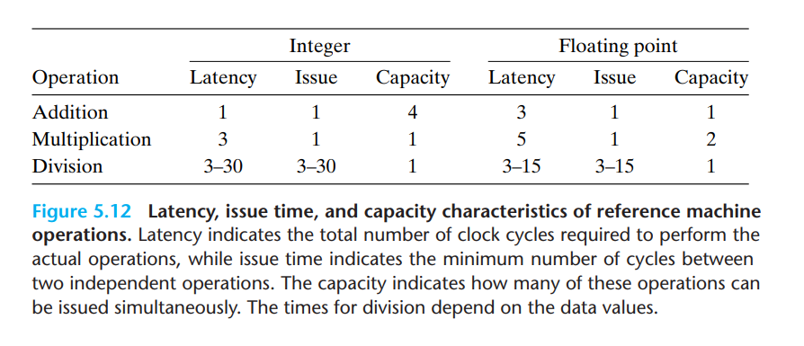

发射时间为 $1$ 的功能单元是**完全流水线化（fully pipelined）**的，它表明每个时钟周期都可以开始一个新的运算。除法器不是完全流水线化的，它的发射时间等于延迟，这意味着在开始新运算之前，除法器必须完成整个除法。由于不同的除法计算需要的步骤不一样，所以除法的发射和延迟是一个范围。

**最大吞吐量：容量与发射时间的比值**。

|    界限    | 整数加法 | 整数乘法 | 浮点加法 | 浮点乘法 |
| :--------: | :------: | :------: | :------: | :------: |
|  延迟界限  |   1.00   |   3.00   |   3.00   |   5.00   |
| 吞吐量界限 |   0.50   |   1.00   |   1.00   |   0.50   |

延迟界限给出了每条指令不重叠执行时的最小 CPE 值。

吞吐量界限根据功能单元产生结果的最大速率给出了 CPE 的最小界限。虽然整数加法的吞吐量是 $0.25$，但由于需要从内存读数据，而每个时钟周期只能读两个数据，因此吞吐量界限是 $0.50$.


### 处理器操作的抽象模型

|    函数    | 整数加法 | 整数乘法 | 浮点加法 | 浮点乘法 |
| :--------: | :------: | :------: | :------: | :------: |
| `combine4` |   1.27   |   3.01   |   3.01   |   5.01   |
|  延迟界限  |   1.00   |   3.00   |   3.00   |   5.00   |
| 吞吐量界限 |   0.50   |   1.00   |   1.00   |   0.50   |

检查一下 `combine4` 的 CPE 测量值，可以发现：**除了整数加法的情况，测量值与处理器的延迟界限是一致的**。这表明函数性能取决于求和 / 乘积运算。

计算 $n$ 个元素的合并运算需要约 $nL+K$ 个时钟周期，其中 $L$ 是合并运算的延迟界限，$K$ 表示调用函数、初始化以及终止循环的开销。因此，CPE 就等于 $L$。

#### 程序的数据流图

```c
// Inner loop of combine4, data_t = double, OP = *
// acc in %xmm0, data+i in %rdx, data+length in %rax
.L25:
    vmulsd  (%rdx), %xmm0, %xmm0  // acc *= data[i]
    addq    $8, %rdx    // ++i
    cmpq    %rax, %rdx
    jne     .L25
```


我们将循环代码片段中访问的寄存器分为四类：
- **只读**：只用作源操作数，如 `%rax`
- **只写**：只用作目的操作数
- **局部**：源和目的，但迭代和迭代之间不相关，如条件码寄存器
- **循环**：源和目的，且迭代之间相关，如 `%rdx` `%xmm0`

**循环寄存器之间的操作链**决定了性能的瓶颈。

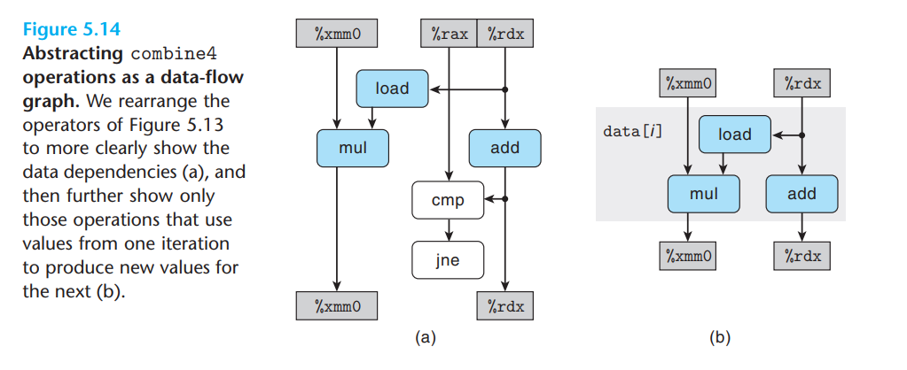

5-14a 中，不属于循环寄存器间的相关链的操作被标注为白色，例如 `cmp` 和 `jne`，我们假设它们被完成得足够快，不影响性能。去掉这些操作后，我们得到 5-14b，它只显示一次迭代中循环寄存器之间的数据相关。

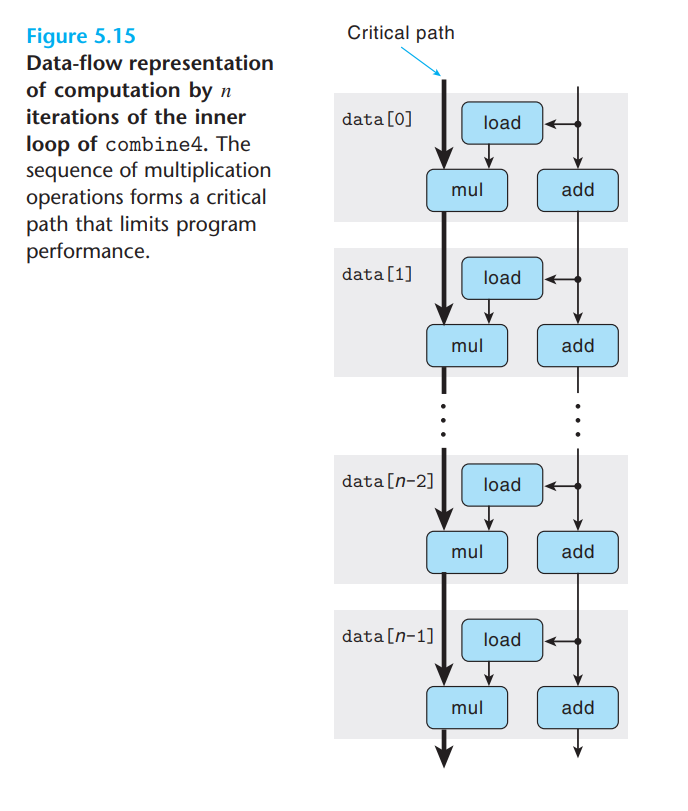

将 $n$ 次迭代的数据流表示串联起来，就得到图 5-15。程序有两条数据相关链，由于浮点乘法的延迟比整数加法大，所以左边的链是**关键路径（critical path）**。

除了整数加法的情况以外，`combine4` 的关键路径长度等于 $nL$，这和之前的测试吻合。如何对程序做变换，使得唯一的限制变成吞吐量界限？


## 循环展开

$k\times 1$ 循环展开的上限是 $n-k+1$，每次迭代对索引 `i` 到 `i+k-1` 的 $k$ 个元素进行计算，然后令索引 `i += k`。最后，对剩余的元素进行计算。

```c
/* 2 * 1 loop unrolling */
void combine5(vec_ptr v, data_t* dest) {
    long i;
    long len = vec_length(v);
    long limit = len - 2 + 1;
    data_t* data = get_vec_start(v);
    data_t acc = IDENT;

    /* Combine 2 elements at a time */
    for (i = 0; i < limit; i += 2) {
        acc = (acc OP data[i]) OP data[i+1];
    }

    /* Finish any remaining elements */
    for (; i < len; i++) {
        acc = acc OP data[i];
    }
    *dest = acc;
}
```

|    函数    | 整数加法 | 整数乘法 | 浮点加法 | 浮点乘法 |
| :--------: | :------: | :------: | :------: | :------: |
| `combine4` |   1.27   |   3.01   |   3.01   |   5.01   |
| `combine5` |   1.01   |   3.01   |   3.01   |   5.01   |
|  延迟界限  |   1.00   |   3.00   |   3.00   |   5.00   |
| 吞吐量界限 |   0.50   |   1.00   |   1.00   |   0.50   |

整数加法进步明显，但其他情况没有改进。

```c
.L35:
    vmulsd    (%rax, %rdx, 8), %xmm0, %xmm0
    vmulsd    8(%rax, %rdx, 8), %xmm0, %xmm0
    addq      $2, %rdx
    cmpq      %rdx, %rbp    
    jg        .L35
```


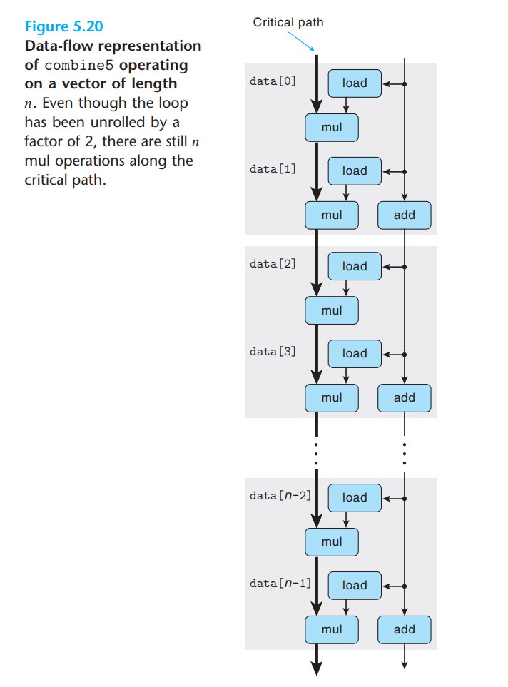

可以看到，性能没有根本提升的原因在于 gcc 生成的代码中，**每次迭代的两次乘法仍然不是并行的，它们之间存在数据相关**，因此关键路径上仍然有 $n$ 个乘法操作。

只要优化等级够高，编译器就会自动进行循环展开。


## 提高并行性

加法和乘法的单元是完全流水线化的，然而我们囿于数据相关，并未利用这一点。

### 多个累计变量

```c
/* 2 * 2 loop unrolling */
void combine6(vec_ptr v, data_t* dest) {
    long i;
    long len = vec_length(v);
    long limit = len - 1;
    data_t* data = get_vec_start(v);
    data_t acc0 = IDENT;
    data_t acc1 = IDENT;

    /* Combine 2 elements at a time w/ 2 acculators */
    for (i = 0; i < limit; i += 2) {
        acc0 = acc0 OP data[i];    // even indices
        acc1 = acc1 OP data[i+1];  // odd indices
    }

    /* Finish any remaining elements */
    for (; i < len; i++) {
        acc0 = acc0 OP data[i];
    }

    /* Combine the two accumulators */
    *dest = acc0 OP acc1;
}
```

我们既做循环展开，又做两路并行，这提高了所有情况的性能，并且打破了延迟界限：

|    函数    | 整数加法 | 整数乘法 | 浮点加法 | 浮点乘法 |
| :--------: | :------: | :------: | :------: | :------: |
| `combine4` |   1.27   |   3.01   |   3.01   |   5.01   |
| `combine5` |   1.01   |   3.01   |   3.01   |   5.01   |
| `combine6` |   0.81   |   1.51   |   1.51   |   2.51   |
|  延迟界限  |   1.00   |   3.00   |   3.00   |   5.00   |
| 吞吐量界限 |   0.50   |   1.00   |   1.00   |   0.50   |


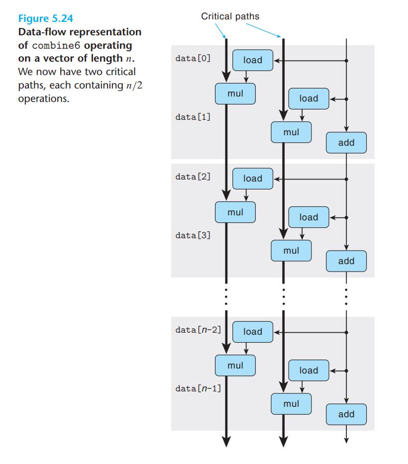

关键路径的长度缩小到了 $\frac{n}{2}$。

将循环展开 $k$ 次，并且并行地累积 $k$ 个值，就得到 $k\times k$ 循环展开。$k$ 足够大时，程序在所有情况下几乎都能达到吞吐量界限（这需要使能够执行运算操作的功能单元的流水线始终是满的）。对延迟为 $L$，容量为 $C$ 的操作，这要求 $k\geq C\cdot L$。

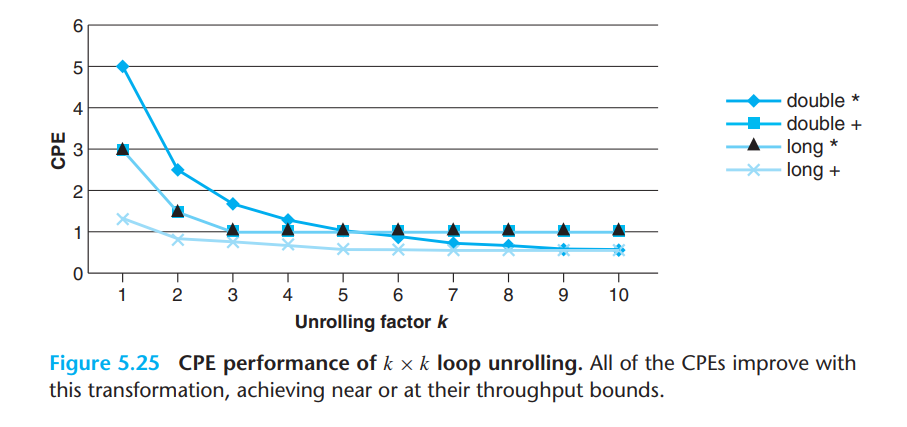

对于整数运算，`combine6` 的结果和 `combine5` 一致。然而对于浮点运算，由于**结合律不成立**，`combine6` 的结果和 `combine5` 可能不一致（偶数索引都极大，奇数索引都极小）。有些编译器会对整数运算做类似的变换，但大部分编译器不会对浮点运算做此类变换。

### 重新结合变换

```c
/* 2 * 1a loop unrolling */
void combine7(vec_ptr v, data_t* dest) {
    long i;
    long len = vec_length(v);
    long limit = len - 1;
    data_t* data = get_vec_start(v);
    data_t acc = IDENT;

    for (i = 0; i < limit; i += 2) {
        // different from combine5, which is
        // acc = (acc OP data[i]) OP data[i+1];
        acc = acc OP (data[i] OP data[i+1]);
    }

    /* Finish any remaining elements */
    for (; i < len; i++) {
        acc = acc OP data[i];
    }
    *dest = acc;
}
```

它与 `combine5` 的唯一区别只在括号的位置，这被称为**重新结合变换（reassociation transformation）**，它可以带来意想不到的性能提升：整数加法的性能与 `combing5` 相当，而其他情况的性能与 `combine6` 相当，是 `combing5` 的两倍。

|    函数    | 整数加法 | 整数乘法 | 浮点加法 | 浮点乘法 |
| :--------: | :------: | :------: | :------: | :------: |
| `combine4` |   1.27   |   3.01   |   3.01   |   5.01   |
| `combine5` |   1.01   |   3.01   |   3.01   |   5.01   |
| `combine6` |   0.81   |   1.51   |   1.51   |   2.51   |
| `combine7` |   1.01   |   1.51   |   1.51   |   2.51   |
|  延迟界限  |   1.00   |   3.00   |   3.00   |   5.00   |
| 吞吐量界限 |   0.50   |   1.00   |   1.00   |   0.50   |

重新结合变换减少了数据相关，只有 `acc` 与 `data[i] OP data[i+1]` 之间的 `mult` 运算存在迭代中的数据相关。本次迭代中 `data[i]` 和 `data[i+1]` 之间的 `mult` 不必等到上一次迭代结束才能执行，即下次迭代的第一个乘法和本次迭代的第二个乘法是重叠执行的。


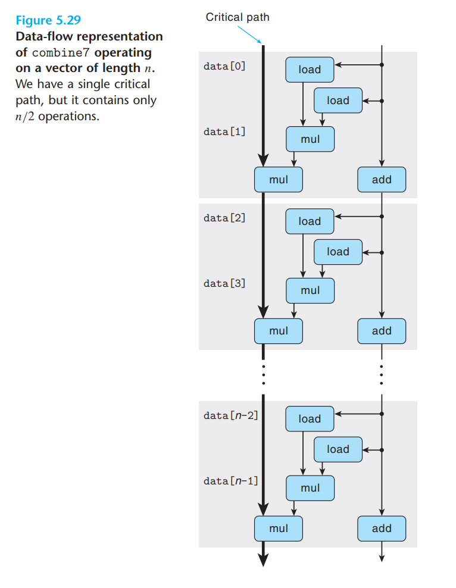

$k\times 1a$ 循环展开的 CPE 随着 $k$ 增大，也会趋近于吞吐量界限。

对于浮点，编译器一般不会做重新结合变换。

```c
double aprod(double a[], long n) {
    long i;
    double x, y, z;
    for (i = 0; i < n - 2; i += 3) {
        x = a[i]; y = a[i+1]; z = a[i+2];
        // How to reassociate?
        r = r * x * y * z;    
    }
    for (; i < n; i++) {
        r = r * a[i];
    }
    return r;
}

r = ((r * x) * y) * z;    // 关键路径有 3 个乘法
r = (r * (x * y)) * z;    // 关键路径有 2 个乘法
r = r * ((x * y) * z);    // 关键路径有 1 个乘法
r = r * (x * (y * z));    // 关键路径有 1 个乘法
r = (r * x) * (y * z);    // 关键路径有 2 个乘法

// x, y, z 之间不会有数据相关，主要目的是消除 r 的数据相关
```


> Intel 在 1999 年引入了 **SSE 指令**（Streaming SIMD Extension, 流 SIMD 扩展），其中 **SIMD** 即 Single-Instruction, Multiple-Data。SSE 历经几代，目前最新版本为 **AVX**（Advanced Vector Extension, 高级向量扩展）。
> SIMD 执行模型是用单条指令操作整个向量数据，这些向量保存在**向量寄存器**（vector register）中，名字为 `%ymm0` ~ `%ymm15`。目前的 AVX 向量寄存器长 32 字节，可保存整数或浮点数。AVX 指令可以对这些寄存器执行向量操作，如并行执行 8 组或 4 组数值的加法或乘法。
> gcc 对 C 的扩展支持向量操作，使用向量操作可以获得比 `combine6` 更高的性能（向量操作有着不同的吞吐量界限）。

## 一些限制因素

### 寄存器溢出

如果并行度 $p$ 超过了可用的寄存器数量，那么编译器会诉诸**溢出（spilling）**，将一些临时值存放在内存上（一般是运行时堆栈）。因此，$20\times 20$ 的循环展开的性能可能比 $10\times 10$ 的循环展开差。

### 分支预测和预测错误处罚

#### 不要过分关心可预测的分支

#### 书写适合用条件传送实现的代码

三目运算符是好的。

```c
/* CPE = 13.5 */
void minmax1(long a[], long b[], long n) {
    long i;
    for (i = 0; i < n; i++) {
        if (a[i] > b[i]) {
            long t = a[i];
            a[i] = b[i];
            b[i] = t;
        }
    }
}

/* CPE = 4.0 */
void minmax2(long a[], long b[], long n) {
    long i;
    for (i = 0; i < n; i++) {
        long min = a[i] < b[i] ? a[i] : b[i];
        long max = a[i] < b[i] ? b[i] : a[i];
        a[i] = min;
        b[i] = max;
    }
}
```

## 理解内存性能

参考机有两个加载单元，每个可以保存 72 个未完成的读请求。它还有一个存储单元，可以保存 42 个写请求。它们通常可以每个时钟周期开始一个操作。

### 加载的性能

如果每个被计算的元素都需要加载 $k$ 个值，那么 CPE 不可能小于 $k/N$，其中 $N$ 为加载单元的数量。

### 存储的性能

没有加载，只有存储的操作不会产生数据相关。

**写 / 读相关（write/read dependency）**：一个内存读的结果依赖于一个最近的内存写。它会导致性能下降。

存储缓冲区包含已经被发射到存储单元但还未完成的存储操作的地址及数据。加载操作会先检查存储缓冲区，若地址匹配，则从缓冲区取出对应数据作为结果（类似转发）。

```c
void write_read(long *src, long *dest, long n) {
    long cnt = n;
    long val = 0;

    while (cnt) {
        *dst = val;
        val = *src + 1;
        cnt--;
    }
}

write_read(&a[0], &a[1], 3);    // A
write_read(&a[0], &a[0], 3);    // B
```

A 没有写 / 读相关，B 有写 / 读相关。

```c
// Inner loop of write_read
// src in %rdi, dst in %rsi, val in %rax
.L3：
    movq    %rax, (%rsi)    
    movq    (%rdi), %rax
    addq    $1, %rax
    subq    $1, %rdx
    jne     .L3
```


存储操作被分为 `s_addr` 和 `s_data`，前者在存储缓冲区建立条目并设置地址，后者设置此条目的数据字段。

对于 A，源和目的地址不同，没有数据相关，唯一的关键路径是 `cnt--` 构成的；对于 B，源和目的地址相同，这使得 `s_data` 和 `load` 之间产生了数据相关，关键路径成为了存储、加载和增加数据的链。

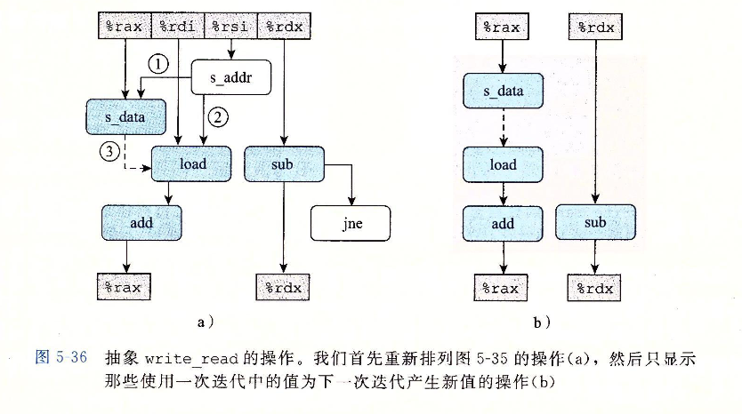


# 存储器层次结构

局部性（locality）：具有良好局部性的程序倾向于多次访问相同 / 邻近的数据项集合，因此性能更好。

## 存储技术

### 随机访问存储器

随机访问存储器（Random Access Memory, RAM）分为静态的（static, SRAM）和动态的（dynamic, DRAM）。

SRAM 比 DRAM 更快，但也更贵。

#### SRAM

每个位被存储在一个**双稳态的（bistable）**存储器单元。每个单元用一个**六晶体管电路**实现，只要有电，它就可以**无限期地**保持在两个不同的电压配置（configuration）或状态（state）之一，类似于一个**倒转钟摆**。倒转钟摆有左稳态和右稳态，以及一个中间的亚稳态。虽然钟摆也可以保持在中间的亚稳态，但任何细微的扰动都会使它倒回左或右稳态。

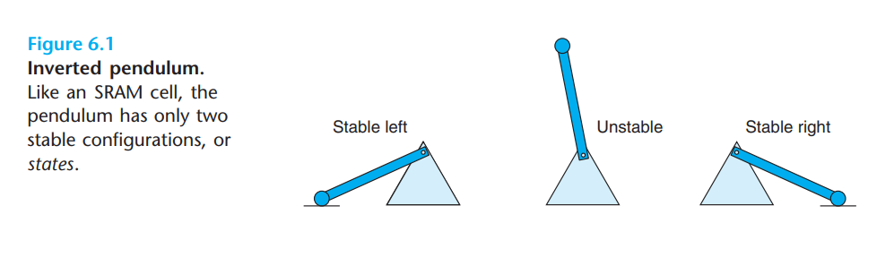

即使有干扰扰乱电压，当干扰消除时，电路就会回到稳定值，但断电后，SRAM 的信息也会丢失。

SRAM 一般用作高速缓存存储器，一般不会超过数兆字节

#### DRAM

每个位存储为对一个小电容（$30$ 毫微微法拉，$30\times 10^{-15}$ 法拉）的充电。每个单元由**一个电容和一个访问晶体管**组成，因此可以制作得很密集。

DRAM 对干扰敏感，电容的电压被扰乱后，它就永远无法恢复了。光会导致电容电压改变，数码相机和摄像机的传感器本质上也是 DRAM 阵列。

DRAM 需要刷新。DRAM 单元可能在 $10\sim 100$ 毫秒内失去电荷（幸运的是，时钟周期是以纳秒衡量的），内存系统必须周期性地通过**读出，然后重写**刷新内存的每一位。有些系统也使用纠错码，例如将 64 位字编码为 72 位。

| | 每位晶体管数 | 相对访问时间 | Persistent? | Sensitive? | 相对花费 | 应用 |
| SRAM | 6 | $1\times$ | 是 | 否 | $1000\times$ | 高速缓存存储器 |
| DRAM | 1 | $10\times$ | 否 | 是 | $1\times$ | 主存、图形系统的帧缓冲区 |

SRAM 使用的晶体管多于 DRAM，因而密集度更低。

#### 传统的 DRAM

DRAM 芯片中有 $d$ 个**超单元（supercell）**，每个超单元由 $\omega$ 个 DRAM 单元组成，可以存储 $\omega$ 位信息。$d\times \omega$ 的 DRAM 总共存储 $d\omega$ 位信息。

下图展示了一个 $16\times 8$ 的 DRAM 芯片的组织。$d=16$ 个超单元被组织成 $r=4$ 行 $c=4$ 列的矩形阵列。每个超单元有形如 $(r, c)$ 的地址。信息通过称为**引脚（pin）**的外部连接器流入和流出芯片。每个引脚携带 1 位信号。

8 个 `data` 引脚：传送一个字节到芯片或从芯片传出一个字节
2 个 `addr` 引脚：携带 2 位的行和列超单元地址
还有其他的携带控制信息的引脚

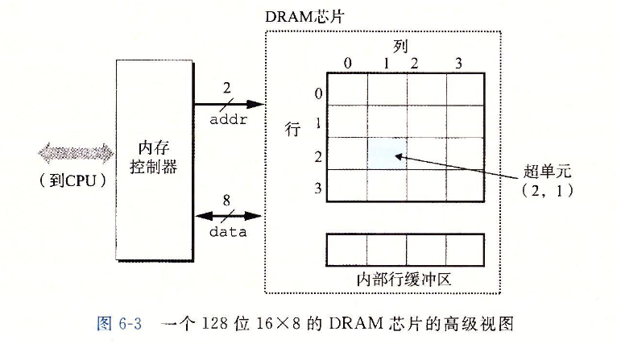

每个 DRAM 芯片被连接到称为**内存控制器（memory controller）**的电路。这个电路可以**一次传送 $\omega$ 位到每个 DRAM 芯片，或从每个 DRAM 芯片传出 $\omega$ 位**。

内存控制器将行地址 **RAS**（Row Access Strobe，行访问选通脉冲）和列地址 **CAS**（Column Access Strobe，列访问选通脉冲）先后发送到 DRAM，DRAM 把超单元的内容发回控制器。RAS 和 CAS 请求共享相同的 DRAM 地址引脚


读超单元 $(2,1)$ 时，内存控制器先从地址引脚发送行地址 $2$，DRAM 会将整个第 $2$ 行复制到内部行缓冲区。接着，内存控制器发送列地址 $1$，DRAM 从行缓冲区中取出超单元 $(2,1)$ 的 $8$ 位内容，通过 `data` 引脚返回给内存控制器。

DRAM 被组织成二位阵列而不是线性数组是为了**降低芯片上地址引脚数量**，其缺点是必须分两步发送地址，增加了访问时间。

#### 内存模块

DRAM 芯片被封装在**内存模块（memory module）**，它插在主板扩展槽上。

> Core i7 系统使用 240 引脚的**双列直插内存模块（Dual Inline Memory Module, DIMM）以 64 位为块传送数据进出内存控制器

例如，下面的一个内存模块用 8 个 64 Mbit（$8M\times 8$）的 DRAM 芯片存储 64 MB。8 个芯片编号为 $0\sim 7$。每个超单元存储主存的一个字节，用地址为 $(i, j)$ 的 8 个超单元表示主存中特定地址 A 处的 64 位字。

取出内存地址 A 处的一个字：内存控制器将 A 转换为超单元地址 $(i, j)$ 发送给 A 所在的内存模块，内存模块将 $i$ 和 $j$ 广播到每个 DRAM，每个DRAM 输出它的超单元 $(i, j)$ 的 8 位内容，模块电路将 8 个输出收集并合并成一个 64 位字，返回给内存控制器。

多个内存模块连接到内存控制器，就可以聚合成主存。


#### 增强的 DRAM

基于传统 DRAM 的改进。

**快页模式 DRAM**（Fast Page Mode DRAM, **FPM DRAM**）：传统 DRAM 将一整行超单元复制到其内部行缓冲区，只使用其一，丢弃剩余的。FPM DRAM **允许暂时保留行缓冲区的内容**。为了读出同一行的 4 个超单元，内存控制器可以发送第一个 RAS/CAS 请求，后面跟三个 CAS 请求。初始的 RAS/CAS 请求将指定行复制到行缓冲区，并返回第一个要读取的超单元，后三个 CAS 请求直接中行缓冲区获得要读的超单元。

**扩展数据输出 DRAM**（Extended Data Out DRAM, **EDO DRAM**）：**FPM DRAM 的增强**，允许各个 CAS 信号在时间上靠得更紧密

**同步 DRAM**（Synchronous DRAM, **SDRAM**）：常规的、FPM DRAM、EDO DRAM 与内存控制器通信时使用的是一组显式的控制信号，因此可以说是异步的。SDRAM **用与驱动内存控制器相同的外部时钟信号的上升沿代替许多这种控制信号**，提高输出速度

**双倍数据速率同步 DRAM**（Double Data-Rate Synchronous DRAM, **DDR SDRAM**）：**SDRAM 的增强**。使用两个时钟沿作为控制信号，使速度翻倍。不同类型的 DDR SDRAM 是用提高有效带宽的很小的预取缓冲区的大小划分的：DDR（2 位）、DDR2（4 位）、DDR3（8 位）

**视频 RAM**（Video RAM, **VRAM**）：用于图形系统的**帧缓冲区**。与 FPM DRAM 类似，主要区别是：VRAM 输出是通过依次对内部缓冲区的整个内容进行移位得到的；VRAM 允许对内存并行地读和写，系统可以在写的同时用帧缓冲区中的像素读（刷新屏幕）

> 直到 1995 年，大部分 PC 都使用 FPM DRAM。1996~1999 年，EDO DRAM 在市场上占据了主导，取代了 FPM DRAM。SDRAM 最早出现于 1995 年的高端系统，到 2002 年，大多数 PC 都已经采用了 SDRAM 和 DDR SDRAM。到 2010 年，大多数服务器和桌面系统都是用 DDR3 SDRAM 构造的。


#### 非易失性存储器

断电后，DRAM 和 SRAM 的信息会丢失，所以它们是**易失**（volatile）的。**非易失性存储器**（nonvolatile memory）可以保持信息，即使断电也不会丢失。

虽然有的 ROM 既可以读也可以写，但是它们整体都被称为**只读存储器**（Read-Only Memory, ROM）。ROM 是以**能够被重编程（写）的次数**，以及对它们**重编程所用的机制**区分的。

**可编程 ROM**（Programmable ROM, **PROM**）：只能被编程一次。每个存储器单元有一种**熔丝**（fuse），只能用高电流熔断一次

**可擦写可编程 ROM**（Erasable Programmable ROM, **EPROM**）：有一个透明的石英窗口，允许光到达存储单元。**紫外线光**照射进窗口，EPROM 单元就被**清零**。对它的编程（写 1）**通过一种特殊设备**完成。可以被擦除和重编程约 $1000$ 次。

**电子可擦除 PROM**（Electrically Erasable PROM, **EEPROM**）：EPROM 的增强，不需要一个物理上独立的编程设备，EEPROM 可以被编程数万次。

**闪存**（flash memory）：基于 EEPROM。它无处不在：数码相机、手机、音乐播放器、PDA、笔记本电脑、台式机和服务器等。

存储在 ROM 设备中的程序称为**固件（firmware）**。当计算机系统通电后，固件被运行。一些系统在固件中提供了基本的输入输出函数，例如 PC 的 BIOS（Basic Input/Output System）例程。复杂的设备如图形卡和磁盘驱动控制器，也依赖固件翻译来自 CPU 的 I/O 请求。

#### 访问主存

数据流通过称为**总线（bus）**的共享电子电路在 CPU 和 DRAM 主存间传送。每次传送经过的一系列步骤称为**总线事务（bus transaction）**。读事务（read transaction）从主存传送数据到 CPU，写事务（write transaction）从 CPU 传送数据到主存。

总线是一组并行的导线，可以携带地址、数据和控制信号。地址和数据可以共享同一组导线，也可以不。不同的设备也可以共享同一组导线。控制线携带的信号会同步事务，并标识出当前正在执行的事务的类型。


I/O 桥接器（IO bridge）是一个包括内存控制器的芯片组，将系统总线的控制信号翻译成内存总线的电子信号。I/O 桥也将系统总线和内存总线连接到 I/O 总线，磁盘和图形卡等 I/O 设备共享 I/O 总线。

> Intel 系统使用北桥（northbridge）和南桥（southbridge）芯片组，分别将 CPU 连接到内存和 I/O 设备。在较老的 Pentium 和 Core 2 系统中，前端总线（Front Side Bus, FSB）将 CPU 连接到北桥。AMD 系统将 FSB 替换为超传输（HyperTransport）互联，而更新一些的 Intel Core i7 系统使用快速通道（QuickPath）互联。

当指令 `movq A, %rax` 执行时：
- CPU 芯片上称为**总线接口**（bus interface）的电路在总线上发起读事务
    - CPU 将地址 A 放在系统总线上，I/O 桥将信号传递到内存总线
    - 主存接收到内存总线上的地址信号，从内存总线读地址，从 DRAM 取出数据字，将其写到内存总线。I/O 桥将内存总线信号翻译成系统总线信号，沿着系统总线传递
    - CPU 接收到系统总线上的数据，将其写入寄存器 `%rax`

同样的，当指令 `movq %rax, A` 执行时，CPU 发起写事务，步骤相仿。

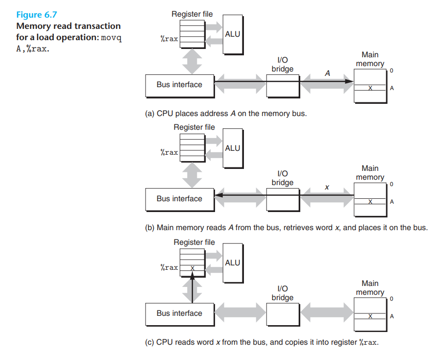

### 磁盘存储

**磁盘**容量很大，但速度为**毫秒级**，比 DRAM 慢 $10$ 万倍，比 SRAM 慢 $100$ 万倍。

#### 磁盘构造

磁盘由**盘片（platter）**构成，每个盘片有两个**表面（surface）**，上面覆盖着磁性记录材料。盘片中央有可以旋转的**主轴（spindle）**，使得盘片以固定的**旋转速率（rotational rate）**（一般为 $5400\sim 15000$ RPM）旋转。

表面由称为**磁道（track）**的同心圆组成，每个磁道被划分为**扇区（sector）**，**每个扇区存储相等容量的数据**（一般为 512 字节）。扇区之间由**间隙（gap）**分隔，间隙不存储数据位，而是存储用来标识扇区的格式化位。

多个盘片叠放在一个密封的包装里，整个装置称为**磁盘驱动器（disk drive）**，简称磁盘（disk），也称旋转磁盘（rotating disk）。

**柱面（cylinder）**是所有表面上到主轴中心距离相等的磁道的集合。例如，三个盘片六个表面的磁盘，一个柱面就会包含 $6$ 个磁道。


#### 磁盘容量

磁盘的最大容量由
- **记录密度（recording density）**：每英寸磁道中可以放入的位数
- **磁道密度（track density）**：从盘片中心出发一英寸的径向线段内的包含的磁道数
- **面密度（areal density）**：记录密度和磁道密度的积
决定。

最初，每个磁道拥有的扇区数相同，由最内侧的磁道能记录的扇区数决定。随着技术提升，面密度快速提高，这种设计的磁盘的外侧磁道上的间隙变得不可接受地大。

现代大容量磁盘采用**多区记录（multiple zone recording）**技术，所有柱面的集合被划分成数个不相交子集，称为**记录区（recording zone）**。每个记录区包含一组连续的柱面。同一记录区中的每个柱面的磁道拥有相同数量的扇区，此数量由该区最内侧的磁道所能包含的扇区数决定。

$$\operatorname{Capacity}=\frac{\text{\# bytes}}{\text{sector}} \times \frac{\text{average \# sectors}}{\text{track}} \times \frac{\text{\# tracks}}{\text{surface}} \times \frac{\text{\# surfaces}}{\text{platter}} \times \frac{\text{\# platters}}{\text{disk}}.$$

> 对于 **DRAM 和 SRAM** 的容量，通常以 $K=2^{10}, M=2^{20}, G=2^{30}, T=2^{40}$ 为单位
> 而对于**磁盘和网络等 I/O 设备**的容量，通常以 $K=10^3, M=10^6, G=10^9, T=10^{12}$ 为单位。

#### 磁盘操作

磁盘用**读 / 写头（read/write head）**来读写存储在磁性表面的位，读写头连接到一个传动臂（actuator arm）的一端。

通过径向转动传动臂，驱动器可以将读写头定位在盘面上的任何磁道上。定位磁道的过程称为**寻道（seek）**。

寻道成功后，读写头可以读出或修改它所指的位。**每个盘面**（而不只是每个盘片）都有一个读写头，它们竖直排列，一致行动，永远位于同一个柱面上。

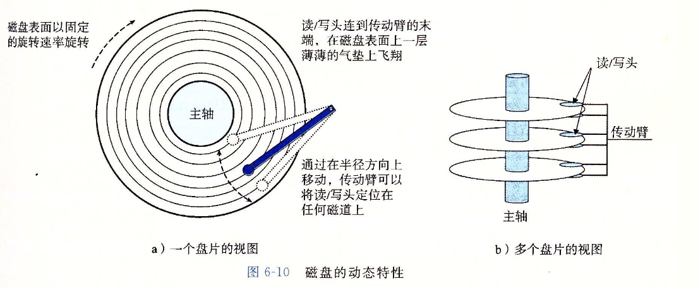

读写头在盘片表面高约 $0.1$ 微米处的一层薄薄的气垫上飞翔，速度约 $80$ km/h。盘片必须无尘，否则会造成**读 / 写头冲撞（head crash）**。

磁盘**以扇区大小的块读写数据**，对扇区的**访问时间（access time）**主要可以分成三个部分：

- **寻道时间**（seek time）：依赖于**读写头的当前位置**和**传动臂的移动速度**。
    $$\begin{gather*}
    T_{avg\ seek}=3\sim 9\operatorname{ms} \\
    T_{max\ seek}=20\operatorname{ms}
    \end{gather*}$$
- **旋转延迟**（rotational latency）：寻道成功后，驱动器等待目标扇区的第一个位旋转到读写头下。此时间依赖于**盘面的位置**和**旋转速率**。最坏情况下需要等盘片旋转一整周；平均旋转延迟为半个盘片旋转的时间。
    $$\begin{gather*}
        T_{max\ rotation}=\frac{1}{\operatorname{RPM}}\times\frac{60\text{\ secs}}{1\operatorname{min}} \\
        T_{avg\ rotation}=\frac{1}{2}T_{max\ rotation}
    \end{gather*}$$
- **传送时间**（transfer time）：依赖于**旋转速度**和**每条磁道的扇区数目**。
    $$T_{avg\ transfer}=\frac{1}{\operatorname{RPM}}\times \frac{1}{\text{average \# sectors} / \text{tracks}}\times\frac{60\text{\ secs}}{1\operatorname{min}}$$

寻道时间和旋转延迟是性能的主要瓶颈，传送时间相比之下很短。

寻道时间和旋转延迟大致相等，估计时可以直接以寻道时间的 2 倍作为总的访问时间。

访问 SRAM 中的一个 64 位字约需要 4ns，DRAM 约为 60ns。从内存中读一个 512 字节扇区大小的块的时间，SRAM 为 256ns，DRAM 为 4000ns，而磁盘需要 10ms，是 SRAM 的 40000 倍，DRAM 的 2500 倍。

#### 逻辑磁盘块

物理磁盘扇区被映射成一个 $B$ 个扇区大小的**逻辑块**的序列，编号为 $0, 1, \cdots, B-1$。**磁盘控制器**负责维护逻辑块号和物理扇区的映射关系。

当操作系统想要执行一个 I/O 操作时，例如读一个磁盘扇区的数据到主存，它向磁盘控制器发送一个命令，让它读某个逻辑块号。控制器执行一个快速表查找，将逻辑块号翻译成一个 $(盘面,磁道,扇区)$ 的三元组，控制器解释此三元组，将读写头移动到目标柱面，等待扇区移动到读写头下，将读出的位放入控制器上的一个小缓冲区中，并将其复制到主存。

> 磁盘控制器需要先对磁盘格式化，然后才能存储数据。
> 格式化包括用标识扇区的信息填写扇区之间的间隙、标识出故障的扇面并且不使用它们、在每个区中预留一组备用柱面。由于备用柱面，格式化容量要小于最大容量。

#### 连接 I/O 设备

图形卡、监视器、键盘、鼠标等 I/O 设备由 I/O 总线（例如 Intel 的*外围设备互联（Peripheral Component Interconnect, PCI）*）连接到 CPU 和主存。系统总线和内存总线与 CPU 相关，但 PCI 这样的 I/O 总线被设计成与 CPU 无关。I/O 总线比系统总线和内存总线慢，但它更通用。

- **通用串行总线（Universal Serial Bus, USB）**：USB 3.0 的最大带宽是 625 MB/s，USB 3.1 的最大带宽是 1.25 GB/s
- **图形卡**
- **主机总线适配器**：用于连接磁盘，使用*主机总线接口*定义的通信协议。两个这样的磁盘接口是 SCSI 和 SATA。SCSI 更快、更贵。SCSI 主机总线适配器（即 SCSI 控制器）可以支持多个磁盘驱动器，而 SATA 适配器只能支持一个。

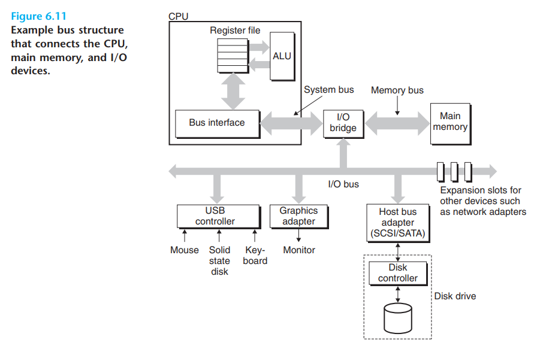

> I/O 总线是一个简单的抽象，它是基于 PCI 总线的，在 2010 年前使用广泛。PCI 模型中，系统所有设备共享总线，同个时刻只有一台设备访问这些线路。
> 现在，共享的 PCI 总线已经被 PCIe（PCI express）总线取代。PCIe 是一组高速串行、通过开关连接的点到点链路。PCI 总线的最大吞吐率只有 533 MB/s，而 PCIe 总线的最大吞吐率达 16 GB/s。


#### 访问磁盘

CPU 使用**内存映射 I/O（memory-mapped I/O）**技术向 I/O 设备发射命令。地址空间保留一块用于与 I/O 设备通信的地址，每个这样的地址称为一个 **I/O 端口（I/O port）**。当一个设备被连接到总线时，它被映射到一个或多个端口。

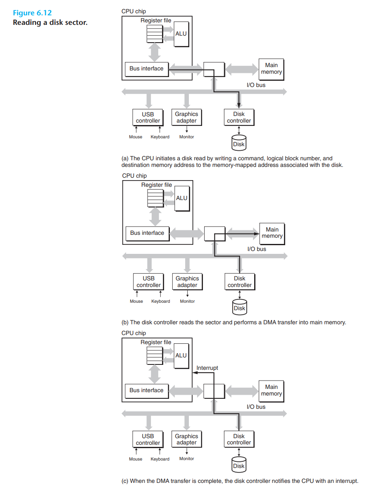

设磁盘控制器被映射到端口 `0xa0`，为了发起磁盘读，CPU 执行三个对 `0xa0` 的存储指令：
- 第一条指令发送一个命令字以及其他参数（如读完成后是否中断 CPU），告诉磁盘发起一个读；
- 第二条指令指明要读的逻辑块号；
- 第三条指令指明要存储读取结果的主存地址。

在等待磁盘读的时候，CPU 可以执行其他指令。

磁盘控制器接收到读命令后，将逻辑块号翻译成扇区地址，读扇区内容并将其**直接**传送到主存。从硬盘中读出的数据被传送到主存的过程不需要 CPU 干涉。

硬件设备可以自己执行读或写总线事务（访问系统主存），而不需要 CPU 干涉的过程，称为**直接内存访问（Direct Memory Access, DMA）**。这种数据传送称为 **DMA 传送（DMA transfer）**。

DMA 传送完成后，磁盘控制器给 CPU 发送一个中断信号。中断信号会发送到 CPU 芯片的一个外部引脚上，导致 CPU 暂停当前工作，跳转到一个操作系统例程，这个程序会记录下 I/O 的完成，将控制返回到 CPU 被中断的地方。

### 固态硬盘

固态硬盘（Solid State Disk, SSD）基于闪存。SSD 插在 I/O 总线上的标准硬盘插槽（USB 或 SATA）上。

一个 SSD 封装由一个或多个闪存芯片和**闪存翻译层（flash translation layer）**组成。闪存芯片替代传统机械硬盘的机械驱动器，而闪存翻译层是一个硬件 / 固件设备，替代磁盘控制器，将对逻辑块的请求翻译成对底层物理设备的访问。


SSD 读比写快，随机读和随机写的性能差别由底层闪存决定。

一个闪存由 $B$ 个块组成的序列组成，每个块有 $P$ 页。页的大小一般为 512 字节 $\sim$ 4 KB，块由 $32\sim 128$ 页组成，大小为 $16 \sim 512$ KB。

数据以页为单位读写，只有在一页所属的块被整个**擦除**（通常指所有位都被设置为 1）之后，这一页才能开始写入。不过，一旦一个块被擦除了，那么块中的每一个页都可以不需要擦除地写一次。进行大约 $100000$ 次重复写后，块会被磨损坏，不再可用。

随机写很慢，这有两个原因：
- 擦除块用时较长（$1 \text{\ ms}$ 级，比访问页高一个数量级）
- 如果写操作试图修改一个已包含数据（即非全 $1$）的页，那么这个页所在块中所有带有有效数据的页都必须先被复制到一个新的（擦除过的）块，然后才能进行对这个页的写操作。制造商在闪存翻译层中实现了复杂的逻辑，试图抵消擦写块的开销。

SSD 由半导体存储器构成，无移动部件，因此随机访问时间比旋转磁盘快，且能耗和物理强度更好。

闪存翻译层中的**平均磨损（wear leveling）**逻辑试图通过将擦除操作分散到所有块上来最大化寿命。闪存翻译层还试图通过将写操作聚集到同一个块中，减少擦除操作的次数。

### 存储技术趋势

**不同的存储技术有不同的价格和性能折中**。

**不同的存储技术的价格和性能以截然不同的速率变化**。1985 - 2015 年间，SRAM 的成本和性能基本上同步改善；DRAM 的成本下降更快（超四个数量级），但访问时间改善不大；磁盘成本暴跌（超六个数量级），但访问时间改善得更慢。增加密度比降低访问时间容易得多。

**DRAM 和磁盘的性能滞后于 CPU 的性能**。

虽然 SRAM 的性能滞后于 CPU，但还是在保持增长。DRAM 和磁盘性能与 CPU 性能在加大。多核处理器出现前，这个性能差距是延迟的函数；之后，这个性能差距越来越与吞吐量相关。

## 局部性

局部性（locality）：多次引用邻近于最近引用过的数据的数据。

**时间局部性**（temporal locality）：被引用过的内存位置很可能在不远的将来再被引用

**空间局部性**（spatial locality）：被引用过一次的内存位置的**附近位置**很可能在不远的将来被引用

### 对程序数据引用的局部性

```c
int sumvec(int v[N]) {
    int i, sum = 0;
    for (i = 0; i < N; i++) 
        sum += v[i];
    return sum;
}
```

变量 `sum` 在循环迭代时**被重复地引用**，因此有好的时间局部性，但 `sum` 作为一个标量，没有空间局部性。

向量 `v` 的元素**被顺序地读取**，因此有好的空间局部性，但时间局部性很差。

函数 `sumvec` 中的变量要么有好的空间局部性，要么有好的时间局部性，所以它有良好的局部性。

函数 `sumvec` 具有**步长为 1 的引用模式（stride-1 reference pattern）**，又称**顺序引用模式（sequential reference pattern）**。一般地，步长越大，空间局部性越差。

对于二维数组，双重嵌套循环按照**行优先顺序（row-major order）**读取数组元素，步长为 $1$，访问顺序和它在内存中的存储顺序相同，有良好的空间局部性；而如果按列顺序扫描数组，那么步长为 $N$，空间局部性很差。

### 取指令的局部性

函数 `sumvec` 的指令在内存中是连续的，因此有良好的空间局部性；循环体被执行多次，有良好的时间局部性。

对取指令来说，循环有好的时间空间局部性，**循环体越小、迭代次数越多**，局部性越好。

## 存储器层次结构

典型的存储器层次结构（memory hierarchy）：

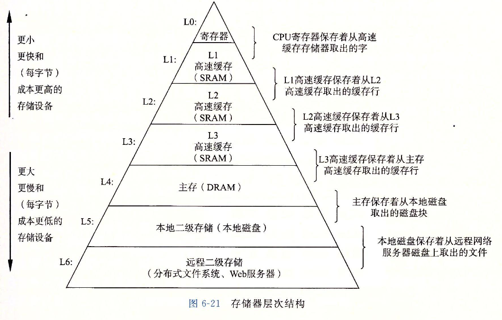

硬件和软件在这方面完美地互补。

### 存储器层次结构中的缓存

上一层的存储设备作为本层的存储设备的缓存。

第 $k+1$ 层的存储器被划分为连续的数据对象组块（chunk），称为**块**（block），被一个唯一的地址或名字标识。块的大小可固定可变化。

第 $k$ 层的存储器被划分为与第 $k+1$ 层相同大小的块，但数量更少。

任何时刻，第 $k$ 层的缓存包含第 $k+1$ 层块的子集的副本。

数据总是以块大小为传送单元（transfer unit）在两层之间来回复制。L1 和 L0 之间通常使用 1 个字大小的块，L2 和 L1 之间通常为几十个字节，因此不存在 “L1 的块大小”这种说法。

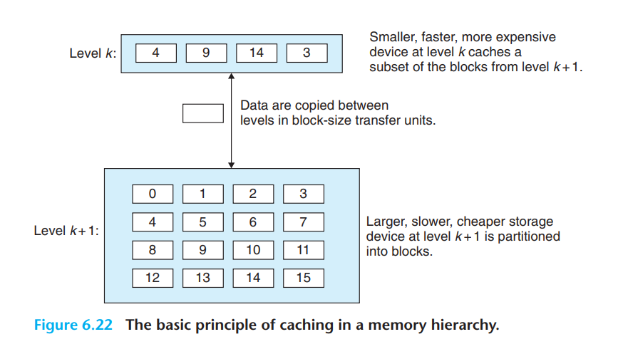

#### 缓存命中

程序需要下层的数据时，首先在本层查找，若找到则称为**缓存命中（cache hit）**

#### 缓存不命中

若未找到，则称为**缓存不命中（cache miss）**。需要**从下层取出相应的块，复制到本层**。如果本层已满，需要先将一个块**替换（replacing）**或**驱逐（evicting）**，被替换的块称为**牺牲块（victim block）**。

缓存的**替换策略（replacement policy）**决定该替换的块。随机替换策略会随机选择，而最近最少使用（least recently used, LRU）策略会选择最后访问时间最远的块。

#### 缓存不命中的种类

若本层缓存是空的，则称为**冷缓存（cold cache）**。此时任何访问都不会命中，称为**强制性不命中（compulsory miss）**或**冷不命中（cold miss）**。冷不命中通常发生在程序开始执行时。冷不命中通常短暂，不会在反复访问存储器使得缓存暖身（warmed up）后的稳定状态发生。

只要不命中，本层的缓存就必须执行**放置策略（placement policy）**，确定下层的目标块会被放在本层的什么位置。通常，**下层的块被限制放置在本层块的一个小子集**。例如，上图中下层的块 $i$ 只能放在本层的块 $i\pmod 4$ 中，这可以降低在本层中查找块的成本——不需要遍历所有块。

这种限制性的放置策略会引起**冲突不命中（conflict miss）**，例如程序不断交替引用块 `0` 和块 `8`，则每次引用都会不命中。

程序每个阶段访问缓存块的某个相对稳定的集合，称为此阶段的**工作集（working set）**，当工作集的大小超过缓存容量时，会造成**容量不命中（capacity miss）**。


#### 缓存管理

由什么来管理缓存如何划分为块、如何在不同层传送，以及判定并处理命中和不命中的情况？

- 编译器管理寄存器文件
- L1、L2 和 L3 缓存完全由内置硬件逻辑管理
- 在有虚拟内存的系统，DRAM 主存由操作系统和 CPU 的地址翻译硬件共同管理
- 对 AFS 这样的分布式文件系统的机器，本地磁盘作为缓存由本地上的 AFS 客户端进程管理。

## 高速缓存存储器

L1 高速缓存需要约 4 个时钟周期访问，L2 约 10 个，L3 约 50 个。我们假设 CPU 和主存之间只有一个 L1 高速缓存。

### 通用的高速缓存存储器组织结构

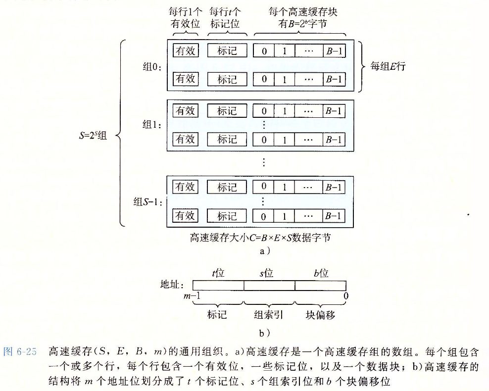

考虑一个计算机系统，其地址有 $m$ 位，形成 $M=2^m$ 个不同的地址。

高速缓存被组织成一个有 $S=2^s$ 个**高速缓存组**（cache set）的数组。每组有 $E$ 个**高速缓存行**（cache line）。

每个高速缓存行包含 
- $B=2^b$ 个字节的**数据块**（block）
- 一个**有效位**（valid bit），指明该行是否包含有效信息
- $t=m-(b+s)$ 个**标记位**（tag bit），是当前块的内存地址的位的一个子集，唯一标识这个行中的块。

元组 $(S,E,B,m)$ 可以描述高速缓存的结构。其大小（容量）$C$ 为所有块大小的和（不包括标记位和有效位），$C=S\times E\times B$

$S$ 和 $B$ 必须是 $2$ 的正整数次幂，但 $E$ 不用是。

当 CPU 需要从主存地址 A 中加载数据时，地址 A 会被发送到高速缓存。

高速缓存将地址 A 按照参数 $S$ 和 $B$ 划分成三个字段：**标记**、**组索引**、**块偏移**。高速缓存中确定请求是否命中，并抽取出被请求的数据的过程分为三步：**组选择**、**行匹配**、**字选择**：
- 组选择：组索引字段被解释成无符号整数，指示高速缓存中它所在的组的索引
- 行匹配：将 A 的 $t$ 个标记位与组中的每一行匹配，如果有某一行的标记位和 A 的标记位相同，且有效位被置 $1$，则匹配成功
- 字选择：块偏移字段被解释成无符号整数，指示高速缓存行中的字节偏移


### 直接映射高速缓存

行数 $E=1$ 的高速缓存称为**直接映射高速缓存（direct-mapped cache）**。

组选择后，由于每组只有一行，所以行匹配时只需要检查这一行的标记位和有效位。

若行匹配时未命中，则需要从下一层抽出被请求的块，并将新的块存储在当前组的某一行中。若组中的行都为有效行，就要驱逐一个已有的行。

对于每组只有一行的直接映射高速缓存，替换策略就是驱逐出当前的行。

对于 $(S,E,B,m)=(4,1,2,4)$ 的高速缓存（即，$4$ 个组，每组 $1$ 行，每个块 $2$ 字节，地址 $4$ 位）来说，其地址空间如下：


**标记位和索引位加起来唯一地标识内存中的每个块**。

一共有 8 个内存块，但只有 4 个高速缓存组，所以两个块可能有相同的组索引（不断交替引用块 `0` 和块 `4` 会导致冲突不命中），这样的两个块依靠标记位唯一标识。

```c
float dotprod(float x[8], float y[8]) {
    float sum = 0.0;
    int i;
    for (i = 0; i < 8; i++) 
        sum += x[i] * y[i];
    return sum;
}
```

假设浮点数 $4$ 个字节，块 $16$ 字节，组数为 $2$，行数为 $1$，`x` 首地址为 `0`，`y` 首地址为 `32`，`sum` 存放在寄存器中。

那么对任意的 `i`，`x[i]` 和 `y[i]` 都**拥有相同的组索引**，由此造成冲突不命中。高速缓存**反复地加载和驱逐相同高速缓存块的组**，在 `x` 和 `y` 的块之间**抖动（thrash）**。

为了修正抖动问题，可以在数组 `x` 后面放 $B=16$ 字节的填充，例如将 `x` 定义为 `float[12]`，从而使得 `x` 与 `y` 的组索引错开。（保证相邻的块拥有不同的组索引）。

高速缓存用中间的位作为组索引，而不是高位，也是为了**保证相邻的块拥有不同的组索引**。


### 组相联高速缓存

上文中的冲突不命中问题源于直接映射高速缓存每个组只有一行。

**组相联高速缓存**（set associative cache）的每个组有多行。$1<E<C/B$ 的高速缓存称为 $E$ 路组相联高速缓存。

组选择过程与直接映射高速缓存相同。

行匹配的逻辑略复杂。我们把每个组看成一个**相联存储器**，它是一个键值对数组，其中键即标记位和有效位，值为块的内容。

组中的每一行都被搜索。若未命中，且该组无空行，则需要进行**行替换**。**最不常使用（Least-Frequently-Used, LFU）**策略会替换过去某个时间窗口内引用次数最少的一行，**最近最少使用（Least-Recently-Used, LRU）***策略会替换最后一次访问时间最远的一行。

### 全相联高速缓存

全相联高速缓存（fully associative cache）只有一个组，包含所有高速缓存行（$E=C/B$）。

只有一个组，所以组选择直接选择组 `0`。地址中没有组索引位，只被划分为标记和块偏移两部分。

行匹配过程与组相联高速缓存中一样。由于必须并行地搜索标记，因此又大又快的相联高速缓存造价昂贵。全相联高速缓存只适合做小的高速缓存，例如虚拟内存系统中的翻译备用缓冲器（TLB）。

### 有关写的问题

在高速缓存更新了某个值的副本之后，还需要更新下一层中它的副本。

若本层写命中：
- **直写（write-through）**：本层某个字的副本一旦更新后，就立即更新下一层副本。直写每次都会引起总线流量，效率不高。
- **写回（write-back）**：尽可能推迟更新，直到这个被更新过的块要被驱逐时才启动对下一层的更新。写回策略需要在高速缓存中维护一个额外的**修改位（dirty bit）**，指明块是否被修改过。

若本层写不命中：
- **写分配（write-allocate）**：加载低一层的块到高速缓存，并更新这个高速缓存块。写分配试图利用写的空间局部性。
- **非写分配（not-write-allocate）**：避开高速缓存，直接将这个字写到低一层中。

直写高速缓存通常是非写分配的，写回高速缓存通常是写分配的。

我们一般简单地认为高速缓存是写回且写分配的。一方面，较低层的缓存受限于较长的传送时间，更可能使用写回，而非直写。另一方面，写回的高复杂性在现在也不再是棘手的问题。而且，写回的逻辑试图利用局部性，和处理读的方式是对称的。


### 一个真实的高速缓存层次结构的解剖

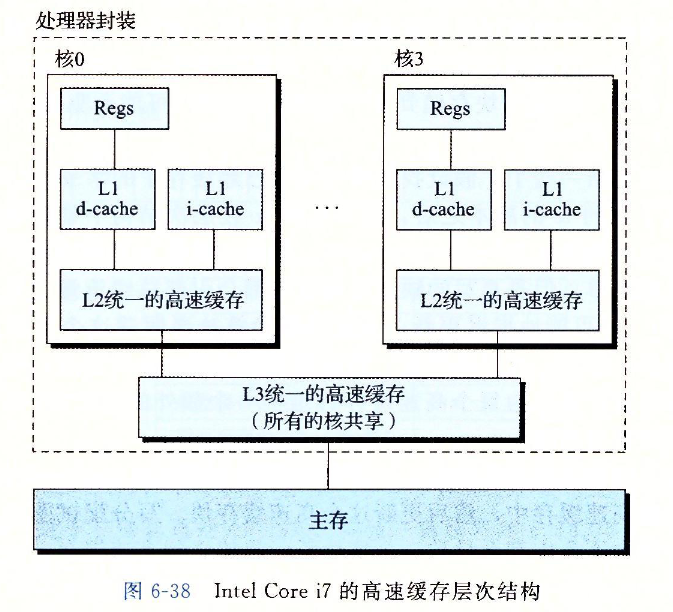

`i-cache` 只保存指令，`d-cache` 只保存程序数据，统一的高速缓存（unified cache）二者都保存。

`i-cache` 和 `d-cache` 独立的好处：
- 可以让 CPU 同时读一个指令字和一个数据字
- `i-cache` 通常是只读的，比 `d-cache` 更简单
- 可以确保数据访问不会和指令访问冲突不命中，虽然这可能会引起容量不命中增加

`i-cache` 和 `d-cache` 可以有不同的块大小、相联度和容量。

### 高速缓存参数的性能影响

**不命中率**（miss rate）：不命中数量 / 引用数量

**命中率**（hit rate）：$1$ - 不命中率

**命中时间**（hit time）：命中的情况下，从高速缓存传送一个字到 CPU 的时间。对 L1 高速缓存来说通常为数个时钟周期

**不命中处罚**（miss penalty）：由于不命中所需要的**额外**时间。L1 不命中需要从 L2 得到数据的处罚通常为数十个时钟周期；从 L3 为约 $50$ 个；从主存约 $200$ 个

**高速缓存大小**：
- 较大的高速缓存总大小可能**提高命中率**
- 也可能**增加命中时间**。因此 L1 高速缓存比 L2 小，L2 又比 L3 小

**块大小**：
- 更大的块大小可以更好地**利用空间局部性**，提高空间局部性好的代码的命中率。
- 对于给定的高速缓存总大小，也意味着**总行数的减少**，这又**损害了时间局部性的利用率**，降低了时间局部性好的代码的命中率
- 块越大，**传送时间越长**，**不命中处罚就越大**。Core i7 使用 64 字节的块。

**相联度**：即每组中的行数 $E$ 的影响。
- 相联度越高，由于冲突不命中**出现抖动的可能性越低**
- 但**成本也越高**：每一行需要更多的标记位、额外的 LRU 状态位和额外的控制逻辑。
- 高相联度也会**增加命中时间**，因为复杂性增加了。
- 还会**增加不命中处罚**，因为选择牺牲行的复杂性也增加了
- 这实际上是**低的命中时间和低的总不命中次数的折中** 

传统上，争取高时钟频率的高性能系统为 L1 缓存选择较低的相联度，因为不命中处罚较轻，而在不命中处罚较高的较低层上使用较小的相联度。

Core i7 中，L1 和 L2 是 8 路组相联的，而 L3 是 16 路

**写策略**：
- 直写容易实现，且可以使用独立于高速缓存的**写缓冲区（write buffer）**用于更新内存
- 写回引起的传送较少，允许更多的到内存的带宽用于执行 DMA 的 I/O 设备。
   
层次结构越低，传送时间越长，减少传送数量越重要，越多采用写回。


## 编写高速缓存友好的代码

- **让最常见的情况运行得快**。优化瓶颈，忽略不重要的部分
- **减小循环内部的不命中数量**：对局部变量的反复引用是好的，步长为 1 的引用模式是好的
- 行引用二维数组，而不是列


## 综合：高速缓存对程序性能的影响

### 存储器山

读吞吐量（read throughput），又称读带宽（read bandwidth），是程序从存储系统中读数据的速率，以 MB/s 为单位

```c
// Test function for measuring read throughput
long data[MAXELES];  // global array we'll be traversing

int test(int elems, int stride) {
    long i, sx2 = stride * 2, sx3 = stride * 3, sx4 = stride * 4;
    long acc0 = 0, acc1 = 0, acc2 = 0, acc3 = 0;
    long length = elems;
    long limit = length - sx4;

    for (i = 0; i < limit; i += sx4) {
        acc0 = acc0 + data[i];
        acc1 = acc1 + data[i + stride];
        acc2 = acc2 + data[i + sx2];
        acc3 = acc3 + data[i + sx3];
    }
    for (; i < length; i += stride) {
        acc0 = acc0 + data[i];
    }
    return ((acc0 + acc1) + (acc2 + acc3));
}

// return read throughput (MB/s)
// size = total array size (in bytes)
// stride in array elements
// Mhz = clock frequency in Mhz
double run(int size, int stride, double Mhz) {
    double cycles;
    int elems = size / sizeof(double);
    test(elems, stride);
    cycles = fcyc2(test, elems, stride, 0);
    return (size / stride) / (cycles / Mhz);
}
```

`test` 函数以步长 `stride` 扫描数组的头 `elems` 个元素产生读序列，使用 $4\times 4$ 循环展开。

`run` 函数运行 `test` 函数，返回读吞吐量。

`run` 函数第三行调用 `test` 是对高速缓存的预热，`fcyc2` 以 CPU 周期为单位测量 `test` 在参数 `elems` 和 `stride` 下的运行时间。

`size` 参数越小，得到的工作集越小，预热后工作集仍然在缓存中，可以再次访问，因此时间局部性越好

`stride` 参数越小，空间局部性越好。

以不同的参数调用 `run` 可以得到一个读带宽的时间和空间局部性的二维函数，称为**存储器山（memory mountain）**。

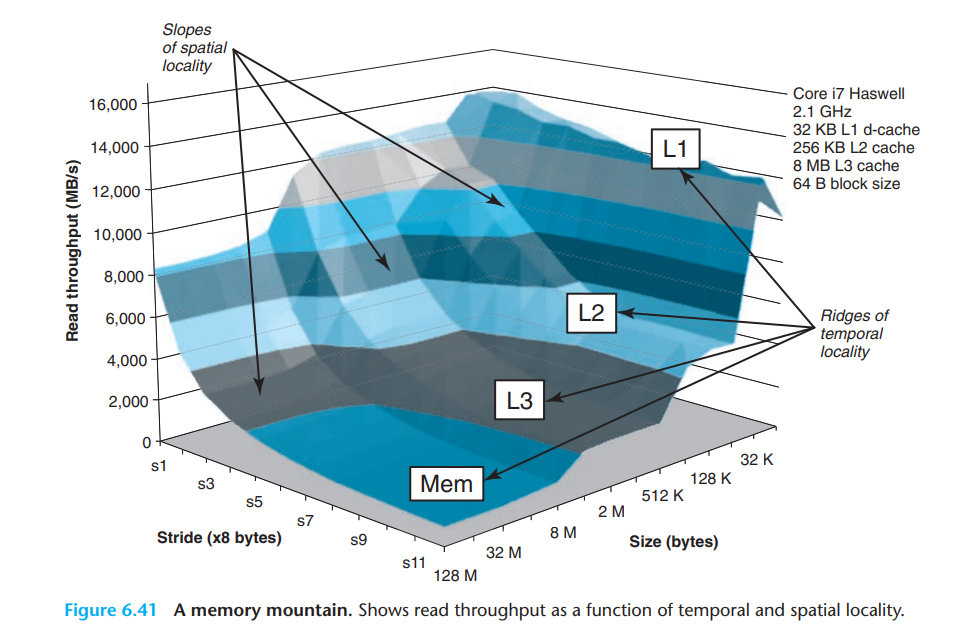

垂直于 Size 轴的是四条山脊，分别对应于工作集完全在 L1 高速缓存、L2 高速缓存、L3 高速缓存和主存内的时间局部性区域。

L1 山脊的最高点（14 GB/s）与主存山脊的最低点（900 MB/s）之间的差别有一个数量级。

在 L2、L3 和主存山脊上，随着步长的增加，有一个空间局部性的下降斜坡。即使当工作集很大、无法装进任何一个高速缓存时，主存山脊的最高点也比最低点高 8 倍。因此，即使程序的时间局部性很差，空间局部性仍然能补救。

步长为 1 时，有一条读吞吐量保持在 12 GB/s 的平坦的山脊线，即使工作集超出了 L1 和 L2 的大小。这是由于 Core i7 存储器系统的硬件**预取（prefetching）**机制。预取机制自动地识别顺序的、步长为 1 的引用模式，试图在一些块被访问之前就将它们取到高速缓存里。

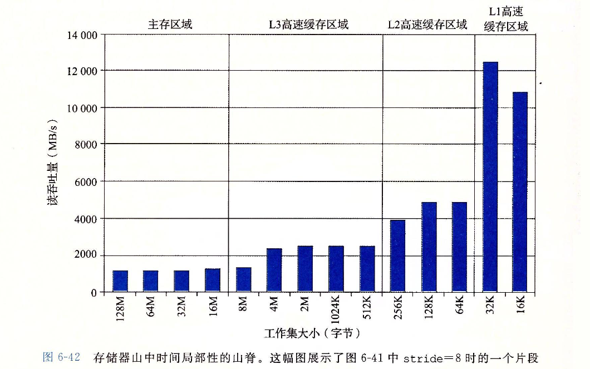

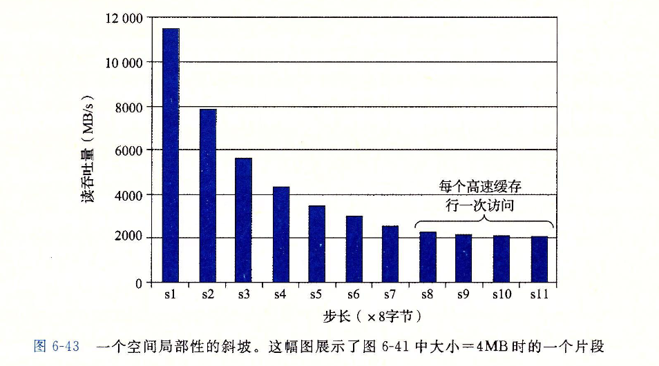

大小固定时，随着步长增加，L2 读不命中次数的比例增加；一旦步长达到了 8 个字（i.e. 达到了块的大小），则 L2 每次读请求都不命中，于是读吞吐量速率变为常数。

### 重新排列循环以提高空间局部性

假设：
- 每个数组的类型是 `double[n][n]` 且 `siezeof(double) == 8`
- 只有一个块大小为 32 字节的高速缓存
- 数组大小 `n` 很大，以至于矩阵的一行不能完全装入高速缓存
- 编译器将局部变量存储到寄存器中


6 个版本形成了 3 个等价类。`ijk` 和 `jik` 都是类 AB 的成员，因为它们在最内层的循环里引用的都是矩阵 $A$ 和 $B$。

以 `ijk` 版本为例，一个块可以容下 $4$ 个 `double`，所以最内层的循环每次迭代中，`A[i][k]` 会不命中 $0.25$ 次；由于 `n` 很大，对 `B[k][j]` 的每次访问都不会命中，因此总不命中次数是每次迭代 $1.25$ 次。

同理，`jki` 版本每次迭代不命中 $2$ 次；而 `kij` 版本每次迭代只不命中 $0.5$ 次。

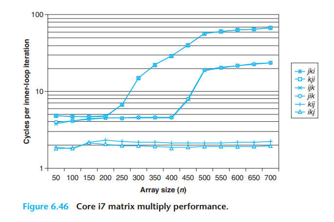

最快的版本比最慢的版本快几乎 40 倍。

属于同一个等价类的代码性能差距很小。

在这个情况中，与内存访问总数相比，**不命中率**是一个更好的性能预测指标。

`kij` 版本由于采用了步长为 1 的访问模式，配合硬件的预取机制，其性能在 `n` 值超出高速缓存容量后仍能保持不变


# 链接

链接可以执行于编译时（compile time）、加载时（load time）或运行时（run time）。

## 编译器驱动程序

`cpp` 是预处理器，将 `main.c` 源代码翻译成一个 ASCII 码的中间文件 `main.i`。此后，C 编译器 `cc1` 将 `main.i` 编译为 ASCII 汇编文件 `main.s`。之后，汇编器 `as` 将 `main.s` 翻译成**可重定位目标文件（relocatable object file）** `main.o`。最后，链接器 `ld` 将 `main.o` 和其他必要的系统目标文件合并成一个可执行目标文件（executable object file） `main`。

当运行 `main` 时，`shell` 调用操作系统中的**加载器（loader）**函数，将 `main` 的代码和数据复制到内存，并将控制转移到程序的开头。

## 静态链接

Linux LD 就是静态链接器（static linker），它以一组*可重定位目标文件*和命令行参数作为输入，生成一个完全链接的、可以加载和运行的可执行目标文件作为输出。输入的可重定位目标文件由各种不同的代码和数据节（section）组成。

链接器的主要任务是
- **符号解析（symbol resolution）**：将每个符号（对应一个函数、全局变量或静态变量）引用（symbol reference）与一个符号定义（symbol definition）关联起来
- **重定位（relocation）**：将每个符号定义与一个内存位置关联起来，以重定位这些节，然后修改所有对这些符号引用，令它们指向这个内存位置。链接器使用汇编器产生的**重定位条目（relocation entry）**的详细指令，不加甄别地执行重定位。

## 目标文件

目标文件有三种：
- **可重定位目标文件**：包含二进制代码和数据，其形式可以在编译时与其他可重定位目标文件合并起来，创建一个可执行目标文件
- **可执行目标文件**：包含二进制代码和数据，可以直接复制到内存并执行
- **共享目标文件**：一种特殊的可重定位目标文件，可以在加载或运行时被动态加载进内存并链接

编译器和汇编器可以生成可重定位目标文件和共享目标文件。

一个**目标模块（object module）**就是一个字节序列，一个**目标文件（object file）**就是一个目标模块的文件。

目标文件格式，第一个 Unix 系统使用 `a.out` 格式，Windows 使用可移植可执行（Portable Executable, PE）格式，MacOS-X 使用 Mach-O 格式，现代 x86-64 Linux 和 Unix 使用**可执行可链接格式（Executable and Linkable Format, ELF）**。

## 可重定位目标文件


ELF 头（ELF header）先以 16 字节序列描述系统的字大小、字节顺序。剩下的内容包括 ELF 头的大小、目标文件类型、机器类型（如 x86-64）、节头部表（section header table）的文件偏移、节头部表中的条目数和条目大小。

节头部表中的每个条目（entry）大小固定，描述不同节的位置和大小。

以下是典型的 ELF 文件的节：
- `.text`：已编译程序的机器代码
- `.rodata`：只读数据，如字符串常量、`switch` 跳转表
- `.data`：已初始化的全局和静态 C 变量
- `.bss`：未初始化的全局和静态 C 变量，以及所有被零初始化的全局和静态变量。它不占用实际空间。区分 `.data` 和 `.bss` 的意义是节省磁盘空间，运行时在内存中分配这些变量，并初始化为零
- `.symtab`：符号表，包含程序中定义和引用的函数和全局变量的信息。不使用 `-g` 编译选项也能得到符号表，除非用 STRIP 命令去掉它。和编译器中的符号表不同，`.symtab` 不包含局部变量的条目
- `.rel.text`：`.text` 节中位置的列表。当链接器将这个目标文件与其他文件组合时，需要修改这些位置。一般而言，调用外部函数或引用全局变量的指令需要修改，而调用本地函数的指令不需要。可执行目标文件中不需要重定位信息，因此通常省略，除非显式指定。
- `.rel.data`：被模块引用或定义的所有全局变量的重定位信息。任何已初始化的全局变量，若其初始值是一个全局变量地址或外部定义函数的地址，那么就需要被修改
- `.debug`：调试符号表。条目是程序中定义的局部变量和类型定义、程序中定义和引用的全局变量以及原始 C 源代码。只有在使用 `-g` 编译选项时才会出现。
- `.line`：原始 C 代码中的行号和 `.text` 节机器指令的映射。只有在使用 `-g` 编译选项时才会出现。
- `.strtab`：字符串表。内容包括 `.symtab` 和 `.debug` 节中的符号表，以及节头部表中的节名。是以 `null` 结尾的字符串序列。

> `.bss` 得名于 IBM 704 汇编中“块存储开始（Block Storage Start）”指令。助记：Better Save Space

## 符号和符号表

声明是向代码中引入名字的语法。这些名字可以声明在**命名空间作用域（全局作用域）**、**类作用域**和**复合语句（块）作用域**中。

```c++
int a;          // 命名空间作用域
struct A {
    int b();    // 类作用域
};
int main() {    // 命名空间作用域
    int c;      // 复合语句作用域
}
```

每个名字具有一个称为**连接**的属性，连接有三种：**外部连接（external linkage）**、**内部连接（internal linkage）**和**无连接（no linkage）**。

所有复合语句作用域的声明都是无连接的。无连接的名字由于作用域限制，自然不会影响链接过程。内部连接的名字是每个翻译单元独有的，与其他翻译单元中的同名符号互不干扰。外部连接的名字是所有翻译单元共享的。

称带有内部连接或外部连接的函数名和变量名为**符号（symbol）**。

1. 类型（类、枚举类型、别名）总是外部连接的
2. 默认情形下，符号是外部连接的
3. 用 `static` 修饰一个符号，可以让它成为内部连接的；用 `extern` 修饰一个符号，可以让它成为外部连接的


`.symtab` 符号表包括符号，不包含无连接的名字。


编译器为静态变量的定义在 `.data` 或 `.bss` 中分配空间，并在符号表中创建一个有唯一名字的本地链接器符号（比如，如果函数 `f` 和 `g` 中都定义了 `static int x = 0;`，那么这两个 `x` 变量会被编译器向汇编器输出为不同名字的局部链接器符号，以实现内部连接）。


符号表由汇编器构造，使用编译器输出到 `.s` 文件中的符号。`.symtab` 节包含的 ELF 符号表包含一个条目数组，条目格式如下：

```c
typedef struct {
    int name;            // String table offset
    char type: 4,        // Function / Data, 4 bits
         binding: 4;     // Local / Global, 4 bits
    char reserved;       // Unused
    short section;       // Section header index
    long value;          // Section offset / Absolute address
    long size;           // Object size in bytes
} Elf64_Symbol;
```

`name` 是字符串表中的字节偏移，指向该符号的 `null` 结尾的字符串名字。`value` 是符号地址，对于可重定位模块，是**距离定义目标的节的起始位置的偏移**；对于可执行目标文件，是**绝对运行时地址**。符号表除了函数和数据以外，还可以包含各个节的条目，以及对应原始源文件的路径名的条目，因此这些目标的类型也有所不同。

每个符号被分配到目标文件的某个节，由 `section` 字段指示。`section` 字段是一个到节头部表的索引。

在**可重定位目标文件**有三个**伪节（pseudosection）**，它们在节头部表中没有条目：
- ABS 代表不该被重定位的符号
- UNDEF 代表未定义的符号，即在本目标模块被引用，但在其他地方被定义的符号
- COMMON 代表还未被分配位置的未初始化的数据目标。对于此目标，`value` 字段给出对齐要求，而 `size` 给出最小大小

可执行目标文件中没有以上伪节。

现代 gcc 将可重定位目标文件中**未初始化的全局变量**分配到 COMMON 节，将**未初始化的静态变量**和**零初始化的全局或静态变量**分配到 `.bss` 节。

可以用 GNU `readelf` 程序查看目标文件内容。

```bash
Num:       Value      Size Type   Bind   Vis      Ndx Name
  8: 0000000000000000   24 FUNC   GLOBAL DEFAULT    1 main
  9: 0000000000000000    8 OBJECT GLOBAL DEFAULT    3 array
 10: 0000000000000000    0 NOTYPE GLOBAL DEFAULT  UND sum
# Ndx=1 表示 .text，Ndx=3 表示 .data
```

```c
// m.c
void swap();

int buf[2] = {1, 2};

int main() {
    swap();
}

// swap.c
// 在 swap.o 模块的 .symtab 节中
extern int buf[];        // 外部 在 m.c 的节 .data

int* bufp0 = &buf[0];    // 全局 属于节 .data
int* bufp1;              // 全局 属于节 COMMON

void swap() {            // 全局 属于节 .text
    int temp;    // temp 不出现在符号表
    // ...
}
```

## 符号解析

链接器将每个引用与它参数中的可重定位目标文件的符号表中的一个确定的符号定义关联起来。

对于引用和定义在同一模块中的局部符号，符号解析是简单的。编译器只允许每个模块中每个局部符号有一个定义。对于局部静态变量，编译器需要保证它们本地链接器符号唯一。

当编译器遇到一个未在当前模块定义的全局符号时，会假设它是在其他某个模块中定义的，生成一个链接器符号表条目，并将它交给链接器处理。若链接器在它的任何输入模块中都找不到该符号的定义，就输出一条错误信息并终止。

### 链接器如何解析多重定义的全局符号

单一定义原则（One Definition Rule, ODR）：
- 一个翻译单元中，允许出现一个变量、函数或类型的多次声明，但至多只允许出现一次定义
- 一个翻译单元中，如果 *ODR-使用*了一个符号，那么它至少要出现一次定义
- 整个程序中，非内联的符号最多只允许出现一次定义

忘记写 `main` 函数不会报编译错误，而是链接错误：`main` 函数被 ODR-使用，但找不到定义。

```c++
// a.cpp
inline void f() {
    // ...
}

// b.cpp
inline void f() {
    // ...
}

// 此例中，f 是内联的，因此可以在两个翻译单元中重复定义
// 这两个定义必须完全一致，否则是未定义行为
```

如下的不带 `static` 或 `extern` 的全局变量声明在 C++ 中是变量 `a` 的定义，且 `a` 是外部连接的。

但在 C 中，这样的声明称为**试探性定义（tentative definition）**。

```c
int a;
```

当试探性定义与一个同名的“正常定义”**同时出现**时，试探性定义成为声明。否则，这些试探性定义中的某一个成为定义，其余成为声明。

> 在标准中，“同时出现”的范围是同一个翻译单元。在某些实现（如 Linux 的 ELF 格式）中，这个范围可以是多个翻译单元。在此情况下，称“正常定义”的符号为**强符号**，试探性定义的符号为**弱符号**。

汇编器将符号强弱的信息隐含地编码在可重定位目标文件的符号表。

- 在链接时，强符号只能出现一次（对应单一定义原则）
- 多个弱符号可伴随一个强符号同时链接（弱符号——试探性定义——退化为声明）
- 没有强符号时，在多个弱符号中任选一个成为定义。

```c
// foo.c
#include <stdio.h>
void f(void);

int y = 15212;
int x = 15213;

int main() {
    f();
    printf("x = 0x%x y = 0x%x\n", x, y);
}

// bar.c
double x;

void f() {
    x = -0.0;
}
```

在 x86-64/Linux 机器上，`f()` 将会用 `0.0` 覆盖 `foo.c` 中的 `x` 和 `y` 变量，并触发链接器发出一条 Warning: alignment 4 of symbol 'x' in somefile.o is smaller than 8 in otherfile.o。可以用 `-fno-common` 调用 gcc，将未初始化的全局变量放在 `.bss` 节，从而禁止了链接器对试探性定义的合并，使得链接器在遇到此类情况时报重定义错误（这已经成为默认选项）。`-Werror` 可以把所有警告变为错误。

我们已经知道，现代 gcc 将试探性定义的全局变量分配到 COMMON 节，以让链接器选择成为定义的声明；将“普通定义”为零初始化的变量（即未显式初始化的静态变量、零初始化的全局和静态变量）分配到 `.bss` 节。对于初始化为非零值的全局或静态变量，gcc 将它们分配到 `.data` 节。


### 与静态库链接

编译系统提供一种机制, 将多个翻译单元打包成一个单独的文件, 称为**静态库（static library）**。当静态库作为链接器的输入时，链接器**只从静态库复制被引用的目标模块**。

> ISO C99 定义了许多标准函数。如果编译器将这些函数直接集成在编译器里，那么编译器的复杂性就会大大提升，且标准函数的更新会和编译器版本绑定。如果将所有标准函数放在一个单独的可重定位目标模块（例如 `libc.o`），那么将会浪费许多磁盘和内存空间，并且每个函数的更新都会导致库的重新编译。如果为每个标准函数创建一个独立的可重定位目标文件（例如 `printf.o`），那么使用时就太麻烦了。因此，静态库的概念被提出了。

Linux 中，静态库以**存档（archive）**格式存放在磁盘中，以 `.a` 标识。它是一组连接起来的可重定位目标文件的集合。

```bash
gcc -c foo.c bar.c              # 生成 foo.o 和 bar.o
ar rcs libfoobar.a foo.o bar.o  # 打包成静态库

gcc -c main.c    # 设 main.c 只引用了 foo.c 中的符号
gcc -static -o my-prog main.o ./libfoobar.a
# 或等价地：
gcc -static -o my-prog main.o -L. -lfoobar
```

链接器运行时，它判定 `main.o` 只引用了来自 `foo.o` 的符号，因此它从 `libfoobar.a` 中只复制 `foo.o` 到 `my-prog` 中（此外还可能包括 `libc.a` 中的 `printf.o`，以及其他 C 运行时系统中的其他模块）。

### 链接器如何使用静态库来解析引用

符号解析阶段，链接器扫描可重定位目标文件和存档文件是按照**它们作为编译器驱动程序参数的顺序**的。

链接器维护三个集合，它们初始时均为空：
- 可重定位目标文件的集合 $E$
- 未解析的符号集合 $U$（即已被引用但尚未定义的符号集合）
- 已经定义的符号集合 $D$

对于每个输入文件 `f`，链接器可以判断它是目标文件还是存档文件。

如果是目标文件，链接器将它添加到 $E$，并更新 $U$ 和 $D$。

如果是存档文件，链接器尝试在 `f` 中定义的符号中匹配 $U$ 中的每个未解析符号 $u$，如果匹配成功，将对应的模块 `m` 添加到 $E$，并更新 $U$ 和 $D$ 以适应模块 `m` 的符号。

如果扫描完成后 $U$ 非空，那么链接器输出一个错误并终止，否则它会合并和重定位 $E$ 中的文件，构建输出的可执行文件。

```bash
# 这就导致了链接器的输入顺序很重要
# 例如以下命令将使链接器报错
gcc -static -L. -lfoobar -o my-prog main.o
```

我们一般将静态库放在末尾。并且如果库之间有依赖关系，我们还要对它们排序。如果 `libx.a` 和 `liby.a` 互相引用对方的符号，我们还需要让其中一个库重复出现（或将他们合并成一个存档文件）。

## 重定位

链接器完成符号解析后，就将每个符号引用和恰好一个符号定义（即输入目标模块中的一个符号表条目）关联起来。现在，链接器知道了它的输入目标模块中代码节和数据节的确切大小，可以开始重定位了。

重定位分为两步：
- **重定位节和符号定义**：将所有相同类型的节合并（例如每个模块的 .data 被合并为输出可执行目标文件的 .data），将运行时内存地址赋给合并后的节、赋给输入模块定义的每个节以及赋给输入模块定义的每个符号。此后，程序中的从每条指令和全局变量都拥有了唯一的运行时内存地址。
- **重定位节中的符号引用**：修改代码节和数据节中的符号的引用，使得它们指向正确的运行时内存地址。这一步依赖于可重定位目标模块中的**重定位条目（relocation entry）**。


### 重定位条目

汇编器不知道数据、代码和外部符号最终会被存放在什么位置。遇到最终位置未知的目标引用时，汇编器生成一个重定位条目，告诉链接器如何修改这个引用。代码的重定位条目在 `.rel.text` 节中，已初始化数据的重定位条目在 `.rel.data` 节中。

```c
typedef struct {
    long offset;          // Offset from start of section to fixup
    long type: 32,        // Relocation type
         symbol: 32;      // Symbol table index
    long addend;          // Constant
} Elf64_Rela;
// 一些类型的重定位要使用 addend 对被修改引用的值做偏移调整
```

ELF 定义了 32 种重定位类型，我们关心两种：
- `R_X86_64_PC32`：重定位一个使用 32 位 PC 相对地址的引用。
- `R_X86_64_32`：重定位一个使用 32 位绝对地址的引用。

这两种引用类型支持 x86-64 小型代码模型（small code model），该模型假设可执行目标文件中的代码和数据的地址都可以用 32 位有符号偏移量表示（总体大小小于 2 GB）。更大的程序可以使用 `-mcmodel=medium` 或 `-mcmodel=large` 编译选项。

### 重定位符号引用

以下代码展示链接器重定位算法。我们把每个节看作一个字节数组，每个重定位条目是一个类型为 `Elf64_Rela` 的结构，链接器已经为每个节和每个符号选择了运行时地址（用 `ADDR` 函数表示）

```c++
for (sec : sections) {
    for (re : relocation_entries) {
        refptr = sec + re.offset;    // ptr to reference to be relocated

        if (re.type == R_X86_64_PC32) {
            refaddr = ADDR(sec) + re.offset;  // ref's runtime address
            *refptr = (unsigned) (ADDR(re.symbol) + re.addend - refaddr);
        }

        else if (re.type == R_X86_64_32) {
            *refptr = (unsigned) (ADDR(re.symbol) + re.addend);
        }
    }
}
```

以如下代码为例，`main` 函数分别用 PC 相对引用和绝对引用的方式引用了全局符号 `sum` 和 `array`。

```c
// sum.c
int sum(int* a, int n) {
    // ...
    return 1;
}

// main.c
int sum(int* a, int n);    // defined in sum.o
int arr[2] = {1, 2};
int main() {
    int val = sum(array, 2);
    return val;
}

// objdump -dx main.o
// 0000000000000000 <main>:
0x0:    48 83 ec 08        sub    $0x8, %rsp
0x4:    be 02 00 00 00     mov    $0x2, %esi
0x9:    bf 00 00 00 00     mov    $0x0, %edi        // arr
                        a: R_X86_64_32  array
0xe:    e8 00 00 00 00     callq  13 <main+0x13>    // sum
                        f: R_X86_64_PC32  sum-0x4
0x13:   48 83 c4 08        add    $0x8, %rsp
0x17:   c3                 retq
```

#### 重定位 PC 相对引用

`main` 函数调用外部函数 `sum`，相应的重定位条目如下：

```c
// relocation entry of sum 
re = {
    re.offset = 0xf, 
    re.symbol = sum, 
    re.type = R_X86_64_PC32, 
    re.addend = -4
};
```

链接器将会在 `<main+0xf>` 中填入 32 位 PC 相对地址：

```c
// 假设 ADDR(.text) == 0x4004d0, ADDR(sum) == 0x4004e8
refaddr = ADDR(sec) + re.offset
        = ADDR(.text) + 0xf    
        = 0x4004df;

*refptr = (unsigned) (ADDR(re.symbol) + re.addend - refaddr)
        = (unsigned) (ADDR(sum) + (-4) - 0x4004df)
        = 0x4004e8 - 0x4004df - 4
        = 0x5;

// So 0x5 is filled in <main+0xf>, and the corresponding instruction becomes:
0x4004de:    e8 05 00 00 00     callq  4004e8 <sum>
```

#### 重定位绝对引用

```c
re = {
    re.offset = 0xa, 
    re.symbol = arr, 
    re.type = R_X86_64_32, 
    re.addend = 0
};
```

链接器在 `<main+0xa>` 填入 32 位绝对地址：

```c
// 假设 ADDR(arr) == 0x601018
*refptr = (unsigned) (ADDR(re.symbol) + re.addend)
        = 0x601018;

// The corresponding instruction becomes:
0x4004d9:    bf 18 10 60 00     mov    $0x601018, %edi
```

最后，以下是最终可执行目标文件的 `.data` 节：

```c
0000000000601018 <arr>:
    0x601018:    01 00 00 00 02 00 00 00
```

## 可执行目标文件

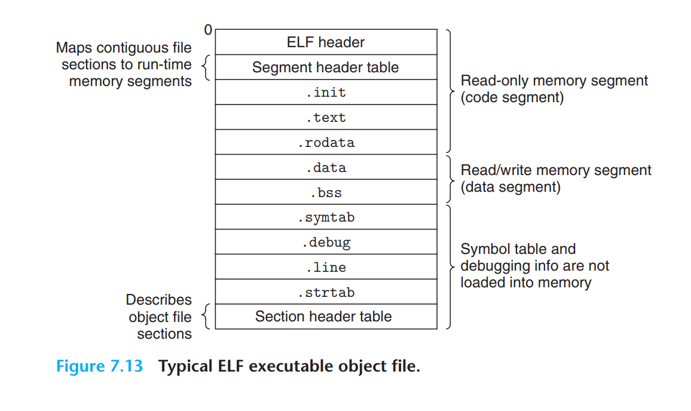

ELF 头中的 `e_entry` 字段指示了程序的**入口点（entry point）**，即程序首条指令的地址。`.init` 节定义了一个小函数 `_init`，程序的初始化代码会调用它。可执行文件已经**完全链接**（已被重定位），它不需要 `rel` 节。

ELF 被设计地很容易加载到内存。可执行文件的连续的**片（chunk）**被映射到连续的内存段。**程序头部表（program header table）**描述了这种关系。

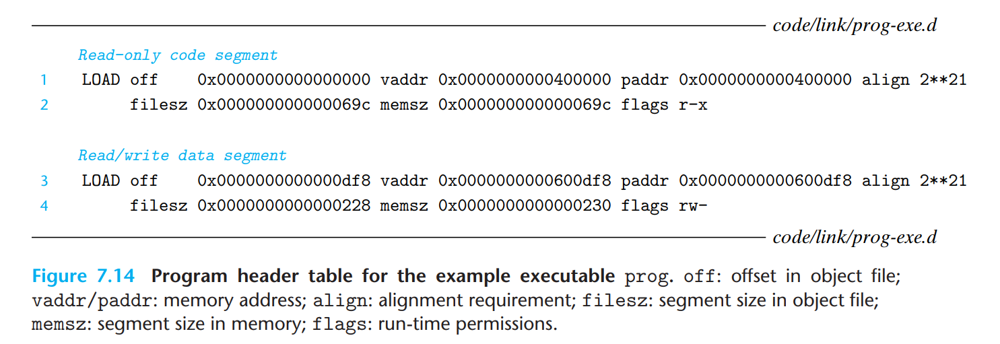

根据可执行文件的内容，两个内存段的内容会被初始化。

**代码段（code segment）**有读 / 执行访问权限，开始于内存地址 `0x400000` 处，总共在内存中占 `0x69c` 字节，并且它被初始化为可执行目标文件的头 `0x69c` 个字节（这包括 ELF 头、程序头部表，以及 `.init`、`.text` 和 `.rodata` 节）

**数据段（data segment）**有读 / 写访问权限，开始于内存地址 `0x600df8` 处，总共在内存中占 `0x230` 字节，并且它被初始化为可执行目标文件中偏移 `0xdf8` 处起的 `0x228` 个字节（位于 `.data` 节），其余 `8` 个字节对应于在运行时被初始化为 `0` 的 `.bss` 数据。

对于任何段 `s`，链接器所选择的起始地址 `vaddr` 必须满足 $$\operatorname{vaddr}\equiv\operatorname{off}\pmod{align},$$

其中 `off` 是段的首字节在目标文件中的偏移量，`align` 是程序头部中指定的对齐（此处为 $2^{21}=0x200000$）。这种对齐加快了段传送到内存的效率。

## 加载可执行目标文件

在 Linux shell 中运行可执行目标文件时，shell 调用某个驻留在存储器中称为**加载器（loader）**的操作系统代码来运行它。任何 Linux 程序都可以通过调用 `execve` 函数来调用加载器。加载器将可执行目标文件中的代码和数据从磁盘复制到内存（称为**加载**），然后跳转到程序的首条指令或入口点。

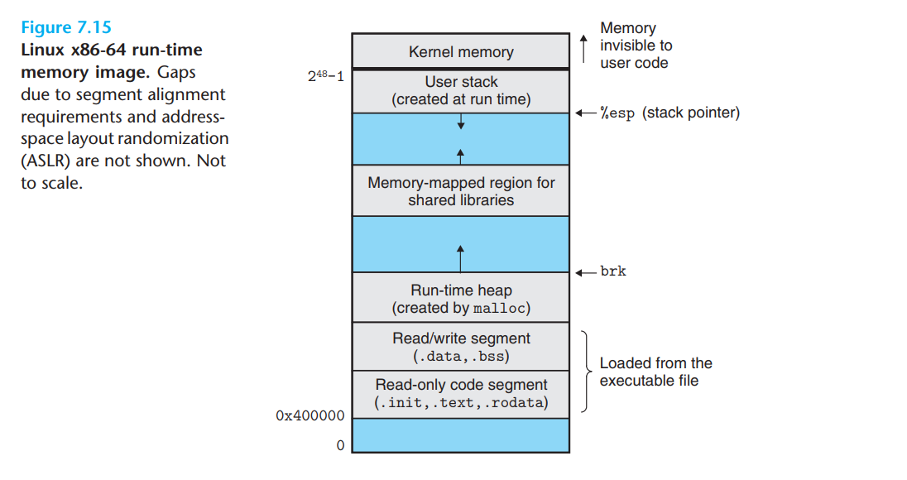

在 Linux x86-64 系统中，代码段总是从内存地址 `0x400000` 开始，后面跟着数据段、运行时堆。堆后的区域为共享模块保留，用户栈总是从最大的合法用户地址 $2^{48}-1$ 开始，向内存地址减小的方向增长。栈以后的区域（从地址 $2^{48}$ 起）为**内核**中的代码和数据保留。

我们将堆、数据和代码段化成了相邻的，并且栈顶在最大合法用户地址处。实际上由于 `.data` 段的对齐要求，代码段和数据段有间隙。同时，在分配栈、共享库和堆的运行时地址时，链接器还会使用**地址空间布局随机化（ASLR）**。

加载器运行时会创建像这样的内存映像。在程序头部表的引导下，加载器将可执行文件的片复制到代码段和数据段，然后跳转到程序入口点，即 `_start` 函数的地址（它在系统目标文件 `ctrl.o` 中定义），`_start` 调用系统启动函数 `_libc_start_main`（在 `libc.so` 中定义）。`_libc_start_main` 初始化执行环境，调用用户层的 `main` 函数，处理 `main` 的返回值，并在需要的时候将控制返回给内核。

> 更准确地，Linux 的每个程序运行在一个进程上下文中，有自己的虚拟地址空间。shell 运行一个程序时，父 shell 进程生成一个子进程，它是父进程的一个复制。子进程通过 `execve` 系统调用启动加载器，加载器删除子进程现有的虚拟内存段，创建一组新的代码、数据、堆和栈段。新的栈和堆被初始化为零。通过将虚拟地址空间中的页映射到可执行文件的页大小的片（chunk），新的代码和数据段被初始化为可执行文件的内容。最后，加载器跳转到 `_start` 地址。除了一些头部信息，在加载过程中没有任何从磁盘到内存的数据复制，直到 CPU 引用一个被映射的虚拟页时才会进行复制。此时，操作系统利用其页面调度机制自动将页面从磁盘传送到内存。

## 动态链接共享库

静态库仍然有一些问题：
- 静态库需要用户时时更新, 重新链接 
- 标准 I/O 函数如 `printf` 和 `scanf` 的代码在运行时会被复制到每个运行进程的文本段里，造成极大的浪费

**共享库（shared library）**: 又称**共享目标（shared object）**，是一种特殊的目标模块。它在运行或加载时可以被加载到任意的内存地址，并和一个在内存中的程序链接起来，这个过程称为**动态链接（dynamic linking）**，由动态链接器（dynamic linker）完成。在 Linux 中通常以后缀名 `.so` 标识，Windows 中以 `.dll` 标识。

对于一个库，在给定文件系统中只有一个 `.so` 文件，所有引用它的可执行目标文件共享它的代码和数据，而不像静态库一样复制嵌入其可执行文件中。在内存中，共享库的`.text` 节的副本可以被不同的引用它的进程共享。

```bash
# -fpic: 生成位置无关代码; -shared: 生成共享目标
gcc -shared -fpic -o libfoobar.so foo.c bar.c
gcc -o my-prog main.c ./libfoobar.so
```

my-prog 运行时可以和 libfoobar.so 链接。

创建可执行文件 `my-prog` 时静态执行了一些链接，程序加载时，动态完成链接过程。此时，**没有任何 `libfoobar.so` 的代码和数据节被真的复制到 `my-prog` 中**，链接器只复制了一些重定位和符号表信息，它们使得运行时可以解析对 `libfoobar.so` 的引用。

加载器照常加载 `my-prog`，它会注意到 `my-prog` 包含一个 `.interp` 节，其中包含动态链接器的路径名。动态链接器本身就是一个共享目标（在 Linux 上，`ld-linux.so`）。加载器不会像通常一样将控制传递给应用，而是加载和运行动态链接器，然后动态链接器执行以下重定位完成链接任务：
- 重定位 `libc.so` 的文本和数据到某个内存段
- 重定位 `libfoobar.so` 的文本和数据到另一个内存段
- 重定位 `my-prog` 中所有对由 `libc.so` 和 `libfoobar.so` 定义的符号的引用

最后，动态链接器将控制传递给应用程序，此时起共享库的位置就固定了，并且在应用程序执行过程中都不会改变。

这是在应用程序**被加载后、被执行前**，动态链接器加载并链接共享库的情景。

## 从应用程序中加载和链接共享库

应用程序还可能在**运行时**要求动态链接器加载和链接共享库，而而无需在调用编译驱动程序时将那些库链接到应用内。

这种动态链接的一些应用：
- 分发软件：Windows 应用的开发者常常利用共享库分发软件更新。他们生成共享库的新版本，用户下载并用它替换当前版本，下次他们运行应用程序时，应用就能自动链接并加载新的共享库
- 构建高性能 Web 服务器：早期 Web 服务器通过使用 `fork` 和 `execve` 创建子进程，并在该子进程的上下文中运行 CGI 程序来生成动态内容。现代高性能 Web 服务器使用动态链接更高效地生成动态内容。其思路是将每个生成动态内容的函数打包在共享库，当一个来自 Web 服务器的请求到达时，服务器动态地加载和链接适当的函数，然后直接调用它，而不是使用 `fork` 和 `execve` 创建子进程并在其上下文中运行函数。函数会一直缓存在服务器的地址空间中，后续请求的开销就降低到一个简单的函数调用开销，并且运行时无需停止服务器即可更新已存在的函数或添加新函数

```c
#include <dlfcn.h>

// Linux 为动态链接器提供了 `dlopen` 接口
// 允许应用程序在运行时加载和链接共享库
void* dlopen(const char* filename, int flag);

// 若成功，返回指向句柄的指针，否则返回 NULL
```

`flag` 选项要么包括 `RTLD_NOW`，指示链接器立即解析对外部符号的引用，要么包括 `RTLD_LAZY`，指示链接器推迟符号解析直到执行来自库中的代码。这两个值都可以与 `RTLD_GLOBAL` 取或，它指示此库中定义的符号可以在后续的动态链接中被解析。

```c
int* dlsym(void* handle, char* symbol);
// handle 是指向已打开的共享库的句柄，symbol 是符号名
// 若 symbol 存在，则返回其地址，否则返回 NULL

int dlclose(void* handle);
// 若没有其他共享库仍在使用该共享库，dlclose 就卸载此共享库

const char* dlerror(void);
// 返回字符串，描述调用 dlopen, dlsym 或 dlclose 时发生的最近的错误，若没有错误则返回 NULL
```

以下示例展示了如何利用这些接口动态链接 `libfoobar.so` 共享库，并调用它的 `foo_func` 例程

```c
// Compiled with
// gcc -rdynamic -o my-prog dll.c -ldl

#include <dlfcn.h>
#include <stdio.h>
#include <stdlib.h>

int x[2] = {1, 2};

int main() {
    void* handle;
    void (*foo_func)(int*, int);
    char *error;

    handle = dlopen("./libvector.so", RTLD_LAZY);
    if (!handle) {
        fprintf(stderr, "%s\n", dlerror());
        exit(1);
    }

    foo_func = dlsym(handle, "foo_func");
    if ((error = dlerror()) != NULL) {
        fprintf(stderr, "%s\n", error);
        exit(1);
    }

    foo_func(x, 2);

    if (dlclose(handle) < 0) {
        fprintf(stderr, "%s\n", dlerror());
        exit(1);
    }

    return 0;
}
```

`-rdynamic` 选项使得**可执行文件里的全局符号对于动态链接器可见**。以下是一个例子：

```c
// bar.c
extern void foo(void);   // defined in main.c
void bar() {
    foo();
}

// main.c
#include <dlfcn.h>
#include <stdio.h>
#include <stdlib.h>

void foo(void) {
    printf("Hello, world!\n");
}

int main(void) {
    void* dlh = dlopen("./libbar.so", RTLD_NOW);
    if (!dlh) {
        fprintf(stderr, "%s\n", dlerror());
        exit(1);
    }

    void (*bar)(void) = dlsym(dlh, "bar");

    if (!bar) {
        fprintf(stderr, "%s\n", dlerror());
        exit(1);
    }

    bar();
}
```

```bash
gcc -c -Wall -o -main.o main.c
gcc -c -Wall -fpic -o -bar.o bar.c
gcc -shared -o libbar.so bar.o
gcc -o prog main.o -L. -lbar -ldl    # 不带 -rdynamic

./prog
./libbar.so: undefined symbol: foo
# 可见 main.o 中的符号对于动态链接器来说不可见

# 为了成功运行 第四行需要添加 -rdynamic 选项
gcc -rdynamic -o prog main.o -L. -lbar -ldl 
./prog
Hello, world!

# Symbol are only exported by default from shared libraries. -rdynamic tells linker to do the same for executables (like main.o). 
```

> Java 定义了一个标准调用规则，称为 Java 本地接口（Java Native Interface, JNI），它允许 Java 程序调用“本地的”C/C++ 函数。其基本思想是将本地 C/C++ 函数编译到一个共享库，并利用 `dlopen`（或类似的接口）动态链接和加载这个共享库，实现函数调用。

## 位置无关代码

如何实现让多个运行中进程共享内存中相同的库代码？

一种不可行的方法：为每个共享库分配一个事先预备的专用地址空间片，要求加载器总是在这个地址上加载共享库。这种方法对地址空间的使用较低效（即使进程不使用这个库，空间还是会被分配），并且它难以管理：必须保证没有片会重叠，并且当库被修改后，还必须重新确认它的片是否还适合其大小，如果不适合，就必须重新分配一个新的片。随着库数量的增多，系统的地址空间四分五裂，造成许多未使用而又使用不了的小洞。更糟的是，对每个系统，库在内存中的分配都是不同的，使得管理难上加难。

**位置无关代码（Position-Independent Code, PIC）**：可以加载而无需重定位的代码。

通过对 gcc 使用 `-fpic` 选项，可以生成 PIC 代码，使得**代码可以被加载到内存的任何位置而无需链接器修改**，于是无限多个进程可以轻松共享一个共享模块的代码段的单一副本。共享库的编译必须总是使用 `-fpic` 选项。

在 x86-64 系统中，同一个目标模块中符号的引用可以用 PC 相对寻址来编译，构造目标文件时由静态链接器重定位，从而成为 PIC 的。

### PIC 数据引用

我们指出：无论一个目标模块（包括共享目标模块）在内存的何处被加载，其**数据段与代码段的距离总是保持不变**。

生成对全局变量的 PIC 引用时的编译器在数据段开始的地方创建一个**全局偏移量表（Global Offset Table, GOT）**。在 GOT 中，每个被该目标模块引用的全局数据目标（过程或全局变量）都有一个 8 字节条目。编译器还为 GOT 中每个条目生成一个重定位记录。加载时，动态链接器重定位 GOT 中的每个条目，使得它包含目标正确的绝对地址。每个引用全局目标的模块都有自己的 GOT。


不过，因为 `addcnt` 是在 `libvector.so` 模块定义的，编译器实际可以产生对 `addcnt` 的直接 PC 相对引用，并增加一个重定位，让链接器在构造此共享模块时解析它，即不需要生成 GOT 表。

但如果 `addcnt` 由另一个共享模块定义，那么就需要通过 GOT 间接访问。此处即是如此，编译器采用了最通用的方案，为所有引用使用 GOT。

### PIC 函数调用

假设程序调用一个定义在共享库的函数，那么编译器在此共享模块加载前无法预测这个函数的运行时地址。

如果为该函数引用生成一条重定位记录，让动态链接器在程序加载的时候解析它，即需要链接器修改调用模块的代码段，这样就不是 PIC 的了。

GNU 编译系统使用**延迟绑定（lazy binding）**技术，将过程地址的绑定推迟到第一次调用该过程时。第一次调用过程的运行时开销很大，但此后的每次调用都只需要花费一条指令和一个间接的内存引用。

**过程链接表（Procedure Linkage Table, PLT）**：PLT 是一个数组，其中每个条目是 16 字节代码。`PLT[0]` 是一个特殊条目，它跳转到动态链接器。每个被可执行程序调用的库函数都有它自己的 PLT 条目，每个条目负责调用一个具体的函数。`PLT[1]` 调用系统启动函数 `__libc_start_main`，它初始化执行环境，调用 `main` 并处理其返回值。从 `PLT[2]` 开始的条目调用用户代码调用的函数。

GOT：和 PLT 联合使用时，`GOT[0]` 和 `GOT[1]` 包含动态链接器在解析函数地址时会使用的信息。`GOT[2]` 是动态链接器在 `ld-linux.so` 模块中的入口点，其余每个条目对应于一个被调用的函数，其地址需要在运行时被解析。每个条目都有一个对应的 PLT 条目，例如 `GOT[4]` 和 `PLT[2]`。初始时，每个 GOT 条目都指向对应 PLT 条目的第二条指令。

一个目标模块如果调用了定义在共享库的任何函数，它就会有自己的 GOT 和 PLT。GOT 在数据段，而 PLT 在代码段。

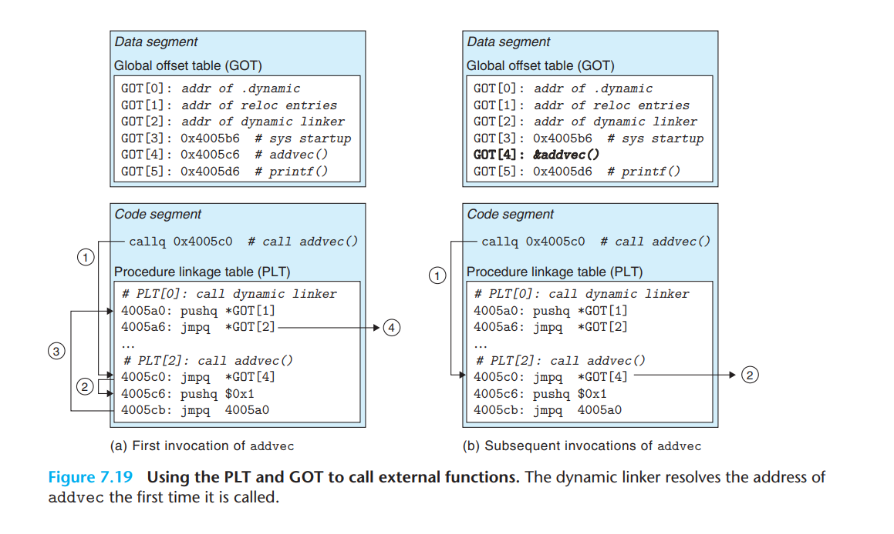

首次调用 `addvec` 时：
1. `callq` 实际的参数是 `PLT[2]` 的地址，即 `addvec` 的 PLT 条目
2. `PLT[2]` 中，程序跳转到 `*GOT[4]`，初始时这相当于跳转到 `PLT[2]` 的第二条指令
3. 将 `addvec` 的 ID `0x1` 压栈，然后跳转到动态链接器对应的条目 `PLT[0]` 
4. `PLT[0]` 将动态链接器的参数 `GOT[1]` 压栈，然后间接跳转到动态链接器的入口点 `GOT[2]`。动态链接器使用刚刚压栈的两个参数确定 `addvec` 的运行时地址，用它重写 `GOT[4]`，再把控制传递给 `addvec`。

后续调用 `addvec` 时就可以直接经由 `PLT[2]` 跳转到 `addvec`，而不需要经过动态链接器。

## 库打桩机制

**库打桩（library interpositioning）**：允许截获对共享库函数的调用，取而代之执行自己的代码。

### 编译时打桩

```c
// int.c
#include <stdio.h>
#include <malloc.h>

int main() {
    int* p = malloc(32);
    free(p);
}
```

```c
// 本地 malloc.h 文件
// 指示预处理器用对包装函数的调用替换掉对目标函数的调用
#define malloc(size) mymalloc(size)
#define free(ptr) myfree(ptr)

void* mymalloc(size_t size);
void myfree(void* ptr);
```

```c
// mymalloc.c
#ifdef COMPILETIME
#include <stdio.h>
#include <malloc.h>

// 包装函数
void* mymalloc(size_t size) {
    void* ptr = malloc(size);
    printf("malloc(%d) = %p\n", (int)size, ptr);
    return ptr;
}

void myfree(void* ptr) {
    free(ptr);
    printf("free(%p)\n", ptr);
}
#endif
```

```bash
gcc -DCOMPILETIME -c mymalloc.c
gcc -I. -o intc int.c mymalloc.o
# -I. 告诉预处理器在搜索通常的 system include 目录之前先在 . 目录查找头文件
# 注意 mymalloc.c 中的包装函数是使用 malloc.h 头文件编译的

./intc
# 可以得到追踪信息
```

### 链接时打桩


```c
#ifdef LINKTIME
#include <stdio.h>

void* __real_malloc(size_t size);
void __real_free(void* ptr);

void* __wrap_malloc(size_t size) {
    void* ptr = __real_malloc(size);
    printf("malloc(%d) = %p\n", (int)size, ptr);
    return ptr;
}

void __wrap_free(void* ptr) {
    __real_free(ptr);
    printf("free(%p)\n", ptr);
}
#endif
```

Linux 静态链接器支持用 `--wrap f` 标志进行链接时打桩。

此标志将对符号 `f` 的引用解析成 `__wrap_f`，并将对符号 `__real_f` 的引用解析为 `f`

```bash
gcc -DLINKTIME -c mymalloc.c
gcc -c int.c

gcc -Wl,--wrap,malloc -Wl,--wrap,free -o intl int.o mymalloc.o
# -Wl,option 将 option 参数传递给链接器 (每个逗号被替换成逗号)
# 这里就把 --wrap malloc 以及 --wrap free 作为参数传递给链接器
```

### 运行时打桩

编译时打桩需要能够访问程序源代码，链接时打桩需要能够访问程序的可重定位对象文件，但运行时打桩只需要能够访问可执行目标文件。这基于动态链接器的 `LD_PRELOAD` 环境变量。

如果 `LD_PRELOAD` 被设置为一个**共享库路径名的列表**（以空格或分号分隔），那么在当加载或执行程序的时候需要解析未定义引用时，动态链接器（`ld-linux.so`）会先搜索 `LD_PRELOAD` 中的库，然后再搜索其他任何库。

```c
// mymalloc.c
#ifdef RUNTIME
#define _GNU_SOURCE
#include <stdio.h>
#include <stdlib.h>
#include <dlfcn.h>

void* malloc(size_t size) {
    void* (*mallocp)(size_t size);
    char* error;

    mallocp = dlsym(RTLD_NEXT, "malloc");
    if ((error = dlerror()) != NULL) {
        fputs(error, stderr);
        exit(1);
    }

    char* ptr = mallocp(size);

    printf("malloc(%d) = %p\n", (int)size, ptr);
    return ptr;
}

void free(void* ptr) {
    void (*freep)(void*) = NULL;
    char* error;

    if (!ptr) return;

    freep = dlsym(RTLD_NEXT, "free");
    if ((error = dlerror()) != NULL) {
        fputs(error, stderr);
        exit(1);
    }

    freep(ptr);
    printf("free(%p)\n", ptr);
}
#endif
```

```bash
# create shared library
gcc -DRUNTIME -shared -fpic -o mymalloc.so mymalloc.c -ldl
# compile main program
gcc -o intr int.c
# run
LD_PRELOAD="./mymalloc.so"; ./intr
```

## 处理目标文件的工具

GNU binutils 包：
- `ar`：创建静态库，插入、删除、列出和提取成员
- `strings`：列出目标文件中所有可打印字符串
- `strip`：从目标文件中删除符号表信息
- `nm`：列出目标文件中的符号表
- `size`：列出目标文件中的节及其大小
- `readelf`：显示目标文件的完整结构，包括 ELF 头编码的所有信息，包含 `size` 和 `nm` 的功能
- `objdump`：所有二进制工具之母，显示一个目标文件中所有的信息。最大作用是反汇编 `.text`


以及 `ldd`：列出可执行文件的动态依赖


# 异常控制流

程序计数器假设一个指令地址序列 $a_0,a_1,\cdots,a_{n-1}$。每次从 $a_k$ 到 $a_{k+1}$ 的过渡称为**控制转移（control transfer）**，这样的控制转移序列是处理器的**控制流（control flow）**。如果每个指令在内存中都是相邻的，那么控制流就是平滑的，否则称控制流发生了“突变”，这通常由跳转、调用、返回等指令引起。

系统需要对系统状态的变化做出反应，在现代系统中体现为控制流的突变，这种突变称为**异常控制流（Exceptional Control Flow, ECF）**。

## 异常

**异常（exception）**：是控制流的突变，它响应处理器状态的某些变化。

异常是异常控制流的一种形式，一部分由硬件实现，一部分由操作系统实现。

称处理器**状态**的变化为**事件（event）**。事件可能和当前指令执行有关，如虚拟内存缺页、整数除零、算术溢出，也可能无关，如系统定时器产生信号或一个 I/O 请求完成。

处理器检测到事件发生后，通过称为**异常表（Exception table）**的跳转表进行一个间接过程调用，到一个称为**异常处理程序（exception handler）**的操作系统子程序。此后，异常处理程序可能：
- 将控制返回给事件发生时正在执行的指令
- 将控制返回给事件发生时正在执行的指令的下一条指令
- 终止被中断的程序

### 异常处理

每种可能的异常类型都有一个唯一的非负整数的**异常号（exception number）**。一些由处理器设计者分配，例如除以零、缺页、内存访问违例、断点以及算术溢出；另一些由内核设计者分配，如系统调用和来自外部 I/O 设备的信号。

系统启动时（重启或加电），操作系统分配并初始化异常表，**将每个表目（以异常号索引）映射到一个异常处理程序的地址**。异常表起始地址在一个称为**异常表基址寄存器（exception table base register）**的特殊 CPU 寄存器中，按 `(异常表基址寄存器, 异常号, 8)` 的方式寻址。

异常和过程调用的不同：
- 返回地址或者是当前指令，或者是当前指令的下一条指令
- 额外的处理器状态，如包含当前条件码的 EFLAGS 寄存器等，也会被压入栈中。返回时，这些状态会被恢复
- 若控制从用户程序转移到内核，那么这些项目会被压到内核栈，而非用户栈
- 异常处理程序运行在内核模式，它们对所有系统资源都有完全的访问权限

异常处理结束时，它可以执行一条“从中断返回”指令，返回被中断的程序（也可以不）。该指令将状态弹回到处理器的控制和数据寄存器，若返回到用户程序，就将状态恢复到用户模式，然后将控制返回。

### 异常的类别

|       类别        |        原因         | 异步 / 同步 |      返回行为      |
| :---------------: | :-----------------: | :---------: | :----------------: |
| 中断（interrupt） | 来自 I/O 设备的信号 |    异步     |  返回到下一条指令  |
|   陷阱（trap）    |     有意的异常      |    同步     |  返回到下一条指令  |
|   故障（fault）   |  潜在可恢复的错误   |    同步     | 可能返回到当前指令 |
|   终止（abort）   |   不可恢复的错误    |    同步     |       不返回       |

#### 中断

异步：指事件的发生不依赖于当前指令的执行。

I/O 设备，如磁盘驱动器、网络适配器、磁盘控制器或定时器芯片，可以向处理器芯片上的一个引脚发信号，并将异常号放在系统总线上来触发中断。异常号标识了引起中断的设备。

在当前指令完成后，处理器注意到中断引脚电压升高，从系统总线读取异常号，调用对应的**中断处理程序（interrupt handler）**，处理程序返回到当前指令的下一条指令。

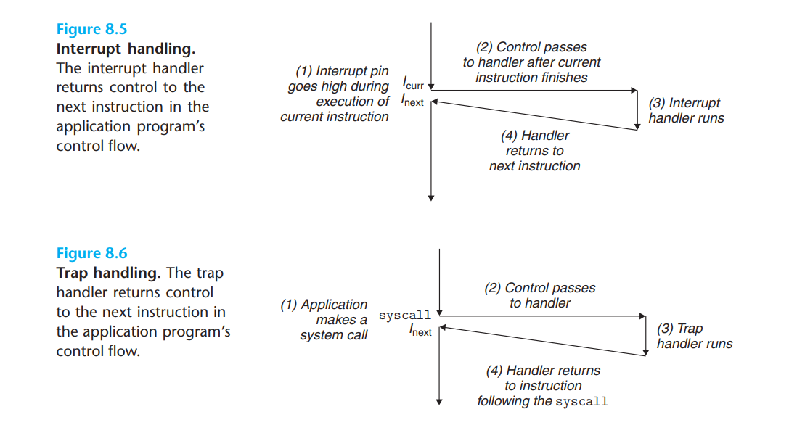


#### 陷阱

同步：异常是执行当前指令的结果，这类指令称为**故障指令（faulting instruction）**。

陷阱是有意的异常，其最重要的用途是在用户程序和内核之间提供一个像过程一样的接口，称为**系统调用（system call）**。

系统调用是用户进程向内核进程请求服务（例如读某个文件 `read`、创建新进程 `fork`、加载新的程序 `execve`、终止当前进程 `exit`）的主要方法。处理器提供了 `syscall n` 指令，为用户程序提供了对内核服务的受控的访问，它导致一个到异常处理程序的陷阱，陷阱处理程序解析参数并调用适当的内核程序。

借助异常实现系统调用，是为了从用户模式切换到内核模式。

#### 故障

如果故障处理程序可以修正这个错误情况，它就将控制返回到引起故障的指令，重新执行它。否则它返回到内核的 `abort` 例程，终止引起故障的应用程序。


#### 终止

终止是不可恢复的致命错误，例如 DRAM 或 SRAM 位被损坏时发生的奇偶错误。


### Linux/x86-64 系统中的异常

| 异常号 |        描述        |  异常类别  |
| :----: | :----------------: | :--------: |
|   0    |      除法错误      |    故障    |
|   13   |    一般保护故障    |    故障    |
|   14   |        缺页        |    故障    |
|   18   |      机器检查      |    终止    |
| 32~255 | 操作系统定义的异常 | 中断或陷阱 |

除法错误：除以零，或除法指令的结果对目标操作数来说太大了。Unix 不会试图从中恢复，而是选择终止。Linux shell 通常报告为“浮点异常（Floating exception）”

一般保护故障：程序引用未定义的虚拟内存区域、试图写只读的文本段等等。Linux 不会尝试恢复它。Linux shell 通常报告为“段错误（Segmentation fault）”

缺页：指令引用了对应的物理页面尚不在内存中的虚拟地址。缺页处理程序会将页面从磁盘复制到内存，然后重新执行引起缺页异常的指令。

机器检查：在导致故障的指令执行时检测到致命硬件错误。处理程序从不返回控制给应用程序。

#### Linux/x86-64 系统调用

每个系统调用有唯一的整数号，对应一个到内核中跳转表的偏移量（和异常表不同）

C 程序可以用 `syscall` 函数直接调用任何系统调用，但这不必要。标准库提供了各种系统调用的包装函数。系统调用及其包装函数称为**系统级函数**。

所有到 Linux 系统调用的参数都是通过通用寄存器，而非栈，传递的。按惯例，系统调用号放在 `%rax` 中，参数依次放在 `%rdi`、`%rsi`、`%rdx`、`%r10`、`%r8` 和 `%r9` 中。系统调用的返回值放在 `%rax` 中，-4095 到 -1 之间的返回值表明发生了错误，对应于负的 `errno`。从系统调用返回时，寄存器 `%rcx`、`%r11` 会被破坏。

| 编号  |   名字   |         描述         |
| :---: | :------: | :------------------: |
|   0   |  `read`  |        读文件        |
|   1   | `write`  |        写文件        |
|   2   |  `open`  |       打开文件       |
|   3   | `close`  |       关闭文件       |
|   4   |  `stat`  |     获取文件信息     |
|   9   |  `mmap`  |  将内存页映射到文件  |
|  12   |  `brk`   |       重置堆顶       |
|  32   |  `dup2`  |    复制文件描述符    |
|  33   | `pause`  | 挂起进程直到信号到达 |
|  37   | `alarm`  |  调度告警信号的传送  |
|  39   | `getpid` |     获取进程 ID      |
|  57   |  `fork`  |      创建新进程      |
|  59   | `execve` |       执行程序       |
|  60   | `_exit`  |       终止进程       |
|  61   | `wait4`  |     等待进程终止     |
|  62   |  `kill`  |    发送信号到进程    |

```c
int main() {
    // 1 表示 stdout，"hello, world\n" 是要写的内容，13 是要写的字节数
    write(1, "hello, world\n", 13);
    _exit(0);
}

// asm
.section .data
string:
    .ascii "hello, world\n"
string_end:
    .equ len, string_end - string

.section .text
.globl main
main:
    movq    $1, %rax
    movq    $1, %rdi
    movq    $string, %rsi
    movq    $len, %rdx
    syscall

    movq    $60, %rax
    movq    $0, %rdi
    syscall
```

> 有时，异常只指同步异常，不包括异步的中断。

## 进程

**进程（process）**：一个正在执行的程序的实例。

每个程序都运行在某个进程的**上下文（context）**中，上下文就是内核重新启动一个被抢占的进程所需的状态，包括内存中的程序代码和数据、用户栈、通用目的寄存器、浮点寄存器、程序计数器、状态寄存器、内核栈以及各种内核数据结构（如描述地址空间的页表、包含有关当前进程信息的进程表、包含进程已打开文件的信息的文件表）。

每次在 `shell` 中运行可执行目标文件都会让 `shell` 创建一个新进程。应用程序也可以创建进程。

进程提供两个主要的抽象：
- 一个独立的逻辑控制流，它提供了一个假象，好像程序独占地使用处理器
- 一个私有的地址空间，它提供了一个假象，好像程序独占地使用内存系统

### 逻辑控制流


如上，处理器的物理控制流被分成了三个独立的逻辑控制流，它们交错执行，轮流使用处理器。每个进程执行流的一部分，然后被**抢占（preempted）**（暂时挂起）。

### 并发流

**并发流（concurrent flow）**：一个逻辑流的执行在时间上和另一个流重叠。上图中，进程 A 和 B，A 和 C 的执行就是并发的。

一个进程执行其控制流的每一时间段称为一个时间片（time slice），进程 A 的流由两个时间片组成。并发（concurrency）、多任务（multitasking）、时间分片（time slicing）是类似的概念。

**并行流（paralell flow）**是并发流的真子集。如果两个流并发地运行在不同的处理器核或不同的计算机上，那么它们就是并行流。

### 私有地址空间

进程为每个程序提供一个私有地址空间，一般来说，这个空间中的内存字节不能被其他进程读写。

每个这样的空间都有相同的通用结构。代码段总是从 `0x400000` 起，地址空间顶部保留给内核。

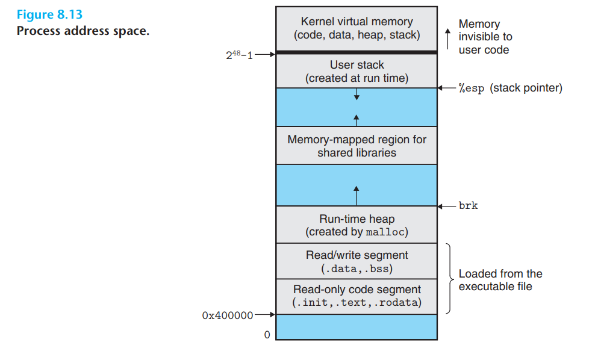

### 用户模式和内核模式

处理器通常用某个控制寄存器的一个**模式位（mode bit）**来区分用户模式和内核模式。

在内核模式下，处理器可以执行任何指令，访问系统中任何内存位置。

在用户模式下，处理器不能执行**特权指令（privileged instruction）**，例如停止处理器、改变模式位、发起 I/O 操作。用户模式下的进程也不能直接引用地址空间内核区内的代码和数据（只能通过系统调用接口），否则导致致命的保护故障。

从用户模式变为内核模式只能通过中断、故障或陷入系统调用这样的异常。

Linux 提供了 `/proc` 文件系统，将许多内核数据结构的内容输出为一个用户程序可读的文本文件的层次结构，从而允许用户模式进程访问。例如 `/proc/cpuinfo` 包含 CPU 类型。2.6 版本的 Linux 内核引用 `/sys` 文件系统，输出关于系统总线和设备的额外底层信息。

### 上下文切换

当内核决定要抢占当前进程时，它会保存该进程的上下文，然后恢复一个先前被抢占了的进程的上下文，然后将控制传递给这个新恢复的进程（称为**上下文切换（context switch）**）。这种决策称为**调度（scheduling）**，由内核中的**调度器（scheduler）**处理。

内核代表用户执行系统调用时，可能发生上下文切换。若系统调用因为等待某个事件而阻塞，内核可以让当前进程休眠，切换到另一个进程。`sleep` 系统调用可以显式请求让调用进程休眠。不过即使系统调用没有阻塞，内核也可以选择执行上下文切换。

中断也可能引起上下文切换。所有系统都有某种产生周期性定时器中断的机制，通常为每 1 ms 或每 10 ms，每次发生定时器中断时，内核判定当前进程已运行了足够长的时间，就会执行上下文切换。


上图中，进程 A 执行 `read` 系统调用陷入内核，内核陷阱处理程序请求来自磁盘控制器的 DMA 传输，然后内核执行从进程 A 到进程 B 的上下文切换。注意在切换之前，内核代表进程 A 在用户模式下执行指令，在切换的第一部分，内核代表进程 A 在内核模式下执行指令，然后某一时刻，它开始代表进程 B 在内核模式下执行指令，切换结束后，内核代表进程 B 在用户模式下执行指令。

进程 B 在用户模式运行，直到磁盘发出中断信号表示数据已经传送到内存，内核判定进程 B 已经运行了足够长的时间，执行到进程 A 的上下文切换。


## 系统调用错误处理

Unix 系统级函数遇到错误时，通常会返回 -1，并设置全局整数变量 `errno`。

```c
// 程序员总是需要检查错误 这很麻烦 可读性也很低
if (pid = fork() < 0) {
    // strerror 返回一个描述 errno 错误的字符串
    fprintf(stderr, "fork error: %s\n", strerror(errno));
    exit(0);
}

// 我们将判断错误的语句提取出来
void unix_error(char* msg) {
    fprintf(stderr, "%s: %s\n", msg, strerror(errno));
    exit(0);
}

pid_t Fork(void) {
    pid_t pid;
    if ((pid = fork()) < 0) 
        unix_error("Fork error");
    return pid;
}
```

## 进程控制

### 获取进程 ID

每个进程有唯一的正数进程 ID。

```c
#include <sys/types.h>
#include <unistd.h>

pid_t getpid(void);     // 返回调用进程的 PID
pid_t getppid(void);    // 返回调用进程父进程的 PID

// pid_t 在 Linux 上被定义为 int
```

### 创建和终止进程

从程序员角度，进程有三种状态：
- 运行：在 CPU 上执行，或等待被执行且最终会被内核调度
- 停止：进程执行被挂起（suspended），不会被调度。发生在进程收到 `SIGSTOP`、`SIGTSTP`、`SIGTTIN` 或 `SIGTTOU` 信号时，并保持停止直到收到 `SIGCONT` 信号。
- 终止：进程永远地停止了。发生在进程收到默认行为是终止进程的信号、从主程序返回、调用 `exit` 函数时。

```c
#include <stdlib.h>

void exit(int status);
// 从 main 函数返回等价于调用 exit
```

父进程通过 `fork` 创建新的运行的子进程。子进程得到与父进程用户级虚拟地址空间相同的副本（但是是**独立**的），包括相同的代码、数据段、本地变量值、堆、共享库和用户栈。子进程也拥有与父进程任何打开文件描述符相同的副本，可以读写父进程任何打开的文件。

`fork` **只被调用一次，但会返回两次**：一次在调用进程（父进程）返回子进程的 PID，一次在新创建的子进程中返回 0。可以从返回值分辨父进程和子进程。

```c
#include <sys/types.h>
#include <unistd.h>

pid_t fork(void);

int main() {
    pid_t pid;
    int x = 1;

    pid = Fork();    // wrapper function

    if (pid == 0) {  // child process
        printf("child: x = %d\n", ++x);
        exit(0);
    }

    printf("parent: x = %d\n", --x);
    exit(0);
}

// output may **differ** on different systems
// parent: x=0
// child: x=2
```

父进程和子进程是**并发运行**的独立进程，内核可以以任意方式交替执行它们逻辑控制流中的指令。在我们的例子中，父进程的 `printf` 先被执行，然后是子进程的，但在其它系统可能相反。

创建子进程后，父进程对状态的改变不会反映在子进程，子进程的改变也不会影响父进程。

父进程和子进程共享文件，父进程的 `stdout` 文件是打开的，且指向屏幕，所以子进程也继承了它，同样指向屏幕。

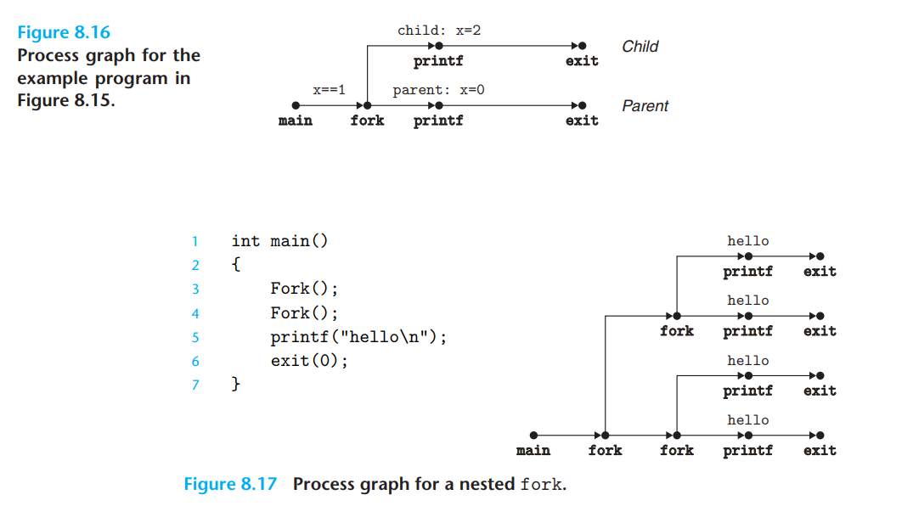

上图的嵌套 `fork` 中，四条 `printf` 可以以任意顺序执行。

### 回收子进程

进程终止后，内核不会立即将其清除。进程保持在一种已终止的状态，直到被其父进程**回收（reaped）**。父进程回收已终止的子进程时，内核将子进程的退出状态传递给父进程，然后清除已终止的子进程。终止但未被回收的进程称为**僵死进程（zombie）**。

如果父进程终止了，内核会安排 `init` 进程成为它孤儿进程的养父。`init` 进程 PID 为 1，在系统启动时由内核创建，不会终止，是所有进程的祖先。长时间运行的程序总是应该回收其僵死子进程，以节约系统的内存资源。

```c
#include <sys/types.h>
#include <sys/wait.h>

pid_t waitpid(pid_t pid, int* statusp, int options)'
```

当 `options=0` 时，`waitpid` 挂起调用进程，直到其**等待集合（wait set）**中的一个子进程终止。若等待集合中的一个进程在刚调用的时刻就已经终止了，`waitpid` 就会立即返回。这两种情况下，返回值是终止的子进程的 PID。此时已终止的子进程已经被回收，被内核清除。

等待集合的成员由参数 `pid` 确定：
- 若 `pid>0`，等待集合是一个单独的子进程，PID 为 `pid`
- 若 `pid=-1`，等待集合就是父进程的所有子进程
- 其他等待集合不做讨论

`options` 选项：
- `WNOHANG`：若等待集合中的任何子进程都还未终止，则立即返回 `0`
- `WUNTRACED`：挂起调用进程，直到等待集合的某个进程终止或停止，返回这个终止或停止的子进程的 PID
- `WCONTINUED`：挂起调用进程，直到等待集合中一个正在运行的进程终止，或一个被停止的进程收到 `SIGCONT` 信号重新开始执行
- 可以用 `|` 把这些选项组合起来

如果 `statusp` 非空，`waitpid` 会在其中放上导致返回的子进程的状态信息。`status` 是 `statusp` 指向的值，其值在 `wait.h` 被解释为：
- `WIFEXITED(status)`：若子进程通过调用 `exit` 或一个 `return` 正常终止，则返回真
- `WEXITSTATUS(status)`：返回一个正常终止的子进程的退出状态，只有在 `WIFEXITED()` 返回真时才会被定义
- `WIFSIGNALED(status)`：若子进程由于一个未被捕获的信号终止，则返回真
- `WTERMISIG(status)`：返回导致子进程终止的信号编号，只有在 `WIFSIGNALED()` 返回真时才会被定义
- `WIFSTOPPED(status)`：若引起返回的子进程当前是停止的，则返回真
- `WSTOPSIG(status)`：返回导致子进程停止的信号编号，只有在 `WIFSTOPPED()` 返回真时才会被定义
- `WCONTINUED(status)`：若引起返回的子进程收到 `SIGCONT` 信号重新启动，则返回真

若调用进程无子进程，`waitpid` 返回 -1，并设置 `errno` 为 `ECHILD`。若 `waitpid` 被一个信号中断，那么它返回 -1，并设置 `errno` 为 `EINTR`。

> 以上的常量由系统头文件定义，例如 `WNOHANG` 在 `wait.h`，`ECHILD` 在 `errno.h`

```c
#include <sys/types.h>
#include <sys/wait.h>

pid_t wait(int* statusp);

wait(&status);    // 等价于 waitpid(-1, &status, 0);
```

```c
#include "csapp.h"
#define N 2

int main() {
    int status, i;
    pid_t pid;

    // create N children
    for (i = 0; i < N; i++) {
        if ((pid = Fork()) == 0) {
            exit(100 + i);
        }
    }

    // reap N children in no particular order
    while ((pid = waitpid(-1, &status, 0)) > 0) {
        if (WIFEXITED(status)) 
            printf("child %d terminated normally with exit status=%d\n", pid, WEXITSTATUS(status));
        else 
            printf("child %d terminated abnormally\n", pid);
    }

    // no more children is the only normal termination
    if (errno != ECHILD) 
        unix_error("waitpid error");
    
    exit(0);
}
```

### 让进程休眠

```c
#include <unistd.h>

unsigned int sleep(unsigned int secs);
int pause(void);
```

`sleep` 使调用进程休眠至少 `secs` 秒，然后返回 0。如果 `sleep` 被一个信号中断而过早返回，则返回剩余的秒数。

`pause` 让调用进程休眠，直到该进程收到一个信号。

### 加载并运行程序

```c
#include <unistd.h>

int execve(const char* filename, char char* argv[], const char* envp[]);
```

`execve` 带参数列表 `argv` 和环境变量列表 `envp` 加载运行可执行目标文件 `filename`。只有当出现错误（如 `filename` 不存在）时，`execve` 才会返回到调用程序。


`execve` 启动加载器，加载器删除子进程现有的虚拟内存段，创建一组新的代码、数据、堆和栈段。新的栈和堆被初始化为零。通过将虚拟地址空间中的页映射到可执行文件的页大小的片（chunk），新的代码和数据段被初始化为可执行文件的内容。最后，加载器跳转到 `_start`，`_start` 调用 `_libc_start_main`，最终调用 `main(int argc, char* argv[], char* envp[])`


```c
#include <stdlib.h>

// getenv 在环境变量数组里搜索字符串 "name=value"
// 返回指向 value 的指针（未找到则返回空指针）
char* getenv(const char* name);

// 若 overwrite 非零，name 的值被替换为 newvalue（如果 name 不存在，则将其添加到数组）
int setenv(const char* name, const char* newvalue, int overwrite);

// 从环境变量数组中删除 name
void unsetenv(const char* name);
```

> 程序是一堆代码和数据，可以作为目标文件存在于磁盘上，或作为段存在于地址空间中。进程是执行中程序的具体实例。程序总是运行在某个进程的上下文中。`fork` 在新的进程中运行相同的程序，`execve` 在当前进程的上下文中加载运行一个新的程序，它会覆盖当前进程的地址空间，但并未创建一个新的进程，因此新的程序仍有相同的 PID，且继承了调用 `execve` 时已打开的文件描述符 


### 利用 `fork` 和 `execve` 运行程序

```c
#include "csapp.h"
#define MAXARGS 128

// If argv[0] is a builtin cmd, run it and return true
// otherwise return false
int builtin_command(char** argv) {
    if (!strcmp(argv[0], "quit")) 
        exit(0);
    if (!strcmp(argv[0], "&")) 
        return 1;
    return 0;
}

// Called by eval()
// Parse the cmd line and build argv
// Return 1 if buf end with &, 0 otherwise
int parseline(char* buf, char** argv) {
    char* delim;
    int argc;
    int bg;

    buf[strlen(buf) - 1] = ' ';    // replace trailing '\n'
    while (*buf && (*buf == ' '))  // ignore leading spaces
        buf++;
    
    // build the argv list
    argc = 0;
    while ((delim = strchr(buf, ' '))) {
        argv[argc++] = buf;
        *delim = '\0';
        buf = delim + 1;
        while (*buf && (*buf == ' '))  // ignore spaces
            buf++;
    }
    argv[argc] = NULL;

    if (argc == 0) 
        return 1;

    if ((bg = (*argv[argc - 1] == '&'))) 
        argv[--argc] = NULL;
    
    return bg;
}

// Evaluate cmd line
void eval(char* cmdline) {
    char* argv[MAXARGS];    // argument list execve()
    char buf[MAXLINE];      // holds modified cmd line
    int bg;               
    pid_t pid;            

    strcpy(buf, cmdline);
    bg = parseline(buf, argv);

    if (argv[0] == NULL)
        return;
    
    if (builtin_command(argv)) return;

    // create child process
    if ((pid = Fork()) == 0) {
        // call execve in child process
        if (execve(argv[0], argv, environ) < 0) {
            printf("%s: Command not found.\n", argv[0]);
            exit(0);
        }
    }

    // parent waits for foreground job to terminate
    if (!bg) {
        int status;
        if (waitpid(pid, &status, 0) < 0) 
            unix_error("waitfg: waitpid error");
    } else 
        printf("%d %s", pid, cmdline);
}

int main() {
    char cmdline[MAXLINE];    // command line

    while (1) {
        // read
        printf("> ");
        Fgets(cmdline, MAXLINE, stdin);
        if (feof(stdin)) 
            exit(0);

        // evaluate
        eval(cmdline);
    }
}
```

这个 shell 不回收它的后台子进程，是有缺陷的。

## 信号

